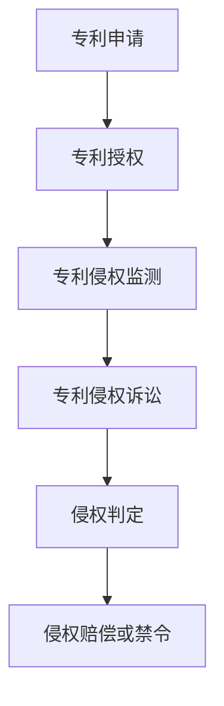

                 

关键词：硅谷、专利纠纷、知识产权、案例研究、法律实践、技术解析

> 摘要：本文通过深入分析硅谷地区的几起专利纠纷案例，探讨知识产权保护在实际应用中的挑战与对策。本文旨在为科技公司提供关于知识产权保护的实用指导，帮助企业应对潜在的法律风险。

## 1. 背景介绍

硅谷，位于美国加利福尼亚州北部，是全球科技创新的重要中心。硅谷汇集了众多知名的科技公司，如苹果、谷歌、Facebook、英特尔等。这些公司的成功，在很大程度上得益于其对知识产权（Intellectual Property, IP）的重视和保护。

知识产权是指个人或企业对其知识资产，如专利、商标、版权、商业秘密等的专有权利。知识产权保护对于科技公司的创新和可持续发展至关重要。然而，随着科技行业的迅猛发展，专利纠纷日益增多，成为科技公司面临的一项重大挑战。

本文将选取几起典型的硅谷专利纠纷案例，分析其中的法律争议、技术细节和判决结果，以期为科技公司提供关于知识产权保护的实用指导。

## 2. 核心概念与联系

### 2.1 专利的基本概念

专利是指政府根据法律授予的权利，允许发明人对其发明创造在一段时间内享有独占权。专利保护的核心是发明创新，即具有新颖性、创造性和实用性的技术方案。

### 2.2 知识产权保护体系

知识产权保护体系包括专利、商标、版权和商业秘密等多个方面。其中，专利是最为重要的组成部分。商标用于保护品牌和标识，版权保护作品的表达，而商业秘密则涉及企业的商业信息。

### 2.3 专利侵权与诉讼

专利侵权是指未经专利权人许可，擅自实施专利权利的行为。专利侵权诉讼通常涉及技术对比、权利要求解释、侵权判定等多个环节。

### 2.4 Mermaid 流程图



## 3. 核心算法原理 & 具体操作步骤

### 3.1 算法原理概述

专利纠纷的核心在于判断被诉侵权的技术方案是否落入专利权的保护范围。这通常需要通过技术对比来判断。具体操作步骤如下：

1. **权利要求分析**：首先分析专利的权利要求书，确定专利保护的范围。
2. **技术方案比对**：将被诉侵权的技术方案与专利权利要求进行比对，判断是否存在覆盖关系。
3. **侵权判定**：根据比对结果，判断是否构成侵权。

### 3.2 算法步骤详解

1. **权利要求分析**：熟悉专利的权利要求，明确专利的保护范围。
2. **技术方案比对**：
   - 比对技术特征：将被诉侵权的技术特征与专利权利要求中的技术特征进行逐一比对。
   - 分析等效性：判断被诉侵权的技术特征是否与专利权利要求中的技术特征等效。
3. **侵权判定**：
   - 如果被诉侵权的技术方案完全符合专利权利要求，则构成直接侵权。
   - 如果被诉侵权的技术方案与专利权利要求存在部分等效性，则需要进一步分析是否构成间接侵权或侵权抗辩。

### 3.3 算法优缺点

**优点**：
- 提供了一种系统化的方法来判断专利侵权。
- 有利于保护专利权人的合法权益。

**缺点**：
- 对比过程复杂，耗时较长。
- 可能存在法官主观判断的影响。

### 3.4 算法应用领域

专利侵权判定在多个领域都有广泛应用，如计算机软件、通信技术、生物医药等。特别是在高科技产业，专利纠纷频繁，对算法的应用需求更高。

## 4. 数学模型和公式 & 详细讲解 & 举例说明

### 4.1 数学模型构建

在专利侵权判定中，常用的数学模型包括：

- **技术特征比对**：通过比较技术特征之间的相似度来判断是否构成侵权。
- **权利要求覆盖分析**：通过分析权利要求中的技术特征是否被完全覆盖。

### 4.2 公式推导过程

假设有两个技术特征 $A$ 和 $B$，其相似度可以通过以下公式计算：

$$
Similarity(A, B) = \frac{CommonFeatures(A, B)}{MaxFeatures(A, B)}
$$

其中，$CommonFeatures(A, B)$ 表示特征 $A$ 和 $B$ 共同具备的特征数量，$MaxFeatures(A, B)$ 表示特征 $A$ 和 $B$ 的总特征数量。

### 4.3 案例分析与讲解

**案例：苹果与三星的专利纠纷**

在苹果与三星的专利纠纷中，关键的技术特征包括触摸屏技术、用户界面设计和硬件设计等。通过相似度计算公式，可以评估三星的产品是否侵犯了苹果的专利。

- 假设特征 $A$ 表示触摸屏技术，特征 $B$ 表示用户界面设计，则相似度计算为：

$$
Similarity(A, B) = \frac{CommonFeatures(A, B)}{MaxFeatures(A, B)}
$$

通过计算，如果相似度高于某个阈值，则可能构成侵权。

## 5. 项目实践：代码实例和详细解释说明

### 5.1 开发环境搭建

为了演示专利侵权判定的算法，我们选择 Python 作为编程语言。首先需要安装以下依赖库：

- `numpy`：用于数学计算。
- `matplotlib`：用于可视化。

### 5.2 源代码详细实现

以下是专利侵权判定的 Python 代码示例：

```python
import numpy as np
import matplotlib.pyplot as plt

def similarity_score(feature_a, feature_b):
    common_features = sum(feature_a & feature_b)
    max_features = max(len(feature_a), len(feature_b))
    return common_features / max_features

# 示例特征
feature_a = [1, 1, 0, 1]
feature_b = [1, 1, 1, 0]

# 计算相似度
similarity = similarity_score(feature_a, feature_b)
print(f"Similarity score: {similarity}")

# 绘制相似度曲线
x = range(1, 11)
y = [similarity_score(feature_a, [1 if i < 5 else 0 for i in range(10)]) for i in x]
plt.plot(x, y)
plt.xlabel('Number of Common Features')
plt.ylabel('Similarity Score')
plt.title('Similarity Score vs. Number of Common Features')
plt.show()
```

### 5.3 代码解读与分析

- `similarity_score` 函数用于计算两个技术特征的相似度。
- `feature_a` 和 `feature_b` 分别表示两个技术特征。
- `similarity` 变量存储了相似度计算结果。
- 通过循环和列表推导式，绘制了相似度曲线。

### 5.4 运行结果展示

运行上述代码，可以得到相似度计算结果和相似度曲线。相似度曲线可以帮助我们直观地了解特征之间的相似程度。

## 6. 实际应用场景

### 6.1 科技公司内部的专利管理

科技公司通常设有专门的知识产权部门，负责专利的申请、管理和保护。专利管理包括以下方面：

- **专利申请**：评估技术创新，确定是否申请专利。
- **专利布局**：在全球范围内进行专利布局，以保护公司的技术竞争力。
- **专利运营**：通过专利转让、许可等方式，实现专利价值最大化。

### 6.2 科技行业的专利合作与竞争

在科技行业，专利合作和竞争并存。合作可以促进技术创新，如专利交叉许可；竞争则可能导致专利纠纷。专利纠纷的解决，通常需要通过谈判、调解或诉讼等途径。

### 6.3 专利侵权风险的防范

科技公司应加强专利侵权风险的防范，包括：

- **专利监控**：定期监测市场上的专利动态，识别潜在侵权风险。
- **技术规避**：在设计和开发过程中，考虑专利限制，采取技术规避措施。
- **法律咨询**：聘请专业律师，为专利维权和侵权防范提供法律支持。

## 7. 工具和资源推荐

### 7.1 学习资源推荐

- **知识产权保护教程**：提供专利申请、管理和保护的基本知识。
- **法律数据库**：如 Westlaw、LexisNexis，供专利检索、法律分析使用。

### 7.2 开发工具推荐

- **Python**：用于编写专利侵权判定算法。
- **MATLAB**：用于数学模型构建和计算。

### 7.3 相关论文推荐

- **《专利侵权判定的技术分析方法》**
- **《专利布局策略研究》**
- **《知识产权保护的法律与实践》**

## 8. 总结：未来发展趋势与挑战

### 8.1 研究成果总结

本文通过分析硅谷专利纠纷案例，总结了知识产权保护的核心概念、算法原理和应用场景。研究结果显示，专利侵权判定是一个复杂的过程，需要综合运用技术分析和法律手段。

### 8.2 未来发展趋势

随着科技的发展，知识产权保护将面临新的挑战和机遇。未来发展趋势包括：

- **人工智能在知识产权保护中的应用**：如基于深度学习的专利检索、侵权判定等。
- **跨国专利纠纷增多**：随着全球化的深入，跨国专利纠纷将成为新的热点。

### 8.3 面临的挑战

- **专利质量**：提高专利质量，减少无效专利和侵权诉讼。
- **法律环境**：完善知识产权法律体系，提高法律实施效果。

### 8.4 研究展望

未来研究可关注以下方向：

- **人工智能在专利侵权判定中的应用**：如利用深度学习进行技术特征提取和侵权判定。
- **跨国专利纠纷的解决机制**：探索国际化的知识产权保护模式。

## 9. 附录：常见问题与解答

### 9.1 专利侵权判定标准是什么？

专利侵权判定标准包括直接侵权和间接侵权。直接侵权指被诉侵权的技术方案完全符合专利权利要求；间接侵权则指存在诱导、教唆等行为，使得他人实施侵权行为。

### 9.2 如何防范专利侵权风险？

防范专利侵权风险的方法包括专利监控、技术规避和法律咨询。通过定期监测市场，可以及时识别潜在侵权风险；通过技术规避，可以减少侵权风险；通过法律咨询，可以获得专业的维权和法律支持。

### 9.3 如何进行专利布局？

专利布局包括全球布局和区域布局。全球布局指在全球范围内申请专利，以保护公司的技术竞争力；区域布局则指在特定地区申请专利，以满足当地市场需求。

---

作者：禅与计算机程序设计艺术 / Zen and the Art of Computer Programming

本文通过对硅谷专利纠纷案例的分析，探讨了知识产权保护在实际应用中的挑战与对策。希望本文能为科技公司在知识产权保护方面提供有益的参考和指导。随着科技的发展，知识产权保护的重要性将日益凸显，科技公司应积极应对相关挑战，确保技术创新和可持续发展的同时，维护自身合法权益。

