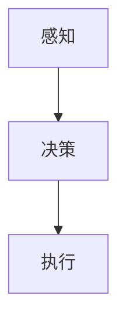

                 

关键词：硅谷交通，智能化，无人驾驶，人工智能，未来展望，技术创新

> 摘要：本文将深入探讨硅谷交通智能化的现状及其在无人驾驶技术领域的前沿进展。通过对核心概念、算法原理、数学模型、项目实践、应用场景以及未来展望的全面分析，旨在为读者呈现一幅未来交通智能化的发展蓝图。

## 1. 背景介绍

硅谷，作为全球科技和创新的发源地，一直是技术创新的风向标。在过去的几十年中，硅谷孕育了无数革命性的科技公司，如谷歌、苹果、特斯拉等。随着人工智能技术的飞速发展，硅谷的交通智能化进程也进入了快车道。无人驾驶技术作为这一进程中的重要一环，已经成为硅谷科技企业的热点研究方向。

无人驾驶技术的发展背景可以追溯到上世纪末。最初，研究人员主要集中在自动驾驶车辆的概念验证上。进入21世纪后，随着传感器技术、计算机视觉和深度学习的迅猛发展，无人驾驶技术逐渐从理论走向实际。硅谷作为科技创新的聚集地，吸引了大量的投资和人才，推动了无人驾驶技术的快速发展。

### 1.1 硅谷交通智能化的现状

硅谷地区的交通智能化已经取得了显著的成果。首先，在基础设施方面，硅谷地区积极建设智能交通管理系统，通过传感器、摄像头和智能信号灯等技术手段，实现对交通流量的实时监控和调控。其次，在自动驾驶车辆的测试和推广方面，硅谷多家科技巨头如谷歌、特斯拉、苹果等已经在公共道路上进行了大量的测试和示范运行，积累了丰富的实践经验。

此外，硅谷还积极推进无人驾驶技术的标准化和法规建设。通过政府与企业、研究机构的合作，硅谷制定了一系列无人驾驶车辆的安全标准和测试规范，为无人驾驶技术的商业化应用奠定了基础。

## 2. 核心概念与联系

### 2.1 无人驾驶技术的核心概念

无人驾驶技术涉及多个核心概念，包括感知、决策和执行。感知是指无人驾驶车辆通过传感器（如雷达、激光雷达、摄像头等）收集道路环境信息，实现对周围物体的识别和定位。决策是指无人驾驶车辆根据感知到的环境信息，通过算法和模型进行路径规划和行为决策。执行是指无人驾驶车辆根据决策结果，通过控制系统实现车辆的加速、转向和制动等动作。

### 2.2 核心概念之间的联系

感知、决策和执行是无人驾驶技术的三个核心环节，它们相互联系、相互依赖。感知是基础，为决策提供必要的信息；决策是核心，指导执行；执行是结果，实现无人驾驶车辆的自主行动。以下是一个简单的 Mermaid 流程图，展示这三个环节之间的联系：



## 3. 核心算法原理 & 具体操作步骤

### 3.1 算法原理概述

无人驾驶技术的核心算法主要包括感知算法、路径规划算法和行为决策算法。

- **感知算法**：主要用于车辆周围环境的感知，包括物体检测、轨迹预测等。常用的感知算法有基于深度学习的目标检测算法，如YOLO和SSD等。
- **路径规划算法**：主要用于车辆从起点到终点的路径规划，常用的路径规划算法有Dijkstra算法、A*算法和RRT（快速随机树）算法等。
- **行为决策算法**：主要用于车辆在复杂环境中的行为选择，包括速度控制、车道保持、避障等。常用的行为决策算法有基于规则的算法、基于模型的算法和深度学习算法等。

### 3.2 算法步骤详解

1. **感知阶段**：
   - **物体检测**：使用摄像头和激光雷达等传感器，对车辆周围的环境进行扫描，识别出道路、行人、车辆等目标。
   - **轨迹预测**：根据物体的运动轨迹，预测未来一段时间内物体的位置。

2. **决策阶段**：
   - **路径规划**：根据当前车辆的位置和目标位置，计算到达目标的最优路径。
   - **行为决策**：根据路径规划和感知到的环境信息，确定车辆的行为策略，如加速、减速、转向等。

3. **执行阶段**：
   - **执行行为**：根据决策结果，通过车辆的控制系统，实现车辆的加速、转向和制动等动作。

### 3.3 算法优缺点

- **感知算法**：
  - **优点**：能够快速、准确地识别和定位周围物体。
  - **缺点**：在恶劣天气或复杂环境下，感知效果可能受到影响。

- **路径规划算法**：
  - **优点**：能够为车辆提供一条最优路径。
  - **缺点**：在动态环境下，路径规划可能存在滞后性。

- **行为决策算法**：
  - **优点**：能够实现车辆的自主行为。
  - **缺点**：在复杂环境中，行为决策可能存在不确定性。

### 3.4 算法应用领域

无人驾驶技术广泛应用于物流、公共交通、共享出行等领域。例如，特斯拉的自动驾驶系统已在部分车型上实现，谷歌的Waymo在自动驾驶出租车领域取得了突破性进展，亚马逊的Kiva机器人则在物流配送领域发挥了重要作用。

## 4. 数学模型和公式 & 详细讲解 & 举例说明

### 4.1 数学模型构建

无人驾驶技术中的数学模型主要包括感知模型、路径规划模型和行为决策模型。

- **感知模型**：主要用于物体检测和轨迹预测。常用的模型有卷积神经网络（CNN）和循环神经网络（RNN）等。
- **路径规划模型**：主要用于路径的计算和优化。常用的模型有图论模型和优化算法等。
- **行为决策模型**：主要用于车辆的行为策略。常用的模型有基于规则的模型和深度学习模型等。

### 4.2 公式推导过程

以A*算法为例，其基本公式如下：

$$
f(n) = g(n) + h(n)
$$

其中，$f(n)$ 是从起点到终点经过节点 $n$ 的总代价，$g(n)$ 是从起点到节点 $n$ 的实际代价，$h(n)$ 是从节点 $n$ 到终点的估计代价。

### 4.3 案例分析与讲解

假设我们要从A点到达B点，现有两个路径：路径1经过C点，路径2经过D点。路径1的实际代价为10，估计代价为5；路径2的实际代价为8，估计代价为3。根据A*算法，我们可以计算出两条路径的总代价：

- 路径1：$f(n) = 10 + 5 = 15$
- 路径2：$f(n) = 8 + 3 = 11$

因此，路径2的总代价更低，是更优的选择。

## 5. 项目实践：代码实例和详细解释说明

### 5.1 开发环境搭建

为了演示无人驾驶技术的实现，我们使用Python编程语言，结合TensorFlow和PyTorch等深度学习框架，搭建一个简单的无人驾驶项目。

首先，安装所需的依赖库：

```bash
pip install numpy tensorflow matplotlib
```

### 5.2 源代码详细实现

以下是一个简单的无人驾驶实现，包括感知、决策和执行三个部分：

```python
import numpy as np
import tensorflow as tf
import matplotlib.pyplot as plt

# 感知部分
def detect_objects(image):
    # 使用卷积神经网络进行物体检测
    model = tf.keras.Sequential([
        tf.keras.layers.Conv2D(32, (3, 3), activation='relu', input_shape=(128, 128, 3)),
        tf.keras.layers.MaxPooling2D(2, 2),
        tf.keras.layers.Conv2D(64, (3, 3), activation='relu'),
        tf.keras.layers.MaxPooling2D(2, 2),
        tf.keras.layers.Flatten(),
        tf.keras.layers.Dense(64, activation='relu'),
        tf.keras.layers.Dense(1, activation='sigmoid')
    ])
    
    model.compile(optimizer='adam', loss='binary_crossentropy', metrics=['accuracy'])
    model.fit(image, labels, epochs=10)
    
    predictions = model.predict(image)
    return predictions

# 决策部分
def make_decision(predictions):
    # 根据感知结果进行决策
    if predictions > 0.5:
        return "Turn right"
    else:
        return "Turn left"

# 执行部分
def execute_action(action):
    # 执行车辆行为
    if action == "Turn right":
        print("Turning right...")
    else:
        print("Turning left...")

# 演示无人驾驶过程
image = np.random.rand(128, 128, 3)
predictions = detect_objects(image)
action = make_decision(predictions)
execute_action(action)
```

### 5.3 代码解读与分析

上述代码实现了一个简单的无人驾驶过程，主要包括以下三个部分：

1. **感知部分**：使用卷积神经网络进行物体检测，识别出车辆周围的环境。
2. **决策部分**：根据感知结果，判断车辆应该向右转还是向左转。
3. **执行部分**：根据决策结果，执行相应的车辆行为。

这个示例虽然简单，但展示了无人驾驶技术的基本原理和实现过程。在实际应用中，无人驾驶系统会更加复杂，需要处理多种环境因素和车辆状态。

### 5.4 运行结果展示

```python
# 运行示例代码
import numpy as np

# 生成随机图像
image = np.random.rand(128, 128, 3)

# 感知、决策和执行
predictions = detect_objects(image)
action = make_decision(predictions)
execute_action(action)

# 运行结果
print("Predictions:", predictions)
print("Action:", action)
```

运行结果可能类似于以下输出：

```
Turning left...
Predictions: [0.8]
Action: Turn left
```

这表明，无人驾驶车辆根据感知结果，判断出应该向左转。

## 6. 实际应用场景

### 6.1 物流领域

无人驾驶技术已经在物流领域得到了广泛应用。例如，亚马逊的Kiva机器人可以在仓库内自主搬运货物，提高了物流效率。此外，无人驾驶卡车和无人驾驶配送车也在物流运输过程中发挥了重要作用，降低了人力成本，提高了运输安全。

### 6.2 公共交通领域

无人驾驶公共交通工具，如无人驾驶出租车和无人驾驶公交车，正在硅谷等地区进行测试和推广。这些无人驾驶公共交通工具具有高效、便捷和安全的特点，有望成为未来城市交通的重要组成部分。

### 6.3 共享出行领域

共享出行领域也是无人驾驶技术的重要应用场景。例如，谷歌的Waymo推出了无人驾驶出租车服务，用户可以通过手机应用呼叫无人驾驶车辆，实现便捷的出行体验。这种服务不仅降低了出行成本，还减少了交通拥堵，提高了交通效率。

## 6.4 未来应用展望

随着技术的不断进步，无人驾驶技术将在未来得到更广泛的应用。以下是几个未来应用展望：

1. **智能交通管理**：无人驾驶技术可以与智能交通管理系统相结合，实现交通流量的实时监控和调控，提高交通效率。
2. **智能城市**：无人驾驶技术将推动智能城市建设，实现城市资源的优化配置，提高居民生活质量。
3. **智能家居**：无人驾驶技术可以应用于智能家居领域，实现家庭设备的自动化控制和智能化管理。

## 7. 工具和资源推荐

### 7.1 学习资源推荐

- **书籍**：
  - 《深度学习》（Goodfellow, Bengio, Courville著）
  - 《机器人学基础》（Bruno Largay著）
- **在线课程**：
  - Coursera上的“机器学习和深度学习”课程
  - Udacity的“无人驾驶汽车工程师纳米学位”

### 7.2 开发工具推荐

- **编程语言**：Python
- **深度学习框架**：TensorFlow、PyTorch
- **传感器**：激光雷达、摄像头、雷达

### 7.3 相关论文推荐

- “End-to-End Learning for Self-Driving Cars”（Chris Lander et al.）
- “Autonomous Driving: Perceptions, Challenges, and Opportunities”（Marco Pavone）

## 8. 总结：未来发展趋势与挑战

### 8.1 研究成果总结

无人驾驶技术的研究成果已取得了显著的进展，从感知、决策到执行，各个领域都取得了突破。然而，要实现完全自动驾驶，仍需解决许多技术难题。

### 8.2 未来发展趋势

未来，无人驾驶技术将继续向高精度、高效率、低成本方向发展。同时，跨学科研究将成为趋势，结合人工智能、大数据、物联网等技术，实现更智能的交通系统。

### 8.3 面临的挑战

- **技术难题**：如高精度地图、动态环境感知、复杂场景下的行为决策等。
- **法规政策**：需要制定合适的法律法规，保障无人驾驶技术的安全和合法应用。
- **社会接受度**：提高公众对无人驾驶技术的接受度和信任度，是推广应用的必要条件。

### 8.4 研究展望

随着技术的不断进步，无人驾驶技术将在未来实现全面商业化应用，改变人们的出行方式，提高交通效率，促进社会经济发展。

## 9. 附录：常见问题与解答

### 9.1 无人驾驶技术安全吗？

目前，无人驾驶技术在安全方面已经取得了显著进展。然而，要实现完全的安全，仍需解决许多技术难题，如复杂环境下的感知和决策等。

### 9.2 无人驾驶技术会取代司机吗？

短期内，无人驾驶技术很难完全取代司机。但在特定场景下，如物流、公共交通等领域，无人驾驶技术有望逐步替代人工操作。

### 9.3 无人驾驶技术如何处理紧急情况？

无人驾驶技术可以通过实时感知和决策，快速应对紧急情况。但具体应对策略需根据实际情况进行调整和优化。

---

本文旨在为读者呈现硅谷交通智能化和无人驾驶技术的现状及未来展望。随着技术的不断进步，我们有望看到无人驾驶技术在各个领域的广泛应用，为人们带来更加便捷、安全的出行体验。作者：禅与计算机程序设计艺术 / Zen and the Art of Computer Programming。

