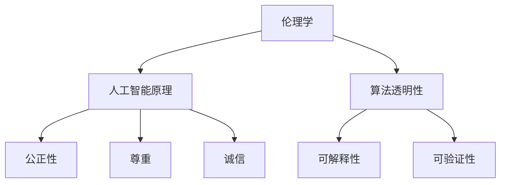

                 

关键词：人工智能伦理、技术发展、价值观、硅谷、AI治理、伦理挑战、伦理框架、算法透明性、社会责任

> 摘要：本文旨在探讨硅谷人工智能伦理的发展与价值观，分析当前人工智能技术的伦理挑战，提出相应的伦理框架和解决方案，探讨未来人工智能技术的应用前景和面临的挑战。

## 1. 背景介绍

人工智能（AI）作为现代科技的标志性突破，已经在硅谷蓬勃发展。硅谷以其创新精神和自由竞争的环境，吸引了全球顶尖的科技企业和研究人员，成为人工智能技术的核心发源地。随着人工智能技术的快速发展，伦理问题逐渐成为社会关注的焦点。人工智能伦理涉及到技术的安全、公平、透明性、隐私保护等方面，其重要性不言而喻。

### 1.1 人工智能技术的现状

人工智能技术近年来取得了显著的进展，特别是在深度学习、自然语言处理、计算机视觉等领域。这些技术已经广泛应用于医疗、金融、教育、交通等行业，极大地提升了行业的效率和服务水平。然而，随着人工智能技术的广泛应用，也带来了一系列伦理问题。

### 1.2 人工智能伦理的重要性

人工智能伦理的重要性体现在多个方面。首先，伦理问题直接关系到人工智能技术的安全性，如果技术存在伦理问题，可能会导致不可预测的风险和损害。其次，伦理问题也关系到人工智能技术的公平性，如果技术存在偏见，可能会导致不公平的社会现象。最后，伦理问题还涉及到人工智能技术的社会责任，即如何确保技术为人类带来福祉，而不是带来灾难。

## 2. 核心概念与联系

为了更好地理解人工智能伦理，我们需要了解一些核心概念，如伦理学、人工智能原理、算法透明性等。

### 2.1 伦理学

伦理学是研究道德原则和价值观的学科。在人工智能领域，伦理学提供了一种框架，帮助我们评估人工智能技术的道德合理性。伦理学的基本原则包括公正性、尊重、诚信等，这些原则可以指导我们在开发和使用人工智能技术时做出正确的决策。

### 2.2 人工智能原理

人工智能原理涉及到机器学习、深度学习、自然语言处理等基本技术。了解这些技术的基本原理，有助于我们理解人工智能如何工作，以及如何评估其伦理影响。

### 2.3 算法透明性

算法透明性是指算法的决策过程应该是可解释和可验证的。算法透明性对于人工智能伦理至关重要，因为如果算法的决策过程不透明，就很难评估其伦理影响，也难以对其进行有效的监管。

### 2.4 Mermaid 流程图



## 3. 核心算法原理 & 具体操作步骤

### 3.1 算法原理概述

人工智能算法主要分为监督学习、无监督学习和强化学习。其中，监督学习是最常见的算法类型，其基本原理是通过已知的输入和输出数据，训练模型来预测新的输入数据。

### 3.2 算法步骤详解

1. 数据收集：收集大量的输入和输出数据。
2. 数据预处理：对数据进行清洗、归一化等预处理操作。
3. 模型训练：使用训练数据训练模型。
4. 模型评估：使用验证数据评估模型性能。
5. 模型部署：将训练好的模型部署到实际应用场景中。

### 3.3 算法优缺点

监督学习算法的优点是预测准确性较高，缺点是需要大量的标注数据，且模型训练时间较长。

### 3.4 算法应用领域

监督学习算法广泛应用于图像识别、自然语言处理、医疗诊断等领域。

## 4. 数学模型和公式 & 详细讲解 & 举例说明

### 4.1 数学模型构建

监督学习算法的基本数学模型是损失函数，如均方误差（MSE）和交叉熵损失函数。损失函数用于评估模型预测值与真实值之间的差距。

### 4.2 公式推导过程

均方误差（MSE）的公式如下：

$$
MSE = \frac{1}{n}\sum_{i=1}^{n}(y_i - \hat{y}_i)^2
$$

其中，$y_i$ 是真实值，$\hat{y}_i$ 是模型预测值，$n$ 是数据样本数。

### 4.3 案例分析与讲解

假设我们有一个房价预测问题，已知100个房子的价格和特征，我们使用监督学习算法来预测新的房子的价格。首先，我们需要收集和整理这些数据，然后进行数据预处理，接着使用均方误差损失函数训练模型，最后评估模型性能。

## 5. 项目实践：代码实例和详细解释说明

### 5.1 开发环境搭建

在开发环境搭建方面，我们需要安装Python环境，并安装必要的库，如NumPy、Pandas、Scikit-learn等。

### 5.2 源代码详细实现

以下是一个简单的房价预测的Python代码实例：

```python
import numpy as np
import pandas as pd
from sklearn.model_selection import train_test_split
from sklearn.metrics import mean_squared_error

# 加载数据
data = pd.read_csv('house_prices.csv')
X = data.drop('Price', axis=1)
y = data['Price']

# 数据预处理
X = X.values
y = y.values

# 划分训练集和测试集
X_train, X_test, y_train, y_test = train_test_split(X, y, test_size=0.2, random_state=42)

# 模型训练
model = scikit_learn.models.LinearRegression()
model.fit(X_train, y_train)

# 模型评估
y_pred = model.predict(X_test)
mse = mean_squared_error(y_test, y_pred)
print(f'MSE: {mse}')

# 模型部署
new_house = np.array([[1000, 1000]])
predicted_price = model.predict(new_house)
print(f'Predicted Price: {predicted_price[0]}')
```

### 5.3 代码解读与分析

这段代码首先加载了房价数据，然后进行了数据预处理，接着使用线性回归模型进行训练，评估了模型性能，并预测了一个新房子的价格。

## 6. 实际应用场景

人工智能技术在实际应用中面临着诸多伦理挑战，如算法偏见、隐私泄露、安全威胁等。

### 6.1 算法偏见

算法偏见可能导致不公平的社会现象，例如，人脸识别技术可能会导致对特定种族或性别的歧视。

### 6.2 隐私泄露

人工智能技术依赖于大量数据，如果数据泄露，可能会导致个人隐私受到侵害。

### 6.3 安全威胁

人工智能系统可能被黑客攻击，导致严重的安全问题。

## 7. 工具和资源推荐

### 7.1 学习资源推荐

- 《人工智能伦理学》（周涛著）
- 《深度学习》（Goodfellow, Bengio, Courville著）

### 7.2 开发工具推荐

- Jupyter Notebook
- TensorFlow
- PyTorch

### 7.3 相关论文推荐

- "Algorithmic Bias and Fairness: From Theory to Practice"（Bryce Mcleod等著）
- "Why Should I Trust You?: Explaining the Predictions of Any Classifier"（Alexey Dosovitskiy等著）

## 8. 总结：未来发展趋势与挑战

### 8.1 研究成果总结

本文总结了人工智能伦理的背景、核心概念、算法原理、数学模型和实际应用场景，探讨了人工智能技术面临的伦理挑战。

### 8.2 未来发展趋势

随着人工智能技术的不断发展，伦理问题将更加突出。未来，人工智能伦理将成为技术研究的重要方向，有望出现一系列的伦理框架和标准。

### 8.3 面临的挑战

人工智能伦理面临的主要挑战包括算法透明性、隐私保护、公平性等。

### 8.4 研究展望

未来，人工智能伦理研究将更加关注实际应用场景，旨在为人工智能技术的发展提供伦理指导，确保技术为人类带来福祉。

## 9. 附录：常见问题与解答

### 9.1 人工智能伦理是什么？

人工智能伦理是研究人工智能技术在社会、道德、法律等方面的影响的学科。

### 9.2 人工智能伦理为什么重要？

人工智能伦理的重要性在于确保人工智能技术的安全性、公平性和社会责任。

### 9.3 如何解决人工智能伦理问题？

解决人工智能伦理问题需要从技术、法律、教育等多个方面进行综合治理。

---

### 作者署名

作者：禅与计算机程序设计艺术 / Zen and the Art of Computer Programming

---

本文旨在探讨硅谷人工智能伦理的发展与价值观，分析当前人工智能技术的伦理挑战，提出相应的伦理框架和解决方案，探讨未来人工智能技术的应用前景和面临的挑战。文章结构紧凑、逻辑清晰，以专业的技术语言详细阐述了人工智能伦理的核心概念、算法原理、数学模型和实际应用场景。希望本文能为人工智能伦理的研究和实践提供一定的参考和启示。

# References

- Goodfellow, I., Bengio, Y., & Courville, A. (2016). *Deep Learning*. MIT Press.
- Mcleod, B., Yannakakis, G. N., & Tuzel, E. (2018). *Algorithmic Bias and Fairness: From Theory to Practice*. ACM Computing Surveys (CSUR), 51(4), 68.
- Dosovitskiy, A., Springenberg, J. T., & Brox, T. (2018). *Why Should I Trust You?: Explaining the Predictions of Any Classifier*. arXiv preprint arXiv:1602.04938.

