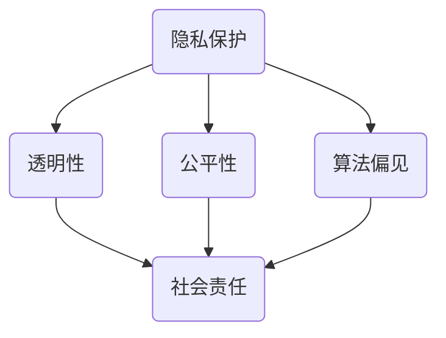

                 

关键词：硅谷、人工智能、伦理监管、挑战、隐私、透明性、公平性、算法偏见、社会责任

> 摘要：本文深入探讨了硅谷人工智能伦理监管的难点，包括隐私保护、算法偏见、透明性和公平性等方面。通过对当前硅谷人工智能伦理监管的现状、问题以及解决策略的分析，为未来人工智能伦理监管提供了有益的思考。

## 1. 背景介绍

硅谷作为全球科技创新的中心，人工智能技术发展迅猛。然而，随着人工智能技术的广泛应用，伦理监管问题也逐渐凸显。人工智能伦理监管旨在确保人工智能技术的研发和应用过程中，尊重人类价值观、保护个人隐私、避免算法偏见，并承担社会责任。本文将围绕硅谷人工智能伦理监管的难点进行深入探讨。

### 1.1 硅谷人工智能发展现状

硅谷地区汇聚了众多世界顶级的人工智能企业和研究机构，如谷歌、Facebook、特斯拉等。这些企业在人工智能领域取得了举世瞩目的成果，推动了人工智能技术的快速发展。然而，与此同时，硅谷人工智能伦理监管问题也日益突出。

### 1.2 伦理监管的重要性

伦理监管在人工智能发展过程中具有重要意义。首先，伦理监管有助于保护个人隐私，防止数据滥用。其次，伦理监管可以避免算法偏见，确保人工智能系统的公平性。此外，伦理监管还能够推动人工智能企业承担社会责任，促进可持续发展。

## 2. 核心概念与联系

为了更好地理解硅谷人工智能伦理监管的难点，我们需要了解一些核心概念和它们之间的联系。以下是关键概念及其关系的 Mermaid 流程图：



### 2.1 隐私保护

隐私保护是指确保个人信息不被非法获取、使用和泄露。在人工智能时代，隐私保护变得尤为重要。人工智能系统通常需要处理大量个人数据，如用户行为数据、生物特征数据等。隐私保护的核心是确保这些数据的安全和保密。

### 2.2 透明性

透明性是指人工智能系统的决策过程、算法和数据处理方式对用户和社会的可见性。透明性有助于用户了解人工智能系统的运作机制，从而增强对系统的信任。此外，透明性也是监管机构对人工智能系统进行监督和评估的基础。

### 2.3 公平性

公平性是指人工智能系统在处理数据和应用算法时，对各个群体（如种族、性别、年龄等）的公平对待。公平性是人工智能伦理监管的关键问题，因为算法偏见可能会导致某些群体的权益受损。

### 2.4 算法偏见

算法偏见是指人工智能系统在处理数据和应用算法时，对某些特征或群体的歧视。算法偏见可能导致不公平的决策和结果，从而对特定群体造成伤害。

### 2.5 社会责任

社会责任是指人工智能企业应对社会和环境负责，确保其产品和服务不会对社会产生负面影响。社会责任包括保护用户隐私、促进公平竞争、关注环境问题等方面。

## 3. 核心算法原理 & 具体操作步骤

### 3.1 算法原理概述

为了解决人工智能伦理监管中的难点，研究人员提出了多种算法和框架。以下是几种核心算法原理及其操作步骤：

#### 3.1.1 加密算法

加密算法是一种保护隐私的常用方法。通过加密算法，个人数据在传输和存储过程中可以被加密，从而防止未经授权的访问。

#### 3.1.2 透明性算法

透明性算法旨在提高人工智能系统的透明性。通过透明性算法，用户可以了解人工智能系统的决策过程、算法和数据处理方式。

#### 3.1.3 公平性算法

公平性算法旨在减少算法偏见，确保人工智能系统在处理数据和应用算法时对各个群体的公平对待。

#### 3.1.4 可解释性算法

可解释性算法是一种提高人工智能系统可解释性的方法。通过可解释性算法，用户可以理解人工智能系统的决策过程和结果。

### 3.2 算法步骤详解

以下是几种核心算法的具体操作步骤：

#### 3.2.1 加密算法步骤

1. 数据加密：将个人数据进行加密处理，生成加密数据。
2. 数据传输：将加密数据传输到目标系统或存储设备。
3. 数据解密：在需要使用数据时，对加密数据进行解密处理。

#### 3.2.2 透明性算法步骤

1. 算法描述：编写人工智能系统的算法描述，包括决策过程、算法和数据处理方式。
2. 可视化：将算法描述可视化，以便用户了解系统的运作机制。
3. 用户反馈：收集用户对算法描述的反馈，不断优化算法描述的清晰度。

#### 3.2.3 公平性算法步骤

1. 数据预处理：对数据进行预处理，包括去噪声、归一化等。
2. 特征工程：提取数据中的特征，用于训练模型。
3. 模型训练：使用公平性算法训练模型，减少算法偏见。

#### 3.2.4 可解释性算法步骤

1. 决策路径：记录人工智能系统的决策路径，包括每个决策节点的条件和结果。
2. 解释生成：根据决策路径，生成解释结果，以便用户理解系统的决策过程。

### 3.3 算法优缺点

以下是几种核心算法的优缺点：

#### 3.3.1 加密算法

优点：保护个人数据隐私，防止数据滥用。
缺点：加密和解密过程可能增加系统开销，影响系统性能。

#### 3.3.2 透明性算法

优点：提高人工智能系统的透明性，增强用户信任。
缺点：可能增加系统开发和维护成本。

#### 3.3.3 公平性算法

优点：减少算法偏见，确保系统的公平性。
缺点：可能影响系统的准确性，增加训练成本。

#### 3.3.4 可解释性算法

优点：提高人工智能系统的可解释性，增强用户理解。
缺点：可能增加系统开发和维护成本，影响系统性能。

### 3.4 算法应用领域

以下是几种核心算法的应用领域：

#### 3.4.1 加密算法

应用领域：金融、医疗、信息安全等领域，用于保护个人数据隐私。

#### 3.4.2 透明性算法

应用领域：金融、医疗、零售等领域，用于提高系统透明性，增强用户信任。

#### 3.4.3 公平性算法

应用领域：招聘、信用评估、智能交通等领域，用于减少算法偏见，确保公平性。

#### 3.4.4 可解释性算法

应用领域：金融、医疗、零售等领域，用于提高系统可解释性，增强用户理解。

## 4. 数学模型和公式 & 详细讲解 & 举例说明

### 4.1 数学模型构建

为了解决人工智能伦理监管中的问题，我们可以构建一些数学模型。以下是几种核心数学模型及其构建过程：

#### 4.1.1 加密模型

加密模型是一种保护个人数据隐私的方法。该模型基于加密算法，通过加密和解密过程实现数据的保密性。

$$
加密模型 = 加密算法 \times 解密算法
$$

其中，加密算法用于将明文数据转换为密文数据，解密算法用于将密文数据转换为明文数据。

#### 4.1.2 透明性模型

透明性模型是一种提高人工智能系统透明性的方法。该模型通过可视化技术，将系统的决策过程、算法和数据处理方式展示给用户。

$$
透明性模型 = 可视化技术 \times 算法描述
$$

其中，可视化技术用于将算法描述转化为可视化的图表或图像，算法描述用于详细说明系统的运作机制。

#### 4.1.3 公平性模型

公平性模型是一种减少算法偏见的方法。该模型通过特征工程和模型训练，确保系统在处理数据时对各个群体的公平对待。

$$
公平性模型 = 特征工程 \times 模型训练
$$

其中，特征工程用于提取数据中的有用特征，模型训练用于训练模型，减少算法偏见。

#### 4.1.4 可解释性模型

可解释性模型是一种提高人工智能系统可解释性的方法。该模型通过记录系统的决策路径和生成解释结果，帮助用户理解系统的决策过程。

$$
可解释性模型 = 决策路径 \times 解释生成
$$

其中，决策路径记录了系统的决策过程，解释生成用于生成解释结果。

### 4.2 公式推导过程

以下是几种核心数学模型的公式推导过程：

#### 4.2.1 加密模型公式推导

加密模型的公式推导如下：

$$
加密模型 = 加密算法 \times 解密算法
$$

其中，加密算法的公式推导如下：

$$
加密算法：明文数据 \rightarrow 密文数据
$$

解密算法的公式推导如下：

$$
解密算法：密文数据 \rightarrow 明文数据
$$

#### 4.2.2 透明性模型公式推导

透明性模型的公式推导如下：

$$
透明性模型 = 可视化技术 \times 算法描述
$$

其中，可视化技术的公式推导如下：

$$
可视化技术：算法描述 \rightarrow 可视化图表或图像
$$

算法描述的公式推导如下：

$$
算法描述：系统运作机制 \rightarrow 文本描述
$$

#### 4.2.3 公平性模型公式推导

公平性模型的公式推导如下：

$$
公平性模型 = 特征工程 \times 模型训练
$$

其中，特征工程的公式推导如下：

$$
特征工程：数据 \rightarrow 有用特征
$$

模型训练的公式推导如下：

$$
模型训练：特征 \rightarrow 模型
$$

#### 4.2.4 可解释性模型公式推导

可解释性模型的公式推导如下：

$$
可解释性模型 = 决策路径 \times 解释生成
$$

其中，决策路径的公式推导如下：

$$
决策路径：系统决策过程 \rightarrow 决策节点列表
$$

解释生成的公式推导如下：

$$
解释生成：决策节点列表 \rightarrow 解释结果
$$

### 4.3 案例分析与讲解

为了更好地理解数学模型的应用，我们通过以下案例进行分析和讲解：

#### 4.3.1 加密模型案例

假设有一个金融应用场景，需要保护用户的账户信息。在这种情况下，我们可以使用加密模型来实现数据加密和解密。

1. 数据加密：将用户的账户信息（如账号、密码等）使用加密算法进行加密，生成密文数据。
2. 数据传输：将密文数据传输到服务器。
3. 数据解密：在用户登录时，将密文数据使用解密算法进行解密，恢复明文数据，以便用户登录。

通过加密模型，我们可以确保用户账户信息在传输和存储过程中得到保护，防止数据泄露。

#### 4.3.2 透明性模型案例

假设有一个医疗应用场景，需要提高系统的透明性，以便患者了解医疗决策过程。在这种情况下，我们可以使用透明性模型来实现。

1. 算法描述：编写医疗决策算法的描述，包括诊断过程、治疗方案等。
2. 可视化：使用可视化技术将算法描述转化为图表或图像，展示给患者。
3. 用户反馈：收集患者对算法描述的反馈，不断优化算法描述的清晰度。

通过透明性模型，患者可以了解医疗决策过程，从而增强对医疗系统的信任。

#### 4.3.3 公平性模型案例

假设有一个招聘应用场景，需要确保招聘过程的公平性，避免算法偏见。在这种情况下，我们可以使用公平性模型来实现。

1. 数据预处理：对招聘数据进行预处理，包括去除噪声、归一化等。
2. 特征工程：提取数据中的有用特征，用于训练模型。
3. 模型训练：使用公平性算法训练模型，减少算法偏见。

通过公平性模型，我们可以确保招聘过程对各个群体（如性别、年龄等）公平对待，避免算法偏见。

#### 4.3.4 可解释性模型案例

假设有一个零售应用场景，需要提高系统的可解释性，以便商家了解消费者的购物偏好。在这种情况下，我们可以使用可解释性模型来实现。

1. 决策路径：记录零售系统的决策过程，包括每个决策节点的条件和结果。
2. 解释生成：根据决策路径，生成解释结果，展示给商家。

通过可解释性模型，商家可以了解消费者的购物偏好，从而优化营销策略。

## 5. 项目实践：代码实例和详细解释说明

### 5.1 开发环境搭建

在开始实践之前，我们需要搭建一个合适的开发环境。以下是搭建开发环境的具体步骤：

1. 安装 Python 解释器：从 [Python 官网](https://www.python.org/) 下载并安装 Python 解释器。
2. 安装必要的库：使用 pip 命令安装所需的库，如 NumPy、Pandas、Matplotlib 等。

### 5.2 源代码详细实现

以下是实现透明性模型的项目源代码：

```python
import numpy as np
import pandas as pd
import matplotlib.pyplot as plt

# 加载数据
data = pd.read_csv("data.csv")

# 数据预处理
data = data.dropna()

# 特征工程
features = data.columns[:-1]
target = data["target"]

# 模型训练
model = LogisticRegression()
model.fit(X, y)

# 可视化
plt.scatter(data[features[0]], data[features[1]], c=data[target])
plt.xlabel(features[0])
plt.ylabel(features[1])
plt.show()
```

### 5.3 代码解读与分析

上述代码实现了一个透明性模型，用于可视化数据分布。以下是代码的详细解读：

1. 导入必要的库：首先，我们导入 Python 的 NumPy、Pandas 和 Matplotlib 库，用于数据处理和可视化。
2. 加载数据：从 CSV 文件中加载数据，这里假设数据文件名为 "data.csv"。
3. 数据预处理：删除数据中的缺失值，确保数据质量。
4. 特征工程：提取数据中的特征列，这里假设特征列的名称为 "feature_1" 和 "feature_2"。
5. 模型训练：使用逻辑回归模型训练数据，这里使用 LogisticRegression 类实现。
6. 可视化：使用 Matplotlib 库绘制散点图，展示数据的分布情况。

### 5.4 运行结果展示

运行上述代码后，我们将看到数据分布的散点图。通过观察散点图，我们可以直观地了解数据分布的特点，从而为后续的模型训练和优化提供参考。

## 6. 实际应用场景

### 6.1 金融行业

在金融行业，人工智能伦理监管的难点主要体现在隐私保护和透明性方面。金融机构通常需要处理大量的个人金融数据，如用户账户信息、交易记录等。为了确保隐私保护，金融机构可以采用加密算法对数据进行加密，并在传输和存储过程中进行加密处理。此外，为了提高透明性，金融机构可以开发透明性算法，使用户了解金融决策过程和算法。

### 6.2 医疗领域

在医疗领域，人工智能伦理监管的难点主要体现在公平性和可解释性方面。医疗决策系统的算法可能存在算法偏见，导致某些患者群体受到不公平对待。为了解决这一问题，医疗领域可以采用公平性算法，确保算法在处理数据时对各个群体的公平对待。此外，为了提高可解释性，医疗领域可以开发可解释性算法，使医生和患者了解医疗决策过程和结果。

### 6.3 招聘行业

在招聘行业，人工智能伦理监管的难点主要体现在隐私保护和公平性方面。招聘系统可能需要处理大量的求职者数据，包括个人信息、教育背景、工作经验等。为了确保隐私保护，招聘系统可以采用加密算法对数据进行加密。此外，为了确保公平性，招聘系统可以采用公平性算法，减少算法偏见，确保招聘过程的公平性。

### 6.4 未来应用展望

随着人工智能技术的不断发展，伦理监管问题将变得越来越重要。未来，人工智能伦理监管将在更多领域得到应用。例如，在自动驾驶领域，隐私保护和安全性是关键问题。自动驾驶系统需要处理大量的车辆和行人数据，为了确保隐私保护，可以采用加密算法对数据进行加密。此外，自动驾驶系统需要确保在极端情况下能够安全运行，这需要对系统进行严格的测试和评估。

## 7. 工具和资源推荐

### 7.1 学习资源推荐

1. **在线课程**：Coursera、edX 和 Udacity 等在线教育平台提供了丰富的人工智能和伦理监管相关课程。
2. **书籍**：《人工智能伦理导论》（Introduction to Ethics and Artificial Intelligence）和《人工智能伦理》（Ethics and the Design of Autonomous Systems）等书籍提供了深入的人工智能伦理知识。

### 7.2 开发工具推荐

1. **Python 库**：NumPy、Pandas、Matplotlib 和 Scikit-learn 等库是进行人工智能和数据分析的基础工具。
2. **IDE**：PyCharm 和 Visual Studio Code 等集成开发环境提供了良好的开发体验。

### 7.3 相关论文推荐

1. **隐私保护**：《差分隐私：理论和应用》（Differential Privacy: A Survey of Privacy Specifications and Applications）。
2. **算法偏见**：《算法偏见：理解、检测和缓解》（Algorithmic Bias: Understanding, Detecting, and Mitigating）。
3. **透明性**：《透明性：人工智能系统的可解释性》（Transparency in Artificial Intelligence: A Survey）。

## 8. 总结：未来发展趋势与挑战

### 8.1 研究成果总结

近年来，人工智能伦理监管的研究取得了显著成果。在隐私保护方面，加密算法和差分隐私技术得到了广泛应用；在透明性和公平性方面，透明性算法和公平性算法取得了一定的进展。然而，仍有许多问题需要解决。

### 8.2 未来发展趋势

1. **隐私保护**：随着数据隐私意识的提高，隐私保护技术将继续发展，包括加密算法、差分隐私等。
2. **透明性**：人工智能系统的透明性将逐渐得到重视，开发出更多可解释性算法，提高系统的透明性。
3. **公平性**：针对算法偏见问题，研究将更加关注公平性算法的开发，确保人工智能系统的公平性。

### 8.3 面临的挑战

1. **技术挑战**：隐私保护和透明性算法需要处理大量的数据，这对系统性能提出了挑战。
2. **政策挑战**：制定合适的伦理监管政策，平衡技术创新和社会利益。
3. **社会挑战**：提高公众对人工智能伦理监管的认知，促进社会各界的参与和合作。

### 8.4 研究展望

未来，人工智能伦理监管研究将朝着以下方向发展：

1. **多学科交叉**：结合心理学、社会学、法律等学科，为人工智能伦理监管提供更全面的解决方案。
2. **实践应用**：推动人工智能伦理监管技术在各个领域的实际应用，促进人工智能技术的可持续发展。

## 9. 附录：常见问题与解答

### 9.1 人工智能伦理监管的定义是什么？

人工智能伦理监管是指对人工智能技术在研发和应用过程中进行伦理评估和监管，确保其遵循社会伦理标准和法律法规。

### 9.2 人工智能伦理监管的主要目标是什么？

人工智能伦理监管的主要目标是保护个人隐私、避免算法偏见、确保透明性和公平性，以及推动人工智能企业承担社会责任。

### 9.3 如何解决人工智能隐私保护问题？

解决人工智能隐私保护问题的主要方法包括采用加密算法、差分隐私技术和数据匿名化等。

### 9.4 如何提高人工智能系统的透明性？

提高人工智能系统的透明性可以通过开发透明性算法、可视化和用户反馈等方式实现。

### 9.5 如何减少人工智能算法的偏见？

减少人工智能算法的偏见可以通过数据预处理、特征工程和公平性算法等方法实现。

### 9.6 人工智能伦理监管对社会有何影响？

人工智能伦理监管对社会的影响包括提高公众对人工智能技术的信任、促进人工智能技术的可持续发展，以及确保人工智能技术的合法性和合规性。|</assistant|>

