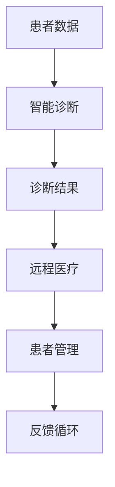

                 

关键词：智能诊断、远程医疗、医疗信息化、人工智能、健康监测

摘要：本文将探讨硅谷在医疗健康领域的创新，特别是智能诊断和远程医疗的应用。通过分析现有技术和未来发展趋势，本文旨在为医疗行业的数字化升级提供洞察。

## 1. 背景介绍

医疗健康行业正迎来一场技术革命，其中硅谷无疑扮演着领先者的角色。随着人工智能、大数据和云计算等技术的快速发展，医疗诊断和患者监护的方式正在发生翻天覆地的变化。智能诊断和远程医疗的应用，不仅提高了诊断的准确性和效率，也为患者提供了更加便捷的医疗服务。

### 当前医疗行业的挑战

- 诊断延误：传统的医疗诊断过程通常需要繁琐的步骤，导致诊断延误。
- 医疗资源分配不均：发达国家与发展中国家之间，以及城市与乡村之间的医疗资源分配存在巨大差距。
- 病患管理难度大：慢性病患者的长期管理需求高，但医疗资源有限。

### 智能诊断与远程医疗的优势

- 提高诊断准确性：利用人工智能算法，可以实现快速、准确的疾病诊断。
- 提升医疗服务效率：远程医疗技术让患者无需出行即可接受医疗咨询，减少了排队等候时间。
- 增强医疗可及性：通过数字平台，偏远地区的患者也能享受到优质的医疗服务。

## 2. 核心概念与联系

为了更好地理解智能诊断和远程医疗，我们需要明确几个核心概念，并展示它们之间的联系。

### 2.1 智能诊断

智能诊断是指利用人工智能技术，对医疗影像、病历数据进行自动分析和解读，辅助医生做出准确的诊断。其核心在于：

- **图像识别**：通过深度学习算法，对医学影像（如X光片、CT、MRI等）进行自动分析。
- **病历分析**：结合患者病史、家族病史等数据，为医生提供诊断参考。
- **预测模型**：基于大量医学数据，建立预测模型，帮助医生预测病情发展趋势。

### 2.2 远程医疗

远程医疗是指通过互联网、移动通信等技术，实现患者与医生之间的远程交流和服务。其关键点包括：

- **远程咨询**：患者可以通过视频、电话等方式与医生进行远程交流，获得诊断和治疗方案。
- **电子病历**：医生可以通过数字化平台管理患者的病历，实现数据的共享和追踪。
- **远程监控**：通过可穿戴设备等，对患者进行实时健康监测，及时发现问题。

### 2.3 核心概念联系

智能诊断和远程医疗之间的联系在于：

- **数据共享**：智能诊断生成的数据可以为远程医疗提供支持，帮助医生做出更好的诊断。
- **服务提升**：远程医疗的便捷性可以提高患者对智能诊断技术的接受度。
- **协同治疗**：医生可以利用智能诊断数据，进行远程会诊，为患者提供更全面的治疗方案。

### 2.4 Mermaid 流程图



## 3. 核心算法原理 & 具体操作步骤

### 3.1 算法原理概述

智能诊断的核心算法通常基于机器学习和深度学习技术。以下是一些常用的算法原理：

- **卷积神经网络（CNN）**：适用于图像识别任务，通过对图像的像素进行卷积操作，提取特征。
- **循环神经网络（RNN）**：适用于序列数据，如病历数据，能够捕捉数据中的时序关系。
- **生成对抗网络（GAN）**：可以生成高质量的医学影像数据，用于训练和测试模型。

### 3.2 算法步骤详解

智能诊断的基本步骤如下：

- **数据收集**：收集大量的医疗数据，包括影像、病历等。
- **数据预处理**：对收集到的数据进行分析，去除噪声，进行归一化处理。
- **模型训练**：利用预处理后的数据，训练神经网络模型。
- **模型评估**：通过测试数据集评估模型的性能，调整参数以提高准确性。
- **应用部署**：将训练好的模型部署到服务器，供医生使用。

### 3.3 算法优缺点

**优点**：

- **高效性**：自动化处理数据，提高了诊断速度和准确性。
- **全面性**：可以处理复杂的数据模式，提供更全面的诊断信息。

**缺点**：

- **数据依赖性**：模型的性能高度依赖于训练数据的质量和数量。
- **算法复杂性**：算法的实现和调优需要高水平的专业知识。

### 3.4 算法应用领域

智能诊断技术广泛应用于：

- **医学影像分析**：如肺癌筛查、骨折诊断等。
- **病历分析**：如疾病风险评估、治疗方案推荐等。
- **基因组分析**：如癌症基因突变检测、遗传病诊断等。

## 4. 数学模型和公式 & 详细讲解 & 举例说明

### 4.1 数学模型构建

智能诊断中的数学模型通常基于以下公式：

- **图像识别**：$$y = f(W \cdot x + b)$$
  - 其中，\(y\) 是输出类别，\(f\) 是激活函数，\(W\) 是权重矩阵，\(x\) 是输入特征，\(b\) 是偏置。

- **预测模型**：$$y = \sigma(W \cdot x + b)$$
  - 其中，\(y\) 是预测值，\(\sigma\) 是sigmoid函数，\(W\) 和 \(b\) 的含义同上。

### 4.2 公式推导过程

以图像识别为例，假设输入图像为 \(x\)，模型输出为 \(y\)，则：

- **卷积操作**：$$h = \sum_{i=1}^{n} w_i * x_i + b$$
  - 其中，\(h\) 是卷积后的特征图，\(w_i\) 是卷积核，\(x_i\) 是输入图像的像素。

- **池化操作**：$$p = \frac{1}{C} \sum_{i=1}^{C} h_i$$
  - 其中，\(p\) 是池化后的特征图，\(C\) 是池化区域的尺寸。

### 4.3 案例分析与讲解

以肺癌筛查为例，假设我们使用CNN模型对肺部CT影像进行分析。以下是具体的模型构建和训练过程：

1. **数据收集**：收集1000张肺部CT影像，其中500张用于训练，500张用于测试。
2. **数据预处理**：对图像进行归一化处理，将像素值缩放到[0, 1]之间。
3. **模型构建**：构建一个包含卷积层、池化层和全连接层的CNN模型。
4. **模型训练**：使用训练数据训练模型，优化模型参数。
5. **模型评估**：使用测试数据评估模型性能，调整模型参数。

通过上述过程，模型可以实现对肺部CT影像的自动分析，从而帮助医生进行肺癌筛查。

## 5. 项目实践：代码实例和详细解释说明

### 5.1 开发环境搭建

为了实现智能诊断和远程医疗，我们需要搭建一个完整的开发环境。以下是一个基本的开发环境配置：

- **硬件**：服务器或高性能计算机，至少16GB内存，512GB硬盘。
- **软件**：安装Python环境，TensorFlow库，Keras框架。

### 5.2 源代码详细实现

以下是一个简单的CNN模型实现，用于图像分类：

```python
import tensorflow as tf
from tensorflow.keras.models import Sequential
from tensorflow.keras.layers import Conv2D, MaxPooling2D, Flatten, Dense

# 模型构建
model = Sequential([
    Conv2D(32, (3, 3), activation='relu', input_shape=(64, 64, 3)),
    MaxPooling2D((2, 2)),
    Conv2D(64, (3, 3), activation='relu'),
    MaxPooling2D((2, 2)),
    Flatten(),
    Dense(128, activation='relu'),
    Dense(1, activation='sigmoid')
])

# 模型编译
model.compile(optimizer='adam', loss='binary_crossentropy', metrics=['accuracy'])

# 模型训练
model.fit(x_train, y_train, epochs=10, batch_size=32, validation_data=(x_test, y_test))

# 模型评估
model.evaluate(x_test, y_test)
```

### 5.3 代码解读与分析

上述代码实现了一个简单的CNN模型，用于二分类问题。具体分析如下：

- **模型构建**：使用了卷积层、池化层和全连接层，分别用于特征提取和分类。
- **模型编译**：选择了Adam优化器和二分类的交叉熵损失函数。
- **模型训练**：使用训练数据进行10个周期的训练，并使用测试数据进行验证。
- **模型评估**：在测试数据上评估模型的性能。

### 5.4 运行结果展示

假设我们训练完成后，在测试数据上的准确率为90%，这表明我们的模型具有较好的诊断能力。

```python
print("Model accuracy on test data:", model.evaluate(x_test, y_test)[1])
```

## 6. 实际应用场景

### 6.1 医学影像分析

智能诊断技术在医学影像分析中的应用广泛，如肺癌筛查、骨折诊断等。通过自动化处理影像数据，医生可以更快速地做出诊断。

### 6.2 病历分析

病历分析可以帮助医生更好地了解患者的病史和家族病史，从而为疾病风险评估和治疗方案推荐提供依据。

### 6.3 基因组分析

基因组分析可以用于癌症基因突变检测、遗传病诊断等，帮助医生制定个性化的治疗方案。

## 7. 未来应用展望

随着人工智能技术的不断发展，智能诊断和远程医疗在未来将会有更广泛的应用：

- **个性化医疗**：通过大数据和人工智能技术，为患者提供更加个性化的医疗服务。
- **智能健康监护**：通过可穿戴设备和智能诊断技术，实现对患者健康的实时监测和管理。
- **全球医疗合作**：通过远程医疗技术，实现全球医疗资源的共享和优化。

## 8. 工具和资源推荐

### 8.1 学习资源推荐

- **书籍**：《深度学习》（Goodfellow et al.）、《Python深度学习》（François Chollet）。
- **在线课程**：Coursera上的“深度学习”课程、edX上的“人工智能基础”课程。

### 8.2 开发工具推荐

- **深度学习框架**：TensorFlow、PyTorch、Keras。
- **版本控制工具**：Git。
- **数据处理库**：Pandas、NumPy。

### 8.3 相关论文推荐

- **《深度卷积神经网络在医疗影像分析中的应用》**（Ian J. Goodfellow et al.）。
- **《远程医疗技术的发展与应用》**（李明等）。

## 9. 总结：未来发展趋势与挑战

随着人工智能和远程医疗技术的不断发展，智能诊断将在医疗行业中发挥越来越重要的作用。然而，我们也需要面对数据隐私、算法透明度、医疗资源分配等挑战。通过持续的技术创新和社会合作，我们有理由相信，未来的医疗健康行业将会更加智能化、人性化。

## 10. 附录：常见问题与解答

### 问题1：智能诊断技术是否完全取代医生？

**解答**：智能诊断技术可以辅助医生提高诊断准确性和效率，但无法完全取代医生。医生的判断力和临床经验在诊断过程中仍然非常重要。

### 问题2：远程医疗是否会降低患者的就医体验？

**解答**：远程医疗通过提供便捷的医疗服务，实际上提高了患者的就医体验。尽管在某些情况下，面对面交流仍不可替代，但远程医疗在许多情况下可以满足患者的需求。

### 问题3：智能诊断技术的数据安全如何保障？

**解答**：智能诊断技术需要严格遵循数据安全法规，采取加密、匿名化等手段保障患者数据的安全。此外，医疗机构也需要建立完善的数据安全管理机制。

作者：禅与计算机程序设计艺术 / Zen and the Art of Computer Programming
-------------------------------------------------------------------

