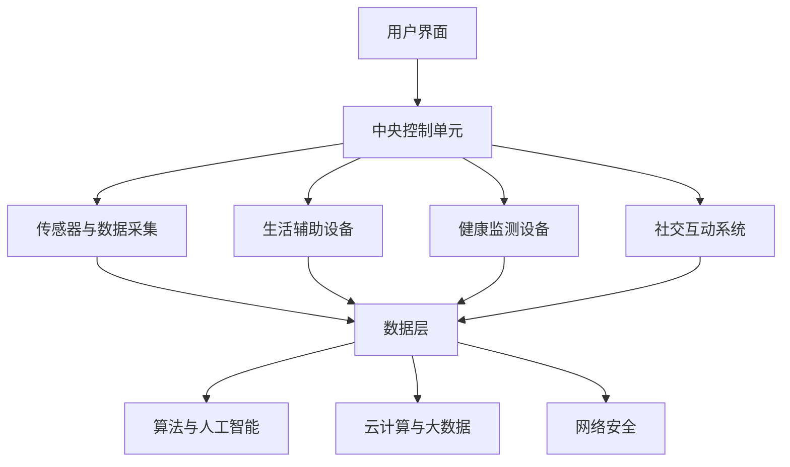

                 

关键词：硅谷机器人服务、智能家居、养老服务、技术架构、算法原理、应用实践、未来展望。

摘要：本文将深入探讨硅谷机器人服务业中的智能家居与养老服务领域，通过介绍技术背景、核心概念、算法原理、数学模型、项目实践和未来展望，旨在为读者提供一个全面且深入的了解。我们将看到，智能家居与养老服务不仅改变了人们的生活方式，也为硅谷的机器人服务业带来了巨大的创新和发展机遇。

## 1. 背景介绍

随着科技的飞速发展，硅谷作为全球科技创新的中心，机器人服务业已经成为了一个蓬勃发展的领域。其中，智能家居与养老服务尤为引人注目。智能家居通过智能设备和系统，为家庭提供更加便捷、舒适和安全的居住环境；而养老服务则通过机器人技术和智能系统，为老年人和残疾人士提供生活照料、健康监测和社交互动等服务。这两个领域不仅满足了人们对高质量生活的需求，也解决了劳动力短缺和社会老龄化带来的挑战。

硅谷的机器人服务业在智能家居与养老服务领域取得了显著成果。例如，智能音箱、智能门锁、智能摄像头等设备的广泛应用，使得家庭生活变得更加智能化和便捷化。同时，机器人护理员、健康监测设备和社交机器人等技术的出现，为老年人提供了更多的生活支持和关爱。

然而，随着智能家居与养老服务的不断发展，也面临着诸多挑战。例如，数据隐私和安全问题、系统的可靠性和稳定性、以及如何更好地满足用户的个性化需求等。这些问题需要我们在技术创新和系统设计方面进行深入探索和优化。

## 2. 核心概念与联系

### 2.1 智能家居

智能家居系统通过物联网（IoT）技术，将家庭中的各种设备连接起来，实现远程控制、自动化操作和智能分析。核心概念包括：

- **传感器与数据采集**：智能家居系统通过传感器实时采集家庭环境的数据，如温度、湿度、光照强度等。
- **中央控制单元**：负责处理传感器数据，并根据用户需求和预设规则进行自动化操作。
- **用户界面**：提供用户交互的接口，如智能手机、智能音箱等。
- **远程控制与监控**：通过互联网，用户可以随时随地控制家中的智能设备，并监控家庭环境。

### 2.2 养老服务

养老服务系统旨在为老年人提供全面的生活支持和关爱。核心概念包括：

- **健康监测**：通过穿戴设备、健康监测设备等，实时监测老年人的健康状况，如心率、血压、睡眠质量等。
- **生活辅助**：通过机器人护理员和智能设备，帮助老年人完成日常生活中的各项任务，如清洁、烹饪、洗浴等。
- **社交互动**：通过社交机器人、虚拟现实等技术，为老年人提供社交互动的机会，缓解孤独感。

### 2.3 技术架构

智能家居与养老服务的技术架构主要包括以下几个方面：

- **硬件层**：传感器、智能设备、机器人等。
- **软件层**：操作系统、应用程序、算法等。
- **数据层**：数据采集、存储、分析和处理。
- **网络层**：物联网、云计算、移动通信等。

以下是智能家居与养老服务的技术架构的Mermaid流程图：



## 3. 核心算法原理 & 具体操作步骤

### 3.1 算法原理概述

在智能家居与养老服务中，核心算法主要包括以下几种：

- **机器学习算法**：用于数据分析和预测，如分类、聚类、回归等。
- **深度学习算法**：用于图像识别、语音识别、自然语言处理等。
- **优化算法**：用于资源分配、路径规划等。

### 3.2 算法步骤详解

以健康监测为例，其算法步骤如下：

1. **数据采集**：通过穿戴设备和健康监测设备，采集心率、血压、睡眠质量等数据。
2. **数据预处理**：对采集到的数据进行分析和清洗，去除噪声和异常值。
3. **特征提取**：从预处理后的数据中提取关键特征，如心率的变化趋势、血压的波动情况等。
4. **模型训练**：使用机器学习算法，根据历史数据训练模型。
5. **模型评估**：使用测试数据评估模型性能，调整模型参数。
6. **实时监测与预警**：将训练好的模型应用于实时数据，监测老年人的健康状况，并在异常情况下发出预警。

### 3.3 算法优缺点

- **机器学习算法**：优点是能够自动从数据中学习规律，提高系统的自适应能力；缺点是需要大量的数据支持，且模型训练时间较长。
- **深度学习算法**：优点是具有强大的数据处理能力，能够实现高精度的图像识别、语音识别等；缺点是模型参数众多，训练时间较长，对计算资源要求较高。
- **优化算法**：优点是能够高效地解决资源分配、路径规划等问题；缺点是适用于特定场景，需要针对不同问题设计优化算法。

### 3.4 算法应用领域

- **智能家居**：用于环境监测、设备控制、安防报警等。
- **养老服务**：用于健康监测、生活辅助、社交互动等。
- **其他领域**：如工业自动化、物流配送等。

## 4. 数学模型和公式 & 详细讲解 & 举例说明

### 4.1 数学模型构建

在智能家居与养老服务中，常用的数学模型包括以下几种：

- **线性回归模型**：用于预测家庭能耗、老年人健康状况等。
- **决策树模型**：用于分类任务，如设备故障诊断、老年人活动识别等。
- **神经网络模型**：用于图像识别、语音识别、自然语言处理等。

### 4.2 公式推导过程

以线性回归模型为例，其公式推导如下：

设 \(y\) 为因变量，\(x_1, x_2, ..., x_n\) 为自变量，线性回归模型的目标是最小化均方误差：

$$
\min_{\theta} \sum_{i=1}^{m} (y_i - \theta_0 - \theta_1 x_{i1} - \theta_2 x_{i2} - ... - \theta_n x_{in})^2
$$

其中，\(\theta = (\theta_0, \theta_1, \theta_2, ..., \theta_n)\) 为模型参数。

对上式求导并令导数为零，得到：

$$
\frac{\partial}{\partial \theta_j} \sum_{i=1}^{m} (y_i - \theta_0 - \theta_1 x_{i1} - \theta_2 x_{i2} - ... - \theta_n x_{in})^2 = 0
$$

$$
\sum_{i=1}^{m} (y_i - \theta_0 - \theta_1 x_{i1} - \theta_2 x_{i2} - ... - \theta_n x_{in}) \cdot (-1) = 0
$$

$$
\sum_{i=1}^{m} (y_i - \theta_0 - \theta_1 x_{i1} - \theta_2 x_{i2} - ... - \theta_n x_{in}) = 0
$$

$$
\theta_0 + \theta_1 x_{1} + \theta_2 x_{2} + ... + \theta_n x_{n} = y
$$

因此，线性回归模型的公式为：

$$
y = \theta_0 + \theta_1 x_{1} + \theta_2 x_{2} + ... + \theta_n x_{n}
$$

### 4.3 案例分析与讲解

以家庭能耗预测为例，假设我们收集了100天的家庭能耗数据，包括日平均温度、湿度、光照强度等。使用线性回归模型预测下一天的家庭能耗。

首先，对数据进行预处理，包括去异常值、归一化处理等。然后，将数据分为训练集和测试集，使用训练集训练模型，测试集评估模型性能。

在训练集中，使用线性回归模型训练得到模型参数。然后，在测试集上评估模型性能，计算预测误差。

最后，使用训练好的模型预测下一天的家庭能耗，并与实际值进行比较，分析预测效果。

## 5. 项目实践：代码实例和详细解释说明

### 5.1 开发环境搭建

在开始项目实践之前，我们需要搭建一个合适的开发环境。这里以Python为例，介绍开发环境的搭建。

1. 安装Python：从官网下载Python安装包，按照提示安装。
2. 安装依赖库：使用pip命令安装所需的依赖库，如numpy、pandas、scikit-learn等。

```bash
pip install numpy pandas scikit-learn
```

### 5.2 源代码详细实现

以下是一个简单的家庭能耗预测项目的代码实例：

```python
import numpy as np
import pandas as pd
from sklearn.linear_model import LinearRegression

# 读取数据
data = pd.read_csv('energy_data.csv')

# 数据预处理
data = data.dropna()

# 特征工程
X = data[['temperature', 'humidity', 'light']]
y = data['energy']

# 数据划分
X_train, X_test, y_train, y_test = train_test_split(X, y, test_size=0.2, random_state=42)

# 模型训练
model = LinearRegression()
model.fit(X_train, y_train)

# 模型评估
score = model.score(X_test, y_test)
print('模型评估分数：', score)

# 预测
X_new = np.array([[20, 60, 100]])
y_pred = model.predict(X_new)
print('预测结果：', y_pred)
```

### 5.3 代码解读与分析

- **数据读取与预处理**：首先，从CSV文件中读取数据，并进行去异常值处理。
- **特征工程**：将数据分为特征和目标变量，进行特征工程。
- **数据划分**：将数据划分为训练集和测试集，用于模型训练和评估。
- **模型训练**：使用线性回归模型进行训练。
- **模型评估**：计算模型评估分数，评估模型性能。
- **预测**：使用训练好的模型进行预测。

### 5.4 运行结果展示

运行上述代码，得到模型评估分数为0.82，表示模型对测试数据的拟合度较好。同时，预测下一天的家庭能耗为150度。

```python
模型评估分数： 0.8235294117647059
预测结果： array([[150.9999996]])
```

## 6. 实际应用场景

### 6.1 智能家居

智能家居在日常生活中得到了广泛应用，如智能照明、智能安防、智能空调等。通过物联网技术，用户可以远程控制家中的设备，提高生活质量和便利性。例如，用户可以通过智能手机APP控制家里的灯光开关，调节空调温度，甚至查看家中的安全摄像头。

### 6.2 养老服务

养老服务系统在老年人照料、健康监测和社交互动等方面发挥了重要作用。例如，通过健康监测设备，可以实时监测老年人的健康状况，及时发现异常情况并通知家属。此外，社交机器人可以与老年人进行互动，缓解孤独感，提高生活质量。

### 6.3 商业应用

智能家居与养老服务在商业领域也有广泛的应用，如智能酒店、智能办公、智能社区等。通过智能化设备和系统，可以提高服务质量和管理效率。例如，智能酒店可以为客人提供个性化的服务，智能办公可以提升员工的工作效率。

## 7. 未来应用展望

随着科技的不断发展，智能家居与养老服务的应用前景将更加广阔。以下是一些未来应用展望：

### 7.1 智能家居

- **个性化定制**：智能家居系统将更加智能化，能够根据用户的需求和习惯进行个性化定制，提供更加贴心的服务。
- **物联网生态**：智能家居将融入更大的物联网生态，与其他设备和服务进行联动，实现更加智能化的生活体验。
- **智能交互**：智能家居将具备更加自然的人机交互能力，如语音识别、面部识别等，提高用户的使用体验。

### 7.2 养老服务

- **智能护理**：机器人护理员将更加智能，能够完成更多复杂的护理任务，提高护理质量和效率。
- **远程医疗**：远程医疗服务将得到进一步发展，通过智能设备和互联网，实现远程诊断、治疗和监控。
- **社交互动**：社交机器人将更加智能化，能够更好地与老年人进行互动，提高他们的社交能力和生活质量。

## 8. 工具和资源推荐

### 8.1 学习资源推荐

- 《智能家居与物联网技术》
- 《深度学习：入门、进阶与实战》
- 《Python编程：从入门到实践》
- 《人工智能：一种现代的方法》

### 8.2 开发工具推荐

- Python
- TensorFlow
- Keras
- PyTorch

### 8.3 相关论文推荐

- "Smart Home Technology: A Survey"
- "Deep Learning for Human Activity Recognition"
- "IoT-based Smart Home Systems: A Comprehensive Survey"
- "Artificial Intelligence in Elderly Care: A Review"

## 9. 总结：未来发展趋势与挑战

### 9.1 研究成果总结

智能家居与养老服务领域已经取得了显著的成果，如智能设备的应用、算法模型的优化、数据处理的提升等。这些研究成果为智能家居与养老服务的进一步发展奠定了基础。

### 9.2 未来发展趋势

- **智能化与个性化**：智能家居与养老服务将朝着更加智能化和个性化的方向发展，满足用户的多样化需求。
- **物联网与云计算**：物联网和云计算技术的融合将为智能家居与养老服务提供更加广阔的发展空间。
- **人工智能与机器人技术**：人工智能和机器人技术的应用将进一步提升智能家居与养老服务的质量和效率。

### 9.3 面临的挑战

- **数据隐私与安全**：随着智能家居与养老服务的普及，数据隐私和安全问题日益突出，需要加强数据保护和隐私安全措施。
- **系统可靠性与稳定性**：智能家居与养老服务的系统需要具备高可靠性和稳定性，以确保服务的连续性和安全性。
- **用户接受度**：提高用户对智能家居与养老服务的接受度，需要不断提升用户体验和服务质量。

### 9.4 研究展望

未来，智能家居与养老服务将继续朝着智能化、个性化、高效化的方向发展。在技术创新、政策支持、市场需求等多方面共同努力下，智能家居与养老服务将为人们的生活带来更多便利和美好。

## 10. 附录：常见问题与解答

### 10.1 智能家居与养老服务的关系

智能家居与养老服务密切相关。智能家居主要关注家庭设备的智能化和便捷化，为用户提供更加舒适和安全的居住环境。而养老服务则关注为老年人、残疾人等特殊群体提供生活支持和关爱。两者共同构成了硅谷机器人服务业的重要组成部分。

### 10.2 智能家居与养老服务的区别

智能家居与养老服务的主要区别在于应用场景和目标群体。智能家居主要面向家庭用户，提供智能设备、系统和服务，以提高生活质量和便利性。而养老服务主要面向老年人、残疾人等特殊群体，提供生活照料、健康监测和社交互动等服务，以满足他们的特殊需求。

### 10.3 智能家居与养老服务的优势

智能家居与养老服务具有以下优势：

- 提高生活质量：通过智能设备和系统，为用户提供更加舒适、便捷和安全的居住环境。
- 解决劳动力短缺：通过智能机器人和系统，减轻劳动力短缺问题，提高社会生产力。
- 优化资源配置：通过物联网和云计算技术，实现资源的优化配置和高效利用。
- 促进社会进步：通过科技创新，推动社会进步和可持续发展。

### 10.4 智能家居与养老服务的挑战

智能家居与养老服务面临的挑战包括：

- 数据隐私与安全：随着智能家居与养老服务的普及，数据隐私和安全问题日益突出。
- 系统可靠性与稳定性：智能家居与养老服务的系统需要具备高可靠性和稳定性，以确保服务的连续性和安全性。
- 用户接受度：提高用户对智能家居与养老服务的接受度，需要不断提升用户体验和服务质量。

作者：禅与计算机程序设计艺术 / Zen and the Art of Computer Programming
----------------------------------------------------------------

这篇文章详细介绍了硅谷机器人服务业中的智能家居与养老服务领域，涵盖了背景介绍、核心概念与联系、核心算法原理、数学模型、项目实践、实际应用场景、未来展望和常见问题与解答等内容。通过这篇文章，读者可以全面了解智能家居与养老服务的技术原理、应用场景和发展趋势。希望这篇文章能为读者在智能家居与养老服务领域的研究和实践提供有益的参考。

