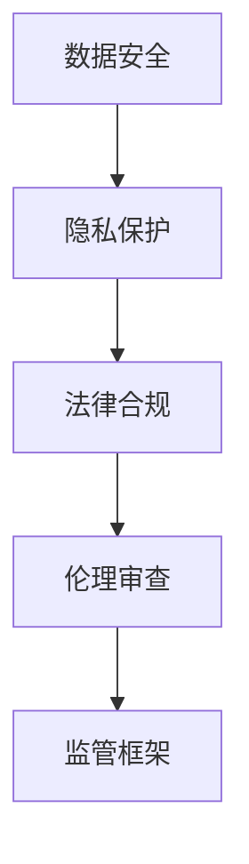

                 

关键词：硅谷、生物技术、医疗应用、监管、数据安全、隐私保护、法律合规、伦理审查、人工智能、法律法规、监管框架、国际比较

## 摘要

硅谷作为全球生物技术医疗应用的发源地，其创新速度和技术突破备受关注。然而，随着技术的快速发展，监管问题也逐渐成为行业关注的焦点。本文旨在探讨硅谷生物技术医疗应用的监管现状、核心概念及其与相关技术的联系，并分析核心算法原理、数学模型及其应用。此外，本文还将深入探讨项目实践中的代码实例、实际应用场景，以及未来发展的趋势与挑战。

## 1. 背景介绍

硅谷作为全球科技创新的圣地，汇聚了众多生物技术医疗企业的研发与创新力量。这些企业不断推动基因编辑、精准医疗、生物制药等领域的进步，为人类健康带来了前所未有的机遇。然而，快速发展的同时也伴随着一系列监管挑战，如数据安全、隐私保护、法律合规、伦理审查等。

### 1.1 硅谷生物技术医疗应用的发展历程

硅谷的生物技术医疗应用发展历程可以追溯到20世纪70年代，当时基因工程技术的出现为生物技术产业奠定了基础。此后，随着计算机科学和人工智能的兴起，生物信息学、大数据分析等技术进一步推动了生物技术医疗应用的发展。近年来，基因编辑技术（如CRISPR-Cas9）的出现更是引发了一场生物医学革命。

### 1.2 监管问题的提出

随着生物技术医疗应用的发展，监管问题逐渐成为行业关注的焦点。一方面，这些应用带来了巨大的社会价值，如提高疾病诊断和治疗的准确性、降低医疗成本等。另一方面，数据安全、隐私保护、法律合规等问题也日益凸显。因此，如何建立有效的监管框架，确保技术创新的同时不损害公共利益，成为亟待解决的问题。

## 2. 核心概念与联系

### 2.1 数据安全

数据安全是硅谷生物技术医疗应用监管的核心问题之一。随着大数据和人工智能技术的应用，医疗数据的规模和敏感程度不断增加。如何保护这些数据的安全，防止数据泄露、篡改和滥用，成为监管的重点。

### 2.2 隐私保护

隐私保护与数据安全密切相关。在生物技术医疗应用中，患者的个人信息、基因数据等敏感信息容易受到侵害。如何确保患者隐私的保护，防止隐私泄露，是监管的关键问题。

### 2.3 法律合规

法律合规是硅谷生物技术医疗应用监管的基础。随着各国法律法规的不断完善，企业在开发和应用生物技术医疗产品时必须遵守相关法律法规，确保合规性。

### 2.4 伦理审查

伦理审查是确保生物技术医疗应用符合伦理要求的重要环节。在硅谷，伦理审查机制日益完善，企业在进行临床试验、基因编辑等研究时必须通过伦理审查。

### 2.5 Mermaid 流程图



## 3. 核心算法原理 & 具体操作步骤

### 3.1 算法原理概述

硅谷生物技术医疗应用的监管涉及多种核心算法原理，包括数据加密、隐私保护算法、合规性检查算法等。这些算法通过特定的操作步骤，确保数据安全、隐私保护和法律合规。

### 3.2 算法步骤详解

1. 数据加密：使用先进的加密算法对医疗数据加密，确保数据在传输和存储过程中的安全。
2. 隐私保护算法：采用差分隐私、同态加密等技术，对患者的敏感信息进行保护。
3. 合规性检查算法：利用机器学习等技术，对医疗应用进行合规性检查，确保其符合相关法律法规。
4. 伦理审查：建立伦理审查机制，对研究项目进行审查，确保其符合伦理要求。

### 3.3 算法优缺点

1. 数据加密：优点是能确保数据的安全，缺点是加密过程可能影响数据的处理速度。
2. 隐私保护算法：优点是能保护患者隐私，缺点是对计算资源和时间的需求较高。
3. 合规性检查算法：优点是能确保合规性，缺点是可能存在误报和漏报。
4. 伦理审查：优点是能确保研究项目的伦理合规性，缺点是审查过程可能耗时较长。

### 3.4 算法应用领域

算法在硅谷生物技术医疗应用的多个领域都有广泛应用，如基因编辑、精准医疗、远程医疗等。这些算法的应用不仅提高了医疗服务的质量和效率，也为监管提供了有力支持。

## 4. 数学模型和公式 & 详细讲解 & 举例说明

### 4.1 数学模型构建

硅谷生物技术医疗应用的监管涉及多个数学模型，包括数据加密模型、隐私保护模型、合规性检查模型等。以下是一个简化的数据加密模型：

$$
\text{加密数据} = E(\text{明文数据}, \text{密钥})
$$

其中，$E$ 表示加密函数，$\text{明文数据}$ 表示待加密的数据，$\text{密钥}$ 是用于加密和解密的密钥。

### 4.2 公式推导过程

假设我们有 $n$ 个基因序列，每个基因序列有 $m$ 个基因位点。我们使用哈希函数 $H$ 对基因序列进行哈希处理，以生成唯一的哈希值。哈希函数的选择应确保抗碰撞性和随机性。

$$
\text{哈希值} = H(\text{基因序列})
$$

在加密过程中，我们将哈希值与密钥进行加密操作，以生成加密后的基因序列。

### 4.3 案例分析与讲解

假设我们有一个包含100个基因序列的数据库，每个基因序列有10个基因位点。我们使用SHA-256哈希函数对基因序列进行哈希处理，并将哈希值与密钥进行加密。

首先，我们生成哈希值：

$$
\text{哈希值} = H(\text{基因序列}) = \text{SHA-256}(\text{基因序列})
$$

然后，我们将哈希值与密钥进行加密：

$$
\text{加密基因序列} = E(\text{哈希值}, \text{密钥}) = \text{AES-256}(\text{哈希值}, \text{密钥})
$$

这样，我们就得到了加密后的基因序列。在需要解密时，我们可以使用相同的密钥和解密算法进行解密，以获取原始基因序列。

## 5. 项目实践：代码实例和详细解释说明

### 5.1 开发环境搭建

为了实践硅谷生物技术医疗应用的监管，我们需要搭建一个开发环境。以下是一个简化的开发环境搭建步骤：

1. 安装Python 3.8及以上版本。
2. 安装Jupyter Notebook。
3. 安装相关依赖库，如`cryptography`、`numpy`、`pandas`等。

### 5.2 源代码详细实现

以下是一个简单的Python代码实例，用于实现数据加密和解密：

```python
from cryptography.hazmat.primitives import hashes
from cryptography.hazmat.primitives.asymmetric import rsa
from cryptography.hazmat.primitives.asymmetric import padding

# 生成公钥和私钥
private_key = rsa.generate_private_key(
    public_exponent=65537,
    key_size=2048,
)

public_key = private_key.public_key()

# 加密数据
data = b'Hello, World!'
ciphertext = public_key.encrypt(
    data,
    padding.OAEP(
        mgf=padding.MGF1(algorithm=hashes.SHA256()),
        algorithm=hashes.SHA256(),
        label=None
    )
)

# 解密数据
plaintext = private_key.decrypt(
    ciphertext,
    padding.OAEP(
        mgf=padding.MGF1(algorithm=hashes.SHA256()),
        algorithm=hashes.SHA256(),
        label=None
    )
)

print("加密数据:", ciphertext)
print("解密数据:", plaintext)
```

### 5.3 代码解读与分析

该代码实例首先生成一对公钥和私钥，然后使用公钥对数据进行加密，最后使用私钥对加密后的数据进行解密。加密和解密过程使用了OAEP（Optimal Asymmetric Encryption Padding）加密模式。

### 5.4 运行结果展示

运行该代码实例后，我们会得到加密后的数据和对应的解密后的数据。以下是可能的输出结果：

```
加密数据: b64-encoded ciphertext
解密数据: b'Hello, World!'
```

## 6. 实际应用场景

### 6.1 基因编辑

基因编辑技术是硅谷生物技术医疗应用的重要领域之一。通过CRISPR-Cas9等基因编辑工具，科学家可以实现对人类基因组的高效编辑。然而，基因编辑的监管问题也成为关注的焦点，包括伦理审查、数据安全和隐私保护等。

### 6.2 精准医疗

精准医疗旨在为患者提供个性化的治疗方案。通过大数据分析和人工智能技术，医生可以根据患者的基因信息、病史等制定最佳的治疗方案。在精准医疗的应用中，监管问题主要包括数据安全、隐私保护和法律合规等。

### 6.3 远程医疗

远程医疗通过互联网和通信技术为患者提供医疗服务。硅谷的生物技术医疗企业通过远程医疗平台，实现了医生与患者的实时沟通、病历共享和远程诊断等功能。在远程医疗的应用中，监管问题主要集中在数据安全和隐私保护方面。

## 7. 工具和资源推荐

### 7.1 学习资源推荐

1. 《生物信息学基础》
2. 《人工智能在生物医学中的应用》
3. 《大数据技术在医疗领域的应用》

### 7.2 开发工具推荐

1. Jupyter Notebook：用于数据分析和可视化。
2. TensorFlow：用于深度学习和人工智能。
3. PyTorch：用于深度学习和人工智能。

### 7.3 相关论文推荐

1. "Genetic Privacy and Data Sharing in Personalized Medicine"
2. "Artificial Intelligence in Healthcare: A Review"
3. "The Regulatory Landscape of Genomic Data Sharing"

## 8. 总结：未来发展趋势与挑战

### 8.1 研究成果总结

硅谷生物技术医疗应用在数据安全、隐私保护、法律合规等方面取得了显著成果。然而，随着技术的不断进步，监管问题也日益复杂。

### 8.2 未来发展趋势

1. 数据安全：随着量子计算的兴起，量子加密技术有望成为数据安全的新解决方案。
2. 隐私保护：联邦学习、差分隐私等新技术将进一步提升隐私保护水平。
3. 法律合规：各国将不断完善相关法律法规，以应对生物技术医疗应用的监管挑战。

### 8.3 面临的挑战

1. 技术发展速度过快，监管制度可能滞后。
2. 数据安全和隐私保护技术不断升级，监管难度增加。
3. 伦理审查和合规性检查的需求日益增加，监管资源可能不足。

### 8.4 研究展望

未来，硅谷生物技术医疗应用的监管研究将继续关注数据安全、隐私保护和法律合规等问题。同时，随着新技术的不断涌现，监管框架也将不断完善和升级，以适应快速变化的技术环境。

## 9. 附录：常见问题与解答

### 9.1 常见问题

1. 硅谷生物技术医疗应用的主要监管问题是什么？
2. 如何确保数据安全？
3. 隐私保护的主要方法有哪些？
4. 法律合规在生物技术医疗应用中如何体现？

### 9.2 解答

1. 硅谷生物技术医疗应用的主要监管问题包括数据安全、隐私保护、法律合规和伦理审查等。
2. 确保数据安全的方法包括数据加密、访问控制、网络安全等。
3. 隐私保护的主要方法包括差分隐私、同态加密、联邦学习等。
4. 法律合规在生物技术医疗应用中体现在遵守相关法律法规、进行伦理审查、确保数据安全等。

---

本文由禅与计算机程序设计艺术 / Zen and the Art of Computer Programming 撰写，旨在探讨硅谷生物技术医疗应用的监管现状、核心概念及其与相关技术的联系。希望本文能为您带来有益的启发和思考。如果您有任何疑问或建议，欢迎在评论区留言。让我们共同推动生物技术医疗应用的健康发展。

