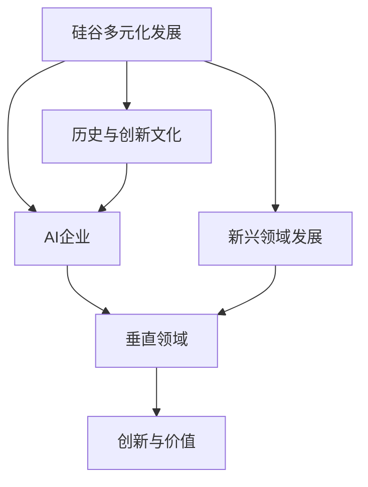

                 

关键词：硅谷、多元化发展、AI企业、创新、垂直领域、独特价值、技术探索

> 摘要：本文将探讨硅谷地区的多元化发展，特别是AI企业在垂直领域中的创新与价值。通过分析硅谷的成功案例，揭示其在推动人工智能技术发展的独特路径和策略，为未来的AI企业创新提供启示。

## 1. 背景介绍

硅谷作为全球科技创新的圣地，一直是科技企业创新和发展的风向标。从半导体产业的萌芽到互联网的兴起，再到近年来人工智能的爆发，硅谷始终引领着全球科技的发展潮流。而随着AI技术的迅速崛起，硅谷的多元化发展再次成为了关注的焦点。

### 硅谷的历史与创新文化

硅谷的历史可以追溯到20世纪50年代，当时美国国防部的高级研究计划局（DARPA）资助了一系列计算机科学研究项目，推动了计算机科学和半导体产业的发展。随着英特尔、苹果、谷歌等一批科技巨头的崛起，硅谷逐渐形成了以创新为核心的企业文化。这种文化鼓励风险投资、容忍失败，以及不断的探索与突破。

### 硅谷的多元化发展

近年来，硅谷的多元化发展尤为显著。一方面，传统科技行业如半导体、互联网、社交媒体等继续壮大；另一方面，人工智能、生物技术、新能源等新兴领域也蓬勃发展。这种多元化的发展模式为硅谷注入了新的活力，使其在全球科技竞争中始终保持领先地位。

## 2. 核心概念与联系

在探讨硅谷的多元化发展时，我们需要理解几个核心概念，它们之间相互联系，共同构成了硅谷的创新生态系统。

### AI企业

AI企业是指专注于人工智能技术的研发与应用的企业。这些企业涵盖了从初创公司到大型跨国公司的各个层次，它们在数据采集、算法研究、模型训练、应用开发等方面具有丰富的经验。

### 垂直领域

垂直领域是指特定的行业或领域，如金融科技、医疗健康、智能制造等。这些领域具有特定的需求和技术挑战，需要AI企业提供针对性的解决方案。

### 创新与价值

创新是硅谷的核心竞争力，而价值则是衡量创新成功与否的关键指标。在硅谷，创新不仅仅是为了技术的突破，更重要的是如何将这些技术转化为实际的社会价值和商业价值。

### Mermaid 流程图



## 3. 核心算法原理 & 具体操作步骤

### 3.1 算法原理概述

AI企业创新的核心在于算法的研究与应用。算法原理可以分为以下几个部分：

- **数据采集**：从垂直领域获取大量的数据，包括结构化数据和未结构化数据。
- **算法研究**：基于数据特征，设计并优化算法模型，以提高预测准确性。
- **模型训练**：使用大量数据进行算法模型的训练，以提升模型性能。
- **应用开发**：将训练好的模型应用于实际场景，提供智能化的解决方案。

### 3.2 算法步骤详解

- **数据采集**：首先，AI企业需要从垂直领域获取数据。例如，在金融科技领域，可以从银行、证券、保险等机构获取交易数据、客户行为数据等。
- **算法研究**：基于采集到的数据，研究人员会分析数据特征，设计适合的算法模型。例如，使用深度学习算法来分析客户行为，预测金融风险。
- **模型训练**：研究人员会使用大量数据进行模型训练，通过不断调整参数，提升模型性能。
- **应用开发**：在模型训练完成后，开发人员会将模型集成到实际应用中，如开发智能理财平台、自动化交易系统等。

### 3.3 算法优缺点

- **优点**：
  - 提高预测准确性：通过算法模型，可以实现对复杂问题的准确预测，提高业务决策的效率。
  - 个性化服务：根据用户数据，提供个性化的服务，提升用户体验。
  - 自动化与智能化：降低人工成本，提高业务流程的自动化水平。

- **缺点**：
  - 数据隐私问题：在数据采集和使用过程中，可能会涉及用户隐私。
  - 模型偏见：算法模型可能会因为数据偏见而生成有偏的结果。
  - 对计算资源的高要求：深度学习算法需要大量的计算资源和存储空间。

### 3.4 算法应用领域

AI算法在多个垂直领域都有广泛的应用：

- **金融科技**：用于风险管理、智能投顾、自动化交易等。
- **医疗健康**：用于疾病诊断、个性化治疗、健康监测等。
- **智能制造**：用于生产调度、质量控制、故障预测等。

## 4. 数学模型和公式 & 详细讲解 & 举例说明

### 4.1 数学模型构建

在AI算法中，常见的数学模型包括线性模型、逻辑回归模型、决策树模型、神经网络模型等。以下是神经网络模型的基本架构：

$$
\text{神经网络模型} = f(\text{输入层} \rightarrow \text{隐藏层} \rightarrow \text{输出层})
$$

其中，$f$ 表示激活函数，常用的激活函数有Sigmoid函数、ReLU函数等。

### 4.2 公式推导过程

以Sigmoid函数为例，其公式为：

$$
\sigma(x) = \frac{1}{1 + e^{-x}}
$$

推导过程如下：

$$
\frac{d}{dx} \sigma(x) = \sigma(x) (1 - \sigma(x))
$$

### 4.3 案例分析与讲解

假设我们使用神经网络模型进行疾病诊断，输入层包含10个特征，隐藏层包含5个神经元，输出层包含2个神经元（正常/异常）。以下是一个简化的示例：

- **输入层**：

$$
\text{输入} = [x_1, x_2, x_3, x_4, x_5, x_6, x_7, x_8, x_9, x_{10}]
$$

- **隐藏层**：

$$
\text{隐藏层输出} = \sigma(W_1 x_1 + b_1)
$$

其中，$W_1$ 和 $b_1$ 分别为权重和偏置。

- **输出层**：

$$
\text{输出} = \sigma(W_2 \text{隐藏层输出} + b_2)
$$

其中，$W_2$ 和 $b_2$ 分别为权重和偏置。

- **损失函数**：

$$
\text{损失函数} = \frac{1}{2} \sum_{i=1}^{n} (\text{实际输出} - \text{预测输出})^2
$$

其中，$n$ 为样本数量。

## 5. 项目实践：代码实例和详细解释说明

### 5.1 开发环境搭建

为了实现上述神经网络模型，我们需要搭建一个开发环境。以下是具体的操作步骤：

- 安装Python环境，版本建议为3.8及以上。
- 安装TensorFlow库，可以使用以下命令：

```python
pip install tensorflow
```

- 安装其他必要的库，如NumPy、Pandas等。

### 5.2 源代码详细实现

以下是实现神经网络模型的基本代码：

```python
import tensorflow as tf
from tensorflow.keras.models import Sequential
from tensorflow.keras.layers import Dense, Activation

# 构建神经网络模型
model = Sequential()
model.add(Dense(units=5, input_dim=10, activation='sigmoid'))
model.add(Dense(units=2, activation='sigmoid'))

# 编译模型
model.compile(optimizer='adam', loss='binary_crossentropy', metrics=['accuracy'])

# 加载数据并进行训练
model.fit(x_train, y_train, epochs=10, batch_size=32)
```

### 5.3 代码解读与分析

- **模型构建**：使用 `Sequential` 类构建神经网络模型，添加 `Dense` 层实现全连接网络。
- **编译模型**：使用 `compile` 方法设置优化器、损失函数和评价指标。
- **训练模型**：使用 `fit` 方法进行模型训练，传入训练数据和标签。

### 5.4 运行结果展示

在完成模型训练后，我们可以使用以下代码进行评估：

```python
# 评估模型
loss, accuracy = model.evaluate(x_test, y_test)

print(f"损失：{loss}, 准确率：{accuracy}")
```

评估结果显示了模型的损失和准确率，可以用来评估模型的性能。

## 6. 实际应用场景

### 6.1 金融科技

在金融科技领域，AI算法可以用于风险控制、信用评估、投资决策等。例如，通过分析用户的历史交易数据和行为，AI算法可以预测用户的信用风险，为金融机构提供决策支持。

### 6.2 医疗健康

在医疗健康领域，AI算法可以用于疾病诊断、药物研发、健康监测等。例如，通过分析患者的病历数据和基因数据，AI算法可以辅助医生进行疾病诊断，提高诊断准确率。

### 6.3 智能制造

在智能制造领域，AI算法可以用于生产调度、质量控制、故障预测等。例如，通过分析生产过程中的数据，AI算法可以优化生产流程，提高生产效率。

## 7. 工具和资源推荐

### 7.1 学习资源推荐

- 《深度学习》（Goodfellow、Bengio、Courville 著）
- 《Python机器学习》（Sebastian Raschka 著）
- 《TensorFlow实战》（Trevor Hastie、Robert Tibshirani、Jerome Friedman 著）

### 7.2 开发工具推荐

- Jupyter Notebook：用于编写和运行Python代码。
- TensorFlow：用于构建和训练神经网络模型。
- PyTorch：用于构建和训练神经网络模型。

### 7.3 相关论文推荐

- "Deep Learning" (Ian Goodfellow, Yoshua Bengio, Aaron Courville)
- "Convolutional Neural Networks for Visual Recognition" (Geoffrey Hinton, et al.)
- "Recurrent Neural Networks for Language Modeling" (Yoshua Bengio, et al.)

## 8. 总结：未来发展趋势与挑战

### 8.1 研究成果总结

近年来，AI技术在硅谷取得了显著的成果。从算法研究到应用开发，AI企业不断推动着技术的进步。例如，深度学习算法在图像识别、自然语言处理等领域取得了突破性进展，为垂直领域提供了强大的技术支持。

### 8.2 未来发展趋势

- **跨领域融合**：AI技术与传统行业的融合将继续深化，推动各个领域的创新发展。
- **数据隐私与安全**：随着数据隐私和安全的关注日益增加，AI企业需要制定更加严格的数据保护措施。
- **模型可解释性**：提高模型的可解释性，使其更易于被行业用户理解和接受。

### 8.3 面临的挑战

- **计算资源消耗**：深度学习算法需要大量的计算资源和存储空间，如何优化资源利用成为一大挑战。
- **数据质量**：高质量的数据是AI算法训练的基础，如何获取和清洗数据成为关键问题。
- **模型偏见与公平性**：避免模型偏见，提高模型的公平性是AI企业需要解决的重要问题。

### 8.4 研究展望

未来，AI企业将继续探索深度学习、强化学习等先进算法，将其应用于更广泛的垂直领域。同时，随着技术的不断发展，AI企业将更加关注数据隐私、模型可解释性等问题，推动AI技术的可持续发展。

## 9. 附录：常见问题与解答

### 9.1 什么是硅谷？

硅谷位于美国加利福尼亚州旧金山湾区，是全球科技创新和创业的中心，以其丰富的科技企业和创新文化而闻名。

### 9.2 AI企业如何进行创新？

AI企业通过深入研究人工智能算法，结合垂直领域的具体需求，开发出针对性的解决方案。同时，通过持续的技术研发和团队协作，不断提升算法性能和用户体验。

### 9.3 垂直领域如何利用AI技术？

垂直领域可以利用AI技术进行数据分析、模型预测、自动化控制等。例如，在金融科技领域，AI技术可以用于风险评估、智能投顾等；在医疗健康领域，AI技术可以用于疾病诊断、个性化治疗等。

## 作者署名

作者：禅与计算机程序设计艺术 / Zen and the Art of Computer Programming

----------------------------------------------------------------
以上就是关于《硅谷的多元化发展：AI企业的创新，探索垂直领域的独特价值》的完整文章。希望这篇文章能为您带来启发和思考。在未来的科技发展中，让我们共同努力，推动AI技术的创新与应用，为社会创造更多价值。

