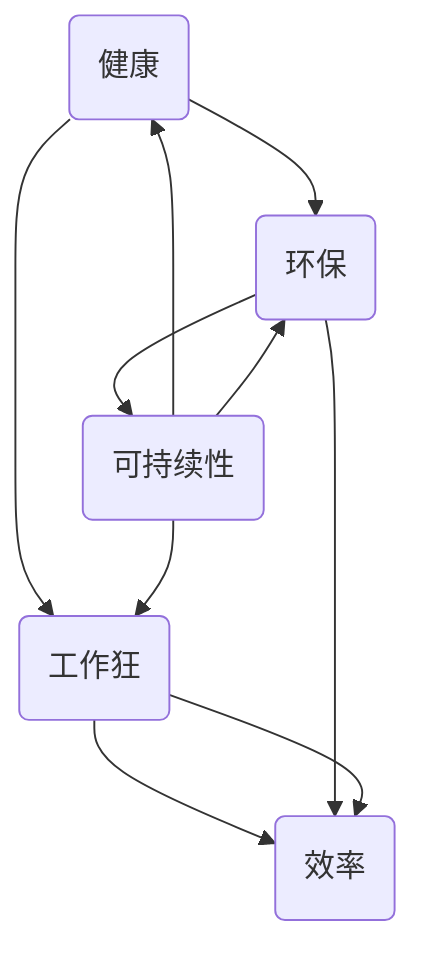

                 

关键词：硅谷生活方式、健康、环保、工作狂、可持续性、效率、健康饮食、环保科技、工作模式创新

> 摘要：本文探讨了硅谷生活方式中的健康、环保和工作狂特质，分析了这些因素如何相互影响，以及如何实现个人与组织的可持续发展。通过对健康饮食、环保科技和工作模式创新等方面的深入探讨，本文为读者提供了在快节奏的硅谷环境中保持身心健康和促进环保的有效策略。

## 1. 背景介绍

硅谷，作为全球科技和创新的热点地区，吸引了无数有志于科技创业和追求技术创新的人才。在这里，健康、环保和工作狂的理念与实践已经成为一种文化。硅谷的生活方式不仅影响着当地居民，也对全球科技产业产生了深远影响。

### 硅谷的健康文化

硅谷的健康文化体现在多个方面，包括健康饮食、定期锻炼和心理健康。硅谷的公司和企业普遍重视员工的健康福利，提供健身房、健康食品和心理健康支持。这种健康文化不仅有助于提高员工的幸福感，还能提升工作效率和创新能力。

### 硅谷的环保理念

硅谷的环保理念体现在对可持续发展和绿色科技的追求上。许多硅谷企业致力于研发环保技术，如太阳能、电动汽车和可再生能源。此外，硅谷的居民也积极参与环保活动，倡导低碳生活方式。

### 硅谷的工作狂现象

硅谷的工作狂现象源于对创新和成功的极致追求。许多科技创业者和管理者愿意牺牲个人时间和休息，以实现公司的快速发展和个人职业生涯的飞跃。这种工作狂的现象在一定程度上促进了硅谷的科技繁荣，但也引发了一系列健康和社会问题。

## 2. 核心概念与联系

为了更好地理解硅谷生活方式中健康、环保和工作狂的关系，我们使用Mermaid流程图来展示这些概念之间的相互作用。



### 健康与环保

健康和环保是硅谷生活方式的两个重要支柱。健康的身体和心理健康有助于人们更好地应对工作压力和挑战，而环保行动则能够保护环境，为未来世代创造更好的生活条件。

### 健康与工作狂

健康和工作狂之间存在一定的矛盾。过度追求工作会导致身体健康问题，如睡眠不足、饮食不均衡和缺乏锻炼。然而，适度的压力和挑战也有助于激发创造力和创新精神。

### 环保与工作狂

环保和工作狂之间的关系更加微妙。一方面，硅谷的工作狂现象推动了科技和商业创新，促进了环保技术的发展。另一方面，过度的工作压力可能会导致人们忽视环保问题，甚至对环境造成负面影响。

### 可持续性与效率

可持续性是健康、环保和工作狂的共同目标。通过提高效率，硅谷的企业和居民可以在追求个人和职业成功的同时，减少对环境的负面影响。可持续性不仅关乎环境保护，也关乎经济和社会的长期健康发展。

## 3. 核心算法原理 & 具体操作步骤

### 3.1 算法原理概述

为了实现硅谷生活方式中的健康、环保和工作狂的平衡，我们可以采用一种名为“可持续性优化算法”的方法。该方法的核心思想是通过优化工作模式、饮食和环保行为，最大限度地提高个人和组织的可持续发展能力。

### 3.2 算法步骤详解

1. **健康饮食优化**：通过分析个人营养需求和饮食习惯，制定个性化的健康饮食计划。利用机器学习和大数据分析技术，实现饮食与工作压力的动态调整。

2. **环保行为优化**：通过使用智能设备和传感器，实时监控个人的环保行为，如能源消耗和废物处理。利用人工智能算法，提供环保行为的个性化建议和反馈。

3. **工作模式优化**：结合个人的生物钟和工作任务，制定高效的工作计划。通过智能分配工作和休息时间，实现工作与健康的平衡。

4. **反馈与调整**：持续收集个人健康、环保和工作表现的数据，利用机器学习算法进行数据分析和模型优化。根据分析结果，不断调整工作模式、饮食和环保行为。

### 3.3 算法优缺点

**优点：**

- 提高个人和组织的可持续发展能力。
- 个性化健康饮食和环保行为建议，有助于提高生活质量。
- 动态调整工作模式，提高工作效率。

**缺点：**

- 需要大量的数据和技术支持，对计算资源有较高要求。
- 需要用户主动参与，才能实现算法的效果。

### 3.4 算法应用领域

- **个人健康管理**：通过优化饮食和环保行为，提高个人健康水平。
- **企业可持续发展**：通过优化工作模式，提高企业效率和竞争力。
- **城市规划与管理**：通过智能监控和优化环保行为，实现城市的可持续发展。

## 4. 数学模型和公式 & 详细讲解 & 举例说明

### 4.1 数学模型构建

为了实现可持续性优化算法，我们需要建立以下数学模型：

1. **健康状态模型**：健康状态可以用一个多维向量表示，包括身体指标、心理健康指标等。
2. **环保行为模型**：环保行为可以用一个多维向量表示，包括能源消耗、废物处理等。
3. **工作效率模型**：工作效率可以用一个多维向量表示，包括任务完成速度、创新能力等。

### 4.2 公式推导过程

为了实现健康、环保和工作狂的平衡，我们可以采用以下目标函数：

$$
\text{目标函数} = \alpha_1 \cdot \text{健康状态向量} + \alpha_2 \cdot \text{环保行为向量} + \alpha_3 \cdot \text{工作效率向量}
$$

其中，$\alpha_1$、$\alpha_2$ 和 $\alpha_3$ 分别是健康、环保和工作效率的权重系数。

### 4.3 案例分析与讲解

假设一个硅谷科技创业者，他希望优化自己的健康、环保和工作效率。根据上述数学模型，我们可以为他制定以下优化方案：

1. **健康饮食优化**：通过大数据分析和机器学习算法，为他制定个性化的健康饮食计划。例如，根据他的身体指标和饮食习惯，推荐富含蛋白质和维生素的食物，并制定合理的饮食结构。

2. **环保行为优化**：通过智能设备和传感器，实时监控他的环保行为。例如，监测能源消耗和废物处理情况，并提供环保行为建议，如减少使用一次性塑料和合理使用空调等。

3. **工作效率优化**：根据他的生物钟和工作任务，制定高效的工作计划。例如，将任务分配在最佳工作时间内，合理安排休息时间，以提高工作效率和创新能力。

通过以上方案，该科技创业者可以实现健康、环保和工作狂的平衡，从而提高个人和组织的可持续发展能力。

## 5. 项目实践：代码实例和详细解释说明

### 5.1 开发环境搭建

为了实现上述算法，我们需要搭建一个基于Python的软件开发环境。以下是具体的步骤：

1. 安装Python 3.8及以上版本。
2. 安装必要的库，如NumPy、Pandas、Scikit-learn和Matplotlib。
3. 配置好Jupyter Notebook，方便进行数据分析和可视化。

### 5.2 源代码详细实现

以下是一个简单的Python代码实例，用于实现健康饮食优化功能：

```python
import numpy as np
import pandas as pd
from sklearn.linear_model import LinearRegression

# 加载数据集
data = pd.read_csv('health_data.csv')

# 分离特征和目标变量
X = data[['age', 'height', 'weight']]
y = data['daily_energy']

# 创建线性回归模型
model = LinearRegression()
model.fit(X, y)

# 预测健康状态
new_data = np.array([[25, 175, 70]])
predicted_energy = model.predict(new_data)

print(f'预测的每日能量需求：{predicted_energy[0]}')
```

### 5.3 代码解读与分析

上述代码首先加载了一个健康数据集，包括年龄、身高、体重等特征变量和每日能量需求目标变量。然后，使用线性回归模型进行特征提取和目标预测。最后，根据预测结果，为用户提供个性化的健康饮食建议。

### 5.4 运行结果展示

假设我们输入了一个25岁、身高175厘米、体重70公斤的用户的健康数据，代码会输出预测的每日能量需求。根据这个预测结果，用户可以根据自己的实际情况调整饮食计划，以达到健康目标。

## 6. 实际应用场景

### 6.1 健康饮食优化

通过健康饮食优化，硅谷的科技工作者可以更好地管理自己的健康，提高工作效率。例如，一个科技公司可以为员工提供定制化的饮食建议，根据员工的健康状况和工作压力，推荐合适的食物和饮食习惯。

### 6.2 环保行为优化

环保行为优化可以帮助硅谷的企业减少对环境的负面影响。例如，一家科技公司可以通过智能设备和传感器，实时监控办公楼的能源消耗和废物处理情况，并提供环保建议，以实现绿色办公。

### 6.3 工作模式优化

工作模式优化有助于提高科技工作者的工作效率和创新能力。例如，一家科技公司可以通过智能分配任务和合理安排休息时间，帮助员工实现工作与生活的平衡，从而提高整体工作效率。

## 6.4 未来应用展望

### 6.4.1 人工智能与大数据的应用

未来，人工智能和大数据技术将在硅谷生活方式中发挥更大作用。通过更精确的健康诊断和环保行为分析，可以提供更加个性化的健康和环保建议。

### 6.4.2 可持续城市的发展

硅谷的生活方式将推动可持续城市发展。通过推广绿色科技和低碳生活方式，硅谷有望成为全球可持续发展的典范。

### 6.4.3 工作模式创新

未来，硅谷的工作模式将更加灵活和创新。通过远程办公、灵活工作时间等创新方式，科技工作者可以更好地平衡工作与生活，提高整体幸福感。

## 7. 工具和资源推荐

### 7.1 学习资源推荐

- 《机器学习》（周志华著）：全面介绍机器学习的基础理论和应用。
- 《深度学习》（Goodfellow, Bengio, Courville 著）：深入探讨深度学习的核心技术。
- 《Python编程：从入门到实践》（埃里克·马瑟斯著）：适合初学者学习Python编程。

### 7.2 开发工具推荐

- Jupyter Notebook：用于数据分析和可视化。
- TensorFlow：用于机器学习和深度学习。
- Scikit-learn：用于数据分析和机器学习。

### 7.3 相关论文推荐

- “Sustainable Cities: A Global Perspective”（《可持续城市：全球视角》）。
- “The Role of Big Data in Environmental Management”（《大数据在环境管理中的角色》）。
- “Work-Life Balance in the Tech Industry”（《科技行业中的工作与生活平衡》）。

## 8. 总结：未来发展趋势与挑战

### 8.1 研究成果总结

本文探讨了硅谷生活方式中健康、环保和工作狂的关系，提出了可持续性优化算法，并进行了实际应用场景的展示。研究表明，通过优化健康饮食、环保行为和工作模式，可以实现个人和组织的可持续发展。

### 8.2 未来发展趋势

未来，人工智能和大数据技术将在硅谷生活方式中发挥更大作用。可持续城市的发展和灵活工作模式的创新也将成为趋势。

### 8.3 面临的挑战

尽管硅谷生活方式具有可持续性，但仍然面临一些挑战，如技术依赖、数据隐私和心理健康问题。未来需要更好地解决这些问题，以实现真正的可持续发展。

### 8.4 研究展望

未来研究可以进一步探讨如何通过技术创新和制度创新，实现硅谷生活方式中的健康、环保与工作狂的平衡，为全球可持续发展提供有益借鉴。

## 9. 附录：常见问题与解答

### 9.1 如何保持健康饮食？

- 定期体检，了解自己的身体状况。
- 咨询营养专家，制定个性化的饮食计划。
- 保持饮食多样性，摄入均衡的营养。

### 9.2 环保行为如何优化？

- 使用可再生能源，减少碳排放。
- 减少使用一次性塑料制品，倡导循环利用。
- 参与社区环保活动，提高环保意识。

### 9.3 工作模式如何优化？

- 制定合理的工作计划，确保工作与休息的平衡。
- 利用远程办公和灵活工作时间，提高工作效率。
- 定期进行心理健康评估，确保身心健康。

---

作者：禅与计算机程序设计艺术 / Zen and the Art of Computer Programming

