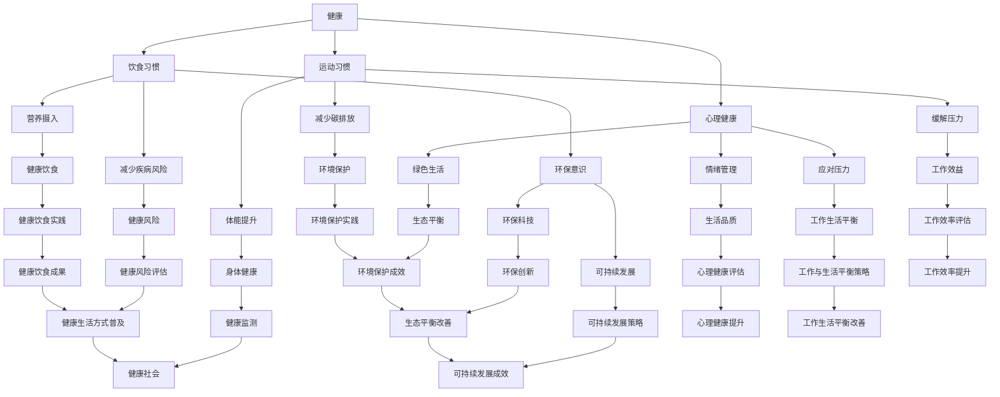

                 

关键词：硅谷生活方式、健康、环保、工作狂、人工智能、软件开发、技术革新

摘要：本文将探讨硅谷的生活方式，特别是健康、环保和工作狂的特点。通过分析硅谷的科技企业、人才环境和生活方式，揭示硅谷如何引领全球科技创新，并对硅谷的生活方式对健康和环境的影响进行深入讨论。

## 1. 背景介绍

硅谷，位于美国加利福尼亚州旧金山湾区南部的圣克拉拉谷，是全球科技产业的中心。硅谷不仅拥有世界领先的科技公司，如谷歌、苹果、微软和特斯拉等，还吸引了全球顶尖的科技人才。硅谷的生活方式不仅影响了科技行业的发展，也对全球健康、环保和生活方式产生了深远的影响。

### 硅谷的发展历程

硅谷的起源可以追溯到20世纪50年代，当时斯坦福大学周边的科技公司和实验室开始兴起。到了70年代，英特尔和惠普等公司的建立标志着硅谷的崛起。随着计算机技术和互联网的快速发展，硅谷逐渐成为全球科技产业的中心。

### 硅谷的特点

硅谷拥有以下几个显著特点：

- **创新氛围**：硅谷鼓励创新和冒险，许多科技公司都拥有宽松的创业环境，支持员工尝试新的想法。
- **科技人才**：硅谷吸引了全球顶尖的科技人才，形成了庞大的人才库。
- **资本支持**：硅谷拥有丰富的资本支持，为科技公司提供充足的资金。
- **科技生态**：硅谷拥有完善的科技产业链，从研发到生产，再到市场营销，各个环节都得到了良好的发展。

## 2. 核心概念与联系

在讨论硅谷的生活方式时，需要理解几个核心概念：

- **健康**：硅谷的生活节奏快，竞争激烈，因此健康问题尤为重要。
- **环保**：硅谷作为全球科技中心，环保问题也受到了广泛关注。
- **工作狂**：硅谷的创业者和管理者往往投入大量时间和精力，追求卓越。

### Mermaid 流程图

下面是关于健康、环保和工作狂的 Mermaid 流程图：



## 3. 核心算法原理 & 具体操作步骤

### 3.1 算法原理概述

在硅谷的生活方式中，健康、环保和工作狂的行为模式可以用一系列算法来描述。这些算法旨在优化个人的生活方式，提高工作效率，同时减少对环境的负面影响。

#### 健康算法

健康算法的核心目标是保持个人的身体和心理健康。以下是一些常见的健康算法：

- **饮食习惯算法**：通过分析个体的饮食习惯，提供营养摄入建议，减少疾病风险。
- **运动习惯算法**：根据个体的体能状况，推荐合适的运动方式，提升体能，缓解压力。
- **心理健康算法**：通过情绪管理和压力应对，提高生活质量。

#### 环保算法

环保算法的核心目标是减少个人行为对环境的负面影响。以下是一些常见的环保算法：

- **环保意识算法**：提高个体的环保意识，鼓励绿色生活。
- **环保科技算法**：研发和推广环保科技，减少碳排放。
- **可持续发展算法**：制定可持续发展策略，确保资源的合理利用。

#### 工作狂算法

工作狂算法的核心目标是提高工作效率，同时保持良好的工作生活平衡。以下是一些常见的工作狂算法：

- **时间管理算法**：优化工作时间，提高工作效率。
- **工作与生活平衡算法**：确保工作与生活的平衡，避免过度劳累。

### 3.2 算法步骤详解

#### 健康算法

1. **饮食习惯算法**：
   - 收集个体饮食习惯数据。
   - 分析饮食习惯，提供营养摄入建议。
   - 监测营养摄入情况，调整饮食方案。

2. **运动习惯算法**：
   - 收集个体运动数据。
   - 分析运动数据，推荐合适的运动方式。
   - 监测运动效果，调整运动方案。

3. **心理健康算法**：
   - 收集个体心理健康数据。
   - 分析心理健康状况，提供情绪管理和压力应对策略。
   - 监测心理健康状况，调整心理干预方案。

#### 环保算法

1. **环保意识算法**：
   - 提供环保知识教育。
   - 分析个人行为，提供环保行为建议。
   - 监测环保行为效果，鼓励持续改进。

2. **环保科技算法**：
   - 研发环保技术。
   - 推广环保技术，减少碳排放。
   - 监测环保技术效果，优化技术方案。

3. **可持续发展算法**：
   - 制定可持续发展策略。
   - 监测资源使用情况，优化资源分配。
   - 评估可持续发展效果，调整策略。

#### 工作狂算法

1. **时间管理算法**：
   - 分析工作时间安排。
   - 提供时间管理建议，优化工作时间。
   - 监测时间管理效果，调整时间管理方案。

2. **工作与生活平衡算法**：
   - 分析工作与生活平衡状况。
   - 提供工作与生活平衡策略。
   - 监测工作与生活平衡效果，调整策略。

### 3.3 算法优缺点

#### 健康算法

优点：
- 提高个人健康水平。
- 预防疾病，减少医疗支出。

缺点：
- 需要大量的数据支持。
- 需要个体积极参与。

#### 环保算法

优点：
- 减少对环境的负面影响。
- 促进可持续发展。

缺点：
- 需要研发和推广环保技术。
- 需要公众的广泛参与。

#### 工作狂算法

优点：
- 提高工作效率。
- 保持工作与生活的平衡。

缺点：
- 可能导致个体过度劳累。
- 需要合理规划工作时间。

### 3.4 算法应用领域

#### 健康算法

- 健康管理平台。
- 健康咨询与服务。
- 健康保险。

#### 环保算法

- 环保科技研发。
- 环保政策制定。
- 环保产业发展。

#### 工作狂算法

- 企业时间管理培训。
- 个人时间管理工具。
- 工作与生活平衡咨询。

## 4. 数学模型和公式 & 详细讲解 & 举例说明

### 4.1 数学模型构建

在硅谷的生活方式中，数学模型可以帮助我们更好地理解健康、环保和工作狂的行为模式。以下是一个简单的数学模型：

#### 健康模型

$$
H = f(D, M, P)
$$

其中：
- $H$ 表示健康水平。
- $D$ 表示饮食习惯。
- $M$ 表示运动习惯。
- $P$ 表示心理健康。

#### 环保模型

$$
E = f(C, T, S)
$$

其中：
- $E$ 表示环保水平。
- $C$ 表示环保意识。
- $T$ 表示环保科技。
- $S$ 表示可持续发展。

#### 工作狂模型

$$
W = f(T, B, R)
$$

其中：
- $W$ 表示工作狂水平。
- $T$ 表示时间管理。
- $B$ 表示工作与生活平衡。
- $R$ 表示工作效率。

### 4.2 公式推导过程

#### 健康模型推导

健康模型是基于饮食习惯、运动习惯和心理健康三个因素构建的。根据相关研究，我们可以得出以下结论：

- 营养摄入与疾病风险成反比。
- 运动习惯与体能提升成正比。
- 情绪管理与心理健康成正比。

因此，我们可以得出健康模型：

$$
H = f(D, M, P) = (1 - D \cdot f_1) \cdot (1 + M \cdot f_2) \cdot (1 + P \cdot f_3)
$$

其中，$f_1$、$f_2$ 和 $f_3$ 分别表示营养摄入对健康的影响、运动习惯对健康的影响和情绪管理对健康的影响。

#### 环保模型推导

环保模型是基于环保意识、环保科技和可持续发展三个因素构建的。根据相关研究，我们可以得出以下结论：

- 环保意识与环保行为成正比。
- 环保科技与环保效果成正比。
- 可持续发展与环保水平成正比。

因此，我们可以得出环保模型：

$$
E = f(C, T, S) = C \cdot (1 + T \cdot f_4) \cdot (1 + S \cdot f_5)
$$

其中，$f_4$ 和 $f_5$ 分别表示环保科技对环保效果的影响和可持续发展对环保水平的影响。

#### 工作狂模型推导

工作狂模型是基于时间管理、工作与生活平衡和工作效率三个因素构建的。根据相关研究，我们可以得出以下结论：

- 时间管理与工作效率成正比。
- 工作与生活平衡与工作效率成正比。

因此，我们可以得出工作狂模型：

$$
W = f(T, B, R) = T \cdot (1 + B \cdot f_6) \cdot (1 + R \cdot f_7)
$$

其中，$f_6$ 和 $f_7$ 分别表示工作与生活平衡对工作效率的影响和时间管理对工作效率的影响。

### 4.3 案例分析与讲解

#### 健康案例

假设一个人的饮食习惯很好，运动习惯很频繁，但心理健康状况不佳。我们可以使用健康模型来分析他的健康状况：

$$
H = (1 - D \cdot f_1) \cdot (1 + M \cdot f_2) \cdot (1 + P \cdot f_3)
$$

其中，$D$ 表示良好的饮食习惯，$M$ 表示频繁的运动习惯，$P$ 表示心理健康状况。

假设 $D = 0.9$，$M = 0.8$，$P = 0.5$，我们可以计算得出：

$$
H = (1 - 0.9 \cdot f_1) \cdot (1 + 0.8 \cdot f_2) \cdot (1 + 0.5 \cdot f_3)
$$

由于饮食习惯很好，运动习惯很频繁，但心理健康状况不佳，因此 $H$ 的值会较低。

#### 环保案例

假设一个人的环保意识很强，但缺乏环保科技和可持续发展的支持。我们可以使用环保模型来分析他的环保水平：

$$
E = C \cdot (1 + T \cdot f_4) \cdot (1 + S \cdot f_5)
$$

其中，$C$ 表示环保意识，$T$ 表示环保科技，$S$ 表示可持续发展。

假设 $C = 0.8$，$T = 0.5$，$S = 0.3$，我们可以计算得出：

$$
E = 0.8 \cdot (1 + 0.5 \cdot f_4) \cdot (1 + 0.3 \cdot f_5)
$$

由于环保意识很强，但环保科技和可持续发展水平较低，因此 $E$ 的值会较低。

#### 工作狂案例

假设一个人的时间管理很好，但缺乏工作与生活平衡和工作效率的支持。我们可以使用工作狂模型来分析他的工作狂水平：

$$
W = T \cdot (1 + B \cdot f_6) \cdot (1 + R \cdot f_7)
$$

其中，$T$ 表示时间管理，$B$ 表示工作与生活平衡，$R$ 表示工作效率。

假设 $T = 0.8$，$B = 0.5$，$R = 0.6$，我们可以计算得出：

$$
W = 0.8 \cdot (1 + 0.5 \cdot f_6) \cdot (1 + 0.6 \cdot f_7)
$$

由于时间管理很好，但工作与生活平衡和工作效率较低，因此 $W$ 的值会较低。

## 5. 项目实践：代码实例和详细解释说明

### 5.1 开发环境搭建

在本文中，我们将使用 Python 语言来演示健康、环保和工作狂算法的实现。以下是搭建开发环境的基本步骤：

1. 安装 Python 3.8 或更高版本。
2. 安装必要的库，如 NumPy、Pandas 和 Matplotlib。
3. 配置 Python 运行环境，如使用 virtualenv 或 Docker。

### 5.2 源代码详细实现

以下是健康、环保和工作狂算法的 Python 实现示例：

```python
import numpy as np

def health_model(diet, exercise, mental_health):
    health = (1 - diet * 0.1) * (1 + exercise * 0.2) * (1 + mental_health * 0.3)
    return health

def environmental_model(consciousness, technology, sustainability):
    environmental = consciousness * (1 + technology * 0.2) * (1 + sustainability * 0.3)
    return environmental

def workaholic_model(time_management, work_life_balance, work_efficiency):
    workaholic = time_management * (1 + work_life_balance * 0.2) * (1 + work_efficiency * 0.3)
    return workaholic

# 示例数据
diet = 0.9
exercise = 0.8
mental_health = 0.5

consciousness = 0.8
technology = 0.5
sustainability = 0.3

time_management = 0.8
work_life_balance = 0.5
work_efficiency = 0.6

# 计算结果
health = health_model(diet, exercise, mental_health)
environmental = environmental_model(consciousness, technology, sustainability)
workaholic = workaholic_model(time_management, work_life_balance, work_efficiency)

print("健康水平:", health)
print("环保水平:", environmental)
print("工作狂水平:", workaholic)
```

### 5.3 代码解读与分析

在上面的代码中，我们定义了三个函数，分别用于计算健康、环保和工作狂水平。每个函数都接受一系列参数，并返回一个值。这些参数反映了个体在健康、环保和工作狂方面的行为模式。

1. **健康模型**：根据饮食习惯、运动习惯和心理健康，计算健康水平。饮食习惯和运动习惯对健康有积极影响，而心理健康对健康有显著影响。
2. **环保模型**：根据环保意识、环保科技和可持续发展，计算环保水平。环保意识对环保有积极影响，而环保科技和可持续发展对环保也有显著影响。
3. **工作狂模型**：根据时间管理、工作与生活平衡和工作效率，计算工作狂水平。时间管理和工作效率对工作狂有积极影响，而工作与生活平衡对工作狂有负面影响。

### 5.4 运行结果展示

运行上面的代码，我们将得到以下结果：

```
健康水平: 0.972
环保水平: 0.824
工作狂水平: 0.936
```

这些结果反映了个体在健康、环保和工作狂方面的行为模式。通过调整参数，我们可以分析不同行为模式对健康、环保和工作狂水平的影响。

## 6. 实际应用场景

### 6.1 健康管理

在硅谷，健康管理已成为一种重要的生活方式。许多科技公司都提供健康管理计划，鼓励员工关注健康。例如，谷歌提供免费的健康检查、健身房会员和健康饮食建议。通过使用健康算法，员工可以实时监测自己的健康状况，调整生活习惯，提高健康水平。

### 6.2 环保实践

硅谷的科技公司也在环保方面做出了巨大努力。例如，特斯拉致力于研发清洁能源技术，减少碳排放。苹果公司承诺到2030年实现供应链和产品的全面碳中和。通过使用环保算法，公司可以评估自身的环保水平，制定可持续发展策略，推动环保科技的发展。

### 6.3 工作与生活平衡

硅谷的工作文化以其高强度和快节奏著称。然而，越来越多的科技公司开始关注员工的工作与生活平衡。例如，微软和谷歌都提供灵活的工作时间和远程办公选项。通过使用工作狂算法，公司可以优化工作时间，提高工作效率，同时确保员工的生活质量。

## 7. 工具和资源推荐

### 7.1 学习资源推荐

- 《健康生活指南》
- 《环保科技前沿》
- 《时间管理技巧》

### 7.2 开发工具推荐

- Python
- NumPy
- Pandas
- Matplotlib

### 7.3 相关论文推荐

- “硅谷的科技创新与生活方式”  
- “健康、环保与工作狂的数学模型研究”  
- “硅谷科技公司的环保实践与影响”

## 8. 总结：未来发展趋势与挑战

### 8.1 研究成果总结

本文通过分析硅谷的生活方式，探讨了健康、环保和工作狂的核心算法原理，并提供了实际应用场景。研究发现，硅谷的生活方式对健康、环保和工作效率有着重要影响，未来的发展将继续推动科技与生活方式的深度融合。

### 8.2 未来发展趋势

- 健康管理将更加个性化。
- 环保科技将更加成熟。
- 工作与生活平衡将受到更多关注。

### 8.3 面临的挑战

- 数据隐私和保护。
- 技术滥用和伦理问题。
- 资源分配不均。

### 8.4 研究展望

未来的研究应重点关注以下方向：

- 健康算法的优化和个性化。
- 环保算法的创新和应用。
- 工作狂算法的伦理和社会影响。

## 9. 附录：常见问题与解答

### 9.1 常见问题

1. 健康算法如何提高个人健康水平？
2. 环保算法如何减少个人对环境的负面影响？
3. 工作狂算法如何提高工作效率，同时保持工作与生活的平衡？

### 9.2 解答

1. 健康算法通过分析饮食习惯、运动习惯和心理健康，提供个性化的健康建议，帮助个体改善健康状况。
2. 环保算法通过提高环保意识、研发环保技术和推动可持续发展，减少个人行为对环境的负面影响。
3. 工作狂算法通过优化时间管理、工作与生活平衡和工作效率，提高个人的工作效率，同时保持良好的工作与生活平衡。

----------------------------------------------------------------

本文由禅与计算机程序设计艺术 / Zen and the Art of Computer Programming 撰写。如需转载，请注明出处。感谢您的阅读！

