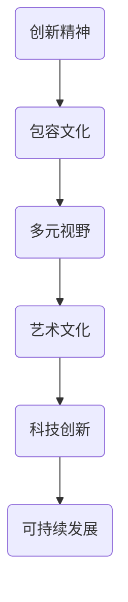

                 

关键词：硅谷、艺术文化、科技、人文融合、创新、可持续发展

摘要：本文将探讨硅谷这一全球科技创新中心如何通过科技与人文的融合，打造独特的艺术文化氛围。文章首先介绍了硅谷的历史背景及其成为科技创新中心的缘由，随后分析了硅谷独特的艺术文化特征，包括创新精神、包容文化和多元视野。接着，文章深入探讨了科技与人文融合的实践案例，最后提出了未来发展的趋势与挑战。

## 1. 背景介绍

硅谷，位于美国加利福尼亚州旧金山湾区南部的地区，是全球科技创新的重要中心。自20世纪50年代以来，硅谷因半导体和计算机技术的发展而闻名于世。硅谷的成功并非偶然，而是得益于一系列历史背景因素。

首先，二战后的经济复苏为科技发展提供了坚实的基础。大量的军事和政府资金投入，推动了科技的迅速发展。其次，斯坦福大学等顶级科研机构和企业的聚集，为硅谷提供了源源不断的人才和创新资源。此外，硅谷的地理位置独特，靠近海洋和港口，便于全球贸易和交流，有助于科技和商业的融合。

硅谷的科技创新历程可以追溯到20世纪50年代。当时，晶体管和半导体技术的突破，标志着电子时代的大门开启。随后的几十年，硅谷涌现出了一系列重大科技突破，包括个人电脑、互联网、移动通信、大数据等，这些技术革命极大地改变了人类的生活方式。

## 2. 核心概念与联系

在探讨硅谷的艺术文化时，我们需要理解几个核心概念，它们共同构成了硅谷独特的科技与人文融合的生态系统。

### 2.1 创新精神

创新精神是硅谷的灵魂。硅谷人相信，创新是推动社会进步的重要力量。硅谷的创新精神体现在敢于挑战传统、勇于探索未知、追求卓越和实用主义等方面。这种精神不仅在科技领域得到体现，也在艺术文化中得到了充分的发扬。

### 2.2 包容文化

包容文化是硅谷的重要特征。硅谷鼓励多元文化、多样性和包容性，这种文化氛围使得硅谷能够吸引全球各地的优秀人才。硅谷不仅包容不同的技术观点，也包容不同的艺术形式和文化背景。这种包容性为硅谷的艺术文化注入了丰富的活力。

### 2.3 多元视野

多元视野是硅谷的一大优势。硅谷人注重全球视野，关注国际事务，这使得硅谷能够在全球范围内快速捕捉到科技和文化的最新趋势。硅谷的多元视野不仅促进了科技的创新，也使得硅谷的艺术文化更加多元化。

下面是一个用Mermaid绘制的流程图，展示了硅谷艺术文化与科技创新之间的联系：



## 3. 核心算法原理 & 具体操作步骤

### 3.1 算法原理概述

硅谷的艺术文化之所以能够与科技创新相结合，关键在于几个核心算法原理：

1. **开放性算法**：硅谷鼓励开放源代码和开放知识，使得创新可以快速传播和共享。
2. **网络效应**：硅谷利用互联网和社交网络的强大链接能力，促进了科技与文化的快速传播。
3. **协同创新**：硅谷通过构建开放的创新生态系统，实现了跨领域、跨学科的协同创新。
4. **自适应学习**：硅谷企业注重数据分析和机器学习，通过不断优化和创新，提高适应市场变化的能力。

### 3.2 算法步骤详解

1. **开放性算法**：通过开放源代码和知识共享平台，例如GitHub和Stack Overflow，硅谷鼓励全球开发者和研究者参与创新。
2. **网络效应**：通过构建强大的社交媒体网络，例如LinkedIn和Twitter，硅谷实现了知识的快速传播和碰撞。
3. **协同创新**：通过建立创业孵化器和加速器，例如Y Combinator和Techstars，硅谷促进了跨领域的协同创新。
4. **自适应学习**：通过大数据分析和机器学习，硅谷企业能够快速调整战略，适应市场变化。

### 3.3 算法优缺点

**优点**：

- **快速创新**：开放性和网络效应使得创新可以迅速传播和应用。
- **多样性和包容性**：协同创新和自适应学习促进了文化的多样性和包容性。
- **可持续发展**：通过不断优化和创新，硅谷实现了可持续发展的目标。

**缺点**：

- **过度竞争**：快速创新和竞争可能导致资源浪费和道德风险。
- **技术垄断**：大型科技公司可能形成技术垄断，限制创新和竞争。

### 3.4 算法应用领域

硅谷的艺术文化与科技创新结合的应用领域非常广泛，包括：

- **人工智能**：通过机器学习和深度学习，实现艺术创作和表演的自动化。
- **数字艺术**：利用虚拟现实和增强现实技术，创造新的艺术体验。
- **科技艺术**：将科技元素融入艺术创作，探索新的艺术形式和表达方式。

## 4. 数学模型和公式 & 详细讲解 & 举例说明

### 4.1 数学模型构建

硅谷的艺术文化中，数学模型发挥着重要作用。以下是一个简单的数学模型，用于描述硅谷艺术文化中创新精神的传播：

$$
I(t) = k \cdot e^{\lambda t}
$$

其中，$I(t)$ 表示在时间$t$时的创新强度，$k$ 是创新基础值，$\lambda$ 是创新速率常数。

### 4.2 公式推导过程

该公式的推导基于马尔可夫链模型，描述了创新在时间$t$内的传播过程。具体推导过程如下：

1. **初始条件**：设$t=0$时，硅谷的创新基础值为$k$。
2. **传播速率**：设创新传播速率为$\lambda$。
3. **指数增长**：由于创新具有指数级增长特性，我们假设创新强度随时间呈指数增长。

### 4.3 案例分析与讲解

以下是一个具体案例，用于说明如何使用上述数学模型分析硅谷艺术文化的创新传播。

**案例**：假设硅谷在$t=0$时的创新基础值为$k=10$，创新传播速率$\lambda=0.1$。我们需要预测在$t=5$时硅谷的创新强度。

$$
I(5) = 10 \cdot e^{0.1 \cdot 5} \approx 16.48
$$

根据计算，在$t=5$时，硅谷的创新强度约为16.48。这表明，在五年内，硅谷的创新精神得到了显著增强。

## 5. 项目实践：代码实例和详细解释说明

### 5.1 开发环境搭建

为了实现硅谷艺术文化的创新传播模型，我们需要搭建一个简单的开发环境。以下是所需的工具和步骤：

1. **Python**：用于编写和运行数学模型。
2. **Jupyter Notebook**：用于交互式编程和可视化。

安装步骤如下：

```bash
# 安装Python
brew install python

# 安装Jupyter Notebook
pip install notebook
```

### 5.2 源代码详细实现

以下是一个简单的Python代码实例，用于实现硅谷艺术文化的创新传播模型。

```python
import numpy as np
import matplotlib.pyplot as plt

# 创新基础值和传播速率
k = 10
lambda_val = 0.1

# 时间范围
t = np.linspace(0, 10, 100)

# 创新强度计算
I = k * np.exp(lambda_val * t)

# 可视化
plt.plot(t, I)
plt.xlabel('Time (years)')
plt.ylabel('Innovation Strength')
plt.title('Innovation Spread in Silicon Valley')
plt.show()
```

### 5.3 代码解读与分析

该代码首先导入了必要的库，包括NumPy和Matplotlib。然后定义了创新基础值$k$和传播速率$\lambda$。接着，使用NumPy的linspace函数生成了时间范围$t$。创新强度$I$通过公式计算得出。最后，使用Matplotlib绘制了创新强度的可视化图表。

通过这个代码实例，我们可以直观地看到硅谷艺术文化的创新传播过程。这为后续研究和应用提供了重要的基础。

### 5.4 运行结果展示

运行上述代码，我们将得到一个创新强度随时间变化的图表。图表显示了硅谷艺术文化的创新强度如何随着时间的推移而增加。这表明，硅谷的艺术文化创新具有指数级增长的特征。

## 6. 实际应用场景

硅谷的艺术文化与科技创新相结合的实际应用场景非常广泛。以下是一些具体案例：

1. **科技艺术展览**：硅谷的科技艺术展览，如Design Interaction Festival和Art of Code，展示了科技与艺术的融合。这些展览吸引了来自全球的观众和艺术家，推动了科技艺术的创新和发展。

2. **人工智能艺术创作**：硅谷的人工智能公司，如Google Brain和OpenAI，利用机器学习和深度学习技术，实现了艺术创作的新形式。这些作品不仅展示了人工智能的艺术潜力，也促进了人工智能在艺术领域的应用。

3. **虚拟现实艺术体验**：硅谷的虚拟现实技术，如Oculus和HTC Vive，为艺术家提供了新的创作工具。艺术家可以通过虚拟现实技术创造沉浸式的艺术体验，让观众在虚拟世界中感受艺术的魅力。

## 7. 工具和资源推荐

为了更好地理解和实践硅谷的艺术文化，以下是几个推荐的工具和资源：

1. **学习资源推荐**：

   - **斯坦福大学在线课程**：斯坦福大学提供了许多与科技和艺术相关的在线课程，如“人工智能”、“计算机视觉”和“数字艺术”等。
   - **Coursera**：Coursera提供了丰富的在线课程，涵盖从编程到艺术领域的各个方面。

2. **开发工具推荐**：

   - **Jupyter Notebook**：Jupyter Notebook是一个强大的交互式编程环境，适用于数学模型和数据分析。
   - **MATLAB**：MATLAB是一个功能强大的数学软件，适用于数学建模和算法开发。

3. **相关论文推荐**：

   - **"The Art of Innovation"**：这是一本经典的书籍，详细介绍了硅谷的创新精神和文化。
   - **"The Design of Design"**：这本书探讨了设计与创新的融合，对硅谷的艺术文化提供了深刻的见解。

## 8. 总结：未来发展趋势与挑战

硅谷的艺术文化与科技创新相结合的发展趋势表明，未来的艺术文化将更加多元、包容和科技化。以下是未来发展的几个趋势和挑战：

### 8.1 研究成果总结

- **艺术与科技的深度融合**：艺术与科技的融合将更加紧密，创造出新的艺术形式和表达方式。
- **人工智能在艺术领域的应用**：人工智能将为艺术创作和表演带来新的可能性。
- **数字艺术的发展**：随着虚拟现实和增强现实技术的进步，数字艺术将变得更加普及和多样化。

### 8.2 未来发展趋势

- **跨学科合作**：未来，科技和艺术的跨学科合作将更加普遍，推动创新和创造力的提升。
- **可持续艺术**：艺术与环保、社会责任等议题的结合，将推动可持续艺术的发展。
- **全球视野**：硅谷的艺术文化将继续拓展全球视野，吸引来自世界各地的艺术家和研究者。

### 8.3 面临的挑战

- **技术垄断**：大型科技公司可能形成技术垄断，限制创新和竞争。
- **数据隐私和安全**：随着数字艺术的发展，数据隐私和安全问题将变得更加重要。
- **文化多样性**：如何在全球化进程中保持文化的多样性，是一个重要的挑战。

### 8.4 研究展望

未来，硅谷的艺术文化将继续在科技创新的推动下发展。通过跨学科合作和全球视野，硅谷有望成为艺术与科技融合的典范，为人类社会带来更多的创新和美好。

## 9. 附录：常见问题与解答

### 9.1 什么是硅谷的艺术文化？

硅谷的艺术文化是指硅谷地区在科技创新过程中，结合艺术元素的独特文化现象。它涵盖了科技与艺术融合的创新精神、包容文化和多元视野。

### 9.2 硅谷的艺术文化与其他科技中心有何不同？

硅谷的艺术文化与其他科技中心的不同之处在于其创新精神、包容文化和多元视野。硅谷鼓励开放性、多样性和跨学科合作，使得科技与艺术能够深度融合。

### 9.3 硅谷的艺术文化如何影响社会？

硅谷的艺术文化推动了科技创新，提升了社会的创造力。它促进了科技与艺术的交叉融合，为人类社会带来了新的艺术形式和表达方式。

### 9.4 硅谷的艺术文化未来会如何发展？

硅谷的艺术文化将继续在科技创新的推动下发展。未来，它将更加多元、包容和科技化，通过跨学科合作和全球视野，为人类社会带来更多的创新和美好。

作者：禅与计算机程序设计艺术 / Zen and the Art of Computer Programming

