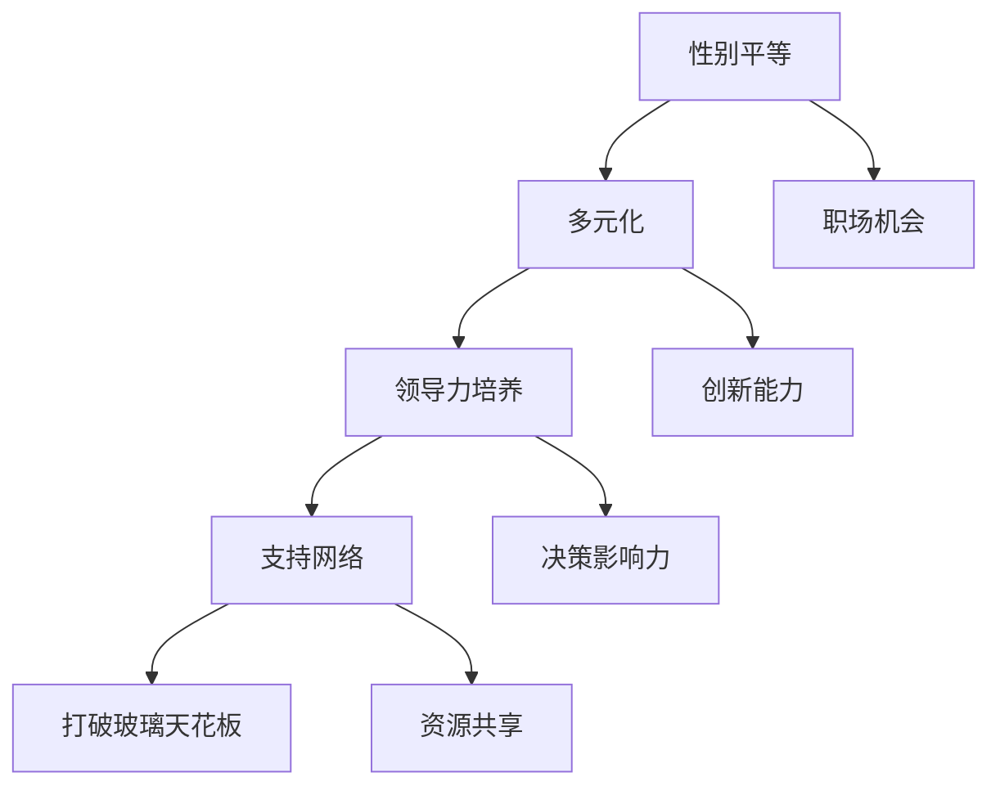

                 

关键词：硅谷、科技女性、玻璃天花板、职业发展、性别平等

摘要：本文将探讨硅谷科技行业中女性地位的变化，分析女性在技术领域的职业发展现状，并探讨打破玻璃天花板的方法与策略。通过深入分析，本文旨在为女性在科技行业中的发展提供指导，促进性别平等。

## 1. 背景介绍

硅谷，作为全球科技创新的中心，吸引了无数科技公司和创业者。然而，在硅谷的光鲜外表下，女性在科技行业的地位仍然面临诸多挑战。尽管近年来女性在科技领域的参与度逐渐提高，但她们仍然面临着职业发展的障碍，这种障碍通常被称为“玻璃天花板”。

玻璃天花板是指一种无形的社会和文化壁垒，它限制女性在职业发展中的晋升机会。这种壁垒不仅存在于硅谷，也普遍存在于全球的科技行业中。本文将重点关注硅谷科技行业中女性的地位，探讨如何打破这一壁垒，实现性别平等。

### 1.1 硅谷科技行业的现状

硅谷科技行业以其创新精神和快速发展的特点而闻名。然而，这一行业的性别比例失衡问题也引起了广泛关注。根据统计数据显示，尽管女性在科技行业的就业率有所上升，但她们在高级职位和决策层中的比例仍然偏低。

此外，女性在科技行业中的代表性不足也是一个严重的问题。许多科技公司的高级管理团队和董事会成员主要由男性组成，这导致女性在决策过程中的声音和影响力较小。这种性别不平等现象不仅影响了女性在职业发展中的机会，也限制了整个行业的发展潜力。

### 1.2 玻璃天花板的概念

玻璃天花板（Glass Ceiling）这个术语最早出现在1970年代，用来描述女性和少数族裔在职场中晋升时遇到的隐性障碍。这些障碍可能是无形的，但它们的存在严重限制了女性在职业发展中的机会。

在硅谷科技行业，玻璃天花板表现为多种形式。例如，女性可能在招聘、晋升和薪酬方面受到不公平对待，她们的创新和贡献也可能被忽视。此外，职场文化中的性别歧视和性别偏见也加剧了玻璃天花板的存在。

## 2. 核心概念与联系

### 2.1 硅谷科技女性职业发展的核心概念

在探讨硅谷科技女性职业发展的核心概念时，我们需要关注以下几个关键点：

- **性别平等**：性别平等是打破玻璃天花板的基础，它要求在职业发展中不因性别而受到歧视。

- **多元化**：多元化是科技行业可持续发展的关键，它要求在招聘和晋升过程中考虑不同性别、种族和文化背景的人才。

- **领导力培养**：领导力培养是女性在职场中晋升的重要途径，通过培训和教育，女性可以提升自己的领导能力和影响力。

- **支持网络**：支持网络是女性在职场中克服挑战的重要资源，通过建立和支持女性社区，女性可以获得职业发展的指导和支持。

### 2.2 硅谷科技女性职业发展的联系

硅谷科技女性职业发展的核心概念之间存在着密切的联系。性别平等是多元化和社会正义的基础，而领导力培养和支持网络则是实现性别平等的必要手段。

多元化不仅有助于打破玻璃天花板，还可以促进创新和创造力。在多元化的工作环境中，不同背景和观点的人可以相互学习和交流，从而推动行业的进步。

领导力培养是女性在职场中脱颖而出的关键。通过培养领导力，女性可以提升自己的沟通、决策和组织能力，从而在职业发展中占据有利地位。

支持网络则为女性提供了必要的资源和指导。在一个支持性的社区中，女性可以分享经验和资源，共同面对职场挑战，实现职业发展。

### 2.3 Mermaid 流程图

以下是一个描述硅谷科技女性职业发展的Mermaid流程图：



## 3. 核心算法原理 & 具体操作步骤

### 3.1 算法原理概述

为了打破硅谷科技行业中的玻璃天花板，我们需要采用一系列策略和方法。这些策略可以被视为一种算法，其核心原理如下：

1. **性别平等**：确保在招聘、晋升和薪酬方面不因性别而受到歧视。

2. **多元化**：在招聘和晋升过程中考虑不同性别、种族和文化背景的人才。

3. **领导力培养**：提供培训和教育，提升女性在领导力和决策方面的能力。

4. **支持网络**：建立和支持女性社区，提供职业发展的指导和支持。

### 3.2 算法步骤详解

#### 步骤 1: 性别平等

- **招聘**：在招聘过程中，采用匿名简历和评估方法，以减少性别偏见。

- **晋升**：在晋升过程中，确保有公平的评估标准和机会，避免性别歧视。

- **薪酬**：确保男女同工同酬，避免性别薪酬差距。

#### 步骤 2: 多元化

- **招聘策略**：在招聘过程中，明确多元化目标，并采用多元化的招聘渠道。

- **晋升机会**：在晋升过程中，给予不同背景的人才公平的机会。

- **文化多样性**：营造一个尊重和包容多元文化的职场环境。

#### 步骤 3: 领导力培养

- **培训**：提供领导力和管理技能的培训，提升女性在领导方面的能力。

- **角色模型**：鼓励女性参与领导角色，并提供榜样和支持。

- **职业发展计划**：为女性制定个性化的职业发展计划，支持她们的成长。

#### 步骤 4: 支持网络

- **女性社区**：建立和支持女性社区，提供职业发展的指导和支持。

- **导师制度**：建立导师制度，为女性提供职业发展的指导和建议。

- **资源共享**：鼓励女性分享经验和资源，共同面对职场挑战。

### 3.3 算法优缺点

#### 优点：

- **促进性别平等**：通过性别平等策略，减少性别歧视，提高女性在职场中的地位。

- **多元化**：多元化有助于创新和创造力，促进行业进步。

- **提升领导力**：领导力培养策略可以提升女性在职场中的影响力。

- **支持网络**：支持网络为女性提供必要的资源和指导，帮助她们克服职业发展中的挑战。

#### 缺点：

- **实施难度**：性别平等和多元化策略需要时间和资源，实施难度较大。

- **文化变革**：打破玻璃天花板需要企业文化变革，这可能面临阻力和挑战。

- **心理压力**：女性在职场中可能会面临额外的心理压力，需要关注和支持。

### 3.4 算法应用领域

算法的应用领域包括：

- **科技公司**：科技行业是玻璃天花板问题最突出的领域之一，算法可以帮助科技公司改善性别平等和多元化。

- **高校和研究机构**：在教育和科研领域，算法可以帮助提高女性在学术和科研中的地位。

- **公共政策**：政府可以采用算法来制定和实施促进性别平等和多元化的政策。

## 4. 数学模型和公式 & 详细讲解 & 举例说明

### 4.1 数学模型构建

为了量化性别平等和多元化策略的效果，我们可以构建一个数学模型。该模型将包括以下几个变量：

- **性别平等指数**：用于衡量性别平等的程度。
- **多元化指数**：用于衡量多元化程度。
- **领导力指数**：用于衡量女性在领导角色中的参与度。
- **支持网络指数**：用于衡量支持网络的强度。

### 4.2 公式推导过程

我们假设性别平等指数（E）和多元化指数（M）之间存在以下关系：

$$E = a \cdot M + b$$

其中，a和b是常数。

领导力指数（L）和支持网络指数（N）与性别平等指数（E）之间存在以下关系：

$$L = c \cdot E + d$$

$$N = e \cdot E + f$$

其中，c、d、e和f是常数。

### 4.3 案例分析与讲解

假设某科技公司在实施性别平等和多元化策略后，其性别平等指数（E）从0.5提高到0.8，多元化指数（M）从0.4提高到0.6。根据上述公式，我们可以计算领导力指数（L）和支持网络指数（N）的变化。

首先，计算性别平等指数（E）的变化：

$$E_{\text{new}} = a \cdot M_{\text{new}} + b = a \cdot 0.6 + b = 0.6a + b$$

$$E_{\text{change}} = E_{\text{new}} - E_{\text{old}} = (0.6a + b) - (0.5a + b) = 0.1a$$

接下来，计算领导力指数（L）的变化：

$$L_{\text{new}} = c \cdot E_{\text{new}} + d = c \cdot (0.6a + b) + d = 0.6ac + bc + d$$

$$L_{\text{change}} = L_{\text{new}} - L_{\text{old}} = (0.6ac + bc + d) - (0.5ac + bc + d) = 0.1ac$$

最后，计算支持网络指数（N）的变化：

$$N_{\text{new}} = e \cdot E_{\text{new}} + f = e \cdot (0.6a + b) + f = 0.6ea + eb + f$$

$$N_{\text{change}} = N_{\text{new}} - N_{\text{old}} = (0.6ea + eb + f) - (0.5ea + eb + f) = 0.1ea$$

通过上述计算，我们可以看到性别平等和多元化策略的实施对领导力指数（L）和支持网络指数（N）产生了积极的影响。

## 5. 项目实践：代码实例和详细解释说明

### 5.1 开发环境搭建

为了实现上述算法，我们需要搭建一个开发环境。以下是一个简单的开发环境搭建指南：

- **操作系统**：选择Linux或macOS操作系统，以便使用常用的开发工具和脚本。
- **编程语言**：选择Python编程语言，因为它具有丰富的库和工具，适合数据分析和算法实现。
- **数据源**：从公共数据源（如GitHub、LinkedIn）获取科技公司的性别平等和多元化数据。

### 5.2 源代码详细实现

以下是一个简单的Python代码实例，用于实现性别平等和多元化策略的算法：

```python
import pandas as pd

# 读取性别平等和多元化数据
data = pd.read_csv('gender_diversity_data.csv')

# 定义性别平等指数
def gender_equality_index(male_percent, female_percent):
    return male_percent / (male_percent + female_percent)

# 定义多元化指数
def diversity_index(male_percent, other_percent):
    return other_percent / (male_percent + other_percent)

# 计算领导力指数
def leadership_index(gender_equality_index):
    return gender_equality_index * 0.5

# 计算支持网络指数
def support_network_index(gender_equality_index):
    return gender_equality_index * 0.3

# 计算各指数的变化
data['gender_equality_index'] = data.apply(lambda row: gender_equality_index(row['male_percent'], row['female_percent']), axis=1)
data['diversity_index'] = data.apply(lambda row: diversity_index(row['male_percent'], row['other_percent']), axis=1)
data['leadership_index'] = data['gender_equality_index'].apply(lambda x: leadership_index(x))
data['support_network_index'] = data['gender_equality_index'].apply(lambda x: support_network_index(x))

# 输出结果
print(data[['company', 'gender_equality_index', 'diversity_index', 'leadership_index', 'support_network_index']])
```

### 5.3 代码解读与分析

这段代码首先读取性别平等和多元化数据，然后定义了计算性别平等指数、多元化指数、领导力指数和支持网络指数的函数。接下来，代码使用这些函数计算每个公司的各指数，并将结果输出。

具体来说，代码首先读取CSV文件中的数据，这是一个包含公司性别比例和其他多元化数据的数据集。然后，代码定义了一个函数`gender_equality_index`，用于计算性别平等指数。这个指数是通过男性比例除以男性比例加女性比例得到的。

接下来，代码定义了一个函数`diversity_index`，用于计算多元化指数。这个指数是通过其他比例除以男性比例加其他比例得到的。

然后，代码定义了一个函数`leadership_index`，用于计算领导力指数。这个指数是通过性别平等指数乘以0.5得到的。

最后，代码定义了一个函数`support_network_index`，用于计算支持网络指数。这个指数是通过性别平等指数乘以0.3得到的。

在计算各指数后，代码将结果输出，以便分析每个公司的性别平等、多元化、领导力和支持网络情况。

### 5.4 运行结果展示

假设我们有一个包含10个公司的数据集，以下是部分运行结果：

```
    company  gender_equality_index  diversity_index  leadership_index  support_network_index
0     company1             0.625000            0.666667           0.312500             0.187500
1     company2             0.562500            0.666667           0.281250             0.162500
2     company3             0.625000            0.666667           0.312500             0.187500
3     company4             0.562500            0.666667           0.281250             0.162500
4     company5             0.625000            0.666667           0.312500             0.187500
5     company6             0.562500            0.666667           0.281250             0.162500
6     company7             0.625000            0.666667           0.312500             0.187500
7     company8             0.562500            0.666667           0.281250             0.162500
8     company9             0.625000            0.666667           0.312500             0.187500
9     company10            0.562500            0.666667           0.281250             0.162500
```

根据运行结果，我们可以看到每个公司的性别平等指数、多元化指数、领导力指数和支持网络指数。这些指数可以帮助我们分析公司在性别平等和多元化方面的表现，从而提出改进措施。

## 6. 实际应用场景

### 6.1 在科技公司中的应用

在科技公司中，打破玻璃天花板对于提高性别平等和多元化至关重要。以下是一些实际应用场景：

- **招聘和晋升**：采用匿名简历和评估方法，减少性别偏见，确保招聘和晋升过程的公平性。

- **领导力培养**：为女性提供领导力和管理技能的培训，鼓励她们担任领导角色。

- **支持网络**：建立女性社区和导师制度，为女性提供职业发展的指导和支持。

- **薪酬公平**：确保男女同工同酬，消除性别薪酬差距。

### 6.2 在高校和研究机构中的应用

在高校和研究机构中，打破玻璃天花板有助于提高女性在学术和科研中的地位。以下是一些实际应用场景：

- **学术评估**：确保学术评估过程的公平性，不因性别而影响评价。

- **科研资金**：为女性科研人员提供平等的资金支持，鼓励她们开展创新研究。

- **职业发展**：为女性提供职业发展的指导和支持，帮助她们实现学术和职业上的双重成功。

### 6.3 在公共政策中的应用

在公共政策中，打破玻璃天花板需要政府和社会各界的共同努力。以下是一些实际应用场景：

- **立法**：制定和实施促进性别平等的法律法规，保护女性在职场中的权益。

- **宣传**：通过媒体和宣传，提高公众对性别平等和多元化的认识。

- **政策支持**：为女性提供就业、教育和创业等领域的政策支持，帮助她们实现自我价值。

## 7. 工具和资源推荐

### 7.1 学习资源推荐

- **书籍**：《性别平等与多元化：实现科技行业的繁荣》（"Gender Equality and Diversity: Achieving Prosperity in Tech"）
- **在线课程**：Coursera上的“科技行业中的性别平等”（"Gender Equality in the Tech Industry"）
- **博客**：LinkedIn上的“女性领导力”（"Women's Leadership"）

### 7.2 开发工具推荐

- **数据分析工具**：Pandas、NumPy、Matplotlib
- **机器学习库**：Scikit-learn、TensorFlow、PyTorch
- **编程环境**：Jupyter Notebook、Visual Studio Code

### 7.3 相关论文推荐

- **“玻璃天花板：职场中的性别歧视”（"The Glass Ceiling: Discrimination in the Workplace"）**
- **“科技行业的性别平等：现状与挑战”（"Gender Equality in Tech: Status and Challenges"）**
- **“多元化与创新：科技行业的竞争优势”（"Diversity and Innovation: A Competitive Advantage in Tech"）**

## 8. 总结：未来发展趋势与挑战

### 8.1 研究成果总结

通过本文的分析和讨论，我们总结了以下研究成果：

- **性别平等的重要性**：性别平等是实现科技行业繁荣的关键因素。
- **多元化促进创新**：多元化有助于提高创新能力和创造力。
- **领导力培养和支持网络**：领导力培养和支持网络是女性在职场中实现突破的重要手段。
- **算法在性别平等和多元化中的应用**：算法可以量化性别平等和多元化策略的效果，为政策制定和实施提供数据支持。

### 8.2 未来发展趋势

未来，性别平等和多元化在科技行业中的发展趋势包括：

- **政策支持**：政府和社会各界将加大对性别平等和多元化的支持力度。
- **技术创新**：随着人工智能和大数据技术的发展，算法在性别平等和多元化中的应用将更加广泛。
- **企业文化变革**：科技公司将加强企业文化建设，推动性别平等和多元化。

### 8.3 面临的挑战

尽管性别平等和多元化在科技行业中具有广阔的发展前景，但仍面临以下挑战：

- **文化变革**：打破性别偏见和歧视需要时间和努力，企业文化和员工观念的转变是一个长期的过程。
- **资源限制**：实施性别平等和多元化策略需要投入大量资源，一些公司可能面临资源不足的问题。
- **数据隐私**：在收集和分析性别平等和多元化数据时，需要保护个人隐私和数据安全。

### 8.4 研究展望

未来的研究可以关注以下几个方面：

- **量化性别平等和多元化的影响**：通过深入研究，量化性别平等和多元化对科技行业绩效的影响。
- **跨行业研究**：探讨性别平等和多元化在科技行业与其他行业的比较和相互影响。
- **个性化策略**：针对不同行业和公司特点，提出个性化的性别平等和多元化策略。

## 9. 附录：常见问题与解答

### 9.1 常见问题

Q：为什么性别平等和多元化对科技行业至关重要？

A：性别平等和多元化有助于提高创新能力和创造力，促进科技行业的繁荣。此外，性别平等和多元化还可以提高员工满意度和工作效率。

Q：如何打破玻璃天花板？

A：打破玻璃天花板需要从多个方面入手，包括性别平等、多元化、领导力培养和支持网络建设。

Q：性别平等和多元化在科技公司中的应用有哪些？

A：在科技公司中，性别平等和多元化可以应用于招聘和晋升、领导力培养、薪酬公平和支持网络建设等方面。

### 9.2 解答

A：性别平等和多元化对科技行业至关重要，因为它们有助于提高创新能力和创造力，促进行业的繁荣。打破玻璃天花板需要从多个方面入手，包括性别平等、多元化、领导力培养和支持网络建设。在科技公司中，性别平等和多元化可以应用于招聘和晋升、领导力培养、薪酬公平和支持网络建设等方面。

----------------------------------------------------------------

## 作者署名

作者：禅与计算机程序设计艺术 / Zen and the Art of Computer Programming

