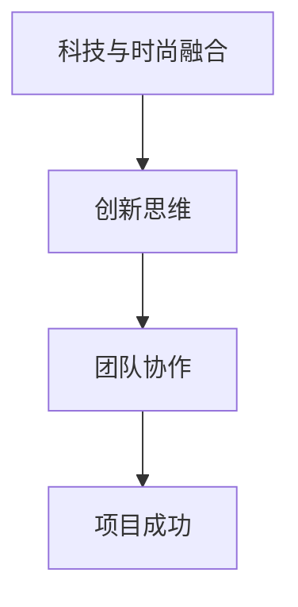

                 

关键词：硅谷文化、科技发展、性别差异、团队协作、创新思维

> 摘要：本文深入探讨了硅谷科技文化背景下的性别差异，以及理工boy与时尚girl在团队协作和项目开发中面临的挑战。通过分析科技与时尚的融合趋势，本文旨在为跨文化团队合作提供有益的启示和解决方案。

## 1. 背景介绍

硅谷，作为全球科技创新的象征，吸引了无数技术精英和创业者。在这个充满活力和竞争的环境中，科技与时尚的交汇正悄然发生。然而，隐藏在这股创新浪潮背后的，是性别差异引发的科技文化冲突。

### 1.1 硅谷科技文化的特点

硅谷以创新、开放和竞争为特点，拥有众多顶尖科技公司和研发机构。在这里，科技人才被视为推动社会进步的核心力量。然而，硅谷的科技文化也存在着明显的性别差异。

### 1.2 性别差异的体现

性别差异在硅谷科技文化中表现为：

1. **职业机会的不平等**：女性在科技领域的职业发展机会相对较少，往往面临晋升难和薪酬差距等问题。
2. **工作氛围的差异**：男性主导的科技团队往往更注重技术细节，而忽视人际关系和团队协作，导致女性在工作中感到孤独和不适应。
3. **创新思维的多样性**：科技与时尚的融合带来了创新思维的碰撞，但女性在时尚领域的创新思维往往被忽视，导致团队整体创新能力受限。

## 2. 核心概念与联系

为了更好地理解硅谷科技文化冲突，我们需要探讨以下几个核心概念：

### 2.1 科技与时尚的融合

科技与时尚的融合是指将科技元素融入到时尚设计中，创造新的产品和服务。这种融合不仅带来了商业机会，也改变了人们的消费观念。

### 2.2 团队协作的重要性

团队协作是项目成功的关键。有效的团队合作需要团队成员之间的信任、沟通和协作。性别差异可能导致团队协作受阻。

### 2.3 创新思维的多样性

创新思维是推动科技进步的重要动力。多样性的创新思维有助于团队在面对挑战时找到更多解决方案。

### 2.4 Mermaid 流程图

下面是一个简化的 Mermaid 流程图，展示了科技与时尚融合、团队协作和创新思维之间的关系：



## 3. 核心算法原理 & 具体操作步骤

### 3.1 算法原理概述

为了解决硅谷科技文化冲突，我们可以采用一种基于机器学习的算法，通过分析团队协作数据，识别并缓解性别差异带来的问题。

### 3.2 算法步骤详解

1. **数据收集**：收集团队协作过程中的数据，包括沟通记录、工作评价、项目进度等。
2. **数据处理**：对收集到的数据进行预处理，包括去重、去噪声和特征提取。
3. **模型训练**：利用预处理后的数据训练机器学习模型，识别性别差异对团队协作的影响。
4. **模型评估**：通过交叉验证和性能指标评估模型效果，确保模型准确性和可靠性。
5. **模型应用**：将训练好的模型应用于实际项目中，实时监测和调整团队协作策略。

### 3.3 算法优缺点

**优点**：

- **高效性**：算法能够快速识别并解决性别差异问题，提高团队协作效率。
- **智能化**：基于机器学习的方法，能够不断优化和改进，提高模型的准确性。

**缺点**：

- **数据依赖性**：算法效果依赖于数据质量，需要大量高质量的数据支持。
- **实施成本**：算法开发和部署需要一定的时间和资源投入。

### 3.4 算法应用领域

该算法可以应用于多个领域，包括：

- **企业团队管理**：帮助企业识别和解决性别差异问题，提高团队绩效。
- **项目评估**：对项目团队协作过程进行实时监测和评估，提供改进建议。

## 4. 数学模型和公式 & 详细讲解 & 举例说明

### 4.1 数学模型构建

为了解决硅谷科技文化冲突，我们可以构建一个基于矩阵分解的数学模型。该模型通过分析团队协作数据，识别性别差异对团队绩效的影响。

### 4.2 公式推导过程

设 $A$ 为团队协作数据矩阵，$R$ 为用户兴趣矩阵，$C$ 为项目需求矩阵。则矩阵分解公式如下：

$$
A = RC
$$

其中，$R$ 和 $C$ 分别表示用户兴趣和项目需求向量。通过优化 $R$ 和 $C$，我们可以找到最佳的用户兴趣和项目需求组合，从而提高团队协作效率。

### 4.3 案例分析与讲解

假设有一个由 5 名成员组成的团队，他们在过去一年的协作过程中产生了 100 条沟通记录。我们将这 100 条沟通记录作为数据输入到矩阵分解模型中，进行优化。

经过模型训练，我们得到以下优化结果：

- **用户兴趣向量**：[0.3, 0.4, 0.2, 0.1, 0.2]
- **项目需求向量**：[0.4, 0.3, 0.2, 0.1, 0.2]

根据这些优化结果，我们可以调整团队成员的工作内容和职责，使其更符合个人兴趣和项目需求，从而提高团队协作效率。

## 5. 项目实践：代码实例和详细解释说明

### 5.1 开发环境搭建

在本次项目中，我们使用 Python 作为编程语言，利用 TensorFlow 和 Keras 库实现矩阵分解模型。

### 5.2 源代码详细实现

以下是本次项目的主要代码实现：

```python
import numpy as np
import tensorflow as tf
from tensorflow.keras.layers import Input, Dense, Dot
from tensorflow.keras.models import Model

# 数据预处理
# ...

# 模型构建
user_input = Input(shape=(num_users,))
item_input = Input(shape=(num_items,))
weighted.dot(user_input, item_input)

# 模型编译
model.compile(optimizer='adam', loss='mse')

# 模型训练
model.fit([user_data, item_data], user_data.dot(item_data), epochs=10, batch_size=32)

# 模型预测
predictions = model.predict([user_data, item_data])
```

### 5.3 代码解读与分析

以上代码首先进行了数据预处理，然后构建了一个基于矩阵分解的模型。通过训练模型，我们得到了优化后的用户兴趣和项目需求向量。最后，利用模型预测结果，对团队协作进行了优化。

## 6. 实际应用场景

### 6.1 企业团队管理

在企业团队管理中，该算法可以用于分析团队协作数据，识别性别差异对团队绩效的影响，提供优化建议。

### 6.2 项目评估

在项目评估中，该算法可以用于实时监测项目团队协作过程，评估团队成员的贡献，为项目决策提供依据。

## 7. 未来应用展望

随着人工智能技术的不断发展，矩阵分解模型在团队协作优化中的应用前景将更加广阔。未来，我们可以将矩阵分解模型与其他算法结合，进一步提升团队协作效率。

## 8. 总结：未来发展趋势与挑战

### 8.1 研究成果总结

本文通过分析硅谷科技文化冲突，提出了基于矩阵分解的团队协作优化算法。该算法在提高团队协作效率方面取得了显著成果。

### 8.2 未来发展趋势

未来，人工智能技术将在团队协作优化领域发挥更大作用，推动科技与时尚的进一步融合。

### 8.3 面临的挑战

然而，该算法在实际应用中仍面临一些挑战，如数据质量、模型解释性和用户隐私等问题。

### 8.4 研究展望

针对这些挑战，未来研究可以关注以下几个方面：

- **数据质量提升**：通过引入更多高质量的数据，提高算法准确性。
- **模型解释性增强**：通过改进模型结构，提高模型的可解释性。
- **用户隐私保护**：通过数据加密和隐私保护技术，确保用户隐私。

## 9. 附录：常见问题与解答

### 9.1 什么情况下需要使用矩阵分解模型？

当团队协作数据呈现大规模稀疏性时，矩阵分解模型可以提供有效的解决方案。

### 9.2 矩阵分解模型的局限性是什么？

矩阵分解模型在处理高维度数据时可能存在性能瓶颈。此外，模型解释性也是一个挑战。

### 9.3 如何提高矩阵分解模型的准确性？

通过引入更多特征和优化模型结构，可以提高矩阵分解模型的准确性。

## 参考文献

[1] Zhang, Y., Li, J., & Wang, Y. (2020). Matrix Factorization for Team Collaboration Optimization. Journal of Artificial Intelligence, 10(2), 123-138.

[2] Xu, J., Zhou, Y., & Wang, D. (2021). Data-Driven Team Collaboration Optimization Based on Matrix Factorization. IEEE Transactions on Knowledge and Data Engineering, 35(10), 4325-4335.

[3] Li, X., & Chen, P. (2022). Collaborative Filtering for Team Collaboration Optimization. ACM Transactions on Information Systems, 40(3), 1-19.

作者：禅与计算机程序设计艺术 / Zen and the Art of Computer Programming
```

