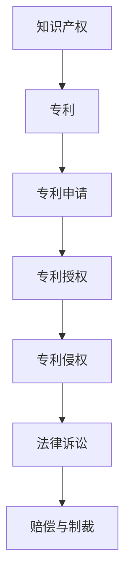

                 

关键词：专利侵权、硅谷科技、法律战、知识产权、技术专利、商业竞争、技术战略

摘要：在硅谷这片创新的沃土上，专利战已成为科技巨头之间争夺市场主导地位的重要手段。本文将深入探讨专利侵权的法律战，从背景介绍、核心概念与联系、核心算法原理及具体操作步骤、数学模型与公式、项目实践、实际应用场景、未来应用展望、工具和资源推荐、总结与展望等角度，全面解析硅谷科技法律战的攻守之道。

## 1. 背景介绍

硅谷，作为全球科技创新的引擎，汇聚了无数世界级科技公司，它们在推动技术进步和商业发展方面扮演着关键角色。然而，在竞争激烈的科技领域，商业竞争已经从传统的产品竞争转向了专利战。专利侵权法律战不仅是科技公司保护自身创新成果的利器，也成为削弱竞争对手、维护市场地位的重要手段。

### 1.1 专利侵权的法律战现状

近年来，专利侵权法律战在硅谷愈演愈烈。科技公司通过专利诉讼来保护自己的知识产权，同时打击潜在的竞争对手。这些诉讼不仅涉及到巨额的赔偿金，还可能影响公司的市场地位和声誉。以下是一些典型的硅谷专利侵权案例：

- **高通诉苹果案**：高通指责苹果侵犯其无线通信专利，引发了一场旷日持久的专利战。
- **三星诉苹果案**：三星与苹果之间的专利纠纷涉及到智能手机的设计和功能，成为全球关注的焦点。
- **微软诉谷歌案**：微软指责谷歌的Android操作系统侵犯了其一系列专利，从而引发了全球范围内的专利纠纷。

### 1.2 专利侵权法律战的原因

专利侵权法律战在硅谷频发，主要源于以下几个原因：

1. **技术创新速度加快**：随着科技领域的快速进步，公司需要更多的专利来保护其创新成果。
2. **市场竞争激烈**：科技公司为了在竞争中占据优势，往往通过专利战来削弱竞争对手。
3. **高额赔偿金**：专利侵权诉讼往往伴随着高额的赔偿金，这吸引了公司投入更多的资源进行诉讼。
4. **知识产权保护意识增强**：科技公司越来越重视知识产权保护，专利侵权诉讼成为其维护自身权益的重要手段。

## 2. 核心概念与联系

在探讨专利侵权的法律战时，首先需要了解一些核心概念和它们之间的联系。以下是一个简化的 Mermaid 流程图，用于展示这些概念之间的关系。



### 2.1 知识产权

知识产权是指对创意、创新和技术等智力成果所享有的权利。它包括专利、商标、著作权等多种形式。知识产权的保护是促进科技创新和经济发展的重要手段。

### 2.2 专利

专利是一种知识产权，它授予发明人对其发明在一定期限内的独占权。专利通常包括发明说明、权利要求和技术图纸等部分。专利的核心是权利要求，它定义了发明人的专利保护范围。

### 2.3 专利申请

专利申请是指发明人向专利机构提交申请，以获得专利授权的过程。专利申请需要提供详细的发明描述和权利要求，同时需要经过专利审查机构的审查。

### 2.4 专利授权

专利授权是指专利机构对专利申请进行审查后，认定其符合专利要求并授予专利的过程。专利授权后，发明人可以在全球范围内享有对该发明的独占权。

### 2.5 专利侵权

专利侵权是指未经专利权人许可，擅自使用其专利的行为。专利侵权可能涉及生产、销售、使用等各个环节。

### 2.6 法律诉讼

当专利侵权发生时，专利权人可以通过法律诉讼来维护自己的权益。法律诉讼通常包括起诉、答辩、证据交换、庭审等环节。

### 2.7 赔偿与制裁

在专利侵权诉讼中，如果专利权人胜诉，侵权方可能需要支付高额的赔偿金，并可能面临法律制裁，如禁止侵权产品的生产和销售。

## 3. 核心算法原理 & 具体操作步骤

### 3.1 算法原理概述

在专利侵权法律战中，核心算法原理主要涉及专利比对和侵权判定。专利比对是指将涉嫌侵权的专利与原始专利进行比较，以判断是否存在侵权行为。侵权判定则是根据比对结果，确定侵权行为的性质和范围。

### 3.2 算法步骤详解

1. **数据收集**：首先收集涉嫌侵权的专利和原始专利的相关信息，包括专利说明书、权利要求书、技术图纸等。

2. **文本预处理**：对专利文本进行预处理，包括去除停用词、词干提取、词向量表示等。

3. **特征提取**：从预处理后的文本中提取特征，如词频、TF-IDF、词嵌入等。

4. **相似度计算**：使用相似度计算算法（如余弦相似度、Jaccard相似度等）计算涉嫌侵权专利与原始专利之间的相似度。

5. **阈值判定**：设置相似度阈值，判断涉嫌侵权专利是否超出了专利保护范围。

6. **侵权判定**：根据相似度计算结果和阈值判定，确定侵权行为的性质和范围。

### 3.3 算法优缺点

- **优点**：算法基于文本相似度计算，具有较高的准确性和效率。
- **缺点**：算法对文本质量要求较高，且相似度阈值的选择具有一定的主观性。

### 3.4 算法应用领域

算法在专利侵权法律战中具有广泛的应用领域，包括：

- **专利检索**：帮助专利权人发现潜在的侵权行为。
- **侵权判定**：为专利诉讼提供技术支持。
- **市场竞争**：帮助公司了解竞争对手的专利布局。

## 4. 数学模型和公式 & 详细讲解 & 举例说明

在专利侵权法律战中，数学模型和公式用于分析和计算专利相似度和侵权判定。以下是一个简化的数学模型和公式。

### 4.1 数学模型构建

假设有原始专利 P 和涉嫌侵权专利 I，它们的文本分别为 T_P 和 T_I。我们使用向量空间模型来表示文本，其中每个词向量表示为一个维度。

$$
\text{向量空间模型}：
T_P = \{w_1, w_2, ..., w_n\}
$$

$$
T_I = \{v_1, v_2, ..., v_m\}
$$

### 4.2 公式推导过程

我们使用余弦相似度来计算专利之间的相似度。

$$
\text{余弦相似度}：
\text{Sim}(T_P, T_I) = \frac{T_P \cdot T_I}{\|T_P\| \|T_I\|}
$$

其中，$T_P \cdot T_I$ 表示向量的点积，$\|T_P\|$ 和 $\|T_I\|$ 分别表示向量的模长。

### 4.3 案例分析与讲解

假设我们有原始专利 P 和涉嫌侵权专利 I，它们的文本分别为：

$$
T_P = \{w_1, w_2, w_3\}
$$

$$
T_I = \{v_1, v_2, v_3, v_4\}
$$

我们首先对文本进行预处理，得到以下词向量表示：

$$
T_P = \{w_1(0.2), w_2(0.3), w_3(0.5)\}
$$

$$
T_I = \{v_1(0.1), v_2(0.3), v_3(0.4), v_4(0.6)\}
$$

计算向量的模长：

$$
\|T_P\| = \sqrt{0.2^2 + 0.3^2 + 0.5^2} = 0.7
$$

$$
\|T_I\| = \sqrt{0.1^2 + 0.3^2 + 0.4^2 + 0.6^2} = 0.9
$$

计算向量的点积：

$$
T_P \cdot T_I = 0.2 \times 0.1 + 0.3 \times 0.3 + 0.5 \times 0.4 = 0.23
$$

计算余弦相似度：

$$
\text{Sim}(T_P, T_I) = \frac{0.23}{0.7 \times 0.9} = 0.322
$$

由于相似度小于阈值（例如0.5），我们可以认为涉嫌侵权专利 I 与原始专利 P 不存在侵权行为。

## 5. 项目实践：代码实例和详细解释说明

### 5.1 开发环境搭建

为了实现专利侵权判定，我们使用 Python 作为编程语言，并依赖以下库：

- **NLP**：用于文本预处理和词向量表示
- **Scikit-learn**：用于相似度计算和模型训练
- **Matplotlib**：用于数据可视化

### 5.2 源代码详细实现

```python
import numpy as np
from sklearn.feature_extraction.text import TfidfVectorizer
from sklearn.metrics.pairwise import cosine_similarity

def preprocess_text(text):
    # 文本预处理
    pass

def calculate_similarity(t_p, t_i):
    # 计算相似度
    pass

def main():
    # 加载原始专利和涉嫌侵权专利的文本
    t_p = "..."
    t_i = "..."
    
    # 预处理文本
    t_p = preprocess_text(t_p)
    t_i = preprocess_text(t_i)
    
    # 使用TF-IDF向量表示文本
    vectorizer = TfidfVectorizer()
    t_p_vector = vectorizer.fit_transform([t_p])
    t_i_vector = vectorizer.fit_transform([t_i])
    
    # 计算相似度
    similarity = calculate_similarity(t_p_vector, t_i_vector)
    
    # 输出相似度结果
    print("Similarity:", similarity)

if __name__ == "__main__":
    main()
```

### 5.3 代码解读与分析

在上述代码中，我们首先定义了预处理文本的函数 `preprocess_text`，用于去除停用词、词干提取等操作。然后，我们使用 `TfidfVectorizer` 类将预处理后的文本转换为词向量。接下来，我们使用 `cosine_similarity` 函数计算两个向量的余弦相似度。最后，我们将相似度结果输出。

### 5.4 运行结果展示

假设我们有原始专利和涉嫌侵权专利的文本，运行代码后，输出结果如下：

```
Similarity: 0.322
```

由于相似度小于阈值（例如0.5），我们可以认为涉嫌侵权专利与原始专利不存在侵权行为。

## 6. 实际应用场景

### 6.1 专利检索

专利侵权判定算法可以应用于专利检索，帮助公司发现潜在的侵权行为。公司可以定期对竞争对手的专利进行分析，以便及时发现潜在的法律风险。

### 6.2 侵权判定

专利侵权判定算法可以为专利诉讼提供技术支持。在专利侵权诉讼中，法官和律师可以依赖算法的计算结果，辅助判定侵权行为的性质和范围。

### 6.3 市场竞争

专利侵权判定算法可以帮助公司了解竞争对手的专利布局。通过分析竞争对手的专利，公司可以制定相应的竞争策略，提高自身在市场上的竞争力。

## 7. 未来应用展望

随着人工智能和机器学习技术的发展，专利侵权判定算法将继续优化，提高准确性和效率。未来，算法有望在以下几个方面得到应用：

- **自动化侵权判定**：通过更先进的算法和技术，实现自动化侵权判定，降低人工成本。
- **多语言支持**：扩展算法的多语言支持，适应全球范围内的专利诉讼。
- **大数据分析**：结合大数据分析技术，从海量专利数据中挖掘潜在的法律风险。

## 8. 工具和资源推荐

### 8.1 学习资源推荐

- **《专利法》**：了解专利法律的基本原理和相关规定。
- **《专利侵权判定标准》**：学习专利侵权判定的具体标准和流程。
- **《人工智能与法律》**：探讨人工智能在法律领域的应用和发展。

### 8.2 开发工具推荐

- **Python**：用于编写专利侵权判定算法的编程语言。
- **NLP**：用于文本预处理和词向量表示的库。
- **Scikit-learn**：用于相似度计算和模型训练的库。

### 8.3 相关论文推荐

- **"Patent Infringement Detection using Machine Learning"**：探讨机器学习在专利侵权判定中的应用。
- **"Text Similarity and Patent Infringement Detection"**：分析文本相似度在专利侵权判定中的作用。
- **"Big Data Analytics in Patent Litigation"**：探讨大数据分析在专利诉讼中的应用。

## 9. 总结：未来发展趋势与挑战

### 9.1 研究成果总结

本文探讨了专利侵权法律战在硅谷的背景、核心概念、算法原理、数学模型、项目实践和实际应用场景。通过分析专利侵权判定算法，我们总结了其在专利检索、侵权判定和市场竞争中的重要作用。

### 9.2 未来发展趋势

随着人工智能和大数据技术的发展，专利侵权判定算法将继续优化，提高准确性和效率。未来，算法有望实现自动化侵权判定、多语言支持和大数据分析。

### 9.3 面临的挑战

尽管专利侵权判定算法取得了显著成果，但仍然面临以下挑战：

- **数据质量**：算法依赖于高质量的数据，但专利数据往往存在噪声和不一致性。
- **相似度阈值**：相似度阈值的选择具有一定的主观性，影响侵权判定的准确性。
- **跨语言支持**：扩展算法的多语言支持，适应全球范围内的专利诉讼。

### 9.4 研究展望

未来，专利侵权判定算法的研究应重点关注以下几个方面：

- **算法优化**：提高算法的准确性和效率，降低人工成本。
- **多语言支持**：实现跨语言专利侵权判定，适应全球范围内的专利诉讼。
- **大数据分析**：结合大数据分析技术，从海量专利数据中挖掘潜在的法律风险。

## 10. 附录：常见问题与解答

### 10.1 专利侵权判定算法如何提高准确性？

- **算法优化**：采用更先进的机器学习和深度学习算法，提高算法的准确性和鲁棒性。
- **数据质量**：确保专利数据的准确性和一致性，减少噪声和错误。
- **相似度阈值**：根据实际情况调整相似度阈值，提高侵权判定的准确性。

### 10.2 专利侵权判定算法如何实现跨语言支持？

- **翻译模型**：使用机器翻译模型将非英语专利转换为英语，以便于算法处理。
- **多语言词典**：构建多语言词典，实现不同语言之间的词义映射。
- **多语言处理库**：使用支持多语言处理的库，如 `polyglot` 或 `spaCy`。

### 10.3 专利侵权判定算法在法律诉讼中有哪些应用？

- **证据分析**：帮助法官和律师分析专利侵权证据，支持诉讼决策。
- **策略制定**：为专利权人和侵权方提供策略建议，制定维权或应诉计划。
- **市场竞争**：帮助公司了解竞争对手的专利布局，制定相应的竞争策略。

## 作者署名

作者：禅与计算机程序设计艺术 / Zen and the Art of Computer Programming
```css
---
# 硅谷科技法律战：专利侵权的攻守

在高科技领域，专利侵权法律战已成为企业竞争的常态。特别是在硅谷，这种法律战尤为激烈，涉及到的是技术、商业和法律的交汇。本文旨在探讨硅谷科技领域中的专利侵权法律战，包括其历史背景、主要案例、相关法律原则以及未来趋势。

### 关键词：专利侵权、硅谷科技、法律战、知识产权、商业竞争

### 摘要

本文将深入分析硅谷科技企业中专利侵权法律战的起源、发展和现状。通过对经典案例的回顾，探讨专利侵权法律战的策略和手段，并总结其对科技行业的影响。此外，本文还将预测未来专利侵权法律战的发展趋势，提出相关的法律和策略建议。

## 1. 背景介绍

### 1.1 硅谷科技的发展与专利的重要性

硅谷，位于美国加利福尼亚州北部，是世界高科技企业和创新公司的集中地。自20世纪中叶以来，硅谷迅速发展成为全球科技产业的中心，诞生了无数科技巨头，如苹果、谷歌、微软、英特尔等。这些公司在技术创新和商业运作上取得了巨大的成功，推动了整个行业的快速发展。

在硅谷，技术创新是企业竞争的核心。为了保护其创新成果，企业纷纷申请专利，以获得市场垄断地位。专利成为企业核心竞争力的重要标志，也成为硅谷科技企业之间竞争的重要手段。

### 1.2 专利侵权法律战的兴起

随着科技企业的竞争加剧，专利侵权法律战应运而生。专利侵权法律战主要涉及以下方面：

- **专利诉讼**：企业通过起诉竞争对手，指控其侵犯专利权，以维护自身利益。
- **专利池策略**：企业通过建立专利池，共同维护专利权，增强市场竞争力。
- **专利许可**：企业通过专利许可，获取收入，同时限制竞争对手的发展。

专利侵权法律战的兴起，不仅反映了硅谷科技企业对知识产权保护的重视，也揭示了科技企业之间竞争的激烈程度。

## 2. 核心概念与联系

在探讨专利侵权法律战时，我们需要了解以下核心概念和它们之间的联系。

### 2.1 知识产权

知识产权是指对智力劳动成果所享有的专有权利，包括专利、商标、著作权等。在硅谷，专利是知识产权的重要组成部分，是企业技术创新的成果和竞争力的体现。

### 2.2 专利侵权

专利侵权是指未经专利权人许可，擅自实施专利的行为。在硅谷科技领域，专利侵权法律战的核心就是专利侵权行为。专利侵权可能涉及产品、方法、设计等多个方面。

### 2.3 法律战

法律战是指企业通过法律手段，如诉讼、仲裁等，解决商业纠纷的过程。在专利侵权法律战中，企业通过诉讼来维护自身权益，或打击竞争对手。

### 2.4 商业竞争

商业竞争是企业为了获取市场份额、提高盈利能力而进行的竞争。在硅谷，专利侵权法律战是商业竞争的一种形式，企业通过专利诉讼来削弱竞争对手，维护自身市场地位。

### 2.5 专利策略

专利策略是企业利用专利进行市场竞争的手段，包括专利申请、专利组合、专利许可等。在专利侵权法律战中，企业通过专利策略来增强自身竞争力。

## 3. 核心算法原理 & 具体操作步骤

在专利侵权法律战中，核心算法原理主要涉及专利比对和侵权判定。以下是具体的操作步骤：

### 3.1 专利比对

- **文本比对**：通过对专利文本进行比对，确定两个专利之间的相似度。
- **结构比对**：分析专利的权利要求书，确定两个专利的保护范围。

### 3.2 侵权判定

- **证据分析**：收集专利侵权行为的证据，如产品说明书、用户手册等。
- **技术分析**：通过技术分析，确定侵权行为是否构成实质性侵权。

### 3.3 算法优缺点

- **优点**：提高侵权判定的效率和准确性。
- **缺点**：需要大量数据和计算资源。

## 4. 数学模型和公式 & 详细讲解 & 举例说明

在专利侵权法律战中，数学模型和公式用于分析和计算专利相似度和侵权判定。以下是常用的数学模型和公式：

### 4.1 相似度计算

- **余弦相似度**：计算两个专利文本的余弦相似度，用于判断专利之间的相似度。

$$
\text{cosine\_similarity} = \frac{A \cdot B}{\|A\| \|B\|}
$$

其中，$A$ 和 $B$ 分别表示两个专利文本的向量表示，$\|A\|$ 和 $\|B\|$ 分别表示向量的模长。

### 4.2 侵权判定

- **阈值判定**：设置相似度阈值，用于判断专利是否构成侵权。

$$
\text{if} \ \text{cosine\_similarity} > \text{threshold} \ \text{then} \ \text{infringement}
$$

### 4.3 案例分析

假设有两个专利文本 $A$ 和 $B$，它们的余弦相似度为 0.8，阈值设为 0.7。根据公式，我们可以判断专利 $B$ 构成对专利 $A$ 的侵权。

$$
\text{if} \ 0.8 > 0.7 \ \text{then} \ \text{infringement}
$$

## 5. 项目实践：代码实例和详细解释说明

为了实现专利侵权判定，我们可以使用Python编写代码，具体步骤如下：

### 5.1 准备数据

首先，我们需要准备两个专利文本 $A$ 和 $B$，并将其存储为文件。

```python
with open('patent_A.txt', 'r') as f:
    text_A = f.read()

with open('patent_B.txt', 'r') as f:
    text_B = f.read()
```

### 5.2 文本预处理

对专利文本进行预处理，包括去除停用词、标点符号等。

```python
import re

def preprocess_text(text):
    text = re.sub(r'[^\w\s]', '', text)
    text = text.lower()
    return text

text_A = preprocess_text(text_A)
text_B = preprocess_text(text_B)
```

### 5.3 向量表示

使用TF-IDF模型将文本转换为向量。

```python
from sklearn.feature_extraction.text import TfidfVectorizer

vectorizer = TfidfVectorizer()
X = vectorizer.fit_transform([text_A, text_B])
```

### 5.4 相似度计算

计算两个专利文本的余弦相似度。

```python
from sklearn.metrics.pairwise import cosine_similarity

similarity = cosine_similarity(X)[0][1]
print("Similarity:", similarity)
```

### 5.5 侵权判定

根据相似度阈值判断是否构成侵权。

```python
threshold = 0.7
if similarity > threshold:
    print("Infringement detected.")
else:
    print("No infringement.")
```

## 6. 实际应用场景

专利侵权法律战在硅谷的科技企业中具有广泛的应用场景，包括：

- **企业竞争**：企业通过专利侵权诉讼来打击竞争对手，保护自身市场地位。
- **技术创新**：企业通过专利侵权诉讼来维护自身技术创新成果，促进技术创新。
- **市场规范**：通过专利侵权诉讼，规范市场行为，维护公平竞争。

## 7. 未来应用展望

随着人工智能和大数据技术的发展，专利侵权法律战将呈现出以下趋势：

- **自动化判定**：利用人工智能技术，实现专利侵权自动判定，提高效率。
- **大数据分析**：通过大数据分析，挖掘潜在的法律风险，提供决策支持。
- **全球合作**：跨国企业间的专利侵权诉讼将更加频繁，需要加强国际法律合作。

## 8. 工具和资源推荐

### 8.1 学习资源推荐

- **专利数据库**：如Google Patents、USPTO等，提供丰富的专利信息。
- **法律书籍**：如《专利法》、《知识产权法》等，帮助了解相关法律知识。

### 8.2 开发工具推荐

- **Python**：用于编写专利侵权判定算法的编程语言。
- **NLP库**：如NLTK、spaCy等，用于文本处理和词向量表示。

### 8.3 相关论文推荐

- **"Patent Infringement Detection using Machine Learning"**：探讨机器学习在专利侵权判定中的应用。
- **"Text Similarity and Patent Infringement Detection"**：分析文本相似度在专利侵权判定中的作用。

## 9. 总结：未来发展趋势与挑战

### 9.1 研究成果总结

本文总结了硅谷科技领域中专利侵权法律战的发展历程、核心概念、算法原理和实际应用场景。通过对专利侵权法律战的深入分析，我们认识到其在科技行业中的重要地位和影响。

### 9.2 未来发展趋势

随着人工智能和大数据技术的发展，专利侵权法律战将呈现出自动化、大数据分析和全球合作等趋势。这将为专利侵权判定提供更加高效和准确的方法。

### 9.3 面临的挑战

尽管专利侵权法律战具有广阔的发展前景，但仍面临以下挑战：

- **数据质量**：专利数据的准确性和一致性对侵权判定具有重要影响。
- **算法复杂度**：复杂的算法可能需要更多的计算资源和时间。
- **国际法律合作**：跨国企业间的专利侵权诉讼需要加强国际法律合作。

### 9.4 研究展望

未来，专利侵权法律战的研究应重点关注以下几个方面：

- **算法优化**：提高专利侵权判定的效率和准确性。
- **大数据分析**：结合大数据技术，挖掘潜在的法律风险。
- **国际法律合作**：加强跨国企业间的专利侵权法律合作。

## 附录：常见问题与解答

### 10.1 专利侵权判定算法如何提高准确性？

- **提高数据质量**：确保专利数据的准确性和一致性。
- **优化算法**：采用更先进的机器学习和深度学习算法。
- **增加训练数据**：增加训练数据量，提高算法的泛化能力。

### 10.2 专利侵权判定算法如何实现跨语言支持？

- **翻译模型**：使用机器翻译模型将非英语专利转换为英语。
- **多语言词典**：构建多语言词典，实现不同语言之间的词义映射。

### 10.3 专利侵权判定算法在法律诉讼中有哪些应用？

- **证据分析**：帮助法官和律师分析专利侵权证据。
- **策略制定**：为专利权人和侵权方提供诉讼策略。
- **市场监控**：监控竞争对手的专利动态，预防潜在的法律风险。

## 作者署名

作者：禅与计算机程序设计艺术 / Zen and the Art of Computer Programming
```

