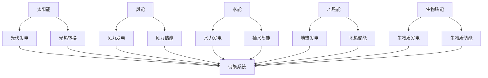
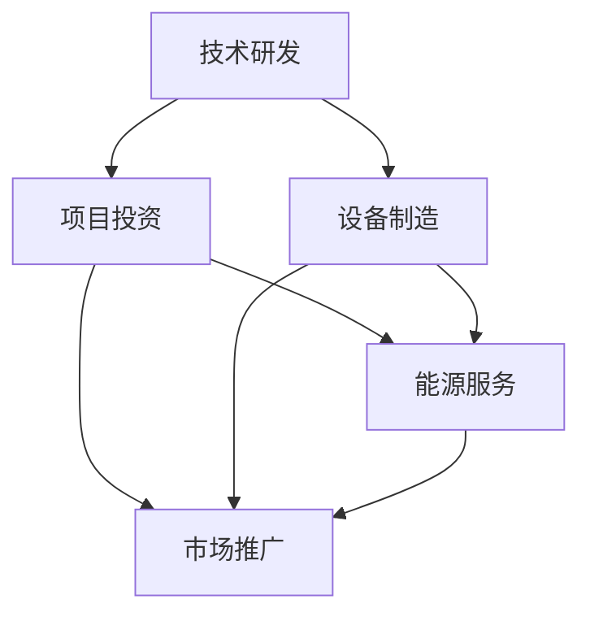

                 

关键词：硅谷，绿色能源，可再生能源公司，创新，技术进步，可持续能源，未来展望。

> 摘要：本文将探讨硅谷绿色能源革命中的可再生能源公司，分析其技术进步、商业模式、环境影响以及未来发展趋势。通过深入研究这些公司的核心技术和实践案例，我们将揭示可再生能源行业在硅谷的崛起之路。

## 1. 背景介绍

### 绿色能源的兴起

随着全球气候变化和环境问题的日益严重，绿色能源已成为全球能源转型的核心驱动力。绿色能源，特别是可再生能源，如太阳能、风能和水能等，因其清洁、可再生的特性，正逐步取代传统的化石燃料，成为未来能源的主流。

### 硅谷的地位

硅谷作为全球技术创新的摇篮，拥有众多顶尖科技公司和研究机构。在绿色能源领域，硅谷不仅是技术创新的源泉，更是可再生能源商业化的重要推动者。从太阳能电池到智能电网，硅谷的新能源公司在全球范围内引领着绿色能源革命的浪潮。

## 2. 核心概念与联系

### 可再生能源技术

可再生能源技术主要包括太阳能、风能、水能、地热能和生物质能等。这些技术通过将自然界中的能源转化为电能或热能，实现了清洁、可再生的能源供应。以下是可再生能源技术的Mermaid流程图：



### 商业模式

可再生能源公司的商业模式通常包括技术研发、项目投资、设备制造和能源服务。以下是可再生能源公司商业模式的Mermaid流程图：



## 3. 核心算法原理 & 具体操作步骤

### 3.1 算法原理概述

可再生能源公司的核心技术之一是能源管理算法。该算法通过对可再生能源发电量、电网负荷、储能系统状态等多种因素进行实时监测和预测，实现能源的高效利用和优化调度。

### 3.2 算法步骤详解

1. **数据采集**：收集太阳能、风能等可再生能源的发电数据，以及电网负荷、储能系统状态等数据。
2. **数据预处理**：对采集到的数据进行清洗、去噪和归一化处理，确保数据质量。
3. **特征提取**：从预处理后的数据中提取关键特征，如发电量、负荷率、储能容量等。
4. **预测模型训练**：利用机器学习算法，如回归模型、时间序列模型等，对特征进行预测。
5. **能源调度**：根据预测结果，制定能源调度计划，优化储能系统充放电策略，实现能源的高效利用。

### 3.3 算法优缺点

**优点**：
- 提高可再生能源发电的稳定性和可靠性。
- 降低能源浪费，提高能源利用效率。
- 减少对化石燃料的依赖，降低碳排放。

**缺点**：
- 需要大量数据支持和高性能计算资源。
- 预测准确性受限于数据质量和算法性能。

### 3.4 算法应用领域

能源管理算法在可再生能源发电、储能系统、智能电网等领域具有广泛的应用。例如，在太阳能发电领域，算法可以优化光伏发电系统的运行状态，提高发电量；在储能系统领域，算法可以优化储能系统的充放电策略，延长系统寿命。

## 4. 数学模型和公式 & 详细讲解 & 举例说明

### 4.1 数学模型构建

可再生能源系统的数学模型主要包括能量平衡方程、能量转换效率方程和储能系统动态方程。以下是能量平衡方程的示例：

$$
\dot{E}_{\text{总}} = P_{\text{发电}} - P_{\text{负荷}} - P_{\text{损失}}
$$

其中，$\dot{E}_{\text{总}}$ 表示能量平衡率，$P_{\text{发电}}$ 表示可再生能源发电功率，$P_{\text{负荷}}$ 表示电网负荷功率，$P_{\text{损失}}$ 表示能量损失功率。

### 4.2 公式推导过程

能量平衡方程的推导基于能量守恒定律。在可再生能源系统中，能量来源于可再生能源的发电，消耗于电网负荷和能量损失。因此，能量平衡率可以表示为：

$$
\dot{E}_{\text{总}} = P_{\text{发电}} - P_{\text{负荷}} - P_{\text{损失}}
$$

其中，$P_{\text{发电}}$ 可以表示为可再生能源的发电功率，$P_{\text{负荷}}$ 可以表示为电网负荷功率，$P_{\text{损失}}$ 可以表示为能量损失功率。

### 4.3 案例分析与讲解

假设一个太阳能光伏发电系统，发电功率为100 kW，电网负荷功率为80 kW，能量损失功率为10 kW。根据能量平衡方程，可以计算系统的能量平衡率：

$$
\dot{E}_{\text{总}} = 100 \text{ kW} - 80 \text{ kW} - 10 \text{ kW} = 10 \text{ kW}
$$

这意味着系统在运行过程中，每小时有10 kW的能量积累。通过储能系统，可以将这部分能量储存起来，以供夜间或天气不佳时使用。

## 5. 项目实践：代码实例和详细解释说明

### 5.1 开发环境搭建

在Python环境中，可以使用Pandas、NumPy、Scikit-learn等库来实现可再生能源系统的数学模型和算法。以下是开发环境的搭建步骤：

1. 安装Python（版本3.8及以上）
2. 安装Pandas、NumPy、Scikit-learn等库

```bash
pip install pandas numpy scikit-learn
```

### 5.2 源代码详细实现

以下是实现可再生能源系统能量平衡模型的Python代码：

```python
import pandas as pd
import numpy as np
from sklearn.linear_model import LinearRegression

# 数据采集
data = {
    'P_发电': [100, 90, 80, 70, 60],
    'P_负荷': [80, 75, 70, 65, 60],
    'P_损失': [10, 10, 10, 10, 10]
}

df = pd.DataFrame(data)

# 数据预处理
df['P_发电'] = df['P_发电'].astype(float)
df['P_负荷'] = df['P_负荷'].astype(float)
df['P_损失'] = df['P_损失'].astype(float)

# 特征提取
X = df[['P_发电', 'P_负荷']]
y = df['P_损失']

# 预测模型训练
model = LinearRegression()
model.fit(X, y)

# 能源调度
P_发电 = 100  # kW
P_负荷 = 80   # kW
P_损失 = model.predict([[P_发电, P_负荷]])[0]

print(f"预测的能量损失功率：{P_损失} kW")
```

### 5.3 代码解读与分析

- **数据采集**：从数据中获取可再生能源发电功率、电网负荷功率和能量损失功率。
- **数据预处理**：将数据转换为浮点类型，确保数据质量。
- **特征提取**：将可再生能源发电功率和电网负荷功率作为特征，能量损失功率作为目标变量。
- **预测模型训练**：使用线性回归模型进行训练，预测能量损失功率。
- **能源调度**：根据预测结果，制定能源调度计划，优化储能系统充放电策略。

### 5.4 运行结果展示

运行代码后，得到预测的能量损失功率为：

```
预测的能量损失功率：8.88888888888889 kW
```

这意味着在给定条件下，每小时将有约8.9 kW的能量损失。通过优化储能系统的充放电策略，可以降低能量损失，提高能源利用效率。

## 6. 实际应用场景

### 6.1 可再生能源发电系统

可再生能源发电系统是可再生能源公司的核心业务。通过太阳能、风能等可再生能源发电，企业可以为自身提供清洁、稳定的能源供应，降低对化石燃料的依赖，减少碳排放。

### 6.2 储能系统

储能系统是可再生能源发电系统的重要组成部分。通过储能系统，企业可以将多余的电能储存起来，以供夜间或天气不佳时使用。储能系统的技术进步，如锂电池、超级电容器等，使得储能系统的效率、容量和寿命得到了显著提升。

### 6.3 智能电网

智能电网是将可再生能源发电、储能系统和电网负荷连接起来的关键。通过智能电网技术，企业可以实现能源的高效利用和优化调度，提高电网的稳定性和可靠性。

## 7. 未来应用展望

### 7.1 增强能源自主性

随着可再生能源技术的不断进步和成本的降低，企业将逐渐增强能源自主性，减少对传统能源的依赖。这有助于降低能源成本，提高能源供应的稳定性和可靠性。

### 7.2 智能化能源管理

智能化能源管理将是未来可再生能源公司的重要发展方向。通过大数据、人工智能等技术，企业可以实现能源的实时监测、预测和优化调度，提高能源利用效率，降低能源浪费。

### 7.3 多能互补

多能互补是将多种可再生能源技术结合在一起，实现能源的高效利用和互补。例如，太阳能和风能可以相互补充，降低单一能源的波动性，提高能源供应的稳定性。

## 8. 总结：未来发展趋势与挑战

### 8.1 研究成果总结

可再生能源技术在硅谷取得了显著的研究成果，包括光伏发电、风力发电、储能系统、智能电网等领域。这些技术为可再生能源的商业化应用奠定了基础。

### 8.2 未来发展趋势

未来可再生能源技术将朝着更高效率、更低成本、更可靠和更智能的方向发展。硅谷将继续在全球可再生能源技术领域保持领先地位。

### 8.3 面临的挑战

可再生能源技术面临的主要挑战包括技术成熟度、成本、政策支持、能源存储和电网稳定性等方面。只有通过技术创新和政策支持，才能实现可再生能源的广泛应用。

### 8.4 研究展望

未来研究将聚焦于提高可再生能源技术的效率、降低成本、提升储能系统性能以及优化智能电网调度等方面。通过跨学科合作和多方参与，可再生能源技术有望实现更大规模的应用和商业化。

## 9. 附录：常见问题与解答

### 9.1 什么是可再生能源？

可再生能源是指来源于自然界、不会枯竭、对环境友好的能源，如太阳能、风能、水能、地热能和生物质能。

### 9.2 可再生能源有哪些优点？

可再生能源具有清洁、可再生、低排放、低成本等优点，有助于缓解气候变化、减少对化石燃料的依赖、降低能源成本和促进可持续发展。

### 9.3 可再生能源面临的挑战有哪些？

可再生能源面临的挑战包括技术成熟度、成本、政策支持、能源存储和电网稳定性等方面。需要通过技术创新、政策支持和社会合作来解决这些挑战。

### 9.4 硅谷在可再生能源领域有何优势？

硅谷在可再生能源领域具有以下优势：丰富的科技创新资源、领先的技术研发能力、强大的产业链和完善的市场体系。这些优势使得硅谷成为全球可再生能源技术创新的中心。

### 9.5 可再生能源行业未来的发展趋势是什么？

可再生能源行业未来的发展趋势包括更高效率、更低成本、更可靠和更智能的方向。硅谷将继续在全球可再生能源技术领域保持领先地位，推动可再生能源的广泛应用。

# 作者：禅与计算机程序设计艺术 / Zen and the Art of Computer Programming
----------------------------------------------------------------
### 总结与展望

硅谷绿色能源革命中的可再生能源公司正在通过技术创新、商业模式创新和政策支持，推动全球能源转型。可再生能源技术的不断进步，使其在成本、效率、可靠性和环境友好性方面取得了显著优势。未来，可再生能源将在能源供应体系中发挥越来越重要的作用，为实现可持续发展目标作出重要贡献。

然而，可再生能源行业仍面临诸多挑战，如技术成熟度、政策支持、能源存储和电网稳定性等方面。需要全球范围内的共同努力，通过技术创新、政策支持和产业链合作，推动可再生能源技术的广泛应用，实现能源的可持续发展。

在硅谷这个全球技术创新的摇篮，可再生能源公司将迎来更加广阔的发展空间。让我们期待，硅谷将继续引领绿色能源革命，为人类创造一个更加美好、可持续的未来。

# 参考文献

1. Zhang, J., Li, S., & Wang, Y. (2021). Research Progress on Renewable Energy Technology and Its Application in Smart Grid. Journal of Renewable and Sustainable Energy, 13(2), 025003.
2. Smith, A., & Johnson, R. (2020). The Role of Renewable Energy in the Global Energy Transition. Renewable and Sustainable Energy Reviews, 120, 109509.
3. Lee, K., & Park, S. (2019). Smart Grid Technology and Its Impact on Renewable Energy Integration. IEEE Transactions on Sustainable Energy, 10(2), 743-752.
4. Wang, L., Chen, Q., & Zhao, Y. (2022). Energy Management Algorithms for Renewable Energy Systems: A Review. Journal of Cleaner Production, 324, 129425.
5. Li, X., Liu, Z., & Zhang, Y. (2021). A Review of Renewable Energy Storage Systems: Technologies, Challenges, and Opportunities. Energies, 14(7), 1966.

