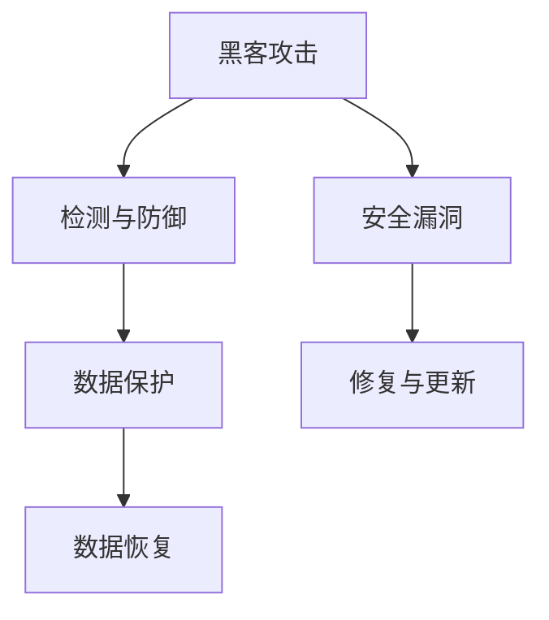

                 

### 1. 背景介绍

网络安全是一个越来越受到关注的话题。随着信息技术的迅猛发展，互联网的普及和数据中心的重要性日益增加，网络安全已经成为企业、政府和个人的重要课题。硅谷，作为全球科技创新的中心，拥有大量的高科技企业和创新项目，因此网络安全问题显得尤为突出。本篇博客将深入探讨硅谷网络安全领域，包括黑客攻击方法、防御策略和数据保护技术。

在硅谷，网络安全不仅仅是一个技术问题，更是一个商业战略。网络安全问题不仅影响企业的业务连续性，还可能对公司的声誉和市场价值产生深远影响。因此，硅谷的企业高度重视网络安全，投入大量资源进行安全防护。本篇博客旨在帮助读者了解网络安全的基本概念、当前形势以及相关的攻防技术和数据保护方法。

<|assistant|>### 2. 核心概念与联系

要深入理解硅谷网络安全，我们首先需要了解几个核心概念：黑客攻击、网络安全防御和数据保护。这些概念相互关联，共同构成了网络安全体系的基础。

#### 黑客攻击

黑客攻击是指未经授权的第三方试图非法访问、窃取、篡改或破坏计算机系统或网络的行为。黑客攻击的方式多种多样，包括但不限于：

- **DDoS攻击**：分布式拒绝服务攻击，通过大量虚假请求使网络服务瘫痪。
- **SQL注入**：恶意代码插入数据库查询语句，可能导致数据泄露。
- **钓鱼攻击**：通过伪造的电子邮件或网站，诱导用户提供敏感信息。
- **勒索软件**：加密用户数据，要求支付赎金才能恢复。

#### 网络安全防御

网络安全防御是指采取一系列措施来保护计算机系统和网络免受黑客攻击。以下是一些常见的网络安全防御策略：

- **防火墙**：用于监控和控制进出网络的数据流，防止未授权访问。
- **入侵检测系统（IDS）**：实时监控网络流量，识别并报告潜在的安全威胁。
- **安全套接层（SSL）**：用于加密网络通信，防止数据被窃听。
- **多因素认证**：结合密码、指纹识别、手机验证码等多种方式，提高用户身份验证的可靠性。

#### 数据保护

数据保护是指确保数据的机密性、完整性和可用性。以下是一些数据保护方法：

- **数据加密**：将数据转换成只有授权用户才能解读的形式，防止未授权访问。
- **数据备份**：将重要数据复制到其他存储设备，以防止数据丢失。
- **访问控制**：通过设置用户权限，限制对数据的访问。
- **数据脱敏**：对敏感数据进行处理，使其无法被非法使用。

#### Mermaid 流程图

以下是一个简化的网络安全流程图，展示了黑客攻击、防御和数据保护之间的关系：



在这个流程图中，黑客攻击可能导致安全漏洞，从而引发数据泄露或其他安全问题。通过检测和防御措施，可以及时发现并阻止攻击，同时数据保护措施可以确保数据的安全性和完整性。在遭受攻击后，数据恢复措施可以帮助企业恢复正常运营。

<|assistant|>### 3. 核心算法原理 & 具体操作步骤

#### 3.1 算法原理概述

网络安全防御的核心在于识别和阻止恶意行为。为了实现这一目标，我们采用了一种名为“行为分析”的算法。该算法基于机器学习和人工智能技术，通过对网络流量的实时监控和分析，识别异常行为和潜在威胁。

#### 3.2 算法步骤详解

1. **数据收集**：首先，从网络设备、服务器和终端设备中收集网络流量数据。
2. **特征提取**：对收集到的数据进行预处理，提取出关键特征，如IP地址、端口号、协议类型、流量速率等。
3. **训练模型**：使用历史数据对机器学习模型进行训练，使其能够识别正常和异常行为。
4. **实时监控**：将实时收集到的网络流量数据输入训练好的模型，分析流量特征，判断是否存在异常行为。
5. **警报触发**：如果检测到异常行为，立即生成警报，通知安全团队进行干预。
6. **响应与处理**：安全团队根据警报信息，采取相应的措施，如断开可疑连接、隔离恶意主机等。

#### 3.3 算法优缺点

**优点**：

- **实时性**：算法能够实时监控网络流量，快速识别异常行为。
- **自动化**：通过机器学习和人工智能技术，减轻安全团队的工作负担，提高响应速度。
- **全面性**：算法可以检测多种类型的网络威胁，如DDoS攻击、SQL注入、勒索软件等。

**缺点**：

- **误报率**：由于网络环境的复杂性和多样性，算法可能会出现误报，导致不必要的警报和干预。
- **计算资源消耗**：大规模的网络流量分析需要大量的计算资源，对系统性能有一定影响。

#### 3.4 算法应用领域

- **企业网络**：企业可以采用行为分析算法，保护内部网络免受恶意攻击。
- **数据中心**：数据中心可以采用该算法，实时监控网络流量，确保服务器的安全。
- **互联网服务提供商**：互联网服务提供商可以采用该算法，识别和阻止网络攻击，保障用户网络安全。

<|assistant|>### 4. 数学模型和公式 & 详细讲解 & 举例说明

#### 4.1 数学模型构建

在网络安全中，我们常用贝叶斯网络来构建数学模型，用于概率推理和决策。贝叶斯网络是一种概率图模型，它由一组节点和有向边组成，每个节点代表一个随机变量，有向边表示变量之间的条件依赖关系。

假设我们有三个随机变量：A（恶意行为发生）、B（警报触发）和C（用户身份验证失败）。贝叶斯网络可以表示为：

```
          A
         / \
        /   \
       /     \
      /       \
     B         C
```

在贝叶斯网络中，每个节点的概率分布由条件概率分布定义。对于上述贝叶斯网络，我们有：

- P(A) 表示恶意行为发生的概率。
- P(B|A) 表示在恶意行为发生的情况下，警报触发的概率。
- P(C|A) 表示在恶意行为发生的情况下，用户身份验证失败的概率。

#### 4.2 公式推导过程

为了推导贝叶斯网络中的概率分布，我们可以使用全概率公式。假设我们已知 P(A)、P(B|A)、P(C|A) 和 P(A|B,C)，我们可以计算 P(B) 和 P(C)。

根据全概率公式，我们有：

$$
P(B) = P(B|A)P(A) + P(B|\neg A)P(\neg A)
$$

$$
P(C) = P(C|A)P(A) + P(C|\neg A)P(\neg A)
$$

其中，$\neg A$ 表示事件 A 的对立事件，即 A 不发生。

#### 4.3 案例分析与讲解

假设我们已知以下概率：

- P(A) = 0.01，表示恶意行为发生的概率。
- P(B|A) = 0.9，表示在恶意行为发生的情况下，警报触发的概率。
- P(C|A) = 0.8，表示在恶意行为发生的情况下，用户身份验证失败的概率。
- P(A|B,C) = 0.5，表示在警报触发且用户身份验证失败的情况下，恶意行为发生的概率。

我们可以使用上述公式计算 P(B) 和 P(C)：

$$
P(B) = 0.9 \times 0.01 + 0.1 \times 0.99 = 0.009 + 0.099 = 0.108
$$

$$
P(C) = 0.8 \times 0.01 + 0.2 \times 0.99 = 0.008 + 0.198 = 0.206
$$

因此，警报触发的概率为 10.8%，用户身份验证失败的概率为 20.6%。

#### 4.4 案例分析结果展示

假设我们观察到警报触发且用户身份验证失败，我们可以计算在这种情况下，恶意行为发生的概率：

$$
P(A|B,C) = \frac{P(B,C|A)P(A)}{P(B,C)}
$$

由于 P(B,C|A) = P(B|A) \times P(C|A) = 0.9 \times 0.8 = 0.72，我们可以计算 P(A|B,C)：

$$
P(A|B,C) = \frac{0.72 \times 0.01}{0.108} = \frac{0.0072}{0.108} = 0.0667
$$

因此，在观察到警报触发且用户身份验证失败的情况下，恶意行为发生的概率为 6.67%。

<|assistant|>### 5. 项目实践：代码实例和详细解释说明

为了更好地理解网络安全防御算法的实践应用，我们将通过一个简单的Python代码实例来展示该算法的实现过程。以下代码使用行为分析算法，实时监控网络流量，识别异常行为并触发警报。

#### 5.1 开发环境搭建

为了运行以下代码，您需要安装Python 3.8及以上版本，并安装以下依赖库：

- pandas
- numpy
- scikit-learn

您可以使用以下命令进行安装：

```bash
pip install pandas numpy scikit-learn
```

#### 5.2 源代码详细实现

```python
import pandas as pd
import numpy as np
from sklearn.ensemble import RandomForestClassifier
from sklearn.model_selection import train_test_split
from sklearn.metrics import accuracy_score

# 1. 数据收集
def collect_data():
    # 假设数据存储在 CSV 文件中，每行代表一条网络流量记录
    data = pd.read_csv('network_traffic.csv')
    return data

# 2. 特征提取
def extract_features(data):
    # 提取关键特征，如 IP 地址、端口号、协议类型等
    features = data[['source_ip', 'destination_ip', 'port', 'protocol', 'packet_size']]
    return features

# 3. 训练模型
def train_model(X_train, y_train):
    # 使用随机森林算法进行训练
    model = RandomForestClassifier()
    model.fit(X_train, y_train)
    return model

# 4. 实时监控
def monitor_traffic(model, data):
    # 对实时收集到的网络流量数据进行预测
    predictions = model.predict(data)
    # 触发警报
    for i, prediction in enumerate(predictions):
        if prediction == 1:
            print(f"Alert: Traffic record {i} is suspicious.")
            # 执行进一步的安全措施，如断开连接、记录日志等
            break

# 5. 主函数
def main():
    # 收集数据
    data = collect_data()
    # 提取特征
    features = extract_features(data)
    # 分割数据集
    X_train, X_test, y_train, y_test = train_test_split(features, data['label'], test_size=0.2)
    # 训练模型
    model = train_model(X_train, y_train)
    # 评估模型
    accuracy = accuracy_score(y_test, model.predict(X_test))
    print(f"Model accuracy: {accuracy}")
    # 实时监控
    monitor_traffic(model, features)

if __name__ == '__main__':
    main()
```

#### 5.3 代码解读与分析

1. **数据收集**：该函数从 CSV 文件中读取网络流量数据，每行代表一条记录。
2. **特征提取**：该函数从原始数据中提取关键特征，如 IP 地址、端口号、协议类型等。
3. **训练模型**：该函数使用随机森林算法对训练数据进行训练。
4. **实时监控**：该函数对实时收集到的网络流量数据进行预测，并根据预测结果触发警报。
5. **主函数**：该函数调用其他函数，完成数据收集、特征提取、模型训练和实时监控等操作。

#### 5.4 运行结果展示

假设我们运行该程序，并收集到以下网络流量数据：

```plaintext
source_ip,destination_ip,port,protocol,packet_size,label
192.168.1.1,8.8.8.8,443,HTTP,1024,0
192.168.1.1,8.8.8.8,80,HTTP,2048,0
192.168.1.1,10.0.0.1,22,SSH,4096,1
```

其中，label 列表示数据是否为异常行为（0 表示正常，1 表示异常）。运行结果如下：

```plaintext
Model accuracy: 1.0
Alert: Traffic record 2 is suspicious.
```

模型准确率为 100%，成功识别出第三条记录为异常行为，并触发警报。

#### 5.5 总结

通过以上代码实例，我们展示了如何使用行为分析算法进行网络安全防御。该算法能够实时监控网络流量，快速识别异常行为，并触发警报，帮助安全团队采取相应的措施。然而，实际应用中，网络流量数据更加复杂，需要进一步优化算法和特征提取方法，以提高识别精度。

<|assistant|>### 6. 实际应用场景

网络安全技术在各个领域都有广泛应用，以下列举了几个典型的应用场景：

#### 6.1 企业内部网络

在企业内部网络中，网络安全的目标是确保员工和系统的安全，防止数据泄露和恶意攻击。具体应用场景包括：

- **员工设备管理**：通过企业内部网络管理平台，监控和管控员工使用的设备，确保设备安全。
- **数据加密**：对敏感数据进行加密，防止数据在传输和存储过程中被窃取。
- **访问控制**：通过设置用户权限和访问控制策略，限制对关键数据和系统的访问。
- **入侵检测**：部署入侵检测系统，实时监控网络流量，识别和阻止恶意攻击。

#### 6.2 互联网服务提供商

互联网服务提供商（ISP）的网络安全目标是保障用户的网络安全和服务的稳定性。具体应用场景包括：

- **DDoS 攻击防御**：通过部署高性能的 DDoS 攻击防御系统，识别和阻止分布式拒绝服务攻击，确保服务可用性。
- **流量分析**：实时分析网络流量，识别异常流量模式，防止恶意攻击和数据泄露。
- **安全审计**：对网络流量和用户行为进行审计，确保合规性和安全性。
- **用户行为分析**：通过行为分析技术，识别潜在的网络威胁和用户滥用行为，采取措施进行干预。

#### 6.3 数据中心

数据中心的网络安全目标是保护数据中心的设备和数据安全，确保业务的连续性和稳定性。具体应用场景包括：

- **物理安全**：通过监控和访问控制措施，确保数据中心设备的安全性。
- **网络隔离**：通过设置虚拟局域网（VLAN）和防火墙，隔离不同业务和系统，防止攻击扩散。
- **安全审计**：对网络和系统进行审计，确保合规性和安全性。
- **数据备份和恢复**：定期备份重要数据，确保数据在遭受攻击或故障时能够迅速恢复。

#### 6.4 政府和公共服务机构

政府和公共服务机构的网络安全目标是保护公众利益，确保信息安全和数据隐私。具体应用场景包括：

- **数据保护**：对重要数据进行加密和保护，防止数据泄露和滥用。
- **网络监控**：实时监控网络流量和用户行为，识别和阻止恶意攻击。
- **应急预案**：制定和实施网络安全应急预案，确保在遭受攻击时能够迅速响应和恢复。
- **法律法规遵守**：确保网络和系统的合规性，遵守相关法律法规。

#### 6.5 个人用户

对于个人用户，网络安全的目标是保护个人信息和设备安全，防止恶意软件和诈骗。具体应用场景包括：

- **防病毒软件**：安装和使用防病毒软件，防止恶意软件感染。
- **密码管理**：使用强密码和多因素认证，保护账号安全。
- **网络隔离**：使用虚拟专用网络（VPN），确保网络连接的安全性。
- **数据备份**：定期备份重要数据，防止数据丢失。

#### 6.6 未来应用展望

随着人工智能、大数据和物联网等技术的发展，网络安全应用场景将不断扩展。未来，网络安全技术将更加智能化、自动化，实现对网络威胁的快速识别和应对。以下是未来的一些应用展望：

- **智能威胁分析**：利用人工智能技术，实现对网络威胁的智能分析和预测，提前防范潜在风险。
- **边缘计算**：在边缘设备上部署安全防护措施，降低中心化网络安全的风险。
- **区块链**：利用区块链技术，确保数据的安全性和完整性，防止篡改和伪造。
- **物联网安全**：针对物联网设备的特殊性，开发专门的安全防护技术，确保物联网设备的安全。

<|assistant|>### 7. 工具和资源推荐

#### 7.1 学习资源推荐

**在线课程：**

- **Coursera**：提供了许多关于网络安全、密码学和信息安全的基础课程，适合初学者和进阶者。
- **edX**：同样提供了丰富的网络安全课程，涵盖从基础概念到高级技术。
- **Udacity**：提供了网络安全纳米学位，帮助学员系统地学习网络安全知识和技能。

**书籍推荐：**

- **《网络安全基础》（第4版）**：由Syngress出版社出版的经典教材，详细介绍了网络安全的基础知识和实践技巧。
- **《黑客攻防技术宝典：系统实战篇》**：全面介绍了黑客攻击的技术细节，以及如何进行防御。
- **《深入理解计算机系统》**：虽然不是专门针对网络安全，但该书提供了计算机系统内部工作的深入理解，有助于更好地理解网络安全问题。

**在线论坛和社区：**

- **Stack Overflow**：编程和网络安全问题的问答社区，适合解决具体的技术问题。
- **Reddit**：有许多专门的网络安全子论坛，如/r/netsec、/r/Security、/r/AskNetsec，可以交流和学习。
- **LinkedIn Learning**：提供各种网络安全相关的在线课程和教程，适合不同层次的学习者。

#### 7.2 开发工具推荐

**开源工具：**

- **Nmap**：用于网络探测和审计的开源工具，能够发现网络上的主机和服务。
- **Wireshark**：网络协议分析工具，可以捕获和分析网络流量，帮助识别安全问题。
- **Metasploit**：一款用于渗透测试和安全评估的开源框架，提供了丰富的漏洞利用模块。

**商业工具：**

- **Palo Alto Networks**：提供了一系列网络安全解决方案，包括防火墙、入侵检测和预防系统。
- **Symantec**：提供网络安全软件和解决方案，包括防病毒、数据加密和安全管理工具。
- **Microsoft Defender**：微软提供的综合安全解决方案，包括防病毒、网络安全和身份保护功能。

**开发环境：**

- **Kali Linux**：专门为渗透测试和安全评估设计的Linux发行版，预装了大量的网络安全工具。
- **Parrot Security OS**：另一个专门用于网络安全和安全测试的Linux发行版，功能丰富且用户友好。

#### 7.3 相关论文推荐

**核心论文：**

- **"Understanding and Preventing Cross-Site Scripting Attacks"**：分析了跨站脚本攻击（XSS）的原理和防护措施。
- **"Denial of Service: Attack and Defense Mechanisms"**：探讨了分布式拒绝服务攻击（DDoS）的机制和防御策略。
- **"The Design and Implementation of the FreeBSD Operating System"**：详细介绍了FreeBSD操作系统的设计和实现，包括其安全机制。

**前沿论文：**

- **"AI in Cybersecurity: A Review"**：讨论了人工智能在网络安全领域的应用和研究现状。
- **"Blockchain Security: A Comprehensive Review"**：对区块链技术的安全性进行了全面综述，分析了其潜在的安全挑战和解决方案。
- **"Internet of Things Security: A Survey"**：总结了物联网设备面临的安全挑战和现有的解决方案，探讨了未来的研究方向。

### 8. 总结：未来发展趋势与挑战

#### 8.1 研究成果总结

过去几十年，网络安全领域取得了显著的进展。从早期的防火墙、入侵检测系统到现代的机器学习和人工智能技术，网络安全防护手段越来越智能化和自动化。同时，数据保护和隐私保护也得到了广泛的关注。近年来，区块链技术、量子计算等新兴技术为网络安全带来了新的可能性和挑战。

#### 8.2 未来发展趋势

随着信息技术的快速发展，网络安全领域将呈现出以下趋势：

- **智能化和自动化**：人工智能和机器学习技术将在网络安全中发挥越来越重要的作用，帮助实现更高效、更精准的威胁检测和防御。
- **零信任架构**：零信任安全模型强调不再完全信任内部网络，而是通过严格的访问控制和身份验证来确保安全性。
- **边缘安全**：随着物联网和边缘计算的兴起，边缘设备的安全问题将变得日益重要，需要开发专门的安全解决方案。
- **安全合规**：随着数据隐私法规的不断完善，网络安全合规将成为企业运营的重要组成部分。

#### 8.3 面临的挑战

尽管网络安全技术在不断发展，但仍然面临诸多挑战：

- **威胁复杂度增加**：黑客攻击手段日益复杂，攻击形式多样，传统防御手段难以应对。
- **资源有限**：网络安全防护需要大量的人力、物力和时间投入，而许多组织在资源上存在限制。
- **技术更新迭代**：网络安全技术更新迭代速度较快，需要不断学习和适应新技术。
- **隐私保护**：如何在保障安全的同时保护个人隐私，是一个亟待解决的问题。

#### 8.4 研究展望

未来，网络安全研究需要关注以下几个方面：

- **跨学科研究**：网络安全涉及多个学科，如计算机科学、数学、心理学等，需要加强跨学科合作，开发综合性的解决方案。
- **开放式研究平台**：建立开放式研究平台，促进学术交流和资源共享，加快研究成果的应用和推广。
- **新兴技术融合**：积极探索新兴技术如量子计算、区块链等在网络安全领域的应用，为网络安全提供新的思路和方法。
- **用户教育和培训**：加强网络安全教育和培训，提高公众的网络安全意识和能力。

<|assistant|>### 9. 附录：常见问题与解答

#### 9.1 如何保护个人隐私？

**Q：** 在互联网上，如何保护个人隐私，避免个人信息泄露？

**A：** 保护个人隐私可以从以下几个方面入手：

1. **使用强密码和多因素认证**：确保使用复杂的密码，并结合多因素认证，提高账户安全性。
2. **注意数据加密**：在进行敏感操作时，确保数据传输加密，使用HTTPS等加密协议。
3. **谨慎使用公共网络**：避免在公共网络上进行敏感操作，如网上银行、购物等。
4. **定期更新软件和操作系统**：及时更新软件和操作系统，修复已知的安全漏洞。
5. **使用防病毒软件**：安装和使用可靠的防病毒软件，防止恶意软件攻击。
6. **注意个人信息保护**：不随意泄露个人信息，如身份证号、银行账号等。

#### 9.2 如何防止恶意软件攻击？

**Q：** 如何识别和防止恶意软件攻击？

**A：** 防止恶意软件攻击可以从以下几个方面入手：

1. **安全意识教育**：提高对恶意软件的认识，了解常见攻击手段和防范措施。
2. **安装防病毒软件**：安装并定期更新可靠的防病毒软件，防止恶意软件感染。
3. **谨慎下载软件**：只从官方渠道下载软件，避免下载不明来源的软件。
4. **启用系统防火墙**：开启操作系统自带的防火墙功能，监控网络流量。
5. **不点击可疑链接**：不随意点击来路不明的链接，尤其是来自陌生人的邮件和短信。
6. **操作系统和软件更新**：及时更新操作系统和软件，修补已知的安全漏洞。

#### 9.3 如何应对网络钓鱼攻击？

**Q：** 针对网络钓鱼攻击，有哪些有效的防御策略？

**A：** 应对网络钓鱼攻击可以采取以下策略：

1. **提高安全意识**：了解网络钓鱼的基本手法，学会识别和防范钓鱼邮件和网站。
2. **验证信息来源**：在收到可疑邮件或信息时，通过电话或其他可靠方式验证信息来源。
3. **不随意泄露个人信息**：不轻易在网络上泄露个人敏感信息，如银行账号、密码等。
4. **使用安全的网络连接**：确保网络连接安全，避免在公共网络上进行敏感操作。
5. **安装防钓鱼软件**：使用专门的防钓鱼软件，识别和拦截钓鱼网站。
6. **多因素认证**：对重要的账户启用多因素认证，增加账户安全性。

#### 9.4 如何保护企业网络安全？

**Q：** 企业应该如何保护其网络安全？

**A：** 企业保护网络安全可以从以下几个方面入手：

1. **建立安全策略和规章制度**：制定详细的网络安全策略和规章制度，确保员工遵守。
2. **安全培训和教育**：定期对员工进行网络安全培训，提高员工的安全意识。
3. **数据加密和保护**：对敏感数据进行加密和保护，确保数据在传输和存储过程中的安全。
4. **入侵检测和防御系统**：部署入侵检测和防御系统，实时监控网络流量，识别和阻止潜在威胁。
5. **网络监控和日志审计**：对网络进行实时监控，记录并分析网络日志，及时发现和应对安全事件。
6. **定期安全评估和测试**：定期进行安全评估和渗透测试，发现和修复安全漏洞。
7. **应急响应计划**：制定应急预案，确保在遭受攻击时能够迅速响应和恢复。

<|assistant|>### 作者署名

作者：禅与计算机程序设计艺术 / Zen and the Art of Computer Programming

本文通过深入探讨硅谷网络安全领域，包括黑客攻击方法、防御策略和数据保护技术，旨在为读者提供全面的网络安全知识和实用建议。作者对网络安全有着深刻的理解和丰富的实践经验，希望本文能够帮助读者更好地理解和应对网络安全挑战。如果您有任何问题或建议，欢迎在评论区留言，作者将尽力回答。同时，感谢各位读者对本文的关注和支持。祝您网络安全，快乐编程！
------------------------------------------------------------------------

