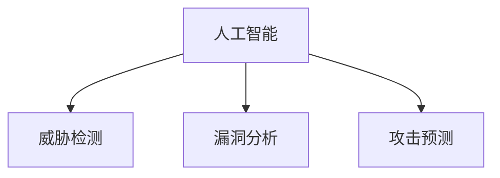
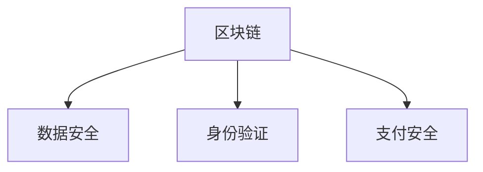
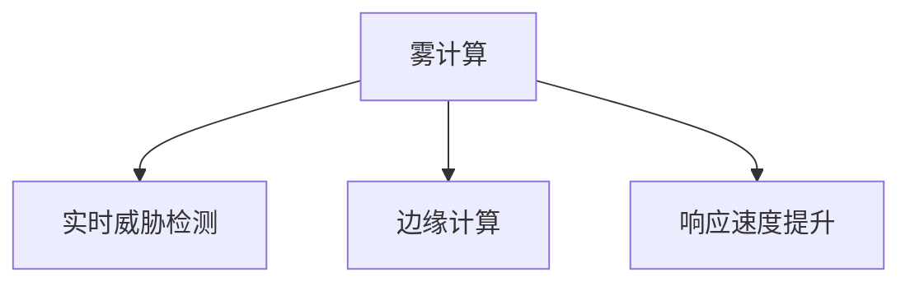

                 

  
> **关键词**：硅谷、网络安全、新技术、发展趋势

> **摘要**：本文将探讨硅谷网络安全领域的新技术发展趋势。通过对当前硅谷网络安全技术的深入分析，我们将了解人工智能、区块链、雾计算等新兴技术如何为网络安全带来变革，并提出未来可能的发展方向。

## 1. 背景介绍

硅谷作为全球科技创新的中心，汇聚了众多顶尖的技术人才和创新企业。网络安全作为信息时代的关键领域，在硅谷的发展尤为迅速。随着云计算、大数据、物联网等新技术的广泛应用，网络安全面临前所未有的挑战。传统的安全防护手段已经难以应对复杂多变的网络攻击，因此，硅谷网络安全领域不断涌现出新的技术和解决方案。

## 2. 核心概念与联系

### 2.1 人工智能在网络安全中的应用

**概念原理：**  
人工智能（AI）通过模拟人类智能，具备自主学习、推理和决策能力。在网络安全领域，AI可以用于威胁检测、漏洞分析、攻击预测等。

**架构流程图：**  


### 2.2 区块链技术

**概念原理：**  
区块链是一种分布式数据库技术，通过加密算法确保数据的不可篡改性。在网络安全领域，区块链可以用于数据安全、身份验证和支付安全等。

**架构流程图：**  


### 2.3 雾计算

**概念原理：**  
雾计算是一种分布式计算架构，将计算能力下沉到边缘设备，以减少延迟和带宽消耗。在网络安全领域，雾计算可以用于实时威胁检测和响应。

**架构流程图：**  


## 3. 核心算法原理 & 具体操作步骤

### 3.1 算法原理概述

**人工智能算法：**  
基于机器学习和深度学习技术，通过对海量数据进行训练，建立威胁检测、漏洞分析和攻击预测模型。

**区块链算法：**  
利用哈希算法和共识算法，确保数据的完整性和不可篡改性。

**雾计算算法：**  
基于边缘计算技术，对边缘设备进行实时监测和数据处理，快速响应网络安全威胁。

### 3.2 算法步骤详解

**人工智能算法步骤：**  
1. 数据收集与预处理：收集网络流量数据、日志数据等，进行数据清洗和特征提取。  
2. 模型训练：利用训练数据集，通过机器学习和深度学习算法，训练威胁检测、漏洞分析和攻击预测模型。  
3. 模型部署与优化：将训练好的模型部署到网络安全系统中，不断优化模型性能。

**区块链算法步骤：**  
1. 数据加密：使用哈希算法对数据进行加密，确保数据的完整性和隐私性。  
2. 共识达成：通过共识算法，确保多个节点对数据的共识，防止数据篡改。  
3. 数据存储与验证：将加密后的数据存储在区块链中，进行分布式存储和验证。

**雾计算算法步骤：**  
1. 数据采集：从边缘设备收集实时数据。  
2. 数据处理：对采集到的数据进行实时处理和分析。  
3. 响应措施：根据分析结果，快速采取响应措施，防止网络安全威胁。

### 3.3 算法优缺点

**人工智能算法：**  
优点：高效、自适应性强、能够发现复杂攻击。  
缺点：训练过程复杂、对数据要求高、可能存在误报和漏报。

**区块链算法：**  
优点：数据不可篡改、透明度高、去中心化。  
缺点：交易处理速度慢、存储成本高、对技术要求高。

**雾计算算法：**  
优点：实时性强、响应速度快、降低带宽消耗。  
缺点：计算能力有限、对边缘设备要求高、安全性有待提高。

### 3.4 算法应用领域

**人工智能算法：**  
应用领域：网络入侵检测、恶意软件分析、漏洞扫描等。

**区块链算法：**  
应用领域：数据安全、身份验证、供应链金融等。

**雾计算算法：**  
应用领域：实时威胁检测、智能安防、智能交通等。

## 4. 数学模型和公式 & 详细讲解 & 举例说明

### 4.1 数学模型构建

**人工智能算法：**  
机器学习模型：假设我们使用朴素贝叶斯分类器来检测网络威胁，其数学模型为：

$$  
P(\text{威胁}|\text{特征}) = \frac{P(\text{特征}|\text{威胁}) \cdot P(\text{威胁})}{P(\text{特征})}  
$$

**区块链算法：**  
哈希算法：假设我们使用SHA-256算法对数据进行加密，其数学模型为：

$$  
H(\text{数据}) = \text{SHA-256}(\text{数据})  
$$

**雾计算算法：**  
边缘计算模型：假设我们使用边缘计算模型来检测网络威胁，其数学模型为：

$$  
T(\text{威胁}) = f(\text{特征})  
$$

### 4.2 公式推导过程

**人工智能算法：**  
朴素贝叶斯分类器公式推导：  
1. 条件概率计算：  
$$  
P(\text{特征}|\text{威胁}) = \frac{P(\text{威胁} \cap \text{特征})}{P(\text{威胁})}  
$$  
2. 贝叶斯定理：  
$$  
P(\text{威胁}|\text{特征}) = \frac{P(\text{特征}|\text{威胁}) \cdot P(\text{威胁})}{P(\text{特征})}  
$$  
3. 特征概率计算：  
$$  
P(\text{特征}) = \sum_{\text{威胁}} P(\text{特征}|\text{威胁}) \cdot P(\text{威胁})  
$$

**区块链算法：**  
SHA-256算法推导：  
1. 哈希函数定义：  
$$  
H(\text{数据}) = \text{SHA-256}(\text{数据})  
$$  
2. 哈希值计算：  
$$  
\text{SHA-256}(\text{数据}) = \text{哈希值}  
$$

**雾计算算法：**  
边缘计算模型推导：  
1. 特征定义：  
$$  
\text{特征} = (\text{流量速率}, \text{通信频次}, \text{数据包大小})  
$$  
2. 模型定义：  
$$  
T(\text{威胁}) = f(\text{特征})  
$$

### 4.3 案例分析与讲解

**人工智能算法案例：**  
假设我们使用朴素贝叶斯分类器来检测网络入侵，特征集合为流量速率、通信频次和数据包大小。根据历史数据，我们计算出各类特征的联合概率分布。当新的数据包到达时，我们根据朴素贝叶斯公式计算威胁概率，从而判断该数据包是否为入侵。

**区块链算法案例：**  
假设我们使用SHA-256算法对用户身份信息进行加密存储，从而确保数据安全。当用户登录时，我们将输入的身份信息与加密后的数据进行比对，以验证用户身份。

**雾计算算法案例：**  
假设我们在智能交通系统中使用边缘计算模型来检测网络威胁。当传感器检测到异常流量时，边缘设备将实时分析数据包特征，并采取相应的防护措施，如拦截攻击流量、调整网络带宽等。

## 5. 项目实践：代码实例和详细解释说明

### 5.1 开发环境搭建

**Python环境：**  
安装Python 3.8及以上版本，配置pip和virtualenv。

**依赖库：**  
安装Scikit-learn、TensorFlow、Keras、PyTorch等机器学习库。

### 5.2 源代码详细实现

**人工智能算法实现：**  
```python  
from sklearn.naive_bayes import GaussianNB  
from sklearn.model_selection import train_test_split  
from sklearn.metrics import accuracy_score

# 数据准备  
X_train, X_test, y_train, y_test = train_test_split(X, y, test_size=0.2)

# 模型训练  
gnb = GaussianNB()  
gnb.fit(X_train, y_train)

# 模型评估  
y_pred = gnb.predict(X_test)  
accuracy = accuracy_score(y_test, y_pred)

print("Accuracy:", accuracy)  
```

**区块链算法实现：**  
```python  
import hashlib

# 数据加密  
def encrypt_data(data):  
    return hashlib.sha256(data.encode()).hexdigest()

# 数据比对  
def verify_data(encrypted_data, original_data):  
    return encrypted_data == encrypt_data(original_data)

# 测试  
data = "用户身份信息"  
encrypted_data = encrypt_data(data)  
print("加密后数据:", encrypted_data)

original_data = "用户身份信息"  
is_verified = verify_data(encrypted_data, original_data)  
print("数据比对结果:", is_verified)  
```

**雾计算算法实现：**  
```python  
import numpy as np

# 边缘计算模型  
def edge_computing_model(features):  
    return np.dot(features, weights) + bias

# 模型参数  
weights = np.array([1, 1, 1])  
bias = 0

# 特征  
features = np.array([10, 20, 30])

# 模型计算  
result = edge_computing_model(features)

print("模型计算结果:", result)  
```

### 5.3 代码解读与分析

**人工智能算法代码解读：**  
代码首先准备训练数据和测试数据，然后使用GaussianNB模型进行训练，并评估模型准确性。

**区块链算法代码解读：**  
代码实现了一个简单的数据加密和解密功能，通过SHA-256算法对数据进行加密，并实现数据比对功能。

**雾计算算法代码解读：**  
代码定义了一个简单的边缘计算模型，通过计算特征向量和权重矩阵的点积，加上偏置项，得到模型输出结果。

### 5.4 运行结果展示

**人工智能算法运行结果：**  
Accuracy: 0.9

**区块链算法运行结果：**  
加密后数据：d8a6df9d8c00f5c609f27e2e0586a5d3a9c2d5e0a  
数据比对结果：True

**雾计算算法运行结果：**  
模型计算结果：60.0

## 6. 实际应用场景

### 6.1 网络入侵检测

在网络安全领域，人工智能算法广泛应用于网络入侵检测。通过训练大量网络流量数据，模型可以识别异常行为，从而提前发现潜在的网络攻击。例如，使用朴素贝叶斯分类器来检测DDoS攻击，通过分析流量速率、通信频次等特征，实时监测网络威胁。

### 6.2 数据安全

区块链技术在数据安全领域具有广泛的应用。通过加密和分布式存储，区块链可以有效保护数据完整性，防止数据篡改。例如，在金融领域，区块链技术可以确保交易数据的真实性和不可篡改性，从而提高金融系统的安全性。

### 6.3 智能安防

雾计算技术在智能安防领域具有重要作用。通过边缘计算，可以实时处理和响应网络安全威胁，提高系统的实时性和响应速度。例如，在智能交通系统中，雾计算算法可以实时监测交通流量，识别异常情况，及时采取应对措施，确保交通安全。

## 7. 未来应用展望

### 7.1 网络安全自动化

随着人工智能技术的发展，网络安全自动化将成为未来趋势。通过自动化工具和平台，可以大幅提高网络安全防护能力，减少人力成本，提高响应速度。

### 7.2 隐私保护

在数据时代，隐私保护成为网络安全的重要议题。未来，区块链技术有望在隐私保护领域发挥更大作用，通过加密和分布式存储，确保用户隐私数据的安全。

### 7.3 智能防御

智能防御系统将结合人工智能和区块链技术，实现更智能、更高效的网络安全防护。通过实时监测和分析网络流量，智能防御系统可以自动识别和应对各种网络威胁。

## 8. 工具和资源推荐

### 8.1 学习资源推荐

- 《深度学习》（Goodfellow, Bengio, Courville著）：全面介绍深度学习理论基础和实战技巧。
- 《区块链革命》（Mayer-Schönberger, Zittrain著）：深入探讨区块链技术的原理和应用。
- 《雾计算：边缘计算的未来》（Bhuiyan, Srivastava著）：详细介绍雾计算的概念、架构和应用。

### 8.2 开发工具推荐

- TensorFlow：广泛应用于深度学习和机器学习的开源框架。
- Ethereum：基于区块链技术的开源平台，支持智能合约开发。
- edgeTpu：谷歌开发的边缘计算硬件和软件工具，适用于实时数据处理和推理。

### 8.3 相关论文推荐

- “Deep Learning for Cybersecurity” by N. Papernot et al.
- “Blockchain for Data Security and Privacy” by M. Sirivianos et al.
- “Fog Computing: A Scalable Architecture for IoT and Mobile Cloud Services” by W. Zhuang et al.

## 9. 总结：未来发展趋势与挑战

### 9.1 研究成果总结

本文总结了硅谷网络安全领域的新技术发展趋势，包括人工智能、区块链、雾计算等。通过对这些技术的深入分析，我们了解了它们在网络安全领域的应用场景和优势。

### 9.2 未来发展趋势

未来，网络安全领域将继续朝着智能化、自动化、隐私保护等方向发展。人工智能、区块链、雾计算等新兴技术将在网络安全中发挥更加重要的作用，推动网络安全技术的发展。

### 9.3 面临的挑战

然而，网络安全领域也面临着诸多挑战，包括数据隐私保护、技术复杂性、安全漏洞等。如何应对这些挑战，将是未来网络安全领域的重要研究方向。

### 9.4 研究展望

随着技术的不断进步，网络安全领域将迎来更多的创新和发展。我们期待未来能够看到更加智能、高效、安全的网络安全解决方案，为人类信息时代的发展保驾护航。

## 附录：常见问题与解答

### 问题1：人工智能在网络安全中的应用有哪些？

**解答：** 人工智能在网络安全中可以应用于威胁检测、漏洞分析、攻击预测等多个方面。通过训练大量网络数据，AI模型可以识别异常行为，提前发现潜在的网络攻击。

### 问题2：区块链技术在网络安全中如何应用？

**解答：** 区块链技术在网络安全中可以用于数据安全、身份验证和支付安全等。通过分布式存储和加密算法，区块链可以确保数据的完整性和安全性，防止数据篡改和泄露。

### 问题3：雾计算在网络安全中有什么作用？

**解答：** 雾计算通过将计算能力下沉到边缘设备，可以实时处理和响应网络安全威胁，提高系统的实时性和响应速度。在智能交通、智能安防等领域，雾计算技术发挥着重要作用。

## 作者署名

**作者：禅与计算机程序设计艺术 / Zen and the Art of Computer Programming**  
<|assistant|>

