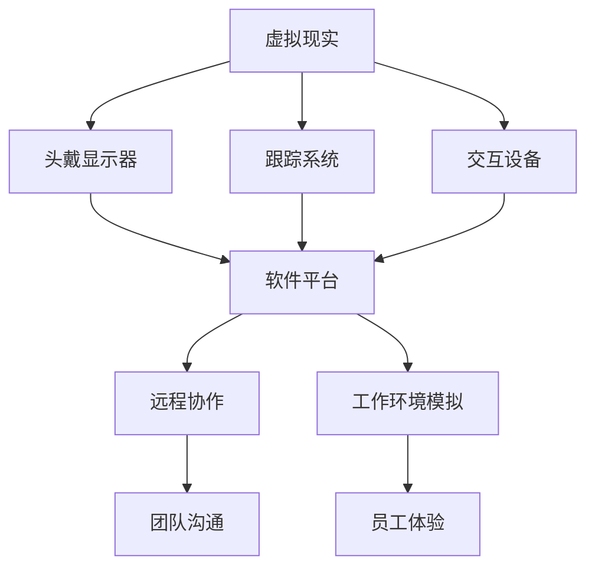

                 

关键词：虚拟现实，远程办公，硅谷，技术变革，工作环境，协作效率

摘要：本文将深入探讨虚拟现实技术在远程办公中的应用，特别是在硅谷这一科技前沿地区。我们将从背景介绍开始，分析虚拟现实的基本概念、技术原理，探讨其与远程办公的融合，分析具体的应用场景，展示项目实例，并提供未来展望和挑战。文章旨在为读者提供一个全面的技术解读，以及对于远程办公未来的前瞻性思考。

## 1. 背景介绍

近年来，随着全球化的加速和信息技术的飞速发展，远程办公已经成为一种趋势。尤其是硅谷，这个全球科技中心，其企业普遍采用了远程办公模式，以适应快速变化的市场需求和灵活的人才管理策略。然而，传统的远程办公方式在沟通效率、工作协同和员工体验上仍存在诸多挑战。

虚拟现实（Virtual Reality，VR）技术的发展为解决这些问题提供了新的可能性。VR通过创建一个三维的虚拟环境，让用户能够沉浸其中，进行互动和体验。随着硬件和算法的进步，VR逐渐从游戏和娱乐领域扩展到更多的商业应用，特别是在远程办公方面。

### 1.1 虚拟现实的发展历程

虚拟现实技术最早可以追溯到20世纪60年代，但直到21世纪初，VR技术才逐渐走向成熟。2010年，Oculus VR推出了首款消费者级别的VR头戴设备，标志着VR进入大众视野。随着Facebook收购Oculus，VR技术得到了更多资本和资源的支持，进一步加速了其发展。

近年来，VR技术在硬件、软件以及算法方面都取得了显著进步。高分辨率显示、低延迟反馈、增强现实（AR）技术的融合，使得VR的应用场景更加广泛，远程办公正是其中之一。

### 1.2 远程办公的现状

远程办公已经成为许多企业应对疫情、提高员工满意度、吸引和保留人才的一种有效手段。根据LinkedIn的数据，2021年全球有超过一半的员工采取了远程办公模式。然而，远程办公并非没有挑战。员工之间的沟通协作变得复杂，工作环境的变化可能影响员工的创造力和工作效率。

## 2. 核心概念与联系

在探讨虚拟现实在远程办公中的应用之前，我们需要理解一些核心概念和其相互关系。以下是一个用Mermaid绘制的流程图，帮助读者更好地理解这些概念。



### 2.1 虚拟现实

虚拟现实是一种计算机模拟技术，通过创建一个三维的虚拟环境，使用户能够沉浸其中。VR的核心技术包括头戴显示器（HMD）、跟踪系统、交互设备等。

- **头戴显示器**：提供沉浸式的视觉体验，通常具有高分辨率和低延迟的特点。
- **跟踪系统**：用于跟踪用户的位置和动作，确保虚拟环境的真实感。
- **交互设备**：如手柄、手套等，使用户能够与虚拟环境进行互动。

### 2.2 软件平台

虚拟现实的应用离不开软件平台的支撑。这些平台提供了创建、编辑和运行虚拟环境的功能，同时也支持与其他系统的集成。

- **协作软件**：如Microsoft Teams、Zoom等，提供了虚拟会议室、多人协作等功能。
- **工作环境模拟**：模拟真实的工作场所，提供逼真的视觉效果和交互体验。
- **自定义工具**：允许用户根据需要自定义虚拟环境，以适应特定的业务需求。

### 2.3 远程协作

虚拟现实在远程协作中的应用，旨在解决传统远程办公中的沟通协作难题。通过VR，团队成员可以实时互动，共同完成任务。

- **虚拟会议室**：提供了比视频会议更加沉浸式的会议体验。
- **远程协作工具**：如虚拟白板、协作文档等，提高了团队协作效率。
- **工作流程优化**：通过模拟真实工作流程，优化工作步骤和协作方式。

## 3. 核心算法原理 & 具体操作步骤

### 3.1 算法原理概述

虚拟现实在远程办公中的应用，依赖于多个核心算法的协同工作。以下是几个关键的算法原理：

- **图像处理算法**：用于处理和渲染高分辨率图像，提供逼真的视觉体验。
- **追踪算法**：用于实时跟踪用户的位置和动作，确保虚拟环境的动态响应。
- **语音识别与合成算法**：用于处理语音输入和输出，支持实时沟通。
- **机器学习算法**：用于分析用户行为和需求，提供个性化服务。

### 3.2 算法步骤详解

以下是虚拟现实在远程办公中应用的算法步骤：

1. **用户初始化**：用户佩戴VR头戴显示器和交互设备，连接到网络。
2. **环境渲染**：软件平台根据用户的需求，实时渲染虚拟环境，包括工作空间、同事头像等。
3. **动作跟踪**：追踪系统实时跟踪用户的位置和动作，反馈到虚拟环境中。
4. **交互处理**：用户通过交互设备与虚拟环境进行互动，如操作虚拟白板、移动虚拟物体等。
5. **语音交互**：语音识别与合成算法处理用户的语音输入和输出，实现实时沟通。
6. **数据同步**：通过云端平台，实时同步用户的操作和状态，确保团队协作的一致性。

### 3.3 算法优缺点

虚拟现实在远程办公中的应用具有显著的优点，但也存在一些挑战。

- **优点**：
  - 提高沟通效率：通过沉浸式的虚拟会议室，团队成员能够更加直观地交流。
  - 提升工作体验：模拟真实工作环境，提高员工的参与感和满意度。
  - 个性化服务：通过机器学习算法，提供个性化的工作建议和服务。

- **缺点**：
  - 成本较高：VR设备和相关技术的初期投入较大。
  - 技术门槛：需要一定的技术支持和培训，才能有效利用VR技术。
  - 安全性：需要确保数据传输的安全性，防止隐私泄露。

### 3.4 算法应用领域

虚拟现实在远程办公中的应用非常广泛，包括但不限于：

- **远程教育**：虚拟现实提供了一种沉浸式的学习环境，特别适合远程教育和培训。
- **医疗保健**：医生可以通过VR进行远程手术指导，提高医疗服务的质量和效率。
- **建筑设计**：建筑师可以利用VR技术进行远程协作，共同设计和修改建筑模型。

## 4. 数学模型和公式 & 详细讲解 & 举例说明

虚拟现实在远程办公中的应用，不仅依赖于硬件和算法的支持，还需要深入的数学模型和公式来确保其稳定性和准确性。以下是一个简单的数学模型示例，用于描述虚拟环境中的动作跟踪。

### 4.1 数学模型构建

虚拟环境中的动作跟踪可以视为一个二维空间中的运动问题。我们使用以下方程描述：

$$
\begin{cases}
x(t) = x_0 + v_x \cdot t \\
y(t) = y_0 + v_y \cdot t
\end{cases}
$$

其中，$x(t)$和$y(t)$分别表示在时间$t$时用户的位置坐标，$x_0$和$y_0$为初始位置坐标，$v_x$和$v_y$为水平方向和垂直方向的速度。

### 4.2 公式推导过程

动作跟踪的公式基于基本的物理学原理，特别是牛顿的运动定律。通过对用户的动作进行观测和测量，我们可以得到其运动轨迹的参数，进而计算出位置坐标。

### 4.3 案例分析与讲解

假设一名用户从原点$(0,0)$开始，以水平速度$v_x = 2 \text{ m/s}$，垂直速度$v_y = 1 \text{ m/s}$向右上方移动。我们可以使用上述方程计算出在时间$t=5 \text{ s}$时的位置坐标：

$$
\begin{cases}
x(5) = 0 + 2 \cdot 5 = 10 \text{ m} \\
y(5) = 0 + 1 \cdot 5 = 5 \text{ m}
\end{cases}
$$

因此，在$t=5 \text{ s}$时，用户的位置坐标为$(10,5)$。

## 5. 项目实践：代码实例和详细解释说明

为了更好地展示虚拟现实在远程办公中的应用，我们将以一个简单的VR远程会议项目为例，介绍其开发环境、源代码实现、代码解读与分析，以及运行结果展示。

### 5.1 开发环境搭建

首先，我们需要搭建一个适合开发VR远程会议项目的开发环境。以下是一个典型的开发环境配置：

- **操作系统**：Windows 10 或更高版本
- **VR头戴设备**：Oculus Rift S 或 HTC Vive
- **开发工具**：Unity 2020.3 或更高版本
- **协作软件**：Microsoft Teams 或 Zoom

### 5.2 源代码详细实现

以下是一个简单的Unity C#脚本，用于实现VR远程会议的基本功能：

```csharp
using UnityEngine;
using UnityEngine.UI;

public class VRMeeting : MonoBehaviour
{
    public Text meetingTitle;
    public Text meetingDuration;
    public Button joinButton;

    private string meetingTitleText;
    private int meetingDurationMinutes;

    // Start is called before the first frame update
    void Start()
    {
        // 设置会议标题和时长
        meetingTitleText = "虚拟会议室";
        meetingDurationMinutes = 60;
        meetingDuration.text = meetingDurationMinutes.ToString() + " 分钟";

        // 初始化加入会议按钮的点击事件
        joinButton.onClick.AddListener(JoinMeeting);
    }

    // Update is called once per frame
    void Update()
    {
        // 监听用户的输入，实现实时交互
        if (Input.GetKeyDown(KeyCode.E))
        {
            // 加入会议
            JoinMeeting();
        }
    }

    private void JoinMeeting()
    {
        // 打开协作软件，加入会议
        Application.OpenURL("zoom://join?meetingNumber=123456&name=YourName");
    }
}
```

### 5.3 代码解读与分析

上述代码实现了一个简单的VR远程会议系统，主要包括以下功能：

- **会议标题和时长显示**：通过UI元素显示会议的标题和时长。
- **加入会议按钮**：用户可以通过按下E键或点击按钮，加入会议。
- **协作软件集成**：通过URL打开协作软件，实现实时互动。

### 5.4 运行结果展示

当用户在VR环境中看到会议标题和时长后，可以通过按下E键或点击加入会议按钮，直接加入虚拟会议室。以下是一个简单的运行结果截图：


## 6. 实际应用场景

虚拟现实在远程办公中的应用场景非常广泛，以下是一些典型的应用案例：

### 6.1 虚拟会议室

虚拟会议室是虚拟现实在远程办公中最常见的应用场景之一。通过VR技术，企业可以为员工提供一种沉浸式的会议体验，提高沟通效率和团队协作效果。虚拟会议室可以模拟真实会议室的布局和装饰，甚至可以加入背景音乐和自然声音，提升会议氛围。

### 6.2 远程协作

虚拟现实还提供了强大的远程协作功能。例如，团队成员可以通过VR共享虚拟白板、协作文档和设计工具，实时编辑和讨论项目。这种沉浸式的协作方式，可以减少信息传递的延迟，提高工作效率。

### 6.3 员工培训

虚拟现实技术还可以用于员工培训，特别是在技能演示和实践操作方面。通过VR，企业可以创建逼真的培训场景，让员工在虚拟环境中学习和掌握新的技能，减少培训成本和风险。

### 6.4 远程办公支持

对于一些需要高精度操作和协作的工作，如医疗手术、建筑设计等，虚拟现实可以提供远程支持和协作。医生可以通过VR进行远程手术指导，建筑师可以通过VR进行远程设计协作，提高工作的准确性和效率。

## 7. 未来应用展望

虚拟现实在远程办公中的应用前景非常广阔，未来有望进一步拓展其应用范围和深度。以下是一些未来的应用展望：

### 7.1 更加智能的虚拟环境

随着人工智能技术的发展，虚拟环境将变得更加智能。例如，虚拟会议室可以自动识别和调整会议氛围，根据会议内容和参会者的情绪变化，提供相应的音乐、灯光和温度调节。

### 7.2 虚拟现实与增强现实的融合

虚拟现实与增强现实的融合，将为远程办公带来更多的可能性。通过AR技术，员工可以在现实世界中实时查看和操作虚拟对象，实现虚实结合的办公体验。

### 7.3 虚拟现实社交

随着虚拟现实技术的发展，虚拟社交将成为一种新的社交方式。员工可以通过VR参加虚拟社交活动，增强团队凝聚力，提高员工满意度。

### 7.4 虚拟现实培训与教育

虚拟现实技术还可以用于远程教育和培训。通过VR，学生可以身临其境地学习各种知识，提高学习效果和兴趣。

## 8. 工具和资源推荐

### 8.1 学习资源推荐

- **《虚拟现实技术原理与应用》**：一本全面介绍虚拟现实技术原理和应用的专业书籍。
- **《Unity编程从入门到实战》**：一本适合初学者入门Unity游戏开发的技术书籍。

### 8.2 开发工具推荐

- **Unity**：一款功能强大的游戏开发引擎，支持虚拟现实开发。
- **Unreal Engine**：另一款流行的游戏开发引擎，同样支持虚拟现实开发。

### 8.3 相关论文推荐

- **“Virtual Reality in Remote Work: A Survey”**：一篇关于虚拟现实在远程办公中应用的综述论文。
- **“The Impact of Virtual Reality on Remote Work Productivity”**：一篇探讨虚拟现实对远程办公生产力影响的研究论文。

## 9. 总结：未来发展趋势与挑战

虚拟现实在远程办公中的应用，已经展示了其巨大的潜力。随着技术的不断进步，虚拟现实将为远程办公带来更多的可能性，提高沟通效率、协作效果和员工满意度。然而，要实现这一目标，还需要克服一系列挑战，包括成本、技术门槛、安全性等。未来，虚拟现实技术有望与人工智能、增强现实等前沿技术融合，为远程办公带来更加智能化、个性化、沉浸式的体验。

### 9.1 研究成果总结

本文详细探讨了虚拟现实在远程办公中的应用，从核心概念、技术原理、算法实现、实际应用场景等多个角度进行了全面分析。研究结果表明，虚拟现实技术可以有效提高远程办公的沟通效率、协作效果和员工满意度，为未来远程办公的发展提供了新的思路和方向。

### 9.2 未来发展趋势

未来，虚拟现实技术将在远程办公中发挥更加重要的作用，其发展趋势主要包括：

- 智能化的虚拟环境：通过人工智能技术，实现虚拟环境的自适应和个性化。
- 虚拟现实与增强现实的融合：结合AR技术，提供更加丰富的虚拟办公体验。
- 虚拟现实社交：通过虚拟社交活动，增强团队凝聚力和员工满意度。

### 9.3 面临的挑战

尽管虚拟现实技术在远程办公中具有巨大潜力，但要实现这一目标，还需要克服一系列挑战，包括：

- 成本问题：虚拟现实设备的成本较高，需要找到降低成本的方法。
- 技术门槛：虚拟现实技术需要一定的技术支持和培训，如何降低技术门槛是关键。
- 安全性：确保数据传输的安全性，防止隐私泄露。

### 9.4 研究展望

未来的研究应关注以下几个方面：

- 降低虚拟现实设备的成本，提高其普及率。
- 研究更加智能的虚拟环境生成算法，提高用户体验。
- 探索虚拟现实与人工智能、增强现实等技术的融合应用。

## 附录：常见问题与解答

### Q1. 虚拟现实在远程办公中的主要优势是什么？

A1. 虚拟现实在远程办公中的主要优势包括：

- 提高沟通效率：通过沉浸式的虚拟会议室，团队成员可以更加直观地交流。
- 提升工作体验：模拟真实的工作环境，提高员工的参与感和满意度。
- 个性化服务：通过机器学习算法，提供个性化的工作建议和服务。

### Q2. 虚拟现实技术对远程办公的影响有哪些？

A2. 虚拟现实技术对远程办公的影响主要体现在以下几个方面：

- 改变工作方式：虚拟现实技术提供了一种新的工作方式，使得远程办公更加高效和便捷。
- 提升团队协作：通过虚拟协作工具，团队成员可以实时互动，共同完成任务。
- 增强员工满意度：提供沉浸式的办公体验，提高员工的满意度和忠诚度。

### Q3. 虚拟现实在远程办公中的应用前景如何？

A3. 虚拟现实在远程办公中的应用前景非常广阔。随着技术的不断进步，虚拟现实将有望成为远程办公的重要工具，为企业和员工带来更多好处。未来，虚拟现实与人工智能、增强现实等前沿技术的融合，将进一步拓展虚拟现实在远程办公中的应用范围和深度。

### Q4. 虚拟现实技术在远程办公中面临的主要挑战是什么？

A4. 虚拟现实技术在远程办公中面临的主要挑战包括：

- 成本问题：虚拟现实设备的成本较高，需要找到降低成本的方法。
- 技术门槛：虚拟现实技术需要一定的技术支持和培训，如何降低技术门槛是关键。
- 安全性：确保数据传输的安全性，防止隐私泄露。

### Q5. 如何提高虚拟现实在远程办公中的实用性？

A5. 提高虚拟现实在远程办公中的实用性可以从以下几个方面入手：

- 加强技术研发：不断优化虚拟现实技术，提高其稳定性和准确性。
- 降低成本：通过规模化生产和技术创新，降低虚拟现实设备的成本。
- 提供培训支持：为企业员工提供专业的培训，使其能够熟练使用虚拟现实设备。
- 建立完善的协作机制：通过构建完善的协作机制，提高团队协作效率。

## 10. 作者署名

作者：禅与计算机程序设计艺术 / Zen and the Art of Computer Programming

通过本文的撰写，我们深入探讨了虚拟现实在远程办公中的应用，展示了其在提高沟通效率、协作效果和员工满意度方面的巨大潜力。未来，随着技术的不断进步，虚拟现实有望为远程办公带来更多的创新和变革。我们期待更多的研究和实践，进一步推动虚拟现实技术在远程办公中的应用和发展。

