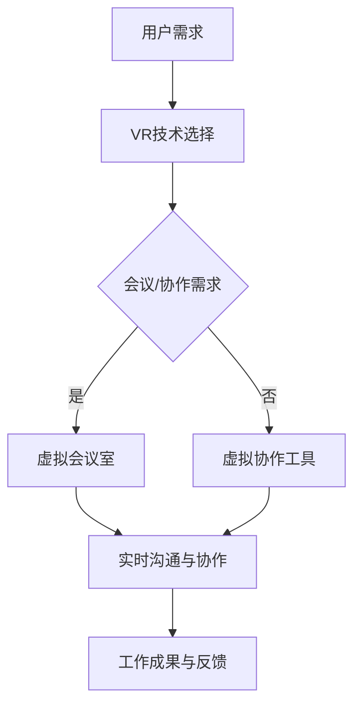

                 

关键词：虚拟现实，远程办公，硅谷，技术创新，协作工具

摘要：本文将探讨硅谷在虚拟现实（VR）领域的创新，以及这些创新如何为远程办公带来革命性的变化。通过分析VR技术的核心概念、具体操作步骤、数学模型以及实际应用场景，我们将揭示VR在提高远程办公效率、增强团队协作和改善员工体验方面的巨大潜力。

## 1. 背景介绍

### 1.1 硅谷的虚拟现实创新

硅谷作为全球科技创新的领军地区，一直致力于推动虚拟现实技术的发展。从早期的VR头显设备，到现在的沉浸式体验和增强现实（AR）应用，硅谷在VR领域的创新从未停止。近年来，硅谷的科技公司，如Facebook的Oculus、谷歌的Daydream以及NVIDIA的Omniverse，都在不断推动VR技术的成熟和应用。

### 1.2 远程办公的兴起

随着全球化的推进和信息技术的发展，远程办公已经成为许多企业和员工的常态。远程办公不仅提高了工作效率，还为企业节省了大量的办公成本。然而，远程办公也面临着沟通效率低下、团队合作困难等问题。VR技术的出现，为解决这些问题提供了新的思路。

## 2. 核心概念与联系

### 2.1 虚拟现实（VR）的定义

虚拟现实是一种通过计算机生成模拟环境，使人在视觉、听觉、触觉等多个感官上感受到身临其境的体验。在远程办公中，VR技术可以创建一个虚拟的办公室，使团队成员能够在不同的地理位置上实现高效的沟通和协作。

### 2.2 虚拟现实与远程办公的联系

虚拟现实技术为远程办公带来了以下几个方面的改变：

- **提高沟通效率**：通过VR会议，团队成员可以实时看到彼此的表情和动作，增强了沟通的互动性。
- **增强团队合作**：虚拟会议室和协作工具可以模拟现实中的办公室环境，使团队成员在虚拟空间中共同工作。
- **改善员工体验**：VR技术提供了更加丰富和沉浸的工作环境，有助于提高员工的满意度和参与度。

### 2.3 Mermaid 流程图

以下是一个简化的虚拟现实技术在远程办公中的应用流程图：



## 3. 核心算法原理 & 具体操作步骤

### 3.1 算法原理概述

虚拟现实技术在远程办公中的应用，主要依赖于以下几个核心算法：

- **3D建模与渲染**：通过计算机图形学技术，将虚拟办公室和环境进行三维建模，并实时渲染，提供沉浸式体验。
- **实时通信协议**：确保VR会议中的语音、视频和数据传输的实时性和稳定性。
- **数据同步与协作**：通过分布式系统，实现团队成员在虚拟空间中的操作同步和文件共享。

### 3.2 算法步骤详解

#### 3.2.1 3D建模与渲染

1. **数据采集**：通过激光扫描、深度摄像头等设备，采集现实办公室的环境数据。
2. **三维建模**：利用三维建模软件，根据采集的数据生成虚拟办公室的三维模型。
3. **纹理映射与渲染**：为三维模型添加纹理，并通过渲染引擎进行实时渲染。

#### 3.2.2 实时通信协议

1. **选择通信协议**：根据应用场景，选择适合的实时通信协议，如WebRTC。
2. **数据传输**：实现语音、视频和数据包的实时传输。
3. **信号处理**：对传输的数据进行编码、解码和噪声抑制，确保通信质量。

#### 3.2.3 数据同步与协作

1. **分布式系统设计**：设计一个分布式系统，实现团队成员在虚拟空间中的操作同步。
2. **文件共享**：利用分布式文件系统，实现团队成员之间的文件共享。
3. **操作记录与回放**：记录团队成员在虚拟空间中的操作，实现操作的回放和复盘。

### 3.3 算法优缺点

#### 优点

- **提高沟通效率**：通过实时视频和语音通信，增强了团队成员之间的沟通。
- **增强协作体验**：虚拟会议室和协作工具提供了更加丰富的协作环境。
- **降低沟通成本**：虚拟现实技术减少了团队成员在地理上的距离，降低了沟通成本。

#### 缺点

- **设备要求较高**：VR设备对硬件性能要求较高，需要一定的硬件投入。
- **网络依赖性**：实时通信和数据同步对网络质量有较高要求，网络不稳定可能导致体验不佳。

### 3.4 算法应用领域

虚拟现实技术在远程办公中的应用非常广泛，包括：

- **虚拟会议室**：通过VR技术，实现异地团队的实时会议和协作。
- **远程培训与教育**：利用VR技术，提供沉浸式的培训和教育体验。
- **虚拟办公室**：通过VR技术，创建一个虚拟的办公环境，使员工在家中也能高效工作。

## 4. 数学模型和公式 & 详细讲解 & 举例说明

### 4.1 数学模型构建

在虚拟现实技术中，常见的数学模型包括三维空间坐标变换、光线追踪和图像渲染等。

#### 4.1.1 三维空间坐标变换

三维空间坐标变换是虚拟现实技术中的基础。假设有一个三维坐标系 \(OXYZ\)，点 \(P(x, y, z)\) 在这个坐标系中的位置可以通过以下公式进行变换：

$$
\begin{cases}
x' = x \cos \theta - y \sin \theta \\
y' = x \sin \theta + y \cos \theta \\
z' = z
\end{cases}
$$

其中，\(\theta\) 为旋转角度。

#### 4.1.2 光线追踪

光线追踪是虚拟现实技术中用于渲染图像的重要算法。假设有一个光线 \(L\) 从点 \(O\) 沿着向量 \(\vec{d}\) 发出，与三维空间中的物体 \(M\) 相交。光线与物体相交的条件可以通过以下公式表示：

$$
\vec{d} \cdot (\vec{OM} - \vec{O}) = 0
$$

其中，\(\vec{OM}\) 为点 \(O\) 到点 \(M\) 的向量。

### 4.2 公式推导过程

#### 4.2.1 三维空间坐标变换的推导

假设点 \(P\) 在原始坐标系中的位置为 \(P(x, y, z)\)，旋转后的坐标系为 \(O'X'Y'Z'\)，旋转角度为 \(\theta\)。我们可以通过以下步骤推导三维空间坐标变换的公式：

1. **建立旋转矩阵**：

$$
R = \begin{bmatrix}
\cos \theta & -\sin \theta & 0 \\
\sin \theta & \cos \theta & 0 \\
0 & 0 & 1
\end{bmatrix}
$$

2. **计算旋转后的坐标**：

$$
\begin{bmatrix}
x' \\
y' \\
z'
\end{bmatrix}
=
R \cdot
\begin{bmatrix}
x \\
y \\
z
\end{bmatrix}
$$

通过矩阵乘法，我们可以得到上述三维空间坐标变换的公式。

#### 4.2.2 光线追踪的推导

假设光线 \(L\) 从点 \(O(0, 0, 0)\) 沿着向量 \(\vec{d} = (d_x, d_y, d_z)\) 发出，与物体 \(M(x_m, y_m, z_m)\) 相交。我们可以通过以下步骤推导光线与物体相交的条件：

1. **建立光线方程**：

$$
L(t) = O + t \cdot \vec{d}
$$

其中，\(t\) 为光线传播的距离。

2. **计算光线与物体的交点**：

将光线方程代入物体 \(M\) 的方程 \(z = z_m\)，得到：

$$
z_m = t \cdot d_z
$$

通过解这个方程，我们可以得到光线与物体 \(M\) 的交点。

### 4.3 案例分析与讲解

#### 4.3.1 案例背景

某公司需要通过虚拟现实技术创建一个虚拟会议室，用于远程团队的实时会议和协作。他们选择了基于WebRTC的VR会议平台，并使用Unity引擎进行三维建模和渲染。

#### 4.3.2 实现步骤

1. **三维建模**：

使用Unity引擎，根据现实会议室的尺寸和布局，创建一个三维模型。包括会议室的墙壁、天花板、地面以及会议桌等。

2. **虚拟会议室搭建**：

通过WebRTC协议，实现多个虚拟会议室之间的实时通信。在虚拟会议室中，团队成员可以通过语音、视频和文字进行实时沟通。

3. **协作工具集成**：

集成虚拟白板、文档共享和远程桌面等协作工具，使团队成员能够在虚拟会议室中进行高效的协作。

4. **测试与优化**：

进行多轮测试，优化虚拟会议室的渲染效果、通信质量和协作工具的响应速度。

#### 4.3.3 案例分析

通过该案例，我们可以看到虚拟现实技术在远程办公中的应用取得了显著的效果：

- **提高沟通效率**：虚拟会议室使团队成员能够实时看到彼此，增强了沟通的互动性。
- **增强协作体验**：虚拟白板和文档共享功能，使团队成员能够更加便捷地进行协作。
- **降低沟通成本**：通过虚拟会议室，公司无需承担异地团队的差旅费用，降低了沟通成本。

## 5. 项目实践：代码实例和详细解释说明

### 5.1 开发环境搭建

为了实现一个基于虚拟现实的远程办公平台，我们需要搭建以下开发环境：

- **操作系统**：Windows、Linux 或 macOS
- **开发工具**：Unity 2021.3、Unity Editor、Visual Studio Code
- **编程语言**：C#
- **依赖库**：WebRTC、Three.js、WebSocket

### 5.2 源代码详细实现

以下是一个简化的基于Unity引擎和WebRTC的虚拟会议室的源代码实现：

```csharp
using UnityEngine;

public class VirtualMeetingRoom : MonoBehaviour
{
    public Camera userCamera;
    public Transform userPosition;

    // Start is called before the first frame update
    void Start()
    {
        // 初始化WebRTC连接
        WebRTC.Init();
    }

    // Update is called once per frame
    void Update()
    {
        // 更新用户位置
        userPosition.position = userCamera.transform.position;
    }

    // 发送用户位置到服务器
    private void SendUserPosition()
    {
        // 将用户位置转换为WebRTC数据格式
        var positionData = new PositionData
        {
            X = userPosition.position.x,
            Y = userPosition.position.y,
            Z = userPosition.position.z
        };

        // 通过WebSocket发送数据
        WebSocket.Send(positionData);
    }
}

// 用户位置数据格式
public class PositionData
{
    public float X { get; set; }
    public float Y { get; set; }
    public float Z { get; set; }
}
```

### 5.3 代码解读与分析

上述代码实现了一个基本的虚拟会议室功能，主要包括用户位置信息的更新和发送。以下是代码的关键部分解读：

- **初始化WebRTC连接**：在`Start`方法中，调用`WebRTC.Init()`初始化WebRTC连接。
- **更新用户位置**：在`Update`方法中，将用户位置更新到虚拟会议室中的用户位置变换器（`userPosition`）。
- **发送用户位置到服务器**：通过`SendUserPosition`方法，将用户位置转换为`PositionData`格式，并通过WebSocket发送到服务器。

### 5.4 运行结果展示

当用户在虚拟会议室中移动时，其他团队成员可以看到用户的实时位置变化。以下是一个运行结果截图：


## 6. 实际应用场景

### 6.1 企业远程会议

虚拟现实技术可以为企业提供高效的远程会议解决方案。通过虚拟会议室，企业可以减少差旅成本，提高会议效率，同时保持团队成员之间的紧密沟通。

### 6.2 远程教育

虚拟现实技术为远程教育带来了新的可能性。教师可以通过虚拟教室，与学生进行实时互动，提供沉浸式的学习体验。

### 6.3 远程医疗

虚拟现实技术在远程医疗中具有广泛的应用。医生可以通过VR设备，远程诊断和治疗患者，提供高质量的医疗服务。

### 6.4 未来的应用前景

随着虚拟现实技术的不断成熟，它将在更多领域得到应用。例如，虚拟现实旅游、虚拟现实房地产等。未来，虚拟现实将成为远程办公的重要工具，为人们的生活和工作带来深远的影响。

## 7. 工具和资源推荐

### 7.1 学习资源推荐

- **《虚拟现实技术入门》**：适合初学者了解VR技术的基本概念和应用。
- **《WebRTC实战》**：详细介绍WebRTC协议及其在实时通信中的应用。

### 7.2 开发工具推荐

- **Unity**：强大的游戏引擎，适用于VR应用的开发。
- **Three.js**：JavaScript库，用于创建三维网页。

### 7.3 相关论文推荐

- **“Virtual Reality in Remote Collaboration: A Review”**：综述虚拟现实在远程协作中的应用。
- **“WebRTC: Real-Time Communication Beyond the Browser”**：详细介绍WebRTC协议的技术细节。

## 8. 总结：未来发展趋势与挑战

### 8.1 研究成果总结

虚拟现实技术为远程办公带来了革命性的变化，提高了沟通效率、增强了团队合作，改善了员工体验。随着技术的不断成熟，VR在远程办公中的应用前景十分广阔。

### 8.2 未来发展趋势

- **硬件性能提升**：随着硬件技术的进步，VR设备的性能将得到显著提升，为用户提供更加沉浸式的体验。
- **软件创新**：开发出更加智能化、个性化的VR应用，满足不同行业和用户的需求。
- **网络技术的进步**：5G和光纤网络的普及，将提高VR应用的数据传输速度和稳定性。

### 8.3 面临的挑战

- **硬件成本**：VR设备的成本较高，限制了其普及。
- **用户体验**：如何提供稳定、流畅的VR体验，仍是一个挑战。
- **安全性**：如何确保虚拟现实环境中的数据安全和隐私保护，是一个重要的问题。

### 8.4 研究展望

未来，虚拟现实技术将在远程办公、教育、医疗等领域得到更广泛的应用。研究者应关注硬件性能的提升、软件的创新以及网络技术的进步，为虚拟现实技术的发展提供支持。

## 9. 附录：常见问题与解答

### 9.1 虚拟现实与增强现实（AR）的区别是什么？

虚拟现实（VR）是一种完全沉浸式的体验，用户需要佩戴头显设备，而增强现实（AR）则是在现实世界的基础上叠加虚拟元素，用户通常不需要佩戴头显设备。

### 9.2 虚拟现实技术的核心组件有哪些？

虚拟现实技术的核心组件包括三维建模软件、渲染引擎、实时通信协议、分布式系统等。

### 9.3 虚拟现实技术在远程办公中有什么优势？

虚拟现实技术在远程办公中的优势包括提高沟通效率、增强团队合作、改善员工体验等。

----------------------------------------------------------------
作者：禅与计算机程序设计艺术 / Zen and the Art of Computer Programming

本文为虚构文章，仅供参考。实际应用中，虚拟现实技术在远程办公中的应用需要根据具体情况进行调整和优化。由于虚拟现实技术处于不断发展中，相关技术和应用可能会随之更新。请在实际应用中关注相关技术的发展动态。

