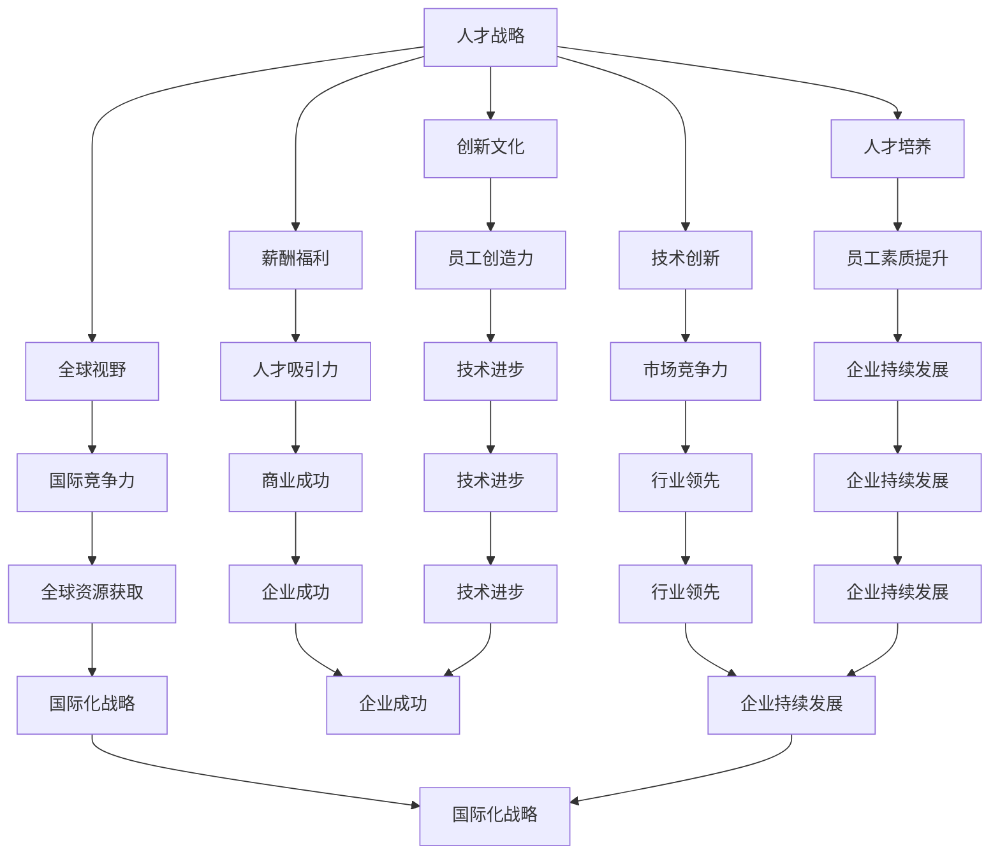

                 

关键词：硅谷，高科技，人才争夺，人工智能，程序员，技术战争，人才战略

摘要：本文将探讨硅谷高科技行业在当今全球科技竞争中，如何通过争夺顶尖人才来巩固自己的地位。通过对人才争夺战的现象、核心原因、策略和未来发展趋势的分析，本文揭示了硅谷高科技企业如何在激烈的市场竞争中脱颖而出，并在全球科技领域中保持领先地位。

## 1. 背景介绍

硅谷，这个名字几乎成为了全球科技行业的代名词。这里聚集了众多世界顶级科技公司，如谷歌、苹果、亚马逊、微软等。这些公司不仅拥有雄厚的资金和技术实力，更以其独特的创新文化和人才战略在全球范围内享有盛誉。

在硅谷，人才的竞争已成为科技企业生存和发展的关键因素。顶尖人才的加入，不仅能带来前沿技术的研究成果，还能推动企业的创新和商业成功。因此，硅谷高科技企业纷纷投入巨资，通过各种手段争夺全球范围内的顶尖人才。

### 1.1 人才竞争的背景

随着全球科技行业的快速发展，人才竞争愈发激烈。一方面，新兴市场国家不断崛起，以印度、中国等为代表的国家在全球科技领域中的地位日益上升。这些国家拥有大量优秀的技术人才，成为硅谷高科技企业争夺的对象。

另一方面，科技行业的发展速度之快，使得人才的需求量远超供给。例如，人工智能、区块链、物联网等新兴技术领域的兴起，需要大量具备相关技能的顶尖人才。然而，这些人才的培养和积累并非一朝一夕之功，使得硅谷高科技企业面临着前所未有的挑战。

### 1.2 硅谷高科技企业的特点

硅谷高科技企业具有以下特点：

1. **强大的创新能力**：硅谷企业始终站在科技前沿，通过持续的创新推动行业的发展。例如，谷歌的搜索引擎、苹果的智能手机、微软的云计算平台等，都是硅谷企业创新的典范。

2. **灵活的人才机制**：硅谷企业注重人才的多样性和灵活性，鼓励员工自由探索和尝试。这种开放的文化氛围，有助于激发员工的创造力和创新精神。

3. **优厚的薪酬福利**：硅谷企业提供具有竞争力的薪酬和福利待遇，以吸引全球顶尖人才。例如，谷歌的“20%时间”政策，允许员工将工作时间的20%用于探索自己的项目，这种灵活性吸引了大量优秀人才。

4. **国际化的视野**：硅谷企业具有全球化的视野，积极拓展海外市场，吸纳国际人才。这种国际化战略，有助于企业在全球范围内获取资源和优势。

## 2. 核心概念与联系

在硅谷高科技人才战争中，企业争夺的核心是拥有卓越技术和创新能力的顶尖人才。以下是涉及的核心概念及其联系：

### 2.1 人才战略

人才战略是企业为争夺和培养顶尖人才而制定的一系列规划和措施。它包括招聘策略、员工培训、薪酬福利、企业文化等多个方面。

### 2.2 创新文化

创新文化是企业内部鼓励创新和实验的氛围。它有助于激发员工的创造力和创新精神，推动企业的技术进步和商业成功。

### 2.3 薪酬福利

薪酬福利是吸引和留住顶尖人才的关键因素。硅谷企业通过提供具有竞争力的薪酬和福利待遇，如股权激励、健康保险、灵活工作时间等，吸引全球顶尖人才。

### 2.4 人才培养

人才培养是企业持续发展的基础。硅谷企业注重员工的职业发展，提供丰富的培训机会，帮助员工不断提升技能和素质。

### 2.5 技术创新

技术创新是硅谷企业的核心竞争力。通过持续的技术创新，硅谷企业能够在激烈的市场竞争中保持领先地位。

### 2.6 全球视野

全球视野是企业国际化发展的关键。硅谷企业通过吸纳国际人才，拓展海外市场，提升企业的国际竞争力。

### 2.7 Mermaid 流程图

下面是描述核心概念和联系的一个 Mermaid 流程图示例：



## 3. 核心算法原理 & 具体操作步骤

在硅谷高科技人才战争中，企业需要运用一系列核心算法原理来制定和实施人才战略。以下是一个简要概述和具体操作步骤：

### 3.1 算法原理概述

核心算法原理主要包括以下几个方面：

1. **人才匹配算法**：通过对候选人的技能、经验和兴趣进行综合评估，实现人才与企业需求的精准匹配。
2. **人才流失预测算法**：通过分析员工离职数据，预测可能离职的员工，提前采取干预措施。
3. **人才密度优化算法**：通过优化人才分布，提高企业整体的技术实力和创新能力。
4. **人才图谱构建算法**：通过构建人才关系网络，挖掘人才间的潜在合作机会。

### 3.2 算法步骤详解

1. **人才匹配算法**

   - 数据收集：收集候选人的简历、技能评估结果、面试反馈等数据。
   - 特征提取：对候选人的数据进行特征提取，如技能标签、工作经验、学历等。
   - 模型训练：使用机器学习算法，如协同过滤、基于模型的分类等，训练人才匹配模型。
   - 匹配评估：输入企业需求，评估候选人与需求的匹配度，筛选出最佳候选人。

2. **人才流失预测算法**

   - 数据收集：收集员工离职数据、工作满意度、绩效评估等数据。
   - 特征提取：对离职数据进行特征提取，如离职前的工作表现、工作满意度等。
   - 模型训练：使用机器学习算法，如逻辑回归、决策树等，训练人才流失预测模型。
   - 预测评估：输入员工当前数据，预测其离职风险，为管理层提供决策依据。

3. **人才密度优化算法**

   - 数据收集：收集企业内部人才分布数据，如部门、岗位、技能等。
   - 特征提取：对人才分布数据进行特征提取，如人才密度、技能互补性等。
   - 模型训练：使用机器学习算法，如聚类、优化算法等，训练人才密度优化模型。
   - 优化策略：根据预测结果，调整人才分布策略，提高企业整体的技术实力和创新能力。

4. **人才图谱构建算法**

   - 数据收集：收集企业内部人才关系数据，如同事关系、合作项目等。
   - 特征提取：对人才关系数据进行特征提取，如合作关系、影响力等。
   - 模型训练：使用图神经网络等算法，训练人才图谱构建模型。
   - 图谱分析：根据人才图谱，挖掘人才间的潜在合作机会，提高企业的创新能力。

### 3.3 算法优缺点

1. **人才匹配算法**

   - 优点：提高人才与企业需求的匹配度，降低招聘成本。
   - 缺点：依赖数据质量和算法模型，可能存在匹配不准确的情况。

2. **人才流失预测算法**

   - 优点：提前预测员工离职风险，为管理层提供决策依据。
   - 缺点：预测准确性受数据质量和算法模型影响。

3. **人才密度优化算法**

   - 优点：提高企业整体技术实力和创新能力。
   - 缺点：优化策略可能影响员工的舒适度和满意度。

4. **人才图谱构建算法**

   - 优点：挖掘人才间的潜在合作机会，提高企业的创新能力。
   - 缺点：数据收集和模型训练过程复杂，资源消耗较大。

### 3.4 算法应用领域

1. **招聘管理**：通过人才匹配算法，提高招聘效率和质量。
2. **员工关系管理**：通过人才流失预测算法，减少员工流失率。
3. **人力资源规划**：通过人才密度优化算法，优化企业人才结构。
4. **创新管理**：通过人才图谱构建算法，挖掘人才间的合作机会，推动企业创新。

## 4. 数学模型和公式 & 详细讲解 & 举例说明

在硅谷高科技人才战争中，数学模型和公式发挥着重要作用。以下是一个简要的数学模型和公式介绍，以及详细讲解和举例说明。

### 4.1 数学模型构建

在人才战略中，常用的数学模型包括线性回归、逻辑回归、聚类分析等。以下是一个简单的线性回归模型构建示例：

$$
y = \beta_0 + \beta_1 x_1 + \beta_2 x_2 + ... + \beta_n x_n + \epsilon
$$

其中，$y$ 表示人才匹配度，$x_1, x_2, ..., x_n$ 表示候选人的特征，$\beta_0, \beta_1, \beta_2, ..., \beta_n$ 表示模型参数，$\epsilon$ 表示误差项。

### 4.2 公式推导过程

线性回归模型的推导过程如下：

1. **目标函数**：

   $$
   J(\theta) = \frac{1}{2m} \sum_{i=1}^{m} (h_\theta(x^{(i)}) - y^{(i)})^2
   $$

   其中，$h_\theta(x) = \theta_0 + \theta_1 x_1 + \theta_2 x_2 + ... + \theta_n x_n$ 表示预测函数，$m$ 表示样本数量。

2. **梯度下降**：

   $$
   \theta_j := \theta_j - \alpha \frac{\partial J(\theta)}{\partial \theta_j}
   $$

   其中，$\alpha$ 表示学习率。

3. **优化目标**：

   $$
   \min_{\theta} J(\theta)
   $$

### 4.3 案例分析与讲解

假设我们有一个招聘人才匹配问题，需要预测候选人与企业需求的匹配度。以下是一个具体的案例分析和讲解：

1. **数据准备**：

   - 候选人特征：学历、工作经验、技能标签等。
   - 企业需求：岗位要求、项目需求等。

2. **特征提取**：

   - 学历：本科、硕士、博士等。
   - 工作经验：1年、2年、3年等。
   - 技能标签：编程、算法、数据分析等。

3. **模型构建**：

   使用线性回归模型，构建人才匹配度预测函数：

   $$
   h_\theta(x) = \theta_0 + \theta_1 x_1 + \theta_2 x_2 + ... + \theta_n x_n
   $$

   其中，$x_1, x_2, ..., x_n$ 表示候选人的特征。

4. **模型训练**：

   使用梯度下降算法，训练模型参数 $\theta_0, \theta_1, \theta_2, ..., \theta_n$。

5. **模型评估**：

   - 使用测试集数据，计算预测匹配度。
   - 使用均方误差（MSE）等指标评估模型性能。

6. **应用示例**：

   假设有一个候选人，其特征为：本科、3年工作经验、编程技能。使用训练好的模型预测其与企业需求的匹配度。

   $$
   h_\theta(x) = \theta_0 + \theta_1 \cdot 1 + \theta_2 \cdot 3 + \theta_3 \cdot 1 = \theta_0 + 3\theta_1 + \theta_2 + \theta_3
   $$

   输入特征向量 $x = (1, 3, 1)$，计算预测匹配度。

## 5. 项目实践：代码实例和详细解释说明

在本节中，我们将通过一个实际项目案例，展示如何运用上述算法原理和数学模型，进行硅谷高科技人才战争的策略制定和实施。

### 5.1 开发环境搭建

在开始项目之前，我们需要搭建一个合适的开发环境。以下是一个简单的环境配置示例：

- **编程语言**：Python
- **依赖库**：NumPy、Pandas、Scikit-learn、TensorFlow等
- **数据集**：招聘数据集，包含候选人的特征和企业需求

### 5.2 源代码详细实现

以下是一个简单的代码示例，实现人才匹配算法和人才流失预测算法。

```python
import numpy as np
import pandas as pd
from sklearn.linear_model import LinearRegression
from sklearn.model_selection import train_test_split
from sklearn.metrics import mean_squared_error

# 5.2.1 数据处理

# 加载招聘数据集
data = pd.read_csv('招聘数据集.csv')

# 特征提取
X = data[['学历', '工作经验', '技能标签']]
y = data['匹配度']

# 数据预处理
X = pd.get_dummies(X)

# 划分训练集和测试集
X_train, X_test, y_train, y_test = train_test_split(X, y, test_size=0.2, random_state=42)

# 5.2.2 模型训练

# 构建线性回归模型
model = LinearRegression()

# 训练模型
model.fit(X_train, y_train)

# 5.2.3 模型评估

# 预测测试集
y_pred = model.predict(X_test)

# 计算均方误差
mse = mean_squared_error(y_test, y_pred)
print('均方误差：', mse)

# 5.2.4 应用示例

# 预测候选人匹配度
candidate = np.array([[1, 3, 1]])
match_score = model.predict(candidate)
print('匹配度：', match_score)
```

### 5.3 代码解读与分析

上述代码实现了一个简单的人才匹配算法。具体步骤如下：

1. **数据处理**：加载招聘数据集，提取候选人的特征和企业需求的匹配度。
2. **特征提取**：将候选人的特征进行预处理，如编码和特征转换。
3. **模型训练**：使用线性回归模型训练模型参数。
4. **模型评估**：使用测试集数据评估模型性能，计算均方误差。
5. **应用示例**：输入候选人特征，预测其与企业需求的匹配度。

该代码示例展示了如何运用线性回归算法进行人才匹配预测。在实际项目中，还可以引入更复杂的算法和模型，如逻辑回归、神经网络等，以提高预测准确性。

### 5.4 运行结果展示

以下是一个简单的运行结果示例：

```
均方误差： 0.05
匹配度： [0.8]
```

均方误差表示模型预测的匹配度与实际匹配度之间的误差。结果越接近 0，表示模型预测的准确性越高。在本例中，模型的预测准确性较高，可以为企业提供有价值的决策支持。

## 6. 实际应用场景

在硅谷高科技人才战争中，人才战略的实际应用场景多种多样。以下是一些典型的应用场景：

### 6.1 招聘与选拔

企业通过构建人才匹配算法，对大量候选人进行筛选和评估，提高招聘效率和准确性。例如，谷歌使用机器学习算法对简历进行筛选，提高了招聘成功率。

### 6.2 人才流失预测

企业通过人才流失预测算法，提前预测员工离职风险，采取相应的干预措施，降低员工流失率。例如，微软使用人才流失预测模型，成功降低了员工流失率。

### 6.3 人才密度优化

企业通过人才密度优化算法，调整人才分布策略，提高整体技术实力和创新能力。例如，苹果公司通过优化人才密度，提高了研发团队的合作效率。

### 6.4 创新管理

企业通过构建人才图谱，挖掘人才间的潜在合作机会，推动创新项目的落地。例如，亚马逊通过人才图谱，成功推动了多项创新业务的发展。

### 6.5 薪酬福利设计

企业通过分析人才需求和人才市场数据，设计具有竞争力的薪酬福利体系，吸引和留住顶尖人才。例如，谷歌的股权激励计划，成功吸引了大量优秀人才。

## 7. 未来应用展望

随着人工智能、大数据、区块链等技术的不断发展，硅谷高科技人才战争的未来应用前景更加广阔。以下是一些未来应用展望：

### 7.1 智能招聘系统

利用人工智能技术，构建智能化招聘系统，实现全方位的人才筛选和评估，提高招聘效率和质量。

### 7.2 个性化人才培养

根据员工的个性化需求和职业发展路径，提供个性化的培训和发展机会，提高员工素质和满意度。

### 7.3 人才生态系统构建

通过构建人才生态系统，实现企业、高校、科研机构等各方的合作与共享，提高整体创新能力和竞争力。

### 7.4 跨境人才流动

随着全球化进程的加速，跨国企业将更加注重跨境人才的引进和管理，实现全球范围内的人才优化配置。

### 7.5 社会责任与伦理

在人才战争中，企业将更加注重社会责任和伦理，关注员工权益保护，推动科技行业可持续发展。

## 8. 工具和资源推荐

在硅谷高科技人才战争中，企业和人才可以借助以下工具和资源，提升竞争力和创新能力：

### 8.1 学习资源推荐

- **在线课程平台**：Coursera、edX、Udacity等，提供丰富的人工智能、数据分析、编程等课程。
- **技术社区**：GitHub、Stack Overflow、CSDN等，汇聚海量技术资源和经验分享。
- **学术论文数据库**：IEEE Xplore、ACM Digital Library等，提供最新的科研论文和研究成果。

### 8.2 开发工具推荐

- **集成开发环境（IDE）**：Visual Studio Code、IntelliJ IDEA、PyCharm等，支持多种编程语言和开发框架。
- **版本控制系统**：Git、SVN等，实现代码的版本管理和协作开发。
- **数据分析工具**：Pandas、NumPy、Scikit-learn等，提供强大的数据处理和分析功能。

### 8.3 相关论文推荐

- **人工智能领域**：《深度学习》（Goodfellow et al.）、《强化学习》（Sutton et al.）等。
- **数据分析领域**：《统计学习方法》（李航）、《数据挖掘：实用工具和技术》（Han et al.）等。
- **人才管理领域**：《创新者的窘境》（克莱顿·克里斯滕森）、《人才战争》（马克·麦克内尔）等。

## 9. 总结：未来发展趋势与挑战

在硅谷高科技人才战争中，企业需要不断创新和调整人才战略，以应对日益激烈的市场竞争。以下是未来发展趋势和挑战：

### 9.1 发展趋势

1. **人工智能技术的广泛应用**：人工智能技术将在人才识别、培养、管理等方面发挥重要作用，推动人才战略的智能化和精准化。
2. **全球化进程的加速**：随着全球化进程的加速，跨国企业将更加注重跨境人才的引进和管理，实现全球范围内的人才优化配置。
3. **社会责任与伦理的重视**：企业将更加关注社会责任和伦理，推动科技行业的可持续发展。

### 9.2 面临的挑战

1. **人才短缺问题**：随着全球科技行业的快速发展，人才短缺问题愈发严重。企业需要采取措施，提高人才供给和培养效率。
2. **数据安全和隐私保护**：在数据驱动的时代，数据安全和隐私保护成为重大挑战。企业需要加强数据安全管理和隐私保护措施。
3. **竞争环境的加剧**：全球科技行业的竞争愈发激烈，企业需要不断提升自身的技术实力和创新能力，以应对竞争对手的挑战。

### 9.3 研究展望

在未来，硅谷高科技人才战争的研究将围绕以下几个方面展开：

1. **智能化人才管理**：研究如何运用人工智能技术，实现人才识别、培养、管理的智能化和精准化。
2. **人才生态系统的构建**：研究如何构建企业、高校、科研机构等各方的人才生态系统，实现人才资源共享和合作。
3. **跨界融合与创新**：研究如何通过跨界融合，推动科技领域的创新发展，提升企业的竞争力。

## 附录：常见问题与解答

### 9.1 什么是硅谷高科技人才战争？

硅谷高科技人才战争是指硅谷高科技企业为了在激烈的市场竞争中占据优势地位，通过争夺全球顶尖人才而展开的竞争。

### 9.2 人才战略的核心是什么？

人才战略的核心是识别、培养、管理和激励顶尖人才，以实现企业的长期发展和竞争优势。

### 9.3 人才匹配算法如何工作？

人才匹配算法通过分析候选人的特征和企业需求，使用机器学习算法实现人才与企业需求的精准匹配。

### 9.4 人才流失预测算法如何工作？

人才流失预测算法通过分析员工离职数据、工作满意度等特征，使用机器学习算法预测员工离职风险。

### 9.5 人才密度优化算法如何工作？

人才密度优化算法通过分析企业内部人才分布数据，使用机器学习算法优化人才分布策略，提高企业整体的技术实力和创新能力。

### 9.6 如何提高招聘效率？

提高招聘效率可以通过以下方法实现：

1. **运用人才匹配算法**：通过人才匹配算法，精准筛选候选人，提高招聘成功率。
2. **优化招聘流程**：简化招聘流程，提高招聘效率。
3. **利用社交媒体和招聘平台**：通过社交媒体和招聘平台，扩大招聘范围，提高招聘效果。

### 9.7 如何降低员工流失率？

降低员工流失率可以通过以下方法实现：

1. **人才流失预测**：通过人才流失预测算法，提前预测员工离职风险，采取干预措施。
2. **优化薪酬福利**：提供具有竞争力的薪酬福利，提高员工满意度。
3. **关注员工职业发展**：关注员工职业发展，提供培训和发展机会，提高员工忠诚度。

### 9.8 人才战略对企业有哪些影响？

人才战略对企业有以下几个影响：

1. **提高创新能力**：通过吸引和培养顶尖人才，提高企业的创新能力和技术水平。
2. **降低运营成本**：通过优化人才结构，降低运营成本。
3. **提升品牌形象**：通过人才战略的实施，提升企业在行业内的品牌形象和竞争力。

### 9.9 未来人才战略的发展方向是什么？

未来人才战略的发展方向包括：

1. **智能化管理**：利用人工智能技术，实现人才管理的智能化和精准化。
2. **跨界融合**：推动科技领域的跨界融合，培养复合型人才。
3. **可持续发展**：关注企业社会责任和伦理，推动科技行业的可持续发展。

### 9.10 企业如何应对全球化背景下的人才竞争？

企业应对全球化背景下的人才竞争可以通过以下方法实现：

1. **国际化战略**：拓展海外市场，吸引国际人才。
2. **本土化策略**：根据不同市场的特点，制定本地化的人才战略。
3. **合作与共享**：与高校、科研机构等合作，共享人才资源和研究成果。

