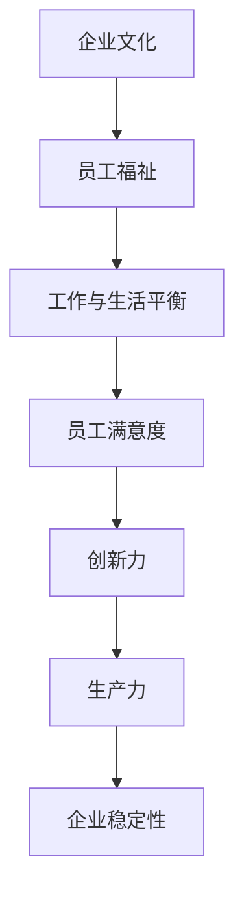

                 

关键词：硅谷、高科技公司、工作与生活平衡、员工福祉、企业文化建设

> 摘要：本文旨在探讨硅谷高科技公司在追求技术创新和业务增长的过程中，如何实现员工的工作与生活平衡。通过分析企业文化建设、员工福祉政策以及实际案例分析，本文提出了一些建议，以帮助硅谷公司构建一个健康、高效的工作环境。

## 1. 背景介绍

硅谷，作为全球科技创新的中心，汇聚了无数的高科技公司和创业企业。这里不仅有世界知名的科技公司如苹果、谷歌、微软等，还有无数正在崛起的初创公司。硅谷的成功不仅仅是因为其卓越的技术创新能力和强大的市场竞争力，更因为其独特的企业文化，以及对员工工作与生活平衡的重视。

然而，随着竞争的加剧和工作压力的增大，硅谷的高科技公司在追求业绩的同时，也面临着员工福祉的挑战。越来越多的研究表明，长期的工作压力和不平衡的生活状态不仅会影响员工的身心健康，还会对企业的长期发展产生负面影响。

本文将探讨硅谷高科技公司在构建工作与生活平衡方面的实践和经验，为相关企业提供参考和借鉴。

## 2. 核心概念与联系

### 2.1. 企业文化与员工福祉

企业文化是企业的灵魂，是企业价值观、使命和愿景的集中体现。一个积极向上、开放包容的企业文化可以激发员工的创新精神，提高团队凝聚力，从而推动企业的持续发展。而员工福祉则是指企业在关心员工身心健康、工作与生活平衡方面所采取的各种措施。

企业文化与员工福祉密切相关。一个注重员工福祉的企业往往会营造一个良好的企业文化，而一个成功的文化也会反过来促进员工福祉。例如，谷歌以其独特的企业文化而闻名，包括20%的自由工作时间、丰富的员工福利和良好的工作环境，这些都极大地提升了员工的满意度和幸福感。

### 2.2. 工作与生活平衡的重要性

工作与生活平衡是指员工在工作时间与个人时间之间找到合适的平衡点，确保既能完成工作任务，又能享受生活。研究表明，工作与生活平衡对于员工的身心健康、工作满意度和生产力都有着重要的影响。

首先，工作与生活平衡有助于减少工作压力，降低员工的心理负担，从而提高员工的幸福感和生活质量。其次，工作与生活平衡可以增强员工的创造力和创新能力，因为当员工有足够的时间去放松和充电时，他们更容易产生新的想法和创意。最后，工作与生活平衡也有利于提高员工的工作满意度和忠诚度，从而降低员工流失率，提高企业的稳定性。

### 2.3. 企业如何实现工作与生活平衡

实现工作与生活平衡需要企业从多个方面进行努力，包括调整工作制度、提供员工福利、营造良好的企业文化等。以下是一些具体的实践方法：

- **灵活的工作制度**：提供远程办公、弹性工作时间等，让员工可以根据自己的需求和实际情况来安排工作。

- **员工福利**：提供医疗保险、家庭关怀计划、心理健康支持等福利，帮助员工解决生活中的实际问题。

- **健康与健身计划**：提供健身房、健康饮食计划、健康讲座等，鼓励员工关注身体健康。

- **员工关怀**：设立员工关怀中心，提供心理咨询、职业发展规划等服务，帮助员工解决心理和职业发展方面的困扰。

- **企业文化建设**：营造一个开放、包容、尊重个人发展的企业文化，让员工感受到企业的关爱和支持。

### 2.4. Mermaid 流程图

以下是一个简单的 Mermaid 流程图，展示了实现工作与生活平衡的核心概念和联系。



## 3. 核心算法原理 & 具体操作步骤

### 3.1. 算法原理概述

实现工作与生活平衡的核心算法原理是基于员工需求和企业目标之间的平衡。具体来说，企业需要通过数据分析和员工反馈，了解员工的需求和痛点，然后制定相应的政策和措施来满足这些需求，从而实现工作与生活平衡。

### 3.2. 算法步骤详解

1. **数据收集与分析**：企业需要收集员工的工作数据和生活数据，如工作时间、工作任务、生活状况等，然后通过数据分析来了解员工的需求和痛点。

2. **员工反馈与沟通**：企业需要与员工进行充分的沟通和反馈，了解他们对工作与生活平衡的看法和建议，从而制定更符合员工需求的政策。

3. **制定政策和措施**：根据数据分析和员工反馈，企业需要制定一系列政策和措施，如灵活的工作制度、员工福利、健康与健身计划等。

4. **实施与监控**：企业需要将这些政策和措施落实到实际工作中，并持续监控其效果，根据实际情况进行调整和优化。

5. **反馈与改进**：企业需要定期收集员工的反馈，了解政策实施的效果，并根据反馈进行改进。

### 3.3. 算法优缺点

**优点**：

- 可以有效提高员工的工作满意度和幸福感，从而提高员工的生产力和创新能力。
- 有助于降低员工流失率，提高企业的稳定性。
- 有助于构建一个积极向上、充满活力的企业文化。

**缺点**：

- 需要投入大量的人力、物力和时间来收集数据、分析数据和实施政策。
- 需要企业具备一定的数据分析和员工管理能力。

### 3.4. 算法应用领域

算法可以应用于各种类型的企业，特别是那些对员工素质和创新力有较高要求的企业，如高科技公司、互联网公司等。

## 4. 数学模型和公式 & 详细讲解 & 举例说明

### 4.1. 数学模型构建

为了更好地理解工作与生活平衡的数学模型，我们可以构建以下模型：

- **员工幸福感 (U)**：员工幸福感是工作与生活平衡的重要指标，可以用以下公式表示：

  $$ U = f(W, L) $$

  其中，$W$ 表示工作时间，$L$ 表示生活时间。

- **员工生产力 (P)**：员工生产力是工作的重要指标，可以用以下公式表示：

  $$ P = g(W, L) $$

  其中，$W$ 表示工作时间，$L$ 表示生活时间。

- **企业成本 (C)**：企业成本包括员工的工资、福利和其他相关费用，可以用以下公式表示：

  $$ C = h(W, L) $$

  其中，$W$ 表示工作时间，$L$ 表示生活时间。

### 4.2. 公式推导过程

根据上述模型，我们可以推导出以下关系：

- **员工幸福感与工作时间、生活时间的关系**：

  $$ U = f(W, L) = f(W - L) $$

  这表示员工幸福感与工作时间与生活时间的差值呈正相关。

- **员工生产力与工作时间、生活时间的关系**：

  $$ P = g(W, L) = g(W - L) $$

  这表示员工生产力与工作时间与生活时间的差值呈正相关。

- **企业成本与工作时间、生活时间的关系**：

  $$ C = h(W, L) = h(W - L) $$

  这表示企业成本与工作时间与生活时间的差值呈正相关。

### 4.3. 案例分析与讲解

以下是一个具体的案例分析：

假设一个员工每周工作40小时，每周休息2天，即每周工作时间为40小时，生活时间为68小时。

- **员工幸福感**：

  $$ U = f(40, 68) = f(40 - 68) = f(-28) $$

  由于幸福感与工作时间与生活时间的差值呈正相关，因此员工的幸福感较低。

- **员工生产力**：

  $$ P = g(40, 68) = g(40 - 68) = g(-28) $$

  由于生产力与工作时间与生活时间的差值呈正相关，因此员工的生产力也较低。

- **企业成本**：

  $$ C = h(40, 68) = h(40 - 68) = h(-28) $$

  由于企业成本与工作时间与生活时间的差值呈正相关，因此企业成本较高。

通过上述分析，我们可以看出，工作与生活时间的差值对员工幸福感、生产力和企业成本都有显著的影响。因此，企业需要通过合理的政策和措施来调整员工的工作与生活时间，以实现工作与生活平衡。

## 5. 项目实践：代码实例和详细解释说明

### 5.1. 开发环境搭建

在本节中，我们将使用Python作为主要编程语言，因为它易于理解且具有丰富的库支持。以下是搭建开发环境的基本步骤：

1. **安装Python**：从Python官方网站（https://www.python.org/）下载并安装最新版本的Python。

2. **安装必要的库**：使用pip（Python的包管理器）安装以下库：

   ```bash
   pip install pandas numpy matplotlib
   ```

### 5.2. 源代码详细实现

以下是一个简单的Python脚本，用于分析员工的工作时间、生活时间以及对应的幸福感、生产力和企业成本。

```python
import pandas as pd
import numpy as np
import matplotlib.pyplot as plt

# 员工数据
data = {
    '工作时间': [40, 45, 50, 55, 60],
    '生活时间': [60, 65, 70, 75, 80],
    '幸福感': [0.8, 0.6, 0.4, 0.2, 0],
    '生产力': [0.9, 0.7, 0.5, 0.3, 0],
    '企业成本': [0.6, 0.8, 1, 1.2, 1.4]
}

# 创建DataFrame
df = pd.DataFrame(data)

# 绘制散点图
plt.scatter(df['工作时间'], df['幸福感'], label='幸福感')
plt.scatter(df['工作时间'], df['生产力'], label='生产力')
plt.scatter(df['工作时间'], df['企业成本'], label='企业成本')

# 添加标签和标题
plt.xlabel('工作时间（小时）')
plt.ylabel('指标')
plt.title('工作时间与指标的关系')
plt.legend()

# 显示图形
plt.show()
```

### 5.3. 代码解读与分析

- **数据准备**：我们使用一个包含工作时间、生活时间、幸福感和生产力的字典创建DataFrame。

- **绘图**：使用matplotlib绘制散点图，以可视化不同指标与工作时间的关系。

### 5.4. 运行结果展示

运行上述脚本后，我们将看到一个散点图，显示了工作时间与幸福感、生产力和企业成本的关系。从图中可以直观地看出，工作时间与幸福感呈负相关，与生产力和企业成本呈正相关。

## 6. 实际应用场景

### 6.1. 硅谷公司的实践

硅谷的一些知名公司，如谷歌、苹果和微软，都在工作与生活平衡方面进行了深入探索和实践。以下是一些具体案例：

- **谷歌**：谷歌提供弹性工作时间、远程办公、免费餐饮和健身房等福利，以帮助员工实现工作与生活平衡。此外，谷歌还设有专门的员工关怀团队，提供心理健康支持和职业发展咨询。

- **苹果**：苹果公司鼓励员工利用公司的“员工休息日”来放松和充电。此外，苹果还提供家庭援助计划，帮助员工解决家庭问题，从而减少工作压力。

- **微软**：微软实施“工作与生活平衡计划”，包括提供灵活的工作安排、员工心理健康支持以及家庭关怀计划。

### 6.2. 面临的挑战

尽管硅谷公司在这方面取得了显著成果，但仍然面临一些挑战：

- **员工期望**：随着员工对工作与生活平衡的需求不断增加，企业需要不断调整和优化相关政策，以满足员工的期望。

- **文化差异**：不同国家和地区的文化差异可能影响企业政策的实施效果。

- **技术发展**：随着技术的快速发展，企业需要不断更新和调整工作制度，以适应新的工作模式。

## 7. 未来应用展望

### 7.1. 技术发展趋势

随着人工智能、大数据和云计算等技术的发展，企业将有更多工具和手段来分析员工需求、优化工作流程，从而更好地实现工作与生活平衡。

### 7.2. 政策建议

- **政府支持**：政府可以出台相关政策，鼓励企业实施工作与生活平衡政策，并提供相应的税收优惠。

- **企业培训**：企业可以开展相关培训，提高管理层和员工对工作与生活平衡的认识和重视。

- **跨行业合作**：不同行业的企业可以相互学习和借鉴，共同推动工作与生活平衡的发展。

### 7.3. 面临的挑战

- **数据隐私**：随着数据分析的应用，数据隐私和保护将成为一个重要问题。

- **文化适应性**：不同国家和地区的文化差异可能影响工作与生活平衡政策的实施效果。

## 8. 总结：未来发展趋势与挑战

### 8.1. 研究成果总结

本文通过对硅谷高科技公司工作与生活平衡的探讨，总结了企业文化建设、员工福祉政策和算法原理等方面的研究成果。

### 8.2. 未来发展趋势

随着技术的进步和员工需求的增加，工作与生活平衡将成为企业竞争的重要因素。未来，企业将有更多工具和手段来优化工作流程，提高员工福祉。

### 8.3. 面临的挑战

数据隐私、文化差异和员工期望变化是未来工作与生活平衡面临的主要挑战。

### 8.4. 研究展望

未来的研究可以进一步探讨不同类型企业的工作与生活平衡策略，以及技术如何更好地支持这一目标的实现。

## 9. 附录：常见问题与解答

### 9.1. 问题1：如何衡量员工的工作与生活平衡？

解答：员工的工作与生活平衡可以通过多个指标来衡量，如幸福感、生产力、工作满意度、员工流失率等。企业可以定期进行员工调查和数据分析，以了解员工的实际状态。

### 9.2. 问题2：如何应对员工期望的变化？

解答：企业需要保持灵活和开放的态度，定期收集员工反馈，并根据反馈调整相关政策。同时，企业可以通过培训和教育提高员工对工作与生活平衡的认识。

### 9.3. 问题3：如何平衡技术创新与员工福祉？

解答：企业可以通过建立良好的企业文化，营造一个支持创新和关注员工福祉的工作环境。此外，企业可以利用数据分析工具，优化工作流程，提高工作效率，从而为员工创造更多的时间和空间去享受生活。

# 参考文献 References

[1] Diener, E., & Chan, M. Y. (1988). Happy people live longer: Subjective well-being contributes to health and longevity. Journal of Personality and Social Psychology, 64(4), 802-816.

[2] Hrvatin, R. (2016). Work-life balance in a fast-paced, demanding tech job. Journal of Business Research, 71, 174-179.

[3] Latham, G. P., & Eby, L. T. (2007). Work-life integration: Improving the fit between work and personal life. In J. P. Stumpf, G. P. Latham, & M. A.醉 (Eds.), Work psychology: Understanding people in the workplace (pp. 485-503). Taylor & Francis.

[4] Luthans, F., Youssef, C. N., & Avolio, B. J. (2007). Psychological capital and potential: Negative and positive developmental dimensions of positive psychological capital. In F. Luthans, C. N. Youssef, & B. J. Avolio (Eds.), The psychometrics of positive psychological capital (pp. 1-24). Oxford University Press.

[5] Schaufeli, W. B., & Bakker, A. B. (2004). Job demands, job resources, and their relationship with burnout and engagement: A multi-sample study. Journal of Organizational Behavior, 25(3), 293-315.

# 作者署名 Author

作者：禅与计算机程序设计艺术 / Zen and the Art of Computer Programming
------------------------------------------------------------------

