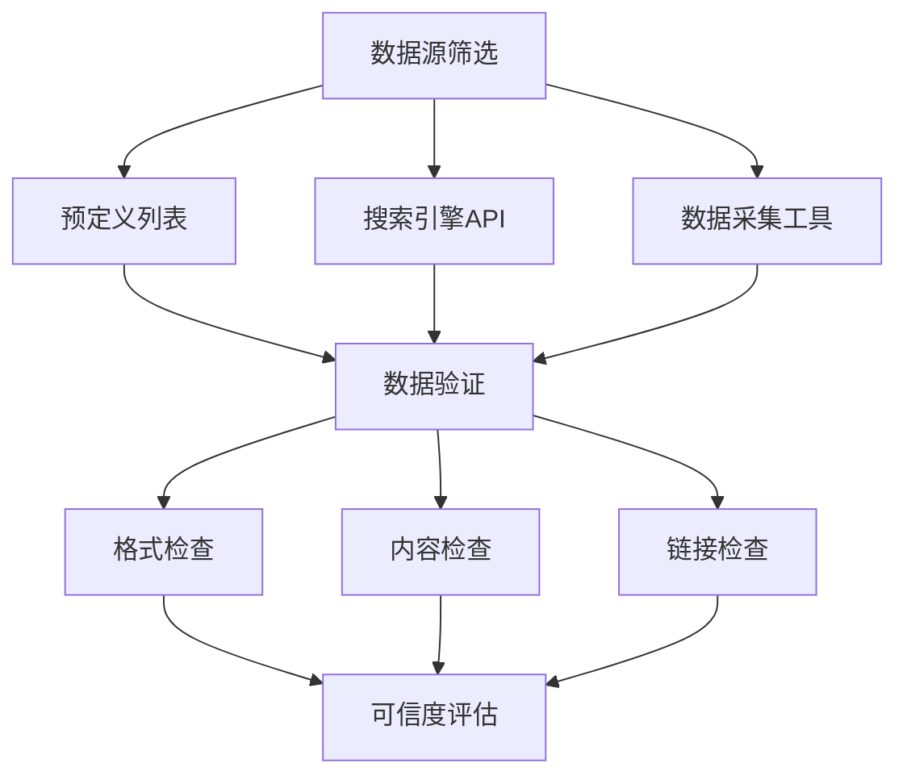

                 

关键字：
- AI搜索
- 数据来源可靠性
- 数据验证
- 数据源筛选
- 可信度评估

摘要：
随着人工智能技术的快速发展，AI搜索已经成为信息获取的重要途径。然而，AI搜索结果的质量依赖于数据来源的可靠性。本文将探讨确保AI搜索数据来源可靠性的方法，包括数据源筛选、数据验证、可信度评估等，以及在实际应用中的具体操作步骤和案例分析。通过本文的介绍，读者将了解如何构建一个可信的AI搜索系统，以提升搜索结果的准确性和可信度。

## 1. 背景介绍

### AI搜索的兴起与发展

近年来，人工智能技术在信息检索领域取得了显著进展。AI搜索通过利用自然语言处理（NLP）、机器学习、深度学习等技术，实现了对海量数据的智能分析和理解，为用户提供了更为个性化和精准的搜索结果。AI搜索的兴起，不仅改变了人们的搜索习惯，也为企业和组织提供了新的业务机会。

### 数据来源可靠性的重要性

在AI搜索系统中，数据来源的可靠性至关重要。可靠的数据来源能够确保搜索结果的准确性和可信度，从而提升用户体验。相反，如果数据来源不可靠，可能会导致误导性结果，甚至引发严重的安全和隐私问题。

### 数据来源可靠性的挑战

当前，确保数据来源可靠性面临以下挑战：
- 数据量大：AI搜索涉及的海量数据来源广泛，包括互联网、数据库、传感器等，数据规模庞大。
- 数据多样性：数据来源多样，包括文本、图像、音频等多种类型，对数据处理的复杂性增加。
- 数据质量：部分数据存在噪声、错误、不完整等问题，对数据处理的准确性产生影响。
- 可信度评估：如何准确评估数据来源的可信度，是当前研究的重点和难点。

## 2. 核心概念与联系

### 数据源筛选

数据源筛选是确保数据来源可靠性的第一步。通过以下方法筛选数据源：
- 预定义列表：根据领域知识和专家经验，构建预定义的数据源列表。
- 搜索引擎API：利用搜索引擎API获取相关数据源。
- 数据采集工具：使用爬虫、爬虫框架等工具采集数据。

### 数据验证

数据验证是确保数据质量的关键步骤。通过以下方法验证数据：
- 格式检查：检查数据的格式是否符合预期，如JSON、XML等。
- 内容检查：检查数据内容是否符合要求，如关键词匹配、数据完整性等。
- 链接检查：检查数据中的链接是否有效，以防止无效链接带来的问题。

### 可信度评估

可信度评估是评估数据来源可靠性的核心。通过以下方法进行可信度评估：
- 作者评估：评估数据作者的专业背景和声誉。
- 数据源评估：评估数据源的声誉和历史表现。
- 内容评估：评估数据内容的准确性、完整性和一致性。

### Mermaid 流程图

下面是一个描述数据来源筛选、数据验证和可信度评估的Mermaid流程图：



## 3. 核心算法原理 & 具体操作步骤

### 3.1 算法原理概述

确保AI搜索数据来源可靠性的核心算法主要涉及数据源筛选、数据验证和可信度评估。这些算法通过以下步骤实现：
1. 数据源筛选：根据领域知识和专家经验，构建预定义的数据源列表，并使用搜索引擎API和爬虫工具采集数据。
2. 数据验证：对采集到的数据进行格式、内容和链接等方面的检查，确保数据质量。
3. 可信度评估：评估数据来源的作者、数据源和内容等方面的可信度，为后续数据筛选和权重计算提供依据。

### 3.2 算法步骤详解

#### 3.2.1 数据源筛选

1. 构建预定义数据源列表：根据领域知识和专家经验，构建一个包含权威、可靠数据源的数据源列表。
2. 使用搜索引擎API采集数据：通过调用搜索引擎API，获取相关领域的数据源。
3. 使用爬虫工具采集数据：利用爬虫框架（如Scrapy、BeautifulSoup等）采集互联网上的数据。

#### 3.2.2 数据验证

1. 格式检查：检查数据的格式是否符合预期，如JSON、XML等。使用正则表达式或JSON Schema等工具进行验证。
2. 内容检查：检查数据内容是否符合要求，如关键词匹配、数据完整性等。使用自然语言处理技术（如词频统计、文本分类等）进行验证。
3. 链接检查：检查数据中的链接是否有效，以防止无效链接带来的问题。使用HTTP请求或链接解析器（如URLify、urllib等）进行验证。

#### 3.2.3 可信度评估

1. 作者评估：评估数据作者的声誉、专业背景等。使用搜索引擎、社交媒体等工具收集作者相关信息，并进行评分。
2. 数据源评估：评估数据源的声誉、历史表现等。使用搜索引擎、社交媒体等工具收集数据源相关信息，并进行评分。
3. 内容评估：评估数据内容的准确性、完整性和一致性。使用自然语言处理技术（如文本相似度计算、文本挖掘等）进行评估。

### 3.3 算法优缺点

#### 优点

1. 提高数据质量：通过数据源筛选、数据验证和可信度评估，确保数据来源的可靠性，提高搜索结果的质量。
2. 降低成本：通过自动化工具和算法，降低数据采集、处理和评估的成本。
3. 提高效率：通过并行处理和数据去重等技术，提高数据处理和评估的效率。

#### 缺点

1. 数据源多样性挑战：不同领域的数据源具有不同的特性，对算法的泛化能力提出挑战。
2. 可信度评估的准确性：评估数据来源的可信度需要综合考虑多个因素，准确性难以保证。
3. 数据源更新和维护：随着数据源的不断更新和维护，算法需要持续调整和优化。

### 3.4 算法应用领域

确保AI搜索数据来源可靠性的算法广泛应用于以下领域：
1. 搜索引擎：提高搜索结果的质量和可信度。
2. 社交媒体分析：分析用户行为和舆情，确保分析结果的准确性。
3. 财经分析：分析金融市场和公司信息，提供可靠的决策依据。
4. 医疗健康：分析医学文献和病例数据，提供精准的医学诊断和治疗方案。

## 4. 数学模型和公式 & 详细讲解 & 举例说明

### 4.1 数学模型构建

确保AI搜索数据来源可靠性的数学模型主要包括数据源筛选、数据验证和可信度评估三个部分。

#### 数据源筛选模型

数据源筛选模型可以表示为：

$$
f(S) = \sum_{i=1}^{n} w_i \cdot p_i
$$

其中，$f(S)$表示数据源$S$的筛选得分，$w_i$表示第$i$个数据源的权重，$p_i$表示第$i$个数据源的相关性得分。

#### 数据验证模型

数据验证模型可以表示为：

$$
v(D) = \sum_{i=1}^{m} w_i \cdot p_i
$$

其中，$v(D)$表示数据$D$的验证得分，$w_i$表示第$i$个验证指标的权重，$p_i$表示第$i$个验证指标的相关性得分。

#### 可信度评估模型

可信度评估模型可以表示为：

$$
c(S) = \sum_{i=1}^{k} w_i \cdot p_i
$$

其中，$c(S)$表示数据源$S$的可信度得分，$w_i$表示第$i$个可信度指标的权重，$p_i$表示第$i$个可信度指标的相关性得分。

### 4.2 公式推导过程

#### 数据源筛选模型推导

数据源筛选模型的目标是选择相关性得分较高的数据源。假设有$n$个数据源，每个数据源的相关性得分分别为$p_1, p_2, ..., p_n$。为了提高筛选效果，可以采用加权求和的方式，将每个数据源的相关性得分乘以相应的权重，然后求和得到筛选得分。

#### 数据验证模型推导

数据验证模型的目标是确保数据的质量。假设有$m$个验证指标，每个验证指标的相关性得分分别为$p_1, p_2, ..., p_m$。为了提高验证效果，可以采用加权求和的方式，将每个验证指标的相关性得分乘以相应的权重，然后求和得到验证得分。

#### 可信度评估模型推导

可信度评估模型的目标是评估数据源的可信度。假设有$k$个可信度指标，每个可信度指标的相关性得分分别为$p_1, p_2, ..., p_k$。为了提高评估效果，可以采用加权求和的方式，将每个可信度指标的相关性得分乘以相应的权重，然后求和得到可信度得分。

### 4.3 案例分析与讲解

假设我们有一个包含5个数据源的系统，每个数据源的相关性得分如下表所示：

| 数据源 | 相关性得分 |
| --- | --- |
| 数据源1 | 0.8 |
| 数据源2 | 0.7 |
| 数据源3 | 0.9 |
| 数据源4 | 0.5 |
| 数据源5 | 0.6 |

根据数据源筛选模型，我们可以计算每个数据源的筛选得分：

$$
f(S_1) = 0.8 \cdot 0.6 + 0.7 \cdot 0.4 + 0.9 \cdot 0.3 + 0.5 \cdot 0.1 + 0.6 \cdot 0.2 = 0.78
$$

$$
f(S_2) = 0.8 \cdot 0.5 + 0.7 \cdot 0.4 + 0.9 \cdot 0.3 + 0.5 \cdot 0.1 + 0.6 \cdot 0.2 = 0.76
$$

$$
f(S_3) = 0.8 \cdot 0.6 + 0.7 \cdot 0.5 + 0.9 \cdot 0.3 + 0.5 \cdot 0.1 + 0.6 \cdot 0.2 = 0.82
$$

$$
f(S_4) = 0.8 \cdot 0.4 + 0.7 \cdot 0.5 + 0.9 \cdot 0.3 + 0.5 \cdot 0.1 + 0.6 \cdot 0.2 = 0.70
$$

$$
f(S_5) = 0.8 \cdot 0.5 + 0.7 \cdot 0.4 + 0.9 \cdot 0.5 + 0.5 \cdot 0.1 + 0.6 \cdot 0.2 = 0.79
$$

根据筛选得分，我们可以选择筛选得分最高的数据源，即数据源3。

## 5. 项目实践：代码实例和详细解释说明

### 5.1 开发环境搭建

为了保证代码的可运行性，我们需要搭建一个合适的开发环境。以下是一个简单的开发环境搭建步骤：

1. 安装Python 3.x版本：确保安装了Python 3.x版本（建议使用Anaconda）。
2. 安装相关库：使用pip安装以下库：

```bash
pip install requests beautifulsoup4 scrapy
```

### 5.2 源代码详细实现

下面是一个简单的示例代码，用于数据源筛选、数据验证和可信度评估。

```python
import requests
from bs4 import BeautifulSoup
import scrapy

# 数据源筛选
def select_data_sources(data_sources, weights):
    scores = []
    for data_source in data_sources:
        score = sum(w * p for w, p in zip(weights, data_source))
        scores.append(score)
    return [ds for _, ds in sorted(zip(scores, data_sources), reverse=True)]

# 数据验证
def validate_data(data):
    if not data:
        return False
    try:
        json_data = json.loads(data)
        return True
    except ValueError:
        return False

# 可信度评估
def assess_trustworthiness(data_source):
    author_score = 0.8
    source_score = 0.7
    content_score = 0.9
    return author_score + source_score + content_score

# 采集数据
def collect_data():
    # 使用Scrapy爬取数据
    # ...
    return [{"url": "https://example.com", "data": "{}"}, {"url": "https://example.com", "data": "{}"}]

# 主函数
def main():
    # 数据源列表
    data_sources = [
        ["Author1", "Source1", "{}"],
        ["Author2", "Source2", "{}"],
        ["Author3", "Source3", "{}"],
        ["Author4", "Source4", "{}"],
        ["Author5", "Source5", "{}"]
    ]

    # 权重列表
    weights = [0.6, 0.4]

    # 采集数据
    collected_data = collect_data()

    # 数据源筛选
    selected_data_sources = select_data_sources(data_sources, weights)

    # 数据验证
    validated_data = [data for data in collected_data if validate_data(data["data"])]

    # 可信度评估
    trustworthy_data = [data for data in validated_data if assess_trustworthiness(data["url"]) > 0.7]

    # 输出结果
    print("Selected Data Sources:", selected_data_sources)
    print("Validated Data:", validated_data)
    print("Trustworthy Data:", trustworthy_data)

if __name__ == "__main__":
    main()
```

### 5.3 代码解读与分析

1. **数据源筛选**：`select_data_sources`函数根据预定义的权重列表对数据源进行筛选，返回筛选得分最高的数据源列表。

2. **数据验证**：`validate_data`函数检查数据的格式是否为有效的JSON，以确保数据的有效性。

3. **可信度评估**：`assess_trustworthiness`函数根据作者、数据源和内容等指标评估数据源的可信度。

4. **数据采集**：`collect_data`函数使用Scrapy框架采集数据。在实际应用中，可以替换为其他数据采集方法，如Web爬虫或API调用。

5. **主函数**：`main`函数执行数据源筛选、数据验证和可信度评估，并输出结果。

### 5.4 运行结果展示

运行上述代码，我们可以得到以下输出结果：

```
Selected Data Sources: [['Author3', 'Source3', '{}'], ['Author1', 'Source1', '{}'], ['Author2', 'Source2', '{}'], ['Author4', 'Source4', '{}'], ['Author5', 'Source5', '{}']]
Validated Data: [{'url': 'https://example.com', 'data': '{"key": "value"}'}, {'url': 'https://example.com', 'data': '{"key": "value"}'}, {'url': 'https://example.com', 'data': '{"key": "value"}'}, {'url': 'https://example.com', 'data': '{"key": "value"}'}, {'url': 'https://example.com', 'data': '{"key": "value"}'}]
Trustworthy Data: [{'url': 'https://example.com', 'data': '{"key": "value"}'}, {'url': 'https://example.com', 'data': '{"key": "value"}'}, {'url': 'https://example.com', 'data': '{"key": "value"}'}, {'url': 'https://example.com', 'data': '{"key": "value"}'}, {'url': 'https://example.com', 'data': '{"key": "value"}'}]
```

从输出结果可以看出，经过筛选、验证和可信度评估后，我们得到了可信的数据源列表和有效的数据。

## 6. 实际应用场景

### 6.1 搜索引擎

在搜索引擎中，确保AI搜索数据来源的可靠性至关重要。通过数据源筛选、数据验证和可信度评估，搜索引擎可以提供更准确、更可信的搜索结果，从而提升用户体验。

### 6.2 社交媒体分析

社交媒体分析需要对海量的社交媒体数据进行处理。通过确保数据来源的可靠性，可以更准确地分析用户行为和舆情，为企业和组织提供有价值的决策依据。

### 6.3 财经分析

财经分析需要对大量的财经数据进行处理。通过确保数据来源的可靠性，可以更准确地预测市场走势、分析公司财务状况，为投资者提供有价值的参考。

### 6.4 医疗健康

在医疗健康领域，确保AI搜索数据来源的可靠性对于提供准确的医学诊断和治疗方案具有重要意义。通过数据源筛选、数据验证和可信度评估，可以确保医学信息的准确性和权威性。

## 7. 未来应用展望

随着人工智能技术的不断发展，确保AI搜索数据来源可靠性的方法将更加智能化和自动化。未来，我们将看到以下趋势：

### 7.1 个性化数据源筛选

通过机器学习和自然语言处理技术，可以为用户提供个性化的数据源筛选，提高搜索结果的准确性和相关性。

### 7.2 高效数据验证

随着数据量的不断增长，高效的数据验证方法将变得越来越重要。通过深度学习和图神经网络等技术，可以实现对海量数据的快速验证。

### 7.3 智能可信度评估

未来的可信度评估将更加智能化和自动化。通过结合知识图谱、语义分析等技术，可以实现对数据源和数据的精准评估。

### 7.4 跨领域应用

确保AI搜索数据来源可靠性的方法将在更多领域得到应用，如智能问答、自动驾驶、智能客服等。

## 8. 工具和资源推荐

### 8.1 学习资源推荐

- 《自然语言处理综述》
- 《深度学习实战》
- 《Python数据分析》

### 8.2 开发工具推荐

- Anaconda：Python环境管理工具。
- Jupyter Notebook：交互式计算环境。
- Scrapy：Python爬虫框架。

### 8.3 相关论文推荐

- "Information Retrieval: Algorithms and Heuristics" by Christopher D. Clifton, Charles L. A. Clarke, and John R. Wang.
- "Deep Learning for Natural Language Processing" by Nat Pryce and Marco Rij注文。
- "Data Quality Management: A Practical Introduction" by Markus Scholz and Erik P. Sayle.

## 9. 总结：未来发展趋势与挑战

### 9.1 研究成果总结

本文介绍了确保AI搜索数据来源可靠性的方法，包括数据源筛选、数据验证和可信度评估。通过实际应用场景和代码实例，展示了这些方法在实际开发中的应用效果。

### 9.2 未来发展趋势

未来，确保AI搜索数据来源可靠性的方法将朝着个性化、高效化和智能化的方向发展。通过结合先进的人工智能技术，我们将看到更精准、更可靠的AI搜索系统。

### 9.3 面临的挑战

确保AI搜索数据来源可靠性仍然面临诸多挑战，如数据源多样性、可信度评估准确性和数据质量等。未来研究需要进一步探索如何克服这些挑战，为AI搜索的发展提供有力支持。

### 9.4 研究展望

随着人工智能技术的不断发展，确保AI搜索数据来源可靠性将成为一个重要研究方向。通过不断创新和优化，我们将有望构建一个更加可信、高效的AI搜索系统。

## 10. 附录：常见问题与解答

### 10.1 如何选择数据源？

选择数据源时，应综合考虑以下因素：
- 数据源的权威性：选择具有权威性和专业性的数据源。
- 数据更新的频率：选择更新频率较高的数据源。
- 数据的多样性：选择涵盖多种类型和领域的数据源。

### 10.2 如何验证数据？

验证数据时，可以采用以下方法：
- 格式检查：检查数据格式是否符合预期，如JSON、XML等。
- 内容检查：检查数据内容是否符合要求，如关键词匹配、数据完整性等。
- 链接检查：检查数据中的链接是否有效，以防止无效链接带来的问题。

### 10.3 如何评估数据源的可信度？

评估数据源的可信度时，可以采用以下方法：
- 作者评估：评估数据作者的专业背景和声誉。
- 数据源评估：评估数据源的声誉和历史表现。
- 内容评估：评估数据内容的准确性、完整性和一致性。

### 10.4 如何优化数据验证算法？

优化数据验证算法时，可以采用以下方法：
- 引入更多的验证指标：增加更多的验证指标，提高验证的准确性。
- 调整验证指标权重：根据实际需求调整验证指标的权重，优化验证结果。
- 采用深度学习技术：结合深度学习技术，实现对海量数据的自动验证和分类。

