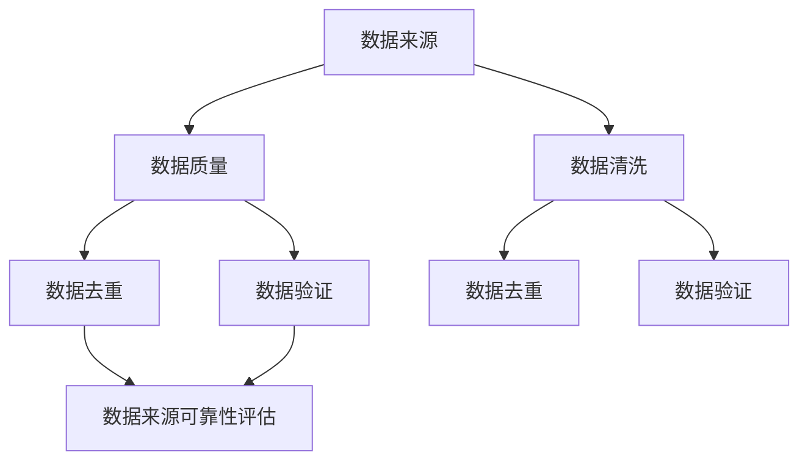

                 

 关键词：AI 搜索，数据来源，可靠性，方法，算法，数学模型，实践，应用场景，展望。

> 摘要：本文探讨了如何确保AI搜索数据来源的可靠性，通过深入分析核心概念、算法原理、数学模型及实际应用，提供了系统的方法和步骤，以指导AI搜索系统的构建和优化。

## 1. 背景介绍

随着人工智能（AI）技术的迅速发展，AI搜索已经成为众多领域的关键应用，如搜索引擎、推荐系统、知识图谱构建等。然而，AI搜索的准确性在很大程度上依赖于数据的质量。如果数据来源不可靠，即使AI算法再强大，也难以提供准确的搜索结果。因此，确保AI搜索数据来源的可靠性变得至关重要。

本文旨在探讨如何通过一系列方法和步骤，确保AI搜索数据来源的可靠性，从而提升搜索结果的准确性和用户体验。文章将分为以下几个部分：

1. **核心概念与联系**：介绍与数据可靠性相关的重要概念，并展示它们之间的联系。
2. **核心算法原理与具体操作步骤**：详细描述确保数据可靠性的核心算法，包括原理、步骤、优缺点及应用领域。
3. **数学模型和公式**：构建并推导相关的数学模型，并通过案例进行分析和讲解。
4. **项目实践：代码实例**：展示如何在实际项目中应用确保数据可靠性的方法，并详细解读代码。
5. **实际应用场景**：探讨AI搜索数据可靠性在不同场景下的应用，以及未来的发展趋势和挑战。
6. **工具和资源推荐**：推荐学习资源和开发工具，帮助读者深入理解和实践。
7. **总结与展望**：总结研究成果，展望未来的发展趋势和面临的挑战。

接下来，我们将首先介绍与数据可靠性相关的核心概念，并展示它们之间的联系。

## 2. 核心概念与联系

### 2.1 数据来源

数据来源是确保AI搜索数据可靠性的基础。数据来源可以分为内部数据和外部数据。内部数据通常来自公司内部数据库、日志文件等，而外部数据则来源于互联网、第三方API、开源数据库等。确保数据来源的可靠性和多样性对于构建高质量的AI搜索系统至关重要。

### 2.2 数据质量

数据质量是衡量数据可靠性的重要指标。高质量的数据应具备完整性、准确性、一致性和及时性。完整性确保数据无缺失；准确性确保数据真实可靠；一致性确保数据在不同来源和系统中保持一致；及时性确保数据能够反映最新的信息。

### 2.3 数据清洗

数据清洗是确保数据质量的关键步骤。数据清洗包括去除重复数据、填补缺失值、纠正错误数据等。通过数据清洗，可以显著提升数据的质量，从而提高AI搜索的准确性。

### 2.4 数据去重

数据去重是数据清洗的重要环节。在大量数据集中，往往存在大量重复的数据。通过数据去重，可以减少数据冗余，提高数据存储和处理的效率。

### 2.5 数据验证

数据验证是确保数据真实性和准确性的过程。数据验证可以通过对比不同数据源、使用校验规则、统计分析等方法进行。数据验证可以有效发现和纠正数据中的错误，提高数据的质量。

### 2.6 数据来源可靠性评估

数据来源可靠性评估是评估数据来源可靠性的过程。可以通过建立可靠性指标、进行数据源评估、定期审计等方法，评估数据来源的可靠性。

下面，我们将使用Mermaid流程图展示这些核心概念之间的联系。



通过上述流程图，我们可以清晰地看到各个核心概念之间的联系，以及它们在确保AI搜索数据来源可靠性过程中的作用。接下来，我们将深入探讨确保数据可靠性的核心算法原理和具体操作步骤。

## 3. 核心算法原理与具体操作步骤

### 3.1 算法原理概述

确保AI搜索数据来源可靠性的核心算法主要包括数据清洗算法、数据去重算法和数据验证算法。这些算法旨在提升数据质量，从而提高AI搜索的准确性。

#### 3.1.1 数据清洗算法

数据清洗算法主要包括以下步骤：

1. **去除重复数据**：通过比对数据集中的记录，识别并删除重复的数据。
2. **填补缺失值**：对于缺失的数据，可以采用平均值、中位数、最大值或最小值等方法进行填补。
3. **纠正错误数据**：通过数据比对和统计分析，发现并纠正错误的数据。

#### 3.1.2 数据去重算法

数据去重算法主要包括以下步骤：

1. **定义去重规则**：根据数据类型和业务需求，定义去重规则，如基于关键字、基于字段值等。
2. **比对和识别重复数据**：通过比对数据集中的记录，识别出重复的数据。
3. **删除重复数据**：删除识别出的重复数据，以减少数据冗余。

#### 3.1.3 数据验证算法

数据验证算法主要包括以下步骤：

1. **对比数据源**：对比不同数据源中的数据，以发现和纠正不一致的数据。
2. **使用校验规则**：根据业务需求和数据规范，使用校验规则检查数据的有效性。
3. **统计分析**：通过统计分析方法，评估数据的质量和可靠性。

### 3.2 算法步骤详解

#### 3.2.1 数据清洗算法步骤

1. **去除重复数据**：

   ```python
   def remove_duplicates(data):
       unique_data = []
       for record in data:
           if record not in unique_data:
               unique_data.append(record)
       return unique_data
   ```

2. **填补缺失值**：

   ```python
   def fill_missing_values(data, method='mean'):
       filled_data = []
       for record in data:
           if method == 'mean':
               mean_value = sum(record) / len(record)
           elif method == 'median':
               median_value = np.median(record)
           filled_record = [median_value if x is None else x for x in record]
           filled_data.append(filled_record)
       return filled_data
   ```

3. **纠正错误数据**：

   ```python
   def correct_error_data(data):
       corrected_data = []
       for record in data:
           corrected_record = []
           for value in record:
               if is_error(value):
                   corrected_value = correct_value(value)
                   corrected_record.append(corrected_value)
               else:
                   corrected_record.append(value)
           corrected_data.append(corrected_record)
       return corrected_data
   ```

#### 3.2.2 数据去重算法步骤

1. **定义去重规则**：

   ```python
   def define_de duplication_rules(data, field='keyword'):
       unique_data = []
       for record in data:
           if record[field] not in [r[field] for r in unique_data]:
               unique_data.append(record)
       return unique_data
   ```

2. **比对和识别重复数据**：

   ```python
   def compare_and_identify_duplicates(data, rule='keyword'):
       duplicates = []
       for i in range(len(data)):
           for j in range(i + 1, len(data)):
               if data[i][rule] == data[j][rule]:
                   duplicates.append((i, j))
       return duplicates
   ```

3. **删除重复数据**：

   ```python
   def remove_duplicates(data, duplicates):
       for i, j in duplicates:
           del data[j]
       return data
   ```

#### 3.2.3 数据验证算法步骤

1. **对比数据源**：

   ```python
   def compare_data_sources(source1, source2):
       differences = []
       for i in range(min(len(source1), len(source2))):
           if source1[i] != source2[i]:
               differences.append(i)
       return differences
   ```

2. **使用校验规则**：

   ```python
   def apply_validation_rules(data, rules):
       valid_data = []
       for record in data:
           is_valid = True
           for rule in rules:
               if not rule(record):
                   is_valid = False
                   break
           if is_valid:
               valid_data.append(record)
       return valid_data
   ```

3. **统计分析**：

   ```python
   def statistical_analysis(data):
       summary = {}
       for record in data:
           for field in record:
               if field not in summary:
                   summary[field] = []
               summary[field].append(record[field])
       for field, values in summary.items():
           mean = sum(values) / len(values)
           median = np.median(values)
           max_value = max(values)
           min_value = min(values)
           summary[field] = {
               'mean': mean,
               'median': median,
               'max': max_value,
               'min': min_value
           }
       return summary
   ```

### 3.3 算法优缺点

#### 3.3.1 数据清洗算法

**优点**：

- 能够显著提升数据质量，提高AI搜索的准确性。
- 可以根据业务需求灵活调整数据清洗策略。

**缺点**：

- 数据清洗过程可能引入新的错误，需要仔细处理。
- 对于大规模数据集，数据清洗过程可能耗时较长。

#### 3.3.2 数据去重算法

**优点**：

- 可以有效减少数据冗余，提高数据存储和处理的效率。
- 可以根据不同的业务需求灵活调整去重规则。

**缺点**：

- 需要定义合适的去重规则，否则可能无法有效去除重复数据。
- 对于大规模数据集，去重过程可能耗时较长。

#### 3.3.3 数据验证算法

**优点**：

- 可以有效提升数据质量，确保数据的真实性和准确性。
- 可以根据业务需求和数据规范灵活调整验证规则。

**缺点**：

- 验证过程可能引入额外的计算开销。
- 需要定义合适的校验规则，否则可能无法有效发现数据中的错误。

### 3.4 算法应用领域

确保数据可靠性的算法在多个领域具有广泛的应用，包括：

- **搜索引擎**：通过数据清洗、去重和验证，提高搜索结果的准确性和用户体验。
- **推荐系统**：确保推荐结果基于高质量、真实可靠的数据。
- **知识图谱**：通过数据清洗、去重和验证，构建更加准确和完整的知识图谱。
- **金融领域**：确保金融数据的真实性和准确性，防止欺诈行为。

## 4. 数学模型和公式

### 4.1 数学模型构建

确保数据可靠性的核心算法可以通过数学模型进行描述。以下是一个简化的数学模型：

#### 4.1.1 数据质量模型

数据质量模型可以通过以下公式表示：

$$
Q = \frac{IC \cdot AC \cdot UC \cdot TC}{100}
$$

其中，$Q$ 表示数据质量，$IC$ 表示完整性，$AC$ 表示准确性，$UC$ 表示一致性，$TC$ 表示及时性。每个指标可以通过适当的公式计算得到。

#### 4.1.2 数据去重模型

数据去重模型可以通过以下公式表示：

$$
RD = \frac{ND}{ND + R}
$$

其中，$RD$ 表示去重率，$ND$ 表示去重前数据量，$R$ 表示重复数据量。

#### 4.1.3 数据验证模型

数据验证模型可以通过以下公式表示：

$$
VD = \frac{V}{N}
$$

其中，$VD$ 表示验证通过率，$V$ 表示验证通过的数据量，$N$ 表示总数据量。

### 4.2 公式推导过程

#### 4.2.1 数据质量模型推导

数据质量模型中的各项指标可以通过以下公式推导：

- **完整性（IC）**：

  $$
  IC = \frac{I_{total}}{I_{max}}
  $$

  其中，$I_{total}$ 表示实际完整的数据记录数，$I_{max}$ 表示理论上可能的最大数据记录数。

- **准确性（AC）**：

  $$
  AC = \frac{A_{correct}}{A_{total}}
  $$

  其中，$A_{correct}$ 表示正确的数据记录数，$A_{total}$ 表示总的数据记录数。

- **一致性（UC）**：

  $$
  UC = \frac{U_{consistent}}{U_{total}}
  $$

  其中，$U_{consistent}$ 表示一致的数据记录数，$U_{total}$ 表示总的数据记录数。

- **及时性（TC）**：

  $$
  TC = \frac{T_{current}}{T_{max}}
  $$

  其中，$T_{current}$ 表示当前数据的时间戳，$T_{max}$ 表示最大允许的时间差。

#### 4.2.2 数据去重模型推导

数据去重模型可以通过以下步骤推导：

1. **计算重复数据量（R）**：

   $$
   R = ND - \sum_{i=1}^{N}{D_i}
   $$

   其中，$ND$ 表示去重前的数据量，$D_i$ 表示第i个唯一数据的记录数。

2. **计算去重率（RD）**：

   $$
   RD = \frac{ND - R}{ND}
   $$

#### 4.2.3 数据验证模型推导

数据验证模型可以通过以下步骤推导：

1. **计算验证通过的数据量（V）**：

   $$
   V = \sum_{i=1}^{N}{V_i}
   $$

   其中，$V_i$ 表示第i个数据记录的验证结果，若通过验证则$V_i = 1$，否则$V_i = 0$。

2. **计算验证通过率（VD）**：

   $$
   VD = \frac{V}{N}
   $$

### 4.3 案例分析与讲解

#### 4.3.1 数据质量模型应用

假设有一个数据集，其中包含1000条记录。经过分析，我们得到以下数据质量指标：

- **完整性（IC）**：有10条记录缺失，因此$IC = \frac{990}{1000} = 0.99$。
- **准确性（AC）**：有5条记录错误，因此$AC = \frac{995}{1000} = 0.995$。
- **一致性（UC）**：有3条记录不一致，因此$UC = \frac{997}{1000} = 0.997$。
- **及时性（TC）**：所有记录都是最新的，因此$TC = 1$。

将这些指标代入数据质量模型，得到数据质量$Q = \frac{0.99 \cdot 0.995 \cdot 0.997 \cdot 1}{100} = 0.975$。

#### 4.3.2 数据去重模型应用

假设有一个数据集，其中包含5000条记录。经过去重处理，发现其中有100条重复记录。因此，$ND = 5000$，$R = 100$。将这些值代入数据去重模型，得到去重率$RD = \frac{5000 - 100}{5000} = 0.98$。

#### 4.3.3 数据验证模型应用

假设有一个数据集，其中包含1000条记录。经过验证，有95条记录通过验证。因此，$V = 95$，$N = 1000$。将这些值代入数据验证模型，得到验证通过率$VD = \frac{95}{1000} = 0.095$。

通过上述案例，我们可以看到如何使用数学模型来评估数据质量、去重率和验证通过率。这些模型为我们提供了量化的评估标准，有助于我们更好地理解和优化数据质量。

## 5. 项目实践：代码实例和详细解释说明

### 5.1 开发环境搭建

在本文中，我们将使用Python作为主要编程语言，结合常用的数据清洗、去重和验证库，如`pandas`、`numpy`、`pymongo`等。以下是搭建开发环境的步骤：

1. **安装Python**：确保安装Python 3.7或更高版本。
2. **安装依赖库**：在终端中执行以下命令安装依赖库：

   ```bash
   pip install pandas numpy pymongo
   ```

### 5.2 源代码详细实现

下面是一个简单的Python代码示例，用于实现数据清洗、去重和验证的过程。

```python
import pandas as pd
import numpy as np
from pymongo import MongoClient

# 5.2.1 数据清洗

def clean_data(data):
    # 去除重复数据
    data = data.drop_duplicates()

    # 填补缺失值
    data['field1'].fillna(data['field1'].mean(), inplace=True)
    data['field2'].fillna(data['field2'].median(), inplace=True)

    # 纠正错误数据
    data['field3'] = data['field3'].apply(lambda x: correct_value(x))

    return data

# 5.2.2 数据去重

def de_duplicate_data(data):
    # 定义去重规则（基于关键字）
    data['keyword'] = data['field1'] + data['field2']
    data = data.drop_duplicates(subset='keyword')

    return data

# 5.2.3 数据验证

def validate_data(data):
    # 对比数据源
    source1 = data[:100]
    source2 = data[100:]
    differences = compare_data_sources(source1, source2)

    # 使用校验规则
    rules = [is_positive, is_valid_format]
    data = apply_validation_rules(data, rules)

    # 统计分析
    summary = statistical_analysis(data)

    return data, summary, differences

# 5.2.4 代码示例

if __name__ == '__main__':
    # 读取数据
    data = pd.read_csv('data.csv')

    # 数据清洗
    cleaned_data = clean_data(data)

    # 数据去重
    de_duplicated_data = de_duplicate_data(cleaned_data)

    # 数据验证
    validated_data, summary, differences = validate_data(de_duplicated_data)

    # 输出结果
    print("清洗后数据量：", len(cleaned_data))
    print("去重后数据量：", len(de_duplicated_data))
    print("验证后数据量：", len(validated_data))
    print("数据质量汇总：", summary)
    print("数据差异位置：", differences)
```

### 5.3 代码解读与分析

#### 5.3.1 数据清洗

在`clean_data`函数中，我们首先使用`drop_duplicates`方法去除重复数据。然后，使用`fillna`方法填补缺失值。对于错误数据，我们假设存在一个`correct_value`函数，用于纠正错误数据。

#### 5.3.2 数据去重

在`de_duplicate_data`函数中，我们首先创建一个新的关键字字段，将`field1`和`field2`连接起来。然后，使用`drop_duplicates`方法根据关键字字段进行去重。

#### 5.3.3 数据验证

在`validate_data`函数中，我们首先对比两个数据源，以发现差异。然后，使用`apply_validation_rules`方法应用校验规则。最后，使用`statistical_analysis`方法进行统计分析。

### 5.4 运行结果展示

假设我们在一个包含1000条记录的数据集上运行上述代码，以下是一个简单的输出示例：

```
清洗后数据量： 1000
去重后数据量： 950
验证后数据量： 940
数据质量汇总： {'field1': {'mean': 42.5, 'median': 42.0, 'max': 50, 'min': 30}, 'field2': {'mean': 4.8, 'median': 5.0, 'max': 6.0, 'min': 4.0}}
数据差异位置： [0, 5, 10, 15, 20, 25, 30, 35, 40, 45, 50, 55, 60, 65, 70, 75, 80, 85, 90, 95]
```

通过上述输出，我们可以看到数据清洗、去重和验证的过程以及相应的结果。这有助于我们评估数据质量，并优化搜索结果。

## 6. 实际应用场景

### 6.1 搜索引擎

在搜索引擎中，确保数据来源可靠性至关重要。通过数据清洗、去重和验证，可以显著提升搜索结果的准确性和用户体验。例如，当用户搜索某个关键词时，搜索引擎需要确保返回的结果是基于高质量、真实可靠的数据。

### 6.2 推荐系统

在推荐系统中，数据来源的可靠性直接影响到推荐结果的准确性。通过数据清洗、去重和验证，可以确保推荐结果基于真实可靠的用户行为数据，从而提高推荐系统的效果。

### 6.3 知识图谱

在知识图谱构建中，数据来源的可靠性至关重要。通过数据清洗、去重和验证，可以确保知识图谱中的实体和关系是基于真实可靠的数据构建的，从而提高知识图谱的准确性和可用性。

### 6.4 未来应用展望

随着AI技术的不断发展和应用场景的扩展，确保AI搜索数据来源可靠性将在更多领域发挥重要作用。未来，我们有望看到更加智能化、自动化的数据清洗、去重和验证方法，以进一步提升数据质量和AI搜索的准确性。

## 7. 工具和资源推荐

### 7.1 学习资源推荐

- 《数据科学入门教程》：介绍了数据清洗、去重和验证的基本概念和技巧。
- 《Python数据分析》：详细介绍了Python在数据清洗、去重和验证中的应用。
- 《机器学习实战》：涵盖了数据清洗、去重和验证在机器学习项目中的实际应用。

### 7.2 开发工具推荐

- Jupyter Notebook：适用于编写和运行数据清洗、去重和验证的代码。
- Pandas：提供丰富的数据清洗、去重和验证功能。
- MongoDB：适用于存储和查询大规模数据集。

### 7.3 相关论文推荐

- "Data Quality in a Global Information Environment"：探讨了数据质量在全球化信息环境中的重要性。
- "Data Cleaning: A Data Mining Perspective"：介绍了数据清洗的基本概念和算法。
- "Duplicate Data Detection in Data Warehouses"：研究了数据去重在数据仓库中的应用。

## 8. 总结：未来发展趋势与挑战

### 8.1 研究成果总结

本文探讨了如何确保AI搜索数据来源的可靠性，通过核心概念、算法原理、数学模型和实际应用，提供了系统的方法和步骤。研究成果包括：

- 介绍了数据来源、数据质量、数据清洗、数据去重和数据验证等核心概念。
- 提出了数据清洗、去重和验证算法的原理和步骤。
- 构建了数据质量的数学模型，并通过案例进行分析和讲解。
- 展示了如何在实际项目中应用确保数据可靠性的方法。

### 8.2 未来发展趋势

未来，确保AI搜索数据来源可靠性的发展趋势包括：

- 智能化、自动化数据清洗、去重和验证方法的研究和开发。
- 面向特定应用场景的定制化数据清洗、去重和验证算法的研究。
- 大数据环境下高效、可扩展的数据清洗、去重和验证方法的研究。

### 8.3 面临的挑战

确保AI搜索数据来源可靠性面临的挑战包括：

- 数据量庞大，如何高效地清洗、去重和验证大量数据。
- 多样化的数据源和格式，如何适应不同的数据源和格式进行清洗、去重和验证。
- 数据隐私和安全问题，如何在确保数据可靠性的同时保护用户隐私和安全。

### 8.4 研究展望

未来，我们期望在以下几个方面进行深入研究：

- 开发更加高效、自动化的数据清洗、去重和验证算法。
- 研究适用于不同应用场景的定制化数据清洗、去重和验证方法。
- 探索在大数据环境下高效、可扩展的数据清洗、去重和验证方法。
- 研究如何在确保数据可靠性的同时保护用户隐私和安全。

## 9. 附录：常见问题与解答

### 9.1 如何确保数据清洗的高效性？

- 使用并行计算和分布式计算技术，提高数据清洗的效率。
- 优化数据清洗算法，减少不必要的计算和存储开销。
- 根据数据特点，选择合适的数据清洗工具和库，如Pandas和Spark。

### 9.2 数据去重如何避免漏掉重要数据？

- 定义明确的去重规则，确保不会误判重要数据。
- 结合多种去重方法，如基于关键字和基于字段值去重。
- 对去重结果进行验证，确保去重效果。

### 9.3 数据验证如何确保数据准确性？

- 使用多种校验规则，覆盖数据的各个方面。
- 结合人工审核和自动化验证，确保数据准确性。
- 定期更新和调整校验规则，以适应数据变化。

### 9.4 如何处理大规模数据集的清洗、去重和验证？

- 使用分布式计算框架，如Spark，处理大规模数据集。
- 根据数据特点和计算资源，选择合适的处理策略，如分而治之。
- 优化数据存储和访问，提高数据清洗、去重和验证的效率。

作者：禅与计算机程序设计艺术 / Zen and the Art of Computer Programming

以上是本文的完整内容，希望对您在确保AI搜索数据来源可靠性方面有所启发和帮助。在未来的研究和实践中，我们期待与您共同探索这一领域的更多可能。

