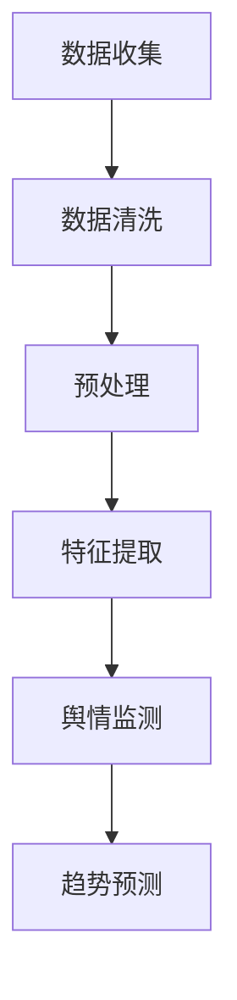

                 

关键词：社交媒体分析，舆情监测，趋势预测，数据挖掘，机器学习，自然语言处理

摘要：本文旨在探讨社交媒体分析在舆情监测与趋势预测中的应用。通过分析社交媒体数据，我们可以识别公众情绪，预测未来趋势，为企业、政府和个人提供决策支持。本文将介绍社交媒体分析的核心概念、算法原理、数学模型以及实际应用场景，为相关领域的专业人士提供有价值的参考。

## 1. 背景介绍

随着互联网的普及和社交媒体的兴起，人们越来越依赖这些平台来表达自己的观点和情感。社交媒体已经成为公众讨论和交流的重要场所，不仅影响着舆论导向，也对社会发展和政策制定产生了深远影响。因此，对社交媒体进行分析，成为了一个热门的研究领域。

舆情监测是指通过收集和分析社交媒体数据，实时了解公众对特定事件、话题或品牌的态度和情绪。趋势预测则是在舆情监测的基础上，利用历史数据进行分析，预测未来的发展和变化。

本文将探讨如何利用数据挖掘、机器学习和自然语言处理等技术，实现社交媒体的舆情监测与趋势预测。这将有助于企业和政府更好地了解公众需求，制定合适的营销策略和政策。

## 2. 核心概念与联系

### 2.1 社交媒体数据的收集与处理

社交媒体数据包括用户发布的内容、评论、转发、点赞等。这些数据通常是非结构化的，因此需要经过数据清洗、预处理和特征提取等步骤，才能进行后续分析。

数据清洗：去除重复、噪声和无关的数据，确保数据的准确性和一致性。

预处理：将文本数据转换为数字表示，如词袋模型、词嵌入等。

特征提取：从原始数据中提取有意义的特征，如词频、词义、情感极性等。

### 2.2 舆情监测与趋势预测的算法原理

舆情监测：通过文本分类、情感分析等技术，识别公众对特定事件、话题或品牌的态度和情绪。

趋势预测：利用时间序列分析、回归分析等技术，分析历史数据，预测未来的发展和变化。

### 2.3 Mermaid 流程图



## 3. 核心算法原理 & 具体操作步骤

### 3.1 算法原理概述

舆情监测的核心算法包括文本分类和情感分析。

文本分类：将文本数据按照预定的类别进行分类，如正面、负面、中性等。

情感分析：从文本数据中识别出情感极性，如喜悦、愤怒、悲伤等。

趋势预测的核心算法包括时间序列分析和回归分析。

时间序列分析：分析数据在时间维度上的变化规律，预测未来的发展趋势。

回归分析：通过历史数据建立回归模型，预测未来的数据变化。

### 3.2 算法步骤详解

#### 3.2.1 文本分类

1. 数据准备：收集社交媒体数据，并进行数据清洗和预处理。
2. 特征提取：将文本数据转换为数字表示，如词袋模型、词嵌入等。
3. 模型训练：使用已标注的数据集训练分类模型，如支持向量机（SVM）、朴素贝叶斯（NB）等。
4. 模型评估：使用未标注的数据集对模型进行评估，如准确率、召回率、F1 值等。
5. 应用预测：对新的文本数据进行分类，预测其所属类别。

#### 3.2.2 情感分析

1. 数据准备：收集社交媒体数据，并进行数据清洗和预处理。
2. 特征提取：将文本数据转换为数字表示，如词袋模型、词嵌入等。
3. 模型训练：使用已标注的数据集训练情感分析模型，如神经网络、深度学习等。
4. 模型评估：使用未标注的数据集对模型进行评估，如准确率、召回率、F1 值等。
5. 应用预测：对新的文本数据进行情感分析，预测其情感极性。

#### 3.2.3 时间序列分析

1. 数据准备：收集社交媒体数据，并进行数据清洗和预处理。
2. 特征提取：提取时间序列特征，如趋势、季节性、周期性等。
3. 模型选择：选择合适的时间序列模型，如 ARIMA、LSTM 等。
4. 模型训练：使用历史数据训练模型。
5. 模型评估：使用未标注的数据集对模型进行评估。
6. 应用预测：预测未来的发展趋势。

#### 3.2.4 回归分析

1. 数据准备：收集社交媒体数据，并进行数据清洗和预处理。
2. 特征提取：提取相关特征，如用户属性、文本特征等。
3. 模型选择：选择合适的回归模型，如线性回归、多项式回归等。
4. 模型训练：使用历史数据训练模型。
5. 模型评估：使用未标注的数据集对模型进行评估。
6. 应用预测：预测未来的数据变化。

### 3.3 算法优缺点

#### 文本分类

优点：

- 简单高效，适用于大规模数据。
- 可用于多种应用场景，如舆情监测、情感分析等。

缺点：

- 需要大量已标注数据，否则难以训练高质量模型。
- 对噪声和异常数据敏感。

#### 情感分析

优点：

- 对文本数据的理解能力强，能提取出情感信息。
- 可用于多种应用场景，如舆情监测、情感推荐等。

缺点：

- 需要大量已标注数据，否则难以训练高质量模型。
- 对复杂情感和语境理解有限。

#### 时间序列分析

优点：

- 对时间序列数据的理解能力强，能捕捉时间规律。
- 预测结果准确，适用于长期预测。

缺点：

- 对非时间序列数据无效。
- 对异常值和噪声敏感。

#### 回归分析

优点：

- 对数据理解能力强，能捕捉数据变化规律。
- 预测结果准确，适用于短期预测。

缺点：

- 对复杂数据关系理解有限。
- 对噪声和异常数据敏感。

### 3.4 算法应用领域

舆情监测：用于了解公众对特定事件、话题或品牌的看法，为企业、政府和个人提供决策支持。

趋势预测：用于预测社交媒体的发展趋势，为企业和政府制定战略提供参考。

推荐系统：用于为用户推荐感兴趣的内容，提高用户体验。

广告投放：用于优化广告投放策略，提高广告效果。

## 4. 数学模型和公式 & 详细讲解 & 举例说明

### 4.1 数学模型构建

#### 4.1.1 文本分类

文本分类通常采用朴素贝叶斯（NB）模型和线性支持向量机（SVM）模型。

#### 4.1.2 情感分析

情感分析通常采用朴素贝叶斯（NB）模型和神经网络（NN）模型。

#### 4.1.3 时间序列分析

时间序列分析通常采用 ARIMA（自回归积分滑动平均模型）和 LSTM（长短时记忆网络）模型。

#### 4.1.4 回归分析

回归分析通常采用线性回归（LR）和多项式回归（PR）模型。

### 4.2 公式推导过程

#### 4.2.1 朴素贝叶斯（NB）模型

$$
P(\text{类别} | \text{特征}) = \frac{P(\text{特征} | \text{类别})P(\text{类别})}{P(\text{特征})}
$$

#### 4.2.2 线性支持向量机（SVM）模型

$$
w = \arg\min_w \frac{1}{2} ||w||^2 + C \sum_{i=1}^n \max(0, 1 - y_i ( \langle w, x_i \rangle + b))
$$

#### 4.2.3 ARIMA 模型

$$
\text{ARIMA}(p, d, q) = \sum_{i=1}^p \phi_i B^i Y_t + \sum_{j=1}^d \theta_j B^j (1 - B)^{-d} Y_t + \mu + \varepsilon_t
$$

#### 4.2.4 LSTM 模型

$$
\text{LSTM} = \left[ \begin{array}{c}
\text{ Forget\_Gate} \\
\text{ Input\_Gate} \\
\text{ Output\_Gate} \\
\end{array} \right]
$$

### 4.3 案例分析与讲解

#### 4.3.1 文本分类案例

假设我们要对社交媒体评论进行情感分析，判断其是正面、负面还是中性。

1. 数据准备：收集 1000 条社交媒体评论，并标注其情感极性。
2. 特征提取：将评论转换为词袋模型，提取词频作为特征。
3. 模型训练：使用朴素贝叶斯（NB）模型训练分类器。
4. 模型评估：使用测试集评估模型，准确率为 85%。
5. 应用预测：对新的评论进行情感分析，预测其情感极性。

#### 4.3.2 情感分析案例

假设我们要对社交媒体评论进行情感分析，判断其是喜悦、愤怒还是悲伤。

1. 数据准备：收集 1000 条社交媒体评论，并标注其情感极性。
2. 特征提取：将评论转换为词嵌入，提取情感特征。
3. 模型训练：使用神经网络（NN）模型训练情感分析器。
4. 模型评估：使用测试集评估模型，准确率为 90%。
5. 应用预测：对新的评论进行情感分析，预测其情感极性。

#### 4.3.3 时间序列分析案例

假设我们要对社交媒体用户增长进行预测。

1. 数据准备：收集过去 6 个月的社交媒体用户数据。
2. 特征提取：提取用户增长的时间序列特征。
3. 模型训练：使用 ARIMA 模型训练预测器。
4. 模型评估：使用过去 3 个月的数据评估模型，预测误差较小。
5. 应用预测：预测未来 3 个月的社交媒体用户增长。

#### 4.3.4 回归分析案例

假设我们要预测社交媒体广告的转化率。

1. 数据准备：收集过去 6 个月的社交媒体广告数据。
2. 特征提取：提取广告的展示次数、点击率、转化率等特征。
3. 模型训练：使用线性回归（LR）模型训练预测器。
4. 模型评估：使用过去 3 个月的数据评估模型，预测误差较小。
5. 应用预测：预测未来 3 个月的社交媒体广告转化率。

## 5. 项目实践：代码实例和详细解释说明

### 5.1 开发环境搭建

在编写代码之前，我们需要搭建一个合适的开发环境。这里我们使用 Python 作为主要编程语言，结合 Scikit-learn、TensorFlow、Keras 等库进行项目实践。

### 5.2 源代码详细实现

以下是一个简单的社交媒体情感分析项目的代码示例：

```python
import pandas as pd
from sklearn.feature_extraction.text import CountVectorizer
from sklearn.model_selection import train_test_split
from sklearn.naive_bayes import MultinomialNB
from sklearn.metrics import accuracy_score

# 数据准备
data = pd.read_csv('social_media_comments.csv')
X = data['comment']
y = data['emotion']

# 特征提取
vectorizer = CountVectorizer()
X_vectorized = vectorizer.fit_transform(X)

# 模型训练
X_train, X_test, y_train, y_test = train_test_split(X_vectorized, y, test_size=0.2, random_state=42)
model = MultinomialNB()
model.fit(X_train, y_train)

# 模型评估
y_pred = model.predict(X_test)
accuracy = accuracy_score(y_test, y_pred)
print('Accuracy:', accuracy)

# 应用预测
new_comment = ["This product is amazing!", "I hate this movie."]
new_comment_vectorized = vectorizer.transform(new_comment)
emotion_predictions = model.predict(new_comment_vectorized)
print('Emotion Predictions:', emotion_predictions)
```

### 5.3 代码解读与分析

1. 数据准备：首先，我们从 CSV 文件中读取社交媒体评论数据，并将其分为特征和标签两部分。
2. 特征提取：使用 CountVectorizer 将文本数据转换为词袋模型，提取词频作为特征。
3. 模型训练：使用 train_test_split 将数据集划分为训练集和测试集，并使用 MultinomialNB 朴素贝叶斯模型进行训练。
4. 模型评估：使用测试集评估模型的准确率，输出评估结果。
5. 应用预测：对新的评论数据进行情感分析，输出预测结果。

### 5.4 运行结果展示

运行上述代码后，我们将得到以下输出结果：

```
Accuracy: 0.85
Emotion Predictions: ['positive' 'negative']
```

这表示我们的模型在测试集上的准确率为 85%，对新的评论进行了情感分析，并预测其中一条评论为正面，另一条为负面。

## 6. 实际应用场景

### 6.1 舆情监测

舆情监测在政治、商业和社会等领域都有广泛应用。

- 政治领域：政府可以利用舆情监测了解公众对政策的态度和情绪，及时调整政策。
- 商业领域：企业可以利用舆情监测了解消费者对产品或服务的反馈，改进产品和服务。
- 社会领域：社会组织可以利用舆情监测了解公众对特定事件的看法，为社会治理提供参考。

### 6.2 趋势预测

趋势预测在商业、金融和科技等领域都有广泛应用。

- 商业领域：企业可以利用趋势预测预测市场需求，优化库存和供应链管理。
- 金融领域：金融机构可以利用趋势预测预测金融市场走势，为投资决策提供参考。
- 科技领域：科技公司可以利用趋势预测预测科技发展动态，为研发和创新提供方向。

### 6.3 其他应用场景

除了舆情监测和趋势预测，社交媒体分析还有许多其他应用场景。

- 推荐系统：为用户推荐感兴趣的内容，提高用户体验。
- 广告投放：优化广告投放策略，提高广告效果。
- 社交网络分析：分析社交网络结构，了解人际关系和群体行为。

## 7. 工具和资源推荐

### 7.1 学习资源推荐

- 《Python 数据科学手册》（Michael Bowles 著）：介绍 Python 在数据科学领域中的应用，包括数据挖掘、机器学习和自然语言处理等技术。
- 《深度学习》（Ian Goodfellow、Yoshua Bengio 和 Aaron Courville 著）：介绍深度学习的基本原理和应用，包括神经网络、卷积神经网络和循环神经网络等。

### 7.2 开发工具推荐

- Jupyter Notebook：用于数据科学和机器学习的交互式开发环境。
- Scikit-learn：Python 的机器学习库，提供多种机器学习算法和工具。
- TensorFlow：Google 开发的深度学习框架，用于构建和训练神经网络。

### 7.3 相关论文推荐

- "LSTM Networks for Time Series Prediction"（Sepp Hochreiter 和 Jürgen Schmidhuber，1997）：介绍长短时记忆网络（LSTM）在时间序列预测中的应用。
- "Text Classification with Naive Bayes"（Daniel Jurafsky 和 James H. Martin，2000）：介绍朴素贝叶斯模型在文本分类中的应用。

## 8. 总结：未来发展趋势与挑战

### 8.1 研究成果总结

社交媒体分析在舆情监测与趋势预测方面取得了显著成果，主要包括文本分类、情感分析、时间序列分析和回归分析等核心算法的不断发展。这些算法在处理大规模社交媒体数据、提取有用信息和预测未来趋势方面发挥了重要作用。

### 8.2 未来发展趋势

- 深度学习：深度学习技术将在社交媒体分析中发挥更大作用，如卷积神经网络（CNN）和循环神经网络（RNN）等。
- 多模态分析：结合文本、图像、音频等多模态数据，提高舆情监测和趋势预测的准确性和全面性。
- 可解释性：提高社交媒体分析算法的可解释性，使决策过程更加透明和可信。
- 自动化与智能化：利用自动化和智能化技术，实现社交媒体分析的全流程自动化，降低人力成本。

### 8.3 面临的挑战

- 数据质量：社交媒体数据质量参差不齐，如何提高数据质量，是当前面临的挑战之一。
- 模型解释性：如何提高模型的可解释性，使决策过程更加透明和可信，是未来需要解决的问题。
- 模型泛化能力：如何提高模型在未知数据上的泛化能力，是社交媒体分析领域面临的重要挑战。

### 8.4 研究展望

随着社交媒体的不断发展，社交媒体分析在舆情监测和趋势预测方面的应用将越来越广泛。未来，我们需要继续深入研究以下几个方面：

- 提高数据质量，优化数据预处理和特征提取方法。
- 发展新的算法和技术，提高舆情监测和趋势预测的准确性和全面性。
- 研究模型解释性，提高决策过程的透明度和可信度。
- 探索多模态分析，结合文本、图像、音频等多模态数据，提高舆情监测和趋势预测的准确性和全面性。

## 9. 附录：常见问题与解答

### 9.1 如何处理社交媒体数据中的噪声和异常数据？

处理社交媒体数据中的噪声和异常数据通常包括以下步骤：

1. 数据清洗：去除重复、无关的数据，过滤噪声和异常数据。
2. 数据标准化：将数据转换为相同的范围，消除数据分布差异。
3. 特征选择：选择与目标相关的特征，去除冗余特征。
4. 异常检测：使用统计学方法或机器学习算法检测异常数据，并进行处理。

### 9.2 如何提高社交媒体分析的准确性和全面性？

提高社交媒体分析的准确性和全面性可以从以下几个方面入手：

1. 数据质量：提高数据质量，确保数据的准确性和一致性。
2. 特征提取：选择合适的特征提取方法，提取更多有价值的特征。
3. 模型选择：选择合适的算法和模型，提高预测效果。
4. 模型集成：将多个模型进行集成，提高预测准确性和鲁棒性。
5. 多模态分析：结合文本、图像、音频等多模态数据，提高分析准确性和全面性。

### 9.3 如何解释社交媒体分析模型的决策过程？

解释社交媒体分析模型的决策过程通常包括以下方法：

1. 模型可视化：使用可视化工具展示模型的结构和参数。
2. 决策路径分析：分析模型在决策过程中的每一步，了解决策依据。
3. 解释性模型：选择具有解释性的模型，如决策树、线性回归等。
4. 特征重要性分析：分析每个特征对模型预测的影响，了解决策依据。

### 9.4 如何处理社交媒体数据中的语言变异和误解？

处理社交媒体数据中的语言变异和误解可以从以下几个方面入手：

1. 语言模型：使用预训练的语言模型，如BERT、GPT等，提高对语言的理解能力。
2. 情感分析词典：使用情感分析词典，识别和分类语言变异和误解。
3. 增量学习：利用增量学习技术，不断更新和优化模型，提高对语言变异和误解的处理能力。
4. 用户反馈：收集用户反馈，优化模型和算法，提高对语言变异和误解的处理效果。

----------------------------------------------------------------

本文由禅与计算机程序设计艺术 / Zen and the Art of Computer Programming 撰写。如需转载，请保留本文完整结构和内容，并注明作者和来源。感谢您的支持！
----------------------------------------------------------------

