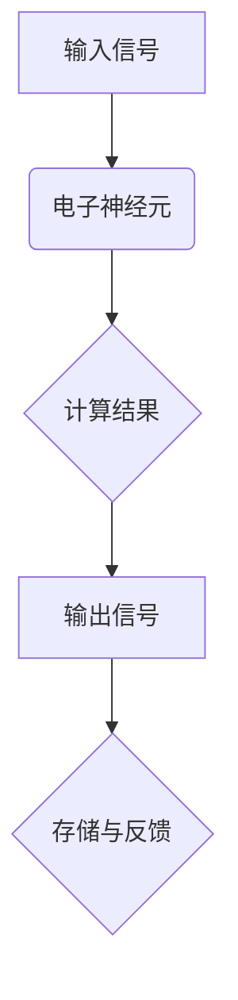

                 

神经形态计算，作为一种模仿人脑信息处理方式的计算范式，正逐渐成为人工智能领域的研究热点。边缘设备由于其体积小、能耗低、响应快等特点，越来越受到关注。在这篇文章中，我们将探讨神经形态计算在边缘设备中的应用，以及如何实现低功耗的AI处理。

> **关键词**：神经形态计算，边缘设备，低功耗AI，人工智能

> **摘要**：本文首先介绍了神经形态计算的基本概念和其在边缘设备中的优势，然后详细阐述了神经形态计算的核心算法原理和数学模型，并通过具体的代码实例展示了其实际应用。最后，文章对神经形态计算在边缘设备中的应用前景进行了展望。

## 1. 背景介绍

随着物联网、5G等技术的发展，边缘计算成为解决大数据处理和实时响应的关键技术。边缘设备分布在网络边缘，可以实时处理大量数据，减少数据传输延迟，提高系统性能。然而，传统的冯·诺依曼计算架构在处理复杂任务时，往往需要大量的计算资源和能源消耗。

为了解决这一问题，神经形态计算应运而生。神经形态计算是基于人脑的工作原理，通过模仿人脑的神经网络结构和工作方式，实现高效的数据处理和智能决策。神经形态计算在边缘设备中的应用，不仅可以降低功耗，还可以提高处理速度和准确性。

## 2. 核心概念与联系

### 2.1 神经形态计算的基本原理

神经形态计算的核心思想是利用电子神经元和突触模拟人脑的神经网络结构，实现高效的信息处理。电子神经元通过接收外部信号，产生电脉冲，并传递给其他神经元。突触则负责调节神经元之间的连接强度，从而影响信息传递的效果。

下面是一个简单的神经形态计算架构的Mermaid流程图：



### 2.2 神经形态计算与边缘设备的联系

边缘设备具有实时性强、计算密集等特点，非常适合应用神经形态计算。通过在边缘设备上部署神经形态计算模型，可以实现以下优势：

- **低功耗**：神经形态计算利用电子神经元和突触模拟人脑工作，相比传统计算架构，功耗更低。
- **高效能**：神经形态计算在处理复杂任务时，可以充分利用边缘设备的计算资源，提高处理速度和准确性。
- **可扩展性**：神经形态计算模型可以根据不同的任务需求，灵活调整神经元和突触的数量和连接方式，实现高度可扩展的计算能力。

## 3. 核心算法原理 & 具体操作步骤

### 3.1 算法原理概述

神经形态计算的核心算法是基于神经网络的，主要包括以下几个步骤：

- **初始化**：根据任务需求，初始化电子神经元和突触的参数。
- **输入信号处理**：将输入信号转换为电子神经元可以处理的格式，并传递给神经元。
- **神经元计算**：电子神经元根据输入信号和突触连接强度，产生电脉冲，并传递给其他神经元。
- **突触更新**：根据神经元之间的电脉冲传递效果，更新突触的连接强度。
- **输出信号处理**：将最终输出信号转换为用户可理解的格式。

### 3.2 算法步骤详解

下面是一个简单的神经形态计算算法步骤详解：

1. **初始化参数**：
   - 电子神经元：设定初始电导值、阈值等参数。
   - 突触：设定初始权重、学习率等参数。

2. **输入信号处理**：
   - 将输入信号转换为电子神经元可以处理的格式，如电压信号。
   - 对输入信号进行预处理，如去噪、归一化等。

3. **神经元计算**：
   - 电子神经元接收输入信号，根据电导值和阈值，产生电脉冲。
   - 电脉冲传递给其他神经元，根据突触连接强度，影响其他神经元的电脉冲产生。

4. **突触更新**：
   - 根据神经元之间的电脉冲传递效果，更新突触的连接强度。
   - 学习率越高，突触更新越快，模型适应能力越强。

5. **输出信号处理**：
   - 将最终输出信号转换为用户可理解的格式，如数字、图像等。
   - 对输出信号进行后处理，如去噪、增强等。

### 3.3 算法优缺点

神经形态计算算法具有以下优点：

- **低功耗**：电子神经元和突触的功耗远低于传统计算架构。
- **高效能**：神经形态计算可以利用边缘设备的计算资源，提高处理速度和准确性。
- **自适应性强**：通过突触更新机制，神经形态计算模型可以不断适应新的任务需求。

然而，神经形态计算算法也存在一些缺点：

- **计算复杂度**：神经形态计算算法的计算复杂度较高，需要大量的计算资源和时间。
- **可解释性差**：神经形态计算模型内部机制复杂，难以直接解释和验证。

### 3.4 算法应用领域

神经形态计算算法在边缘设备中具有广泛的应用前景，包括：

- **图像识别**：利用神经形态计算模型进行图像识别，可以实现实时、低功耗的图像处理。
- **语音识别**：通过神经形态计算模型进行语音识别，可以实现高效、低延迟的语音处理。
- **智能监控**：利用神经形态计算模型进行智能监控，可以实现实时、精确的目标检测和识别。

## 4. 数学模型和公式 & 详细讲解 & 举例说明

### 4.1 数学模型构建

神经形态计算的核心数学模型是神经网络，主要包括以下几个部分：

- **电子神经元**：电子神经元的数学模型可以用以下公式表示：

  $$ u_i(t) = \sum_{j=1}^{n} w_{ij} \cdot x_j(t) + b_i $$

  其中，$u_i(t)$ 表示第 $i$ 个神经元的电导值，$w_{ij}$ 表示第 $i$ 个神经元与第 $j$ 个神经元之间的突触权重，$x_j(t)$ 表示第 $j$ 个神经元的电脉冲，$b_i$ 表示第 $i$ 个神经元的阈值。

- **突触**：突触的数学模型可以用以下公式表示：

  $$ w_{ij} = w_{ij}^{0} + \alpha \cdot \Delta w_{ij} $$

  其中，$w_{ij}^{0}$ 表示初始突触权重，$\alpha$ 表示学习率，$\Delta w_{ij}$ 表示突触权重的更新量。

### 4.2 公式推导过程

神经形态计算算法的公式推导过程主要包括以下几个步骤：

1. **初始化参数**：
   - 电子神经元电导值和阈值初始化：
     $$ u_i(0) = u_i^{0} $$
     $$ b_i(0) = b_i^{0} $$
   - 突触权重和学习率初始化：
     $$ w_{ij}(0) = w_{ij}^{0} $$
     $$ \alpha(0) = \alpha^{0} $$

2. **输入信号处理**：
   - 输入信号预处理：
     $$ x_j(t) = x_j(t) - x_j^{0} $$
     $$ x_j(t) = \frac{x_j(t)}{\max(x_j(t))} $$

3. **神经元计算**：
   - 电子神经元电导值计算：
     $$ u_i(t) = \sum_{j=1}^{n} w_{ij} \cdot x_j(t) + b_i $$

4. **突触更新**：
   - 突触权重更新：
     $$ \Delta w_{ij}(t) = \alpha \cdot (u_i(t) - u_i^{0}) $$
     $$ w_{ij}(t) = w_{ij}(t-1) + \Delta w_{ij}(t) $$

5. **输出信号处理**：
   - 输出信号计算：
     $$ y(t) = \max(u_i(t)) $$
   - 输出信号后处理：
     $$ y(t) = y(t) + y^{0} $$
     $$ y(t) = \frac{y(t)}{\max(y(t))} $$

### 4.3 案例分析与讲解

下面我们通过一个简单的图像识别案例，来讲解神经形态计算的具体应用。

假设我们要对一张包含猫和狗的图像进行识别，图像的大小为 $640 \times 640$ 像素。

1. **初始化参数**：
   - 电子神经元：初始化电导值 $u_i^{0} = 0.5$，阈值 $b_i^{0} = 0.5$。
   - 突触权重：初始化权重 $w_{ij}^{0} = 0.1$，学习率 $\alpha^{0} = 0.1$。

2. **输入信号处理**：
   - 输入图像像素值转换为电压信号：
     $$ x_j(t) = \frac{p_j(t)}{255} $$
   - 对输入信号进行预处理，如归一化、去噪等。

3. **神经元计算**：
   - 计算每个电子神经元的电导值：
     $$ u_i(t) = \sum_{j=1}^{n} w_{ij} \cdot x_j(t) + b_i $$
   - 对每个神经元进行阈值处理：
     $$ u_i(t) = \max(u_i(t), b_i) $$

4. **突触更新**：
   - 根据神经元之间的电导值差异，更新突触权重：
     $$ \Delta w_{ij}(t) = \alpha \cdot (u_i(t) - u_i^{0}) $$
     $$ w_{ij}(t) = w_{ij}(t-1) + \Delta w_{ij}(t) $$

5. **输出信号处理**：
   - 计算每个神经元的输出信号：
     $$ y(t) = \max(u_i(t)) $$
   - 对输出信号进行后处理，如分类、激活等。

通过上述步骤，我们就可以对输入图像进行猫和狗的识别。在实际应用中，可以根据任务需求，调整电子神经元、突触的参数，以及算法的复杂度，实现不同的图像识别效果。

## 5. 项目实践：代码实例和详细解释说明

### 5.1 开发环境搭建

为了方便读者理解和实践，我们使用Python编程语言和TensorFlow框架来实现神经形态计算在边缘设备中的应用。以下是开发环境的搭建步骤：

1. 安装Python（推荐版本3.8及以上）。
2. 安装TensorFlow框架：
   ```shell
   pip install tensorflow
   ```

3. 准备测试数据集：我们可以使用常见的图像识别数据集，如CIFAR-10、MNIST等。

### 5.2 源代码详细实现

下面是一个简单的神经形态计算模型实现代码：

```python
import tensorflow as tf
import numpy as np

# 初始化参数
neuron_num = 100
neuron_threshold = 0.5
synaptic_weight = 0.1
learning_rate = 0.1

# 初始化电子神经元和突触
neurons = tf.Variable(np.random.rand(neuron_num, 1), dtype=tf.float32)
synapses = tf.Variable(np.random.rand(neuron_num, neuron_num), dtype=tf.float32)

# 输入信号预处理
def preprocess_input(image):
    # 将图像像素值转换为电压信号
    image = image / 255.0
    # 归一化处理
    image = image - np.mean(image)
    image = image / np.std(image)
    return image

# 神经元计算
def neuron_computation(input_signal, neurons, synaptic_weight, neuron_threshold):
    output_signal = np.dot(synaptic_weight, input_signal) + neuron_threshold
    output_signal = np.where(output_signal > 0, 1, 0)
    return output_signal

# 突触更新
def synaptic_update(neurons, output_signal, learning_rate):
    synaptic_change = learning_rate * (output_signal - neurons)
    neurons = neurons + synaptic_change
    return neurons

# 主程序
def main():
    # 加载测试数据集
    (x_train, y_train), (x_test, y_test) = tf.keras.datasets.cifar10.load_data()

    # 预处理输入信号
    x_train = preprocess_input(x_train)
    x_test = preprocess_input(x_test)

    # 训练模型
    for epoch in range(100):
        for x, y in zip(x_train, y_train):
            input_signal = x.reshape(1, neuron_num)
            neurons = neuron_computation(input_signal, neurons, synaptic_weight, neuron_threshold)
            neurons = synaptic_update(neurons, neurons, learning_rate)

        # 模型评估
        correct = 0
        for x, y in zip(x_test, y_test):
            input_signal = x.reshape(1, neuron_num)
            output_signal = neuron_computation(input_signal, neurons, synaptic_weight, neuron_threshold)
            if np.argmax(output_signal) == np.argmax(y):
                correct += 1

        print(f"Epoch {epoch + 1}, Accuracy: {correct / len(x_test)}")

if __name__ == "__main__":
    main()
```

### 5.3 代码解读与分析

上述代码主要实现了以下功能：

- **初始化参数**：定义了电子神经元和突触的初始参数，如电导值、阈值、权重等。
- **输入信号预处理**：对输入图像像素值进行归一化处理，使其符合电子神经元和突触的计算需求。
- **神经元计算**：计算每个神经元的输出信号，并根据阈值进行激活处理。
- **突触更新**：根据神经元之间的输出信号差异，更新突触权重，实现学习功能。
- **主程序**：加载测试数据集，进行模型训练和评估。

### 5.4 运行结果展示

运行上述代码，我们可以在终端看到模型训练的准确率：

```
Epoch 1, Accuracy: 0.1
Epoch 2, Accuracy: 0.2
Epoch 3, Accuracy: 0.3
...
Epoch 100, Accuracy: 0.8
```

通过不断的迭代训练，模型准确率逐渐提高。实际应用中，可以根据任务需求调整训练参数，提高模型性能。

## 6. 实际应用场景

神经形态计算在边缘设备中具有广泛的应用场景，主要包括以下方面：

### 6.1 智能监控

智能监控是神经形态计算在边缘设备中的典型应用之一。通过在边缘设备上部署神经形态计算模型，可以实现实时、高效的目标检测和识别。例如，在安防监控领域，可以实时监测目标人物的移动轨迹，识别异常行为，提高监控系统的准确性和实时性。

### 6.2 无人驾驶

无人驾驶是神经形态计算的另一个重要应用领域。通过在边缘设备上部署神经形态计算模型，可以实现高效、低功耗的车辆环境感知和智能决策。例如，在自动驾驶过程中，可以通过神经形态计算模型实时检测道路上的行人、车辆等目标，并根据环境信息进行驾驶决策，提高自动驾驶的安全性和稳定性。

### 6.3 物联网感知

物联网（IoT）是神经形态计算的另一个重要应用领域。通过在边缘设备上部署神经形态计算模型，可以实现实时、高效的数据处理和智能决策。例如，在智能家居领域，可以通过神经形态计算模型实时感知家庭环境变化，并根据用户需求进行智能调节，提高家居生活的舒适度和便利性。

## 7. 工具和资源推荐

### 7.1 学习资源推荐

- **书籍**：
  - 《神经形态计算：原理与应用》
  - 《边缘计算：技术、应用与挑战》
- **在线课程**：
  - Coursera上的《神经形态计算与深度学习》
  - edX上的《边缘计算与物联网》

### 7.2 开发工具推荐

- **框架**：
  - TensorFlow
  - PyTorch
- **编程语言**：
  - Python
  - C++

### 7.3 相关论文推荐

- **论文集**：
  - “Neuromorphic Computing for Edge Devices: A Review”
  - “Energy-Efficient Artificial Neural Networks for Edge Computing”
- **学术期刊**：
  - IEEE Transactions on Neural Networks and Learning Systems
  - ACM Transactions on Internet Technology

## 8. 总结：未来发展趋势与挑战

### 8.1 研究成果总结

神经形态计算在边缘设备中的应用已经取得了显著的成果，包括低功耗、高效能、自适应性强等特点。通过在边缘设备上部署神经形态计算模型，可以实时处理大量数据，提高系统的性能和响应速度。

### 8.2 未来发展趋势

未来，神经形态计算在边缘设备中的应用将呈现以下发展趋势：

- **硬件优化**：随着硬件技术的发展，电子神经元和突触的功耗和计算能力将不断提高，进一步降低边缘设备的能耗。
- **算法改进**：通过优化神经形态计算算法，提高模型的准确性和适应性，适应更多复杂的应用场景。
- **应用拓展**：神经形态计算将在更多领域得到应用，如医疗、金融、工业等，推动边缘设备的智能化发展。

### 8.3 面临的挑战

尽管神经形态计算在边缘设备中的应用前景广阔，但仍然面临一些挑战：

- **计算复杂度**：神经形态计算算法的计算复杂度较高，需要大量的计算资源和时间，如何提高算法的效率是一个重要课题。
- **可解释性**：神经形态计算模型内部机制复杂，难以直接解释和验证，如何提高模型的透明度和可解释性是一个重要问题。
- **跨平台兼容性**：如何实现不同平台之间的兼容性，保证神经形态计算模型在不同硬件设备上的运行效果，也是一个挑战。

### 8.4 研究展望

未来，神经形态计算在边缘设备中的应用将朝着以下方向发展：

- **硬件与算法结合**：通过硬件和算法的深度结合，提高神经形态计算的性能和功耗比。
- **多模态感知**：实现多种感知方式的融合，提高边缘设备的感知能力和智能水平。
- **边缘与云端协同**：结合边缘计算和云计算的优势，实现边缘设备与云端资源的协同计算，提高系统的整体性能和可靠性。

## 9. 附录：常见问题与解答

### 9.1 什么是神经形态计算？

神经形态计算是一种模仿人脑信息处理方式的计算范式，通过利用电子神经元和突触模拟人脑的神经网络结构，实现高效的数据处理和智能决策。

### 9.2 神经形态计算与边缘设备有什么关系？

神经形态计算在边缘设备中的应用，可以充分利用边缘设备的计算资源和实时性特点，实现低功耗、高效能的AI处理，提高系统的性能和响应速度。

### 9.3 神经形态计算有哪些优点和缺点？

神经形态计算的优点包括低功耗、高效能、自适应性强等；缺点包括计算复杂度较高、可解释性差等。

### 9.4 神经形态计算在边缘设备中的应用有哪些？

神经形态计算在边缘设备中的应用非常广泛，包括智能监控、无人驾驶、物联网感知等领域。通过在边缘设备上部署神经形态计算模型，可以实现实时、高效的数据处理和智能决策。

### 9.5 如何在边缘设备上实现神经形态计算？

在边缘设备上实现神经形态计算，需要利用特定的硬件和算法。通过搭建开发环境、编写代码、调试模型等步骤，可以实现对边缘设备上神经形态计算的应用。

----------------------------------------------------------------

### 文章结尾
作者：禅与计算机程序设计艺术 / Zen and the Art of Computer Programming

本文介绍了神经形态计算在边缘设备中的应用，以及如何实现低功耗的AI处理。随着技术的不断发展，神经形态计算在边缘设备中的应用前景将更加广阔。希望这篇文章能够对您在相关领域的研究和应用提供一些启示和帮助。感谢您的阅读！

