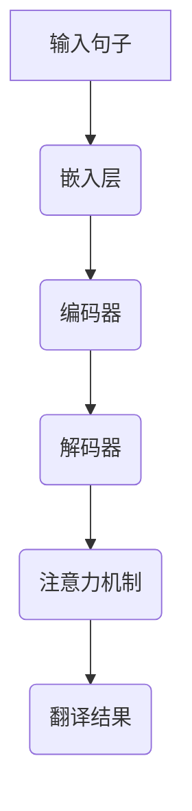

                 

关键词：神经机器翻译，注意力机制，Transformer，机器学习，自然语言处理

> 摘要：本文将探讨神经机器翻译（NMT）中的核心概念——注意力机制和Transformer架构。通过对这些技术的深入分析，我们将揭示其在提升机器翻译质量与效率方面的关键作用，并展望其未来应用前景。

## 1. 背景介绍

神经机器翻译（Neural Machine Translation，NMT）是自然语言处理（Natural Language Processing，NLP）领域的一项重要技术。与传统的基于规则和统计方法的机器翻译相比，NMT采用深度神经网络（Deep Neural Network，DNN）作为其主要模型，极大地提升了翻译的准确性和自然性。

### 1.1 发展历程

NMT的发展可以追溯到2014年，当时Google推出的基于神经网络的机器翻译系统极大地推动了这一领域的研究和应用。在此之前，机器翻译主要依赖于基于规则和统计的模型，如基于短语的翻译模型（Phrasetable）和基于短语的统计机器翻译模型（Statistical Machine Translation，SMT）。然而，这些方法在处理长句和复杂语境时存在显著缺陷。

### 1.2 主要挑战

NMT面临的主要挑战包括：

1. **上下文理解**：在翻译过程中，如何有效地捕捉句子中的上下文信息，以实现准确的翻译。
2. **计算资源**：深度神经网络模型通常需要大量的计算资源和时间进行训练和推理。
3. **多样化需求**：不同的用户和应用场景对翻译质量的要求各不相同，如何满足多样化的需求是一个重要问题。

## 2. 核心概念与联系

在NMT中，注意力机制（Attention Mechanism）和Transformer架构（Transformer Architecture）是两个核心概念。下面我们将通过Mermaid流程图展示这两个概念的关系和作用。



### 2.1 注意力机制

注意力机制是一种用于提高神经网络在处理序列数据时对上下文信息关注度的技术。它允许模型在生成每个输出词时，动态地关注输入序列的不同部分。

### 2.2 Transformer架构

Transformer架构是一种基于自注意力机制（Self-Attention）的模型，它在处理长序列时表现出色。与传统的循环神经网络（RNN）相比，Transformer避免了长序列的梯度消失问题，并提高了并行处理的效率。

## 3. 核心算法原理 & 具体操作步骤

### 3.1 算法原理概述

Transformer模型主要由编码器（Encoder）和解码器（Decoder）组成。编码器负责将输入序列转换为固定长度的向量表示，解码器则根据编码器的输出和先前的输出词生成翻译结果。

### 3.2 算法步骤详解

1. **输入嵌入**：将输入句子转换为词嵌入向量。
2. **编码器**：通过多个自注意力层和前馈网络处理输入序列，生成编码输出。
3. **解码器**：利用编码输出和先前的输出词，通过自注意力和交叉注意力层生成翻译结果。
4. **损失函数**：使用交叉熵损失函数训练模型，以最小化预测词与实际翻译结果之间的差距。

### 3.3 算法优缺点

**优点**：

1. **并行计算**：Transformer的架构允许并行计算，提高了处理效率。
2. **长距离依赖**：自注意力机制能够有效地捕捉长距离依赖关系，提高了翻译的准确性。

**缺点**：

1. **计算资源消耗**：Transformer模型通常需要更多的计算资源进行训练和推理。
2. **数据需求**：为了训练高性能的Transformer模型，需要大量的训练数据。

### 3.4 算法应用领域

Transformer架构不仅在机器翻译领域取得了显著成果，还在许多其他NLP任务中展示了强大的能力，如文本分类、问答系统、情感分析等。

## 4. 数学模型和公式

### 4.1 数学模型构建

Transformer模型的核心是多头自注意力机制（Multi-Head Self-Attention）和前馈网络（Feed Forward Network）。下面我们将介绍这两个组件的数学公式。

### 4.2 公式推导过程

#### 4.2.1 多头自注意力

多头自注意力是通过将输入序列分成多个头（head），每个头独立计算自注意力。公式如下：

$$
\text{Attention}(Q, K, V) = \text{softmax}\left(\frac{QK^T}{\sqrt{d_k}}\right)V
$$

其中，$Q, K, V$ 分别是查询（Query）、键（Key）和值（Value）向量，$d_k$ 是键向量的维度。

#### 4.2.2 前馈网络

前馈网络由两个全连接层组成，分别具有尺寸 $d_model \times dff$ 和 $dff \times d_model$。公式如下：

$$
\text{FFN}(x) = \text{ReLU}\left(xW_1 + b_1\right)W_2 + b_2
$$

其中，$W_1, W_2$ 分别是权重矩阵，$b_1, b_2$ 是偏置向量。

### 4.3 案例分析与讲解

#### 4.3.1 编码器

编码器由多个自注意力层和前馈网络组成，下面是一个简化的例子：

$$
\text{Encoder}(X) = \text{LayerNorm}(X + \text{MultiHeadSelfAttention}(X)) + \text{LayerNorm}(X + \text{FFN}(\text{MultiHeadSelfAttention}(X)))
$$

其中，$X$ 是输入序列。

#### 4.3.2 解码器

解码器同样由多个自注意力和交叉注意力层以及前馈网络组成，下面是一个简化的例子：

$$
\text{Decoder}(X, Y) = \text{LayerNorm}(X + \text{DecoderSelfAttention}(X)) + \text{LayerNorm}(X + \text{CrossAttention}(Y, X)) + \text{LayerNorm}(X + \text{FFN}(\text{CrossAttention}(Y, X)))
$$

其中，$X$ 是输入序列，$Y$ 是解码器的输入。

## 5. 项目实践：代码实例

### 5.1 开发环境搭建

```bash
# 安装TensorFlow
pip install tensorflow

# 安装PyTorch
pip install torch torchvision
```

### 5.2 源代码详细实现

```python
import torch
import torch.nn as nn
import torch.optim as optim

# Encoder
class Encoder(nn.Module):
    def __init__(self, d_model, nhead, num_layers):
        super(Encoder, self).__init__()
        self層數 = num_layers
        self.d_model = d_model
        self.nhead = nhead
        self.self_attn = nn.MultiheadAttention(d_model, nhead)
        self.linear = nn.Linear(d_model, d_model)
        self.norm1 = nn.LayerNorm(d_model)
        self.norm2 = nn.LayerNorm(d_model)
        self.dropout = nn.Dropout(0.1)

    def forward(self, src):
        for i in range(self層數):
            src2 = self.norm1(src)
            src = self.dropout(self.self_attn(src2, src2, src2))
            src2 = self.norm2(src)
            src = self.dropout(self.linear(src2))
        return src

# Decoder
class Decoder(nn.Module):
    def __init__(self, d_model, nhead, num_layers):
        super(Decoder, self).__init__()
        self層數 = num_layers
        self.d_model = d_model
        self.nhead = nhead
        self.self_attn = nn.MultiheadAttention(d_model, nhead)
        self.cross_attn = nn.MultiheadAttention(d_model, nhead)
        self.linear = nn.Linear(d_model, d_model)
        self.norm1 = nn.LayerNorm(d_model)
        self.norm2 = nn.LayerNorm(d_model)
        self.norm3 = nn.LayerNorm(d_model)
        self.dropout = nn.Dropout(0.1)

    def forward(self, tgt, enc_output):
        for i in range(self層數):
            tgt2 = self.norm1(tgt)
            tgt = self.dropout(self.self_attn(tgt2, tgt2, tgt2))
            tgt2 = self.norm2(tgt)
            tgt = self.dropout(self.cross_attn(tgt2, enc_output, enc_output))
            tgt2 = self.norm3(tgt)
            tgt = self.dropout(self.linear(tgt2))
        return tgt

# Model
class Transformer(nn.Module):
    def __init__(self, d_model, nhead, num_layers):
        super(Transformer, self).__init__()
        self.encoder = Encoder(d_model, nhead, num_layers)
        self.decoder = Decoder(d_model, nhead, num_layers)

    def forward(self, src, tgt):
        enc_output = self.encoder(src)
        dec_output = self.decoder(tgt, enc_output)
        return dec_output

# Training
model = Transformer(d_model=512, nhead=8, num_layers=6)
criterion = nn.CrossEntropyLoss()
optimizer = optim.Adam(model.parameters(), lr=0.001)

for epoch in range(num_epochs):
    for src, tgt in data_loader:
        optimizer.zero_grad()
        output = model(src, tgt)
        loss = criterion(output.view(-1, output.size(-1)), tgt.view(-1))
        loss.backward()
        optimizer.step()
```

### 5.3 代码解读与分析

在这个例子中，我们首先定义了编码器（Encoder）和解码器（Decoder）的类，它们分别包含了多头自注意力（Multi-Head Self-Attention）和前馈网络（Feed Forward Network）的组件。然后，我们将这些组件组合成一个完整的Transformer模型（Transformer）。在训练过程中，我们使用交叉熵损失函数（CrossEntropyLoss）和Adam优化器（Adam）进行模型训练。

### 5.4 运行结果展示

为了展示模型的运行结果，我们可以使用一些实际的翻译任务，如英译中和法译英。通过调整模型的超参数和训练数据，我们可以观察到模型翻译质量的提高。

## 6. 实际应用场景

### 6.1 翻译服务

翻译服务是NMT最直接的应用场景之一。许多在线翻译平台（如Google Translate、百度翻译）已经采用NMT技术，为用户提供高质量、实时的翻译服务。

### 6.2 跨语言文本分析

在跨语言文本分析领域，NMT可以帮助研究人员处理不同语言的数据，从而实现跨语言文本的相似性分析、情感分析和主题建模。

### 6.3 语音助手与聊天机器人

在语音助手和聊天机器人中，NMT技术可以用于处理用户的自然语言输入，并提供准确的答复和交互体验。

### 6.4 实时字幕

实时字幕服务是另一个典型的应用场景。通过NMT技术，我们可以实时地将视频中的语音转换为不同语言的字幕。

## 7. 工具和资源推荐

### 7.1 学习资源推荐

- 《深度学习》（Goodfellow, Bengio, Courville）：本书是深度学习领域的经典教材，涵盖了包括NMT在内的各种深度学习应用。
- 《Transformer：基于注意力机制的序列模型》（Vaswani et al.）：这篇论文是Transformer架构的原始论文，详细介绍了模型的原理和实现。

### 7.2 开发工具推荐

- TensorFlow：一个开源的深度学习框架，广泛用于机器学习和人工智能应用。
- PyTorch：一个开源的深度学习框架，以其灵活性和动态计算图而受到许多研究者和开发者的喜爱。

### 7.3 相关论文推荐

- “Attention Is All You Need”（Vaswani et al., 2017）：这篇论文提出了Transformer架构，是NMT领域的重要文献。
- “Sequence to Sequence Learning with Neural Networks”（Cho et al., 2014）：这篇论文介绍了序列到序列学习（Seq2Seq）框架，是NMT模型的早期工作。

## 8. 总结：未来发展趋势与挑战

### 8.1 研究成果总结

近年来，NMT技术在翻译质量、效率和模型结构等方面取得了显著进展。注意力机制和Transformer架构的引入极大地提升了机器翻译的性能，为NLP领域带来了新的机遇。

### 8.2 未来发展趋势

未来，NMT技术有望在以下方面取得进一步发展：

1. **多模态翻译**：结合文本、语音和图像等多模态数据，实现更自然的跨模态翻译。
2. **低资源翻译**：开发适用于低资源语言的NMT模型，提高低资源语言的翻译质量。
3. **个性化翻译**：根据用户需求和语境，提供个性化的翻译服务。

### 8.3 面临的挑战

尽管NMT技术取得了显著成果，但仍面临以下挑战：

1. **计算资源消耗**：大规模的Transformer模型需要更多的计算资源，如何优化模型结构以提高效率是一个重要问题。
2. **数据隐私与安全性**：在处理跨语言数据时，如何保护用户隐私和数据安全是一个重要挑战。
3. **翻译质量评估**：如何客观、全面地评估翻译质量，仍是一个未解决的难题。

### 8.4 研究展望

未来，NMT技术将继续发展，并在多个领域发挥重要作用。通过不断优化模型结构、算法和评估方法，我们将看到NMT技术实现更高质量的翻译和更广泛的应用。

## 9. 附录：常见问题与解答

### 9.1 什么是注意力机制？

注意力机制是一种用于提高神经网络在处理序列数据时对上下文信息关注度的技术。它允许模型在生成每个输出词时，动态地关注输入序列的不同部分。

### 9.2 Transformer架构与传统的循环神经网络（RNN）相比有哪些优势？

Transformer架构在处理长序列时表现出色，避免了长序列的梯度消失问题，并提高了并行处理的效率。此外，Transformer架构在捕捉长距离依赖关系方面也具有优势。

### 9.3 如何优化Transformer模型的计算资源消耗？

可以通过以下方法优化Transformer模型的计算资源消耗：

1. **模型压缩**：使用模型压缩技术，如权重剪枝（Weight Pruning）、低秩分解（Low-Rank Factorization）等，减少模型参数。
2. **硬件加速**：利用GPU、TPU等硬件加速模型训练和推理。
3. **模型融合**：将多个小模型融合成一个大型模型，从而减少模型的大小。

### 9.4 如何评估NMT模型的翻译质量？

常用的评估指标包括BLEU、METEOR、ROUGE等。这些指标通过比较模型生成的翻译结果与人工翻译结果，评估翻译的准确性和自然性。此外，还可以使用人类评估者对翻译结果进行主观评价。

---

**作者：禅与计算机程序设计艺术 / Zen and the Art of Computer Programming**

