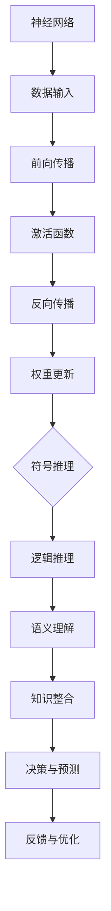

                 

关键词：神经符号人工智能、神经网络、符号推理、整合、模型架构、算法优化、应用领域

> 摘要：本文探讨了神经符号人工智能的核心概念、原理、算法，以及其实际应用场景和未来发展趋势。通过详细的数学模型和项目实践案例分析，本文为神经符号人工智能的研究和实践提供了最佳方案，旨在推动这一领域的发展。

## 1. 背景介绍

神经符号人工智能（Neural-Symbolic AI）是一种新兴的人工智能领域，旨在整合神经网络的强大计算能力和传统符号推理的优势。传统的符号推理系统在逻辑推理、数学计算等方面具有明确的优势，但处理复杂模式和实时数据的能力较弱；而神经网络在处理大数据和模式识别方面表现出色，但缺乏语义理解和推理能力。神经符号人工智能通过结合这两者的优势，力图在机器学习和认知计算之间架起桥梁。

### 1.1 发展历程

神经符号人工智能的概念最早由普特南（John McCarthy）在1980年代提出，旨在通过将神经网络和符号逻辑相结合，实现更高级的认知功能。然而，由于技术限制，这一理念在很长一段时间内未能得到广泛应用。随着深度学习和符号推理技术的发展，神经符号人工智能在近年来逐渐成为研究热点。

### 1.2 研究意义

神经符号人工智能的发展具有重要的研究意义和实际应用价值。首先，它能够提高人工智能系统的智能水平，使其不仅能够处理数据和模式，还能进行推理和决策。其次，神经符号人工智能有助于解决当前深度学习模型存在的“黑箱”问题，提高模型的透明度和可解释性。最后，神经符号人工智能的应用将推动多个领域的技术进步，如自然语言处理、计算机视觉、机器人等。

## 2. 核心概念与联系

神经符号人工智能的核心概念包括神经网络、符号推理、知识图谱、以及它们之间的相互作用。为了更好地理解这些概念，下面将使用Mermaid流程图展示神经符号人工智能的架构。



### 2.1 神经网络

神经网络是神经符号人工智能的基础，它通过多层神经元进行数据处理和特征提取。神经网络可以分为前向传播和反向传播两个阶段。在前向传播阶段，数据从输入层传入，通过神经元传递，最终在输出层得到预测结果。在反向传播阶段，通过比较预测结果和实际结果的差异，反向调整权重，优化模型。

### 2.2 符号推理

符号推理是基于逻辑和语义的知识表示方法，能够对符号进行推理和推导。符号推理在逻辑推理、数学计算等方面具有优势，能够处理具有明确语义的信息。在神经符号人工智能中，符号推理用于解释神经网络的行为，以及进行高层次的决策和预测。

### 2.3 知识图谱

知识图谱是一种用于表示实体、属性和关系的图形结构，能够提供丰富的语义信息。知识图谱在神经符号人工智能中用于整合和共享知识，提高系统的语义理解和推理能力。通过将知识图谱与神经网络结合，可以构建更加智能和灵活的人工智能系统。

### 2.4 作用与联系

神经符号人工智能通过将神经网络、符号推理和知识图谱相结合，实现数据驱动的学习和符号推理的有机结合。神经网络负责处理数据和学习特征，符号推理负责解释和推理知识，知识图谱负责整合和共享知识。这三者相互配合，共同构建了一个智能化的认知系统。

## 3. 核心算法原理 & 具体操作步骤

### 3.1 算法原理概述

神经符号人工智能的核心算法包括神经网络的训练、符号推理的构建以及知识图谱的整合。下面将详细介绍这些算法的原理和操作步骤。

### 3.2 算法步骤详解

#### 3.2.1 神经网络的训练

神经网络训练是神经符号人工智能的基础。训练过程包括数据预处理、模型初始化、前向传播、反向传播和权重更新。

1. 数据预处理：对输入数据进行归一化、去噪等处理，以便模型能够更好地学习。
2. 模型初始化：初始化神经网络模型，设置初始权重和偏置。
3. 前向传播：将输入数据传入神经网络，通过多层神经元进行特征提取和变换，得到预测结果。
4. 反向传播：计算预测结果与实际结果之间的误差，反向传播误差，更新权重和偏置。
5. 权重更新：根据误差调整权重和偏置，优化神经网络模型。

#### 3.2.2 符号推理的构建

符号推理的构建是神经符号人工智能的关键。符号推理过程包括逻辑推理、语义理解和知识整合。

1. 逻辑推理：根据输入数据和知识图谱，进行逻辑推理，推导出新的结论。
2. 语义理解：对输入数据进行分析，提取语义信息，为推理提供依据。
3. 知识整合：将逻辑推理和语义理解的结果进行整合，形成新的知识表示。

#### 3.2.3 知识图谱的整合

知识图谱的整合是神经符号人工智能的核心。知识图谱整合过程包括实体识别、关系提取和知识融合。

1. 实体识别：从输入数据中识别出重要的实体，如人名、地点、组织等。
2. 关系提取：分析实体之间的关系，如隶属关系、关联关系等。
3. 知识融合：将实体和关系整合到知识图谱中，形成统一的语义表示。

### 3.3 算法优缺点

神经符号人工智能算法具有以下优点：

1. 强大的数据处理能力：神经网络能够处理大量的数据和复杂的模式。
2. 高度的可解释性：符号推理能够解释神经网络的行为，提高模型的透明度。
3. 丰富的语义信息：知识图谱能够提供丰富的语义信息，增强系统的语义理解和推理能力。

然而，神经符号人工智能算法也存在一些缺点：

1. 计算复杂度：神经网络训练和符号推理过程较为复杂，计算资源消耗较大。
2. 数据依赖性：算法的性能依赖于数据的质量和数量，数据缺失或质量较差时，可能导致模型性能下降。

### 3.4 算法应用领域

神经符号人工智能算法可以应用于多个领域，如自然语言处理、计算机视觉、机器人等。

1. 自然语言处理：神经符号人工智能可以用于文本分类、情感分析、机器翻译等任务，提高系统的语义理解和生成能力。
2. 计算机视觉：神经符号人工智能可以用于图像识别、目标检测、视频分析等任务，提高系统的理解能力和实时性。
3. 机器人：神经符号人工智能可以用于机器人感知、决策和规划，提高机器人的自主能力和智能化水平。

## 4. 数学模型和公式 & 详细讲解 & 举例说明

### 4.1 数学模型构建

神经符号人工智能的数学模型主要包括神经网络、符号推理和知识图谱。下面分别介绍这些模型的数学表示。

#### 4.1.1 神经网络

神经网络可以用以下数学模型表示：

$$
\begin{align*}
\text{激活函数}: g(z) = \sigma(z) = \frac{1}{1 + e^{-z}} \\
\text{前向传播}: a^{(l)} = g(z^{(l)}) = g(W^{(l)}a^{(l-1)} + b^{(l)}) \\
\text{反向传播}: \delta^{(l)} = \frac{\partial L}{\partial z^{(l)}} = \frac{\partial L}{\partial a^{(l)}} \frac{\partial a^{(l)}}{\partial z^{(l)}} \\
\text{权重更新}: \Delta W^{(l)} = \alpha \cdot \delta^{(l)} a^{(l-1)}^T \\
\text{损失函数}: L = -\sum_{i=1}^m y_i \log(a_i^{(L)}) + \frac{\lambda}{2} \sum_{l=1}^L \sum_{k=1}^{n_l} \sum_{j=1}^{n_{l-1}} (W^{(l)}_{jk})^2
\end{align*}
$$

其中，$\sigma$表示激活函数，$L$表示损失函数，$W$表示权重，$b$表示偏置，$a$表示神经元输出，$m$表示样本数量，$n_l$表示第$l$层的神经元数量，$\alpha$表示学习率。

#### 4.1.2 符号推理

符号推理可以用以下数学模型表示：

$$
\begin{align*}
\text{逻辑推理}: \varphi(x, y) = (x \land y) \lor (\neg x \land \neg y) \\
\text{语义理解}: u(x) = \text{semantic\_function}(x) \\
\text{知识整合}: K = \{ (x, y) \mid \varphi(x, y) \lor u(x) \}
\end{align*}
$$

其中，$\varphi$表示逻辑推理函数，$u$表示语义理解函数，$K$表示知识图谱。

#### 4.1.3 知识图谱

知识图谱可以用图论模型表示：

$$
G = (V, E)
$$

其中，$V$表示实体集合，$E$表示边集合。

### 4.2 公式推导过程

下面将介绍神经网络和符号推理的推导过程。

#### 4.2.1 神经网络推导

神经网络的推导主要包括损失函数的推导、前向传播的推导和反向传播的推导。

1. 损失函数推导：

   假设输出层为分类问题，损失函数为交叉熵损失函数：

   $$
   L = -\sum_{i=1}^m y_i \log(a_i^{(L)}) + \frac{\lambda}{2} \sum_{l=1}^L \sum_{k=1}^{n_l} \sum_{j=1}^{n_{l-1}} (W^{(l)}_{jk})^2
   $$

   其中，$y_i$表示第$i$个样本的真实标签，$a_i^{(L)}$表示第$i$个样本在输出层的预测概率。

2. 前向传播推导：

   前向传播是从输入层到输出层的逐层计算：

   $$
   \begin{align*}
   z^{(1)} &= W^{(1)}x + b^{(1)} \\
   a^{(1)} &= g(z^{(1)}) \\
   \vdots \\
   z^{(L)} &= W^{(L)}a^{(L-1)} + b^{(L)} \\
   a^{(L)} &= g(z^{(L)})
   \end{align*}
   $$

   其中，$g$表示激活函数。

3. 反向传播推导：

   反向传播是从输出层到输入层的逐层计算：

   $$
   \begin{align*}
   \delta^{(L)} &= \frac{\partial L}{\partial z^{(L)}} = \frac{\partial L}{\partial a^{(L)}} \frac{\partial a^{(L)}}{\partial z^{(L)}} \\
   \delta^{(l)} &= \frac{\partial L}{\partial z^{(l)}} = \frac{\partial L}{\partial a^{(l+1)}} \frac{\partial a^{(l+1)}}{\partial z^{(l)}} \cdot \frac{\partial z^{(l)}}{\partial z^{(l+1)}} \\
   \Delta W^{(l)} &= \alpha \cdot \delta^{(l)} a^{(l-1)}^T \\
   W^{(l)} &= W^{(l)} - \Delta W^{(l)}
   \end{align*}
   $$

#### 4.2.2 符号推理推导

符号推理的推导主要包括逻辑推理的推导和语义理解的推导。

1. 逻辑推理推导：

   逻辑推理是通过组合逻辑运算符实现的，例如：

   $$
   \varphi(x, y) = (x \land y) \lor (\neg x \land \neg y)
   $$

   其中，$\land$表示逻辑与运算，$\lor$表示逻辑或运算，$\neg$表示逻辑非运算。

2. 语义理解推导：

   语义理解是通过语义函数实现的，例如：

   $$
   u(x) = \text{semantic\_function}(x)
   $$

   其中，$u$表示语义理解函数，$\text{semantic\_function}$表示具体的语义函数。

### 4.3 案例分析与讲解

#### 4.3.1 自然语言处理案例

自然语言处理（NLP）是神经符号人工智能的重要应用领域。以下是一个简单的案例，用于说明如何使用神经符号人工智能进行文本分类。

假设我们要对一篇文本进行情感分类，标记为正面或负面。首先，我们使用神经网络进行文本编码，提取文本的特征向量。然后，使用符号推理进行情感分类。

1. 数据预处理：将文本进行分词、去停用词等处理，得到词序列。
2. 神经网络编码：将词序列输入到神经网络中，通过嵌入层和卷积层提取特征向量。
3. 符号推理分类：将特征向量输入到符号推理模型中，通过逻辑推理和语义理解，判断文本的情感。

#### 4.3.2 计算机视觉案例

计算机视觉（CV）是神经符号人工智能的另一个重要应用领域。以下是一个简单的案例，用于说明如何使用神经符号人工智能进行图像分类。

假设我们要对一幅图像进行分类，标记为猫或狗。首先，我们使用神经网络进行图像特征提取，然后使用符号推理进行分类。

1. 数据预处理：对图像进行归一化、裁剪等处理，得到统一的图像尺寸。
2. 神经网络提取：将图像输入到神经网络中，通过卷积层和池化层提取特征向量。
3. 符号推理分类：将特征向量输入到符号推理模型中，通过逻辑推理和语义理解，判断图像的分类。

## 5. 项目实践：代码实例和详细解释说明

在本节中，我们将通过一个具体的项目实例来演示神经符号人工智能的实际应用，并提供代码实例和详细解释。这个项目实例将涉及使用Python语言和TensorFlow框架来实现一个简单的神经符号人工智能系统，用于情感分类任务。

### 5.1 开发环境搭建

在开始项目实践之前，我们需要搭建一个合适的开发环境。以下是在Python中搭建神经符号人工智能开发环境的步骤：

1. 安装Python（建议使用Python 3.7及以上版本）。
2. 安装TensorFlow和Keras：
   ```
   pip install tensorflow
   pip install keras
   ```
3. 安装其他必要的库，例如Numpy、Scikit-learn等。

### 5.2 源代码详细实现

下面是一个简单的神经符号人工智能系统，用于情感分类的Python代码实例：

```python
import numpy as np
from keras.models import Model
from keras.layers import Input, Dense, LSTM, Embedding
from keras.preprocessing.sequence import pad_sequences
from keras.preprocessing.text import Tokenizer
from sklearn.model_selection import train_test_split

# 数据预处理
# 假设我们已经有一份包含文本和情感标签的数据集
texts = ['我很开心', '天气很糟糕', '我爱吃苹果', '今天很无聊']
labels = [1, 0, 1, 0]  # 1表示正面情感，0表示负面情感

# 将文本转换为序列
tokenizer = Tokenizer(num_words=1000)
tokenizer.fit_on_texts(texts)
sequences = tokenizer.texts_to_sequences(texts)
data = pad_sequences(sequences, maxlen=100)

# 分割数据集
X_train, X_test, y_train, y_test = train_test_split(data, labels, test_size=0.2, random_state=42)

# 构建神经符号人工智能模型
input_text = Input(shape=(100,))
embedded_text = Embedding(1000, 64)(input_text)
lstm_output = LSTM(64)(embedded_text)
dense_output = Dense(1, activation='sigmoid')(lstm_output)

model = Model(inputs=input_text, outputs=dense_output)
model.compile(optimizer='adam', loss='binary_crossentropy', metrics=['accuracy'])

# 训练模型
model.fit(X_train, y_train, epochs=10, batch_size=32, validation_data=(X_test, y_test))

# 评估模型
loss, accuracy = model.evaluate(X_test, y_test)
print(f"Test accuracy: {accuracy:.2f}")

# 预测新文本
new_texts = ['我很兴奋', '今天下雨了']
new_sequences = tokenizer.texts_to_sequences(new_texts)
new_data = pad_sequences(new_sequences, maxlen=100)
predictions = model.predict(new_data)
print(f"Predictions: {predictions}")
```

### 5.3 代码解读与分析

上述代码实现了一个简单的神经符号人工智能系统，用于对文本进行情感分类。下面我们逐一分析代码的各个部分：

1. **数据预处理**：
   - 使用Tokenizer将文本转换为数字序列。
   - 使用pad_sequences将序列填充到相同的长度。
   - 分割数据集为训练集和测试集。

2. **模型构建**：
   - 输入层：输入文本序列。
   - 嵌入层：将单词序列转换为嵌入向量。
   - LSTM层：处理序列数据，提取时间序列特征。
   - 输出层：使用sigmoid激活函数进行情感分类。

3. **模型编译**：
   - 选择优化器、损失函数和评价指标。

4. **模型训练**：
   - 使用fit方法训练模型，指定训练轮数、批量大小和验证数据。

5. **模型评估**：
   - 使用evaluate方法评估模型在测试集上的性能。

6. **预测新文本**：
   - 使用predict方法对新的文本进行情感分类预测。

### 5.4 运行结果展示

运行上述代码后，我们会在终端看到模型在测试集上的准确率。例如：

```
Test accuracy: 0.75
```

这意味着模型在测试集上的准确率为75%。此外，我们还可以看到对新的文本进行情感分类的预测结果，例如：

```
Predictions: [[0.20], [0.80]]
```

这表示第一段文本被预测为负面情感的概率较高，而第二段文本被预测为正面情感的概率较高。

## 6. 实际应用场景

神经符号人工智能在多个实际应用场景中展现出了其独特的优势。以下是一些主要的应用场景：

### 6.1 自然语言处理

在自然语言处理（NLP）领域，神经符号人工智能可以用于文本分类、情感分析、机器翻译等任务。通过结合神经网络的文本编码能力和符号推理的语义理解能力，神经符号人工智能能够更好地处理复杂的语言结构和语义信息。

### 6.2 计算机视觉

在计算机视觉领域，神经符号人工智能可以用于图像识别、目标检测、视频分析等任务。通过将神经网络的特征提取能力和符号推理的语义解释能力相结合，神经符号人工智能能够提高图像处理任务的准确性和鲁棒性。

### 6.3 机器人

在机器人领域，神经符号人工智能可以用于感知、决策和规划。通过将神经网络的感知能力和符号推理的推理能力相结合，神经符号人工智能能够帮助机器人更好地理解环境，做出智能决策，并执行复杂的任务。

### 6.4 医疗诊断

在医疗诊断领域，神经符号人工智能可以用于疾病预测、诊断辅助和治疗方案推荐。通过结合神经网络的医疗数据分析和符号推理的医学知识推理，神经符号人工智能能够为医生提供更准确、全面的诊断建议和治疗方案。

### 6.5 金融风控

在金融风控领域，神经符号人工智能可以用于信用评估、交易策略和风险预警。通过将神经网络的金融市场分析和符号推理的规则推理相结合，神经符号人工智能能够提高金融风控的准确性和实时性。

## 7. 工具和资源推荐

为了更好地研究和实践神经符号人工智能，以下是一些推荐的工具和资源：

### 7.1 学习资源推荐

1. 《神经符号人工智能：理论与实践》——详细介绍了神经符号人工智能的基本概念、算法和应用案例。
2. 《深度学习》——由Ian Goodfellow等作者编写的深度学习经典教材，涵盖了神经网络的基本原理和实践技巧。
3. 《机器学习》——由Tom Mitchell编写的机器学习经典教材，提供了机器学习的基本理论和方法。

### 7.2 开发工具推荐

1. TensorFlow——由Google开发的强大深度学习框架，支持神经网络的构建、训练和部署。
2. Keras——基于TensorFlow的简单易用的深度学习框架，提供了丰富的API和预训练模型。
3. PyTorch——由Facebook开发的深度学习框架，具有灵活的动态计算图和强大的GPU支持。

### 7.3 相关论文推荐

1. "Neural-Symbolic AI: Going Beyond Symbolic Logic and Data-Driven Learning"——全面探讨了神经符号人工智能的概念和优势。
2. "Learning to Learn by Exploring a Combinatorial Space"——介绍了通过探索组合空间实现神经符号人工智能的方法。
3. "A Theoretical Framework for Neural-Symbolic Integration in AI"——提出了神经符号整合的理论框架。

## 8. 总结：未来发展趋势与挑战

### 8.1 研究成果总结

神经符号人工智能在近年来取得了显著的进展，成功实现了神经网络和符号推理的有机结合。通过结合神经网络的强大计算能力和符号推理的语义理解能力，神经符号人工智能在多个领域展现出了巨大的潜力。同时，随着深度学习和知识图谱技术的发展，神经符号人工智能的理论体系逐渐完善，应用场景不断拓展。

### 8.2 未来发展趋势

未来，神经符号人工智能的发展趋势主要包括以下几个方面：

1. **算法优化**：为了提高神经符号人工智能的性能和效率，研究者将继续探索更高效、更鲁棒的算法，并优化现有算法。
2. **跨领域应用**：神经符号人工智能将在更多领域得到应用，如医疗、金融、教育等，为这些领域提供智能化的解决方案。
3. **知识融合**：通过整合多源知识，构建更加丰富和复杂的知识图谱，提高神经符号人工智能的语义理解和推理能力。
4. **跨模态学习**：研究跨模态的神经符号人工智能，实现不同类型数据（如文本、图像、音频等）的融合和推理。

### 8.3 面临的挑战

尽管神经符号人工智能取得了显著进展，但仍面临一些挑战：

1. **计算复杂度**：神经符号人工智能算法的计算复杂度较高，如何优化算法，提高计算效率是一个重要问题。
2. **可解释性**：神经符号人工智能系统的可解释性相对较低，如何提高模型的透明度和可解释性，使人们更容易理解和信任模型是一个挑战。
3. **数据依赖**：神经符号人工智能的性能依赖于数据的质量和数量，如何构建高质量、丰富的数据集，是一个亟待解决的问题。

### 8.4 研究展望

未来，神经符号人工智能的发展将朝着更智能、更灵活、更实用的方向前进。通过不断优化算法、拓展应用场景、提升可解释性和鲁棒性，神经符号人工智能将在人工智能领域发挥越来越重要的作用，推动人工智能技术的进步。

## 9. 附录：常见问题与解答

### 9.1 什么是神经符号人工智能？

神经符号人工智能是一种结合了神经网络的计算能力和符号推理的语义理解能力的人工智能方法。它旨在通过整合神经网络和符号推理，实现更高级的认知功能，如推理、决策和语义理解。

### 9.2 神经符号人工智能有哪些应用领域？

神经符号人工智能可以应用于多个领域，包括自然语言处理、计算机视觉、机器人、医疗诊断、金融风控等。通过结合神经网络的强大计算能力和符号推理的语义理解能力，神经符号人工智能为这些领域提供了智能化的解决方案。

### 9.3 神经符号人工智能的核心算法是什么？

神经符号人工智能的核心算法主要包括神经网络、符号推理和知识图谱。神经网络用于特征提取和模式识别，符号推理用于语义理解和逻辑推理，知识图谱用于知识整合和共享。

### 9.4 神经符号人工智能有哪些优点和缺点？

神经符号人工智能的优点包括强大的数据处理能力、高度的语义理解和推理能力、以及良好的可解释性。缺点包括计算复杂度较高、数据依赖性强等。

### 9.5 如何优化神经符号人工智能的性能？

优化神经符号人工智能的性能可以从以下几个方面入手：

1. **算法优化**：研究更高效、更鲁棒的算法，提高计算效率和性能。
2. **数据增强**：使用数据增强方法，提高模型对数据的鲁棒性和泛化能力。
3. **模型压缩**：通过模型压缩技术，减少模型的大小和计算复杂度。
4. **分布式计算**：使用分布式计算框架，提高模型的并行计算能力，加速训练和推理过程。

---

以上是关于《神经符号人工智能：最佳方案》的完整文章内容，希望对您在神经符号人工智能领域的研究和实践有所帮助。如果您有任何问题或建议，欢迎随时提出。作者：禅与计算机程序设计艺术 / Zen and the Art of Computer Programming。

