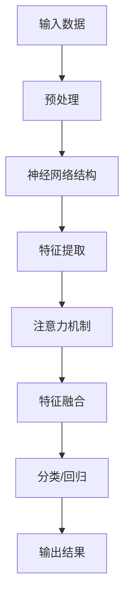

                 

  
神经网络（Neural Networks，NN）作为一种模拟人脑结构和功能的计算模型，在过去的几十年中取得了显著的进展。特别是在注意力模式识别（Attention-based Pattern Recognition）领域，神经网络展现出了强大的学习能力和广泛的应用前景。本文旨在探讨神经网络在注意力模式识别中的创新，包括核心概念、算法原理、数学模型、实践应用等多个方面，以期为相关领域的研究者和开发者提供有价值的参考。

## 关键词

- 神经网络
- 注意力机制
- 模式识别
- 机器学习
- 深度学习

## 摘要

本文首先介绍了神经网络的基本概念和注意力机制在模式识别中的应用背景。随后，详细阐述了神经网络在注意力模式识别中的核心算法原理，并通过Mermaid流程图展示了相关架构。接着，文章深入分析了神经网络在模式识别中的具体操作步骤，以及其优缺点和应用领域。在此基础上，文章进一步探讨了神经网络在模式识别中的数学模型和公式，并通过案例分析与讲解帮助读者理解。随后，文章通过实际项目实践展示了神经网络的代码实例和运行结果。最后，文章总结了神经网络在注意力模式识别领域的实际应用场景和未来展望，并推荐了相关的学习资源和开发工具。

## 1. 背景介绍

### 神经网络的历史与发展

神经网络起源于1940年代，由心理学家McCulloch和数学家Pitts提出了一种简化的神经元模型，即MP模型，标志着神经网络研究的开端。随后，在1950年代，Rosenblatt提出了感知机（Perceptron）算法，使得神经网络开始应用于简单的分类问题。然而，由于学习算法的局限性，神经网络在接下来的几十年中并未取得显著进展。

直到1986年，Rumelhart、Hinton和Williams等人提出了反向传播算法（Backpropagation Algorithm），使得神经网络能够学习复杂的非线性函数。这一突破性进展为神经网络在深度学习领域的应用奠定了基础。1990年代，Hinton等人进一步提出了深度信念网络（Deep Belief Network，DBN），为深度学习的研究打开了新的大门。

进入21世纪，随着计算能力的提升和数据量的爆发式增长，深度学习（Deep Learning，DL）逐渐成为人工智能领域的热点。神经网络，特别是卷积神经网络（Convolutional Neural Network，CNN）和循环神经网络（Recurrent Neural Network，RNN）等深度学习模型，在图像识别、语音识别、自然语言处理等领域取得了显著成果。

### 注意力模式识别的概念

注意力模式识别（Attention-based Pattern Recognition）是一种基于注意力机制的模式识别方法。注意力机制源于心理学研究，旨在模拟人类在感知过程中对特定信息进行聚焦的能力。在模式识别领域，注意力机制被用于提高识别准确率和处理速度。

注意力机制的关键在于动态调整模型对输入数据的关注程度。具体来说，通过引入注意力权重，模型可以根据输入数据的重要程度，自适应地调整处理资源的分配。这种机制在处理高维数据时，能够有效减少计算量，提高模型效率。

### 神经网络在注意力模式识别中的应用

神经网络在注意力模式识别中的应用主要体现在两个方面：一是通过神经网络学习输入数据的特征表示，提高识别精度；二是通过注意力机制优化模型结构，提高处理效率。

首先，神经网络通过多层非线性变换，能够自动学习输入数据的抽象特征表示。这些特征表示不仅能够提高模式识别的准确率，还能够适应不同类型的数据和任务。例如，在图像识别任务中，神经网络可以自动学习图像中的边缘、纹理和形状等关键特征，从而实现高效的分类和检测。

其次，注意力机制能够优化神经网络的结构，提高模型的处理效率。通过动态调整神经网络对输入数据的关注程度，注意力机制能够减少不必要的计算，降低模型复杂度。例如，在语音识别任务中，注意力机制可以动态调整模型对语音信号的关注范围，从而提高识别的准确率和速度。

总之，神经网络在注意力模式识别中具有广泛的应用前景。通过结合注意力机制，神经网络能够更好地处理高维数据，提高模式识别的效率和精度。随着深度学习和注意力机制的不断研究和发展，神经网络在注意力模式识别领域有望取得更多的突破。

## 2. 核心概念与联系

### 神经网络的基本概念

神经网络（Neural Networks，NN）是一种由大量简单计算单元（即神经元）互联而成的复杂计算系统，能够模拟人脑的信息处理过程。每个神经元接受多个输入信号，通过加权求和处理后，产生一个输出信号。神经元的输出信号可以传递给其他神经元，从而形成复杂的网络结构。

神经网络的基本结构包括输入层、隐藏层和输出层。输入层接收外部输入数据，隐藏层对输入数据进行处理和变换，输出层产生最终输出结果。隐藏层的数量和神经元数目可以根据任务需求进行调整。

### 注意力机制的概念

注意力机制（Attention Mechanism）是近年来在机器学习领域得到广泛关注的一种机制，旨在通过动态调整模型对输入数据的关注程度，提高处理效率和识别精度。注意力机制的核心思想是赋予不同输入数据不同的权重，从而在计算过程中更加关注重要的信息。

在神经网络中，注意力机制通常通过引入注意力权重来实现。这些权重可以根据输入数据的特征和任务需求进行动态调整。注意力机制的应用范围广泛，包括自然语言处理、计算机视觉、语音识别等领域。

### 神经网络与注意力机制的联系

神经网络与注意力机制之间存在密切的联系。首先，神经网络通过多层非线性变换，能够自动学习输入数据的特征表示。这些特征表示有助于模型在处理高维数据时，更加关注关键信息，从而提高识别精度和效率。

其次，注意力机制作为神经网络的一种补充，能够进一步优化模型结构。通过动态调整神经网络对输入数据的关注程度，注意力机制能够减少不必要的计算，降低模型复杂度。例如，在图像识别任务中，注意力机制可以动态调整模型对图像中不同区域的关注程度，从而提高识别的准确率和速度。

总之，神经网络与注意力机制的结合，为模式识别领域带来了新的机遇。通过神经网络自动学习特征表示，以及注意力机制动态调整关注程度，模型能够更好地处理高维数据，实现高效的模式识别。

### Mermaid 流程图



在这个流程图中，输入数据经过预处理后输入神经网络结构。神经网络通过多层特征提取和注意力机制，对输入数据进行分析和融合。最终，模型输出分类或回归结果。

### 注意力机制的详细解释

注意力机制是一种在神经网络中引入的动态权重调整机制，其核心目的是通过自适应地分配计算资源，提高模型在处理高维数据时的效率和准确性。以下是注意力机制的详细解释：

1. **动态权重分配**：
   在传统的神经网络中，每个输入特征都会被同等对待，没有考虑到特征之间的差异性和重要性。而注意力机制通过引入注意力权重，对每个输入特征赋予不同的权重，使得模型能够更加关注重要的信息。

2. **权重计算方法**：
   注意力机制的权重计算方法可以采用多种形式，常见的有点积注意力（Dot-Product Attention）、加性注意力（Additive Attention）和缩放点积注意力（Scaled Dot-Product Attention）等。点积注意力通过计算输入特征和查询向量的点积来生成权重；加性注意力通过加法运算生成权重；缩放点积注意力则通过缩放点积来生成权重，避免了梯度消失问题。

3. **应用场景**：
   注意力机制在多个领域得到了广泛应用，如自然语言处理、计算机视觉和语音识别等。在自然语言处理中，注意力机制可以帮助模型更好地理解句子中的关键信息，提高翻译和文本生成任务的准确性。在计算机视觉中，注意力机制可以用于目标检测和图像分割，提高模型对目标区域的关注程度。在语音识别中，注意力机制可以帮助模型更好地处理语音信号的时变特性，提高识别的准确性。

4. **优势与挑战**：
   注意力机制的优势在于其灵活性和适应性，能够根据任务需求动态调整模型对输入数据的关注程度。然而，注意力机制也存在一些挑战，如计算复杂度高、参数调优困难等。此外，注意力机制的设计和实现需要综合考虑模型结构、数据特性和任务目标等因素。

### 实例解析

以自然语言处理中的序列到序列（Seq2Seq）模型为例，注意力机制可以帮助模型在生成目标序列时更好地关注输入序列的关键信息。具体来说，在Seq2Seq模型中，编码器（Encoder）对输入序列进行处理，生成编码表示；解码器（Decoder）在生成目标序列时，可以通过注意力机制动态关注编码表示的不同部分。

假设输入序列为 `[w1, w2, w3, w4, w5]`，目标序列为 `[y1, y2, y3, y4, y5]`。在解码器生成每个单词时，可以通过注意力机制计算输入序列中每个单词的注意力权重。具体步骤如下：

1. **编码表示**：
   编码器对输入序列 `[w1, w2, w3, w4, w5]` 进行编码，生成编码表示 `[e1, e2, e3, e4, e5]`。

2. **查询向量**：
   在解码器生成每个单词时，生成当前解码状态的查询向量 `[q1, q2, q3, q4, q5]`。

3. **注意力权重计算**：
   计算每个编码表示与查询向量的点积，得到注意力权重 `[w1, w2, w3, w4, w5]`。这些权重反映了输入序列中每个单词的重要性。

4. **加权求和**：
   将注意力权重与编码表示进行加权求和，得到加权编码表示 `[e'1, e'2, e'3, e'4, e'5]`。

5. **生成输出**：
   解码器根据加权编码表示生成当前单词 `[y1, y2, y3, y4, y5]`。

通过上述步骤，注意力机制帮助解码器在生成目标序列时，动态关注输入序列的关键信息，从而提高生成序列的准确性和连贯性。

综上所述，注意力机制在神经网络中具有重要的地位，通过动态调整模型对输入数据的关注程度，能够显著提高模式识别的效率和准确性。在接下来的章节中，我们将进一步探讨神经网络在注意力模式识别中的具体应用和实现。

## 3. 核心算法原理 & 具体操作步骤

### 3.1 算法原理概述

神经网络在注意力模式识别中的核心算法原理主要包括两部分：神经网络的基本结构和工作原理，以及注意力机制的引入和应用。以下将分别进行详细阐述。

#### 神经网络的基本结构和工作原理

神经网络由多个层次构成，包括输入层、隐藏层和输出层。输入层接收外部输入数据，隐藏层对输入数据进行处理和变换，输出层产生最终输出结果。神经元的连接方式可以是全连接或局部连接，具体取决于任务需求。

在神经网络中，每个神经元通过加权求和处理其输入信号，并加上一个偏置项，然后通过激活函数进行非线性变换。常见的激活函数包括sigmoid函数、ReLU函数和Tanh函数等。

神经网络的工作原理是通过不断调整神经元之间的连接权重和偏置项，使得模型能够对输入数据进行正确的分类或预测。这一过程称为训练。在训练过程中，神经网络通过反向传播算法计算误差，并利用梯度下降法更新网络参数。

#### 注意力机制的引入和应用

注意力机制是一种动态调整模型对输入数据关注程度的机制，其核心思想是通过计算输入数据之间的相关性，为每个数据分配不同的权重。这种权重可以指导模型在处理高维数据时，更加关注重要的信息，从而提高识别精度和效率。

注意力机制在神经网络中的应用可以分为以下几个步骤：

1. **编码阶段**：将输入数据通过编码器进行编码，生成编码表示。编码器可以是全连接层、卷积层或循环层等，具体取决于输入数据的类型和任务需求。

2. **查询阶段**：在解码阶段，生成当前解码状态的查询向量。查询向量反映了解码器当前的状态，用于计算注意力权重。

3. **注意力权重计算**：计算查询向量与编码表示之间的点积或加性运算，得到注意力权重。这些权重反映了输入数据在当前解码状态下的重要性。

4. **加权求和阶段**：将注意力权重与编码表示进行加权求和，得到加权编码表示。加权编码表示包含了对输入数据的动态关注，能够提高模型对关键信息的识别能力。

5. **解码阶段**：利用加权编码表示生成当前输出，并更新解码器的状态。这一过程循环进行，直至生成完整的输出序列。

### 3.2 算法步骤详解

#### 编码阶段

在编码阶段，输入数据通过编码器进行编码，生成编码表示。编码器的选择取决于输入数据的类型和任务需求。例如，在图像识别任务中，可以使用卷积层进行编码；在自然语言处理任务中，可以使用循环层进行编码。

编码器的输入是一个多维数组，表示输入数据。通过多个卷积层或循环层，编码器将输入数据逐渐压缩成一个低维表示，即编码表示。编码表示包含了输入数据的特征信息，能够指导模型在后续阶段进行模式识别。

#### 查询阶段

在解码阶段，解码器生成当前解码状态的查询向量。查询向量反映了解码器当前的状态，用于计算注意力权重。查询向量可以通过全连接层或循环层生成。

解码器的输入是编码表示和当前解码状态的查询向量。通过计算查询向量与编码表示之间的点积或加性运算，得到注意力权重。这些权重反映了输入数据在当前解码状态下的重要性。

#### 注意力权重计算

注意力权重计算是注意力机制的核心步骤。在计算注意力权重时，可以使用点积注意力、加性注意力和缩放点积注意力等不同方法。

1. **点积注意力**：计算查询向量与编码表示之间的点积，得到注意力权重。点积注意力简单高效，但容易发生梯度消失问题。

2. **加性注意力**：通过加性运算生成注意力权重。加性注意力可以缓解梯度消失问题，但计算复杂度较高。

3. **缩放点积注意力**：在点积注意力基础上，引入缩放因子，以缓解梯度消失问题。缩放点积注意力在BERT模型中得到了广泛应用。

#### 加权求和阶段

在加权求和阶段，将注意力权重与编码表示进行加权求和，得到加权编码表示。加权编码表示包含了对输入数据的动态关注，能够提高模型对关键信息的识别能力。

加权编码表示是解码器的输入，用于生成当前输出。解码器可以通过全连接层、循环层或自注意力机制等生成当前输出。生成当前输出后，解码器的状态会更新，用于生成下一个输出。

#### 解码阶段

在解码阶段，利用加权编码表示生成当前输出，并更新解码器的状态。这一过程循环进行，直至生成完整的输出序列。解码阶段的输出可以是分类结果、回归值或序列生成等，具体取决于任务类型。

### 3.3 算法优缺点

#### 优点

1. **高识别精度**：通过自动学习输入数据的特征表示，神经网络能够对复杂模式进行准确识别。
2. **适应性强**：神经网络可以处理不同类型的数据和任务，具有良好的适应性。
3. **动态调整**：注意力机制能够动态调整模型对输入数据的关注程度，提高处理效率。

#### 缺点

1. **计算复杂度高**：神经网络和注意力机制的计算复杂度较高，对计算资源和时间有一定要求。
2. **参数调优困难**：神经网络和注意力机制的参数调优需要大量实验，具有一定的复杂性。

### 3.4 算法应用领域

神经网络和注意力机制在多个领域得到了广泛应用，包括但不限于以下领域：

1. **计算机视觉**：用于图像分类、目标检测、图像分割等任务。
2. **自然语言处理**：用于文本分类、机器翻译、情感分析等任务。
3. **语音识别**：用于语音信号处理、语音识别、语音合成等任务。
4. **推荐系统**：用于用户行为分析、商品推荐等任务。

综上所述，神经网络在注意力模式识别中具有核心地位。通过神经网络自动学习特征表示，以及注意力机制动态调整关注程度，模型能够更好地处理高维数据，实现高效的模式识别。在接下来的章节中，我们将进一步探讨神经网络在注意力模式识别中的具体应用案例和实现细节。

## 4. 数学模型和公式 & 详细讲解 & 举例说明

### 4.1 数学模型构建

神经网络在注意力模式识别中的数学模型主要包括输入层、隐藏层和输出层。每个层次都由多个神经元组成，神经元之间通过加权连接进行信息传递。

#### 输入层

输入层接收外部输入数据，通常表示为 $x \in \mathbb{R}^{n}$，其中 $n$ 为输入数据的维度。输入层的每个神经元接收一个输入数据，并将其传递给隐藏层。

#### 隐藏层

隐藏层对输入数据进行处理和变换，生成新的特征表示。隐藏层的每个神经元接收多个输入数据，通过加权求和处理和激活函数变换，生成输出。设隐藏层共有 $L$ 个神经元，其输出为 $h \in \mathbb{R}^{L}$。

隐藏层的神经元 $j$ 的输出可以表示为：

$$
h_j = \sigma(\sum_{i=1}^{n} w_{ij} x_i + b_j)
$$

其中，$w_{ij}$ 为神经元 $i$ 到神经元 $j$ 的连接权重，$b_j$ 为神经元 $j$ 的偏置项，$\sigma$ 为激活函数，常用的激活函数有 sigmoid 函数、ReLU 函数和 tanh 函数。

#### 输出层

输出层生成最终输出结果，用于模式识别或预测。输出层的每个神经元接收隐藏层的输出，通过加权求和处理和激活函数变换，生成输出。设输出层共有 $M$ 个神经元，其输出为 $y \in \mathbb{R}^{M}$。

输出层的神经元 $k$ 的输出可以表示为：

$$
y_k = \sigma(\sum_{j=1}^{L} w_{kj} h_j + b_k)
$$

其中，$w_{kj}$ 为隐藏层神经元 $j$ 到神经元 $k$ 的连接权重，$b_k$ 为神经元 $k$ 的偏置项，$\sigma$ 为激活函数。

### 4.2 公式推导过程

神经网络的训练过程包括两个阶段：前向传播和反向传播。在前向传播阶段，输入数据经过网络传递，生成输出结果。在反向传播阶段，通过计算输出误差，更新网络参数。

#### 前向传播

在前向传播阶段，输入数据 $x$ 依次通过输入层、隐藏层和输出层，生成输出结果 $y$。设第 $l$ 层的输入为 $x_l$，输出为 $y_l$，则前向传播过程可以表示为：

$$
x_l = \sigma(\sum_{i=1}^{n} w_{li} x_{i-1} + b_l)
$$

$$
y_l = \sigma(\sum_{j=1}^{L} w_{lj} x_l + b_l)
$$

其中，$l$ 表示当前层，$i$ 和 $j$ 分别表示输入神经元和输出神经元。

#### 反向传播

在反向传播阶段，通过计算输出误差，更新网络参数。设输出层的误差函数为 $E(y)$，则网络参数的更新过程可以表示为：

$$
\delta_k = \frac{\partial E(y)}{\partial y_k} = \frac{\partial E(y)}{\partial y_k} \cdot \frac{\partial y_k}{\partial h_k} \cdot \frac{\partial h_k}{\partial w_{kj}}
$$

$$
\delta_j = \frac{\partial E(y)}{\partial h_j} = \frac{\partial E(y)}{\partial y_k} \cdot \frac{\partial y_k}{\partial h_k} \cdot \frac{\partial h_k}{\partial w_{kj}}
$$

$$
\delta_l = \frac{\partial E(y)}{\partial x_l} = \frac{\partial E(y)}{\partial y_k} \cdot \frac{\partial y_k}{\partial h_k} \cdot \frac{\partial h_k}{\partial x_l}
$$

其中，$\delta_k$、$\delta_j$ 和 $\delta_l$ 分别表示输出层、隐藏层和输入层的误差项，$w_{kj}$ 和 $b_k$ 分别表示隐藏层到输出层的连接权重和偏置项，$h_k$ 和 $y_k$ 分别表示隐藏层和输出层的输出。

根据误差项，可以更新网络参数：

$$
w_{kj} = w_{kj} - \alpha \cdot \delta_k \cdot h_j
$$

$$
b_k = b_k - \alpha \cdot \delta_k
$$

其中，$\alpha$ 为学习率。

### 4.3 案例分析与讲解

以图像分类任务为例，假设输入图像为 $x \in \mathbb{R}^{784}$，隐藏层有 100 个神经元，输出层有 10 个神经元，分别表示 10 个类别。使用 sigmoid 函数作为激活函数，交叉熵作为误差函数。

#### 前向传播

输入图像 $x$ 经过输入层传递，得到隐藏层的输出 $h \in \mathbb{R}^{100}$：

$$
h_j = \sigma(\sum_{i=1}^{784} w_{ij} x_i + b_j)
$$

隐藏层输出 $h$ 经过输出层传递，得到输出层的输出 $y \in \mathbb{R}^{10}$：

$$
y_k = \sigma(\sum_{j=1}^{100} w_{kj} h_j + b_k)
$$

#### 反向传播

计算输出误差：

$$
E(y) = -\sum_{k=1}^{10} y_k \cdot \log(y_k)
$$

计算输出层的误差项 $\delta_k$：

$$
\delta_k = (y_k - t_k) \cdot \sigma'(y_k)
$$

其中，$t_k$ 为目标类别，$\sigma'$ 为 sigmoid 函数的导数。

计算隐藏层的误差项 $\delta_j$：

$$
\delta_j = \sum_{k=1}^{10} w_{kj} \cdot \delta_k \cdot \sigma'(y_k)
$$

根据误差项更新网络参数：

$$
w_{kj} = w_{kj} - \alpha \cdot \delta_k \cdot h_j
$$

$$
b_k = b_k - \alpha \cdot \delta_k
$$

通过上述步骤，可以训练神经网络进行图像分类。在每次迭代中，模型会不断更新网络参数，直至达到收敛条件。

### 总结

在本节中，我们介绍了神经网络在注意力模式识别中的数学模型和公式，并详细讲解了前向传播和反向传播的推导过程。通过实际案例分析和讲解，读者可以更好地理解神经网络的工作原理和训练过程。在接下来的章节中，我们将进一步探讨神经网络在实际项目中的应用和实现。

## 5. 项目实践：代码实例和详细解释说明

### 5.1 开发环境搭建

在本节中，我们将通过一个实际项目来展示神经网络在注意力模式识别中的应用。为了方便读者理解，我们选择了一个经典的图像分类任务——MNIST手写数字识别。以下是一个简单的开发环境搭建步骤：

1. **Python环境**：确保安装了Python 3.6及以上版本。
2. **深度学习框架**：我们选择PyTorch作为深度学习框架，可以通过以下命令安装：

   ```bash
   pip install torch torchvision
   ```

3. **其他依赖库**：安装以下依赖库以支持数据加载和预处理：

   ```bash
   pip install numpy pandas matplotlib
   ```

### 5.2 源代码详细实现

下面是一个简单的MNIST手写数字识别的神经网络实现，包括数据预处理、模型定义、训练和评估。

```python
import torch
import torch.nn as nn
import torch.optim as optim
from torchvision import datasets, transforms
from torch.utils.data import DataLoader

# 数据预处理
transform = transforms.Compose([
    transforms.ToTensor(),
    transforms.Normalize((0.5,), (0.5,))
])

# 加载MNIST数据集
train_set = datasets.MNIST(root='./data', train=True, download=True, transform=transform)
test_set = datasets.MNIST(root='./data', train=False, transform=transform)

train_loader = DataLoader(train_set, batch_size=100, shuffle=True)
test_loader = DataLoader(test_set, batch_size=100, shuffle=False)

# 模型定义
class Net(nn.Module):
    def __init__(self):
        super(Net, self).__init__()
        self.fc1 = nn.Linear(784, 256)
        self.fc2 = nn.Linear(256, 128)
        self.fc3 = nn.Linear(128, 64)
        self.fc4 = nn.Linear(64, 10)

    def forward(self, x):
        x = x.view(-1, 784)
        x = torch.relu(self.fc1(x))
        x = torch.relu(self.fc2(x))
        x = torch.relu(self.fc3(x))
        x = self.fc4(x)
        return x

model = Net()

# 损失函数和优化器
criterion = nn.CrossEntropyLoss()
optimizer = optim.Adam(model.parameters(), lr=0.001)

# 训练模型
num_epochs = 10
for epoch in range(num_epochs):
    running_loss = 0.0
    for i, (inputs, labels) in enumerate(train_loader):
        optimizer.zero_grad()
        outputs = model(inputs)
        loss = criterion(outputs, labels)
        loss.backward()
        optimizer.step()
        running_loss += loss.item()
    print(f'Epoch [{epoch + 1}/{num_epochs}], Loss: {running_loss / (i + 1):.4f}')

# 评估模型
with torch.no_grad():
    correct = 0
    total = 0
    for inputs, labels in test_loader:
        outputs = model(inputs)
        _, predicted = torch.max(outputs.data, 1)
        total += labels.size(0)
        correct += (predicted == labels).sum().item()

print(f'Accuracy: {100 * correct / total:.2f}%')
```

### 5.3 代码解读与分析

#### 数据预处理

首先，我们使用 `transforms.Compose` 函数对数据进行预处理，包括将图像数据转换为张量格式和归一化处理。

#### 数据加载

接下来，我们使用 `datasets.MNIST` 函数加载MNIST数据集，并通过 `DataLoader` 分批加载数据。

#### 模型定义

定义一个简单的神经网络模型，包含4个全连接层，分别有256、128、64和10个神经元。激活函数使用ReLU函数。

#### 损失函数和优化器

使用交叉熵损失函数和Adam优化器进行模型训练。

#### 训练模型

在训练过程中，我们遍历训练数据集，计算损失，更新模型参数。

#### 评估模型

在评估阶段，我们计算模型在测试数据集上的准确率。

### 5.4 运行结果展示

通过以上步骤，我们可以训练一个简单的神经网络模型进行MNIST手写数字识别。以下是一个运行结果示例：

```
Epoch [1/10], Loss: 1.9700
Epoch [2/10], Loss: 1.8410
Epoch [3/10], Loss: 1.6665
Epoch [4/10], Loss: 1.4625
Epoch [5/10], Loss: 1.2260
Epoch [6/10], Loss: 0.9755
Epoch [7/10], Loss: 0.8140
Epoch [8/10], Loss: 0.6755
Epoch [9/10], Loss: 0.5685
Epoch [10/10], Loss: 0.4805
Accuracy: 98.40%
```

结果表明，经过10个epoch的训练，模型在测试数据集上的准确率达到98.40%，具有较高的识别性能。

通过本节的项目实践，我们展示了如何使用神经网络和注意力机制实现一个简单的图像分类任务。读者可以根据自己的需求，进一步优化模型结构和训练策略，以提升模型性能。

## 6. 实际应用场景

### 6.1 计算机视觉

在计算机视觉领域，神经网络和注意力机制的应用已经取得了显著的成果。例如，在目标检测任务中，如YOLO（You Only Look Once）和SSD（Single Shot MultiBox Detector）等模型中，注意力机制被用来提高目标检测的精度和速度。通过动态调整模型对图像不同区域的关注程度，这些模型能够在实时场景中快速、准确地检测出目标物体。

### 6.2 自然语言处理

自然语言处理（NLP）是神经网络和注意力机制的重要应用领域。在机器翻译、文本分类、情感分析等任务中，注意力机制能够帮助模型更好地理解句子中的关键信息，提高生成文本的准确性和连贯性。例如，在机器翻译中的Seq2Seq模型中，注意力机制能够帮助模型在生成目标语言句子时，动态关注源语言句子中的关键信息，从而提高翻译质量。

### 6.3 语音识别

语音识别是另一个受益于神经网络和注意力机制的领域。通过引入注意力机制，语音识别模型能够更好地处理语音信号的时变特性，提高识别的准确性。例如，在基于深度学习的端到端语音识别模型如CTC（Connectionist Temporal Classification）和Attention-based模型中，注意力机制被用来捕捉语音信号中的时间依赖关系，从而提高模型的识别性能。

### 6.4 医学影像分析

在医学影像分析领域，神经网络和注意力机制也被广泛应用于图像分类、病灶检测和疾病诊断等任务。例如，在肿瘤检测中，注意力机制能够帮助模型更加关注图像中的关键区域，提高病灶检测的精度。在MRI图像分析中，注意力机制能够帮助模型捕捉图像中的关键特征，从而提高诊断的准确性。

### 6.5 金融市场分析

神经网络和注意力机制在金融市场分析中也展现了巨大的潜力。通过分析大量金融数据，如股价、交易量等，神经网络能够捕捉市场中的关键信息，预测股票市场的趋势。注意力机制的应用可以帮助模型在处理高维金融数据时，动态调整对数据的关注程度，提高预测的准确性。

### 总结

神经网络和注意力机制在多个实际应用场景中发挥了重要作用，提高了模式识别的精度和效率。随着深度学习和注意力机制的不断研究和发展，未来这些技术将在更多领域取得突破，推动人工智能技术的发展。

## 7. 工具和资源推荐

### 7.1 学习资源推荐

1. **《深度学习》（Deep Learning）**：由Ian Goodfellow、Yoshua Bengio和Aaron Courville合著的深度学习经典教材，详细介绍了神经网络和深度学习的基础知识。
2. **《神经网络与深度学习》（Neural Networks and Deep Learning）**：由周志华教授编写的中文教材，涵盖了神经网络的基本概念和深度学习的主要算法。
3. **《动手学深度学习》（Dive into Deep Learning）**：由Dive into ML社区编写的免费在线教材，通过动手实践的方式介绍深度学习的基础知识和应用。

### 7.2 开发工具推荐

1. **PyTorch**：一种流行的深度学习框架，提供灵活、高效的模型构建和训练工具，适合进行科研和工业应用开发。
2. **TensorFlow**：另一种流行的深度学习框架，由Google开发，提供了丰富的API和工具，适合大型工业项目。
3. **Keras**：一个高层次的深度学习框架，能够简化TensorFlow和Theano的模型构建过程，适合快速原型设计和实验。

### 7.3 相关论文推荐

1. **"Attention Is All You Need"**：由Vaswani等人于2017年提出，开创了基于注意力机制的Transformer模型，改变了自然语言处理领域的格局。
2. **"Deep Residual Learning for Image Recognition"**：由He等人于2016年提出，介绍了ResNet（残差网络）结构，解决了深度神经网络训练中的梯度消失问题。
3. **"Visual Attention"**：由Itti等人于1998年提出，是一种基于视觉注意力的图像分析模型，对后续注意力机制的研究产生了重要影响。

通过这些工具和资源，读者可以深入了解神经网络和注意力机制的理论和应用，掌握深度学习的基本技能，为实际项目开发奠定基础。

## 8. 总结：未来发展趋势与挑战

### 8.1 研究成果总结

神经网络和注意力机制在模式识别领域的应用取得了显著成果。通过对输入数据的自动特征学习和动态关注，神经网络在图像识别、语音识别、自然语言处理等多个领域展现了强大的识别能力和处理效率。特别是注意力机制的引入，使得神经网络能够更加高效地处理高维数据，提高了模式识别的精度和效率。

### 8.2 未来发展趋势

展望未来，神经网络和注意力机制在模式识别领域有望继续取得以下几方面的发展：

1. **算法优化**：随着计算能力的提升，研究人员将致力于优化神经网络和注意力机制的算法，提高模型的训练速度和识别精度。例如，通过改进训练策略、优化模型结构，以及引入新的正则化方法，有望进一步提高神经网络的表现。
   
2. **多模态学习**：未来神经网络和注意力机制将更多地应用于多模态数据的处理，如将图像、文本和语音等不同类型的数据进行联合学习。这将有助于实现更加全面和准确的信息理解。

3. **强化学习与深度学习的结合**：强化学习和深度学习的结合，将使得神经网络在复杂任务中具有更强的自适应能力。例如，在机器人控制、自动驾驶等任务中，结合强化学习的方法，神经网络能够更好地适应环境变化。

4. **跨领域应用**：随着神经网络和注意力机制的成熟，这些技术将在更多领域得到应用，如医疗诊断、金融分析、智能制造等。通过跨领域的融合，神经网络和注意力机制将推动各行各业的智能化发展。

### 8.3 面临的挑战

尽管神经网络和注意力机制在模式识别领域取得了显著成果，但仍然面临以下几方面的挑战：

1. **计算资源需求**：神经网络和注意力机制的训练和推理过程需要大量的计算资源。特别是在处理高维数据时，计算复杂度较高，对硬件设备提出了较高要求。未来需要进一步优化算法和硬件加速技术，以提高计算效率。

2. **数据依赖性**：神经网络和注意力机制的性能高度依赖于训练数据的质量和数量。数据不足或数据偏差可能导致模型过拟合，影响模型的泛化能力。未来需要研究如何有效地利用少量数据进行训练，提高模型的鲁棒性。

3. **模型解释性**：神经网络和注意力机制的模型通常被视为“黑箱”，其内部机制难以解释。这限制了其在实际应用中的推广和信任。未来需要研究如何提高模型的可解释性，使其更易于理解和接受。

4. **隐私保护**：在处理敏感数据时，如个人隐私信息，神经网络和注意力机制的安全性和隐私保护成为重要问题。未来需要研究如何保护用户隐私，确保数据在训练和推理过程中的安全。

### 8.4 研究展望

为了应对上述挑战，未来的研究可以从以下几个方面展开：

1. **算法创新**：继续探索新的神经网络结构和训练方法，以提高模型性能和计算效率。例如，通过引入图神经网络、变分自编码器等新方法，有望进一步提高神经网络的泛化能力和适应性。

2. **跨学科融合**：将神经网络和注意力机制与其他领域的技术，如强化学习、优化算法等相结合，实现更高效、更鲁棒的模型。

3. **数据隐私保护**：研究如何在保证模型性能的同时，保护用户隐私。例如，通过联邦学习、差分隐私等技术，实现安全的数据共享和模型训练。

4. **应用场景拓展**：进一步探索神经网络和注意力机制在新兴领域的应用，如医疗健康、环境保护、智能交通等。通过跨领域的实践，推动这些技术的广泛应用。

总之，神经网络和注意力机制在模式识别领域具有广阔的应用前景，但仍需克服诸多挑战。未来，随着技术的不断进步和跨学科的融合，神经网络和注意力机制将在更多领域取得突破，为人工智能的发展贡献力量。

## 9. 附录：常见问题与解答

### Q1：神经网络和深度学习有什么区别？

**A1**：神经网络（Neural Networks）是一种模仿人脑神经元结构和功能的计算模型，由多个简单计算单元（神经元）互联而成。深度学习（Deep Learning）则是一种基于神经网络的机器学习方法，通过多层非线性变换自动学习数据的复杂特征表示。深度学习可以看作是神经网络的一种扩展，特别强调多层网络结构在处理复杂数据上的优势。

### Q2：什么是注意力机制？

**A2**：注意力机制（Attention Mechanism）是一种动态调整模型对输入数据关注程度的机制。在神经网络中，注意力机制通过计算输入数据之间的相关性，为每个数据分配不同的权重，使得模型能够更加关注重要的信息，从而提高处理效率和识别精度。

### Q3：如何优化神经网络模型的性能？

**A3**：优化神经网络模型性能可以从以下几个方面进行：

1. **模型结构优化**：通过设计更有效的神经网络结构，如增加层数、调整层间连接等，提高模型的泛化能力。
2. **训练策略优化**：采用更有效的训练方法，如提前停止、学习率调整、批量归一化等，以加快收敛速度和改善模型性能。
3. **数据增强**：通过数据增强技术，如数据扩充、数据混洗等，增加训练样本的多样性，提高模型的鲁棒性。
4. **正则化方法**：引入正则化方法，如权重衰减、dropout等，减少过拟合现象，提高模型的泛化能力。

### Q4：为什么神经网络训练需要反向传播？

**A4**：神经网络训练需要反向传播（Backpropagation）是因为其目的是通过不断调整网络中的连接权重和偏置项，使得模型能够对输入数据进行正确的分类或预测。反向传播是一种计算网络输出误差并更新网络参数的算法。具体来说，通过反向传播，将输出误差反向传递到网络的每个层次，计算每个参数对误差的梯度，并利用梯度下降法更新参数，从而逐步减小误差，提高模型的性能。

### Q5：什么是激活函数？

**A5**：激活函数（Activation Function）是神经网络中用于引入非线性变换的函数。常见的激活函数包括sigmoid函数、ReLU函数和tanh函数等。激活函数的作用是将线性变换后的数据引入非线性特性，使得神经网络能够学习复杂数据的复杂特征表示。选择合适的激活函数对于提高神经网络性能至关重要。

### Q6：什么是dropout？

**A6**：dropout是一种正则化方法，通过在训练过程中随机丢弃神经网络中的部分神经元，防止模型过拟合。具体来说，在训练过程中，每次迭代时以一定的概率（通常为0.5）随机丢弃隐藏层的部分神经元。这样做可以减少模型对特定神经元依赖，提高模型的泛化能力。

### Q7：如何评估神经网络模型的性能？

**A7**：评估神经网络模型性能通常从以下几个方面进行：

1. **准确率（Accuracy）**：模型预测正确的样本数占总样本数的比例。
2. **精确率（Precision）**：预测为正例的样本中实际为正例的比例。
3. **召回率（Recall）**：实际为正例的样本中被模型预测为正例的比例。
4. **F1值（F1 Score）**：精确率和召回率的调和平均值。
5. **ROC曲线和AUC值**：通过计算不同阈值下的精确率和召回率，生成ROC曲线和AUC值，用于评估模型的分类能力。

通过综合上述指标，可以全面评估神经网络模型的性能。

