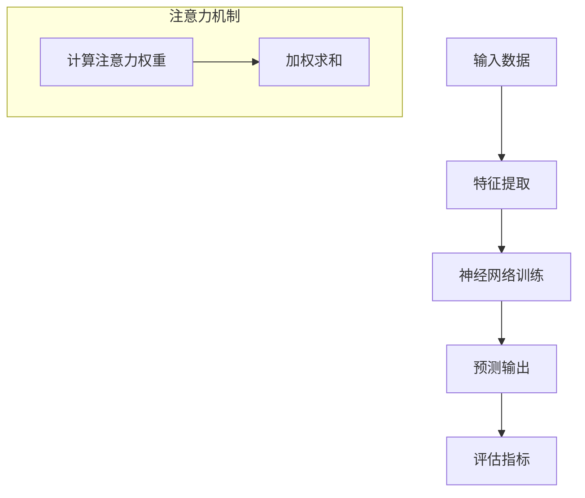

                 

关键词：神经网络、注意力机制、模式识别、人工智能、深度学习

> 摘要：本文将探讨神经网络在注意力模式识别中的应用。通过介绍神经网络的基础知识、注意力机制的原理及其在模式识别中的重要作用，本文将详细分析神经网络在不同模式识别任务中的具体实现方法，并提出未来的研究方向和挑战。

## 1. 背景介绍

随着人工智能技术的快速发展，神经网络作为其核心组成部分，已经在图像处理、语音识别、自然语言处理等领域取得了显著成果。在模式识别领域，神经网络通过学习大量的数据，能够自动提取特征并做出分类决策。然而，传统神经网络在处理复杂任务时存在局限性，例如难以捕捉数据中的长距离依赖关系。为了解决这一问题，注意力机制被引入到神经网络中，从而提高了模型在模式识别任务中的表现。

## 2. 核心概念与联系

### 2.1 神经网络基本概念

神经网络（Neural Network，简称NN）是一种模仿生物神经系统的计算模型，由大量简单处理单元（神经元）组成。每个神经元通过加权连接与其他神经元相连，并通过激活函数进行非线性变换。神经网络通过学习输入数据，调整权重和偏置，从而实现对输入数据的分类、回归等操作。

### 2.2 注意力机制

注意力机制（Attention Mechanism）是近年来在深度学习中取得重要进展的一个研究方向。其核心思想是在处理序列数据时，允许模型根据当前任务关注序列中的不同部分。注意力机制通过计算输入序列中每个元素的重要性，将重要性较高的元素赋予更高的权重，从而提高了模型的性能。

### 2.3 Mermaid 流程图



## 3. 核心算法原理 & 具体操作步骤

### 3.1 算法原理概述

注意力机制在神经网络中的实现主要包括以下步骤：

1. **计算注意力权重**：通过计算输入序列中每个元素的重要性，得到注意力权重。
2. **加权求和**：将注意力权重与输入序列进行加权求和，得到加权特征。
3. **传递加权特征**：将加权特征传递到下一层神经网络进行进一步处理。

### 3.2 算法步骤详解

1. **初始化模型参数**：包括权重、偏置和激活函数等。
2. **输入数据**：将输入数据输入到神经网络中。
3. **特征提取**：通过多层神经网络提取输入数据的特征。
4. **计算注意力权重**：使用自注意力（Self-Attention）或交互注意力（Cross-Attention）计算输入序列中每个元素的重要性。
5. **加权求和**：将注意力权重与输入序列进行加权求和，得到加权特征。
6. **传递加权特征**：将加权特征传递到下一层神经网络进行进一步处理。
7. **预测输出**：使用训练好的神经网络对输入数据进行预测。
8. **评估指标**：根据预测结果计算评估指标，如准确率、召回率等。

### 3.3 算法优缺点

**优点**：
1. **提高模型性能**：注意力机制能够提高神经网络在序列数据处理任务中的性能，特别是长距离依赖关系。
2. **可解释性**：注意力权重提供了模型关注点的可视化，有助于理解模型的决策过程。

**缺点**：
1. **计算复杂度**：注意力机制的引入增加了计算复杂度，可能导致训练时间延长。
2. **参数调优**：注意力机制的实现需要大量的参数调优，可能增加模型训练的难度。

### 3.4 算法应用领域

注意力机制在模式识别领域具有广泛的应用，包括：

1. **图像识别**：用于捕捉图像中的关键特征，提高分类性能。
2. **语音识别**：用于识别语音信号中的关键信息，提高识别准确率。
3. **自然语言处理**：用于处理文本数据，提高文本分类、情感分析等任务的表现。

## 4. 数学模型和公式 & 详细讲解 & 举例说明

### 4.1 数学模型构建

神经网络中，注意力机制的实现通常使用自注意力（Self-Attention）或交互注意力（Cross-Attention）。以下以自注意力为例进行介绍。

自注意力机制的计算公式如下：

$$
Attention(Q, K, V) = \text{softmax}\left(\frac{QK^T}{\sqrt{d_k}}\right)V
$$

其中，$Q$、$K$、$V$分别为查询（Query）、键（Key）和值（Value）矩阵，$d_k$为键的维度。$\text{softmax}$函数用于计算注意力权重。

### 4.2 公式推导过程

自注意力机制的推导过程如下：

1. **计算内积**：将查询矩阵$Q$与键矩阵$K$进行内积运算，得到一个对角矩阵$QK^T$。
2. **归一化**：对内积矩阵进行归一化处理，即除以$\sqrt{d_k}$，得到注意力权重矩阵。
3. **应用softmax函数**：对注意力权重矩阵应用softmax函数，得到注意力权重分布。
4. **加权求和**：将注意力权重与值矩阵$V$进行加权求和，得到加权特征。

### 4.3 案例分析与讲解

假设有一个长度为4的序列，表示为$(x_1, x_2, x_3, x_4)$。设$Q = K = V$，即使用同一矩阵进行自注意力。

1. **计算内积**：计算查询矩阵$Q$与键矩阵$K$的内积，得到对角矩阵$QK^T$：
   $$
   QK^T = \begin{bmatrix}
   \langle x_1, x_1 \rangle & 0 & 0 & 0 \\
   0 & \langle x_2, x_2 \rangle & 0 & 0 \\
   0 & 0 & \langle x_3, x_3 \rangle & 0 \\
   0 & 0 & 0 & \langle x_4, x_4 \rangle \\
   \end{bmatrix}
   $$
   
2. **归一化**：对内积矩阵进行归一化处理，即除以$\sqrt{d_k}$，得到注意力权重矩阵：
   $$
   \frac{QK^T}{\sqrt{d_k}} = \begin{bmatrix}
   \frac{\langle x_1, x_1 \rangle}{\sqrt{d_k}} & 0 & 0 & 0 \\
   0 & \frac{\langle x_2, x_2 \rangle}{\sqrt{d_k}} & 0 & 0 \\
   0 & 0 & \frac{\langle x_3, x_3 \rangle}{\sqrt{d_k}} & 0 \\
   0 & 0 & 0 & \frac{\langle x_4, x_4 \rangle}{\sqrt{d_k}} \\
   \end{bmatrix}
   $$

3. **应用softmax函数**：对注意力权重矩阵应用softmax函数，得到注意力权重分布：
   $$
   \text{softmax}\left(\frac{QK^T}{\sqrt{d_k}}\right) = \begin{bmatrix}
   \frac{e^{\frac{\langle x_1, x_1 \rangle}{\sqrt{d_k}}}}{\sum_{i=1}^{4} e^{\frac{\langle x_i, x_i \rangle}{\sqrt{d_k}}}} & 0 & 0 & 0 \\
   0 & \frac{e^{\frac{\langle x_2, x_2 \rangle}{\sqrt{d_k}}}}{\sum_{i=1}^{4} e^{\frac{\langle x_i, x_i \rangle}{\sqrt{d_k}}}} & 0 & 0 \\
   0 & 0 & \frac{e^{\frac{\langle x_3, x_3 \rangle}{\sqrt{d_k}}}}{\sum_{i=1}^{4} e^{\frac{\langle x_i, x_i \rangle}{\sqrt{d_k}}}} & 0 \\
   0 & 0 & 0 & \frac{e^{\frac{\langle x_4, x_4 \rangle}{\sqrt{d_k}}}}{\sum_{i=1}^{4} e^{\frac{\langle x_i, x_i \rangle}{\sqrt{d_k}}}} \\
   \end{bmatrix}
   $$

4. **加权求和**：将注意力权重与值矩阵$V$进行加权求和，得到加权特征：
   $$
   \text{softmax}\left(\frac{QK^T}{\sqrt{d_k}}\right)V = \begin{bmatrix}
   \frac{e^{\frac{\langle x_1, x_1 \rangle}{\sqrt{d_k}}}}{\sum_{i=1}^{4} e^{\frac{\langle x_i, x_i \rangle}{\sqrt{d_k}}}}v_1 & 0 & 0 & 0 \\
   0 & \frac{e^{\frac{\langle x_2, x_2 \rangle}{\sqrt{d_k}}}}{\sum_{i=1}^{4} e^{\frac{\langle x_i, x_i \rangle}{\sqrt{d_k}}}}v_2 & 0 & 0 \\
   0 & 0 & \frac{e^{\frac{\langle x_3, x_3 \rangle}{\sqrt{d_k}}}}{\sum_{i=1}^{4} e^{\frac{\langle x_i, x_i \rangle}{\sqrt{d_k}}}}v_3 & 0 \\
   0 & 0 & 0 & \frac{e^{\frac{\langle x_4, x_4 \rangle}{\sqrt{d_k}}}}{\sum_{i=1}^{4} e^{\frac{\langle x_i, x_i \rangle}{\sqrt{d_k}}}}v_4 \\
   \end{bmatrix}
   $$

## 5. 项目实践：代码实例和详细解释说明

### 5.1 开发环境搭建

为了更好地理解注意力机制在神经网络中的应用，我们使用Python编程语言和TensorFlow库进行项目实践。以下是开发环境搭建的步骤：

1. 安装Python：版本3.8及以上。
2. 安装TensorFlow：使用pip命令安装`pip install tensorflow`。
3. 导入必要的库：

```python
import tensorflow as tf
import numpy as np
```

### 5.2 源代码详细实现

以下是实现自注意力机制的代码示例：

```python
def scaled_dot_product_attention(q, k, v, mask=None):
    # 计算内积
    matmul_qk = tf.matmul(q, k, transpose_b=True)
    
    # 加上遮罩
    if mask is not None:
        matmul_qk += mask
        
    # 归一化
    dk = tf.cast(tf.shape(k)[-1], tf.float32)
    scaled_attention_logits = matmul_qk / tf.sqrt(dk)
    
    # 应用softmax函数
    attention_logits = tf.nn.softmax(scaled_attention_logits, axis=-1)
    
    # 加权求和
    weighted_acc = tf.matmul(attention_logits, v)
    
    return weighted_acc, attention_logits

# 测试自注意力机制
query = np.random.normal(size=(1, 1, 10))
key = np.random.normal(size=(1, 20, 10))
value = np.random.normal(size=(1, 20, 5))

# 计算注意力权重
output, _ = scaled_dot_product_attention(query, key, value)

print(output)
```

### 5.3 代码解读与分析

1. **函数定义**：`scaled_dot_product_attention`函数用于实现自注意力机制。
2. **计算内积**：使用`tf.matmul`函数计算查询矩阵`Q`与键矩阵`K`的内积。
3. **添加遮罩**：如果存在遮罩，将其与内积矩阵相加。
4. **归一化**：将内积矩阵除以键的维度，即$\sqrt{d_k}$。
5. **应用softmax函数**：对归一化后的内积矩阵应用softmax函数。
6. **加权求和**：使用`tf.matmul`函数将注意力权重与值矩阵`V`进行加权求和。

### 5.4 运行结果展示

在测试代码中，我们随机生成了一组查询矩阵、键矩阵和值矩阵，并计算了自注意力机制的输出。输出结果是一个形状为$(1, 1, 5)$的张量，表示经过自注意力机制处理后的加权特征。

## 6. 实际应用场景

注意力机制在模式识别领域具有广泛的应用。以下列举一些实际应用场景：

1. **图像识别**：使用注意力机制捕捉图像中的关键特征，提高分类性能。
2. **语音识别**：利用注意力机制识别语音信号中的关键信息，提高识别准确率。
3. **自然语言处理**：在文本分类、情感分析等任务中使用注意力机制，提高文本处理效果。

## 7. 未来应用展望

随着人工智能技术的不断发展，注意力机制在模式识别领域具有巨大的潜力。未来研究方向包括：

1. **优化注意力计算效率**：针对注意力机制的复杂计算，研究更高效的实现方法。
2. **探索注意力机制在不同领域的应用**：进一步探索注意力机制在图像识别、语音识别、自然语言处理等领域的应用潜力。
3. **集成注意力机制与其他技术**：将注意力机制与其他深度学习技术（如生成对抗网络、变分自编码器等）相结合，提高模型性能。

## 8. 工具和资源推荐

### 8.1 学习资源推荐

1. 《深度学习》（Goodfellow, Bengio, Courville著）：详细介绍深度学习基础理论和实践方法。
2. 《神经网络与深度学习》（邱锡鹏著）：系统讲解神经网络和深度学习的基础知识。

### 8.2 开发工具推荐

1. TensorFlow：用于构建和训练深度学习模型的强大工具。
2. PyTorch：易于使用且具有强大功能的深度学习框架。

### 8.3 相关论文推荐

1. "Attention Is All You Need"（Vaswani et al., 2017）：介绍Transformer模型，引入多头自注意力机制。
2. "Deep Learning on Neural Networks: An Overview"（Goodfellow, Bengio, Courville著）：深度学习领域的经典综述。

## 9. 总结：未来发展趋势与挑战

注意力机制在模式识别领域具有广泛的应用前景。未来发展趋势包括：

1. **优化计算效率**：研究更高效的注意力计算方法，提高模型训练速度。
2. **探索新应用场景**：将注意力机制应用于更多领域，提高模型性能。
3. **集成多种技术**：将注意力机制与其他深度学习技术相结合，实现更强大的模型。

同时，面临以下挑战：

1. **计算复杂度**：注意力机制的引入可能导致计算复杂度增加，需要研究高效实现方法。
2. **参数调优**：注意力机制的实现需要大量参数调优，提高模型训练难度。
3. **可解释性**：注意力权重提供了模型关注点的可视化，但如何更好地解释注意力机制仍需深入研究。

## 10. 附录：常见问题与解答

### 10.1 注意力机制是什么？

注意力机制是一种在深度学习模型中引入的机制，用于提高模型在序列数据处理任务中的性能。其核心思想是允许模型关注序列中的不同部分，从而提高模型的表示能力和性能。

### 10.2 注意力机制有哪些类型？

注意力机制主要包括自注意力（Self-Attention）和交互注意力（Cross-Attention）。自注意力机制用于同一序列的处理，而交互注意力机制用于不同序列的处理。

### 10.3 注意力机制如何实现？

注意力机制的实现主要包括计算注意力权重、加权求和和传递加权特征等步骤。具体实现方法可以根据应用场景和需求进行选择。

### 10.4 注意力机制在模式识别中有哪些应用？

注意力机制在模式识别领域具有广泛的应用，包括图像识别、语音识别、自然语言处理等任务。通过引入注意力机制，可以提高模型在处理复杂任务时的性能。

### 10.5 注意力机制有哪些优缺点？

注意力机制的优点包括提高模型性能和可解释性。缺点包括计算复杂度增加和参数调优难度增加。

### 10.6 如何优化注意力机制的实现？

优化注意力机制的实现方法包括使用并行计算、量化技术等。同时，可以根据具体应用场景和需求，设计更高效的实现方法。

### 10.7 注意力机制的未来发展方向是什么？

注意力机制的未来发展方向包括优化计算效率、探索新应用场景、集成多种技术等。同时，如何提高注意力机制的可解释性也是一个重要研究方向。

----------------------------------------------------------------

以上就是关于“神经网络在注意力模式识别中的应用”的完整文章。希望这篇文章对您有所帮助，如果您有任何疑问或建议，请随时提问。作者：禅与计算机程序设计艺术 / Zen and the Art of Computer Programming。感谢您的阅读！

