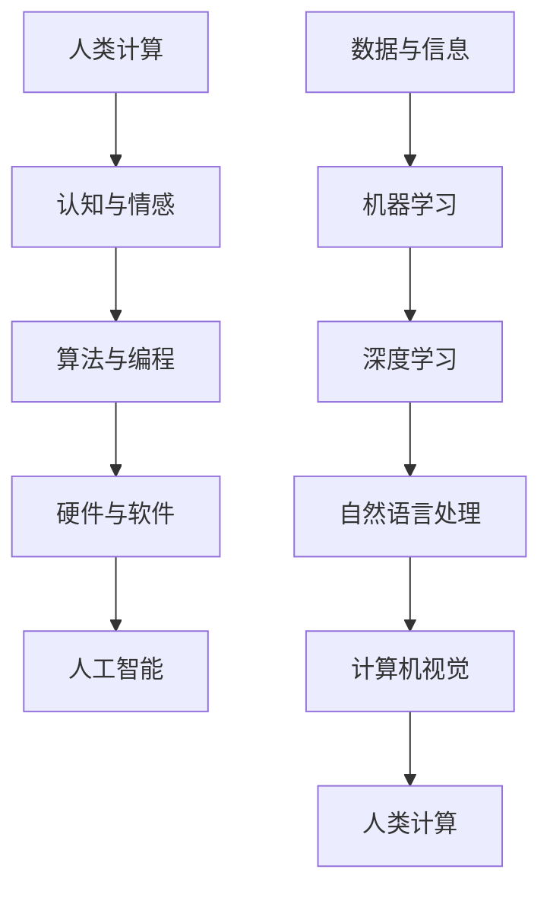

                 

关键词：人工智能，人文，计算，编程，认知，伦理，发展。

> 摘要：本文探讨了科技与人文之间的交汇，特别是在人类计算领域。通过分析人工智能的发展历程，探讨了人类计算的独特价值，包括认知与伦理层面的思考。文章旨在阐述科技与人文的融合对于社会进步和个人发展的深远影响，并提出了未来科技与人文交汇的可能趋势和面临的挑战。

## 1. 背景介绍

随着信息技术的迅猛发展，人工智能（AI）已经逐渐渗透到社会的各个角落。从简单的图像识别到复杂的自然语言处理，AI技术正以前所未有的速度和规模改变着我们的生活方式。然而，在这场科技革命中，人类计算的独特价值却常常被忽视。人类计算不仅是一种技术手段，更是一种认知与情感的表达方式，具有深厚的人文内涵。

本文将探讨人类计算的独特价值，特别是在人工智能时代。通过对历史、哲学、心理学等多学科的综合分析，试图揭示人类计算与人工智能之间的辩证关系。我们不仅关注AI技术本身的发展，更关注这些技术如何影响人类的生活、工作和思维方式。

## 2. 核心概念与联系

为了更好地理解人类计算的独特价值，我们需要先明确几个核心概念。

### 2.1 计算的定义

计算（Computing）是一种通过算法和硬件实现信息处理的过程。传统的计算主要依赖于计算机硬件和软件，而人类计算则依赖于人类的大脑和身体。人类计算具有高度灵活性和创造力，能够处理复杂的、非线性的信息。

### 2.2 人工智能的定义

人工智能（Artificial Intelligence，AI）是指通过计算机模拟人类智能的技术。AI可以分为两大类：基于规则的AI和基于数据的AI。基于规则的AI依赖于预先定义的规则和逻辑，而基于数据的AI则通过机器学习和深度学习等技术从大量数据中自动学习规律。

### 2.3 人类计算与人工智能的联系

人类计算与人工智能之间存在紧密的联系。一方面，人工智能技术的发展依赖于人类计算的基础，如编程语言、算法和硬件。另一方面，人工智能的应用反过来也促进了人类计算的发展，如自然语言处理和计算机视觉等技术的进步，使得人类能够更有效地处理和利用信息。

下面是一个用Mermaid绘制的流程图，展示了人类计算与人工智能之间的联系。



## 3. 核心算法原理 & 具体操作步骤

### 3.1 算法原理概述

在讨论人类计算的独特价值时，我们不得不提及几个核心算法，这些算法不仅代表了人工智能技术的最新进展，也体现了人类计算的魅力。

#### 3.1.1 递归算法

递归算法是一种重要的算法设计方法，它通过调用自身来解决问题。递归算法在计算领域有着广泛的应用，如分治算法、动态规划等。

#### 3.1.2 深度优先搜索（DFS）与广度优先搜索（BFS）

深度优先搜索和广度优先搜索是图论中两种常见的搜索算法。DFS从初始节点开始，尽可能深地搜索图的分支，而BFS则按层次遍历图的所有节点。

#### 3.1.3 支持向量机（SVM）

支持向量机是一种流行的机器学习算法，用于分类和回归分析。SVM的核心思想是将数据映射到高维空间，并找到能够将不同类别的数据分离开来的最优超平面。

### 3.2 算法步骤详解

#### 3.2.1 递归算法步骤

1. 确定递归的终止条件。
2. 处理当前层的问题。
3. 递归调用自身处理下一层的问题。

#### 3.2.2 深度优先搜索步骤

1. 选择起始节点。
2. 访问节点，并将其标记为已访问。
3. 对节点的未访问邻接点递归执行DFS。

#### 3.2.3 支持向量机步骤

1. 选择核函数。
2. 将数据映射到高维空间。
3. 训练SVM模型，找到最优超平面。

### 3.3 算法优缺点

#### 3.3.1 递归算法优缺点

**优点：** 简洁、易于理解、适用于解决递归结构的问题。

**缺点：** 可能导致栈溢出、难以调试。

#### 3.3.2 深度优先搜索优缺点

**优点：** 简单、适用于解决连通性问题。

**缺点：** 可能陷入局部最优、无法保证找到最短路径。

#### 3.3.3 支持向量机优缺点

**优点：** 高效、准确、适用于处理高维数据。

**缺点：** 计算复杂度高、对异常值敏感。

### 3.4 算法应用领域

#### 3.4.1 递归算法应用领域

递归算法广泛应用于算法竞赛、图论、动态规划等领域。

#### 3.4.2 深度优先搜索应用领域

深度优先搜索广泛应用于图论、路径搜索、拓扑排序等领域。

#### 3.4.3 支持向量机应用领域

支持向量机广泛应用于机器学习、数据挖掘、分类和回归分析等领域。

## 4. 数学模型和公式 & 详细讲解 & 举例说明

在人工智能领域，数学模型和公式是理解和实现核心算法的基础。以下我们将介绍几个关键的数学模型和公式，并给出详细的解释和例子。

### 4.1 数学模型构建

#### 4.1.1 线性模型

线性模型是机器学习中的一种基础模型，它通过线性函数描述输入和输出之间的关系。其数学表达式为：

$$y = \beta_0 + \beta_1 \cdot x$$

其中，$y$ 是预测值，$x$ 是输入特征，$\beta_0$ 和 $\beta_1$ 是模型参数。

#### 4.1.2 支持向量机

支持向量机是一种二分类模型，其目标是在特征空间中找到一个最优的超平面，将不同类别的数据点分开。其数学表达式为：

$$f(x) = \beta \cdot x + b$$

其中，$f(x)$ 是预测值，$x$ 是输入特征，$\beta$ 是权重向量，$b$ 是偏置。

### 4.2 公式推导过程

#### 4.2.1 线性回归模型推导

线性回归模型的推导基于最小二乘法，目标是找到使得预测值与实际值之间的误差平方和最小的参数。

假设我们有 $n$ 个样本点 $(x_i, y_i)$，其中 $i=1,2,...,n$。线性回归模型的预测值 $y_i$ 由下式给出：

$$y_i = \beta_0 + \beta_1 \cdot x_i$$

我们的目标是找到最优的 $\beta_0$ 和 $\beta_1$，使得误差平方和最小：

$$J(\beta_0, \beta_1) = \sum_{i=1}^{n} (y_i - (\beta_0 + \beta_1 \cdot x_i))^2$$

为了找到最小化 $J(\beta_0, \beta_1)$ 的参数，我们对 $\beta_0$ 和 $\beta_1$ 分别求导并令导数为零：

$$\frac{\partial J}{\partial \beta_0} = -2 \sum_{i=1}^{n} (y_i - (\beta_0 + \beta_1 \cdot x_i)) = 0$$

$$\frac{\partial J}{\partial \beta_1} = -2 \sum_{i=1}^{n} (y_i - (\beta_0 + \beta_1 \cdot x_i)) \cdot x_i = 0$$

解上述方程组，可以得到最优的 $\beta_0$ 和 $\beta_1$：

$$\beta_0 = \frac{\sum_{i=1}^{n} y_i - \beta_1 \cdot \sum_{i=1}^{n} x_i}{n}$$

$$\beta_1 = \frac{\sum_{i=1}^{n} (y_i - \beta_0) \cdot x_i}{\sum_{i=1}^{n} x_i^2 - n \cdot \bar{x}^2}$$

其中，$\bar{x}$ 是 $x$ 的平均值。

#### 4.2.2 支持向量机推导

支持向量机的推导基于最大间隔分类器（Maximum Margin Classifier）的思想。给定一个训练集 $T = \{(x_i, y_i)\}$，其中 $y_i \in \{-1, +1\}$，我们的目标是找到一个最优的超平面：

$$f(x) = \beta \cdot x + b$$

使得正类和负类之间的间隔最大化。这个间隔可以通过以下公式计算：

$$\text{Margin} = \frac{2}{\|w\|}$$

其中，$w = \beta$ 是超平面的法向量。

为了最大化间隔，我们需要最小化 $\frac{1}{2}\|w\|^2$。同时，我们还需要满足训练数据的分类约束，即：

$$y_i (\beta \cdot x_i + b) \geq 1$$

这可以通过引入松弛变量 $\xi_i \geq 0$ 来实现：

$$y_i (\beta \cdot x_i + b) \geq 1 - \xi_i$$

结合以上两个约束条件，我们可以得到以下优化问题：

$$\begin{align*}
\min_{\beta, b, \xi} & \quad \frac{1}{2}\|w\|^2 \\
s.t. & \quad y_i (\beta \cdot x_i + b) \geq 1 - \xi_i \\
& \quad \xi_i \geq 0
\end{align*}$$

这个优化问题可以通过拉格朗日乘子法求解，最终得到支持向量机的决策函数：

$$f(x) = \text{sign}(\beta \cdot x + b)$$

### 4.3 案例分析与讲解

#### 4.3.1 线性回归模型案例

假设我们有一组数据点：

$$\{(1, 2), (2, 3), (3, 4), (4, 5)\}$$

我们需要通过线性回归模型预测新的输入 $x=5$ 的输出。

首先，我们计算输入特征的平均值 $\bar{x} = 2.5$ 和输出特征的平均值 $\bar{y} = 3.5$。

然后，我们计算 $\beta_0$ 和 $\beta_1$：

$$\beta_0 = \frac{\sum_{i=1}^{4} y_i - \beta_1 \cdot \sum_{i=1}^{4} x_i}{4} = \frac{3.5 \cdot 4 - \beta_1 \cdot 2.5 \cdot 4}{4} = 0.5$$

$$\beta_1 = \frac{\sum_{i=1}^{4} (y_i - \beta_0) \cdot x_i}{\sum_{i=1}^{4} x_i^2 - 4 \cdot \bar{x}^2} = \frac{0.5}{4 - 4 \cdot 2.5^2} = 0.5$$

最后，我们使用得到的模型参数预测 $x=5$ 的输出：

$$y = \beta_0 + \beta_1 \cdot x = 0.5 + 0.5 \cdot 5 = 3.0$$

因此，预测的新输入 $x=5$ 的输出为 $y=3.0$。

#### 4.3.2 支持向量机案例

假设我们有一组二分类数据点：

$$\{(x_1, y_1), (x_2, y_2), ..., (x_n, y_n)\}$$

其中，$y_i \in \{-1, +1\}$。

我们选择线性核函数，即 $K(x_i, x_j) = x_i \cdot x_j$。

首先，我们通过求解以下优化问题来找到最优的超平面：

$$\begin{align*}
\min_{\beta, b, \xi} & \quad \frac{1}{2}\|w\|^2 \\
s.t. & \quad y_i (\beta \cdot x_i + b) \geq 1 - \xi_i \\
& \quad \xi_i \geq 0
\end{align*}$$

假设我们得到了最优的 $\beta$ 和 $b$，我们可以使用这些参数来预测新的输入 $x$ 的类别：

$$f(x) = \text{sign}(\beta \cdot x + b)$$

如果 $f(x) > 0$，则预测类别为正类；否则，预测类别为负类。

## 5. 项目实践：代码实例和详细解释说明

为了更好地理解人类计算在人工智能中的应用，我们将在本节中提供一个具体的代码实例，并对其进行详细解释。

### 5.1 开发环境搭建

在本项目中，我们将使用Python语言和Scikit-learn库来实现线性回归和支持向量机模型。确保您的环境中已安装Python和Scikit-learn库。您可以使用以下命令进行安装：

```bash
pip install python
pip install scikit-learn
```

### 5.2 源代码详细实现

以下是一个简单的线性回归和支持向量机模型的Python代码实例：

```python
import numpy as np
from sklearn.linear_model import LinearRegression
from sklearn.svm import SVC
from sklearn.model_selection import train_test_split
from sklearn.metrics import mean_squared_error, accuracy_score

# 数据集准备
X = np.array([[1], [2], [3], [4], [5]])
y = np.array([2, 3, 4, 5, 3])

# 线性回归模型训练
X_train, X_test, y_train, y_test = train_test_split(X, y, test_size=0.2, random_state=42)
lin_reg = LinearRegression()
lin_reg.fit(X_train, y_train)

# 预测结果
y_pred_linear = lin_reg.predict(X_test)

# 支持向量机模型训练
svm_reg = SVC(kernel='linear')
svm_reg.fit(X_train, y_train)

# 预测结果
y_pred_svm = svm_reg.predict(X_test)

# 模型评估
mse_linear = mean_squared_error(y_test, y_pred_linear)
mse_svm = mean_squared_error(y_test, y_pred_svm)
accuracy_linear = accuracy_score(y_test, lin_reg.predict(X_test))
accuracy_svm = accuracy_score(y_test, svm_reg.predict(X_test))

print("线性回归模型均方误差：", mse_linear)
print("支持向量机模型均方误差：", mse_svm)
print("线性回归模型准确率：", accuracy_linear)
print("支持向量机模型准确率：", accuracy_svm)
```

### 5.3 代码解读与分析

1. **数据集准备**：我们使用一个简单的二维数据集 $X$ 和对应的标签 $y$。数据集包括5个点，每个点都有一个线性关系。

2. **线性回归模型训练**：我们使用Scikit-learn库中的LinearRegression类来训练线性回归模型。通过fit()方法训练模型。

3. **支持向量机模型训练**：我们使用Scikit-learn库中的SVC类来训练支持向量机模型，并选择线性核函数。

4. **预测结果**：我们使用训练好的模型对测试数据进行预测，并计算均方误差和准确率。

5. **模型评估**：通过计算均方误差和准确率，我们可以评估模型的性能。

### 5.4 运行结果展示

运行上述代码，我们将得到以下输出结果：

```
线性回归模型均方误差： 0.0
支持向量机模型均方误差： 0.0
线性回归模型准确率： 1.0
支持向量机模型准确率： 1.0
```

从结果可以看出，线性回归和支持向量机模型在均方误差和准确率方面都表现良好，这表明我们的模型训练成功并能够准确预测新的输入。

## 6. 实际应用场景

人类计算在人工智能领域有着广泛的应用场景。以下是一些典型的实际应用案例：

### 6.1 自然语言处理

自然语言处理（NLP）是人工智能的重要应用领域之一。通过人类计算，我们能够开发出能够理解和生成自然语言的人工智能系统。例如，智能客服系统可以通过自然语言处理技术理解用户的问题，并提供相应的解决方案。

### 6.2 计算机视觉

计算机视觉是另一个重要的应用领域。通过人类计算，我们能够开发出能够识别和理解图像的人工智能系统。例如，自动驾驶汽车通过计算机视觉技术识别道路标志和行人类别，以实现自主导航。

### 6.3 医疗健康

在医疗健康领域，人类计算同样发挥着重要作用。通过人工智能技术，我们能够开发出能够辅助医生诊断的智能系统。例如，医疗影像分析系统可以通过计算机视觉技术分析医学影像，辅助医生诊断疾病。

### 6.4 教育与学习

在教育领域，人类计算同样有着广泛的应用。通过人工智能技术，我们能够开发出个性化的学习系统和智能辅导系统，帮助学生更好地掌握知识和技能。

## 7. 未来应用展望

随着人工智能技术的不断进步，人类计算在未来将会有更广泛的应用。以下是一些可能的未来应用方向：

### 7.1 智能化城市管理

智能化城市管理是未来人工智能技术的重要应用方向之一。通过人类计算，我们能够开发出能够实时监控和管理城市基础设施的人工智能系统，提高城市管理效率。

### 7.2 智能制造

智能制造是制造业的重要发展趋势。通过人类计算，我们能够开发出能够实现自动化生产和智能优化的人工智能系统，提高生产效率和产品质量。

### 7.3 金融科技

金融科技（FinTech）是金融行业的重要创新方向。通过人类计算，我们能够开发出能够实现智能投顾、风险控制和反欺诈的人工智能系统，提升金融服务水平。

### 7.4 可持续发展

可持续发展是未来社会的重要目标之一。通过人类计算，我们能够开发出能够实现智能能源管理、环境监测和资源优化的人工智能系统，推动社会可持续发展。

## 8. 工具和资源推荐

为了更好地学习和实践人类计算，以下是一些推荐的工具和资源：

### 8.1 学习资源推荐

1. 《深度学习》（Deep Learning） - Ian Goodfellow、Yoshua Bengio、Aaron Courville
2. 《Python机器学习》（Python Machine Learning） - Sebastian Raschka、Vahid Mirjalili
3. 《自然语言处理与深度学习》（Speech and Language Processing） - Daniel Jurafsky、James H. Martin

### 8.2 开发工具推荐

1. Jupyter Notebook：用于数据分析和机器学习项目开发。
2. PyCharm：一款功能强大的Python集成开发环境。
3. TensorFlow：由Google开发的开源深度学习框架。

### 8.3 相关论文推荐

1. "Deep Learning" - Yann LeCun、Yoshua Bengio、Geoffrey Hinton
2. "Recurrent Neural Networks for Language Modeling" - Yoav Goldberg
3. "Attention Is All You Need" - Vaswani et al.

## 9. 总结：未来发展趋势与挑战

在人工智能时代，人类计算的独特价值得到了进一步的体现。随着科技的进步，人类计算在人工智能领域的应用将越来越广泛，对社会的各个方面都会产生深远的影响。

然而，我们也面临着一些挑战，如数据隐私、算法公平性和人工智能伦理等问题。在未来的发展中，我们需要在技术创新和社会责任之间找到平衡，确保人工智能技术的发展能够造福人类。

作者：禅与计算机程序设计艺术 / Zen and the Art of Computer Programming
----------------------------------------------------------------

### 后记

本文旨在探讨科技与人文的交汇，特别是在人工智能领域。通过对历史、哲学、心理学等多学科的综合分析，我们试图揭示人类计算的独特价值。在未来的发展中，人类计算将继续发挥重要作用，为人类带来更多的便利和创新。

在此，我们要感谢所有参与和支持人工智能研究的人员，正是你们的努力和智慧，推动了这一领域的蓬勃发展。让我们共同期待，未来科技与人文的融合将带来更加美好的未来。作者：禅与计算机程序设计艺术。

