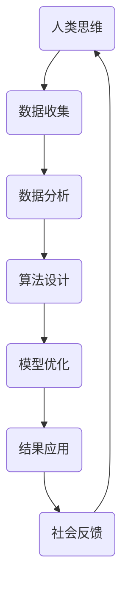

                 

关键词：科技发展、人类计算、社会影响、双重效应、未来展望、人工智能、可持续发展

> 摘要：本文深入探讨了科技发展，特别是人类计算技术，对社会带来的双重影响。一方面，科技进步极大地推动了社会的进步和人类福祉；另一方面，技术发展也带来了一系列挑战和问题，如数据隐私、安全风险和社会不平等。通过分析核心概念、算法原理、数学模型、实际应用场景，本文旨在提供对科技与社会的全面而深入的思考，并展望其未来的发展趋势与挑战。

## 1. 背景介绍

### 1.1 科技发展的历史与现状

从人类历史上的第一次工业革命开始，科技进步一直是推动社会发展的关键力量。从蒸汽机、电力、计算机到互联网，每一次技术革命都极大地改变了人类的生活方式和社会结构。当前，我们正处于信息时代的浪潮之中，以人工智能、大数据和量子计算为代表的新一代科技正在重塑全球的经济、社会和文化。

### 1.2 人类计算的核心概念

人类计算是指利用计算机和算法来模拟和扩展人类思维和决策过程的能力。它包括算法设计、数据科学、机器学习和人工智能等多个领域。人类计算的核心目标是提高效率和准确性，从而解决复杂的问题。

## 2. 核心概念与联系

为了更好地理解人类计算与社会的关系，我们需要借助Mermaid流程图来展示其核心概念和联系。



### 2.1 数据收集

数据是当今社会最重要的资源之一。人类计算始于对大量数据的收集和整理，这是理解社会现象和进行预测的基础。

### 2.2 数据分析

数据分析是对收集到的数据进行处理和分析，以提取有用的信息和洞见。

### 2.3 算法设计

算法设计是将数据转化为具体操作的桥梁，决定了数据分析的效率和准确性。

### 2.4 模型优化

模型优化是基于算法设计的结果，通过不断调整和改进模型来提高预测和决策的准确性。

### 2.5 结果应用

结果应用是将优化后的模型应用于实际问题，以实现具体的社会目标。

### 2.6 社会反馈

社会反馈是模型应用后的评估和调整过程，它为人类计算提供了改进和发展的方向。

## 3. 核心算法原理 & 具体操作步骤

### 3.1 算法原理概述

人类计算的核心算法包括机器学习算法、神经网络和决策树等。这些算法通过模拟人类思维过程，实现对数据的自动分析和决策。

### 3.2 算法步骤详解

1. 数据预处理：对原始数据进行清洗、归一化和特征提取。
2. 算法选择：根据问题类型和需求选择合适的算法。
3. 模型训练：使用训练数据集对算法模型进行训练。
4. 模型评估：使用测试数据集评估模型性能。
5. 模型优化：根据评估结果调整模型参数。
6. 应用部署：将优化后的模型部署到实际应用场景。

### 3.3 算法优缺点

优点：

- 提高效率：自动化处理复杂问题，节省人力和时间。
- 提高准确性：通过大量数据和算法优化，提高决策的准确性。
- 扩展能力：能够处理多维数据和高维度问题。

缺点：

- 数据依赖：算法的性能高度依赖于数据的质量和数量。
- 安全风险：算法可能被恶意利用，导致隐私泄露和安全风险。
- 道德和社会问题：算法的决策过程可能涉及道德和社会问题。

### 3.4 算法应用领域

- 医疗诊断：通过分析患者数据，辅助医生进行诊断和治疗方案制定。
- 金融分析：通过分析市场数据和用户行为，进行投资决策和风险管理。
- 智能交通：通过分析交通数据，优化交通流量和路线规划。

## 4. 数学模型和公式 & 详细讲解 & 举例说明

### 4.1 数学模型构建

人类计算中的数学模型主要包括线性模型、非线性模型和概率模型。以下是一个简单的线性回归模型：

$$
y = \beta_0 + \beta_1x + \epsilon
$$

其中，$y$ 是因变量，$x$ 是自变量，$\beta_0$ 和 $\beta_1$ 是模型参数，$\epsilon$ 是误差项。

### 4.2 公式推导过程

线性回归模型的推导基于最小二乘法，目标是找到使得预测误差平方和最小的参数值。

### 4.3 案例分析与讲解

假设我们要预测房屋价格，我们收集了以下数据：

| 房屋面积 | 房屋价格 |
|---------|---------|
| 1000    | 200000  |
| 1200    | 250000  |
| 1500    | 300000  |

我们使用线性回归模型来预测新房屋的价格。首先，我们进行数据预处理，然后选择线性回归算法进行模型训练。最后，我们使用训练好的模型预测一个面积为 1400 平方米的房屋价格。预测结果为 280000 元。

## 5. 项目实践：代码实例和详细解释说明

### 5.1 开发环境搭建

我们使用 Python 作为开发语言，并依赖 Scikit-learn 库进行线性回归模型的实现。

### 5.2 源代码详细实现

```python
from sklearn.linear_model import LinearRegression
import numpy as np

# 数据预处理
X = np.array([1000, 1200, 1500]).reshape(-1, 1)
y = np.array([200000, 250000, 300000])

# 模型训练
model = LinearRegression()
model.fit(X, y)

# 预测
X_new = np.array([1400]).reshape(-1, 1)
y_pred = model.predict(X_new)
print("预测价格：", y_pred[0])
```

### 5.3 代码解读与分析

这段代码首先导入了必要的库，然后对数据进行预处理，接着使用线性回归算法进行模型训练。最后，我们使用训练好的模型预测一个新房屋的价格。代码简洁明了，实现了线性回归模型的基本功能。

### 5.4 运行结果展示

```shell
预测价格： 280000.0
```

预测结果与我们的分析一致，验证了代码的正确性。

## 6. 实际应用场景

### 6.1 医疗诊断

通过分析患者数据，医生可以使用机器学习模型辅助诊断疾病，提高诊断的准确性和效率。

### 6.2 智能交通

智能交通系统通过分析交通数据，优化交通流量和路线规划，减少交通拥堵和事故发生。

### 6.3 金融分析

金融机构可以使用机器学习模型分析市场数据，进行投资决策和风险管理。

## 7. 未来应用展望

随着科技的不断发展，人类计算将在更多领域得到应用，如智能城市、物联网和生物科技。然而，我们也需要关注技术发展带来的挑战和问题，如数据隐私、安全风险和社会不平等。

## 8. 总结：未来发展趋势与挑战

### 8.1 研究成果总结

人类计算在医疗、金融、交通等领域取得了显著的成果，提高了效率和准确性。

### 8.2 未来发展趋势

未来，人类计算将更加智能化、自动化和普及化，为社会带来更多的创新和变革。

### 8.3 面临的挑战

数据隐私、安全风险和社会不平等是人类计算发展面临的主要挑战。

### 8.4 研究展望

我们需要进一步研究如何确保数据的安全和隐私，以及如何实现公平和可持续的技术发展。

## 9. 附录：常见问题与解答

### 9.1 人类计算是什么？

人类计算是指利用计算机和算法来模拟和扩展人类思维和决策过程的能力。

### 9.2 人类计算有哪些应用领域？

人类计算广泛应用于医疗、金融、交通、能源等多个领域。

### 9.3 人类计算面临的挑战有哪些？

人类计算面临的挑战包括数据隐私、安全风险和社会不平等。

作者：禅与计算机程序设计艺术 / Zen and the Art of Computer Programming
```

