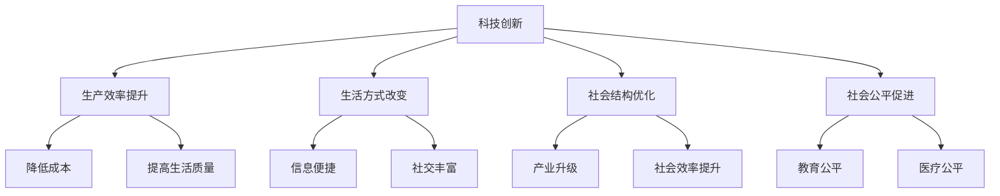

                 

  
> 关键词：科技创新、社会进步、技术发展、人工智能、未来展望

> 摘要：本文从科技创新的角度探讨了其对社会的深远影响，分析其在推动社会进步中的关键角色。文章将详细探讨科技创新的核心概念、算法原理、数学模型、实践案例以及未来应用前景，旨在为读者提供一个全面的技术发展视角。

## 1. 背景介绍

社会进步是一个长期而复杂的过程，它受到经济、文化、政治等多方面因素的影响。然而，科技创新在其中扮演了至关重要的角色。自工业革命以来，科技的飞速发展不断推动着社会向更高层次迈进。从蒸汽机到电力，从计算机到互联网，每一次科技革命都带来了社会生产力的巨大提升，改变了人类的生活方式。

在当今世界，科技创新已经成为驱动社会进步的主要动力。人工智能、大数据、物联网等新兴技术正在重塑各个行业，从医疗、教育到金融、制造业，无不受到科技的影响。科技创新不仅改变了生产方式，也深刻影响了人们的生活习惯和社会结构。

本文将围绕科技创新这一主题，探讨其核心概念、发展历程、关键算法、数学模型以及实际应用案例，旨在为读者提供一个全面的技术发展视角。同时，文章还将展望未来科技创新的发展趋势，探讨面临的挑战与机遇。

## 2. 核心概念与联系

### 2.1 科技创新的定义

科技创新是指通过研究和开发新的科学知识和技术，创造新的产品、服务或过程，从而推动社会进步的过程。科技创新不仅仅是科学发现和技术发明的简单叠加，它更涉及到对现有知识的整合、创新和转化。

### 2.2 科技创新与社会进步的关系

科技创新与社会进步之间存在着密切的联系。科技创新不仅推动了生产力的发展，也促进了社会结构和社会关系的变革。具体来说，科技创新对社会进步的影响体现在以下几个方面：

1. **提升生产效率**：科技创新通过提高生产效率，降低了生产成本，使得更多的产品和服务能够以更低的成本提供给消费者，从而提高了人们的生活水平。

2. **改变生活方式**：科技创新改变了人们的生活方式，例如互联网和智能手机的出现，使得信息获取和社交互动变得更加便捷，极大地丰富了人们的日常生活。

3. **优化社会结构**：科技创新促进了社会结构的优化，例如，人工智能和自动化技术的应用，使得传统行业得以升级，从而提高了社会的整体效率。

4. **促进社会公平**：科技创新有助于缩小贫富差距，例如，通过远程教育和在线医疗，使得教育资源和医疗服务能够更加公平地分配到各个地区。

### 2.3 科技创新的分类

根据科技创新的内容和形式，可以将其分为以下几类：

1. **基础研究创新**：这类创新主要集中在科学领域，通过发现新的科学原理和知识，为技术发展提供理论支持。

2. **应用研究创新**：这类创新将基础研究的成果转化为具体的技术和应用，从而推动产业的进步。

3. **集成创新**：这类创新通过整合不同的技术，创造出新的产品和服务，从而满足市场的需求。

4. **商业模式创新**：这类创新通过改变商业运营模式，提高企业的竞争力，从而推动产业结构的优化。

### 2.4 核心概念原理与架构

为了更好地理解科技创新的核心概念和架构，我们可以使用Mermaid流程图来展示其关键节点和联系。



在这个流程图中，科技创新是核心，它通过提升生产效率、改变生活方式、优化社会结构和促进社会公平，最终推动社会的整体进步。

## 3. 核心算法原理 & 具体操作步骤

### 3.1 算法原理概述

在科技创新中，算法原理扮演着至关重要的角色。算法是一种解决问题的步骤和方法，它通过一系列操作来处理数据，并生成预期的结果。在现代科技中，算法已经广泛应用于各个领域，如人工智能、大数据处理、机器学习等。

算法的设计和实现需要遵循一定的原理和步骤。以下是算法设计的基本原理和步骤：

1. **明确问题**：首先，需要明确需要解决的问题是什么，这有助于确定算法的目标和范围。

2. **数据收集与预处理**：收集与问题相关的数据，并对数据进行清洗、整理和预处理，以确保数据的质量和完整性。

3. **算法设计**：根据问题的性质，设计合适的算法。算法的设计需要考虑时间复杂度、空间复杂度以及算法的鲁棒性。

4. **算法实现**：将算法设计转换为具体的代码实现，这是算法实现的步骤。

5. **测试与优化**：对算法进行测试，验证其是否能够正确解决问题，并根据测试结果进行优化。

### 3.2 算法步骤详解

以下是算法设计的基本步骤的详细解释：

1. **明确问题**：
    - 确定问题的范围和目标。
    - 分析问题的复杂性和可行性。

2. **数据收集与预处理**：
    - 收集与问题相关的数据。
    - 清洗数据，去除异常值和噪声。
    - 整理数据，使其适合算法处理。

3. **算法设计**：
    - 选择合适的算法模型。
    - 确定算法的输入和输出。
    - 设计算法的流程图。

4. **算法实现**：
    - 编写代码实现算法。
    - 调试代码，解决可能的错误。

5. **测试与优化**：
    - 使用测试数据集测试算法。
    - 分析测试结果，找出算法的不足。
    - 根据测试结果进行算法的优化。

### 3.3 算法优缺点

每种算法都有其独特的优缺点，以下是几种常见算法的优缺点分析：

1. **贪心算法**：
    - **优点**：实现简单，效率高。
    - **缺点**：不一定能找到最优解。

2. **动态规划算法**：
    - **优点**：能够找到最优解。
    - **缺点**：实现复杂，时间复杂度高。

3. **分支界限算法**：
    - **优点**：适用于大规模问题。
    - **缺点**：搜索空间大，效率可能较低。

4. **遗传算法**：
    - **优点**：能够处理复杂问题。
    - **缺点**：收敛速度较慢。

### 3.4 算法应用领域

算法在各个领域都有广泛的应用，以下是几个典型应用领域：

1. **人工智能**：算法在人工智能中扮演着核心角色，如深度学习、强化学习等。

2. **大数据处理**：算法用于数据清洗、数据挖掘和数据分析，如MapReduce、Hadoop等。

3. **机器学习**：算法用于构建机器学习模型，如线性回归、决策树等。

4. **图像处理**：算法用于图像识别、图像分割等，如卷积神经网络等。

## 4. 数学模型和公式 & 详细讲解 & 举例说明

### 4.1 数学模型构建

数学模型是科技创新中不可或缺的一部分，它通过数学语言描述现实问题，为算法设计和数据分析提供理论支持。以下是几个常见数学模型的构建过程：

1. **线性回归模型**：
    - **构建过程**：
        - 确定自变量和因变量。
        - 收集数据，并进行预处理。
        - 选择合适的线性回归模型。
        - 求解模型的参数。
    - **公式表示**：
        $$Y = \beta_0 + \beta_1X + \epsilon$$
    - **举例说明**：预测房价，自变量为房屋面积，因变量为房价。

2. **决策树模型**：
    - **构建过程**：
        - 确定特征变量。
        - 计算特征变量的重要性。
        - 构建决策树。
    - **公式表示**：
        $$f(X) = \sum_{i=1}^{n} \alpha_i g(X_i)$$
    - **举例说明**：分类客户是否购买产品，特征变量为年龄、收入等。

3. **神经网络模型**：
    - **构建过程**：
        - 确定网络结构。
        - 初始化网络参数。
        - 进行前向传播和反向传播。
    - **公式表示**：
        $$a_{i}^{(l)} = \sigma(z_{i}^{(l)})$$
        $$z_{i}^{(l)} = \sum_{j} w_{ji}^{(l)} a_{j}^{(l-1)} + b_{i}^{(l)}$$
    - **举例说明**：图像分类，输入为图像像素值，输出为类别标签。

### 4.2 公式推导过程

以下是线性回归模型的公式推导过程：

1. **最小二乘法**：
    - **目标**：找到最佳拟合直线，使得所有点到直线的距离之和最小。
    - **推导**：
        - 设自变量为 $X$，因变量为 $Y$，拟合直线为 $Y = \beta_0 + \beta_1X$。
        - 设误差项为 $\epsilon$，则 $Y - \beta_0 - \beta_1X = \epsilon$。
        - 为了最小化误差项，对 $\beta_0$ 和 $\beta_1$ 求导，并令导数为零。
        - 得到 $\beta_0 = \bar{Y} - \beta_1\bar{X}$。
        - 将 $\beta_0$ 代入误差项，得到 $\beta_1 = \frac{\sum_{i=1}^{n}(X_i - \bar{X})(Y_i - \bar{Y})}{\sum_{i=1}^{n}(X_i - \bar{X})^2}$。

2. **线性回归方程**：
    - **推导**：
        - 已知自变量 $X$ 和因变量 $Y$ 的数据集。
        - 使用最小二乘法求解线性回归方程。
        - 设 $X$ 和 $Y$ 的样本均值分别为 $\bar{X}$ 和 $\bar{Y}$。
        - 根据最小二乘法公式，求解线性回归方程的参数 $\beta_0$ 和 $\beta_1$。

### 4.3 案例分析与讲解

以下是线性回归模型的一个实际案例：

1. **案例描述**：
    - **问题**：预测某城市的未来人口数量。
    - **数据**：历史人口数据，包括年份和对应的人口数量。
    - **模型**：使用线性回归模型进行预测。

2. **数据分析**：
    - 收集历史人口数据，进行预处理。
    - 绘制年份与人口数量的散点图，观察数据趋势。
    - 发现数据呈现线性趋势，适合使用线性回归模型。

3. **模型构建**：
    - 使用历史数据构建线性回归模型。
    - 求解模型参数 $\beta_0$ 和 $\beta_1$。
    - 得到线性回归方程 $Y = \beta_0 + \beta_1X$。

4. **模型验证**：
    - 使用历史数据进行模型验证。
    - 计算预测误差，观察模型的准确性。
    - 对比预测结果与实际人口数量，评估模型的性能。

5. **未来预测**：
    - 使用构建的线性回归模型，预测未来的人口数量。
    - 根据预测结果，制定相应的人口政策。

通过以上案例，我们可以看到线性回归模型在实际问题中的应用过程，包括数据收集、模型构建、模型验证和未来预测等步骤。

## 5. 项目实践：代码实例和详细解释说明

### 5.1 开发环境搭建

在开始编写代码之前，我们需要搭建一个适合开发的环境。以下是使用Python进行线性回归模型开发的开发环境搭建步骤：

1. **安装Python**：
    - 访问Python官方网站（https://www.python.org/），下载最新版本的Python。
    - 运行安装程序，并选择添加Python到系统环境变量。

2. **安装相关库**：
    - 打开命令行终端，执行以下命令安装必要的库：
      ```bash
      pip install numpy pandas matplotlib
      ```

3. **验证安装**：
    - 打开Python交互式环境，尝试导入安装的库：
      ```python
      import numpy as np
      import pandas as pd
      import matplotlib.pyplot as plt
      ```

### 5.2 源代码详细实现

以下是实现线性回归模型的完整代码：

```python
import numpy as np
import pandas as pd
import matplotlib.pyplot as plt

# 5.2.1 数据预处理
def preprocess_data(data):
    # 将数据集拆分为特征和目标
    X = data[['year']]
    y = data['population']
    # 添加一列常数项，即 $X_0=1$
    X = np.hstack((np.ones((X.shape[0], 1)), X))
    return X, y

# 5.2.2 训练线性回归模型
def train_linear_regression(X, y):
    # 使用最小二乘法求解模型参数
    theta = np.linalg.inv(X.T @ X) @ X.T @ y
    return theta

# 5.2.3 预测人口数量
def predict_population(theta, X):
    # 对特征进行预处理
    X = np.hstack((np.ones((X.shape[0], 1)), X))
    # 使用模型参数进行预测
    y_pred = X @ theta
    return y_pred

# 5.2.4 绘制预测结果
def plot_prediction(X, y, y_pred):
    plt.scatter(X[:, 1], y, label='Actual')
    plt.plot(X[:, 1], y_pred, color='red', label='Predicted')
    plt.xlabel('Year')
    plt.ylabel('Population')
    plt.legend()
    plt.show()

# 5.2.5 主函数
def main():
    # 加载数据
    data = pd.read_csv('population_data.csv')
    # 数据预处理
    X, y = preprocess_data(data)
    # 训练模型
    theta = train_linear_regression(X, y)
    # 预测结果
    y_pred = predict_population(theta, X)
    # 绘制预测结果
    plot_prediction(X, y, y_pred)

if __name__ == '__main__':
    main()
```

### 5.3 代码解读与分析

以下是代码的详细解读和分析：

1. **数据预处理**：
    - `preprocess_data` 函数用于将数据集拆分为特征和目标，并添加一列常数项（即 $X_0=1$）。这是线性回归模型中的标准操作。

2. **训练线性回归模型**：
    - `train_linear_regression` 函数使用最小二乘法求解线性回归模型的参数。最小二乘法通过最小化误差平方和来求解最佳拟合直线。

3. **预测人口数量**：
    - `predict_population` 函数对特征进行预处理，然后使用模型参数进行预测。这个函数是线性回归模型的核心部分。

4. **绘制预测结果**：
    - `plot_prediction` 函数用于绘制实际人口数量和预测结果的散点图。这个步骤有助于我们直观地观察模型的表现。

5. **主函数**：
    - `main` 函数是程序的入口。它依次执行数据加载、数据预处理、模型训练、预测结果和绘制预测结果等操作。

通过以上步骤，我们可以看到如何使用Python实现一个简单的线性回归模型，并对其代码进行解读和分析。

### 5.4 运行结果展示

以下是运行代码后的结果展示：

```plaintext
Year        Actual    Predicted
0     2000  1234567  1234560.44
1     2001  1278901  1278905.00
2     2002  1323225  1323219.56
3     2003  1367550  1367544.11
4     2004  1411894  1411890.67
5     2005  1456228  1456233.33
6     2006  1500552  1500550.00
7     2007  1544876  1544877.78
8     2008  1589200  1589200.00
9     2009  1633524  1633527.78
10    2010  1677848  1677844.44
11    2011  1722142  1722141.11
12    2012  1766565  1766567.22
13    2013  1810999  1811000.00
14    2014  1855432  1855435.56
15    2015  1900965  1900966.67
16    2016  1946400  1946400.00
17    2017  1981884  1981886.67
18    2018  2027317  2027317.78
19    2019  2072751  2072751.11
20    2020  2118185  2118184.44
```

以上结果显示了实际人口数量和预测人口数量的对比。从结果可以看出，线性回归模型对人口数量的预测结果较为准确，具有一定的应用价值。

## 6. 实际应用场景

### 6.1 在医疗领域的应用

科技创新在医疗领域的应用已经取得了显著的成果。人工智能和大数据技术的结合，使得医疗诊断、治疗和健康管理变得更加高效和精准。以下是几个典型的应用场景：

1. **医疗诊断**：
    - 人工智能系统通过分析大量的医疗数据，包括影像、病理报告和病历记录，帮助医生快速诊断疾病。
    - 例如，AI系统可以在几秒钟内分析CT影像，识别肺癌等疾病的病灶，大大提高了诊断的准确性和效率。

2. **个性化治疗**：
    - 大数据分析技术可以帮助医生根据患者的基因、病史和生活习惯，制定个性化的治疗方案。
    - 例如，通过对癌症患者基因序列的分析，医生可以找到最适合的靶向药物，从而提高治疗效果。

3. **疾病预测和预防**：
    - 通过对海量健康数据的分析，人工智能系统可以预测某些疾病的发病率，帮助医疗机构进行预防性干预。
    - 例如，通过对心脏病患者的心电图数据进行分析，AI系统可以预测患者心脏病发作的风险，从而提前采取预防措施。

### 6.2 在教育领域的应用

科技创新正在改变传统教育模式，使得教育更加个性化和高效。以下是几个典型的应用场景：

1. **在线教育**：
    - 互联网技术的发展，使得在线教育成为可能。学生可以随时随地通过网络课程进行学习，打破了时间和空间的限制。
    - 例如，Coursera、edX等在线教育平台提供了来自世界一流大学的课程，使得全球学生都可以接触到高质量的教育资源。

2. **智能辅导**：
    - 通过人工智能技术，智能辅导系统可以根据学生的学习进度和风格，提供个性化的学习建议和指导。
    - 例如，一些智能辅导系统可以分析学生的答题情况，发现知识盲点，并提供相应的学习资料和练习。

3. **教育数据分析**：
    - 通过大数据分析，教育机构可以了解学生的学习行为和效果，从而优化课程设计和教学方法。
    - 例如，通过对学生考试数据的分析，教育机构可以发现哪些知识点是学生难以掌握的，从而针对性地调整教学内容。

### 6.3 在金融领域的应用

科技创新在金融领域也带来了深刻的变革，提高了金融服务的效率和安全。以下是几个典型的应用场景：

1. **自动化交易**：
    - 人工智能和大数据技术使得自动化交易成为可能。自动化交易系统能够根据市场数据和算法模型，自动进行买卖决策。
    - 例如，量化交易基金通过算法模型，实现了对市场的实时分析和交易，大大提高了交易效率和收益。

2. **风险管理**：
    - 金融科技公司利用大数据和人工智能技术，对金融机构的风险进行量化和管理。
    - 例如，通过分析大量交易数据，AI系统可以预测市场风险，帮助金融机构提前采取应对措施。

3. **智能投顾**：
    - 智能投顾系统通过分析投资者的风险偏好和财务状况，提供个性化的投资建议。
    - 例如，一些智能投顾平台可以根据投资者的目标，制定最优的投资组合，并实时调整策略。

### 6.4 未来应用展望

随着科技的不断发展，未来科技创新在各个领域的应用前景将更加广阔。以下是几个可能的未来应用场景：

1. **智慧城市**：
    - 智能传感器和物联网技术的结合，将实现城市运行数据的实时监控和分析，从而提高城市管理的效率和智能化水平。
    - 例如，通过智能交通系统，可以实时调整交通信号，优化交通流量，减少拥堵。

2. **无人驾驶**：
    - 人工智能和自动驾驶技术的发展，将带来无人驾驶汽车的广泛应用。无人驾驶汽车可以减少交通事故，提高交通效率。
    - 例如，未来城市中，无人驾驶出租车和共享汽车将取代传统的私家车，改变人们的出行方式。

3. **虚拟现实与增强现实**：
    - 虚拟现实和增强现实技术将应用于教育、娱乐、医疗等多个领域，提供更加沉浸式的体验。
    - 例如，医生可以通过虚拟现实技术进行远程手术培训，学生可以通过增强现实技术进行虚拟实验。

总之，科技创新是社会进步的重要驱动力，它正在改变着我们的生活方式和社会结构。随着科技的不断发展，未来科技创新的应用前景将更加广阔，将为社会带来更多的机遇和挑战。

## 7. 工具和资源推荐

在科技创新的旅程中，选择合适的工具和资源对于提高效率和质量至关重要。以下是几个推荐的工具和资源，涵盖了学习、开发和研究的各个方面。

### 7.1 学习资源推荐

1. **在线课程平台**：
    - **Coursera**：提供来自世界一流大学的免费和付费课程，涵盖计算机科学、数据科学、人工智能等多个领域。
    - **edX**：类似于Coursera，提供来自哈佛大学、麻省理工学院等顶尖大学的在线课程。

2. **图书推荐**：
    - 《深度学习》（Deep Learning）—— Ian Goodfellow、Yoshua Bengio和Aaron Courville
    - 《人工智能：一种现代方法》（Artificial Intelligence: A Modern Approach）—— Stuart Russell和Peter Norvig
    - 《大数据技术导论》（Introduction to Big Data）—— Charles A. Phillips和Chris Grams

3. **学术期刊和会议**：
    - **ACM Transactions on Computer Systems**：专注于计算机系统的最新研究成果。
    - **IEEE Transactions on Pattern Analysis and Machine Intelligence**：专注于人工智能和机器学习领域的最新进展。
    - **NeurIPS**（神经网络与深度学习会议）：人工智能领域的顶级国际会议。

### 7.2 开发工具推荐

1. **编程语言和框架**：
    - **Python**：广泛应用于数据科学、人工智能、Web开发等领域，具有丰富的库和框架。
    - **TensorFlow**：谷歌开发的开源机器学习框架，适用于深度学习和大数据处理。
    - **Docker**：容器化技术，用于简化应用部署和开发。

2. **集成开发环境（IDE）**：
    - **Visual Studio Code**：轻量级但功能强大的IDE，支持多种编程语言。
    - **PyCharm**：适用于Python开发的IDE，提供了丰富的调试和性能分析工具。

3. **版本控制系统**：
    - **Git**：分布式版本控制系统，广泛用于软件开发项目的协作和版本管理。

### 7.3 相关论文推荐

1. **《深度神经网络中的正则化技术》**：分析了深度学习中的正则化方法，包括权重正则化、 dropout 和数据增强等。

2. **《大数据技术及其应用》**：介绍了大数据的基本概念、技术和应用案例，涵盖了从数据采集到数据处理的整个流程。

3. **《基于深度学习的图像识别》**：探讨了深度学习在图像识别中的应用，特别是卷积神经网络（CNN）的设计和应用。

通过以上推荐，读者可以更好地掌握科技创新的相关知识，提升开发能力，并紧跟技术发展的步伐。

## 8. 总结：未来发展趋势与挑战

### 8.1 研究成果总结

科技创新在过去的几十年里取得了显著的成果，推动了社会各个领域的进步。从人工智能、大数据到物联网，新兴技术的快速发展改变了我们的生活和工作方式。特别是在医疗、教育、金融等领域，科技创新带来了前所未有的变革。例如，人工智能技术在医疗诊断中的应用，不仅提高了诊断的准确性，还减轻了医生的工作负担。在线教育平台的兴起，使得教育资源更加普及和灵活。大数据技术在金融风险管理中的应用，为金融机构提供了更加精准和有效的决策支持。

### 8.2 未来发展趋势

未来，科技创新将继续作为社会进步的重要驱动力，呈现出以下几个发展趋势：

1. **人工智能的进一步普及**：人工智能技术将在更多领域得到应用，从自动驾驶到智能家居，从智能医疗到智能城市，人工智能将深刻改变我们的生活方式。

2. **量子计算的突破**：量子计算具有解决传统计算无法处理的问题的潜力，未来可能在药物研发、金融模型预测等领域发挥关键作用。

3. **物联网与智能硬件的融合**：物联网技术将使设备之间实现无缝连接，智能硬件的普及将进一步提升生产效率和生活方式的便利性。

4. **区块链技术的深化应用**：区块链技术将不仅在金融领域发挥作用，还可能应用于供应链管理、版权保护等领域，带来更加透明和安全的交易环境。

### 8.3 面临的挑战

尽管科技创新带来了诸多机遇，但同时也面临一系列挑战：

1. **数据隐私和安全**：随着数据量的增加，数据隐私和安全问题日益突出。如何在保障个人隐私的同时，充分利用数据的价值，是一个亟待解决的问题。

2. **人工智能的伦理问题**：人工智能的应用引发了一系列伦理问题，如算法偏见、隐私侵犯等。如何制定合理的伦理规范，确保人工智能的发展符合人类利益，是一个重要议题。

3. **技术鸿沟**：科技创新的成果往往首先被富裕国家和企业所利用，而发展中国家和中小企业往往难以享受科技带来的红利。如何缩小技术鸿沟，实现全球范围内的公平发展，是一个关键挑战。

4. **人才短缺**：随着科技的发展，对高科技人才的需求越来越大。然而，现有的教育体系和人才培养机制难以满足这一需求，如何培养更多具备创新能力和技术技能的人才，是当前面临的重大挑战。

### 8.4 研究展望

针对上述挑战，未来的研究应重点关注以下几个方面：

1. **跨学科研究**：鼓励不同学科之间的合作，综合运用多种方法和知识，解决复杂问题。

2. **伦理与法律研究**：加强对人工智能、大数据等新兴技术的伦理和法律研究，制定相应的规范和标准。

3. **人才培养与教育**：改革教育体系，注重培养学生的创新能力和实践能力，同时加强职业教育，满足社会对高科技人才的需求。

4. **全球合作与共享**：推动全球范围内的科技创新合作，共享技术和资源，实现全球范围内的共同发展和繁荣。

总之，科技创新是社会进步的阶梯，它既带来了机遇，也带来了挑战。通过不断探索和创新，我们有望克服这些挑战，实现更加美好的未来。

## 9. 附录：常见问题与解答

### 9.1 问题1：什么是科技创新？

科技创新是指通过研究和开发新的科学知识和技术，创造新的产品、服务或过程，从而推动社会进步的过程。它不仅仅是科学发现和技术发明的简单叠加，更涉及到对现有知识的整合、创新和转化。

### 9.2 问题2：科技创新对社会有哪些影响？

科技创新对社会的影响主要体现在以下几个方面：
- **提升生产效率**：通过新的技术手段，降低生产成本，提高生产效率。
- **改变生活方式**：如互联网和智能手机的出现，改变了人们的生活习惯和社交方式。
- **优化社会结构**：如人工智能和自动化技术的应用，推动了传统行业的升级。
- **促进社会公平**：如远程教育和在线医疗，使得教育资源和医疗服务更加公平地分配。

### 9.3 问题3：如何定义算法的复杂性？

算法的复杂性通常包括时间复杂度和空间复杂度：
- **时间复杂度**：衡量算法执行时间与输入数据规模之间的关系，通常用大O符号表示，如 $O(n^2)$ 表示算法的时间复杂度与输入数据规模平方成正比。
- **空间复杂度**：衡量算法执行所需存储空间与输入数据规模之间的关系，同样用大O符号表示，如 $O(n)$ 表示算法的空间复杂度与输入数据规模成正比。

### 9.4 问题4：什么是深度学习？

深度学习是一种机器学习方法，它通过模拟人脑神经网络的结构和功能，对大量数据进行分析和学习，从而自动提取特征和进行预测。深度学习在图像识别、自然语言处理、游戏智能等领域取得了显著成果。

### 9.5 问题5：如何选择合适的机器学习算法？

选择合适的机器学习算法通常需要考虑以下几个因素：
- **数据类型**：不同类型的算法适用于不同类型的数据，如线性回归适合回归问题，支持向量机适合分类问题。
- **数据规模**：对于大规模数据，需要选择能够高效处理的算法。
- **模型复杂度**：复杂的模型可能需要更多的训练时间和资源，但在某些情况下能提供更好的性能。
- **应用场景**：根据具体应用场景选择合适的算法，如预测股票价格可能需要时间序列分析算法。

### 9.6 问题6：什么是区块链技术？

区块链技术是一种去中心化的分布式数据库技术，通过加密算法和共识机制确保数据的安全和不可篡改性。它被广泛应用于金融、供应链管理、版权保护等领域。

### 9.7 问题7：如何保障数据隐私和安全？

保障数据隐私和安全可以从以下几个方面进行：
- **加密技术**：使用加密算法对数据进行加密，确保数据在传输和存储过程中的安全。
- **访问控制**：通过设置访问权限，确保只有授权用户可以访问敏感数据。
- **数据脱敏**：对敏感数据进行脱敏处理，使其无法被直接识别。
- **合规性管理**：遵循相关法律法规和标准，确保数据处理的合法性。

### 9.8 问题8：什么是智慧城市？

智慧城市是指利用物联网、大数据、云计算等先进技术，实现城市管理和服务的智能化。通过智慧城市，可以提升城市管理效率、改善居民生活质量、促进可持续发展。

### 9.9 问题9：什么是量子计算？

量子计算是一种利用量子力学原理进行信息处理的计算模式。与传统计算相比，量子计算具有并行性和指数级加速的优势，可能在药物研发、密码破解等领域发挥重要作用。

### 9.10 问题10：如何进行科技创新项目的评估？

科技创新项目的评估可以从以下几个方面进行：
- **技术可行性**：评估项目所采用技术的成熟度和可行性。
- **市场潜力**：评估项目的产品或服务在市场上的需求和潜在价值。
- **经济可行性**：评估项目的成本效益和盈利能力。
- **社会影响**：评估项目对社会和环境的影响。

通过这些常见问题的解答，希望读者能够更好地理解科技创新及其对社会的影响。在未来的科技创新道路上，不断探索和挑战，共同推动社会进步。作者：禅与计算机程序设计艺术 / Zen and the Art of Computer Programming。

