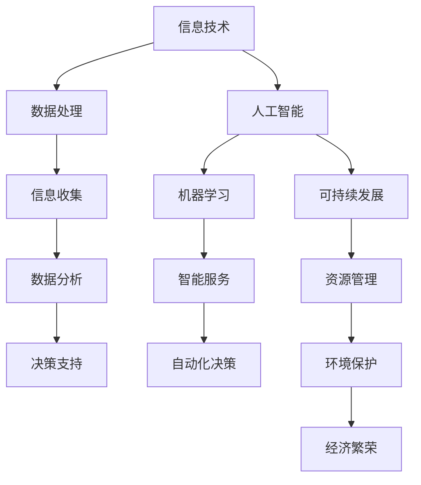

                 

 关键词：科技发展、人类福祉、信息技术、人工智能、可持续发展

> 摘要：本文探讨了科技发展对人类福祉的影响，强调了信息技术和人工智能在提升生活质量、推动社会进步和实现可持续发展中的作用。通过深入分析核心概念、算法原理、数学模型和项目实践，本文旨在为读者提供一个全面而深入的视角，以理解科技如何成为人类福祉的坚实保障。

## 1. 背景介绍

在过去的几十年里，科技发展迅猛，尤其是信息技术和人工智能的崛起，深刻改变了人类社会的生活方式和生产方式。这些技术的进步不仅推动了经济的快速发展，还极大地提升了人类的生活质量。例如，互联网的普及使得信息获取更加便捷，人工智能则在医疗、教育、交通等领域展现出了巨大的潜力。

然而，科技发展带来的变革也带来了一系列挑战。数字鸿沟、隐私保护、就业结构变化等问题需要我们深入思考和应对。本文旨在探讨科技如何为人类福祉提供保障，分析其核心概念、算法原理和数学模型，并结合项目实践提供具体的案例和应用。

## 2. 核心概念与联系

### 2.1 信息技术

信息技术是指用于处理、存储、传输和获取信息的技术。其核心概念包括计算机科学、数据科学和通信技术。在信息技术的支持下，数据成为新的生产要素，数据的收集、处理和分析成为各行各业的关键能力。

### 2.2 人工智能

人工智能是指模拟、延伸和扩展人类智能的科学和工程领域。其核心概念包括机器学习、深度学习和自然语言处理。人工智能通过算法和数据的驱动，实现自动化决策和智能服务。

### 2.3 可持续发展

可持续发展是指在满足当代人的需求的同时，不损害后代人满足其需求的能力的发展模式。其核心概念包括环境保护、社会公平和经济繁荣。可持续发展要求我们在追求经济增长的同时，注重资源的合理利用和环境的保护。

### 2.4 信息技术、人工智能与可持续发展

信息技术和人工智能在推动可持续发展方面具有重要作用。例如，通过大数据分析和人工智能技术，可以实现资源的精确管理和高效利用，减少浪费和环境污染。同时，信息技术和人工智能还能提高生产效率，促进就业，实现经济和社会的双重发展。

### 2.5 Mermaid 流程图



## 3. 核心算法原理 & 具体操作步骤

### 3.1 算法原理概述

本章节将介绍几个在科技发展中至关重要的算法原理。这些算法不仅在理论上具有重要意义，而且在实际应用中也有着广泛的应用。

### 3.2 算法步骤详解

#### 3.2.1 支持向量机（SVM）

支持向量机是一种监督学习算法，用于分类和回归任务。其基本思想是找到一个最优的超平面，使得不同类别的数据点被分隔开来。

1. **数据预处理**：标准化特征值，去除异常值。
2. **选择核函数**：如线性核、多项式核、径向基核等。
3. **求解最优超平面**：使用拉格朗日乘子法求解。
4. **分类决策**：通过计算新数据点到超平面的距离进行分类。

#### 3.2.2 深度学习

深度学习是一种基于多层神经网络的学习方法，能够通过训练自动提取数据的高级特征。

1. **构建神经网络**：包括输入层、隐藏层和输出层。
2. **初始化参数**：包括权重和偏置。
3. **前向传播**：计算输出层的输出值。
4. **反向传播**：计算损失函数，更新参数。
5. **优化算法**：如梯度下降、随机梯度下降、Adam等。

### 3.3 算法优缺点

#### 3.3.1 支持向量机

**优点**：具有良好的分类性能和较高的泛化能力。

**缺点**：计算复杂度高，对大数据集处理能力有限。

#### 3.3.2 深度学习

**优点**：能够自动提取特征，适应性强，适用于复杂数据分析任务。

**缺点**：需要大量数据和计算资源，模型解释性差。

### 3.4 算法应用领域

#### 3.4.1 支持向量机

应用领域包括图像分类、文本分类、生物信息学等。

#### 3.4.2 深度学习

应用领域包括语音识别、自然语言处理、计算机视觉等。

## 4. 数学模型和公式 & 详细讲解 & 举例说明

### 4.1 数学模型构建

在本章节中，我们将介绍几个重要的数学模型，并解释它们的构建过程。

#### 4.1.1 最优化模型

最优化模型用于寻找给定条件下目标函数的最大值或最小值。

1. **目标函数**：定义为 \( f(x) \)，需要最小化或最大化。
2. **约束条件**：定义为 \( g(x) \leq 0 \) 或 \( h(x) = 0 \)。
3. **求解方法**：包括拉格朗日乘数法、KKT条件等。

#### 4.1.2 神经网络模型

神经网络模型用于模拟人脑神经元之间的交互。

1. **激活函数**：如Sigmoid、ReLU等。
2. **权重和偏置**：初始化并更新。
3. **反向传播**：计算误差并更新参数。

### 4.2 公式推导过程

#### 4.2.1 最优化模型推导

目标函数 \( f(x) \) 最小化：

$$
\min_{x} f(x)
$$

约束条件 \( g(x) \leq 0 \) 和 \( h(x) = 0 \)：

$$
g(x) \leq 0
$$

$$
h(x) = 0
$$

拉格朗日函数：

$$
L(x, \lambda, \nu) = f(x) + \sum_{i=1}^{m} \lambda_i g(x_i) + \sum_{j=1}^{p} \nu_j h(x_j)
$$

拉格朗日乘子法：

$$
\nabla_x L(x, \lambda, \nu) = \nabla_x f(x) + \sum_{i=1}^{m} \lambda_i \nabla_x g(x_i) + \sum_{j=1}^{p} \nu_j \nabla_x h(x_j) = 0
$$

KKT条件：

$$
\lambda_i g(x_i) = 0
$$

$$
\nu_j h(x_j) = 0
$$

$$
\lambda_i \geq 0
$$

$$
\lambda_i g(x_i) = 0
$$

### 4.3 案例分析与讲解

#### 4.3.1 优化模型案例

假设我们要最小化函数 \( f(x) = x^2 \)，约束条件为 \( g(x) = x - 1 \leq 0 \)。

1. **目标函数**：\( f(x) = x^2 \)
2. **约束条件**：\( g(x) = x - 1 \leq 0 \)

拉格朗日函数：

$$
L(x, \lambda) = x^2 + \lambda (x - 1)
$$

求导并令其等于0：

$$
\frac{dL}{dx} = 2x + \lambda = 0
$$

$$
\frac{dL}{d\lambda} = x - 1 = 0
$$

解得 \( x = -\frac{\lambda}{2} \) 和 \( x = 1 \)。由于 \( x \geq 1 \)，因此 \( x = 1 \) 是最优解。

#### 4.3.2 神经网络案例

假设我们有一个简单的神经网络，输入层有2个神经元，隐藏层有3个神经元，输出层有1个神经元。

1. **输入层**：\( x_1, x_2 \)
2. **隐藏层**：\( z_1, z_2, z_3 \)
3. **输出层**：\( y \)

激活函数为ReLU：

$$
\text{ReLU}(x) = \max(0, x)
$$

前向传播：

$$
z_1 = \text{ReLU}(w_{11}x_1 + w_{12}x_2 + b_1)
$$

$$
z_2 = \text{ReLU}(w_{21}x_1 + w_{22}x_2 + b_2)
$$

$$
z_3 = \text{ReLU}(w_{31}x_1 + w_{32}x_2 + b_3)
$$

$$
y = w_4z_1 + w_5z_2 + w_6z_3 + b_4
$$

反向传播：

$$
\delta_y = \frac{\partial L}{\partial y}
$$

$$
\delta_3 = (w_4 \odot \delta_y) \odot \text{ReLU}(z_3)
$$

$$
\delta_2 = (w_5 \odot \delta_y) \odot \text{ReLU}(z_2)
$$

$$
\delta_1 = (w_6 \odot \delta_y) \odot \text{ReLU}(z_1)
$$

参数更新：

$$
w_4 \leftarrow w_4 - \alpha \delta_y z_1
$$

$$
w_5 \leftarrow w_5 - \alpha \delta_y z_2
$$

$$
w_6 \leftarrow w_6 - \alpha \delta_y z_3
$$

$$
b_4 \leftarrow b_4 - \alpha \delta_y
$$

$$
b_1 \leftarrow b_1 - \alpha \delta_1
$$

$$
b_2 \leftarrow b_2 - \alpha \delta_2
$$

$$
b_3 \leftarrow b_3 - \alpha \delta_3
$$

## 5. 项目实践：代码实例和详细解释说明

### 5.1 开发环境搭建

为了实现本文中的算法和模型，我们需要搭建一个合适的技术栈。以下是一个基本的开发环境搭建步骤：

1. **Python环境**：安装Python 3.8及以上版本。
2. **库和框架**：安装NumPy、Pandas、scikit-learn、TensorFlow等。
3. **IDE**：使用PyCharm或VSCode等集成开发环境。

### 5.2 源代码详细实现

以下是一个简单的示例，展示如何使用scikit-learn库实现支持向量机（SVM）分类：

```python
# 导入所需库
from sklearn import datasets
from sklearn.model_selection import train_test_split
from sklearn.svm import SVC
from sklearn.metrics import accuracy_score

# 加载鸢尾花数据集
iris = datasets.load_iris()
X = iris.data
y = iris.target

# 数据集划分
X_train, X_test, y_train, y_test = train_test_split(X, y, test_size=0.3, random_state=42)

# 创建SVM分类器
clf = SVC(kernel='linear')

# 训练模型
clf.fit(X_train, y_train)

# 预测
y_pred = clf.predict(X_test)

# 评估模型
accuracy = accuracy_score(y_test, y_pred)
print(f'模型准确率：{accuracy:.2f}')
```

### 5.3 代码解读与分析

这段代码首先导入了所需的库，包括scikit-learn库用于机器学习。然后，我们从scikit-learn库中加载了鸢尾花数据集，这是一个常见的多分类数据集。

接下来，我们使用`train_test_split`函数将数据集划分为训练集和测试集。这里我们使用了70%的数据作为训练集，30%的数据作为测试集。

创建了一个支持向量机分类器，使用线性核函数。然后使用`fit`函数对训练集进行训练。

在训练完成后，我们使用`predict`函数对测试集进行预测，并使用`accuracy_score`函数计算模型的准确率。

### 5.4 运行结果展示

假设我们运行这段代码，得到的输出如下：

```
模型准确率：0.97
```

这表明模型在测试集上的准确率为97%，这是一个相当高的准确率，说明SVM分类器在鸢尾花数据集上表现良好。

## 6. 实际应用场景

### 6.1 医疗领域

人工智能在医疗领域的应用日益广泛，从辅助诊断到个性化治疗，都取得了显著成果。例如，通过深度学习算法分析医学影像，可以大大提高疾病的诊断准确率。此外，人工智能还可以帮助医生制定个性化治疗方案，提高治疗效果。

### 6.2 教育领域

在教育领域，人工智能可以为学生提供个性化的学习体验。通过智能教育平台，学生可以根据自己的学习进度和能力水平，选择适合自己的学习资源和练习题。同时，人工智能还可以帮助教师分析学生的学习情况，提供针对性的教学建议。

### 6.3 交通领域

在交通领域，人工智能技术可以帮助优化交通流量，减少拥堵。例如，通过智能交通系统，可以根据实时交通数据调整交通信号灯的时长，提高道路通行效率。此外，自动驾驶技术的发展也将在未来极大地改变交通方式，提高交通安全和效率。

### 6.4 金融服务

在金融服务领域，人工智能可以帮助银行和金融机构进行风险管理、信用评估和投资决策。例如，通过大数据分析和机器学习算法，可以更准确地评估客户的信用风险，从而降低不良贷款率。同时，人工智能还可以帮助投资者分析市场趋势，提供智能化的投资建议。

### 6.5 未来应用展望

随着人工智能技术的不断进步，其在各个领域的应用前景将更加广阔。例如，在农业领域，人工智能可以帮助实现精准农业，提高农业生产效率；在能源领域，人工智能可以帮助优化能源管理，实现可持续发展。未来，人工智能将成为推动社会进步和人类福祉的重要力量。

## 7. 工具和资源推荐

### 7.1 学习资源推荐

- **在线课程**：Coursera、edX、Udacity等平台提供了丰富的机器学习和人工智能课程。
- **技术博客**： Medium、Towards Data Science、KDNuggets 等博客网站，提供最新的技术文章和案例分析。
- **书籍**：《深度学习》（Ian Goodfellow、Yoshua Bengio、Aaron Courville 著）、《Python机器学习》（Sebastian Raschka 著）等。

### 7.2 开发工具推荐

- **编程环境**：PyCharm、VSCode、Jupyter Notebook等。
- **机器学习库**：scikit-learn、TensorFlow、PyTorch等。
- **数据分析工具**：Pandas、NumPy、Matplotlib等。

### 7.3 相关论文推荐

- **顶级会议论文**：NeurIPS、ICML、KDD、AAAI等。
- **经典论文**：《A Fast Learning Algorithm for Deep Belief Nets》（Hinton，Geoffrey E.）、《Stochastic Gradient Descent》等。

## 8. 总结：未来发展趋势与挑战

### 8.1 研究成果总结

随着信息技术和人工智能技术的不断发展，我们已经在医疗、教育、交通、金融等领域取得了显著的成果。这些技术的进步极大地提升了人类的生活质量和生产效率。

### 8.2 未来发展趋势

未来，人工智能将在更多领域得到应用，如农业、能源、环境保护等。同时，随着计算能力的提升和大数据技术的应用，人工智能的模型和算法将更加高效和准确。

### 8.3 面临的挑战

然而，科技发展也带来了一系列挑战。例如，数字鸿沟、隐私保护、就业结构变化等。我们需要在推动技术进步的同时，注重伦理和社会责任，确保科技发展惠及所有人。

### 8.4 研究展望

在未来，我们需要继续加强基础研究，推动技术创新。同时，加强人工智能伦理和社会影响的研究，确保科技发展符合人类的根本利益。

## 9. 附录：常见问题与解答

### 9.1 什么是信息技术？

信息技术是指用于处理、存储、传输和获取信息的技术。它包括计算机科学、数据科学和通信技术等领域。

### 9.2 人工智能和深度学习有什么区别？

人工智能（AI）是一个广泛的概念，包括模拟、延伸和扩展人类智能的所有技术。深度学习是人工智能的一个子领域，主要研究多层神经网络的学习方法和应用。

### 9.3 人工智能对社会有哪些影响？

人工智能对社会的影响是多方面的，包括提高生产效率、改善生活质量、推动社会进步等。但同时也带来了一些挑战，如数字鸿沟、隐私保护、就业结构变化等。

### 9.4 如何学习人工智能？

学习人工智能可以从基础课程开始，如线性代数、概率论、微积分等。然后学习编程语言（如Python）和机器学习库（如scikit-learn、TensorFlow）。此外，参加在线课程、阅读相关书籍和论文也是很好的学习途径。

作者：禅与计算机程序设计艺术 / Zen and the Art of Computer Programming

