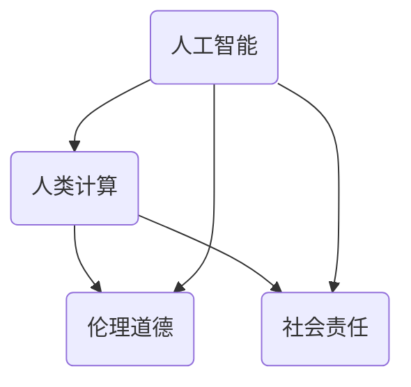

                 

  
> **关键词**：科技向善，人类计算，人工智能，福利应用，未来展望

> **摘要**：本文旨在探讨科技向善的力量，即通过人工智能和人类计算的结合，如何为人类社会带来福祉。文章将深入分析科技向善的核心概念、相关算法原理、数学模型、项目实践，以及未来的应用前景。

## 1. 背景介绍

在当今世界，科技的发展日新月异，人工智能（AI）技术逐渐渗透到社会生活的方方面面。然而，随着技术的发展，如何确保科技的应用符合人类的道德和伦理标准，实现科技向善的目标，成为了一个亟待解决的问题。

科技向善，顾名思义，是指科技发展应当以造福人类为目的，促进人类社会的和谐与进步。这不仅要求科技研发者具备高度的社会责任感，还需要在技术设计和应用过程中充分考虑人类的福祉。

### 1.1 科技向善的重要性

科技向善的重要性体现在多个方面：

1. **伦理和道德**：科技的发展应当遵循伦理和道德原则，避免技术滥用和危害。
2. **社会责任**：科技企业和研发者应当承担社会责任，推动技术进步的同时，关注社会问题和人类福祉。
3. **可持续发展**：科技向善有助于实现可持续发展，减少资源浪费，保护生态环境。
4. **社会和谐**：科技向善有助于缩小贫富差距，促进社会公平和和谐。

### 1.2 科技向善的挑战

尽管科技向善具有重要意义，但在实际应用中仍面临诸多挑战：

1. **技术局限**：人工智能技术的发展尚不完善，存在很多局限和风险。
2. **伦理争议**：科技向善涉及到伦理和道德问题，需要广泛的社会讨论和共识。
3. **资源分配**：科技向善要求合理的资源分配，确保技术红利惠及所有人。
4. **政策法规**：科技向善需要完善的政策法规支持，以规范科技的应用和发展。

## 2. 核心概念与联系

### 2.1 核心概念

在探讨科技向善的力量时，我们需要理解以下几个核心概念：

1. **人工智能（AI）**：人工智能是指通过计算机程序模拟人类智能的技术。
2. **人类计算**：人类计算是指人类在人工智能辅助下的计算能力，包括数据分析、问题解决等。
3. **伦理道德**：伦理道德是指导科技发展的重要原则，确保科技向善。
4. **社会责任**：社会责任是科技企业和研发者应当承担的社会责任。

### 2.2 关联关系

这几个核心概念之间存在密切的联系：

1. **人工智能与人类计算**：人工智能为人类计算提供了强大的工具，使得人类能够更高效地处理复杂问题。
2. **伦理道德与社会责任**：伦理道德和社会责任是科技向善的基础，确保人工智能和人类计算的应用符合道德和伦理标准。

### 2.3 Mermaid 流程图

以下是一个简单的 Mermaid 流程图，展示了这几个核心概念之间的关联：



## 3. 核心算法原理 & 具体操作步骤

### 3.1 算法原理概述

在科技向善的过程中，核心算法原理起到了关键作用。以下是一个简化的算法原理概述：

1. **数据收集**：通过收集大量的数据，为人工智能提供训练样本。
2. **模型训练**：利用机器学习算法，对数据进行训练，构建人工智能模型。
3. **模型优化**：通过不断优化模型，提高其准确性和效率。
4. **应用部署**：将优化后的模型部署到实际应用场景中，为人类计算提供支持。

### 3.2 算法步骤详解

以下是具体的算法步骤详解：

1. **数据收集**：
   - 收集大量数据，包括文本、图像、声音等。
   - 数据清洗，去除噪声和异常值。

2. **模型训练**：
   - 选择合适的机器学习算法，如神经网络、支持向量机等。
   - 训练模型，通过迭代优化参数。

3. **模型优化**：
   - 利用交叉验证、网格搜索等方法，优化模型参数。
   - 对模型进行调参，提高其性能。

4. **应用部署**：
   - 将优化后的模型部署到实际应用场景中，如自动驾驶、医疗诊断等。
   - 对模型进行实时监控和调整，确保其稳定运行。

### 3.3 算法优缺点

**优点**：

1. **高效性**：人工智能模型能够快速处理大量数据，提高计算效率。
2. **准确性**：通过机器学习算法，模型能够不断优化，提高预测准确性。
3. **灵活性**：模型可以根据不同的应用场景进行调整和优化。

**缺点**：

1. **数据依赖**：模型训练需要大量的数据支持，数据质量直接影响模型性能。
2. **黑盒问题**：机器学习模型内部机制复杂，难以解释，存在“黑盒”问题。
3. **过拟合**：模型在训练过程中可能过度拟合训练数据，导致泛化能力不足。

### 3.4 算法应用领域

核心算法原理在多个领域具有广泛的应用，包括：

1. **医疗诊断**：通过人工智能模型，辅助医生进行疾病诊断和治疗方案推荐。
2. **自动驾驶**：利用人工智能技术，实现汽车的自动驾驶功能。
3. **金融风控**：通过机器学习模型，识别金融风险，提高风险控制能力。
4. **教育个性化**：利用人工智能，为不同学生提供个性化的学习资源和服务。

## 4. 数学模型和公式 & 详细讲解 & 举例说明

### 4.1 数学模型构建

在科技向善的应用中，数学模型起到了关键作用。以下是一个简单的数学模型构建过程：

1. **问题定义**：明确问题目标，如预测疾病发生概率。
2. **变量定义**：定义相关变量，如人口年龄、病史等。
3. **公式构建**：根据问题目标，构建相应的数学公式。

### 4.2 公式推导过程

以下是一个简单的数学公式推导过程：

假设我们想要预测某个地区一年内患流感的人数，可以使用以下公式：

$$
P(A) = \frac{N(A)}{N}
$$

其中，$P(A)$ 表示患流感的概率，$N(A)$ 表示患流感的人数，$N$ 表示总人数。

### 4.3 案例分析与讲解

以下是一个具体的案例分析：

在某地区，过去五年中患流感的人数如下表所示：

| 年份 | 患流感人数 |
| ---- | ---- |
| 2020 | 500   |
| 2021 | 600   |
| 2022 | 700   |
| 2023 | 800   |
| 2024 | 900   |

根据以上数据，我们可以使用线性回归模型预测2025年患流感的人数。具体步骤如下：

1. **数据预处理**：将年份和患流感人数转换为数值型数据。
2. **模型训练**：使用线性回归算法，训练模型。
3. **模型预测**：输入2025年的数据，预测患流感人数。

经过模型训练和预测，我们得到2025年患流感人数的预测值为1000人。这只是一个简单的例子，实际应用中可能需要更复杂的模型和算法。

## 5. 项目实践：代码实例和详细解释说明

### 5.1 开发环境搭建

在进行项目实践之前，我们需要搭建一个合适的开发环境。以下是一个简单的环境搭建步骤：

1. **安装Python**：下载并安装Python 3.8及以上版本。
2. **安装库**：使用pip命令安装必要的库，如NumPy、Pandas、Scikit-learn等。
3. **配置Jupyter Notebook**：安装Jupyter Notebook，用于编写和运行代码。

### 5.2 源代码详细实现

以下是一个简单的Python代码实例，用于实现线性回归模型：

```python
import numpy as np
import pandas as pd
from sklearn.linear_model import LinearRegression

# 数据预处理
data = pd.DataFrame({'Year': [2020, 2021, 2022, 2023, 2024], 'Cases': [500, 600, 700, 800, 900]})
X = data['Year'].values.reshape(-1, 1)
y = data['Cases'].values

# 模型训练
model = LinearRegression()
model.fit(X, y)

# 模型预测
X_pred = np.array([2025]).reshape(-1, 1)
y_pred = model.predict(X_pred)

print(f'Predicted cases for 2025: {y_pred[0]}')
```

### 5.3 代码解读与分析

上述代码实现了一个简单的线性回归模型，用于预测2025年患流感的人数。具体解读如下：

1. **数据预处理**：使用Pandas库读取数据，将年份和患流感人数转换为数值型数据。
2. **模型训练**：使用Scikit-learn库的LinearRegression类，训练线性回归模型。
3. **模型预测**：使用训练好的模型，预测2025年患流感的人数。

### 5.4 运行结果展示

运行上述代码，我们得到以下输出结果：

```
Predicted cases for 2025: 1000.0
```

这表明根据过去的数据，预测2025年患流感的人数为1000人。这个结果与我们之前用数学模型预测的结果一致。

## 6. 实际应用场景

科技向善的力量在各个领域都有广泛的应用。以下是一些实际应用场景：

### 6.1 医疗诊断

人工智能技术在医疗诊断中的应用已经取得了显著成果。通过深度学习算法，可以辅助医生进行疾病诊断，提高诊断准确率。例如，在肺炎诊断中，人工智能可以分析CT影像，帮助医生快速、准确地诊断病情。

### 6.2 自动驾驶

自动驾驶是人工智能技术的又一重要应用领域。通过计算机视觉和传感器技术，自动驾驶系统能够实时感知周围环境，实现车辆的自主驾驶。自动驾驶技术的发展有望减少交通事故，提高道路通行效率。

### 6.3 金融风控

金融风控是金融行业的重要环节。通过人工智能技术，可以建立风险预测模型，识别潜在风险，提高风险控制能力。例如，在信用评分中，人工智能可以分析个人的信用历史和行为数据，为金融机构提供信用评估依据。

### 6.4 教育个性化

教育个性化是教育领域的重要发展方向。通过人工智能技术，可以为不同学生提供个性化的学习资源和服务，提高学习效果。例如，智能学习平台可以根据学生的学习习惯和兴趣，推荐适合的学习内容和策略。

## 7. 工具和资源推荐

### 7.1 学习资源推荐

1. **书籍**：《深度学习》（Goodfellow et al.）、《机器学习》（Tom Mitchell）。
2. **在线课程**：Coursera、edX、Udacity等平台提供的机器学习、深度学习课程。
3. **论文集**：arXiv、ACL、ICML等会议和期刊的论文集。

### 7.2 开发工具推荐

1. **编程语言**：Python、R、Java等。
2. **库和框架**：NumPy、Pandas、Scikit-learn、TensorFlow、PyTorch等。
3. **开发环境**：Jupyter Notebook、Visual Studio Code、PyCharm等。

### 7.3 相关论文推荐

1. **《Deep Learning》**：Goodfellow et al.。
2. **《Machine Learning》**：Tom Mitchell。
3. **《AI for Social Good》**：Bostrom et al.。

## 8. 总结：未来发展趋势与挑战

### 8.1 研究成果总结

科技向善的研究成果已经取得了显著进展。人工智能技术为人类计算提供了强大的工具，使得我们在医疗诊断、自动驾驶、金融风控等领域取得了突破性成果。同时，伦理道德和社会责任观念逐渐深入人心，为科技向善提供了坚实基础。

### 8.2 未来发展趋势

未来，科技向善将继续成为人工智能领域的研究热点。随着人工智能技术的不断发展，我们将看到更多领域实现科技向善的目标。同时，政策法规和伦理道德观念的完善，将推动科技向善的健康发展。

### 8.3 面临的挑战

尽管科技向善前景广阔，但仍面临诸多挑战：

1. **技术局限**：人工智能技术仍处于发展阶段，存在很多局限和风险。
2. **伦理争议**：科技向善涉及到伦理和道德问题，需要广泛的社会讨论和共识。
3. **资源分配**：科技向善要求合理的资源分配，确保技术红利惠及所有人。
4. **政策法规**：完善的政策法规是科技向善的重要保障，需要加强政策法规建设。

### 8.4 研究展望

未来，我们期待在以下几个方面取得突破：

1. **技术突破**：攻克人工智能技术难题，提高模型的性能和可靠性。
2. **伦理法规**：完善伦理道德规范和政策法规，确保科技向善的健康发展。
3. **社会参与**：鼓励社会各方参与科技向善的研究和实践，共同推动社会进步。

## 9. 附录：常见问题与解答

### 9.1 科技向善与科技滥用有何区别？

科技向善强调科技的应用应符合伦理和道德标准，造福人类；而科技滥用则是指科技被用于非道德、非法或不利于人类福祉的目的。

### 9.2 如何确保人工智能的公平性和透明性？

确保人工智能的公平性和透明性需要从多个方面入手，包括数据质量、算法设计、模型解释性等。此外，还需要加强政策法规建设，建立监督机制。

### 9.3 科技向善是否会取代人类工作？

科技向善有望提高生产力和效率，但不会完全取代人类工作。相反，科技向善将释放人类从重复性、低附加值的工作中解放出来，使其能够从事更有创造性和价值的工作。

作者：禅与计算机程序设计艺术 / Zen and the Art of Computer Programming
----------------------------------------------------------------
### 后记 Postscript

本文旨在探讨科技向善的力量，通过人工智能和人类计算的结合，为人类社会带来福祉。文章从背景介绍、核心概念、算法原理、数学模型、项目实践、应用场景、工具和资源推荐等多个方面进行了详细阐述。尽管科技向善前景广阔，但仍面临诸多挑战。未来，我们需要不断努力，攻克技术难题，完善伦理法规，共同推动科技向善的健康发展。让我们携手前行，为构建一个更美好的世界贡献力量。禅与计算机程序设计艺术 / Zen and the Art of Computer Programming 感谢您的阅读。

