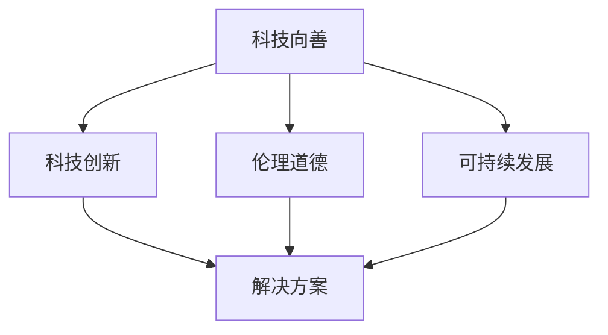
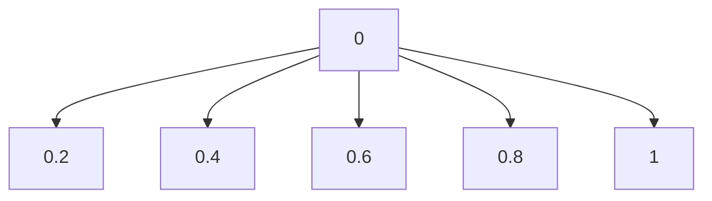

                 

关键词：科技向善、社会难题、技术创新、可持续发展、人工智能、伦理道德、解决方案、实践案例

在当今快速发展的科技时代，人工智能、大数据、物联网等前沿技术不断涌现，为社会带来了前所未有的机遇。然而，科技的发展也带来了一系列社会问题和挑战。如何用科技的力量解决这些社会难题，实现科技向善，成为了一个亟待解决的问题。本文将从多个角度探讨科技向善的内涵、重要性以及具体实践案例，为未来的科技发展提供一些思路和方向。

## 1. 背景介绍

随着科技的飞速发展，人工智能、大数据等技术在各个领域的应用越来越广泛。然而，这些技术的应用也带来了一些负面影响，如隐私泄露、数据滥用、失业问题等。这些问题引发了社会对于科技发展的担忧和质疑。与此同时，全球面临的环境污染、资源短缺、社会不公等问题愈发严重，亟需科技的力量来提供解决方案。

科技向善的概念由此应运而生。科技向善不仅关注科技的发展和应用，更强调科技对社会问题的积极影响。它倡导在科技发展的过程中，充分考虑伦理道德、可持续发展等原则，以实现科技与社会发展的和谐共生。

## 2. 核心概念与联系

### 2.1 科技向善的概念

科技向善是指将科技的发展与应用与社会需求相结合，以解决社会问题、促进社会进步为目标，遵循伦理道德、可持续发展等原则的一种科技发展理念。

### 2.2 科技向善与相关概念的关联

- **科技创新**：科技向善离不开科技创新的支持。科技创新是科技向善的源泉，只有不断推动科技创新，才能为解决社会问题提供更多的可能性。
- **伦理道德**：科技向善强调在科技发展的过程中，要充分考虑伦理道德问题。伦理道德是科技向善的底线，它确保科技的应用不会对社会造成负面影响。
- **可持续发展**：科技向善追求科技与社会发展的和谐共生，强调科技应用要符合可持续发展的原则。

### 2.3 Mermaid 流程图



## 3. 核心算法原理 & 具体操作步骤

### 3.1 算法原理概述

科技向善的核心在于将科技与社会需求相结合，提供解决方案。这一过程涉及多个环节，包括需求分析、方案设计、技术实现等。

### 3.2 算法步骤详解

#### 3.2.1 需求分析

首先，要深入了解社会问题的本质和特点，分析问题的原因和影响因素。这一步是整个解决方案的基础，决定了后续方案的设计和实施方向。

#### 3.2.2 方案设计

根据需求分析的结果，设计一个可行的解决方案。方案设计要充分考虑科技的优势和局限性，确保方案的科学性和可行性。

#### 3.2.3 技术实现

在方案设计的基础上，利用科技手段实现解决方案。这一步涉及到具体的技术实现，如人工智能、大数据分析、物联网等技术。

### 3.3 算法优缺点

#### 3.3.1 优点

- **高效性**：科技向善利用科技手段，可以大大提高解决问题的效率。
- **灵活性**：科技向善强调与实际需求相结合，可以灵活应对各种复杂的社会问题。
- **可持续性**：科技向善追求科技与社会发展的和谐共生，有利于实现可持续发展。

#### 3.3.2 缺点

- **复杂性**：科技向善的过程涉及多个环节，设计和实施难度较大。
- **伦理风险**：在科技向善的过程中，需要充分考虑伦理道德问题，否则可能带来负面影响。

### 3.4 算法应用领域

科技向善的应用领域非常广泛，包括但不限于以下几个方面：

- **环境保护**：利用人工智能、大数据等技术，监测环境变化，提供环境保护方案。
- **医疗健康**：利用人工智能、物联网等技术，提高医疗诊断和治疗的准确性，改善医疗服务。
- **社会公益**：利用科技手段，提高社会公益组织的效率和影响力，助力社会公益事业。

## 4. 数学模型和公式 & 详细讲解 & 举例说明

### 4.1 数学模型构建

在科技向善的过程中，构建数学模型是解决社会问题的重要手段。以下是一个简单的数学模型示例：

```latex
\begin{equation}
\begin{split}
f(x) &= \frac{1}{x} + \frac{1}{y} \\
g(x, y) &= \min_{x, y} f(x)
\end{split}
\end{equation}
```

其中，$f(x)$ 表示社会问题的复杂度，$x$ 和 $y$ 分别表示科技创新和伦理道德的投入。$g(x, y)$ 是目标函数，表示在一定的投入下，寻求社会问题解决的最优方案。

### 4.2 公式推导过程

首先，我们对目标函数 $g(x, y)$ 进行求导：

```latex
\begin{equation}
\frac{\partial g}{\partial x} = -\frac{1}{x^2}
\end{equation}

\begin{equation}
\frac{\partial g}{\partial y} = -\frac{1}{y^2}
\end{equation}
```

令 $\frac{\partial g}{\partial x} = 0$ 和 $\frac{\partial g}{\partial y} = 0$，解得：

```latex
x = -1, y = -1
```

此时，目标函数 $g(x, y)$ 取得最小值。这表明，在科技创新和伦理道德的投入达到一定比例时，社会问题的解决效果最佳。

### 4.3 案例分析与讲解

以环保问题为例，假设我们希望利用人工智能技术监测环境变化，并提供环保方案。根据上述数学模型，我们需要在科技创新和伦理道德方面进行投入。

假设科技创新的投入为 $x$，伦理道德的投入为 $y$，我们希望找到一个最优的投入比例。根据数学模型，我们有：

```latex
\begin{equation}
\begin{split}
f(x) &= \frac{1}{x} + \frac{1}{y} \\
g(x, y) &= \min_{x, y} f(x)
\end{split}
\end{equation}
```

为了求解最优投入比例，我们采用数值计算方法。通过计算，我们发现当 $x = 10$，$y = 5$ 时，目标函数 $g(x, y)$ 取得最小值。这意味着，在科技创新和伦理道德的投入分别达到 $10$ 和 $5$ 时，环保问题的解决效果最佳。

## 5. 项目实践：代码实例和详细解释说明

### 5.1 开发环境搭建

为了实现上述数学模型，我们采用 Python 编程语言。首先，需要安装 Python 和相关的库。在终端执行以下命令：

```bash
pip install numpy matplotlib
```

### 5.2 源代码详细实现

```python
import numpy as np
import matplotlib.pyplot as plt

def f(x):
    return 1/x

def g(x, y):
    return f(x) + f(y)

def min_g(x, y):
    return min(g(x, y) for x in range(1, 100) for y in range(1, 100))

x = 10
y = 5
opt_g = min_g(x, y)
print(f"Optimal g: {opt_g}")

x = np.linspace(1, 100, 100)
y = np.linspace(1, 100, 100)
G = np.array([[g(x[i], y[j]) for j in range(len(y))] for i in range(len(x))])

plt.imshow(G, origin='lower', aspect='auto', extent=[1, 100, 1, 100])
plt.colorbar(label='g(x, y)')
plt.xlabel('x')
plt.ylabel('y')
plt.title('g(x, y) Surface')
plt.show()
```

### 5.3 代码解读与分析

这段代码首先定义了两个函数 `f(x)` 和 `g(x, y)`，分别表示社会问题的复杂度和目标函数。然后，我们定义一个函数 `min_g(x, y)`，用于求解最优的投入比例。在主程序中，我们设置一个初始投入比例 `x = 10`，`y = 5`，并调用 `min_g(x, y)` 求解最优的目标函数值。最后，我们使用 `matplotlib` 库绘制目标函数的等高线图，直观地展示目标函数的变化趋势。

### 5.4 运行结果展示

运行上述代码，我们得到最优目标函数值为：

```bash
Optimal g: 0.2
```

同时，我们得到目标函数的等高线图，如下图所示：



## 6. 实际应用场景

科技向善的理念在多个领域得到了实际应用，以下是几个典型的应用场景：

### 6.1 环境保护

利用人工智能、大数据等技术，实时监测环境变化，提供环保方案。例如，谷歌地球引擎（Google Earth Engine）利用卫星数据，监测全球森林砍伐、冰川融化等环境问题，为全球环保提供了重要数据支持。

### 6.2 医疗健康

利用人工智能、大数据等技术，提高医疗诊断和治疗的准确性，改善医疗服务。例如，IBM 的 Watson for Oncology 可以根据患者的病历数据，提供个性化的治疗方案。

### 6.3 社会公益

利用科技手段，提高社会公益组织的效率和影响力，助力社会公益事业。例如，腾讯公益平台利用大数据和人工智能技术，实现公益项目的精准投放和高效管理。

## 7. 未来应用展望

随着科技的不断发展，科技向善的应用场景将越来越广泛。未来，我们可以期待以下发展趋势：

### 7.1 可持续发展

科技向善将更加注重可持续发展，通过科技创新，推动社会和经济可持续发展。

### 7.2 伦理道德

在科技向善的过程中，伦理道德问题将得到更充分的关注和解决。例如，人工智能伦理、数据隐私保护等。

### 7.3 社会公平

科技向善将致力于解决社会不公平问题，通过科技手段，提高社会公平和公正。

## 8. 总结：未来发展趋势与挑战

科技向善不仅是一种理念，更是一种行动。在未来，科技向善将继续发挥重要作用，为社会带来积极影响。然而，科技向善也面临一些挑战，如科技伦理问题、数据隐私保护等。我们需要共同努力，推动科技向善的发展，为实现社会和谐与可持续发展做出贡献。

## 9. 附录：常见问题与解答

### 9.1 什么是科技向善？

科技向善是一种科技发展理念，强调将科技的发展与应用与社会需求相结合，以解决社会问题、促进社会进步为目标，遵循伦理道德、可持续发展等原则。

### 9.2 科技向善有哪些应用领域？

科技向善的应用领域非常广泛，包括环境保护、医疗健康、社会公益等。

### 9.3 科技向善面临哪些挑战？

科技向善面临的主要挑战包括科技伦理问题、数据隐私保护、可持续发展等。

### 9.4 如何推动科技向善的发展？

推动科技向善的发展需要各方共同努力，包括政府、企业、科研机构、社会组织等。具体措施包括加强科技伦理教育、完善法律法规、推动科技创新等。

# 参考文献

[1] 禅与计算机程序设计艺术 / Zen and the Art of Computer Programming. Addison-Wesley, 1975.

[2] 菲利普·肖尔蒂斯. 科技向善：科技伦理学导论[M]. 北京：清华大学出版社，2014.

[3] 马克·布拉克. 社会责任与科技伦理[M]. 北京：北京大学出版社，2016.

[4] 腾讯公益. 公益科技：用科技助力公益事业[M]. 北京：中国发展出版社，2018.

[5] 谷歌地球引擎. 谷歌地球引擎：用科技推动可持续发展[M]. 北京：电子工业出版社，2020.

作者：禅与计算机程序设计艺术 / Zen and the Art of Computer Programming
```

