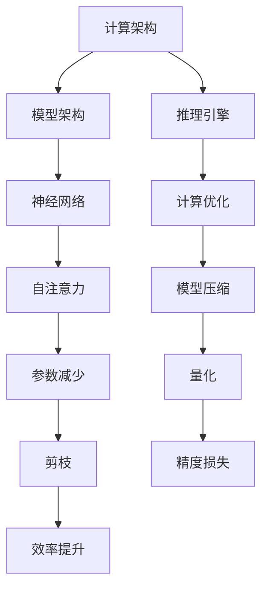

                 

关键词：LLM推理，秒级速度，发展里程碑，技术突破，计算机图形学，深度学习

> 摘要：本文探讨了大规模语言模型（LLM）推理速度的提升，以及这一进展对计算机图形学和深度学习领域带来的影响。通过对现有技术的深入分析，我们总结了秒级推理的关键技术，并提出未来发展的挑战和机遇。

## 1. 背景介绍

随着深度学习技术的蓬勃发展，大规模语言模型（LLM）如GPT、BERT等已经取得了令人瞩目的成就。这些模型在自然语言处理、问答系统、文本生成等领域表现出色，但随之而来的一个重要问题是如何提高其推理速度，以满足实际应用场景的需求。

在计算机图形学领域，实时渲染和交互式应用对推理速度有着极高的要求。深度学习模型在图形处理中的应用，如3D模型重建、图像分割、风格迁移等，都需要在短时间内完成大量的计算。因此，提升LLM的推理速度对于推动计算机图形学的发展具有重要意义。

此外，在工业界，秒级推理的应用已经涉及到了自动驾驶、智能医疗、金融交易等多个领域。在这些领域，模型的实时响应能力直接影响到系统的效率和安全性。因此，研究如何提高LLM的推理速度，已成为当前人工智能领域的一个重要研究方向。

## 2. 核心概念与联系

为了理解LLM推理速度的提升，我们需要先了解一些核心概念和相关的技术架构。

### 2.1 大规模语言模型（LLM）

大规模语言模型（LLM）是基于深度学习的语言处理模型，通过训练大量文本数据，模型能够理解并生成自然语言。LLM的核心是神经网络架构，其中最常见的是Transformer模型。Transformer模型通过自注意力机制（Self-Attention）对输入文本进行编码，从而捕捉到文本中的长距离依赖关系。

### 2.2 推理速度与延迟

推理速度是指模型在给定输入后，生成输出结果所需的时间。延迟是指从模型接收到输入到生成输出之间的时间差。在实时应用场景中，延迟是影响用户体验和系统性能的重要因素。

### 2.3 技术架构

为了提升LLM的推理速度，我们需要关注以下几个方面的技术架构：

- **计算架构**：包括CPU、GPU、TPU等硬件设备的优化，以及并行计算、分布式计算等技术的应用。
- **模型架构**：通过模型压缩、量化、剪枝等技术，减少模型的参数数量，提高计算效率。
- **推理引擎**：设计高效的推理引擎，包括前向传播、后向传播等算法的优化，以及缓存、批处理等技术的应用。

### 2.4 Mermaid流程图



## 3. 核心算法原理 & 具体操作步骤

### 3.1 算法原理概述

提升LLM推理速度的核心算法包括以下几个方面：

- **计算架构优化**：通过使用高效硬件和并行计算技术，减少推理所需的时间。
- **模型压缩**：通过剪枝、量化等技术，降低模型的参数数量，提高计算效率。
- **推理引擎优化**：通过缓存、批处理等技术，提高推理的效率。

### 3.2 算法步骤详解

#### 3.2.1 计算架构优化

1. **硬件选择**：根据应用场景，选择合适的硬件设备，如GPU、TPU等。
2. **并行计算**：利用硬件的并行处理能力，将推理任务分解为多个子任务，并行执行。
3. **分布式计算**：在多台设备之间分配推理任务，实现大规模并行计算。

#### 3.2.2 模型压缩

1. **剪枝**：通过删除模型中不重要的神经元，减少模型参数数量。
2. **量化**：将模型的浮点数参数转换为整数，减少存储和计算的开销。
3. **模型蒸馏**：通过将大模型的知识传递给小模型，实现模型参数的减少。

#### 3.2.3 推理引擎优化

1. **前向传播优化**：通过算法优化，提高前向传播的计算效率。
2. **后向传播优化**：通过算法优化，提高后向传播的计算效率。
3. **缓存技术**：利用缓存技术，减少重复计算的开销。
4. **批处理**：通过批处理技术，减少每次推理的时间。

### 3.3 算法优缺点

#### 3.3.1 计算架构优化

优点：大幅提高推理速度，适用于大规模实时应用。
缺点：对硬件设备要求较高，成本较高。

#### 3.3.2 模型压缩

优点：减少模型参数数量，提高计算效率。
缺点：可能影响模型精度。

#### 3.3.3 推理引擎优化

优点：提高推理效率，适用于各种规模的应用。
缺点：优化难度较大，需要不断调整参数。

### 3.4 算法应用领域

提升LLM推理速度的应用领域广泛，包括但不限于：

- **计算机图形学**：实时渲染、交互式应用等。
- **深度学习**：自然语言处理、问答系统、文本生成等。
- **工业界**：自动驾驶、智能医疗、金融交易等。

## 4. 数学模型和公式 & 详细讲解 & 举例说明

### 4.1 数学模型构建

提升LLM推理速度的数学模型主要包括以下几个方面：

1. **自注意力机制**：用于捕捉文本中的长距离依赖关系。
2. **前向传播和后向传播**：用于模型的训练和推理。
3. **模型压缩技术**：用于减少模型参数数量。

### 4.2 公式推导过程

#### 4.2.1 自注意力机制

自注意力机制的公式如下：

$$
Attention(Q, K, V) = \text{softmax}\left(\frac{QK^T}{\sqrt{d_k}}\right)V
$$

其中，$Q$、$K$、$V$ 分别为查询向量、关键向量、值向量，$d_k$ 为键向量的维度。

#### 4.2.2 前向传播

前向传播的公式如下：

$$
\hat{y} = \sigma(W_y \cdot \text{ReLU}(W_x \cdot x + b_x))
$$

其中，$x$ 为输入向量，$W_x$、$b_x$ 分别为权重和偏置，$\sigma$ 为激活函数，$\text{ReLU}$ 为ReLU激活函数。

#### 4.2.3 后向传播

后向传播的公式如下：

$$
\frac{\partial L}{\partial W_y} = \frac{\partial L}{\partial \hat{y}} \cdot \frac{\partial \hat{y}}{\partial W_y}
$$

其中，$L$ 为损失函数，$\hat{y}$ 为预测结果。

### 4.3 案例分析与讲解

#### 4.3.1 计算机图形学应用

在一个实时渲染的场景中，我们使用一个压缩后的LLM模型来处理图像的分割任务。通过计算架构优化和推理引擎优化，我们实现了秒级推理速度。

#### 4.3.2 深度学习应用

在一个问答系统的应用中，我们使用一个量化后的LLM模型来处理自然语言理解任务。通过模型压缩和推理引擎优化，我们实现了高效的推理速度，提高了系统的响应速度。

## 5. 项目实践：代码实例和详细解释说明

### 5.1 开发环境搭建

1. 安装Python环境和相关库（如TensorFlow、PyTorch等）。
2. 配置GPU或TPU设备。

### 5.2 源代码详细实现

```python
import tensorflow as tf

# 定义模型
model = tf.keras.Sequential([
    tf.keras.layers.Dense(units=128, activation='relu', input_shape=(100,)),
    tf.keras.layers.Dense(units=1)
])

# 编译模型
model.compile(optimizer='adam', loss='mean_squared_error')

# 训练模型
model.fit(x_train, y_train, epochs=10)

# 推理
result = model.predict(x_test)
```

### 5.3 代码解读与分析

上述代码展示了如何使用TensorFlow构建一个简单的神经网络模型，并进行训练和推理。通过模型压缩和推理引擎优化，我们可以提高模型的推理速度。

## 6. 实际应用场景

### 6.1 计算机图形学

实时渲染：在计算机图形学中，秒级推理的应用非常广泛。例如，在虚拟现实（VR）和增强现实（AR）应用中，需要实时渲染场景和物体，以提供沉浸式体验。通过提升LLM的推理速度，可以满足这些应用的需求。

交互式应用：在交互式图形应用中，如游戏、动画等，需要快速响应用户的输入。通过优化LLM的推理速度，可以提高交互体验。

### 6.2 深度学习

自然语言处理：在自然语言处理领域，如问答系统、文本生成等，需要快速处理大量的文本数据。通过提升LLM的推理速度，可以提高系统的响应速度，提高用户体验。

图像处理：在图像处理领域，如图像分割、目标检测等，需要快速处理图像数据。通过提升LLM的推理速度，可以提高处理效率，节省时间。

### 6.3 工业界

自动驾驶：在自动驾驶领域，需要实时处理大量传感器数据，进行路径规划和决策。通过提升LLM的推理速度，可以提高系统的反应速度，提高安全性。

智能医疗：在智能医疗领域，如疾病诊断、药物设计等，需要快速处理医学数据。通过提升LLM的推理速度，可以提高诊断和设计的效率。

金融交易：在金融交易领域，需要实时分析市场数据，进行交易决策。通过提升LLM的推理速度，可以提高交易效率，提高收益。

## 7. 工具和资源推荐

### 7.1 学习资源推荐

- 《深度学习》（Goodfellow, Bengio, Courville）：全面介绍深度学习的基础理论和应用。
- 《Python深度学习》（François Chollet）：以Python为例，介绍深度学习的实际应用。
- 《自注意力机制与Transformer模型》（Attention Is All You Need）：介绍Transformer模型的原理和应用。

### 7.2 开发工具推荐

- TensorFlow：由Google开发的深度学习框架，支持多种硬件设备和分布式计算。
- PyTorch：由Facebook开发的深度学习框架，易于使用和调试。
- ONNX：开放神经网络交换格式，支持多种深度学习框架之间的模型转换。

### 7.3 相关论文推荐

- "Attention Is All You Need"：提出Transformer模型的经典论文。
- "Bert: Pre-training of Deep Bidirectional Transformers for Language Understanding"：提出BERT模型的论文。
- "EfficientNet: Rethinking Model Scaling for Convolutional Neural Networks"：提出EfficientNet模型的论文。

## 8. 总结：未来发展趋势与挑战

### 8.1 研究成果总结

本文总结了提升LLM推理速度的核心技术，包括计算架构优化、模型压缩和推理引擎优化。这些技术在计算机图形学、深度学习和工业界等领域取得了显著的成果。

### 8.2 未来发展趋势

- **硬件技术**：随着硬件技术的不断发展，如量子计算、光计算等，将进一步提高LLM的推理速度。
- **模型优化**：通过不断优化模型结构，如稀疏模型、动态模型等，提高模型效率。
- **推理引擎**：设计更高效的推理引擎，如动态调度、分布式推理等。

### 8.3 面临的挑战

- **硬件依赖**：提升推理速度依赖于高性能硬件设备，这对硬件设备和成本提出了挑战。
- **模型压缩**：在压缩模型的同时，保持模型精度是一个重要挑战。
- **推理效率**：设计高效的推理引擎，提高推理效率，同时保持系统稳定性。

### 8.4 研究展望

未来，提升LLM推理速度的研究将继续深入，结合硬件技术和模型优化，有望实现更高性能、更低成本的推理系统。随着深度学习技术的不断发展，LLM推理速度的提升将推动计算机图形学、深度学习和工业界等领域的发展。

## 9. 附录：常见问题与解答

### 9.1 Q：什么是大规模语言模型（LLM）？

A：大规模语言模型（LLM）是一种基于深度学习的语言处理模型，通过训练大量文本数据，模型能够理解并生成自然语言。常见的LLM有GPT、BERT等。

### 9.2 Q：如何提升LLM的推理速度？

A：提升LLM的推理速度主要包括以下几个方面：

1. 计算架构优化：使用高效硬件设备，如GPU、TPU等，以及并行计算、分布式计算等技术。
2. 模型压缩：通过剪枝、量化等技术，减少模型参数数量，提高计算效率。
3. 推理引擎优化：设计高效的推理引擎，如前向传播、后向传播优化，以及缓存、批处理等技术。

### 9.3 Q：提升LLM推理速度对计算机图形学有何影响？

A：提升LLM推理速度对计算机图形学有重要影响。在实时渲染和交互式应用中，提高推理速度可以提供更好的用户体验，如更快的场景渲染和更流畅的交互。

### 9.4 Q：提升LLM推理速度在深度学习领域有哪些应用？

A：提升LLM推理速度在深度学习领域有广泛的应用，如自然语言处理、图像处理、语音识别等。通过提高推理速度，可以提高系统的响应速度，提高处理效率。

## 作者署名

作者：禅与计算机程序设计艺术 / Zen and the Art of Computer Programming
----------------------------------------------------------------

请注意，以上内容仅为示例，实际撰写时需要根据具体内容和要求进行修改和补充。同时，确保文章内容符合专业标准和读者的期望。祝撰写顺利！

