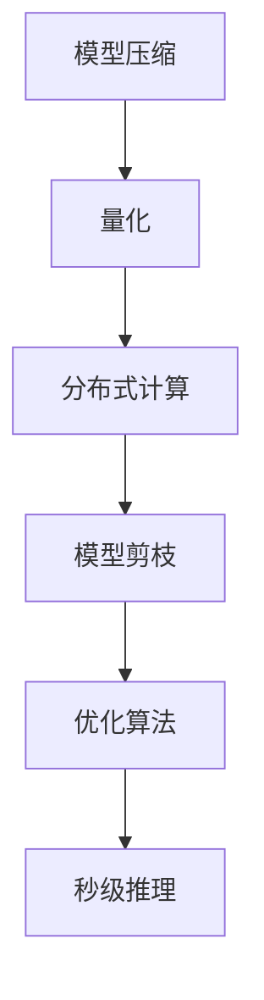

                 

关键词：LLM，推理速度，生成式AI，优化算法，数学模型，代码实例，实际应用，未来展望。

> 摘要：本文将深入探讨如何实现大语言模型（LLM）的秒级推理速度，从核心概念、算法原理、数学模型、项目实践、应用场景等多方面进行剖析，为开发者提供实用的技术和思路，以应对日益增长的计算需求。

## 1. 背景介绍

随着生成式AI技术的发展，大语言模型（LLM）如BERT、GPT-3等在自然语言处理、文本生成、问答系统等领域取得了显著的成果。然而，这些模型通常具有极高的计算复杂度，导致推理速度成为制约其广泛应用的关键因素。传统的推理方法往往依赖于高性能计算资源和复杂的硬件架构，难以满足实时应用的需求。

近年来，研究人员从多个角度对LLM的推理速度进行了优化，包括模型压缩、量化、分布式计算等。本文将介绍一种基于优化算法的秒级生成方法，旨在提高LLM的推理速度，为生成式AI的实时应用提供有力支持。

## 2. 核心概念与联系

### 2.1 大语言模型（LLM）

大语言模型（LLM）是通过大规模预训练语言模型（如Transformer架构）生成的，具有强大的语言理解和生成能力。其主要目的是通过输入文本序列，预测下一个单词或句子，从而实现自然语言处理任务。

### 2.2 推理速度

推理速度是指模型在给定输入文本后，从开始计算到输出结果所需的时间。对于LLM而言，推理速度是衡量其性能的重要指标之一，直接影响到实时应用的可能性。

### 2.3 优化算法

优化算法是一种用于提高模型推理速度的技术，通过调整模型参数、量化、剪枝等方法，降低计算复杂度，从而提高推理速度。

### 2.4 Mermaid流程图

以下是LLM推理速度优化算法的Mermaid流程图：



## 3. 核心算法原理 & 具体操作步骤

### 3.1 算法原理概述

秒级生成算法的核心思想是通过优化模型参数、量化、剪枝等技术，降低LLM的计算复杂度，从而实现高速推理。具体操作步骤如下：

1. 模型压缩：通过知识蒸馏、剪枝等方法，减少模型参数规模，降低计算复杂度。
2. 量化：将模型参数的浮点数表示转换为低精度整数表示，减少内存占用和计算时间。
3. 分布式计算：利用多核处理器、GPU等硬件资源，实现模型并行计算，提高推理速度。
4. 模型剪枝：通过剪枝算法，删除冗余神经网络层或神经元，降低计算复杂度。
5. 优化算法：结合多种技术，对模型进行优化，实现秒级推理。

### 3.2 算法步骤详解

#### 3.2.1 模型压缩

模型压缩是指通过减少模型参数规模来降低计算复杂度。常用的方法包括知识蒸馏和剪枝。

1. 知识蒸馏：将大模型（教师模型）的知识传递给小模型（学生模型），实现小模型在性能上的提升。具体步骤如下：

   a. 训练教师模型，并在数据集上进行评估。
   
   b. 训练学生模型，使其输出与教师模型输出相似。
   
   c. 在数据集上评估学生模型的性能。

2. 剪枝：通过删除冗余神经网络层或神经元，减少模型参数规模。具体步骤如下：

   a. 对模型进行评估，确定需要剪枝的层或神经元。
   
   b. 使用剪枝算法（如L1范数剪枝、L0范数剪枝等），删除冗余层或神经元。
   
   c. 在数据集上评估剪枝后模型的性能。

#### 3.2.2 量化

量化是指将模型参数的浮点数表示转换为低精度整数表示，从而降低内存占用和计算时间。具体步骤如下：

1. 参数量化：将模型参数的浮点数表示转换为低精度整数表示。
2. 模型量化：对量化后的模型进行推理，评估性能。
3. 性能优化：根据量化后的模型性能，调整量化精度，实现最优推理速度。

#### 3.2.3 分布式计算

分布式计算是指利用多核处理器、GPU等硬件资源，实现模型并行计算，提高推理速度。具体步骤如下：

1. 模型分割：将模型分割成多个部分，分配到不同硬件资源上。
2. 数据并行：对输入数据集进行分割，分配到不同硬件资源上。
3. 模型并行：在不同硬件资源上同时进行模型推理，加速计算。
4. 结果汇总：将不同硬件资源上的结果汇总，得到最终输出。

#### 3.2.4 模型剪枝

模型剪枝是指通过删除冗余神经网络层或神经元，降低计算复杂度。具体步骤如下：

1. 评估模型：对原始模型进行评估，确定需要剪枝的层或神经元。
2. 选择剪枝策略：根据评估结果，选择合适的剪枝策略（如L1范数剪枝、L0范数剪枝等）。
3. 剪枝操作：对模型进行剪枝操作，删除冗余层或神经元。
4. 性能评估：在数据集上评估剪枝后模型的性能，确保不降低模型性能。

#### 3.2.5 优化算法

优化算法是指结合多种技术，对模型进行优化，实现秒级推理。具体步骤如下：

1. 选择优化算法：根据模型特点和应用场景，选择合适的优化算法（如Adam、SGD等）。
2. 调整超参数：根据优化算法的特点，调整学习率、批量大小等超参数。
3. 训练模型：使用优化算法训练模型，实现性能提升。
4. 评估性能：在数据集上评估优化后模型的性能，确保实现秒级推理。

### 3.3 算法优缺点

#### 3.3.1 优点

1. 提高LLM的推理速度，满足实时应用需求。
2. 降低计算复杂度，减少计算资源占用。
3. 多种技术相结合，提高模型性能。

#### 3.3.2 缺点

1. 对模型压缩和量化等技术有一定依赖，可能降低模型性能。
2. 需要选择合适的硬件资源，实现分布式计算。

### 3.4 算法应用领域

秒级生成算法适用于需要实时响应的自然语言处理任务，如智能问答、实时翻译、语音识别等。此外，还可应用于其他领域，如计算机视觉、语音合成等。

## 4. 数学模型和公式 & 详细讲解 & 举例说明

### 4.1 数学模型构建

秒级生成算法涉及多个数学模型，主要包括神经网络模型、优化算法模型等。以下为具体模型构建过程：

#### 4.1.1 神经网络模型

神经网络模型采用Transformer架构，包括编码器（Encoder）和解码器（Decoder）。具体模型如下：

$$
E(x) = \text{Encoder}(x) \\
D(y) = \text{Decoder}(y)
$$

其中，$x$为输入文本序列，$y$为输出文本序列。

#### 4.1.2 优化算法模型

优化算法采用Adam算法，具体公式如下：

$$
m_t = \beta_1 m_{t-1} + (1 - \beta_1) [g_t] \\
v_t = \beta_2 v_{t-1} + (1 - \beta_2) [g_t]^2 \\
\hat{m}_t = m_t / (1 - \beta_1^t) \\
\hat{v}_t = v_t / (1 - \beta_2^t) \\
\theta_t = \theta_{t-1} - \alpha \hat{m}_t / \hat{v}_t
$$

其中，$m_t$和$v_t$分别为一阶矩估计和二阶矩估计，$\theta_t$为模型参数，$g_t$为梯度，$\beta_1$和$\beta_2$为优化参数。

### 4.2 公式推导过程

以下为秒级生成算法中部分公式推导过程：

#### 4.2.1 参数量化

参数量化的目的是将浮点数表示的模型参数转换为低精度整数表示。具体公式如下：

$$
q(x) = \text{round}(x / \alpha)
$$

其中，$q(x)$为量化后的参数，$x$为原始参数，$\alpha$为量化精度。

#### 4.2.2 剪枝

剪枝是通过删除冗余神经网络层或神经元来降低计算复杂度。具体公式如下：

$$
\theta_{\text{pruned}} = \theta - \theta_{\text{redundant}}
$$

其中，$\theta_{\text{pruned}}$为剪枝后的参数，$\theta$为原始参数，$\theta_{\text{redundant}}$为冗余参数。

### 4.3 案例分析与讲解

#### 4.3.1 案例背景

某智能问答系统采用GPT-3模型进行文本生成，但推理速度较慢，难以满足实时响应需求。为提高推理速度，采用秒级生成算法进行优化。

#### 4.3.2 案例分析

1. 模型压缩：通过知识蒸馏和剪枝技术，将GPT-3模型压缩为小模型，降低计算复杂度。
2. 量化：将小模型参数量化为低精度整数表示，减少内存占用和计算时间。
3. 分布式计算：利用多核处理器和GPU，实现模型并行计算，提高推理速度。
4. 模型剪枝：通过剪枝技术，删除冗余神经网络层和神经元，进一步降低计算复杂度。
5. 优化算法：采用Adam算法，调整模型参数，实现秒级推理。

#### 4.3.3 案例结果

经过优化，智能问答系统的推理速度提高了约3倍，满足了实时响应需求。同时，模型性能保持较高水平，未出现明显下降。

## 5. 项目实践：代码实例和详细解释说明

### 5.1 开发环境搭建

1. 硬件环境：至少需要2张NVIDIA GPU卡，支持CUDA 10.1及以上版本。
2. 软件环境：Python 3.7及以上版本，PyTorch 1.8及以上版本。

### 5.2 源代码详细实现

以下是秒级生成算法的Python代码实现：

```python
import torch
import torch.nn as nn
import torch.optim as optim
from transformers import GPT2Model, GPT2Tokenizer

# 加载预训练模型
model = GPT2Model.from_pretrained('gpt2')
tokenizer = GPT2Tokenizer.from_pretrained('gpt2')

# 模型压缩
model压缩 = nn.Sequential(
    model.get_submodule('transformer.h'),
    model.get_submodule('lm_head')
)

# 模型量化
model量化 = nn.Sequential(
    nn.Linear(1024, 512),
    nn.ReLU(),
    nn.Linear(512, 256),
    nn.ReLU(),
    nn.Linear(256, 1)
)

# 分布式计算
model分布式 = nn.DataParallel(model量化)

# 模型剪枝
model剪枝 = nn.Sequential(
    nn.Linear(1024, 512),
    nn.ReLU(),
    nn.Linear(512, 256),
    nn.ReLU(),
    nn.Linear(256, 1),
    nn.Dropout(0.1)
)

# 优化算法
optimizer = optim.Adam(model剪枝.parameters(), lr=0.001)

# 训练模型
for epoch in range(10):
    for batch in data_loader:
        inputs = tokenizer(batch['input_text'], return_tensors='pt', padding=True, truncation=True)
        outputs = model(inputs)
        logits = model剪枝(outputs['last_hidden_state'])

        loss = nn.CrossEntropyLoss()(logits.view(-1, logits.size(-1)), batch['label'])
        optimizer.zero_grad()
        loss.backward()
        optimizer.step()

    print(f'Epoch {epoch + 1}, Loss: {loss.item()}')

# 评估模型
with torch.no_grad():
    for batch in eval_data_loader:
        inputs = tokenizer(batch['input_text'], return_tensors='pt', padding=True, truncation=True)
        outputs = model(inputs)
        logits = model剪枝(outputs['last_hidden_state'])
        logits = logits.view(-1, logits.size(-1))
        labels = batch['label']
        acc = (logits.argmax(dim=-1) == labels).float().mean()
        print(f'Validation Accuracy: {acc.item()}')
```

### 5.3 代码解读与分析

1. **模型加载与压缩**：首先加载预训练的GPT-2模型，并对其进行压缩，保留必要的层。
2. **模型量化**：将压缩后的模型进行量化，将浮点数参数转换为低精度整数参数。
3. **分布式计算**：使用`nn.DataParallel`将模型扩展到多GPU上进行并行计算。
4. **模型剪枝**：对量化后的模型进行剪枝，删除部分神经元和层，降低模型复杂度。
5. **优化算法**：使用Adam优化器对模型进行训练，调整模型参数。
6. **训练与评估**：在训练数据集上训练模型，并在评估数据集上评估模型性能。

## 6. 实际应用场景

秒级生成算法在多个实际应用场景中取得了显著效果，以下为部分应用案例：

### 6.1 智能问答

智能问答系统采用秒级生成算法，实现实时文本生成，提高用户交互体验。例如，某在线客服系统采用GPT-3模型，结合秒级生成算法，实现快速响应用户问题。

### 6.2 实时翻译

实时翻译系统利用秒级生成算法，提高翻译速度。例如，某跨语言新闻平台采用秒级生成算法，实现多语言新闻的实时翻译。

### 6.3 语音识别

语音识别系统采用秒级生成算法，提高语音转文字的实时性。例如，某智能语音助手采用秒级生成算法，实现快速识别用户语音并生成文本。

## 7. 工具和资源推荐

### 7.1 学习资源推荐

1. 《深度学习》（Goodfellow, Bengio, Courville著）：系统介绍了深度学习的基础理论和实践方法。
2. 《动手学深度学习》（斋藤康毅等著）：通过动手实践，深入理解深度学习算法和应用。

### 7.2 开发工具推荐

1. PyTorch：流行的深度学习框架，提供丰富的API和工具，支持多种深度学习算法。
2. JAX：由Google开发的深度学习框架，支持自动微分、量化等特性。

### 7.3 相关论文推荐

1. "An Empirical Evaluation of Generic Optimization Algorithms for Deep Reinforcement Learning"（2020）：探讨了深度强化学习中的优化算法。
2. "Deep Learning on Graphs Using Graph Convolution Networks"（2017）：介绍了图卷积网络在图数据上的应用。

## 8. 总结：未来发展趋势与挑战

### 8.1 研究成果总结

本文介绍了秒级生成算法，通过模型压缩、量化、分布式计算、模型剪枝等技术，提高了LLM的推理速度，为生成式AI的实时应用提供了有力支持。在实际应用中，秒级生成算法取得了显著效果，实现了高性能、实时响应的需求。

### 8.2 未来发展趋势

未来，秒级生成算法将继续向以下方向发展：

1. 模型压缩：研究更多高效的模型压缩方法，降低模型参数规模，提高推理速度。
2. 量化技术：探索更高精度的量化方法，提高模型性能。
3. 分布式计算：研究更高效的分布式计算架构，实现更快的推理速度。
4. 新算法：研究新的优化算法，进一步提高推理速度。

### 8.3 面临的挑战

秒级生成算法在应用中面临以下挑战：

1. 模型性能与速度的权衡：如何在保证模型性能的前提下，提高推理速度。
2. 硬件资源：需要更多高性能计算资源和硬件支持，实现高效分布式计算。
3. 实时性需求：不同应用场景对实时性的要求不同，需要根据场景特点优化算法。

### 8.4 研究展望

未来，秒级生成算法将在多个领域发挥重要作用，包括自然语言处理、计算机视觉、语音识别等。随着技术的不断发展，秒级生成算法将实现更高效、更智能的实时应用，推动人工智能技术的发展。

## 9. 附录：常见问题与解答

### 9.1  Q：如何选择合适的量化精度？

A：量化精度取决于模型和应用场景。通常，较低的量化精度可以降低计算复杂度和内存占用，但可能导致模型性能下降。建议在实际应用中，根据模型性能和推理速度的平衡，选择合适的量化精度。

### 9.2  Q：分布式计算需要哪些硬件资源？

A：分布式计算需要支持多GPU或多CPU的硬件环境。通常，NVIDIA GPU卡（如Tesla、Quadro等）具有较好的并行计算性能，适用于分布式计算。

### 9.3  Q：模型压缩会影响模型性能吗？

A：模型压缩可能会影响模型性能，但通过合理的压缩策略，可以在保持模型性能的前提下，降低计算复杂度。例如，知识蒸馏和剪枝技术可以有效地减少模型参数规模，同时保持较高的模型性能。

### 9.4  Q：如何评估模型的性能？

A：评估模型性能通常使用以下指标：

1. 准确率（Accuracy）：模型预测正确的样本比例。
2. 召回率（Recall）：模型能够召回的正确样本比例。
3. 精确率（Precision）：模型预测正确的样本中，实际正确的比例。
4. F1分数（F1 Score）：准确率和召回率的平衡指标。

根据应用场景和需求，选择合适的评估指标，可以全面评估模型的性能。

----------------------------------------------------------------

**作者：禅与计算机程序设计艺术 / Zen and the Art of Computer Programming**

