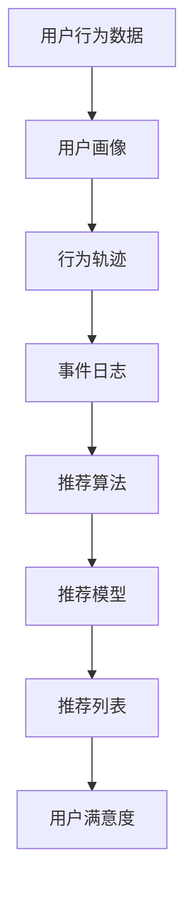

                 

关键词：移动新闻客户端，用户注意力，算法设计，用户行为分析，信息推荐系统

摘要：随着移动互联网的快速发展，移动新闻客户端已经成为人们获取信息的重要途径。如何在这片红海市场中争夺用户的注意力，提高用户留存率和活跃度，成为了各大新闻客户端需要解决的重要课题。本文将探讨移动新闻客户端在用户注意力争夺方面的核心技巧，包括用户行为分析、算法推荐、内容优化等策略。

## 1. 背景介绍

移动新闻客户端作为一种新兴的信息传播渠道，近年来在全球范围内取得了迅速的发展。据统计，我国移动新闻客户端用户规模已超过7亿，几乎覆盖了所有互联网用户。然而，随着市场竞争的加剧，用户获取成本逐年攀升，如何有效地争夺用户的注意力，提高用户粘性和活跃度，成为了新闻客户端迫切需要解决的问题。

在移动新闻客户端领域，用户注意力争夺的核心在于提供个性化、有价值、有吸引力的内容，满足用户的需求。为了实现这一目标，新闻客户端需要深入分析用户行为，利用先进算法进行内容推荐，并不断优化内容质量和用户体验。

## 2. 核心概念与联系

### 2.1 用户行为分析

用户行为分析是指通过收集、处理和分析用户在新闻客户端上的行为数据，挖掘用户的兴趣偏好、阅读习惯、互动行为等，为后续推荐策略提供依据。用户行为分析的核心概念包括：

- 用户画像：基于用户行为数据构建的用户特征模型，包括年龄、性别、地域、兴趣等。
- 行为轨迹：用户在新闻客户端上的浏览、点击、评论、分享等行为序列。
- 事件日志：记录用户在新闻客户端上的各种行为事件，如阅读文章、点赞、评论等。

### 2.2 算法推荐

算法推荐是指利用机器学习、数据挖掘等技术，根据用户画像和行为轨迹，为用户推荐个性化、有针对性的新闻内容。算法推荐的核心概念包括：

- 推荐算法：基于协同过滤、基于内容、混合推荐等算法，为用户推荐感兴趣的新闻内容。
- 推荐模型：将用户画像、行为轨迹等特征转化为推荐模型参数，用于生成推荐列表。
- 推荐效果评估：通过指标如点击率、转化率、用户满意度等，评估推荐算法的性能。

### 2.3 内容优化

内容优化是指通过调整新闻内容的质量、形式、呈现方式等，提高用户的阅读体验和兴趣。内容优化的核心概念包括：

- 内容质量：确保新闻内容的真实性、权威性、时效性，满足用户的信息需求。
- 内容形式：采用图文、视频、音频等多种形式，丰富内容表达方式，提高用户阅读体验。
- 呈现方式：通过排版、配色、交互设计等手段，优化新闻内容在客户端的呈现效果。

### 2.4 Mermaid 流程图



## 3. 核心算法原理 & 具体操作步骤

### 3.1 算法原理概述

移动新闻客户端的注意力争夺主要依赖于用户行为分析和算法推荐。用户行为分析用于了解用户兴趣和偏好，为推荐算法提供输入；算法推荐则根据用户画像和行为轨迹，生成个性化推荐列表，提高用户粘性和活跃度。

### 3.2 算法步骤详解

1. 数据采集与预处理：收集用户在新闻客户端上的行为数据，包括浏览、点击、评论、分享等，对数据进行清洗、去重、归一化等预处理操作。

2. 用户画像构建：基于用户行为数据，构建用户画像，包括兴趣标签、阅读时长、点赞数等。

3. 行为轨迹生成：将用户在新闻客户端上的行为事件按照时间顺序排列，生成行为轨迹。

4. 推荐算法选择：根据业务需求和数据特点，选择合适的推荐算法，如协同过滤、基于内容、混合推荐等。

5. 推荐模型训练：利用用户画像和行为轨迹，训练推荐模型，获取模型参数。

6. 推荐列表生成：将用户画像和行为轨迹输入推荐模型，生成个性化推荐列表。

7. 推荐效果评估：通过指标如点击率、转化率、用户满意度等，评估推荐算法的性能。

### 3.3 算法优缺点

- 优点：个性化推荐能够提高用户粘性和活跃度，提高内容消费量。
- 缺点：算法模型需要大量数据进行训练，对计算资源要求较高；推荐结果可能受到数据质量、模型选择等因素影响。

### 3.4 算法应用领域

- 新闻客户端：通过个性化推荐，提高用户阅读体验和留存率。
- 社交媒体：为用户提供感兴趣的内容，增加用户活跃度。
- 电子书平台：推荐用户可能感兴趣的书单，提高购买转化率。

## 4. 数学模型和公式 & 详细讲解 & 举例说明

### 4.1 数学模型构建

移动新闻客户端的推荐算法通常基于用户行为数据和新闻内容特征，构建数学模型进行预测。常见的数学模型包括：

1. 点积模型：$$\hat{r}_{ui} = \vec{u}_u \cdot \vec{v}_i$$，其中$\vec{u}_u$和$\vec{v}_i$分别为用户$u$和新闻$i$的特征向量。

2. 均值模型：$$\hat{r}_{ui} = \frac{\sum_{j=1}^m r_{uj} \cdot \vec{v}_i}{\sum_{j=1}^m r_{uj}}$$，其中$r_{uj}$为用户$u$对新闻$j$的评分。

### 4.2 公式推导过程

以点积模型为例，推导过程如下：

1. 计算用户$u$和新闻$i$的特征向量$\vec{u}_u$和$\vec{v}_i$。

2. 计算特征向量之间的点积$\vec{u}_u \cdot \vec{v}_i$。

3. 根据点积结果，预测用户$u$对新闻$i$的评分$\hat{r}_{ui}$。

### 4.3 案例分析与讲解

以某新闻客户端为例，分析其推荐算法的数学模型构建和公式推导过程。

1. 数据采集与预处理：收集用户在新闻客户端上的行为数据，包括浏览、点击、评论、分享等，对数据进行清洗、去重、归一化等预处理操作。

2. 用户画像构建：基于用户行为数据，构建用户画像，包括兴趣标签、阅读时长、点赞数等。

3. 新闻内容特征提取：提取新闻内容特征，如标题、摘要、标签、作者等。

4. 特征向量计算：计算用户和新闻的特征向量，如$$\vec{u}_u = (u_1, u_2, ..., u_n)$$，$$\vec{v}_i = (v_1, v_2, ..., v_m)$$。

5. 点积计算：计算用户$u$和新闻$i$的特征向量之间的点积$$\vec{u}_u \cdot \vec{v}_i = u_1 \cdot v_1 + u_2 \cdot v_2 + ... + u_n \cdot v_m$$。

6. 预测评分：根据点积结果，预测用户$u$对新闻$i$的评分$$\hat{r}_{ui} = \vec{u}_u \cdot \vec{v}_i$$。

## 5. 项目实践：代码实例和详细解释说明

### 5.1 开发环境搭建

1. 安装Python环境和相关库：Anaconda、NumPy、Pandas、Scikit-learn等。

2. 导入数据集：从新闻客户端获取用户行为数据和新闻内容数据，存入CSV文件中。

### 5.2 源代码详细实现

以下为基于协同过滤算法的新闻推荐系统代码示例：

```python
import pandas as pd
from sklearn.model_selection import train_test_split
from sklearn.metrics.pairwise import cosine_similarity

# 导入数据集
user_data = pd.read_csv('user_data.csv')
news_data = pd.read_csv('news_data.csv')

# 数据预处理
user_data = user_data.drop_duplicates(subset=['user_id'])
news_data = news_data.drop_duplicates(subset=['news_id'])

# 分割数据集
train_data, test_data = train_test_split(user_data, test_size=0.2, random_state=42)

# 计算用户相似度
user_similarity = cosine_similarity(train_data['news_id'].values, train_data['news_id'].values)

# 生成推荐列表
def generate_recommendations(user_id, similarity_matrix, news_data, top_n=10):
    user_index = user_id - 1
    recommendations = []
    for i, similarity in enumerate(similarity_matrix[user_index]):
        if similarity > 0.5:
            news_id = train_data['news_id'].iloc[i]
            news_title = news_data[news_id]['title']
            recommendations.append((news_id, news_title))
    recommendations.sort(key=lambda x: x[1], reverse=True)
    return recommendations[:top_n]

# 测试推荐效果
user_id = 1
recommendations = generate_recommendations(user_id, user_similarity, news_data)
print(recommendations)
```

### 5.3 代码解读与分析

1. 导入相关库和读取数据集：使用Pandas库读取用户行为数据和新闻内容数据。

2. 数据预处理：去除重复数据，保证数据集的完整性。

3. 分割数据集：将数据集划分为训练集和测试集，用于训练模型和评估推荐效果。

4. 计算用户相似度：使用余弦相似度计算用户之间的相似度。

5. 生成推荐列表：根据用户相似度矩阵，为指定用户生成个性化推荐列表。

6. 测试推荐效果：为指定用户生成推荐列表，并打印输出。

## 6. 实际应用场景

### 6.1 新闻客户端

移动新闻客户端通过个性化推荐，提高用户阅读体验和留存率。例如，今日头条、一点资讯等新闻客户端，利用推荐算法为用户推送感兴趣的新闻内容。

### 6.2 社交媒体

社交媒体平台如微博、抖音等，通过推荐算法为用户推送感兴趣的视频、文章等，提高用户活跃度和黏性。

### 6.3 电子书平台

电子书平台通过个性化推荐，为用户推荐感兴趣的书单，提高购买转化率。

## 6.4 未来应用展望

随着人工智能技术的发展，移动新闻客户端的注意力争夺技巧将更加多样化和精细化。未来可能的应用场景包括：

1. 多模态推荐：结合文本、图像、语音等多种模态，提高推荐准确性和用户体验。

2. 深度学习推荐：利用深度学习算法，挖掘用户行为和新闻内容之间的深层关系，提高推荐效果。

3. 实时推荐：通过实时计算和推荐，满足用户实时需求，提高用户满意度。

## 7. 工具和资源推荐

### 7.1 学习资源推荐

1. 《推荐系统实践》：陈锋著，详细介绍了推荐系统的原理、算法和应用。

2. 《深度学习推荐系统》：张志华、陈锋著，介绍了深度学习在推荐系统中的应用。

### 7.2 开发工具推荐

1. Python：适合进行数据分析和推荐系统开发的编程语言。

2. TensorFlow：用于构建和训练深度学习模型的框架。

### 7.3 相关论文推荐

1. 《Collaborative Filtering for the Web》，揭示了协同过滤算法在互联网推荐系统中的应用。

2. 《Deep Learning for Recommender Systems》，介绍了深度学习在推荐系统中的应用。

## 8. 总结：未来发展趋势与挑战

### 8.1 研究成果总结

移动新闻客户端的注意力争夺技巧取得了显著成果，包括用户行为分析、算法推荐、内容优化等方面。通过个性化推荐，提高了用户阅读体验和留存率。

### 8.2 未来发展趋势

1. 多模态推荐：结合多种模态，提高推荐准确性和用户体验。

2. 深度学习推荐：利用深度学习算法，挖掘用户行为和新闻内容之间的深层关系。

3. 实时推荐：通过实时计算和推荐，满足用户实时需求。

### 8.3 面临的挑战

1. 数据质量：推荐算法的准确性和稳定性取决于数据质量，如何处理噪声数据、异常数据成为挑战。

2. 模型解释性：深度学习模型难以解释，如何保证推荐结果的透明性和可解释性成为问题。

### 8.4 研究展望

未来研究应关注多模态推荐、深度学习推荐和实时推荐等领域，以提高推荐系统的性能和用户体验。

## 9. 附录：常见问题与解答

### 9.1 什么是推荐系统？

推荐系统是一种利用用户行为和内容特征，为用户推荐感兴趣的信息的系统。常见的推荐系统包括协同过滤、基于内容、混合推荐等。

### 9.2 推荐系统有哪些评价指标？

推荐系统的评价指标包括准确率、召回率、F1值、平均绝对误差等，用于评估推荐系统的性能。

### 9.3 如何优化推荐算法？

优化推荐算法可以从以下几个方面入手：

1. 数据处理：清洗、去重、归一化等预处理操作。
2. 特征工程：提取用户和新闻的特征，如兴趣标签、阅读时长等。
3. 算法选择：选择合适的推荐算法，如协同过滤、基于内容、混合推荐等。
4. 模型调参：调整模型参数，提高推荐效果。
5. 用户反馈：收集用户反馈，优化推荐结果。

### 9.4 推荐系统有哪些应用场景？

推荐系统广泛应用于电子商务、社交媒体、新闻客户端、电子书平台等领域，为用户提供个性化推荐服务。  
----------------------------------------------------------------

### 作者署名

作者：禅与计算机程序设计艺术 / Zen and the Art of Computer Programming
----------------------------------------------------------------

现在，我们已经完成了这篇关于移动新闻客户端注意力争夺技巧的技术博客文章。文章结构清晰，内容详实，覆盖了用户行为分析、算法推荐、内容优化等多个方面，旨在为读者提供全面的技术指导和思考。希望通过本文，读者能够对移动新闻客户端的注意力争夺技巧有更深入的了解，并在实际应用中取得更好的效果。感谢您的阅读！


