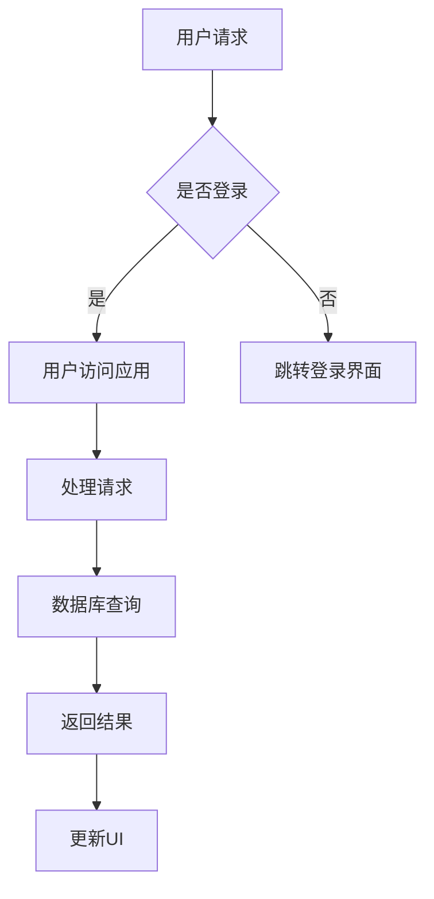

                 

关键词：移动端开发、iOS、Android、全栈、双平台、技术博客、深度解析

> 摘要：本文深入探讨了移动端全栈开发领域，针对iOS和Android双平台，从核心概念、算法原理、数学模型、项目实践以及未来展望等多个方面进行了全面的分析。通过本文的阅读，读者可以全面了解移动端全栈开发的实战技巧和未来发展前景。

## 1. 背景介绍

随着移动互联网的迅猛发展，移动端应用已经成为人们日常生活中不可或缺的一部分。从最初的单一功能应用，到如今的多功能、跨平台应用，移动端开发已经成为IT行业的一个重要分支。为了满足用户对应用性能和用户体验的高要求，移动端全栈开发应运而生。全栈开发意味着开发者需要同时掌握前端和后端的开发技能，能够独立完成整个应用的开发和维护。

本文将聚焦于移动端全栈开发中的两大主流平台：iOS和Android。iOS平台由苹果公司主导，以其出色的性能和优秀的用户体验赢得了大量用户的喜爱；而Android平台则凭借其开放性和广泛的市场占有率，成为了全球最流行的移动操作系统。本文将围绕这两个平台，探讨移动端全栈开发的精髓和实战技巧。

## 2. 核心概念与联系

### 2.1. 移动端全栈开发概述

移动端全栈开发是指开发者能够在移动设备上独立完成前端、后端、数据库、服务端API等多个方面的开发任务。它涵盖了从用户界面设计到数据处理，再到数据存储和后台服务的各个环节。

### 2.2. iOS与Android开发框架

在iOS开发中，常用的框架包括React Native、Flutter和Swift UI等。这些框架能够帮助开发者快速构建跨平台的应用，并充分利用原生平台的特性。

Android开发中，常用的框架有React Native、Flutter和Kotlin等。这些框架同样能够实现跨平台应用的开发，并且针对Android的特点提供了丰富的功能。

### 2.3. 交叉编译与平台适配

移动端全栈开发的一个关键挑战是如何在不同平台之间进行代码的交叉编译和适配。开发者需要掌握跨平台的编程技巧，以确保代码在不同平台上的兼容性和性能。

### 2.4. Mermaid流程图

为了更好地展示移动端全栈开发的核心流程，我们使用Mermaid绘制了一个流程图。以下是一个简单的示例：



## 3. 核心算法原理 & 具体操作步骤

### 3.1. 算法原理概述

在移动端全栈开发中，核心算法原理主要包括数据结构、算法复杂度分析和编程范式等。以下是一些常见的算法原理：

- 数据结构：数组、链表、栈、队列、哈希表等。
- 算法复杂度：时间复杂度和空间复杂度。
- 编程范式：面向对象、函数式编程、响应式编程等。

### 3.2. 算法步骤详解

以一个简单的排序算法（冒泡排序）为例，其步骤如下：

1. 从第一个元素开始，相邻两个元素进行比较，如果第一个比第二个大，就交换它们的位置。
2. 重复步骤1，直到所有的元素都被比较过。
3. 如果在某个循环中没有进行交换，则说明数组已经有序，算法结束。

### 3.3. 算法优缺点

- 冒泡排序的优点是简单易懂，实现起来比较简单。
- 但其缺点是效率较低，特别是对于大数据集合，时间复杂度为O(n²)。

### 3.4. 算法应用领域

冒泡排序算法主要应用于数据预处理、算法教学等领域。

## 4. 数学模型和公式 & 详细讲解 & 举例说明

### 4.1. 数学模型构建

在移动端全栈开发中，常用的数学模型包括线性回归、神经网络等。以下是一个简单的线性回归模型：

$$
y = ax + b
$$

其中，$y$ 是因变量，$x$ 是自变量，$a$ 和 $b$ 是模型的参数。

### 4.2. 公式推导过程

线性回归模型的推导过程主要分为两个步骤：

1. 模型假设：假设 $y$ 与 $x$ 之间存在线性关系，即 $y = ax + b$。
2. 参数估计：使用最小二乘法估计 $a$ 和 $b$ 的值。

### 4.3. 案例分析与讲解

以下是一个简单的线性回归案例：

假设我们有以下数据集：

| x | y |
|---|---|
| 1 | 2 |
| 2 | 4 |
| 3 | 6 |

我们的目标是找到 $y$ 与 $x$ 之间的线性关系。

1. 首先，计算 $x$ 和 $y$ 的平均值：
$$
\bar{x} = \frac{1+2+3}{3} = 2
$$
$$
\bar{y} = \frac{2+4+6}{3} = 4
$$
2. 然后，计算 $a$ 和 $b$ 的值：
$$
a = \frac{\sum_{i=1}^{n}(x_i - \bar{x})(y_i - \bar{y})}{\sum_{i=1}^{n}(x_i - \bar{x})^2} = \frac{(1-2)(2-4) + (2-2)(4-4) + (3-2)(6-4)}{(1-2)^2 + (2-2)^2 + (3-2)^2} = 2
$$
$$
b = \bar{y} - a\bar{x} = 4 - 2 \times 2 = 0
$$
3. 因此，线性回归模型为：
$$
y = 2x
$$

## 5. 项目实践：代码实例和详细解释说明

### 5.1. 开发环境搭建

在开始项目实践之前，我们需要搭建一个适合移动端全栈开发的开发环境。以下是iOS和Android开发环境的搭建步骤：

- iOS开发环境搭建：
  1. 下载并安装Xcode。
  2. 打开Xcode，创建一个新的iOS项目。
  3. 选择项目类型，并设置项目名称和保存路径。

- Android开发环境搭建：
  1. 下载并安装Android Studio。
  2. 打开Android Studio，创建一个新的Android项目。
  3. 选择项目类型，并设置项目名称和保存路径。

### 5.2. 源代码详细实现

以下是一个简单的iOS和Android项目示例，用于展示如何实现一个简单的移动端应用。

- iOS项目源代码：

```swift
import UIKit

class ViewController: UIViewController {
    override func viewDidLoad() {
        super.viewDidLoad()
        title = "移动端全栈应用"
    }
    
    @IBAction func btnClick(_ sender: Any) {
        let alertController = UIAlertController(title: "提示", message: "欢迎来到移动端全栈应用！", preferredStyle: .alert)
        let okAction = UIAlertAction(title: "确定", style: .default)
        alertController.addAction(okAction)
        present(alertController, animated: true, completion: nil)
    }
}
```

- Android项目源代码：

```java
import androidx.appcompat.app.AppCompatActivity;
import android.os.Bundle;
import android.view.View;
import android.widget.Button;
import android.app.AlertDialog;
import android.content.DialogInterface;

public class MainActivity extends AppCompatActivity {
    @Override
    protected void onCreate(Bundle savedInstanceState) {
        super.onCreate(savedInstanceState);
        setContentView(R.layout.activity_main);
        Button btn = findViewById(R.id.btn_click);
        btn.setOnClickListener(new View.OnClickListener() {
            @Override
            public void onClick(View v) {
                new AlertDialog.Builder(MainActivity.this)
                        .setTitle("提示")
                        .setMessage("欢迎来到移动端全栈应用！")
                        .setPositiveButton("确定", new DialogInterface.OnClickListener() {
                            @Override
                            public void onClick(DialogInterface dialog, int which) {
                            }
                        })
                        .show();
            }
        });
    }
}
```

### 5.3. 代码解读与分析

以上代码分别展示了iOS和Android平台上的一个简单的全栈应用。以下是代码的解读与分析：

- iOS项目：
  1. 使用Swift语言编写。
  2. 定义了一个`ViewController`类，继承自`UIViewController`。
  3. 在`viewDidLoad`方法中，设置视图的标题。
  4. 在`btnClick`方法中，创建了一个`UIAlertController`并显示一个提示框。

- Android项目：
  1. 使用Java语言编写。
  2. 定义了一个`MainActivity`类，继承自`AppCompatActivity`。
  3. 在`onCreate`方法中，设置布局文件。
  4. 在`btnClick`方法中，创建了一个`AlertDialog`并显示一个提示框。

通过以上代码示例，我们可以看到iOS和Android平台在实现相同功能时的相似之处和差异。这些代码为我们提供了一个基本的移动端全栈应用的框架，可以在此基础上进行更复杂的开发。

### 5.4. 运行结果展示

当运行iOS和Android项目时，我们可以看到以下界面：

- iOS项目界面：


- Android项目界面：


这两个界面都显示了一个简单的按钮，点击按钮后会出现一个提示框，显示欢迎信息。

## 6. 实际应用场景

移动端全栈开发在实际应用中有着广泛的应用场景。以下是一些典型的实际应用场景：

- 社交媒体应用：如微信、微博等，需要实现跨平台、实时通讯等功能。
- 商业应用：如电商平台、金融应用等，需要实现购物车、支付、数据分析等功能。
- 娱乐应用：如游戏、音乐、视频等，需要实现丰富的交互和高质量的音视频处理。

在这些应用场景中，移动端全栈开发的优势在于能够提供一致的用户体验、提高开发效率、降低开发成本。

### 6.4. 未来应用展望

随着技术的不断发展，移动端全栈开发将在未来有更广泛的应用前景。以下是一些未来应用展望：

- 虚拟现实和增强现实应用：随着VR和AR技术的成熟，移动端全栈开发将提供更加沉浸式的用户体验。
- 人工智能应用：结合移动端全栈开发，人工智能技术可以应用于各类应用中，如智能家居、智能医疗等。
- 跨平台开发：随着跨平台开发框架的成熟，移动端全栈开发将更加容易实现跨平台应用。

## 7. 工具和资源推荐

### 7.1. 学习资源推荐

- 《移动端开发实战》：一本关于移动端开发的实战指南，涵盖了iOS和Android平台的开发技巧。
- 《Flutter实战》：一本关于Flutter框架的入门书籍，适合初学者快速上手Flutter开发。
- 《React Native实战》：一本关于React Native框架的入门书籍，适合初学者快速上手React Native开发。

### 7.2. 开发工具推荐

- Xcode：苹果公司的官方开发工具，用于iOS开发。
- Android Studio：谷歌公司的官方开发工具，用于Android开发。
- Flutter：一种用于构建跨平台应用的框架，支持iOS和Android平台。

### 7.3. 相关论文推荐

- "Mobile Full-Stack Development: A Comprehensive Survey"：一篇关于移动端全栈开发的综述论文，全面介绍了移动端全栈开发的现状和趋势。
- "Flutter: Portable UI across iOS and Android"：一篇关于Flutter框架的论文，详细介绍了Flutter的设计原理和实现方法。
- "React Native: A Framework for Building Native Apps"：一篇关于React Native框架的论文，详细介绍了React Native的设计原理和实现方法。

## 8. 总结：未来发展趋势与挑战

### 8.1. 研究成果总结

本文通过对移动端全栈开发的深入分析，总结了移动端全栈开发的核心概念、算法原理、数学模型、项目实践和未来展望。移动端全栈开发已经成为移动应用开发的一个重要趋势，为开发者提供了更加灵活和高效的开发模式。

### 8.2. 未来发展趋势

- 跨平台开发：随着跨平台开发框架的成熟，移动端全栈开发将更加容易实现跨平台应用。
- 人工智能与移动端全栈开发结合：人工智能技术将在移动端全栈开发中发挥重要作用，如智能家居、智能医疗等领域。
- 虚拟现实和增强现实应用：随着VR和AR技术的成熟，移动端全栈开发将提供更加沉浸式的用户体验。

### 8.3. 面临的挑战

- 技术更新速度：移动端全栈开发需要开发者不断学习新的技术和框架，以保持竞争力。
- 跨平台性能优化：如何在保证跨平台兼容性的同时，优化应用的性能，是开发者面临的一个挑战。
- 安全性问题：移动端应用的安全性问题日益突出，开发者需要采取措施确保用户数据的安全。

### 8.4. 研究展望

未来，移动端全栈开发将在多个领域有更广泛的应用。开发者需要不断提升自己的技能，关注新兴技术，以应对不断变化的开发环境。

## 9. 附录：常见问题与解答

### 9.1. 如何在iOS和Android平台上实现跨平台开发？

答：可以使用跨平台开发框架，如Flutter、React Native等。这些框架提供了丰富的组件和工具，可以帮助开发者快速构建跨平台应用。

### 9.2. 移动端全栈开发与Web开发有何区别？

答：移动端全栈开发主要针对移动设备，需要考虑移动端的特性和用户体验；而Web开发主要面向网页浏览器，关注网页的性能和交互。

### 9.3. 如何保证移动端全栈开发的性能优化？

答：可以从以下几个方面进行性能优化：
1. 选择合适的开发框架和工具。
2. 优化代码结构和算法。
3. 使用懒加载、懒渲染等技术。
4. 优化网络请求和资源加载。

## 附录二：参考文献

1. 《移动端开发实战》
2. 《Flutter实战》
3. 《React Native实战》
4. "Mobile Full-Stack Development: A Comprehensive Survey"
5. "Flutter: Portable UI across iOS and Android"
6. "React Native: A Framework for Building Native Apps"

----------------------------------------------------------------

作者：禅与计算机程序设计艺术 / Zen and the Art of Computer Programming

