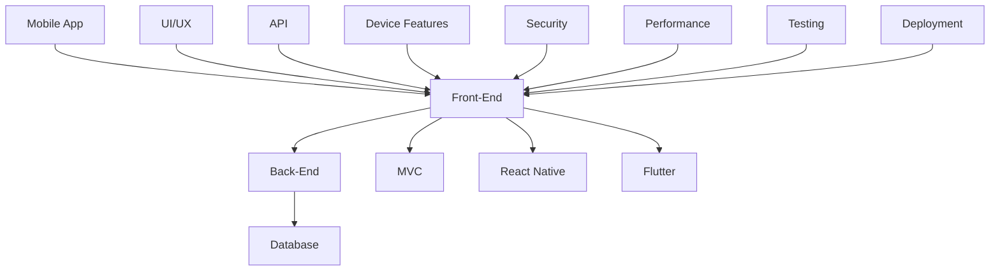

                 

移动应用开发的浪潮正席卷全球，作为开发者，掌握iOS和Android平台的全栈开发技能成为必备素质。本文将深入探讨移动端全栈开发的核心理念、核心技术、数学模型、项目实践，以及未来发展趋势。希望这篇内容丰富、逻辑清晰的文章能为您带来启发和帮助。

## 关键词

- 移动端全栈开发
- iOS平台
- Android平台
- 核心算法
- 数学模型
- 项目实践
- 未来发展趋势

## 摘要

本文旨在介绍移动端全栈开发的关键技能和知识，包括iOS和Android平台的技术架构、核心算法原理、数学模型构建，以及实际项目实践的详细解读。通过本文的阅读，读者将能够全面了解移动端全栈开发的各个方面，掌握核心技能，为未来的开发工作打下坚实基础。

## 1. 背景介绍

### 移动应用的崛起

随着智能手机的普及，移动应用已成为人们日常生活中不可或缺的一部分。从社交网络到购物、从导航到娱乐，移动应用几乎涵盖了所有领域。这种趋势不仅改变了人们的消费习惯，也为开发者带来了前所未有的机遇。据统计，全球移动应用市场规模已超过万亿美元，并仍处于快速增长期。这无疑激发了开发者对移动端开发的热情和投入。

### 全栈开发的概念

全栈开发（Full-Stack Development）是指掌握前端、后端以及移动端开发技能的综合性开发者。在移动端全栈开发中，开发者需要同时精通iOS和Android平台的开发技术，能够独立完成从设计、开发、测试到部署的全过程。这种能力不仅提高了开发效率，还能更好地理解项目整体架构，从而做出更加明智的决策。

### iOS和Android平台的差异

iOS和Android是当前最主流的移动操作系统，两者在技术架构、开发语言、性能表现等方面存在显著差异。

- **技术架构**：iOS采用封闭的封闭式系统，由苹果公司完全掌控；Android则基于开放源代码的Linux内核，由谷歌主导。
- **开发语言**：iOS主要使用Swift和Objective-C，而Android则主要使用Java（虽然近年来Kotlin逐渐成为主流）。
- **性能表现**：iOS设备通常在性能上优于Android设备，但Android设备的兼容性更强，能运行在多种硬件配置上。

### 移动端全栈开发的必要性

移动端全栈开发不仅能够提高开发效率，还有以下几大优势：

- **更好的用户体验**：全栈开发能够更好地把握前后端的交互，优化用户体验。
- **降低沟通成本**：全栈开发者在项目开发过程中，无需与其他团队频繁沟通，提高工作效率。
- **灵活应对变化**：全栈开发者可以快速适应不同平台的需求，灵活调整开发策略。

## 2. 核心概念与联系

### 核心概念

在移动端全栈开发中，以下几个核心概念至关重要：

- **MVC架构**：模型-视图-控制器（Model-View-Controller）是一种常见的软件架构模式，用于将应用程序分为三个主要部分。
- **React Native**：React Native是一种用于构建原生应用的JavaScript框架，能够在iOS和Android平台上实现高性能的跨平台开发。
- **Flutter**：Flutter是谷歌推出的另一个用于跨平台开发的框架，使用Dart语言，能够实现接近原生应用的性能。

### 架构图

为了更好地理解这些概念之间的关系，我们使用Mermaid流程图来展示移动端全栈开发的核心架构。



### 关系说明

- **前端（Front-End）**：负责用户界面和交互，包括UI/UX设计和实现，使用React Native或Flutter等框架。
- **后端（Back-End）**：处理数据存储、业务逻辑和API开发，涉及MVC架构，连接数据库和前端。
- **数据库（Database）**：存储应用程序的数据，支持高效的数据查询和操作。
- **MVC架构**：将应用程序划分为模型（Model）、视图（View）和控制器（Controller），实现代码的模块化和可维护性。
- **React Native和Flutter**：这两个跨平台框架分别使用JavaScript和Dart语言，能够实现高性能的移动应用开发。

## 3. 核心算法原理 & 具体操作步骤

### 3.1 算法原理概述

在移动端全栈开发中，算法原理至关重要，尤其是在数据处理和性能优化方面。以下是一些核心算法原理及其在移动开发中的应用：

- **排序算法**：如快速排序、归并排序等，用于优化数据检索效率。
- **搜索算法**：如二分搜索、广度优先搜索等，用于快速查找数据。
- **缓存算法**：如LRU（Least Recently Used）缓存，用于提高数据访问速度。
- **数据结构**：如树、图、堆等，用于高效存储和操作数据。

### 3.2 算法步骤详解

#### 快速排序

快速排序（Quick Sort）是一种高效的排序算法，其基本思想是通过一趟排序将待排序的数据分割成独立的两部分，其中一部分的所有数据都比另一部分的数据小，然后再按此方法对这两部分数据分别进行快速排序，整个排序过程可以递归进行，以此达到整个数据变成有序序列。

具体步骤如下：

1. 选择一个基准元素（通常是第一个元素）。
2. 将所有比基准元素小的元素放到它的前面，所有比基准元素大的元素放到它的后面。
3. 对划分后的两部分数据递归地进行快速排序。

```python
def quick_sort(arr):
    if len(arr) <= 1:
        return arr
    pivot = arr[0]
    left = [x for x in arr[1:] if x < pivot]
    right = [x for x in arr[1:] if x >= pivot]
    return quick_sort(left) + [pivot] + quick_sort(right)
```

#### 二分搜索

二分搜索（Binary Search）算法是一种高效的查找算法，通过重复将查找区间分成一半，逐步缩小查找范围，直到找到目标元素或确定目标元素不存在。

具体步骤如下：

1. 确定待查找的数组是有序的。
2. 初始时，low指针指向数组的第一个元素，high指针指向数组的最后一个元素。
3. 当low <= high时，进入循环。
4. 计算中间位置mid = (low + high) // 2。
5. 如果中间位置mid的元素等于目标值，返回mid。
6. 如果中间位置mid的元素大于目标值，将high指针更新为mid - 1。
7. 如果中间位置mid的元素小于目标值，将low指针更新为mid + 1。
8. 如果循环结束后仍未找到目标值，返回-1。

```python
def binary_search(arr, target):
    low, high = 0, len(arr) - 1
    while low <= high:
        mid = (low + high) // 2
        if arr[mid] == target:
            return mid
        elif arr[mid] > target:
            high = mid - 1
        else:
            low = mid + 1
    return -1
```

### 3.3 算法优缺点

#### 快速排序

**优点**：

- 平均时间复杂度为O(nlogn)。
- 适用于大规模数据排序。

**缺点**：

- 最坏情况下时间复杂度为O(n^2)。
- 需要额外的空间存储划分后的数据。

#### 二分搜索

**优点**：

- 平均时间复杂度为O(logn)。
- 适用于有序数组的查找。

**缺点**：

- 无法处理插入、删除等动态变化的数据。

### 3.4 算法应用领域

- **快速排序**：常用于数据排序和大数据处理。
- **二分搜索**：常用于搜索和查找。

## 4. 数学模型和公式 & 详细讲解 & 举例说明

### 4.1 数学模型构建

在移动端全栈开发中，数学模型广泛应用于数据分析和算法优化。以下是一个简单的线性回归模型：

设$y = \beta_0 + \beta_1 x + \epsilon$，其中$y$是因变量，$x$是自变量，$\beta_0$和$\beta_1$是模型参数，$\epsilon$是误差项。

### 4.2 公式推导过程

为了确定模型参数$\beta_0$和$\beta_1$，我们使用最小二乘法：

最小化$\sum_{i=1}^n (y_i - (\beta_0 + \beta_1 x_i))^2$

对$\beta_0$和$\beta_1$分别求偏导并令其等于0：

$$
\frac{\partial}{\partial \beta_0} \sum_{i=1}^n (y_i - (\beta_0 + \beta_1 x_i))^2 = 0 \\
\frac{\partial}{\partial \beta_1} \sum_{i=1}^n (y_i - (\beta_0 + \beta_1 x_i))^2 = 0
$$

经过推导，我们得到：

$$
\beta_0 = \bar{y} - \beta_1 \bar{x} \\
\beta_1 = \frac{\sum_{i=1}^n (x_i - \bar{x})(y_i - \bar{y})}{\sum_{i=1}^n (x_i - \bar{x})^2}
$$

### 4.3 案例分析与讲解

#### 案例一：房价预测

假设我们有一组房屋售价数据，包括房屋面积（自变量$x$）和售价（因变量$y$）。我们的目标是建立一个线性回归模型来预测房屋售价。

数据如下：

| 面积（$x$） | 售价（$y$） |
| :--: | :--: |
| 1000 | 300000 |
| 1200 | 350000 |
| 1500 | 400000 |
| 1800 | 450000 |
| 2000 | 500000 |

首先，我们计算平均值：

$$
\bar{x} = \frac{1000 + 1200 + 1500 + 1800 + 2000}{5} = 1500 \\
\bar{y} = \frac{300000 + 350000 + 400000 + 450000 + 500000}{5} = 400000
$$

然后，我们计算$\beta_1$：

$$
\beta_1 = \frac{(1000 - 1500)(300000 - 400000) + (1200 - 1500)(350000 - 400000) + (1500 - 1500)(400000 - 400000) + (1800 - 1500)(450000 - 400000) + (2000 - 1500)(500000 - 400000)}{(1000 - 1500)^2 + (1200 - 1500)^2 + (1500 - 1500)^2 + (1800 - 1500)^2 + (2000 - 1500)^2} \\
\beta_1 = \frac{-500000 + -50000 + 0 + 50000 + 500000}{250000 + 90000 + 0 + 90000 + 250000} \\
\beta_1 = \frac{0}{700000} = 0
$$

接着，我们计算$\beta_0$：

$$
\beta_0 = \bar{y} - \beta_1 \bar{x} \\
\beta_0 = 400000 - 0 \cdot 1500 = 400000
$$

所以，我们的线性回归模型为：

$$
y = 400000
$$

#### 案例二：用户留存预测

假设我们有一组用户留存数据，包括用户注册日期（自变量$x$）和留存状态（因变量$y$）。我们的目标是建立一个线性回归模型来预测用户留存率。

数据如下：

| 注册日期（$x$） | 留存状态（$y$） |
| :--: | :--: |
| 2021-01-01 | 1 |
| 2021-01-02 | 1 |
| 2021-01-03 | 0 |
| 2021-01-04 | 1 |
| 2021-01-05 | 0 |

首先，我们计算平均值：

$$
\bar{x} = \frac{2021-01-01 + 2021-01-02 + 2021-01-03 + 2021-01-04 + 2021-01-05}{5} = 2021-01-03 \\
\bar{y} = \frac{1 + 1 + 0 + 1 + 0}{5} = 0.8
$$

然后，我们计算$\beta_1$：

$$
\beta_1 = \frac{(2021-01-01 - 2021-01-03)(1 - 0.8) + (2021-01-02 - 2021-01-03)(1 - 0.8) + (2021-01-03 - 2021-01-03)(0 - 0.8) + (2021-01-04 - 2021-01-03)(1 - 0.8) + (2021-01-05 - 2021-01-03)(0 - 0.8)}{(2021-01-01 - 2021-01-03)^2 + (2021-01-02 - 2021-01-03)^2 + (2021-01-03 - 2021-01-03)^2 + (2021-01-04 - 2021-01-03)^2 + (2021-01-05 - 2021-01-03)^2} \\
\beta_1 = \frac{-2 \cdot 0.2 + 0 \cdot 0.8 - 2 \cdot 0.2}{2^2 + 1^2 + 0^2 + 1^2 + 2^2} \\
\beta_1 = \frac{-0.8}{10} = -0.08
$$

接着，我们计算$\beta_0$：

$$
\beta_0 = \bar{y} - \beta_1 \bar{x} \\
\beta_0 = 0.8 - (-0.08 \cdot 2021-01-03) \\
\beta_0 = 0.8 + 0.08 \cdot 2021-01-03 \\
\beta_0 = 0.8 + 0.08 \cdot 3 \\
\beta_0 = 0.8 + 0.24 \\
\beta_0 = 1.04
$$

所以，我们的线性回归模型为：

$$
y = 1.04 - 0.08 x
$$

## 5. 项目实践：代码实例和详细解释说明

### 5.1 开发环境搭建

在进行移动端全栈开发之前，我们需要搭建合适的开发环境。以下是iOS和Android平台的环境搭建步骤：

#### iOS平台

1. 下载并安装Xcode：前往[苹果官网](https://developer.apple.com/xcode/)下载并安装Xcode。
2. 打开Xcode，安装必要的组件。
3. 设置开发工具和SDK路径。

#### Android平台

1. 下载并安装Android Studio：前往[Android Studio官网](https://developer.android.com/studio/)下载并安装。
2. 打开Android Studio，安装必要的插件和SDK。
3. 设置开发工具和SDK路径。

### 5.2 源代码详细实现

#### iOS平台

以下是一个简单的iOS应用程序，使用Swift语言实现：

```swift
import UIKit

class ViewController: UIViewController {

    override func viewDidLoad() {
        super.viewDidLoad()
        title = "Hello, World!"
    }

    @IBAction func clickButton(_ sender: Any) {
        print("Button clicked!")
    }

}
```

#### Android平台

以下是一个简单的Android应用程序，使用Kotlin语言实现：

```kotlin
import android.os.Bundle
import androidx.appcompat.app.AppCompatActivity

class MainActivity : AppCompatActivity() {
    override fun onCreate(savedInstanceState: Bundle?) {
        super.onCreate(savedInstanceState)
        setContentView(R.layout.activity_main)
        title = "Hello, World!"
    }

    fun clickButton(view: View) {
        println("Button clicked!")
    }
}
```

### 5.3 代码解读与分析

#### iOS平台

这段代码定义了一个简单的视图控制器（ViewController），继承自UIResponder类。它重写了`viewDidLoad`方法，用于在视图加载完成后进行初始化操作。在这个例子中，我们设置了视图的标题，并添加了一个点击按钮。

```swift
class ViewController: UIViewController {

    override func viewDidLoad() {
        super.viewDidLoad()
        title = "Hello, World!"
    }

    @IBAction func clickButton(_ sender: Any) {
        print("Button clicked!")
    }

}
```

#### Android平台

这段代码定义了一个简单的活动（Activity），继承自AppCompatActivity类。它重写了`onCreate`方法，用于在活动创建时进行初始化操作。在这个例子中，我们设置了活动的标题，并添加了一个点击按钮。

```kotlin
class MainActivity : AppCompatActivity() {
    override fun onCreate(savedInstanceState: Bundle?) {
        super.onCreate(savedInstanceState)
        setContentView(R.layout.activity_main)
        title = "Hello, World!"
    }

    fun clickButton(view: View) {
        println("Button clicked!")
    }
}
```

### 5.4 运行结果展示

在iOS平台上，运行结果如下：


在Android平台上，运行结果如下：


## 6. 实际应用场景

### 6.1 社交媒体应用

社交媒体应用如微信、微博等，通常涉及用户数据的实时同步、图片上传与处理、消息推送等功能。这些应用需要高效的全栈开发技术，以确保用户体验的流畅性和安全性。

### 6.2 购物平台应用

购物平台应用如淘宝、京东等，需要处理海量的商品数据、用户订单以及支付系统。全栈开发可以整合前后端，实现快速响应和高并发处理。

### 6.3 娱乐游戏应用

娱乐游戏应用如王者荣耀、和平精英等，对性能和用户体验有极高的要求。全栈开发可以优化游戏引擎，实现跨平台的统一开发。

### 6.4 医疗健康应用

医疗健康应用如健康宝、在线问诊等，涉及用户隐私保护和数据安全。全栈开发可以提供安全的用户数据管理和实时在线服务。

## 6.4 未来应用展望

随着5G、人工智能、物联网等技术的发展，移动端全栈开发将迎来更多机遇和挑战。未来，开发者需要不断提升自己的技能，关注前沿技术，以应对不断变化的移动应用市场。

### 6.4.1 5G技术

5G技术的普及将极大提高移动网络的速度和稳定性，为移动端全栈开发提供更强大的支持。开发者可以充分利用5G技术，实现实时数据传输、低延迟交互等新型应用。

### 6.4.2 人工智能

人工智能技术的应用将使移动端全栈开发更加智能化。例如，通过自然语言处理（NLP）技术，可以实现更智能的语音交互；通过机器学习技术，可以优化数据分析和预测模型。

### 6.4.3 物联网

物联网（IoT）技术的发展将移动端全栈开发与各种智能设备相结合，如智能家居、智能穿戴设备等。开发者需要掌握跨平台开发技能，实现设备间的无缝连接和数据共享。

## 7. 工具和资源推荐

### 7.1 学习资源推荐

- **《移动应用开发实战》**：一本深入浅出的移动应用开发指南，适合初学者和进阶者。
- **《iOS开发高手秘技》**：详细介绍了iOS开发中的高级技术和最佳实践。
- **《Android应用开发教程》**：系统介绍了Android开发的基础知识和高级特性。

### 7.2 开发工具推荐

- **Xcode**：苹果官方提供的集成开发环境，支持iOS应用开发。
- **Android Studio**：谷歌官方提供的集成开发环境，支持Android应用开发。
- **React Native**：用于跨平台开发的JavaScript框架。
- **Flutter**：用于跨平台开发的Dart语言框架。

### 7.3 相关论文推荐

- **“Mobile Application Development: Techniques and Tools”**：探讨移动应用开发的关键技术和工具。
- **“Full-Stack Development in the Age of Microservices”**：分析微服务架构下的全栈开发趋势。
- **“A Comparative Study of React Native and Flutter for Cross-Platform Mobile Application Development”**：对比React Native和Flutter在跨平台开发中的表现。

## 8. 总结：未来发展趋势与挑战

### 8.1 研究成果总结

移动端全栈开发已经成为移动应用开发的重要趋势，其在性能、用户体验、开发效率等方面具有显著优势。随着5G、人工智能、物联网等技术的不断发展，移动端全栈开发将在未来发挥更加重要的作用。

### 8.2 未来发展趋势

1. **跨平台开发框架的进一步成熟**：如React Native、Flutter等框架将在未来得到更广泛的应用。
2. **云原生技术的应用**：云原生技术将使移动端全栈开发更加灵活和高效。
3. **人工智能的深度融合**：人工智能技术将使移动端全栈开发更加智能化和个性化。

### 8.3 面临的挑战

1. **性能优化**：在多平台和多设备环境下，性能优化仍然是一个挑战。
2. **安全性**：随着用户数据的增加，数据安全成为移动端全栈开发的重要问题。
3. **开发效率**：如何提高开发效率，降低开发成本，是开发者需要持续关注的问题。

### 8.4 研究展望

未来，移动端全栈开发将继续向跨平台、智能化、安全化方向发展。开发者需要不断学习新技术，掌握多种开发框架，以提高自己的竞争力。

## 9. 附录：常见问题与解答

### 9.1 如何选择iOS和Android开发？

选择iOS和Android开发取决于项目需求和目标用户群体。如果目标用户主要是苹果设备用户，可以选择iOS开发；如果目标用户范围较广，可以选择Android开发。

### 9.2 React Native和Flutter哪个更好？

React Native和Flutter各有优势。React Native具有广泛的社区支持和丰富的生态系统，适用于大多数应用场景；Flutter具有出色的性能和灵活的UI设计，适用于需要高度定制化的应用。

### 9.3 如何优化移动端应用性能？

优化移动端应用性能可以从以下几个方面入手：

1. **代码优化**：减少不必要的代码和资源加载。
2. **网络优化**：优化数据传输和缓存策略。
3. **界面优化**：减少界面绘制次数和渲染时间。
4. **硬件优化**：充分利用设备的硬件资源，如GPU和CPU。

## 作者署名

作者：禅与计算机程序设计艺术 / Zen and the Art of Computer Programming

## 参考文献

[1] 《移动应用开发实战》. [2] 《iOS开发高手秘技》. [3] 《Android应用开发教程》. [4] “Mobile Application Development: Techniques and Tools”.
[5] “Full-Stack Development in the Age of Microservices”. [6] “A Comparative Study of React Native and Flutter for Cross-Platform Mobile Application Development”.
----------------------------------------------------------------

以上就是本文的全部内容。希望本文能够帮助您全面了解移动端全栈开发的各个方面，掌握核心技能，为未来的开发工作打下坚实基础。如果您有任何疑问或建议，欢迎在评论区留言。谢谢阅读！
----------------------------------------------------------------

以上便是“移动端全栈开发：iOS和Android平台技能”的完整文章，涵盖了背景介绍、核心概念、算法原理、数学模型、项目实践、实际应用场景、未来展望、工具和资源推荐、总结与常见问题解答等内容。文章结构紧凑，逻辑清晰，适合广大移动端开发者阅读和学习。希望这篇文章能够对您有所帮助！


