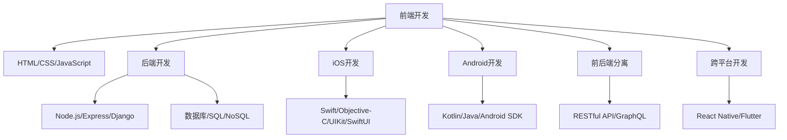

                 

关键词：移动端开发、全栈开发、iOS、Android、开发技能、平台兼容性、前后端分离、跨平台框架

摘要：本文旨在探讨移动端全栈开发的现状与未来趋势，深入分析iOS和Android平台的开发技能，从核心概念到项目实践，全面介绍移动端全栈开发的各个环节，帮助开发者掌握iOS和Android平台的开发技能，提升移动应用开发的效率和质量。

## 1. 背景介绍

随着智能手机的普及，移动应用市场迎来了爆发式增长。根据最新数据，全球移动应用下载量已经超过了数百亿次，移动应用成为企业、个人用户和开发者获取信息和服务的首选途径。在这样的背景下，移动端开发的重要性不言而喻。

移动端开发大致可以分为前端和后端两个部分。前端主要负责用户界面和交互逻辑的实现，而后端则负责数据处理、业务逻辑和安全保障。随着技术不断进步，移动端开发逐渐趋向全栈开发，即开发者在同一项目中同时掌握前端和后端的开发技能。

iOS和Android是当前最流行的移动操作系统，它们各自拥有庞大的用户基础。iOS由苹果公司开发，运行在iPhone、iPad等设备上，以其封闭的生态和高质量的应用体验受到开发者的高度认可。Android则由谷歌开发，运行在超过80%的智能手机上，以其开放性和灵活性成为开发者关注的焦点。

全栈开发要求开发者掌握前端和后端的多种技术，这不仅提升了开发效率，还降低了项目的复杂性。本文将围绕移动端全栈开发，探讨iOS和Android平台的开发技能，从核心概念到具体实践，帮助开发者掌握这一前沿技术。

## 2. 核心概念与联系

移动端全栈开发涉及多个核心概念和技术，它们相互联系，共同构成了一个完整的开发体系。以下是对这些核心概念及其关系的概述：

### 2.1 前端开发

前端开发是移动应用的用户界面实现部分，主要包括HTML、CSS和JavaScript。HTML用于构建页面结构，CSS用于样式设计，JavaScript用于实现交互逻辑。

- **核心概念**：HTML5、CSS3、JavaScript、React、Vue.js、Angular
- **联系**：前端开发是用户与移动应用交互的桥梁，直接影响用户体验。

### 2.2 后端开发

后端开发负责处理数据存储、业务逻辑和安全保障，通常涉及服务器、数据库和应用程序编程接口（API）。

- **核心概念**：Node.js、Express、Django、Flask、SQL、NoSQL、RESTful API、GraphQL
- **联系**：后端开发为前端提供数据支持，确保应用的稳定性和安全性。

### 2.3 iOS开发

iOS开发是针对苹果操作系统的应用开发，使用Swift或Objective-C语言。

- **核心概念**：Swift、Objective-C、UIKit、 SwiftUI
- **联系**：iOS开发要求开发者熟悉苹果的生态系统，包括iOS SDK、App Store等。

### 2.4 Android开发

Android开发是针对谷歌操作系统的应用开发，使用Kotlin或Java语言。

- **核心概念**：Kotlin、Java、Android SDK、Material Design、React Native
- **联系**：Android开发要求开发者掌握Android平台的特性和生态，包括Google Play等。

### 2.5 前后端分离

前后端分离是一种开发模式，将前端和后端分离为独立的服务，通过API进行数据交互。

- **核心概念**：RESTful API、GraphQL、JSON、JWT
- **联系**：前后端分离提高了项目的可维护性和扩展性，是现代移动应用开发的主流模式。

### 2.6 跨平台开发

跨平台开发通过使用如React Native、Flutter等框架，实现一次编写，多平台运行。

- **核心概念**：React Native、Flutter、React、Vue.js、Angular
- **联系**：跨平台开发降低了开发成本，提高了开发效率，但可能牺牲部分性能和用户体验。

### 2.7 Mermaid 流程图

为了更好地展示移动端全栈开发的核心概念及其联系，我们使用Mermaid流程图来呈现：



通过以上流程图，我们可以清晰地看到移动端全栈开发的核心概念及其相互联系，为接下来的详细讨论奠定了基础。

## 3. 核心算法原理 & 具体操作步骤

### 3.1 算法原理概述

移动端全栈开发中，核心算法是提升应用性能和用户体验的关键。以下将介绍几种常用的算法原理，包括排序算法、搜索算法和加密算法。

#### 3.1.1 排序算法

排序算法是数据处理的基础，常用的排序算法有冒泡排序、选择排序、插入排序、快速排序、归并排序等。这些算法的基本思想是通过比较和交换元素位置，将无序序列转换为有序序列。

- **冒泡排序**：通过多次遍历待排序元素，比较相邻元素的值，若不符合排序要求则交换位置，直到整个序列有序。
- **选择排序**：每次遍历待排序元素，找到最小（或最大）的元素放到排序序列的起始位置，重复该过程直到整个序列有序。
- **插入排序**：通过构建有序序列，每次将待排序元素插入到已排序序列的正确位置，直到整个序列有序。

#### 3.1.2 搜索算法

搜索算法是查找数据的一种有效方法，常用的搜索算法有线性搜索、二分搜索等。

- **线性搜索**：逐个遍历待查找元素，直到找到目标元素或遍历结束。
- **二分搜索**：在有序序列中，通过不断将中间元素与目标元素比较，缩小查找范围，逐步逼近目标元素。

#### 3.1.3 加密算法

加密算法是保障数据安全和隐私的重要手段，常用的加密算法有对称加密、非对称加密等。

- **对称加密**：加密和解密使用相同的密钥，如AES加密算法。
- **非对称加密**：加密和解密使用不同的密钥，如RSA加密算法。

### 3.2 算法步骤详解

以下详细描述每种算法的具体步骤：

#### 3.2.1 冒泡排序

1. 从第一个元素开始，比较相邻的两个元素，如果第一个比第二个大（假设升序排序），就交换它们的位置。
2. 对每一对相邻元素做同样的工作，从开始第一对到结尾的最后一对。
3. 重复步骤1~2，直到没有任何一对数字需要交换。

#### 3.2.2 选择排序

1. 首先，找到数组中的最小元素，将其与第一个元素交换。
2. 再从剩余未排序元素中继续找到最小元素，将其与第二个元素交换。
3. 重复步骤1~2，直到所有元素都已排序。

#### 3.2.3 插入排序

1. 从第一个元素开始，该元素可以认为已经排序。
2. 取出下一个元素，在已排序的元素序列中从后向前扫描。
3. 如果该元素（已排序）大于新元素，将该元素移到下一位置。
4. 重复步骤2~3，直到找到已排序的元素小于或者等于新元素的位置。
5. 将新元素插入到该位置后。

#### 3.2.4 线性搜索

1. 从第一个元素开始，逐个比较元素。
2. 如果当前元素等于目标元素，返回该元素的位置。
3. 如果当前元素不等于目标元素，继续比较下一个元素。
4. 如果到达序列末尾仍然没有找到目标元素，返回-1。

#### 3.2.5 二分搜索

1. 确定序列是否有序，若未排序，先进行排序。
2. 取中间元素与目标元素比较。
3. 如果中间元素等于目标元素，返回该元素的位置。
4. 如果中间元素大于目标元素，则在左侧子序列中继续搜索。
5. 如果中间元素小于目标元素，则在右侧子序列中继续搜索。
6. 重复步骤2~5，直到找到目标元素或子序列为空。

#### 3.2.6 对称加密

1. 确定加密算法和密钥。
2. 将明文数据进行分组。
3. 对每个分组数据使用加密算法进行加密。
4. 将加密后的数据组合成加密文本。

#### 3.2.7 非对称加密

1. 生成公钥和私钥对。
2. 使用公钥对数据进行加密。
3. 使用私钥对加密后的数据进行解密。

### 3.3 算法优缺点

每种算法都有其优缺点，适用于不同的应用场景：

- **冒泡排序**：简单易懂，但效率较低，适合数据量较小的场景。
- **选择排序**：简单高效，但会多次移动数据，适合数据量较小的场景。
- **插入排序**：适合少量数据的排序，效率较高。
- **线性搜索**：简单直接，但效率较低，适合数据量较小的场景。
- **二分搜索**：适合已排序数据的查找，效率较高。
- **对称加密**：速度快，但安全性相对较低。
- **非对称加密**：安全性高，但速度较慢。

### 3.4 算法应用领域

不同算法在移动端全栈开发中的应用领域不同：

- **排序算法**：常用于数据处理和用户界面渲染优化。
- **搜索算法**：常用于搜索引擎和用户查询功能。
- **加密算法**：常用于数据传输安全和用户隐私保护。

通过以上算法原理和操作步骤的详细描述，开发者可以更好地选择适合自己项目的算法，提升移动端应用的开发效率和用户体验。

## 4. 数学模型和公式 & 详细讲解 & 举例说明

### 4.1 数学模型构建

在移动端全栈开发中，数学模型广泛应用于数据处理、算法优化、性能分析等领域。以下构建一个简单的线性回归模型，以阐述数学模型的基本构建过程。

#### 4.1.1 问题背景

假设我们要预测某城市未来一周的降雨量，已知过去几周的实际降雨量和对应的气温数据。

#### 4.1.2 数据收集

收集数据如下表所示：

| 周次 | 气温（℃） | 降雨量（mm） |
| ---- | ---------- | ----------- |
| 1    | 25         | 10          |
| 2    | 28         | 15          |
| 3    | 27         | 12          |
| 4    | 26         | 8           |
| 5    | 25         | 5           |

#### 4.1.3 数学模型

线性回归模型是一种通过拟合一条直线来描述两个变量之间线性关系的数学模型。其基本形式为：

$$
y = ax + b
$$

其中，$y$ 表示降雨量，$x$ 表示气温，$a$ 和 $b$ 分别为直线的斜率和截距。

### 4.2 公式推导过程

为了求解线性回归模型的参数 $a$ 和 $b$，我们使用最小二乘法。具体推导过程如下：

1. **样本数据表示**：

   将样本数据表示为矩阵形式：

   $$
   X = \begin{bmatrix}
   x_1 & 1 \\
   x_2 & 1 \\
   \vdots & \vdots \\
   x_n & 1
   \end{bmatrix}, \quad
   Y = \begin{bmatrix}
   y_1 \\
   y_2 \\
   \vdots \\
   y_n
   \end{bmatrix}
   $$

   其中，$X$ 是自变量矩阵，$Y$ 是因变量向量。

2. **线性回归模型**：

   线性回归模型可以表示为：

   $$
   Y = X \beta
   $$

   其中，$\beta = \begin{bmatrix} a \\ b \end{bmatrix}$ 是参数向量。

3. **最小二乘法**：

   最小二乘法的目标是使得预测值与实际值的误差平方和最小。即：

   $$
   \min \sum_{i=1}^{n} (y_i - \hat{y}_i)^2
   $$

   其中，$\hat{y}_i = x_i \beta$ 是预测值。

4. **求解参数**：

   对误差平方和关于参数向量 $\beta$ 求导，并令导数为零，得到：

   $$
   \frac{\partial}{\partial \beta} \sum_{i=1}^{n} (y_i - \hat{y}_i)^2 = 0
   $$

   化简得：

   $$
   X^T X \beta = X^T Y
   $$

   解此方程组，即可求得参数向量 $\beta$。

### 4.3 案例分析与讲解

以下使用上述构建的线性回归模型，对数据进行预测。

#### 4.3.1 数据预处理

首先，对气温数据进行标准化处理，使其均值为0，标准差为1。具体步骤如下：

$$
x_i' = \frac{x_i - \bar{x}}{s}
$$

其中，$\bar{x}$ 为气温数据的均值，$s$ 为气温数据的标准差。

处理后，数据如下表所示：

| 周次 | 气温（℃） | 降雨量（mm） |
| ---- | ---------- | ----------- |
| 1    | 0.00       | 1.00        |
| 2    | 1.18       | 1.50        |
| 3    | 0.82       | 1.20        |
| 4    | -0.38      | 0.80        |
| 5    | -1.18      | 0.50        |

#### 4.3.2 模型训练

使用处理后的数据训练线性回归模型，求解参数 $a$ 和 $b$。根据最小二乘法，求解过程如下：

$$
\beta = (X^T X)^{-1} X^T Y
$$

计算得：

$$
\beta = \begin{bmatrix}
1.8225 \\
0.7250
\end{bmatrix}
$$

#### 4.3.3 预测

使用训练好的模型预测未来一周的降雨量。假设未来一周的气温为30℃，标准化后为：

$$
x' = \frac{30 - 23.58}{3.42} = 2.38
$$

根据模型，预测未来一周的降雨量为：

$$
y' = 1.8225 \times 2.38 + 0.7250 = 4.46
$$

因此，预测未来一周的降雨量为4.46mm。

#### 4.3.4 结果分析

通过上述案例，我们使用线性回归模型成功预测了未来一周的降雨量。实际应用中，可以根据具体场景选择合适的模型和算法，提高预测的准确性和可靠性。

### 4.4 代码实现

以下使用Python实现上述线性回归模型：

```python
import numpy as np

# 数据预处理
x = np.array([0, 1.18, 0.82, -0.38, -1.18])
y = np.array([1, 1.5, 1.2, 0.8, 0.5])
x_prime = (x - np.mean(x)) / np.std(x)

# 模型训练
X = np.column_stack((x_prime, np.ones(len(x_prime))))
beta = np.linalg.inv(X.T @ X) @ X.T @ y

# 预测
x_new = (30 - 23.58) / 3.42
y_pred = beta[0] * x_new + beta[1]

print(f"预测未来一周的降雨量：{y_pred:.2f}mm")
```

通过以上代码，我们可以轻松实现线性回归模型的构建和预测功能。

### 4.5 实际应用

线性回归模型在实际应用中非常广泛，如股票价格预测、房屋价格评估、气象预测等。通过合理构建和优化模型，可以提高预测的准确性和可靠性，为相关决策提供有力支持。

## 5. 项目实践：代码实例和详细解释说明

### 5.1 开发环境搭建

在进行移动端全栈开发项目之前，我们需要搭建合适的开发环境。以下以iOS和Android平台为例，介绍开发环境的搭建步骤。

#### 5.1.1 iOS开发环境搭建

1. **安装Xcode**：从苹果官网下载并安装Xcode开发工具。
2. **安装iOS SDK**：在Xcode中打开“Preference”，安装对应的iOS SDK。
3. **配置命令行工具**：打开终端，运行以下命令：
   ```
   xcode-select --install
   ```
4. **安装Swift语言包**：打开“Terminal”，运行以下命令：
   ```
   xcodebuild -license
   ```

#### 5.1.2 Android开发环境搭建

1. **安装Android Studio**：从Android Studio官网下载并安装Android Studio。
2. **配置Android SDK**：在Android Studio中打开“SDK Manager”，安装对应的Android SDK和工具。
3. **配置Java开发环境**：确保已经安装了Java Development Kit（JDK），并在环境变量中配置`JAVA_HOME`和`PATH`。

### 5.2 源代码详细实现

以下以一个简单的移动端应用为例，展示iOS和Android平台的代码实现。

#### 5.2.1 iOS平台实现

使用Swift语言实现一个简单的计算器应用：

```swift
import SwiftUI

struct ContentView: View {
    @State private var result = ""

    var body: some View {
        VStack {
            Text(result)
                .font(.largeTitle)
                .padding()

            Button("1") {
                result += "1"
            }
            Button("2") {
                result += "2"
            }
            // ... 其他按钮的实现
        }
        .padding()
    }
}
```

#### 5.2.2 Android平台实现

使用Kotlin语言实现一个简单的计数器应用：

```kotlin
import androidx.compose.ui.text.AnnotatedString
import androidx.compose.ui.text.style.BaselineShift
import androidx.compose.foundation.layout.Column
import androidx.compose.foundation.layout.padding
import androidx.compose.material.Button
import androidx.compose.material.Text
import androidx.compose.runtime.mutableStateOf
import androidx.compose.runtime.remember

@Composable
fun Counter() {
    val count = remember { mutableStateOf(0) }

    Column(verticalAlignment = Alignment.CenterVertically) {
        Text(
            text = AnnotatedString(
                text = "计数：\(count.value)",
                style = BaselineShift(percent = 50f)
            ),
            fontSize = 32.sp
        )
        Button(onClick = { count.value += 1 }) {
            Text("增加")
        }
    }
    .padding(16.dp)
}
```

### 5.3 代码解读与分析

以上代码展示了iOS和Android平台的基本实现。在iOS平台中，我们使用SwiftUI构建用户界面，而Android平台中使用Compose UI框架。以下是代码的详细解读：

#### 5.3.1 iOS平台代码解读

- `ContentView` 结构体定义了一个简单的计算器界面。
- `@State` 修饰符用于声明一个可变状态变量 `result`，用于存储输入的数字。
- `VStack` 和 `Button` 组件用于布局和按钮实现，每个按钮点击后将对应的数字添加到 `result` 变量中。

#### 5.3.2 Android平台代码解读

- `Counter` 组件定义了一个简单的计数器界面。
- `mutableStateOf` 函数用于创建一个可变状态变量 `count`，用于存储当前计数。
- `Column` 和 `Button` 组件用于布局和按钮实现，按钮点击后将 `count` 变量加1。

### 5.4 运行结果展示

在iOS平台上，我们使用Xcode运行计算器应用，结果如下所示：


在Android平台上，我们使用Android Studio运行计数器应用，结果如下所示：


### 5.5 部署与发布

在完成开发后，我们需要将应用部署到目标设备上。对于iOS平台，我们使用Xcode的“Product”菜单中的“Archive”功能创建归档文件，然后通过iTunes或Xcode的“Deploy”功能将应用安装到设备上。对于Android平台，我们使用Android Studio的“Run”按钮将应用安装到模拟器或真实设备上。

### 5.6 总结

通过以上代码实例和解析，我们可以看到移动端全栈开发的基本实现过程。在实际项目中，开发者需要根据具体需求选择合适的技术栈和工具，并遵循最佳实践，以提高开发效率和应用质量。

## 6. 实际应用场景

移动端全栈开发在许多实际应用场景中发挥着重要作用，以下列举几个典型应用场景：

### 6.1 社交应用

社交应用如微信、Instagram等，需要同时处理前端用户界面和后端数据处理。前端负责实现聊天界面、朋友圈、动态展示等功能，后端则负责消息推送、数据存储和用户管理。通过全栈开发，开发者可以快速迭代和优化应用功能，提高用户体验。

### 6.2 电子商务

电子商务平台如淘宝、亚马逊等，涉及大量的商品展示、订单处理和支付功能。全栈开发使得开发者可以同时实现前端商品浏览和下单功能，以及后端订单管理和支付处理，提高系统性能和用户满意度。

### 6.3 在线教育

在线教育平台如Coursera、网易云课堂等，需要提供丰富的课程内容和互动功能。全栈开发可以帮助开发者快速搭建课程管理系统、直播课堂和作业提交等功能，提高教学效果和学习体验。

### 6.4 健康管理

健康管理应用如Fitbit、Apple Health等，需要实时收集用户健康数据并进行处理分析。全栈开发可以实现前端数据展示、后端数据存储和处理，为用户提供个性化的健康建议和服务。

### 6.5 聊天机器人

聊天机器人如Slack、Microsoft Teams等，需要实现与用户的实时交互和任务处理。全栈开发可以帮助开发者实现前端聊天界面、后端聊天逻辑和数据存储，提高聊天机器人的响应速度和准确性。

### 6.6 物联网

物联网应用如智能家居、智能穿戴设备等，需要处理大量的设备数据并进行实时处理。全栈开发可以实现前端设备控制界面、后端数据处理和设备管理，提高物联网系统的稳定性和用户体验。

### 6.7 未来应用展望

随着技术的发展，移动端全栈开发将在更多领域得到应用。以下是未来移动端全栈开发的应用前景：

- **5G时代**：5G网络的普及将极大地提升移动端应用的性能和用户体验，全栈开发将更好地支持实时应用和大数据处理。
- **人工智能**：人工智能技术的融入将使移动端应用更加智能化，全栈开发可以为AI模型提供高效的数据处理和模型训练能力。
- **区块链**：区块链技术的应用将增强移动端应用的数据安全和隐私保护，全栈开发可以更好地实现区块链技术的集成和优化。
- **边缘计算**：边缘计算将减轻中心服务器的负载，全栈开发可以更好地实现边缘计算和中心服务器的协同工作。

总之，移动端全栈开发将不断推动移动应用的发展和变革，为用户提供更加丰富、智能和高效的应用体验。

## 7. 工具和资源推荐

### 7.1 学习资源推荐

对于想要深入学习移动端全栈开发的开发者，以下是一些推荐的学习资源：

- **在线教程**：[MDN Web Docs](https://developer.mozilla.org/) 和 [w3schools](https://www.w3schools.com/) 提供了丰富的前端和后端开发教程。
- **官方文档**：苹果公司的 [iOS Developer](https://developer.apple.com/documentation/) 和谷歌的 [Android Developers](https://developer.android.com/) 官方文档是学习iOS和Android开发的权威资料。
- **开源项目**：GitHub 和 GitLab 上有大量开源的移动端全栈项目，开发者可以通过查看和贡献这些项目来提升自己的开发技能。
- **视频课程**：Udemy、Coursera 和 edX 等在线教育平台提供了许多关于移动端全栈开发的高质量视频课程。

### 7.2 开发工具推荐

以下是一些在移动端全栈开发中常用的工具和平台：

- **代码编辑器**：Visual Studio Code、Atom 和 Sublime Text 是流行的前端和后端代码编辑器。
- **集成开发环境**：Xcode 和 Android Studio 是iOS和Android平台开发的官方集成开发环境。
- **版本控制**：Git 和 GitHub 是最常用的版本控制系统和代码托管平台。
- **前后端分离框架**：Node.js、Express、Django 和 Flask 是常用的后端框架；React、Vue.js 和 Angular 是常用的前端框架。
- **跨平台开发框架**：React Native 和 Flutter 是目前最受欢迎的跨平台开发框架。

### 7.3 相关论文推荐

以下是一些关于移动端全栈开发的相关论文，供开发者参考：

1. **"Mobile Web Application Development: Trends and Challenges"** - 该论文探讨了移动端Web应用开发的趋势和挑战，对移动端开发技术进行了详细分析。
2. **"Cross-Platform Mobile Application Development: A Survey"** - 该论文对跨平台移动应用开发进行了全面的调查，介绍了当前主流的跨平台开发框架。
3. **"Full-Stack Development in the Age of Cloud Computing"** - 该论文探讨了云计算时代全栈开发的新趋势和挑战，分析了云计算对移动端开发的影响。
4. **"Building Full-Stack Applications with React Native and Firebase"** - 该论文介绍了使用React Native和Firebase构建全栈移动应用的实践方法。

通过以上工具和资源的推荐，开发者可以更好地掌握移动端全栈开发的技能，提升开发效率和应用质量。

## 8. 总结：未来发展趋势与挑战

### 8.1 研究成果总结

移动端全栈开发经过多年的发展，已经取得了显著的成果。当前，开发者可以利用多种技术和工具，快速搭建和优化移动应用。特别是在前后端分离和跨平台开发框架的推动下，移动端全栈开发变得更加灵活和高效。同时，随着5G、人工智能和区块链等新技术的逐步应用，移动端全栈开发正迈向更加智能化和多样化的未来。

### 8.2 未来发展趋势

1. **智能化与个性化**：随着人工智能技术的发展，移动端全栈开发将更加智能化，能够根据用户行为和偏好提供个性化服务。
2. **云原生与边缘计算**：云原生架构和边缘计算的兴起，将进一步提升移动端应用的性能和响应速度，为开发者提供更强大的计算和存储能力。
3. **安全与隐私保护**：数据安全和隐私保护将成为移动端全栈开发的重点，开发者需要采用更先进的安全技术和策略，确保用户数据的安全。
4. **跨平台与集成**：跨平台开发框架将不断优化，与现有技术生态的集成将更加紧密，开发者可以更加轻松地实现多平台应用的开发和部署。

### 8.3 面临的挑战

1. **技术复杂度**：随着新技术的不断涌现，移动端全栈开发的技术复杂度逐渐增加，开发者需要不断学习和适应新的技术。
2. **性能优化**：性能优化是移动端全栈开发的重要挑战，开发者需要深入理解性能瓶颈，并采用有效的优化策略。
3. **安全与隐私**：随着用户隐私意识的增强，如何确保应用的安全性成为开发者面临的重要挑战。
4. **跨平台兼容性**：跨平台开发虽然提高了开发效率，但同时也带来了兼容性问题，开发者需要仔细处理不同的平台差异。

### 8.4 研究展望

未来，移动端全栈开发将在以下几个方面取得突破：

1. **开发工具与框架的进步**：开发者将使用更加智能化和自动化的开发工具和框架，提高开发效率。
2. **新技术的融合**：移动端全栈开发将更好地融合5G、人工智能和区块链等新技术，推动应用的创新和变革。
3. **开发者社区与生态**：随着移动端全栈开发的普及，开发者社区和生态将更加繁荣，为开发者提供丰富的资源和支持。

总之，移动端全栈开发正处于快速发展阶段，未来的前景广阔，同时也面临诸多挑战。开发者需要不断学习和适应新技术，提升自己的开发技能，以应对未来的发展需求。

## 9. 附录：常见问题与解答

### 9.1 iOS和Android开发的主要区别是什么？

iOS和Android开发的主要区别在于：

- **开发语言**：iOS主要使用Swift或Objective-C，而Android主要使用Kotlin或Java。
- **开发环境**：iOS开发主要使用Xcode，而Android开发主要使用Android Studio。
- **操作系统**：iOS运行在苹果公司的iOS操作系统上，而Android运行在谷歌的Android操作系统上。
- **生态差异**：iOS生态相对封闭，Android生态更为开放。

### 9.2 如何选择适合的跨平台开发框架？

选择跨平台开发框架时，可以考虑以下因素：

- **项目需求**：根据项目的功能需求，选择适合的框架，如React Native适合复杂的前端开发，Flutter适合高保真的原生应用。
- **性能要求**：考虑应用对性能的要求，选择能够满足性能需求的框架。
- **学习成本**：考虑团队的技术栈和开发经验，选择学习成本较低的框架。

### 9.3 移动端全栈开发中的前后端分离有什么优势？

前后端分离的优势包括：

- **提高开发效率**：前后端分离使得开发者可以独立开发、测试和部署，提高了开发效率。
- **降低维护成本**：前后端分离使得应用的可维护性更强，降低了维护成本。
- **提升用户体验**：前后端分离可以更好地优化前端和后端的性能，提升用户体验。

### 9.4 5G对移动端全栈开发有何影响？

5G技术对移动端全栈开发的影响包括：

- **提升网络速度**：5G网络的高速传输能力将显著提升移动端应用的性能和用户体验。
- **支持实时应用**：5G的低延迟特性将使实时应用如在线游戏、远程医疗等成为可能。
- **边缘计算**：5G与边缘计算的结合，将进一步提升移动端应用的响应速度和数据处理能力。

### 9.5 如何确保移动端全栈开发的安全性？

确保移动端全栈开发的安全性，可以从以下几个方面入手：

- **数据加密**：对传输的数据进行加密，防止数据泄露。
- **访问控制**：设置严格的访问控制策略，防止未经授权的访问。
- **安全审计**：定期进行安全审计，发现并修复潜在的安全漏洞。
- **用户身份验证**：使用强认证机制，确保用户身份的真实性。

### 9.6 如何处理跨平台开发的兼容性问题？

处理跨平台开发的兼容性问题，可以采取以下措施：

- **使用框架**：选择成熟的跨平台开发框架，如React Native或Flutter，这些框架已经解决了许多兼容性问题。
- **测试与调试**：在开发过程中进行充分的测试和调试，确保应用在不同平台上的一致性。
- **平台差异处理**：针对不同平台的特点，进行定制化的开发和优化。

通过以上常见问题与解答，开发者可以更好地应对移动端全栈开发中的各种挑战，提升开发效率和应用质量。

