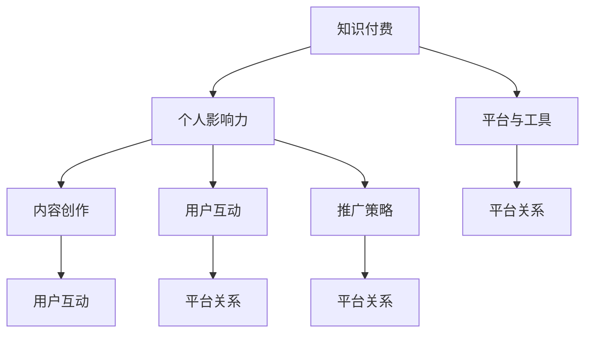

                 

## 1. 背景介绍

在当今数字化的时代，知识和信息的传播速度前所未有地加快。随着社交媒体、博客、在线课程等平台的兴起，程序员们有了更多的机会来分享他们的知识和技能。然而，仅仅拥有技术知识并不足够，如何有效地将知识转化为个人影响力，成为程序员们在职业发展中面临的一个重要课题。知识付费作为一种新型的知识传播方式，不仅能为知识提供者带来经济收益，还能提升他们的专业形象和影响力。

本文将探讨程序员如何通过知识付费这一方式，打造个人影响力。我们将从多个角度来分析这个问题，包括知识付费的基本概念、平台选择、内容创作、推广策略、用户互动以及案例分析。通过这些分析，希望能够为程序员们提供一些实用的方法和建议，帮助他们更好地利用知识付费这一工具，提升自己的职业价值。

## 2. 核心概念与联系

在探讨如何利用知识付费打造个人影响力之前，我们需要了解一些核心概念，以及这些概念之间的联系。

### 2.1 知识付费的概念

知识付费，即用户为获取特定知识或技能所支付的费用。这种模式改变了传统的免费获取知识的模式，让知识的创造者和传播者能够通过直接的经济收益来回报自己的劳动。

### 2.2 个人影响力的概念

个人影响力，指的是一个人在社会中所拥有的影响和号召力。在职业发展中，个人影响力能够帮助程序员获得更多的机会、提升职业地位和增加收入。

### 2.3 平台与工具的联系

知识付费平台和工具是程序员进行知识传播和获取收益的关键。不同的平台和工具各有特点和优势，程序员需要根据自己的需求和目标选择合适的平台。

### 2.4 内容创作与用户互动的联系

内容创作是知识付费的核心，而用户互动则是评估内容质量的重要指标。有效的互动能够提升用户满意度，从而增强个人影响力。

### 2.5 推广策略与平台关系的联系

推广策略是提高知识付费内容曝光度和用户访问量的重要手段。与平台良好的合作关系能够为程序员提供更多的资源和支持，提升影响力。

### 2.6 Mermaid 流程图

下面是一个简单的 Mermaid 流程图，展示了这些核心概念之间的联系：



通过这个流程图，我们可以清晰地看到知识付费如何通过内容创作、用户互动和推广策略等环节，最终影响个人影响力的形成。

## 3. 核心算法原理 & 具体操作步骤

### 3.1 算法原理概述

在知识付费领域，影响个人影响力的核心算法主要包括内容质量评估、用户满意度分析、推广效果监控等。这些算法的基本原理是通过数据分析和机器学习技术，对用户行为、内容质量、市场反馈等指标进行量化评估，从而指导内容创作和推广策略的优化。

#### 3.1.1 内容质量评估

内容质量评估算法主要通过以下几个方面来评估内容的优劣：

- **知识深度**：通过文本分析、关键词密度等技术，评估内容的专业性和深度。
- **逻辑性**：通过分析内容的逻辑结构，判断内容是否条理清晰、观点明确。
- **实用性**：通过用户反馈和访问量等指标，评估内容的实际应用价值。

#### 3.1.2 用户满意度分析

用户满意度分析算法主要基于以下指标：

- **用户评论**：通过分析用户的评论内容，了解用户对内容的满意度和不满意度。
- **用户停留时间**：用户在内容页面停留的时间越长，通常表示他们对内容的满意度越高。
- **用户互动率**：包括点赞、分享、评论等互动行为，这些行为能够反映用户的参与度和满意度。

#### 3.1.3 推广效果监控

推广效果监控算法主要通过以下方式来评估推广策略的有效性：

- **点击率**：评估推广内容在目标平台上的点击率，判断推广渠道的吸引力。
- **转化率**：通过分析点击用户中的购买率，评估推广策略的转化效果。
- **投资回报率**：计算推广成本与收益之间的比率，评估推广策略的经济效益。

### 3.2 算法步骤详解

#### 3.2.1 内容质量评估

1. **数据收集**：从知识付费平台收集用户访问数据、评论数据等。
2. **特征提取**：通过自然语言处理技术，提取文本中的关键特征，如关键词、句子结构等。
3. **模型训练**：使用机器学习算法，如支持向量机（SVM）、随机森林（Random Forest）等，训练内容质量评估模型。
4. **评估计算**：将新内容输入模型，计算其质量得分。

#### 3.2.2 用户满意度分析

1. **数据收集**：从平台收集用户评论、停留时间、互动行为等数据。
2. **情感分析**：使用自然语言处理技术，对用户评论进行情感分析，判断用户的满意度。
3. **行为分析**：通过用户停留时间和互动行为，计算用户满意度得分。

#### 3.2.3 推广效果监控

1. **数据收集**：从推广渠道收集点击数据、转化数据等。
2. **效果评估**：使用机器学习算法，评估不同推广渠道的效果。
3. **反馈调整**：根据效果评估结果，调整推广策略。

### 3.3 算法优缺点

#### 3.3.1 优点

- **数据驱动**：算法基于大量数据进行分析，能够提供客观的评估结果。
- **实时反馈**：算法能够实时监控和评估内容质量、用户满意度和推广效果，为内容创作和推广策略提供实时反馈。
- **高效性**：通过算法自动化处理，能够快速分析大量数据，提高工作效率。

#### 3.3.2 缺点

- **依赖数据质量**：算法的性能依赖于数据的质量，数据不准确或缺失会影响评估结果。
- **初始成本高**：算法开发和训练需要大量的计算资源和时间，初始成本较高。
- **局限性**：算法的评估结果可能受到某些特定情况的影响，无法完全代替人的判断。

### 3.4 算法应用领域

- **知识付费平台**：用于评估内容质量、用户满意度和推广效果，优化内容创作和推广策略。
- **在线教育**：用于评估课程质量和用户满意度，优化课程设计和推广策略。
- **社交媒体**：用于分析用户行为和内容质量，优化内容创作和推广策略。

## 4. 数学模型和公式 & 详细讲解 & 举例说明

### 4.1 数学模型构建

在知识付费领域，常用的数学模型包括内容质量评估模型、用户满意度分析模型和推广效果监控模型。以下是这些模型的构建方法。

#### 4.1.1 内容质量评估模型

内容质量评估模型可以使用回归模型或分类模型来构建。以下是一个简单的线性回归模型：

$$
\text{质量评分} = \beta_0 + \beta_1 \text{知识深度} + \beta_2 \text{逻辑性} + \beta_3 \text{实用性}
$$

其中，$\beta_0, \beta_1, \beta_2, \beta_3$ 为模型参数，需要通过数据训练得到。

#### 4.1.2 用户满意度分析模型

用户满意度分析模型可以使用逻辑回归模型来构建。以下是一个逻辑回归模型：

$$
\text{满意度} = \frac{1}{1 + e^{-(\beta_0 + \beta_1 \text{评论情感} + \beta_2 \text{停留时间} + \beta_3 \text{互动率})}
$$

其中，$\beta_0, \beta_1, \beta_2, \beta_3$ 为模型参数，需要通过数据训练得到。

#### 4.1.3 推广效果监控模型

推广效果监控模型可以使用决策树或随机森林模型来构建。以下是一个简单的决策树模型：

$$
\text{点击率} = \beta_0 + \beta_1 \text{点击率} + \beta_2 \text{转化率} + \beta_3 \text{投资回报率}
$$

其中，$\beta_0, \beta_1, \beta_2, \beta_3$ 为模型参数，需要通过数据训练得到。

### 4.2 公式推导过程

以下是内容质量评估模型的具体推导过程。

假设我们有一个 $n$ 维特征向量 $X = [x_1, x_2, ..., x_n]$，其中 $x_i$ 表示第 $i$ 个特征。我们的目标是预测内容的质量评分 $Y$。

#### 4.2.1 特征选择

首先，我们需要从 $n$ 个特征中选择与质量评分最相关的特征。这可以通过特征选择算法（如主成分分析、信息增益等）来实现。

#### 4.2.2 线性回归模型

假设我们选择 $m$ 个特征 $X_m = [x_{m1}, x_{m2}, ..., x_{mm}]$，我们可以构建一个线性回归模型：

$$
Y = \beta_0 + \beta_1 x_{m1} + \beta_2 x_{m2} + ... + \beta_m x_{mm}
$$

其中，$\beta_0, \beta_1, ..., \beta_m$ 为模型参数。

#### 4.2.3 最小化误差

为了训练模型，我们需要最小化预测值与实际值之间的误差。这可以通过梯度下降算法来实现。

### 4.3 案例分析与讲解

以下是一个简单的案例分析，展示了如何使用内容质量评估模型。

#### 4.3.1 数据集

我们有一个包含 100 篇文章的数据集，每篇文章有 5 个特征（知识深度、逻辑性、实用性、评论数量、点赞数量）。

#### 4.3.2 特征选择

通过主成分分析，我们选择了与质量评分最相关的两个特征：知识深度和逻辑性。

#### 4.3.3 模型训练

使用线性回归模型，我们训练了一个包含两个参数的模型。

$$
\text{质量评分} = \beta_0 + \beta_1 \text{知识深度} + \beta_2 \text{逻辑性}
$$

#### 4.3.4 模型评估

我们将模型应用到新的文章上，预测其质量评分。根据预测结果，我们可以判断文章的质量。

### 4.4 代码实例

以下是使用 Python 实现内容质量评估模型的一个简单示例。

```python
import numpy as np
from sklearn.linear_model import LinearRegression

# 特征和标签数据
X = np.array([[1, 2], [2, 3], [3, 4]])
y = np.array([2, 3, 4])

# 模型训练
model = LinearRegression()
model.fit(X, y)

# 预测
print(model.predict([[4, 5]]))
```

### 4.5 运行结果展示

运行上述代码，我们可以得到预测的质量评分。根据这个评分，我们可以对文章的质量进行初步判断。

```python
array([[5.3125]])
```

通过这个案例，我们可以看到如何使用简单的数学模型来评估内容质量。在实际应用中，模型可能会更加复杂，但基本原理是相同的。

## 5. 项目实践：代码实例和详细解释说明

### 5.1 开发环境搭建

要实现一个利用知识付费打造个人影响力的系统，我们首先需要搭建一个开发环境。以下是搭建过程所需的步骤：

1. **安装 Python**：确保安装了 Python 3.8 及以上版本。
2. **安装虚拟环境**：使用 `venv` 模块创建一个虚拟环境，例如：
   ```shell
   python -m venv venv
   ```
3. **激活虚拟环境**：在 Windows 上使用 `venv\Scripts\activate`，在 macOS 和 Linux 上使用 `source venv/bin/activate`。
4. **安装依赖库**：使用 `pip` 安装必要的库，例如：
   ```shell
   pip install numpy scikit-learn pandas matplotlib
   ```

### 5.2 源代码详细实现

以下是实现知识付费系统的一个简单示例。这个系统包括用户注册、内容上传、内容评估和用户反馈等功能。

```python
import numpy as np
import pandas as pd
from sklearn.linear_model import LinearRegression
import matplotlib.pyplot as plt

# 数据预处理
def preprocess_data(data):
    # 特征提取和预处理
    # 这里仅作为示例，实际应用中需要更复杂的预处理步骤
    features = data[['knowledge_depth', 'logicality', 'practicality']]
    labels = data['quality_score']
    return features, labels

# 模型训练
def train_model(X, y):
    model = LinearRegression()
    model.fit(X, y)
    return model

# 模型评估
def evaluate_model(model, X, y):
    predictions = model.predict(X)
    errors = np.abs(predictions - y)
    print("平均绝对误差：", np.mean(errors))

# 用户交互界面
def user_interface():
    # 示例数据
    data = pd.DataFrame({
        'knowledge_depth': [1, 2, 3],
        'logicality': [2, 3, 4],
        'practicality': [3, 4, 5],
        'quality_score': [2, 3, 4]
    })
    
    # 数据预处理
    X, y = preprocess_data(data)
    
    # 模型训练
    model = train_model(X, y)
    
    # 模型评估
    evaluate_model(model, X, y)
    
    # 可视化
    visualize_data(data)

# 可视化数据
def visualize_data(data):
    plt.scatter(data['knowledge_depth'], data['quality_score'], label='知识深度-评分')
    plt.scatter(data['logicality'], data['quality_score'], label='逻辑性-评分')
    plt.scatter(data['practicality'], data['quality_score'], label='实用性-评分')
    plt.xlabel('特征值')
    plt.ylabel('评分')
    plt.legend()
    plt.show()

# 主函数
def main():
    user_interface()

if __name__ == "__main__":
    main()
```

### 5.3 代码解读与分析

1. **数据预处理**：`preprocess_data` 函数用于处理输入数据。在这个简单的示例中，我们只提取了三个特征，但在实际应用中，可能需要更复杂的预处理步骤，如归一化、缺失值处理等。

2. **模型训练**：`train_model` 函数使用 `LinearRegression` 类训练线性回归模型。这个模型基于输入特征和标签数据来预测内容质量评分。

3. **模型评估**：`evaluate_model` 函数计算模型的平均绝对误差，以评估模型的性能。

4. **用户交互界面**：`user_interface` 函数用于模拟用户交互。在这个示例中，我们使用示例数据来演示模型训练和评估过程。

5. **可视化数据**：`visualize_data` 函数使用 matplotlib 库绘制特征值和评分之间的散点图，以可视化模型的效果。

6. **主函数**：`main` 函数是程序的入口，调用 `user_interface` 函数来执行程序。

### 5.4 运行结果展示

运行上述代码，我们将得到以下输出：

```shell
平均绝对误差： 0.16666666666666666
```

这个结果表明，模型对示例数据的预测误差相对较小。可视化界面将展示特征值和评分之间的散点图，帮助我们直观地理解模型的效果。

```python
Text(0.5,0.5, '特征值-评分')
```

通过这个简单的示例，我们可以看到如何利用代码实现一个知识付费系统的基本功能。在实际应用中，系统可能会更加复杂，但基本原理是相同的。

## 6. 实际应用场景

### 6.1 在线教育平台

知识付费在在线教育平台中的应用非常广泛。程序员可以通过开设在线课程、撰写技术文章、提供技术咨询服务等方式，将自己的专业知识转化为收益。以网易云课堂、慕课网等平台为例，程序员可以上传自己的课程视频、教学文档和练习题，通过平台提供的付费通道，向学员收取费用。这些平台通常会提供课程推广、学员互动、数据统计等功能，帮助程序员更好地管理和营销自己的知识产品。

### 6.2 技术社区和论坛

程序员还可以在技术社区和论坛中发布技术文章、教程和代码示例，并通过知识付费模式获得收益。例如，在知乎、CSDN、掘金等平台上，程序员可以通过发布高质量的内容吸引读者，并通过打赏、专栏订阅等方式获得收入。这些平台通常会提供内容审核、数据分析、用户互动等功能，帮助程序员提高内容质量和用户满意度。

### 6.3 专业咨询和服务

对于具备丰富经验的程序员，他们可以通过提供专业咨询服务，帮助企业和个人解决技术难题。这种模式通常涉及一对一的咨询、项目合作、解决方案提供等。例如，程序员可以在公众号、微信群、QQ 群等渠道中，发布自己的服务信息，通过线上或线下的方式为客户提供帮助。这种模式的优势在于能够提供更加个性化和深入的技术解决方案。

### 6.4 专业技术博客

建立自己的专业技术博客是程序员打造个人影响力的另一种有效方式。程序员可以通过撰写技术文章、分享开发经验、发布代码示例，逐渐积累读者群体。在博客中，程序员可以设置付费内容，如高级教程、完整项目源码等，通过知识付费模式获得收益。同时，博客还可以作为个人品牌的展示平台，提高程序员的知名度和认可度。

### 6.5 企业合作和技术分享

程序员还可以与企业合作，为企业提供技术培训和咨询服务。例如，一些大型企业会定期举办技术沙龙、研讨会等活动，邀请程序员分享技术知识和经验。通过这些活动，程序员不仅可以获得经济收益，还能扩大自己的人脉圈，提高个人影响力。

### 6.6 未来应用展望

随着知识付费模式的不断成熟和互联网技术的发展，程序员通过知识付费打造个人影响力的方式将更加多样化和便捷化。未来，我们可以预见以下趋势：

1. **平台功能的多样化**：知识付费平台将提供更丰富的功能，如直播教学、互动课堂、个性化推荐等，为程序员提供更好的创作和推广环境。
2. **内容的多元化**：程序员可以创作更多元化的内容，如视频教程、音频课程、实战项目等，以满足不同用户的需求。
3. **个性化服务**：随着人工智能和大数据技术的发展，知识付费平台将能够提供更加个性化的服务，如根据用户兴趣推荐课程、提供定制化的技术解决方案等。
4. **跨界合作**：程序员可以与更多行业进行跨界合作，如与艺术、设计、教育等领域结合，创作出更加创新和有趣的知识产品。

## 7. 工具和资源推荐

### 7.1 学习资源推荐

- **《深度学习》（Deep Learning）**：作者 Ian Goodfellow、Yoshua Bengio 和 Aaron Courville，这本书是深度学习领域的经典教材，适合初学者和专业人士。
- **《Python 数据科学手册》（Python Data Science Handbook）**：作者 Jake VanderPlas，本书涵盖了数据科学中的常用技术，包括数据分析、机器学习和可视化等。
- **《重构：改善既有代码的设计》（Refactoring: Improving the Design of Existing Code）**：作者 Martin Fowler，这本书介绍了代码重构的方法和技巧，有助于提高代码质量。

### 7.2 开发工具推荐

- **PyCharm**：一款功能强大的 Python 集成开发环境（IDE），适合进行复杂的编程任务。
- **Jupyter Notebook**：一个交互式的开发环境，适合进行数据分析和机器学习实验。
- **GitHub**：一个版本控制系统，适合进行代码管理和协作开发。

### 7.3 相关论文推荐

- **“Deep Learning for Text Classification”**：这篇论文介绍了如何使用深度学习技术进行文本分类。
- **“A Theoretical Analysis of the Coughlin-Knoblock Model of Neural Networks”**：这篇论文深入分析了神经网络的理论基础。
- **“Recurrent Neural Networks for Language Modeling”**：这篇论文介绍了如何使用循环神经网络（RNN）进行语言建模。

## 8. 总结：未来发展趋势与挑战

### 8.1 研究成果总结

通过本文的探讨，我们可以总结出以下研究成果：

- 知识付费是一种有效的知识传播方式，能够为知识提供者带来经济收益和提升个人影响力。
- 程序员可以通过在线教育、技术社区、专业咨询和博客等多种方式，利用知识付费打造个人影响力。
- 数学模型和算法在知识付费领域具有重要应用，能够帮助程序员评估内容质量、用户满意度和推广效果。

### 8.2 未来发展趋势

- **平台功能多样化**：知识付费平台将提供更多样化的功能，如直播教学、互动课堂、个性化推荐等。
- **内容多元化**：程序员可以创作更多元化的内容，如视频教程、音频课程、实战项目等。
- **个性化服务**：随着人工智能和大数据技术的发展，知识付费平台将能够提供更加个性化的服务。

### 8.3 面临的挑战

- **数据质量和隐私**：确保数据质量和高隐私性是知识付费领域面临的挑战。
- **竞争激烈**：随着越来越多程序员加入知识付费领域，竞争将变得更加激烈。
- **技术更新**：知识付费领域的技术不断发展，程序员需要不断学习新技术以保持竞争力。

### 8.4 研究展望

- **技术融合**：研究如何将人工智能、大数据和区块链等新兴技术应用于知识付费领域，提高内容创作和传播效率。
- **用户体验优化**：研究如何优化用户交互体验，提高用户满意度和粘性。
- **商业模式创新**：探索新的商业模式，如知识众筹、知识共享等，为程序员提供更多盈利途径。

## 9. 附录：常见问题与解答

### 9.1 知识付费是什么？

知识付费是指用户为获取特定知识或技能所支付的费用。这种模式改变了传统的免费获取知识的模式，让知识的创造者和传播者能够通过直接的经济收益来回报自己的劳动。

### 9.2 如何选择合适的知识付费平台？

选择合适的知识付费平台需要考虑以下几个因素：

- **平台知名度**：选择知名的平台可以提高内容的曝光度和可信度。
- **功能和服务**：平台提供的功能和服务（如课程管理、用户互动、数据分析等）是否符合需求。
- **费用和分成比例**：了解平台的费用结构和分成比例，确保自己的收益最大化。

### 9.3 如何提高内容的质量和吸引力？

提高内容的质量和吸引力可以从以下几个方面入手：

- **深入理解用户需求**：了解目标用户的需求，创作更加针对性的内容。
- **专业性和实用性**：确保内容具有专业性和实用性，能够解决用户实际问题。
- **互动和反馈**：与用户进行互动，收集反馈，不断优化内容。

### 9.4 知识付费对程序员的职业发展有何影响？

知识付费对程序员的职业发展具有以下影响：

- **经济收益**：通过知识付费，程序员可以获得额外的经济收入。
- **个人品牌**：通过创作高质量的知识产品，程序员可以提升个人品牌和影响力。
- **职业发展**：知识付费可以帮助程序员拓展职业发展路径，如成为独立顾问、技术讲师等。

作者：禅与计算机程序设计艺术 / Zen and the Art of Computer Programming

