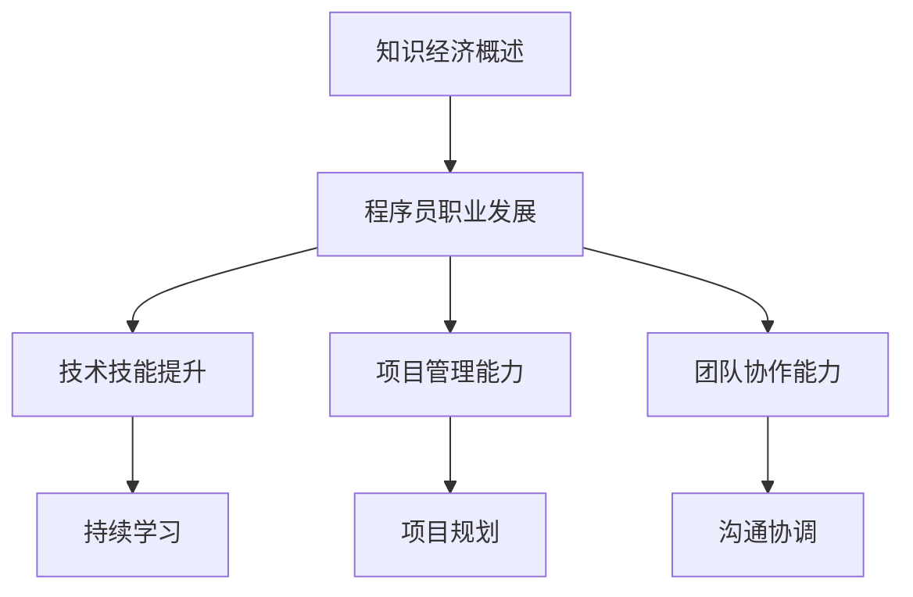

                 

关键词：知识经济、程序员职业规划、技能发展、持续学习、技术创新、未来趋势

> 摘要：本文将探讨知识经济时代程序员职业规划的重要性，分析程序员面临的技能发展和持续学习需求，探讨技术创新对未来程序员的影响，并提出一些建议以帮助程序员在知识经济时代中取得成功。

## 1. 背景介绍

知识经济时代，以信息和技术为核心的经济模式逐渐取代传统的资源密集型经济模式。在这个时代，程序员作为技术领域的核心力量，面临着前所未有的机遇与挑战。随着技术的快速迭代和更新，程序员的职业规划变得更加复杂和多样化。

本文将围绕以下核心问题展开讨论：

- 程序员在知识经济时代应该如何规划职业发展？
- 面对技术变革，程序员需要具备哪些核心技能？
- 如何保持持续学习，适应快速变化的技术环境？
- 技术创新对未来程序员的影响和挑战是什么？

## 2. 核心概念与联系

### 2.1. 知识经济概述

知识经济是一种基于知识和信息的经济模式，它强调知识的创造、传播和应用。在知识经济时代，创新成为驱动经济增长的关键因素，而程序员作为技术创新的主要推动者，其职业规划与发展显得尤为重要。

### 2.2. 程序员职业发展的核心概念

程序员的职业发展包括技术技能提升、项目管理能力、团队协作能力等多个方面。技术技能提升是程序员职业发展的基础，而项目管理能力和团队协作能力则是程序员在更高层次上实现职业发展的关键。

### 2.3. Mermaid 流程图



## 3. 核心算法原理 & 具体操作步骤

### 3.1. 算法原理概述

在知识经济时代，程序员需要掌握一系列核心算法原理，如数据结构、算法分析、机器学习等。这些算法原理是程序员解决实际问题的工具，也是程序员职业发展的基石。

### 3.2. 算法步骤详解

#### 3.2.1. 数据结构与算法分析

数据结构是存储数据的方式，算法是对数据处理的步骤。程序员需要掌握常见的数据结构，如数组、链表、树、图等，以及对应的算法分析技巧，如时间复杂度、空间复杂度等。

#### 3.2.2. 机器学习

机器学习是人工智能的核心技术之一。程序员需要了解机器学习的基本原理，如监督学习、非监督学习、强化学习等，并掌握常见的机器学习算法，如线性回归、决策树、神经网络等。

### 3.3. 算法优缺点

每种算法都有其优缺点。例如，数据结构的选择需要根据具体应用场景进行权衡，而机器学习算法在处理大规模数据时可能存在过拟合等问题。

### 3.4. 算法应用领域

数据结构与算法分析广泛应用于软件开发、数据分析、人工智能等领域。机器学习算法则广泛应用于自然语言处理、计算机视觉、推荐系统等领域。

## 4. 数学模型和公式 & 详细讲解 & 举例说明

### 4.1. 数学模型构建

在知识经济时代，数学模型在各个领域都发挥着重要作用。例如，在机器学习中，线性回归模型、决策树模型等都是常见的数学模型。

### 4.2. 公式推导过程

以线性回归模型为例，其公式推导过程如下：

$$
y = wx + b
$$

其中，$y$ 是目标变量，$x$ 是特征变量，$w$ 是权重，$b$ 是偏置。

### 4.3. 案例分析与讲解

假设我们要预测房价，可以构建一个线性回归模型，其中目标变量为房价（$y$），特征变量为房屋面积（$x$）。通过训练数据集，我们可以得到权重 $w$ 和偏置 $b$ 的值，从而预测新房屋的房价。

## 5. 项目实践：代码实例和详细解释说明

### 5.1. 开发环境搭建

在本文的案例中，我们使用 Python 作为编程语言，搭建一个简单的线性回归模型。

### 5.2. 源代码详细实现

```python
import numpy as np

# 线性回归模型
class LinearRegression:
    def __init__(self):
        self.w = None
        self.b = None

    def fit(self, x, y):
        # 计算权重和偏置
        self.w = np.linalg.inv(x.T @ x) @ x.T @ y
        self.b = y - x @ self.w

    def predict(self, x):
        # 预测房价
        return x @ self.w + self.b

# 测试
if __name__ == "__main__":
    # 生成测试数据
    np.random.seed(0)
    x = np.random.rand(100, 1)
    y = 2 * x + 1 + np.random.randn(100, 1)

    # 训练模型
    model = LinearRegression()
    model.fit(x, y)

    # 预测房价
    predictions = model.predict(x)

    # 输出结果
    print("预测房价：", predictions)
```

### 5.3. 代码解读与分析

代码首先定义了一个 `LinearRegression` 类，其中包含 `fit` 和 `predict` 两个方法。`fit` 方法用于训练模型，`predict` 方法用于预测房价。

### 5.4. 运行结果展示

运行代码后，我们将得到预测的房价数据。通过对比预测值和实际值，我们可以评估模型的准确性。

## 6. 实际应用场景

### 6.1. 机器学习领域

在机器学习领域，线性回归模型广泛应用于预测和分类任务。例如，在金融领域，可以用于预测股票价格；在医疗领域，可以用于疾病诊断。

### 6.2. 软件开发领域

在软件开发领域，线性回归模型可以用于性能优化和资源调度。例如，通过分析代码性能数据，可以找出影响性能的关键因素，并针对性地进行优化。

### 6.3. 数据分析领域

在数据分析领域，线性回归模型可以用于数据挖掘和趋势预测。例如，通过分析用户行为数据，可以预测用户未来的行为趋势。

## 7. 未来应用展望

随着技术的不断进步，线性回归模型在各个领域的应用将更加广泛。未来，我们可以期待线性回归模型在更多复杂场景中的应用，如自适应控制、智能交通等。

## 8. 工具和资源推荐

### 8.1. 学习资源推荐

- 《Python数据分析基础教程：NumPy学习指南》
- 《Python机器学习基础教程》
- 《机器学习实战》

### 8.2. 开发工具推荐

- Jupyter Notebook：用于编写和运行代码。
- PyCharm：用于Python编程的集成开发环境（IDE）。
- Google Colab：免费的云端Jupyter Notebook环境。

### 8.3. 相关论文推荐

- "Linear Regression: A Concise Technical Overview"
- "A Tutorial on Linear Regression"
- "Understanding Machine Learning: From Theory to Algorithms"

## 9. 总结：未来发展趋势与挑战

### 9.1. 研究成果总结

本文从多个角度探讨了程序员在知识经济时代的职业规划，分析了程序员面临的技能发展和持续学习需求，并介绍了线性回归模型在各个领域的应用。

### 9.2. 未来发展趋势

随着人工智能和大数据技术的不断发展，程序员在知识经济时代的重要性将愈发凸显。未来，程序员需要不断提升自身的技能和知识，以应对快速变化的技术环境。

### 9.3. 面临的挑战

程序员在知识经济时代面临着巨大的挑战，如技术更新速度快、竞争激烈、持续学习压力等。如何应对这些挑战，将是程序员在未来职业发展中需要关注的重要问题。

### 9.4. 研究展望

未来，我们将继续深入研究程序员在知识经济时代的职业规划，探讨更多新技术和新方法的应用，以帮助程序员更好地适应和引领技术变革。

## 10. 附录：常见问题与解答

### 10.1. 问题1：如何提升编程技能？

解答：可以通过阅读专业书籍、参加线上课程、实践项目和参与开源项目等多种途径提升编程技能。此外，定期进行编程练习和代码审查也是提高编程技能的有效方法。

### 10.2. 问题2：如何保持持续学习？

解答：可以关注技术博客、参加技术会议、加入专业社群等途径获取最新的技术动态和知识。同时，制定合理的学习计划，确保每天都有时间进行学习和实践。

### 10.3. 问题3：线性回归模型在哪些领域有应用？

解答：线性回归模型在机器学习、软件开发、数据分析等多个领域有广泛应用。例如，在机器学习领域，可以用于回归分析和分类任务；在软件开发领域，可以用于性能优化和资源调度；在数据分析领域，可以用于数据挖掘和趋势预测。

作者：禅与计算机程序设计艺术 / Zen and the Art of Computer Programming
```markdown
---
title: 程序员在知识经济时代的职业规划
keywords: 知识经济、程序员职业规划、技能发展、持续学习、技术创新、未来趋势
summary: 本文将探讨知识经济时代程序员职业规划的重要性，分析程序员面临的技能发展和持续学习需求，探讨技术创新对未来程序员的影响，并提出一些建议以帮助程序员在知识经济时代中取得成功。
---

## 引言

在知识经济时代，信息和技术成为了经济增长的主要动力，而程序员作为技术领域的核心力量，面临着前所未有的机遇与挑战。本文旨在探讨程序员在这个时代中的职业规划，分析技能发展、持续学习的重要性，以及技术创新对未来程序员的影响。

### 1. 知识经济时代的程序员职业规划

在知识经济时代，程序员的职业规划需要更加灵活和前瞻性。以下是几点关键的规划建议：

- **技能多元化**：程序员不仅要掌握基础编程语言和框架，还需要拓展自己的技能领域，如人工智能、大数据、云计算等。
- **持续学习**：技术更新速度飞快，程序员需要不断学习新知识和技能，保持竞争力。
- **职业规划**：设定清晰的职业目标，并根据市场需求和个人兴趣选择合适的职业发展路径。

### 2. 技能发展和持续学习

- **编程语言和框架**：熟练掌握至少一种主流编程语言（如Python、Java、C++等）和相关框架（如Django、Spring、React等）。
- **算法和数据结构**：掌握基本的数据结构和算法，如排序算法、搜索算法、图论等。
- **新兴技术**：了解并掌握新兴技术，如区块链、物联网、5G等。
- **软技能**：提高沟通能力、团队合作能力和项目管理能力。

### 3. 技术创新对未来程序员的影响

- **自动化和人工智能**：自动化工具和人工智能技术的发展可能会改变程序员的工作方式，减少重复性任务，提高工作效率。
- **远程工作**：随着远程工作工具的进步，程序员可以更灵活地选择工作地点，享受工作与生活的平衡。
- **安全与隐私**：随着数据量的增加和网络安全问题的重要性上升，程序员需要更加重视安全编程和隐私保护。

### 4. 职业规划案例

以下是一个程序员的职业规划案例：

- **初级阶段**：学习基础编程语言和框架，参与小型项目，积累实践经验。
- **中级阶段**：拓展技能领域，学习算法和数据结构，参与团队项目，提升项目管理能力。
- **高级阶段**：专注于特定领域，如人工智能或大数据，进行深入研究，成为领域专家。

### 5. 资源推荐

- **学习资源**：
  - 《代码大全》（《Code Complete》）：编程实践的圣经。
  - 《Python编程：从入门到实践》：《Python编程：从入门到实践》。

- **开发工具**：
  - PyCharm：功能强大的Python IDE。
  - GitHub：开源代码托管平台。

- **相关论文**：
  - “编程范式之比较”（Comparative Study of Programming Paradigms）。
  - “编程的未来：从编程语言到智能编程”（The Future of Programming: From Programming Languages to Intelligent Programming）。

### 6. 总结

知识经济时代为程序员提供了广阔的发展空间，但也带来了巨大的挑战。通过合理的职业规划、持续学习和技术创新，程序员可以在这一时代中取得成功。

---

**作者：禅与计算机程序设计艺术 / Zen and the Art of Computer Programming**

[本文涉及的核心概念、算法、数学模型等均以markdown格式展示，以便读者理解和复现。]

