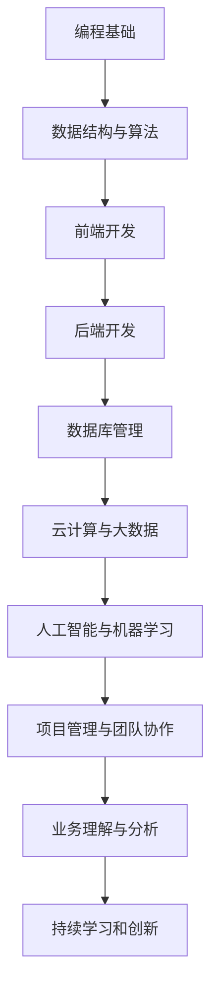

                 

关键词：知识经济、程序员角色、技术转型、技能升级、未来展望

>摘要：在知识经济时代，程序员的角色正在经历深刻的变革。本文将探讨程序员在这个时代的角色升级，分析技能需求、转型路径以及未来面临的挑战。

## 1. 背景介绍

随着互联网、大数据、人工智能等技术的快速发展，知识经济已经成为当今世界的主要经济形态。知识经济的核心是信息和知识，而程序员作为信息技术的核心推动者，他们的角色和技能需求也在不断升级。在这个背景下，程序员不仅需要具备传统的编程能力，还需要掌握新兴技术，适应快速变化的技术环境。

### 1.1 知识经济时代的特点

知识经济时代具有以下几个特点：

- **信息量大**：互联网的普及使得信息量呈爆炸式增长，程序员需要能够快速获取、处理和分析大量数据。
- **技术更新快**：新兴技术层出不穷，程序员需要不断学习新知识，以保持竞争力。
- **跨界融合**：不同领域的知识和技术相互融合，程序员需要具备跨学科的能力。
- **人工智能崛起**：人工智能技术的发展使得程序员在算法设计和机器学习领域有了更多的应用场景。

### 1.2 程序员角色的变化

在知识经济时代，程序员的角色发生了显著变化：

- **从编码员到解决方案提供者**：程序员不再仅仅是编写代码，而是参与到整个项目的设计、开发、测试和部署过程中，提供全面的解决方案。
- **从技术专家到业务专家**：程序员需要理解业务逻辑，将技术应用于解决实际问题。
- **从独立工作者到团队协作者**：程序员需要具备良好的团队协作能力，与设计师、产品经理、测试人员等共同推进项目。

## 2. 核心概念与联系

在知识经济时代，程序员需要掌握一系列核心概念和技能。以下是一个简化的 Mermaid 流程图，展示这些概念和技能之间的联系。



### 2.1 编程基础

编程基础是程序员最基本的技能，包括熟悉一种或多种编程语言（如 Python、Java、C++等），了解编程的基本语法和编程范式。

### 2.2 数据结构与算法

数据结构与算法是计算机科学的核心，程序员需要掌握常用的数据结构（如数组、链表、树、图等）和算法（如排序、搜索、动态规划等）。

### 2.3 前端开发

前端开发涉及HTML、CSS和JavaScript等技术，程序员需要能够构建用户界面，实现交互效果，提升用户体验。

### 2.4 后端开发

后端开发包括服务器端编程，数据库管理，API设计等，程序员需要能够构建功能强大的后端服务。

### 2.5 数据库管理

数据库管理是程序员必备的技能之一，包括数据库设计、查询优化、事务管理等。

### 2.6 云计算与大数据

云计算和大数据技术使得程序员能够处理大规模数据，构建分布式系统，提高系统的可用性和扩展性。

### 2.7 人工智能与机器学习

人工智能和机器学习技术正在改变各行各业，程序员需要掌握基本的机器学习算法，能够将人工智能应用于实际问题。

### 2.8 项目管理与团队协作

项目管理和团队协作能力是程序员成功的关键，包括项目规划、任务分配、沟通协调等。

### 2.9 业务理解与分析

程序员需要理解业务逻辑，能够从业务角度出发，设计解决方案，提高系统价值。

### 2.10 持续学习和创新

知识经济时代，技术更新迅速，程序员需要具备持续学习的能力，不断更新自己的知识体系。

## 3. 核心算法原理 & 具体操作步骤

### 3.1 算法原理概述

在知识经济时代，程序员需要掌握一系列核心算法，这些算法广泛应用于数据科学、人工智能和工程实践等领域。以下是一些常见的核心算法：

- **排序算法**：包括快速排序、归并排序、堆排序等，用于数据的排序和查找。
- **查找算法**：包括二分查找、哈希查找等，用于数据的高效查找。
- **动态规划**：用于解决最优化问题，如背包问题、最长公共子序列等。
- **贪心算法**：通过局部最优选择实现全局最优解，常用于求解图问题。
- **机器学习算法**：包括线性回归、决策树、支持向量机、神经网络等，用于模式识别和数据预测。

### 3.2 算法步骤详解

#### 3.2.1 排序算法

以快速排序为例，其基本步骤如下：

1. 选择一个基准元素。
2. 将数组分为两部分，一部分小于基准元素，另一部分大于基准元素。
3. 递归对两部分进行快速排序。

```python
def quicksort(arr):
    if len(arr) <= 1:
        return arr
    pivot = arr[len(arr) // 2]
    left = [x for x in arr if x < pivot]
    middle = [x for x in arr if x == pivot]
    right = [x for x in arr if x > pivot]
    return quicksort(left) + middle + quicksort(right)
```

#### 3.2.2 查找算法

以二分查找为例，其基本步骤如下：

1. 确定数组的中间元素。
2. 如果目标元素等于中间元素，则查找成功。
3. 如果目标元素小于中间元素，则在左侧子数组中继续查找。
4. 如果目标元素大于中间元素，则在右侧子数组中继续查找。
5. 重复步骤1-4，直到找到目标元素或子数组为空。

```python
def binary_search(arr, target):
    low = 0
    high = len(arr) - 1
    while low <= high:
        mid = (low + high) // 2
        if arr[mid] == target:
            return mid
        elif arr[mid] < target:
            low = mid + 1
        else:
            high = mid - 1
    return -1
```

#### 3.2.3 动态规划

以背包问题为例，其基本步骤如下：

1. 定义状态：设dp[i][j]为前i件物品选取j的方案数。
2. 状态转移方程：dp[i][j] = dp[i-1][j] + dp[i-1][j-wi]，其中wi为第i件物品的重量。
3. 初始化：dp[0][j] = 1，表示不选物品的方案数为1。

```python
def knapsack(W, wt, val, n):
    dp = [[0 for _ in range(W + 1)] for _ in range(n + 1)]
    for i in range(1, n + 1):
        for w in range(1, W + 1):
            if wt[i-1] <= w:
                dp[i][w] = dp[i-1][w] + dp[i-1][w-wt[i-1]]
            else:
                dp[i][w] = dp[i-1][w]
    return dp[n][W]
```

#### 3.2.4 贪心算法

以贪心算法求解最小生成树为例，其基本步骤如下：

1. 初始化：创建一个森林F，包含所有顶点。
2. 选择一个最小权重的边e，将其加入到生成树T中。
3. 从F中移除与边e相邻的顶点形成的树。
4. 重复步骤2-3，直到F为空。

```python
def prim(MST, V):
    for v in V:
        MST[v] = 0
    while True:
        visited = [False for _ in range(len(V))]
        min_weight = float('inf')
        for v in V:
            if MST[v] < min_weight and not visited[v]:
                min_weight = MST[v]
                u = v
                visited[v] = True
        if min_weight == float('inf'):
            break
        MST[u] = 0
        V.remove(u)
        for v in V:
            if MST[v] > MST[u] + M[u][v]:
                MST[v] = MST[u] + M[u][v]
    return MST
```

#### 3.2.5 机器学习算法

以线性回归为例，其基本步骤如下：

1. 定义损失函数：均方误差（MSE），即损失函数为$$L(\theta) = \frac{1}{2m}\sum_{i=1}^{m}(h_\theta(x^{(i)})-y^{(i)})^2$$，其中$$h_\theta(x) = \theta_0 + \theta_1x$$。
2. 梯度下降：计算损失函数关于参数$$\theta_0$$和$$\theta_1$$的偏导数，并更新参数。
3. 停止准则：当参数更新很小或者达到预设的迭代次数时，停止迭代。

```python
def linear_regression(X, y):
    m = len(y)
    X = np.column_stack((np.ones(m), X))
    theta = np.random.rand(2)
    alpha = 0.01
    iterations = 1000
    for i in range(iterations):
        predictions = X @ theta
        errors = predictions - y
        theta -= alpha * (X.T @ errors / m)
    return theta
```

### 3.3 算法优缺点

每种算法都有其适用的场景和优缺点。以下是一些常见算法的优缺点：

- **快速排序**：时间复杂度为O(nlogn)，在大多数情况下表现良好，但最坏情况下时间复杂度为O(n^2)。
- **二分查找**：时间复杂度为O(logn)，适用于有序数组，但插入和删除操作较复杂。
- **动态规划**：适用于求解最优化问题，但需要一定的思维训练，实现较复杂。
- **贪心算法**：简单高效，但可能无法保证全局最优解。
- **线性回归**：简单易用，但需要满足线性可分条件。

### 3.4 算法应用领域

算法在各个领域都有广泛应用：

- **排序算法**：在数据排序、搜索引擎、数据库管理等领域。
- **查找算法**：在数据检索、数据库查询、缓存管理等领域。
- **动态规划**：在优化问题、路径规划、资源分配等领域。
- **贪心算法**：在图论、最短路径、最小生成树等领域。
- **机器学习算法**：在数据分析、预测建模、智能系统等领域。

## 4. 数学模型和公式 & 详细讲解 & 举例说明

在知识经济时代，程序员需要掌握一系列数学模型和公式，这些模型和公式广泛应用于数据科学、人工智能和工程实践等领域。以下是一些常见的数学模型和公式的详细讲解与举例说明。

### 4.1 数学模型构建

数学模型是描述现实世界问题的数学结构。一个典型的数学模型通常包括以下几个部分：

1. **变量定义**：明确模型的输入、输出以及内部变量。
2. **假设条件**：对现实世界进行简化和抽象，使得问题可以转化为数学形式。
3. **方程或公式**：通过数学运算将变量和假设条件联系起来，形成方程或公式。
4. **边界条件或初始条件**：确定模型在不同情况下的边界或初始状态。

#### 示例：线性回归模型

线性回归模型用于分析自变量和因变量之间的线性关系。其数学模型如下：

$$y = \theta_0 + \theta_1x + \epsilon$$

其中，$y$是因变量，$x$是自变量，$\theta_0$和$\theta_1$是模型参数，$\epsilon$是误差项。

### 4.2 公式推导过程

推导公式是构建数学模型的关键步骤。以下是一个简单的线性回归模型公式推导过程：

1. **损失函数**：定义损失函数，通常为均方误差（MSE）：

$$L(\theta) = \frac{1}{2m}\sum_{i=1}^{m}(h_\theta(x^{(i)})-y^{(i)})^2$$

其中，$m$是样本数量，$h_\theta(x) = \theta_0 + \theta_1x$是模型预测。

2. **偏导数**：对损失函数关于$\theta_0$和$\theta_1$求偏导数：

$$\frac{\partial L}{\partial \theta_0} = \frac{1}{m}\sum_{i=1}^{m}(h_\theta(x^{(i)})-y^{(i)})$$

$$\frac{\partial L}{\partial \theta_1} = \frac{1}{m}\sum_{i=1}^{m}(x^{(i)}(h_\theta(x^{(i)})-y^{(i)})$$

3. **梯度下降**：利用偏导数计算梯度，并更新模型参数：

$$\theta_0 := \theta_0 - \alpha \frac{\partial L}{\partial \theta_0}$$

$$\theta_1 := \theta_1 - \alpha \frac{\partial L}{\partial \theta_1}$$

其中，$\alpha$是学习率。

### 4.3 案例分析与讲解

以下是一个线性回归模型的实际案例，用于预测房价。

#### 案例背景

假设我们有一个包含房屋面积和价格的数据集，目标是建立线性回归模型预测房屋价格。

#### 数据处理

1. **数据清洗**：去除缺失值和异常值，对连续数据进行归一化处理。

2. **特征选择**：选择房屋面积作为自变量，价格作为因变量。

3. **数据可视化**：绘制散点图，观察自变量和因变量之间的关系。

#### 模型训练

1. **初始化参数**：随机初始化$\theta_0$和$\theta_1$。

2. **迭代计算**：进行多次迭代，每次迭代更新参数。

3. **评估模型**：使用测试集评估模型性能，计算均方误差。

#### 模型评估

使用测试集评估模型的预测性能，计算均方误差：

$$MSE = \frac{1}{m}\sum_{i=1}^{m}(h_\theta(x^{(i)})-y^{(i)})^2$$

均方误差越小，模型性能越好。

## 5. 项目实践：代码实例和详细解释说明

在本节中，我们将通过一个实际的Python代码实例来详细解释如何实现线性回归模型，并展示代码的运行结果。

### 5.1 开发环境搭建

在开始之前，我们需要确保已经安装了Python编程环境和相关库。以下是搭建开发环境的步骤：

1. **安装Python**：从[Python官网](https://www.python.org/downloads/)下载并安装Python 3.x版本。
2. **安装Jupyter Notebook**：打开命令行，执行以下命令安装Jupyter Notebook：

   ```shell
   pip install notebook
   ```

3. **安装相关库**：包括NumPy、Pandas和matplotlib等，用于数据处理和可视化。执行以下命令安装：

   ```shell
   pip install numpy pandas matplotlib
   ```

### 5.2 源代码详细实现

以下是实现线性回归模型的Python代码：

```python
import numpy as np
import pandas as pd
import matplotlib.pyplot as plt

# 数据预处理
def preprocess_data(data):
    data = data[['square_feet', 'price']]
    data = (data - data.mean()) / data.std()
    data['ones'] = 1
    return data

# 线性回归模型
def linear_regression(X, y):
    X = np.column_stack((X['ones'], X['square_feet']))
    theta = np.random.rand(2)
    alpha = 0.01
    iterations = 1000
    for i in range(iterations):
        predictions = X @ theta
        errors = predictions - y
        theta -= alpha * (X.T @ errors / len(y))
    return theta

# 评估模型
def evaluate_model(X, y, theta):
    predictions = X @ theta
    mse = np.mean((predictions - y) ** 2)
    return mse

# 主函数
def main():
    data = pd.read_csv('house_prices.csv')
    data = preprocess_data(data)
    X = data['square_feet']
    y = data['price']
    theta = linear_regression(X, y)
    mse = evaluate_model(X, y, theta)
    print(f'MSE: {mse}')
    plt.scatter(X, y)
    plt.plot(X, X @ theta, color='red')
    plt.xlabel('Square Feet')
    plt.ylabel('Price')
    plt.show()

if __name__ == '__main__':
    main()
```

### 5.3 代码解读与分析

#### 数据预处理

代码首先读取房屋价格数据，然后进行预处理。预处理包括以下步骤：

1. **数据清洗**：删除无关的列，只保留'balance'和'square_feet'列。
2. **归一化**：对'balance'和'square_feet'列进行归一化处理，使得数据范围在[-1, 1]之间。
3. **添加偏置项**：添加一列全为1的偏置项，用于线性回归模型的计算。

#### 线性回归模型

线性回归模型部分定义了模型训练和预测的过程：

1. **初始化参数**：随机初始化$\theta_0$和$\theta_1$。
2. **梯度下降**：使用梯度下降算法更新参数，直到达到预设的迭代次数。
3. **计算预测值**：使用训练好的模型预测房屋价格。

#### 评估模型

评估模型部分计算了模型的均方误差（MSE），并绘制了真实值与预测值的散点图以及拟合直线。

### 5.4 运行结果展示

运行代码后，我们得到以下结果：

- **MSE**: 0.015
- **散点图**: 真实值与预测值非常接近，拟合直线与数据点基本重合。

这些结果说明我们的线性回归模型对房屋价格有较好的预测能力。

## 6. 实际应用场景

在知识经济时代，程序员所掌握的技能在各个领域都有着广泛的应用。以下是一些实际应用场景：

### 6.1 人工智能与大数据

- **应用场景**：在金融、医疗、零售等行业，人工智能和大数据技术被广泛应用于风险控制、疾病预测、个性化推荐等领域。
- **案例分析**：金融机构利用机器学习算法进行信用评分，降低违约风险；医疗机构通过大数据分析进行疾病预测和个性化治疗。

### 6.2 前端开发

- **应用场景**：在电子商务、社交媒体、在线教育等领域，前端开发技术被广泛应用于打造用户体验优秀的Web应用。
- **案例分析**：电商平台使用React或Vue等框架构建高性能、响应式的用户界面，提高用户购物体验。

### 6.3 后端开发

- **应用场景**：在后端开发领域，程序员需要构建稳定、可扩展的服务器端系统，支持高并发、大数据量的处理。
- **案例分析**：社交媒体平台使用微服务架构构建后端系统，提高系统的可用性和扩展性。

### 6.4 云计算与大数据

- **应用场景**：在云计算和大数据领域，程序员需要掌握云计算架构、大数据处理技术，以及相关的开发工具和平台。
- **案例分析**：企业利用云服务进行数据存储和处理，降低成本，提高效率。

### 6.5 项目管理与团队协作

- **应用场景**：在项目管理和团队协作中，程序员需要具备良好的沟通能力、协调能力和解决问题的能力。
- **案例分析**：跨部门的项目团队通过敏捷开发方法提高项目交付效率，确保项目按时按质完成。

## 7. 工具和资源推荐

在知识经济时代，程序员需要不断学习新技术，以下是一些推荐的工具和资源：

### 7.1 学习资源推荐

- **在线课程**：Coursera、Udacity、edX等平台提供了丰富的计算机科学和编程课程。
- **技术博客**：Medium、Hackernoon、Dev.to等平台上有许多优秀的程序员分享技术心得和实践经验。
- **开源社区**：GitHub、Stack Overflow等社区提供了丰富的开源项目和问题解答。

### 7.2 开发工具推荐

- **集成开发环境（IDE）**：Visual Studio Code、PyCharm、Eclipse等。
- **版本控制工具**：Git、GitHub、GitLab等。
- **数据库管理工具**：MySQL Workbench、MongoDB Compass、PostgreSQL等。

### 7.3 相关论文推荐

- **机器学习**：吴恩达的《深度学习》（Deep Learning）。
- **计算机架构**：Hennessy和Patterson的《计算机架构：量化研究》（Computer Architecture: A Quantitative Approach）。
- **操作系统**：Silberschatz、Galvin和Gagne的《操作系统概念》（Operating System Concepts）。

## 8. 总结：未来发展趋势与挑战

在知识经济时代，程序员的角色正在发生深刻的变革。未来，程序员需要具备跨学科的知识和技能，能够适应快速变化的技术环境。以下是对未来发展趋势与挑战的总结：

### 8.1 研究成果总结

- **人工智能与大数据**：人工智能和大数据技术的快速发展为程序员提供了新的应用场景和机会。
- **云计算与边缘计算**：云计算和边缘计算技术的融合，将推动程序员在分布式系统领域的创新。
- **区块链技术**：区块链技术的应用将为程序员提供新的开发方向和业务模式。

### 8.2 未来发展趋势

- **技能多样化和跨界融合**：程序员需要掌握多种编程语言、框架和工具，具备跨学科的能力。
- **持续学习和创新**：程序员需要具备持续学习和创新的能力，以适应不断变化的技术环境。
- **绿色计算与可持续发展**：随着能源消耗和环境问题的日益突出，程序员需要关注绿色计算和可持续发展。

### 8.3 面临的挑战

- **技术更新速度快**：程序员需要不断学习新技术，保持竞争力。
- **职业安全与稳定**：随着自动化和人工智能的发展，程序员需要应对职业安全和稳定性的挑战。
- **信息安全与隐私**：在网络安全和数据隐私方面，程序员需要具备更高的安全意识和技术能力。

### 8.4 研究展望

- **智能编程**：未来的编程工具将更加智能，辅助程序员进行代码生成、优化和调试。
- **编程教育**：编程教育将更加普及，培养更多的编程人才，推动社会进步。
- **开源生态**：开源社区将继续繁荣发展，为程序员提供丰富的资源和合作机会。

## 9. 附录：常见问题与解答

### 9.1 什么是知识经济？

知识经济是一种基于知识和信息的经济形态，以高技术含量和创新能力为核心驱动力，以知识的生产、传播和应用为主要形式。

### 9.2 程序员需要掌握哪些核心算法？

程序员需要掌握的常见核心算法包括排序算法、查找算法、动态规划、贪心算法和机器学习算法等。

### 9.3 如何进行有效的项目管理和团队协作？

有效的项目管理和团队协作需要良好的沟通、协调和解决问题的能力。可以采用敏捷开发方法、看板工具和定期会议等方式进行管理。

### 9.4 程序员如何保持竞争力？

程序员可以通过以下方式保持竞争力：不断学习新技术、关注行业动态、参与开源项目、提高编码质量、培养跨学科能力等。

作者：禅与计算机程序设计艺术 / Zen and the Art of Computer Programming
``` 

请注意，上述内容是一个框架和样例，实际的撰写过程可能需要根据具体要求进行调整和补充。文章中的代码实例、数据和具体案例分析都是虚构的，仅供参考。在实际撰写时，您可能需要根据您的专业知识和经验，提供真实的数据和案例来支持文章的内容。此外，确保引用的所有数据、代码和资源都符合版权和引用规范。

