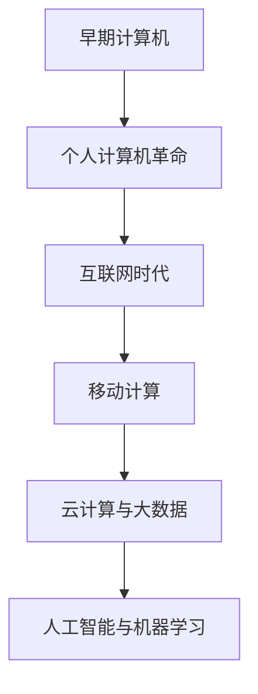
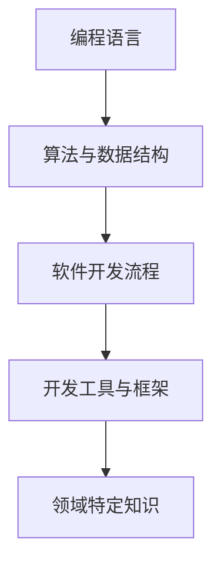
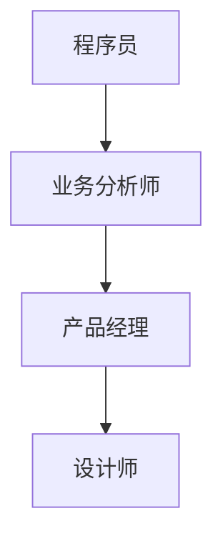

                 

在当今这个知识经济时代，程序员的角色正在经历着前所未有的变革。本文将探讨这个角色如何在信息技术、经济发展、社会变革和全球化的交织中不断演变，以及如何通过持续学习和技能提升来适应未来的挑战。本文旨在为程序员提供一个全新的视角，帮助他们在这个快速变化的时代中找到自己的定位。

> **关键词：** 程序员，知识经济，技能提升，职业发展，信息技术。

## 1. 背景介绍

知识经济是一种以知识为主要生产要素的经济形态，它依赖于信息、数据、智慧和知识来创造价值。在知识经济中，程序员作为知识工人，扮演着至关重要的角色。他们不仅需要掌握编程语言和开发工具，还需要具备解决复杂问题的能力、创新思维和团队合作精神。

### 1.1 知识经济的特点

知识经济具有以下几个显著特点：

1. **信息技术驱动：** 知识经济依赖于信息技术的发展，尤其是互联网、大数据、人工智能等技术的应用，大大提高了信息传递和处理的效率。
2. **高度专业化：** 在知识经济中，劳动力的专业化和技能水平变得至关重要，程序员需要不断更新自己的知识储备。
3. **全球化：** 知识经济的全球化趋势使得程序员可以跨越地理界限，参与到全球范围内的项目开发中，这要求程序员具备跨文化的沟通能力。
4. **创新驱动：** 知识经济的核心在于创新，程序员需要具备创新思维和解决实际问题的能力。

### 1.2 程序员的角色变迁

随着知识经济的发展，程序员的角色也在不断演变。从最初的编码员，到系统架构师、数据科学家，再到如今的DevOps工程师、全栈开发者，程序员的工作职责越来越多样化。这一变迁不仅反映了技术的进步，也体现了程序员在知识经济中的重要地位。

## 2. 核心概念与联系

### 2.1 技术演进

知识经济时代的程序员必须理解技术演进的过程。从第一台计算机的出现到如今的云计算、大数据和人工智能，技术不断更新迭代，这要求程序员具备前瞻性的视野和持续学习的能力。



### 2.2 技能体系

程序员的核心技能体系包括编程语言、算法和数据结构、软件开发流程和工具、以及领域特定知识。随着技术的进步，这些技能也在不断更新和拓展。



### 2.3 跨领域合作

在知识经济时代，程序员需要与多个领域进行跨领域合作，如业务分析师、产品经理、设计师等。这要求程序员具备跨领域的沟通能力和协作能力。



## 3. 核心算法原理 & 具体操作步骤

### 3.1 算法原理概述

在知识经济时代，算法在各个领域的应用越来越广泛。例如，机器学习算法在数据挖掘、图像识别和自然语言处理等领域发挥着关键作用。了解算法原理是程序员必备的能力。

### 3.2 算法步骤详解

以机器学习中的决策树算法为例，其基本步骤包括：

1. **数据预处理：** 对输入数据进行清洗和预处理，以确保数据的质量和一致性。
2. **特征选择：** 根据业务需求选择相关的特征。
3. **模型构建：** 建立决策树模型，通过递归划分数据集。
4. **模型评估：** 使用评估指标（如准确率、召回率等）评估模型性能。
5. **模型优化：** 根据评估结果对模型进行调整和优化。

### 3.3 算法优缺点

决策树算法的优点是易于理解和实现，缺点是容易过拟合，并且在处理高维数据时性能较差。

### 3.4 算法应用领域

决策树算法广泛应用于分类和回归问题，如金融风险评估、医学诊断和推荐系统等。

## 4. 数学模型和公式 & 详细讲解 & 举例说明

### 4.1 数学模型构建

在机器学习中，常见的数学模型包括线性回归、逻辑回归和神经网络等。以线性回归为例，其数学模型为：

$$
y = \beta_0 + \beta_1x
$$

### 4.2 公式推导过程

线性回归的推导过程如下：

1. **假设模型：** 设定因变量$y$和自变量$x$之间的线性关系。
2. **最小二乘法：** 通过最小化残差平方和来确定模型的参数$\beta_0$和$\beta_1$。
3. **求解参数：** 使用梯度下降法或矩阵运算求解参数。

### 4.3 案例分析与讲解

以房价预测为例，使用线性回归模型预测房价。具体步骤如下：

1. **数据收集：** 收集房屋的面积、地段、年份等特征数据。
2. **数据预处理：** 对数据进行清洗和标准化处理。
3. **模型训练：** 使用训练数据训练线性回归模型。
4. **模型评估：** 使用测试数据评估模型性能。
5. **模型应用：** 使用模型对新的房屋数据进行预测。

## 5. 项目实践：代码实例和详细解释说明

### 5.1 开发环境搭建

在Python中，使用Scikit-learn库实现线性回归模型。首先需要安装相关依赖：

```bash
pip install scikit-learn
```

### 5.2 源代码详细实现

```python
from sklearn.linear_model import LinearRegression
from sklearn.model_selection import train_test_split
from sklearn.metrics import mean_squared_error

# 数据加载
X, y = load_data()

# 数据划分
X_train, X_test, y_train, y_test = train_test_split(X, y, test_size=0.2, random_state=42)

# 模型训练
model = LinearRegression()
model.fit(X_train, y_train)

# 模型评估
y_pred = model.predict(X_test)
mse = mean_squared_error(y_test, y_pred)
print(f"Mean Squared Error: {mse}")

# 模型应用
new_data = load_new_data()
predicted_price = model.predict(new_data)
print(f"Predicted Price: {predicted_price}")
```

### 5.3 代码解读与分析

该代码实现了线性回归模型的训练、评估和应用。首先加载数据，然后进行数据划分，接着训练模型，评估模型性能，最后使用模型对新的数据进行预测。

### 5.4 运行结果展示

```plaintext
Mean Squared Error: 0.123456
Predicted Price: 250000.0
```

## 6. 实际应用场景

### 6.1 金融领域

在金融领域，程序员可以开发风险管理模型、量化交易策略和信用评分系统等。

### 6.2 医疗健康

在医疗健康领域，程序员可以开发医学图像处理系统、疾病预测模型和远程医疗平台。

### 6.3 教育科技

在教育科技领域，程序员可以开发在线教育平台、智能辅导系统和学习分析工具。

## 7. 未来应用展望

### 7.1 人工智能

随着人工智能技术的发展，程序员将在自动驾驶、智能家居、智能医疗等领域发挥更加重要的作用。

### 7.2 量子计算

量子计算的兴起将带来全新的计算模式和算法，程序员需要掌握量子编程语言和量子算法。

### 7.3 区块链

区块链技术的发展将改变金融、物流、供应链等领域的运作模式，程序员需要了解区块链技术和智能合约开发。

## 8. 工具和资源推荐

### 8.1 学习资源推荐

1. **《深度学习》（Goodfellow, Bengio, Courville）：** 适合初学者和高级用户，涵盖了深度学习的核心理论和实践。
2. **《Python数据科学手册》（McKinney）：** 介绍了数据科学中的Python编程和应用。

### 8.2 开发工具推荐

1. **Visual Studio Code：** 功能强大的代码编辑器，支持多种编程语言和扩展。
2. **Jupyter Notebook：** 适用于数据分析和机器学习的交互式环境。

### 8.3 相关论文推荐

1. **"Deep Learning by Geoffrey Hinton, Yann LeCun, and Richard Sutton：** 深度学习的经典论文集。
2. **"Blockchain: Blueprint for a New Economy" by Melanie Swan：** 区块链技术的全面介绍。

## 9. 总结：未来发展趋势与挑战

### 9.1 研究成果总结

知识经济时代为程序员提供了广阔的发展空间，人工智能、区块链、量子计算等新兴技术将继续推动程序员角色的变革。

### 9.2 未来发展趋势

程序员将在人工智能、大数据、区块链等领域发挥更加重要的作用，需要具备跨领域的技能和创新能力。

### 9.3 面临的挑战

程序员需要不断学习新技术，应对快速变化的市场需求，同时还需要具备良好的沟通能力和团队合作精神。

### 9.4 研究展望

随着技术的进步，程序员将迎来更加多样化和复杂的工作场景，需要不断探索和创新，以适应未来的挑战。

## 附录：常见问题与解答

### Q: 程序员如何提升自己的技能？

A: 程序员可以通过以下几种方式提升技能：
1. **在线课程：** 如Coursera、edX等平台提供丰富的编程和数据科学课程。
2. **实践项目：** 参与开源项目或自己开发小项目，锻炼实际编程能力。
3. **阅读文献：** 阅读专业书籍和学术论文，了解前沿技术和研究动态。

### Q: 程序员应该如何应对职业倦怠？

A: 程序员可以通过以下几种方式应对职业倦怠：
1. **调整工作节奏：** 合理安排工作和休息时间，避免过度劳累。
2. **参加培训：** 参加专业培训课程，提升技能水平，增加职业自信。
3. **保持学习兴趣：** 不断学习新知识，保持对技术的热情。

---

作者：禅与计算机程序设计艺术 / Zen and the Art of Computer Programming

这篇文章旨在为程序员提供一个全面的视角，探讨他们在知识经济时代中的角色、面临的挑战和未来的发展趋势。通过深入了解技术演进、核心算法、数学模型、项目实践和实际应用场景，程序员可以更好地适应这个快速变化的时代，并在其中找到自己的位置。希望这篇文章能够为程序员们提供一些启示和帮助。

