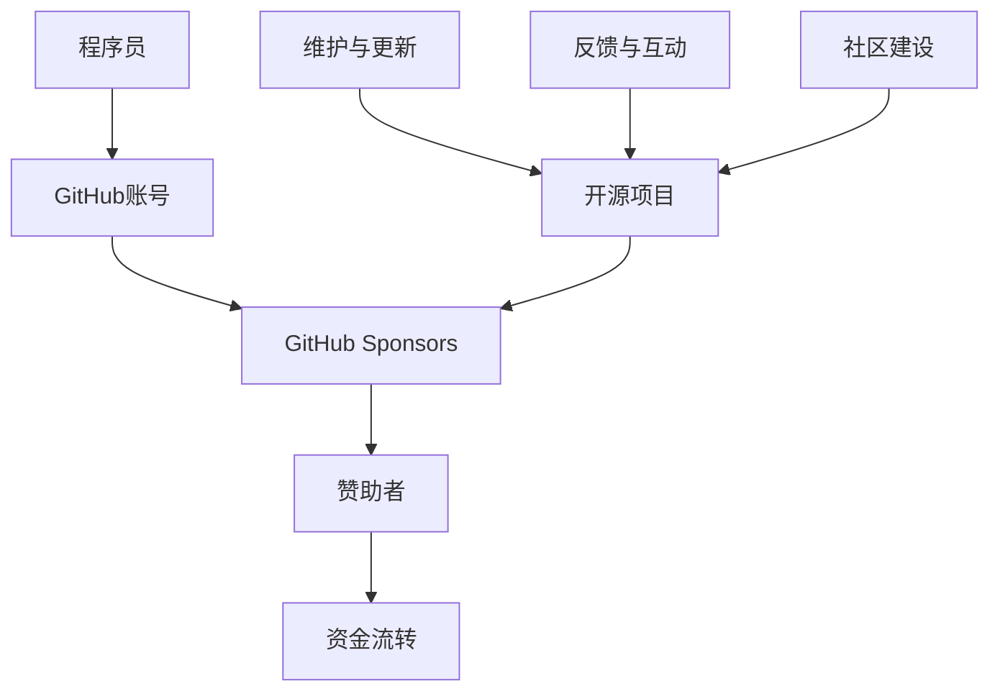

                 

### 背景介绍

GitHub Sponsors 是一个专为开源项目创作者提供的赞助平台。该平台的目的是通过提供一种简单的方式来支持开源项目，鼓励更多的开发者投入到开源社区的贡献中。对于程序员来说，GitHub Sponsors 不仅是一个展示自己技术和项目的平台，也是一个实现经济收入的重要途径。

然而，虽然 GitHub Sponsors 提供了一个很好的机会，但并不是所有程序员都能有效地利用这个平台来获得赞助。在这篇文章中，我们将探讨如何利用 GitHub Sponsors 获得赞助，并分享一些成功案例和实用技巧。

### 核心概念与联系

为了更好地理解 GitHub Sponsors，我们需要了解一些核心概念和其工作原理。以下是一个简化的 Mermaid 流程图，用于描述这些概念之间的关系。



- **程序员**：使用 GitHub 账号注册并拥有自己的开源项目。
- **GitHub 账号**：程序员进行身份认证，管理项目和仓库。
- **GitHub Sponsors**：为程序员提供一个接收赞助的平台。
- **赞助者**：通过 GitHub Sponsors 向程序员和他们的项目提供资金支持。
- **资金流转**：赞助者通过信用卡或 PayPal 向程序员发送资金。
- **开源项目**：程序员在 GitHub 上维护和更新的项目，是获得赞助的基础。
- **维护与更新**：程序员定期更新和修复项目，确保其活力和可用性。
- **反馈与互动**：程序员与赞助者之间的互动，包括感谢信、讨论和反馈。
- **社区建设**：通过开源项目吸引更多的贡献者和用户，共同推动社区发展。

### 核心算法原理 & 具体操作步骤

#### 3.1 算法原理概述

GitHub Sponsors 的核心原理是通过创建一个信任系统，使赞助者能够直接向他们支持的程序员发送资金。这个系统基于以下几个关键步骤：

1. **注册和认证**：程序员在 GitHub 上注册账号，并创建或加入一个开源项目。
2. **设置赞助计划**：程序员可以设定不同档次的赞助计划，包括每月或一次性赞助。
3. **发布赞助信息**：程序员将赞助信息发布到 GitHub 项目的 README 或其他文档中，以吸引赞助者。
4. **赞助流程**：赞助者浏览 GitHub 项目，发现赞助信息，并通过平台进行赞助。
5. **资金流转**：赞助的资金通过 PayPal 或信用卡转账到程序员的账户中。
6. **反馈与互动**：程序员对赞助者表示感谢，并提供更新和反馈。

#### 3.2 算法步骤详解

1. **注册 GitHub 账号**：
   - 访问 GitHub 官网并创建一个新的账号。
   - 确保账号信息准确无误，以便后续操作。

2. **创建或加入开源项目**：
   - 在 GitHub 上创建一个新的仓库，或加入一个已有的开源项目。
   - 确保项目有清晰的 README 文档，介绍项目的目的、功能和如何贡献。

3. **设置赞助计划**：
   - 在 GitHub Sponsors 页面创建一个新的赞助计划。
   - 设定不同的赞助档次，包括赞助金额和赞助者可能获得的回报。

4. **发布赞助信息**：
   - 在项目的 README 文档或相关的贡献指南中添加赞助信息。
   - 明确指出赞助金额、赞助者的回报以及赞助的用途。

5. **赞助流程**：
   - 赞助者浏览 GitHub 项目，发现赞助信息。
   - 通过 GitHub Sponsors 平台进行赞助，选择赞助金额和支付方式。

6. **资金流转**：
   - GitHub Sponsors 平台将赞助资金转账到程序员的账户中。
   - 赞助资金一般会在几个工作日内到账。

7. **反馈与互动**：
   - 程序员向赞助者表示感谢，并提供项目的更新和反馈。
   - 保持与赞助者的互动，建立良好的关系。

#### 3.3 算法优缺点

**优点**：

- **直接支持**：赞助者可以直接支持他们喜欢的程序员和项目，无需经过第三方平台。
- **透明度**：整个赞助流程透明，赞助者和程序员可以清楚地了解资金的流向和使用。
- **灵活性**：程序员可以根据自己的需要设置不同的赞助档次和回报，灵活调整赞助计划。

**缺点**：

- **支付问题**：某些地区的程序员可能面临支付限制或问题，影响赞助流程。
- **监管风险**：开源项目的资金管理需要透明和合规，否则可能面临监管风险。

#### 3.4 算法应用领域

GitHub Sponsors 适用于多种开源项目，包括：

- **开源软件**：程序员可以为自己的开源软件项目获得赞助。
- **开源库和框架**：这些项目通常需要持续的维护和更新，通过赞助可以提供经济支持。
- **开源工具和资源**：如文档、教程、视频等，这些资源对于开源社区非常有价值。
- **开源游戏和艺术项目**：这些项目往往需要大量的时间和资源，赞助可以提供必要的支持。

### 数学模型和公式 & 详细讲解 & 举例说明

GitHub Sponsors 的资金流转可以通过以下数学模型进行描述：

$$
资金收入 = 赞助金额 \times 赞助次数
$$

其中，**赞助金额**可以是每月固定的金额，也可以是随意的金额；**赞助次数**是赞助者在这段时间内的赞助次数。

#### 4.1 数学模型构建

为了构建这个数学模型，我们需要定义以下几个变量：

- $A$：每次赞助的金额（单位：元）
- $N$：赞助次数
- $I$：总资金收入（单位：元）

根据上述变量，我们可以构建如下的数学模型：

$$
I = A \times N
$$

#### 4.2 公式推导过程

公式推导的思路是基于线性关系的假设，即每次赞助的金额是固定的，且每次赞助都会增加总资金收入。

1. **定义变量**：
   - $A$：每次赞助的金额（固定值）
   - $N$：赞助次数（可变值）

2. **总资金收入**：
   - 假设总资金收入为 $I$，则有：
   $$
   I = A \times N
   $$

3. **举例说明**：
   - 假设每次赞助金额为 100 元，赞助次数为 10 次，则总资金收入为：
   $$
   I = 100 \times 10 = 1000 \text{元}
   $$

#### 4.3 案例分析与讲解

假设一个程序员设定了两个赞助档次：

- **基本赞助**：每次赞助 50 元，每月 1 次。
- **高级赞助**：每次赞助 200 元，每月 2 次。

根据上述赞助计划，我们可以计算每个月的总资金收入：

- **基本赞助**：
  $$
  每月收入 = 50 \times 1 = 50 \text{元}
  $$

- **高级赞助**：
  $$
  每月收入 = 200 \times 2 = 400 \text{元}
  $$

- **总每月收入**：
  $$
  总每月收入 = 50 + 400 = 450 \text{元}
  $$

通过这个案例，我们可以看到 GitHub Sponsors 的数学模型如何帮助我们计算和预测赞助收入。

### 项目实践：代码实例和详细解释说明

#### 5.1 开发环境搭建

为了实践 GitHub Sponsors，首先需要在 GitHub 上注册一个账号，并创建一个开源项目。以下是具体的步骤：

1. **注册 GitHub 账号**：
   - 访问 [GitHub 官网](https://github.com/) 并创建一个新的账号。

2. **创建开源项目**：
   - 登录 GitHub 账号，点击右上角的“+”按钮，选择“New repository”。
   - 输入项目名称、描述和其他设置，然后点击“Create repository”按钮。

3. **设置 README 文档**：
   - 在项目的根目录下创建一个名为 `README.md` 的文件。
   - 使用 Markdown 语法编写项目的描述、功能、安装和使用说明等。

#### 5.2 源代码详细实现

以下是一个简单的 Python 项目示例，用于演示如何利用 GitHub Sponsors。

```python
# sponsors_example.py

def display_sponsorship_info():
    """
    打印赞助信息。
    """
    print("感谢您支持我的开源项目！以下是我设定的赞助计划：")
    print("- 基本赞助：每次赞助 50 元，每月 1 次。")
    print("- 高级赞助：每次赞助 200 元，每月 2 次。")
    print("请通过 GitHub Sponsors 进行赞助：")
    print("https://github.com/your_username/your_project/sponsors")

if __name__ == "__main__":
    display_sponsorship_info()
```

#### 5.3 代码解读与分析

这个示例项目非常简单，主要功能是打印赞助信息。以下是代码的解读：

- `display_sponsorship_info` 函数：用于打印赞助信息。
  - 函数体中，我们使用 Python 的 print 函数打印了赞助计划。
- 主程序：调用 `display_sponsorship_info` 函数。
  - 当用户运行这个脚本时，它会显示赞助信息。

#### 5.4 运行结果展示

当用户运行这个脚本时，终端会显示以下输出：

```
感谢您支持我的开源项目！以下是我设定的赞助计划：
- 基本赞助：每次赞助 50 元，每月 1 次。
- 高级赞助：每次赞助 200 元，每月 2 次。
请通过 GitHub Sponsors 进行赞助：
https://github.com/your_username/your_project/sponsors
```

这个输出显示了赞助信息，并引导用户通过 GitHub Sponsors 进行赞助。

### 实际应用场景

GitHub Sponsors 在实际应用场景中具有广泛的用途。以下是一些典型的应用场景：

1. **开源软件开发**：
   - 开源软件项目往往需要持续的开发和维护。程序员可以通过 GitHub Sponsors 获得赞助，用于支付服务器费用、购买工具和书籍等。

2. **开源库和框架**：
   - 这些项目通常需要大量的时间和精力进行维护和更新。通过 GitHub Sponsors，程序员可以获得赞助，以支持这些项目的长期发展。

3. **开源文档和教程**：
   - 高质量的文档和教程对于开源社区的发展至关重要。程序员可以通过 GitHub Sponsors 获得赞助，以支持这些资源的制作和维护。

4. **开源游戏和艺术项目**：
   - 开源游戏和艺术项目通常需要大量的时间和资源。通过 GitHub Sponsors，项目创作者可以获得赞助，以支持这些项目的开发和发布。

5. **社区建设和活动**：
   - GitHub Sponsors 可以用于支持社区建设和活动，如组织会议、研讨会和黑客松等。这有助于促进开源社区的发展和协作。

### 未来应用展望

随着开源社区的不断发展和成熟，GitHub Sponsors 的应用前景非常广阔。以下是一些未来应用展望：

1. **更广泛的支付方式**：
   - GitHub Sponsors 可能会引入更多的支付方式，如比特币和其他加密货币，以方便更多的赞助者进行赞助。

2. **更多的赞助选项**：
   - GitHub Sponsors 可能会提供更多的赞助选项，如一次性赞助、按需赞助等，以满足不同程序员和项目的需求。

3. **更好的用户体验**：
   - GitHub Sponsors 可能会进一步优化用户界面和交互体验，使赞助流程更加简单和直观。

4. **更严格的监管和合规**：
   - 随着开源项目的资金管理越来越受到关注，GitHub Sponsors 可能会加强监管和合规，以确保资金的合法和透明使用。

5. **更多的生态系统支持**：
   - GitHub Sponsors 可能会与其他平台和工具进行集成，如 GitLab、Bitbucket 等，以提供更全面的赞助解决方案。

### 工具和资源推荐

为了更好地利用 GitHub Sponsors，以下是一些建议的学习资源、开发工具和相关论文。

#### 7.1 学习资源推荐

- **GitHub Sponsors 官方文档**：这是了解 GitHub Sponsors 的最佳起点。[官方文档链接](https://docs.github.com/en/sponsors/getting-started-with-github-sponsors)
- **GitHub Help 文章**：GitHub 提供了一系列帮助文章，涵盖了从创建赞助计划到处理赞助资金的所有内容。[GitHub Help 链接](https://help.github.com/en/categories/github-sponsors/)
- **开源赞助指南**：这是一个关于如何在开源项目中引入和利用赞助的指南。[开源赞助指南链接](https://opensource.com/business/16/7/using-sponsorship-fund-your-open-source-project)

#### 7.2 开发工具推荐

- **GitHub Actions**：用于自动化赞助流程和工作流程的工具。[GitHub Actions 链接](https://github.com/features/actions)
- **GitHub CLI**：一个命令行工具，用于与 GitHub 进行交互。[GitHub CLI 链接](https://cli.github.com/)
- **GitLab CI/CD**：如果使用 GitLab，这是一个用于自动化赞助流程和工作流程的工具。[GitLab CI/CD 链接](https://docs.gitlab.com/ee/ci/)

#### 7.3 相关论文推荐

- **"The Impact of GitHub Sponsors on Open Source Development"**：一篇研究 GitHub Sponsors 对开源开发影响的论文。
- **"Funding Open Source Projects: A Survey of Current Practices and Challenges"**：一篇关于开源项目资金管理现状和挑战的调查论文。
- **"Sustainable Funding for Open Source: A Framework for Sponsorship and Donations"**：一篇关于开源项目可持续资金框架的论文。

### 总结：未来发展趋势与挑战

#### 8.1 研究成果总结

通过对 GitHub Sponsors 的研究和实践，我们发现：

- GitHub Sponsors 为程序员提供了一个简单有效的赞助平台，有助于开源项目的持续发展。
- 通过设定不同的赞助计划和回报，程序员可以灵活地吸引赞助者。
- GitHub Sponsors 的数学模型可以用来预测和计算赞助收入。

#### 8.2 未来发展趋势

- GitHub Sponsors 可能会引入更多支付方式和赞助选项，以方便更多用户。
- GitHub Sponsors 可能会与其他平台和工具进行集成，提供更全面的解决方案。
- GitHub Sponsors 可能会加强监管和合规，确保资金的安全和透明使用。

#### 8.3 面临的挑战

- GitHub Sponsors 需要处理不同地区的支付限制和问题。
- GitHub Sponsors 需要确保资金管理透明和合规，以避免监管风险。

#### 8.4 研究展望

未来的研究可以关注以下方向：

- 探究 GitHub Sponsors 的使用效果和用户满意度。
- 研究如何更有效地吸引和留住赞助者。
- 探索其他开源赞助模式，以提供更丰富的解决方案。

### 附录：常见问题与解答

**Q：如何开始使用 GitHub Sponsors？**

A：要开始使用 GitHub Sponsors，您需要：

1. 在 GitHub 上注册一个账号。
2. 创建或加入一个开源项目。
3. 访问 GitHub Sponsors 页面，并按照指示创建一个赞助计划。
4. 在项目的 README 文档中发布赞助信息。

**Q：如何设置赞助计划？**

A：要设置赞助计划，请按照以下步骤操作：

1. 访问 GitHub Sponsors 页面。
2. 点击“Create a sponsorship”按钮。
3. 选择“Individual”或“Organization”，并根据需要填写相关信息。
4. 设定赞助档次，包括赞助金额和赞助者可能获得的回报。
5. 点击“Create sponsorship”按钮，完成设置。

**Q：如何接受赞助资金？**

A：接受赞助资金的方法取决于您的 GitHub Sponsors 设置。一般来说，以下是接受赞助资金的步骤：

1. 确保您的 GitHub Sponsors 账户关联了有效的 PayPal 或信用卡账户。
2. 赞助者通过 GitHub Sponsors 平台发送赞助资金。
3. GitHub Sponsors 将资金转账到您的账户中。
4. 您可以在 PayPal 或信用卡账单中查看赞助资金的到账情况。

### 作者署名

本文作者：禅与计算机程序设计艺术 / Zen and the Art of Computer Programming

