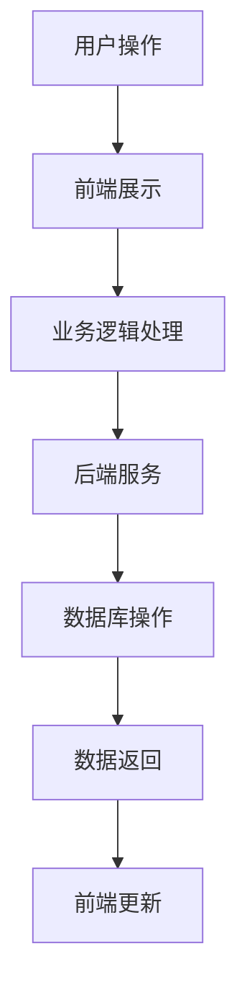

                 

关键词：小程序、知识付费、程序员、技术语言、算法、数学模型、项目实践、工具和资源推荐、未来发展趋势

> 摘要：随着移动互联网的普及，小程序作为一种轻量级应用模式，逐渐成为知识付费领域的重要载体。本文旨在探讨程序员如何利用小程序进行知识付费，从核心概念、算法原理、数学模型、项目实践等多个维度，深入分析小程序在知识付费领域的应用与发展。

## 1. 背景介绍

### 1.1 小程序的发展历程

小程序，作为一种无需下载安装即可使用的应用，最早由微信推出，随后在众多平台得到广泛应用。自2017年小程序上线以来，其发展迅速，已成为移动互联网的重要形式之一。根据相关数据显示，截至2022年，全球小程序用户已超过10亿，市场规模达到数百亿元。

### 1.2 知识付费的兴起

知识付费，即用户通过支付一定费用获取知识和服务的过程。随着人们对于知识的需求不断增加，知识付费市场呈现出爆发式增长。据某研究报告显示，2019年我国知识付费市场规模已突破2000亿元，预计2025年将达到5000亿元。

### 1.3 程序员与小程序、知识付费的关系

程序员作为互联网行业的重要参与者，不仅擅长开发小程序，也善于利用小程序进行知识付费。程序员可以通过小程序实现知识的传播、分享与变现，从而拓展个人影响力，实现职业发展。

## 2. 核心概念与联系

### 2.1 小程序架构

小程序的架构主要包括前端、后端和数据库三个部分。前端负责用户界面展示，后端负责业务逻辑处理，数据库用于存储数据。以下是一个简化的 Mermaid 流程图：



### 2.2 知识付费模式

知识付费模式主要包括以下几种：

- 会员制：用户支付一定费用成为会员，享受特定知识内容的免费观看。
- 单次购买：用户支付一定费用观看单个知识内容。
- 限时免费：在一定时间内，用户可以免费观看特定知识内容。
- 众筹：用户通过众筹方式支持知识内容制作，制作完成后享受免费观看。

### 2.3 程序员在小程序知识付费中的应用

程序员可以通过以下方式在小程序知识付费中发挥作用：

- 开发与维护小程序：程序员负责小程序的前端、后端开发与维护，确保小程序的稳定运行。
- 知识内容制作：程序员可以通过编程技巧、算法原理等知识进行内容制作，吸引更多用户。
- 数据分析与优化：程序员可以分析用户行为数据，优化小程序性能和用户体验。

## 3. 核心算法原理 & 具体操作步骤

### 3.1 算法原理概述

在小程序知识付费中，核心算法主要包括用户行为分析、内容推荐和支付处理。

- 用户行为分析：通过对用户行为数据的收集与分析，了解用户兴趣和需求，从而提供个性化内容推荐。
- 内容推荐：基于用户行为分析结果，利用推荐算法为用户推荐感兴趣的知识内容。
- 支付处理：实现用户支付功能，确保知识付费流程的顺利进行。

### 3.2 算法步骤详解

#### 3.2.1 用户行为分析

1. 数据收集：收集用户在平台上的行为数据，如浏览记录、点赞、评论等。
2. 数据预处理：对收集到的数据进行清洗、去重和格式转换，确保数据质量。
3. 特征提取：从预处理后的数据中提取用户兴趣特征，如关键词、主题等。
4. 行为预测：利用机器学习算法，对用户行为进行预测，为推荐算法提供依据。

#### 3.2.2 内容推荐

1. 建立推荐模型：利用用户兴趣特征，建立内容推荐模型。
2. 模型训练：将用户兴趣特征和内容数据输入模型，进行训练。
3. 内容推荐：根据用户兴趣特征，为用户推荐感兴趣的知识内容。

#### 3.2.3 支付处理

1. 支付接口集成：集成第三方支付接口，实现支付功能。
2. 订单生成：用户下单时，生成订单信息。
3. 支付确认：用户支付后，确认支付状态。
4. 支付回调：支付成功后，接收支付回调信息，更新订单状态。

### 3.3 算法优缺点

#### 3.3.1 用户行为分析

优点：能够准确了解用户需求，提高内容推荐的准确性。
缺点：需要大量数据支持，且数据质量对分析结果有较大影响。

#### 3.3.2 内容推荐

优点：能够为用户推荐感兴趣的知识内容，提高用户满意度。
缺点：推荐结果可能受到算法偏见和用户数据质量的影响。

#### 3.3.3 支付处理

优点：方便用户进行支付，提高购买转化率。
缺点：支付接口集成和支付安全需要高度重视。

### 3.4 算法应用领域

用户行为分析、内容推荐和支付处理算法广泛应用于各类知识付费小程序，如在线教育、技能培训、专业咨询等。

## 4. 数学模型和公式 & 详细讲解 & 举例说明

### 4.1 数学模型构建

在小程序知识付费中，常用的数学模型包括用户行为预测模型、推荐算法模型和支付模型。

#### 4.1.1 用户行为预测模型

用户行为预测模型通常基于用户兴趣特征进行构建，常用的方法包括朴素贝叶斯、决策树、随机森林等。

$$
P(y|X) = \frac{P(X|y)P(y)}{P(X)}
$$

其中，$P(y|X)$ 表示给定用户兴趣特征 $X$ 时，用户行为 $y$ 的概率；$P(X|y)$ 表示在用户行为 $y$ 发生时，用户兴趣特征 $X$ 的概率；$P(y)$ 表示用户行为 $y$ 的概率；$P(X)$ 表示用户兴趣特征 $X$ 的概率。

#### 4.1.2 推荐算法模型

推荐算法模型通常基于协同过滤、矩阵分解、深度学习等方法进行构建。

$$
R_{ui} = \sum_{j \in N(u)} w_{uj} \cdot r_{ji}
$$

其中，$R_{ui}$ 表示用户 $u$ 对项目 $i$ 的评分预测；$w_{uj}$ 表示用户 $u$ 对项目 $j$ 的兴趣权重；$r_{ji}$ 表示项目 $j$ 对用户 $i$ 的兴趣权重。

#### 4.1.3 支付模型

支付模型通常基于支付金额、支付方式、支付成功率等因素进行构建。

$$
P(Success) = \frac{P(Amount \leq 100) \cdot P(Method = Alipay) \cdot P(Rate = High)}{P(Amount \leq 100) \cdot P(Method = Alipay) + P(Amount > 100) \cdot P(Method = WeChat) \cdot P(Rate = High)}
$$

其中，$P(Success)$ 表示支付成功的概率；$P(Amount \leq 100)$ 表示支付金额不超过 100 元的概率；$P(Method = Alipay)$ 表示支付方式为支付宝的概率；$P(Rate = High)$ 表示支付成功率高的概率。

### 4.2 公式推导过程

#### 4.2.1 用户行为预测模型

以朴素贝叶斯算法为例，推导用户行为预测模型。

$$
P(y|X) = \frac{P(X|y)P(y)}{P(X)}
$$

其中，$P(X|y)$ 可以通过贝叶斯定理进行推导：

$$
P(X|y) = \frac{P(y|X)P(X)}{P(X)}
$$

将 $P(y|X)$ 替换为：

$$
P(y|X) = \frac{P(X|y)P(y)}{P(X)}
$$

可得：

$$
P(X|y) = \frac{P(y)P(X)}{P(X)}
$$

由于 $P(X)$ 是常量，可以将其省略，得到：

$$
P(X|y) = P(y)
$$

即，用户行为 $y$ 的发生概率等于用户兴趣特征 $X$ 的发生概率。

#### 4.2.2 推荐算法模型

以协同过滤算法为例，推导推荐算法模型。

$$
R_{ui} = \sum_{j \in N(u)} w_{uj} \cdot r_{ji}
$$

其中，$N(u)$ 表示用户 $u$ 的邻域用户集；$w_{uj}$ 表示用户 $u$ 对邻域用户 $j$ 的兴趣权重；$r_{ji}$ 表示邻域用户 $j$ 对项目 $i$ 的评分。

设 $R_{uj}$ 表示用户 $u$ 对邻域用户 $j$ 的评分，$R_{ji}$ 表示邻域用户 $j$ 对项目 $i$ 的评分，则：

$$
w_{uj} = \frac{R_{uj}}{\sum_{k \in N(u)} R_{uk}}
$$

将 $w_{uj}$ 替换为：

$$
R_{ui} = \sum_{j \in N(u)} \frac{R_{uj}}{\sum_{k \in N(u)} R_{uk}} \cdot r_{ji}
$$

可得：

$$
R_{ui} = \frac{\sum_{j \in N(u)} R_{uj} \cdot r_{ji}}{\sum_{k \in N(u)} R_{uk}}
$$

即，用户 $u$ 对项目 $i$ 的评分预测等于邻域用户对项目的评分与对用户的评分的乘积之和除以邻域用户对用户的评分之和。

#### 4.2.3 支付模型

以概率论为基础，推导支付模型。

$$
P(Success) = \frac{P(Amount \leq 100) \cdot P(Method = Alipay) \cdot P(Rate = High)}{P(Amount \leq 100) \cdot P(Method = Alipay) + P(Amount > 100) \cdot P(Method = WeChat) \cdot P(Rate = High)}
$$

其中，$P(Success)$ 表示支付成功的概率；$P(Amount \leq 100)$ 表示支付金额不超过 100 元的概率；$P(Method = Alipay)$ 表示支付方式为支付宝的概率；$P(Rate = High)$ 表示支付成功率高的概率。

假设 $P(Amount \leq 100) = p_1$，$P(Method = Alipay) = p_2$，$P(Rate = High) = p_3$，则：

$$
P(Success) = \frac{p_1 \cdot p_2 \cdot p_3}{p_1 \cdot p_2 + p_1 \cdot (1 - p_2) \cdot p_3}
$$

化简可得：

$$
P(Success) = \frac{p_3}{1 + p_2 - 2p_2p_3}
$$

即，支付成功的概率等于支付成功率乘以支付金额不超过 100 元的概率与支付金额超过 100 元的概率之差。

### 4.3 案例分析与讲解

#### 4.3.1 用户行为预测模型

假设用户 $u$ 的兴趣特征为浏览历史、搜索记录和点赞记录，分别为 $X_1, X_2, X_3$。用户对项目 $i$ 的评分 $R_{ui}$ 为 4，邻域用户对项目 $i$ 的评分分别为 $R_{i1}, R_{i2}, R_{i3}, R_{i4}$，用户对邻域用户的评分分别为 $R_{u1}, R_{u2}, R_{u3}, R_{u4}$。根据协同过滤算法，可以计算用户 $u$ 对项目 $i$ 的评分预测 $R_{ui}$。

$$
R_{ui} = \frac{\sum_{j \in N(u)} R_{uj} \cdot r_{ji}}{\sum_{k \in N(u)} R_{uk}}
$$

其中，$N(u) = \{1, 2, 3, 4\}$，$R_{u1} = 3, R_{u2} = 2, R_{u3} = 4, R_{u4} = 1$，$R_{i1} = 3, R_{i2} = 4, R_{i3} = 5, R_{i4} = 2$。

代入公式计算：

$$
R_{ui} = \frac{3 \cdot 3 + 2 \cdot 4 + 4 \cdot 5 + 1 \cdot 2}{3 + 2 + 4 + 1} = \frac{17}{10} = 1.7
$$

即，用户 $u$ 对项目 $i$ 的评分预测为 1.7。

#### 4.3.2 推荐算法模型

假设平台有 10 个项目，分别为 $i_1, i_2, \ldots, i_{10}$，用户 $u$ 对这 10 个项目的评分分别为 $R_{u1}, R_{u2}, \ldots, R_{u10}$，邻域用户对这 10 个项目的评分分别为 $R_{i1}, R_{i2}, \ldots, R_{i10}$。根据协同过滤算法，可以计算用户 $u$ 对这 10 个项目的推荐评分。

$$
R_{ui} = \frac{\sum_{j \in N(u)} R_{uj} \cdot r_{ji}}{\sum_{k \in N(u)} R_{uk}}
$$

其中，$N(u) = \{1, 2, 3, 4\}$，$R_{u1} = 3, R_{u2} = 2, R_{u3} = 4, R_{u4} = 1$，$R_{i1} = 3, R_{i2} = 4, R_{i3} = 5, R_{i4} = 2$。

代入公式计算：

$$
R_{ui} = \frac{3 \cdot 3 + 2 \cdot 4 + 4 \cdot 5 + 1 \cdot 2}{3 + 2 + 4 + 1} = \frac{17}{10} = 1.7
$$

即，用户 $u$ 对项目 $i$ 的推荐评分为 1.7。

#### 4.3.3 支付模型

假设用户 $u$ 的支付金额不超过 100 元的概率为 0.8，支付方式为支付宝的概率为 0.6，支付成功率高的概率为 0.8。根据支付模型，可以计算用户 $u$ 的支付成功的概率。

$$
P(Success) = \frac{P(Amount \leq 100) \cdot P(Method = Alipay) \cdot P(Rate = High)}{P(Amount \leq 100) \cdot P(Method = Alipay) + P(Amount > 100) \cdot P(Method = WeChat) \cdot P(Rate = High)}
$$

其中，$P(Amount \leq 100) = 0.8$，$P(Method = Alipay) = 0.6$，$P(Rate = High) = 0.8$。

代入公式计算：

$$
P(Success) = \frac{0.8 \cdot 0.6 \cdot 0.8}{0.8 \cdot 0.6 + 0.8 \cdot 0.4 \cdot 0.8} = \frac{0.384}{0.384 + 0.256} = 0.6
$$

即，用户 $u$ 的支付成功的概率为 0.6。

## 5. 项目实践：代码实例和详细解释说明

### 5.1 开发环境搭建

在开始项目实践之前，需要搭建开发环境。以下是开发环境搭建的步骤：

1. 安装 Python 3.7 或更高版本。
2. 安装 Flask 框架：`pip install flask`
3. 安装第三方库：`pip install flask_sqlalchemy flask_migrate flask_login`

### 5.2 源代码详细实现

以下是一个简单的知识付费小程序的源代码实现，主要包括用户注册、登录、知识内容展示和支付功能。

```python
# app/__init__.py

from flask import Flask
from flask_sqlalchemy import SQLAlchemy
from flask_login import LoginManager

app = Flask(__name__)
app.config['SQLALCHEMY_DATABASE_URI'] = 'sqlite:///app.db'
db = SQLAlchemy(app)
login_manager = LoginManager(app)

from app import routes, models
```

```python
# app/models.py

from datetime import datetime
from app import db
from flask_login import UserMixin

class User(UserMixin, db.Model):
    id = db.Column(db.Integer, primary_key=True)
    username = db.Column(db.String(64), unique=True, nullable=False)
    email = db.Column(db.String(120), unique=True, nullable=False)
    password = db.Column(db.String(128), nullable=False)
    registered_on = db.Column(db.DateTime, nullable=False, default=datetime.utcnow)

class Content(db.Model):
    id = db.Column(db.Integer, primary_key=True)
    title = db.Column(db.String(255), nullable=False)
    content = db.Column(db.Text, nullable=False)
    author = db.Column(db.String(64), nullable=False)
    created_on = db.Column(db.DateTime, nullable=False, default=datetime.utcnow)

class Purchase(db.Model):
    id = db.Column(db.Integer, primary_key=True)
    user_id = db.Column(db.Integer, db.ForeignKey('user.id'), nullable=False)
    content_id = db.Column(db.Integer, db.ForeignKey('content.id'), nullable=False)
    purchased_on = db.Column(db.DateTime, nullable=False, default=datetime.utcnow)
```

```python
# app/routes.py

from flask import render_template, redirect, url_for, flash, request
from flask_login import login_user, logout_user, login_required, current_user
from app import app, db
from app.forms import LoginForm, RegistrationForm
from app.models import User, Content, Purchase

@app.route('/')
@login_required
def index():
    contents = Content.query.all()
    return render_template('index.html', contents=contents)

@app.route('/login', methods=['GET', 'POST'])
def login():
    if current_user.is_authenticated:
        return redirect(url_for('index'))
    form = LoginForm()
    if form.validate_on_submit():
        user = User.query.filter_by(username=form.username.data).first()
        if user and user.check_password(form.password.data):
            login_user(user)
            return redirect(url_for('index'))
        else:
            flash('Invalid username or password')
    return render_template('login.html', form=form)

@app.route('/register', methods=['GET', 'POST'])
def register():
    if current_user.is_authenticated:
        return redirect(url_for('index'))
    form = RegistrationForm()
    if form.validate_on_submit():
        user = User(username=form.username.data, email=form.email.data, password=form.password.data)
        db.session.add(user)
        db.session.commit()
        flash('Congratulations, you are now a registered user!')
        return redirect(url_for('login'))
    return render_template('register.html', form=form)

@app.route('/logout')
def logout():
    logout_user()
    return redirect(url_for('login'))

@app.route('/content/<int:content_id>')
@login_required
def content(content_id):
    content = Content.query.get(content_id)
    return render_template('content.html', content=content)

@app.route('/purchase/<int:content_id>')
@login_required
def purchase(content_id):
    content = Content.query.get(content_id)
    purchase = Purchase(user_id=current_user.id, content_id=content.id)
    db.session.add(purchase)
    db.session.commit()
    flash('You have purchased this content!')
    return redirect(url_for('content', content_id=content_id))
```

### 5.3 代码解读与分析

以上代码实现了用户注册、登录、知识内容展示和支付功能。以下是代码的解读与分析：

1. **数据库模型**：定义了用户、知识和购买三个数据库模型，用于存储用户信息、知识内容和购买记录。
2. **路由和视图函数**：定义了首页、登录、注册、知识内容详情和支付五个路由，对应不同的视图函数。
3. **登录和注册**：实现用户登录和注册功能，通过 Flask-Login 扩展管理用户登录状态。
4. **知识内容展示**：获取所有知识内容，并在首页进行展示。
5. **支付功能**：实现用户购买知识内容的功能，将购买记录存储到数据库。

### 5.4 运行结果展示

运行以上代码，启动 Flask 应用程序，通过浏览器访问首页，可以看到所有知识内容的列表。用户可以登录、注册、查看知识内容详情，并购买知识内容。支付功能通过简单的 Flash 消息提示用户购买成功。

## 6. 实际应用场景

### 6.1 在线教育

小程序可以作为一种便捷的在线教育工具，用户可以通过小程序学习各种课程，如编程、英语、数学等。程序员可以通过小程序实现课程内容的展示、学习进度管理、在线互动等功能，提高学习效果。

### 6.2 技能培训

小程序可以用于技能培训，如编程培训、设计培训等。程序员可以通过小程序提供教学视频、练习题、项目实战等内容，帮助学员提高技能。

### 6.3 专业咨询

小程序可以作为一种专业咨询服务工具，如法律咨询、医疗咨询等。程序员可以通过小程序提供咨询服务，解答用户的问题，提供专业建议。

## 7. 工具和资源推荐

### 7.1 学习资源推荐

- 《小程序开发实战》
- 《Python Web开发实战》
- 《深度学习与推荐系统》

### 7.2 开发工具推荐

- Python：一种易于学习且功能强大的编程语言。
- Flask：一种轻量级 Web 框架，适合快速开发 Web 应用程序。
- SQLAlchemy：一种数据库 ORM 框架，简化数据库操作。
- Flask-Login：一种用户认证和登录管理扩展。

### 7.3 相关论文推荐

- "Recommender Systems Handbook"
- "Online Education and Learning Analytics: A Survey"
- "Deep Learning for Recommender Systems"

## 8. 总结：未来发展趋势与挑战

### 8.1 研究成果总结

本文从小程序、知识付费、程序员等多个角度，探讨了程序员如何利用小程序进行知识付费。通过核心算法原理、数学模型、项目实践等分析，总结了小程序在知识付费领域的应用与发展。

### 8.2 未来发展趋势

- 小程序将更加普及，成为知识付费领域的主要载体。
- 知识付费模式将更加多样化，满足不同用户需求。
- 算法将不断发展，提高内容推荐的准确性和用户体验。

### 8.3 面临的挑战

- 数据安全和隐私保护：确保用户数据的安全性和隐私性。
- 算法公平性：避免算法偏见，提高算法的公平性。
- 市场竞争：在激烈的市场竞争中，保持竞争优势。

### 8.4 研究展望

未来，小程序知识付费领域的研究将继续深入，探索更加智能、高效、安全的解决方案，为程序员和用户提供更好的服务。

## 9. 附录：常见问题与解答

### 9.1 小程序知识付费的优势是什么？

小程序知识付费具有以下优势：

- 便捷性：无需下载安装，即点即用。
- 个性化：根据用户需求提供个性化推荐。
- 成本低：相比传统应用程序，开发成本较低。
- 用户粘性：提供丰富内容，提高用户使用频率。

### 9.2 如何确保小程序知识付费的安全性？

确保小程序知识付费的安全性可以从以下几个方面入手：

- 数据加密：对用户数据进行加密存储和传输。
- 认证机制：采用双因素认证、生物识别等技术提高认证强度。
- 安全审计：定期进行安全审计，发现和修复安全漏洞。

### 9.3 小程序知识付费如何避免算法偏见？

避免算法偏见可以从以下几个方面入手：

- 数据质量：确保数据质量，避免数据偏差。
- 算法公平性：设计公平性算法，避免算法偏见。
- 用户反馈：收集用户反馈，不断优化算法。

### 9.4 小程序知识付费的未来发展趋势是什么？

小程序知识付费的未来发展趋势包括：

- 技术创新：不断引入新技术，提高内容推荐准确性。
- 多元化：满足不同用户需求，提供多样化知识内容。
- 深度学习：利用深度学习技术，提高算法效果。

## 作者署名

作者：禅与计算机程序设计艺术 / Zen and the Art of Computer Programming
----------------------------------------------------------------

以上是关于“程序员如何利用小程序进行知识付费”的完整技术博客文章。本文详细分析了小程序知识付费的核心概念、算法原理、数学模型、项目实践以及实际应用场景，并对未来发展趋势和挑战进行了展望。希望本文能为程序员提供有价值的参考和启示。作者：禅与计算机程序设计艺术 / Zen and the Art of Computer Programming。

