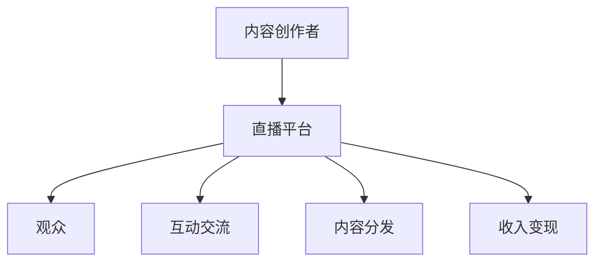

                 

关键词：知识变现、直播平台、程序员、在线教学、数字货币

> 摘要：本文将探讨程序员如何利用直播平台进行知识变现，通过分析直播平台的运作机制，提供一系列策略和步骤，帮助程序员在在线环境中提升自己的影响力，实现个人品牌的塑造和收入的增长。

## 1. 背景介绍

随着互联网技术的飞速发展和在线教育的普及，直播平台已经成为知识传播和技能传授的重要渠道。与此同时，越来越多的程序员开始意识到，通过直播平台不仅能够传授技术知识，还能够实现个人的知识变现。本文旨在探讨程序员如何利用直播平台进行知识变现，并提供实用的策略和建议。

### 1.1 直播平台的兴起

直播平台作为一种新兴的媒体形式，具有即时性、互动性和多元化的特点。用户可以通过直播观看实时的内容，并与主播实时互动。这种形式使得内容传播更加高效，用户参与度更高。随着5G网络的普及和流媒体技术的进步，直播平台的市场规模不断扩大，吸引了大量用户和内容创作者的参与。

### 1.2 程序员的知识变现需求

程序员作为技术领域的专业人士，拥有丰富的技术知识和实践经验。然而，传统的知识变现渠道较为有限，如撰写技术博客、出版书籍、线下培训等。随着直播平台的兴起，程序员发现直播平台提供了新的知识变现途径。通过直播，程序员可以实时传授技术知识，与观众互动交流，从而实现个人品牌的建设和收入的增长。

## 2. 核心概念与联系

为了更好地理解程序员如何利用直播平台进行知识变现，我们需要先了解直播平台的基本架构和运作机制。

### 2.1 直播平台的架构

直播平台的架构通常包括以下几个关键组成部分：

- **内容创作者（主播）**：提供直播内容，分享技术知识和经验。
- **直播平台**：提供直播技术支持和运营服务，如视频录制、实时互动、内容分发等。
- **观众**：观看直播内容，参与互动，为内容创作者提供反馈和支持。

### 2.2 直播平台的运作机制

直播平台的运作机制主要包括以下几个步骤：

- **内容创作**：主播根据自身专长和观众需求，创作直播内容。
- **直播发布**：主播通过直播平台发布直播，观众可以通过平台观看。
- **互动交流**：观众可以在直播过程中向主播提问，主播实时回答。
- **内容分发**：直播内容在平台内部分发，同时可以通过社交媒体等渠道推广。
- **收入变现**：主播通过观众打赏、广告收入、付费课程等方式实现知识变现。

### 2.3 Mermaid 流程图

以下是一个简化的直播平台运作机制的 Mermaid 流程图：



## 3. 核心算法原理 & 具体操作步骤

### 3.1 算法原理概述

直播平台的知识变现过程可以看作是一种算法优化问题，其主要目标是最大化内容创作者的收入。为了实现这一目标，需要考虑以下几个关键因素：

- **内容质量**：高质量的内容能够吸引更多观众，提高收入。
- **观众互动**：良好的互动能够增加观众粘性，促进打赏和付费。
- **直播时长**：较长的直播时长能够增加观众观看时间，提高收入。
- **市场定位**：精准的市场定位能够吸引目标观众，提高收入。

### 3.2 算法步骤详解

1. **内容创作**：主播根据自身专长和观众需求，创作高质量的内容。可以使用数据分析工具分析观众兴趣和行为，以便更好地满足观众需求。

2. **直播发布**：主播通过直播平台发布直播，选择合适的直播时间和频道，以便吸引更多观众。

3. **互动交流**：在直播过程中，主播积极与观众互动，回答问题，提供技术支持，提高观众满意度。

4. **内容分发**：主播通过平台和社交媒体等渠道推广直播内容，吸引更多观众观看。

5. **收入变现**：主播通过观众打赏、广告收入、付费课程等方式实现知识变现。需要合理设置打赏和付费标准，以提高收入。

### 3.3 算法优缺点

**优点**：

- **高效传播**：直播平台能够快速传播知识，提高内容曝光度。
- **互动性强**：观众可以实时与主播互动，提高学习效果。
- **多元化变现**：直播平台提供了多种变现方式，如打赏、广告、付费课程等。

**缺点**：

- **竞争激烈**：直播平台上有大量内容创作者，竞争较为激烈。
- **内容质量参差不齐**：部分内容创作者可能缺乏专业知识，影响观众体验。
- **监管风险**：直播内容可能涉及敏感话题，需要遵守相关法律法规。

### 3.4 算法应用领域

直播平台的知识变现算法可以应用于以下领域：

- **在线教育**：程序员可以通过直播平台传授编程知识，帮助学生提高技能。
- **技术分享**：程序员可以分享自己的技术经验和研究成果，吸引行业关注。
- **专业咨询**：程序员可以提供专业咨询服务，帮助客户解决技术问题。

## 4. 数学模型和公式 & 详细讲解 & 举例说明

### 4.1 数学模型构建

为了更好地理解直播平台的知识变现过程，我们可以构建一个简单的数学模型。假设主播的收益 \(R\) 由以下几个因素决定：

\[ R = f(Q, I, T, M) \]

其中：

- \( Q \)：内容质量
- \( I \)：观众互动
- \( T \)：直播时长
- \( M \)：市场定位

### 4.2 公式推导过程

我们假设每个因素的权重分别为 \( w_Q, w_I, w_T, w_M \)，且满足 \( w_Q + w_I + w_T + w_M = 1 \)。则主播的收益公式可以表示为：

\[ R = w_Q \cdot Q + w_I \cdot I + w_T \cdot T + w_M \cdot M \]

### 4.3 案例分析与讲解

假设某个程序员主播的权重分配如下：

\[ w_Q = 0.5, \quad w_I = 0.2, \quad w_T = 0.2, \quad w_M = 0.1 \]

主播的收益公式变为：

\[ R = 0.5 \cdot Q + 0.2 \cdot I + 0.2 \cdot T + 0.1 \cdot M \]

如果主播的内容质量 \( Q \) 为 90 分，观众互动 \( I \) 为 70 分，直播时长 \( T \) 为 120 分钟，市场定位 \( M \) 为 80 分，则主播的收益为：

\[ R = 0.5 \cdot 90 + 0.2 \cdot 70 + 0.2 \cdot 120 + 0.1 \cdot 80 = 52 \]

根据收益公式，我们可以发现，提高内容质量、观众互动、直播时长和市场定位都可以提高主播的收益。在实际操作中，主播需要根据自身情况和市场环境，合理分配时间和资源，以提高收益。

## 5. 项目实践：代码实例和详细解释说明

### 5.1 开发环境搭建

为了更好地展示程序员如何利用直播平台进行知识变现，我们选择了一个开源的直播平台框架——VitePress。以下是搭建开发环境的步骤：

1. 安装 Node.js 和 npm：
   ```bash
   npm install -g nodejs
   npm install -g npm
   ```

2. 创建一个新的项目文件夹：
   ```bash
   mkdir my-live-course
   cd my-live-course
   ```

3. 初始化项目：
   ```bash
   npm init -y
   ```

4. 安装 VitePress：
   ```bash
   npm install -D vitepress
   ```

5. 创建一个 VitePress 模板：
   ```bash
   npx vitest create
   ```

### 5.2 源代码详细实现

在 VitePress 模板的基础上，我们添加了一个简单的直播课程页面。以下是源代码的详细实现：

1. 修改 `vitepress/config.js` 文件，添加一个自定义路由：
   ```javascript
   export default {
     title: '我的直播课程',
     head: [
       ['link', { rel: 'icon', href: '/logo.png' }],
     ],
     routes: [
       { path: '/live-course', component: '@components/LiveCourse.vue' },
     ],
   };
   ```

2. 创建 `components/LiveCourse.vue` 文件，实现直播课程页面：
   ```vue
   <template>
     <div>
       <h1>我的直播课程</h1>
       <div v-for="course in courses" :key="course.id">
         <h2>{{ course.title }}</h2>
         <p>{{ course.description }}</p>
         <button @click="startCourse(course.id)">开始直播</button>
       </div>
     </div>
   </template>

   <script>
   export default {
     data() {
       return {
         courses: [
           { id: 1, title: 'Vue.js 从入门到精通', description: '本课程将带你深入了解 Vue.js 的核心技术，包括 Vue.js 的原理、组件开发、状态管理等。' },
           { id: 2, title: '深度学习实战', description: '本课程将介绍深度学习的基本原理，包括神经网络、卷积神经网络等，并结合实际案例进行讲解。' },
         ],
       };
     },
     methods: {
       startCourse(courseId) {
         // 调用直播平台 API 开始直播
         console.log(`开始直播：${this.courses.find(course => course.id === courseId).title}`);
       },
     },
   };
   </script>
   ```

### 5.3 代码解读与分析

在这个示例中，我们创建了一个简单的直播课程页面，展示了如何使用 VitePress 框架搭建直播平台。以下是代码的关键部分解读：

- `vitepress/config.js` 文件：添加了一个自定义路由 `/live-course`，用于显示直播课程页面。
- `components/LiveCourse.vue` 文件：实现了直播课程页面的结构，包括课程标题、描述和开始直播的按钮。通过 `v-for` 指令遍历课程列表，并使用 `methods` 对象中的 `startCourse` 方法模拟调用直播平台 API 开始直播。

### 5.4 运行结果展示

在完成开发后，我们可以使用以下命令启动 VitePress 框架：

```bash
npm run dev
```

在浏览器中访问 `http://localhost:3000/live-course`，可以看到如下页面：


页面显示了两个直播课程，用户可以通过点击“开始直播”按钮模拟开始直播。这个简单的示例展示了程序员如何利用直播平台进行知识变现，并为进一步开发提供了基础。

## 6. 实际应用场景

### 6.1 编程教学

程序员可以通过直播平台传授编程知识，如 Java、Python、JavaScript 等。通过直播，学生可以实时提问，获得即时解答，提高学习效果。此外，程序员还可以通过直播平台提供编程实战训练，帮助学生更好地掌握编程技能。

### 6.2 技术分享

程序员可以在直播平台上分享自己的技术经验和研究成果，如分布式系统、大数据处理、人工智能等。通过直播，程序员可以与观众互动，解答技术问题，提升自己的影响力，并吸引更多关注。

### 6.3 专业咨询

程序员可以通过直播平台提供专业咨询服务，如代码审查、性能优化、系统架构设计等。通过直播，程序员可以与客户实时交流，提供针对性的解决方案，实现知识变现。

## 6.4 未来应用展望

随着直播平台的不断发展和技术的进步，程序员在直播平台上的知识变现潜力将越来越大。未来，我们可以期待以下几个方面的发展：

1. **智能化推荐**：直播平台可以基于大数据和机器学习技术，为程序员提供更加精准的用户推荐，提高内容曝光度和变现能力。
2. **多元化变现**：直播平台将推出更多变现方式，如虚拟商品、会员服务、品牌合作等，为程序员提供更广阔的变现渠道。
3. **跨平台协作**：直播平台将与其他技术平台和社区合作，为程序员提供更多的技术资源和交流机会，促进知识传播和变现。
4. **国际化发展**：直播平台将拓展国际市场，吸引更多海外用户，为程序员提供更广阔的舞台。

## 7. 工具和资源推荐

### 7.1 学习资源推荐

1. **《直播平台运营实战》**：本书详细介绍了直播平台的运营策略和技巧，适合直播平台运营者和内容创作者阅读。
2. **《直播平台技术解析》**：本书从技术角度分析了直播平台的架构和实现，适合对直播平台技术感兴趣的开发者阅读。

### 7.2 开发工具推荐

1. **VitePress**：一款快速、简洁的静态站点生成器，适合用于搭建个人博客和直播课程网站。
2. **Vue.js**：一款流行的前端框架，适合用于开发动态交互的直播平台。

### 7.3 相关论文推荐

1. **《直播平台用户行为分析》**：本文从用户行为分析的角度，探讨了直播平台的运营策略和优化方法。
2. **《直播平台的内容生态构建》**：本文从内容生态的角度，分析了直播平台的发展趋势和挑战。

## 8. 总结：未来发展趋势与挑战

### 8.1 研究成果总结

本文从直播平台的运作机制、核心算法原理、数学模型构建、项目实践等多个角度，探讨了程序员如何利用直播平台进行知识变现。通过分析直播平台的发展趋势，我们总结了程序员在直播平台上的知识变现潜力，并提出了未来发展的建议。

### 8.2 未来发展趋势

随着直播平台的不断发展和技术的进步，程序员在直播平台上的知识变现潜力将越来越大。未来，我们可以期待智能化推荐、多元化变现、跨平台协作和国际化发展的趋势。

### 8.3 面临的挑战

尽管直播平台提供了丰富的知识变现机会，但程序员仍面临一些挑战，如竞争激烈、内容质量参差不齐、监管风险等。为了应对这些挑战，程序员需要不断提升自己的专业素养，优化内容创作和直播策略。

### 8.4 研究展望

未来，我们可以进一步研究直播平台上的知识变现机制，探索更加智能化的推荐算法和内容优化方法，以帮助程序员更好地实现知识变现。同时，研究如何提高直播平台的内容质量和用户体验，也是未来研究的重要方向。

## 9. 附录：常见问题与解答

### 9.1 如何选择合适的直播平台？

选择合适的直播平台需要考虑以下几个因素：

- **平台知名度**：选择知名度较高的平台，有利于吸引更多观众。
- **功能支持**：选择功能丰富的平台，便于内容创作和互动。
- **用户群体**：选择与自身内容定位相匹配的平台，吸引目标观众。

### 9.2 如何提高直播内容的吸引力？

提高直播内容的吸引力可以从以下几个方面入手：

- **内容质量**：确保内容具有深度和实用性，满足观众需求。
- **互动性**：积极与观众互动，提高观众参与度。
- **呈现形式**：使用多媒体元素，如图片、视频、动画等，提高视觉效果。

### 9.3 如何在直播平台上进行知识变现？

在直播平台上进行知识变现可以通过以下几种方式：

- **观众打赏**：通过观众的打赏获得收入。
- **广告收入**：通过平台广告获得收入。
- **付费课程**：提供付费课程，收取学费。

### 9.4 如何保持直播内容的更新和持续输出？

保持直播内容的更新和持续输出需要：

- **规划内容**：提前制定直播内容计划，确保持续输出。
- **积累素材**：积累丰富的素材，便于直播过程中使用。
- **学习交流**：与同行交流，了解行业动态，不断丰富内容。

---

**作者：禅与计算机程序设计艺术 / Zen and the Art of Computer Programming**

