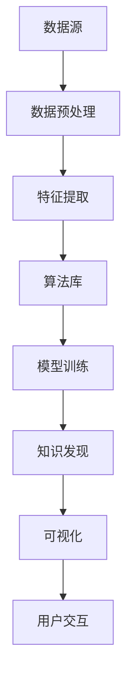

                 

 **关键词**: 程序员，知识发现引擎，学习成果，算法，数学模型，项目实践，工具推荐，未来展望。

**摘要**: 本文将深入探讨程序员如何利用知识发现引擎来提高学习成果。我们将详细介绍知识发现引擎的基本概念、核心算法原理、数学模型，并通过实际项目实践来展示其应用。此外，文章还将对知识发现引擎在程序员学习中的实际应用场景进行探讨，并展望其未来发展趋势和挑战。

## 1. 背景介绍

在信息技术迅猛发展的时代，程序员面临着不断更新和扩展知识体系的挑战。为了提高学习效率，程序员需要掌握有效的学习方法和技术工具。知识发现引擎作为一种强大的数据处理和分析工具，为程序员提供了新的学习和研究途径。本文旨在帮助程序员了解和利用知识发现引擎，以提升学习成果。

### 1.1 知识发现引擎的概念

知识发现引擎（Knowledge Discovery Engine，简称KDE）是一种能够从大量数据中自动发现有用模式和知识的人工智能系统。它通过算法和模型分析数据，提取出潜在的有用信息，帮助用户理解数据、发现规律、预测趋势。

### 1.2 知识发现引擎在程序员学习中的重要性

对于程序员来说，知识发现引擎具有以下重要性：

- **提高学习效率**: 知识发现引擎能够快速处理和分析大量数据，帮助程序员从海量信息中提取关键知识点。
- **促进知识整合**: 知识发现引擎能够发现不同知识点之间的关联，帮助程序员构建系统的知识体系。
- **支持创新研究**: 知识发现引擎为程序员提供了新的研究工具，有助于发现数据中的潜在规律和趋势，激发创新思维。

## 2. 核心概念与联系

为了更好地理解知识发现引擎，我们需要了解其核心概念和基本架构。以下是一个Mermaid流程图，用于展示知识发现引擎的组成部分及其相互关系。



### 2.1 数据源

数据源是知识发现引擎的基础，它可以是结构化数据（如数据库）、半结构化数据（如XML、JSON）或非结构化数据（如文本、图像、视频）。数据源的多样性使得知识发现引擎能够适应不同的应用场景。

### 2.2 数据预处理

数据预处理是知识发现引擎的关键步骤之一。它包括数据清洗、数据集成、数据转换等操作，目的是将原始数据转换为适合分析的形式。

### 2.3 特征提取

特征提取是从数据中提取出有代表性的特征，以便于后续的算法分析和模型训练。特征提取的质量直接影响到知识发现引擎的性能。

### 2.4 算法库

算法库是知识发现引擎的核心组件，包含各种数据挖掘算法和机器学习模型。算法库的选择和组合取决于具体的应用需求。

### 2.5 模型训练

模型训练是通过训练数据来调整算法模型参数，使其能够更好地拟合数据。训练过程的优劣直接影响知识发现引擎的准确性。

### 2.6 知识发现

知识发现是从训练好的模型中提取出潜在的有用信息，如模式、关联规则、聚类结果等。知识发现过程是知识发现引擎的核心功能。

### 2.7 可视化

可视化是将知识发现结果以图形化的形式呈现给用户，帮助用户更好地理解和分析数据。可视化技术是知识发现引擎的重要辅助手段。

### 2.8 用户交互

用户交互是知识发现引擎与用户之间的桥梁，用户可以通过用户界面与知识发现引擎进行交互，调整参数、查看结果等。

## 3. 核心算法原理 & 具体操作步骤

### 3.1 算法原理概述

知识发现引擎的核心算法包括聚类、关联规则挖掘、分类、预测等。以下是这些算法的基本原理：

- **聚类**: 将相似的数据点归为同一类，以发现数据中的隐含结构。
- **关联规则挖掘**: 发现数据项之间的相关性，如购物篮分析。
- **分类**: 根据已知数据对新数据进行分类，用于数据分类和预测。
- **预测**: 利用历史数据对未来数据进行预测，如股票价格预测、销量预测等。

### 3.2 算法步骤详解

以下是知识发现引擎的具体操作步骤：

1. **数据预处理**: 对原始数据进行清洗、去噪、转换等操作，确保数据质量。
2. **特征提取**: 从预处理后的数据中提取出有代表性的特征，为后续算法分析做准备。
3. **算法选择**: 根据应用需求选择合适的算法，如聚类、关联规则挖掘等。
4. **模型训练**: 使用训练数据对算法模型进行训练，调整模型参数，使其更好地拟合数据。
5. **知识发现**: 从训练好的模型中提取出潜在的有用信息，如模式、关联规则、分类结果等。
6. **可视化**: 将知识发现结果以图形化的形式呈现给用户，帮助用户更好地理解和分析数据。
7. **用户交互**: 允许用户调整参数、查看结果，与知识发现引擎进行交互。

### 3.3 算法优缺点

以下是几种常见算法的优缺点：

- **聚类算法**：
  - **优点**: 简单易懂，能够发现数据中的隐含结构。
  - **缺点**: 可能会陷入局部最优，难以处理高维数据。
- **关联规则挖掘**：
  - **优点**: 能够发现数据项之间的相关性，适用于购物篮分析等。
  - **缺点**: 计算量大，可能存在冗余规则。
- **分类算法**：
  - **优点**: 能够对新数据进行分类和预测，适用于数据分类和预测任务。
  - **缺点**: 需要大量训练数据，模型复杂度较高。
- **预测算法**：
  - **优点**: 能够对未来数据进行预测，适用于股票价格预测、销量预测等。
  - **缺点**: 需要大量历史数据，预测精度受限于模型和算法。

### 3.4 算法应用领域

知识发现引擎在多个领域都有广泛应用，以下是一些常见应用领域：

- **金融**: 股票价格预测、风险控制、信用评分等。
- **医疗**: 疾病诊断、药物研发、个性化治疗等。
- **电商**: 购物篮分析、用户行为预测、推荐系统等。
- **社交网络**: 社交关系挖掘、舆情分析、信息传播预测等。
- **交通**: 交通事故预测、交通流量预测、智能交通管理等。

## 4. 数学模型和公式 & 详细讲解 & 举例说明

### 4.1 数学模型构建

知识发现引擎涉及多种数学模型，以下是一个简单的聚类模型的构建过程：

1. **距离度量**: 选择合适的距离度量方法，如欧几里得距离、曼哈顿距离等。
2. **聚类中心**: 确定初始聚类中心，如随机选择、K-means++算法等。
3. **聚类算法**: 选择聚类算法，如K-means、层次聚类等。

### 4.2 公式推导过程

以下是一个简单的K-means算法的公式推导过程：

假设我们有一个数据集D，其中每个数据点表示为$$x_i \in \mathbb{R}^n$$。我们定义一个聚类中心为$$\mu_k \in \mathbb{R}^n$$，其中$$k=1,2,...,K$$表示聚类个数。K-means算法的目标是最小化每个数据点到其聚类中心的距离之和。

$$
\min \sum_{i=1}^m \sum_{k=1}^K d(x_i, \mu_k)
$$

其中，$$d(x_i, \mu_k)$$表示数据点$$x_i$$到聚类中心$$\mu_k$$的距离。

### 4.3 案例分析与讲解

假设我们有一个包含100个数据点的数据集，我们希望将其分为10个聚类。我们首先随机选择10个初始聚类中心，然后计算每个数据点到聚类中心的距离，将数据点分配到最近的聚类中心。接着，我们重新计算新的聚类中心，并重复上述过程，直到聚类中心不再发生显著变化。

在实际应用中，我们可以使用如Python的scikit-learn库来实现K-means算法，以下是一个简单的代码示例：

```python
from sklearn.cluster import KMeans
import numpy as np

# 创建数据集
data = np.random.rand(100, 2)

# 初始化KMeans模型
kmeans = KMeans(n_clusters=10, random_state=0)

# 训练模型
kmeans.fit(data)

# 获取聚类中心
centers = kmeans.cluster_centers_

# 预测聚类结果
predictions = kmeans.predict(data)

# 打印结果
print("聚类中心：", centers)
print("聚类结果：", predictions)
```

## 5. 项目实践：代码实例和详细解释说明

### 5.1 开发环境搭建

为了实现知识发现引擎，我们需要搭建一个开发环境。以下是所需的软件和工具：

- Python 3.x
- Jupyter Notebook
- Scikit-learn
- Matplotlib

安装步骤：

1. 安装Python 3.x：从官方网站下载并安装Python 3.x。
2. 安装Jupyter Notebook：在终端运行`pip install notebook`。
3. 安装Scikit-learn：在终端运行`pip install scikit-learn`。
4. 安装Matplotlib：在终端运行`pip install matplotlib`。

### 5.2 源代码详细实现

以下是使用Scikit-learn实现K-means算法的代码示例：

```python
import matplotlib.pyplot as plt
from sklearn.cluster import KMeans
import numpy as np

# 创建数据集
data = np.random.rand(100, 2)

# 初始化KMeans模型
kmeans = KMeans(n_clusters=10, random_state=0)

# 训练模型
kmeans.fit(data)

# 获取聚类中心
centers = kmeans.cluster_centers_

# 预测聚类结果
predictions = kmeans.predict(data)

# 绘制聚类结果
plt.scatter(data[:, 0], data[:, 1], c=predictions, cmap='viridis')
plt.scatter(centers[:, 0], centers[:, 1], c='red', s=200, alpha=0.5)
plt.show()
```

### 5.3 代码解读与分析

- **数据集创建**：我们使用numpy的`random.rand`函数创建一个包含100个数据点的二维数组。
- **初始化KMeans模型**：我们使用Scikit-learn的`KMeans`类创建KMeans模型，并设置聚类个数为10，使用随机种子0以保证结果的可重复性。
- **训练模型**：我们使用`fit`方法训练模型，模型将自动计算聚类中心和每个数据点的聚类结果。
- **获取聚类中心**：我们使用`cluster_centers_`属性获取聚类中心。
- **预测聚类结果**：我们使用`predict`方法对数据集进行聚类预测。
- **绘制聚类结果**：我们使用Matplotlib的`scatter`函数绘制聚类结果，并用不同的颜色表示不同的聚类。

## 6. 实际应用场景

### 6.1 金融领域

在金融领域，知识发现引擎可以用于股票价格预测、风险控制、信用评分等任务。例如，我们可以使用K-means算法对历史股票价格数据进行聚类，发现股票价格的分布规律，从而预测未来的价格走势。

### 6.2 医疗领域

在医疗领域，知识发现引擎可以用于疾病诊断、药物研发、个性化治疗等任务。例如，我们可以使用关联规则挖掘算法分析患者病历数据，发现不同疾病之间的关联，从而指导临床决策。

### 6.3 电商领域

在电商领域，知识发现引擎可以用于购物篮分析、用户行为预测、推荐系统等任务。例如，我们可以使用K-means算法对用户购买历史数据进行聚类，发现用户的购买偏好，从而为用户推荐合适的商品。

### 6.4 社交网络领域

在社交网络领域，知识发现引擎可以用于社交关系挖掘、舆情分析、信息传播预测等任务。例如，我们可以使用分类算法分析用户在社交媒体上的发言，发现用户的兴趣偏好，从而进行精准推送。

### 6.5 交通领域

在交通领域，知识发现引擎可以用于交通事故预测、交通流量预测、智能交通管理等任务。例如，我们可以使用预测算法分析历史交通数据，预测未来的交通事故发生地点和时段，从而提前采取措施进行预防。

## 7. 工具和资源推荐

### 7.1 学习资源推荐

- 《数据挖掘：概念与技术》
- 《机器学习实战》
- 《Python数据科学手册》
- Coursera的《机器学习》课程

### 7.2 开发工具推荐

- Jupyter Notebook
- PyCharm
- VS Code

### 7.3 相关论文推荐

- "K-means clustering: A review"
- "Association Rule Learning"
- "A Survey on Deep Learning for Text Classification"

## 8. 总结：未来发展趋势与挑战

### 8.1 研究成果总结

知识发现引擎在多个领域取得了显著成果，如金融、医疗、电商、社交网络和交通等。通过聚类、关联规则挖掘、分类和预测等算法，知识发现引擎为程序员提供了强大的数据处理和分析工具。

### 8.2 未来发展趋势

- **算法优化**: 随着数据量的不断增长，算法的优化和改进将成为研究的重点，如分布式计算、并行处理等。
- **跨领域应用**: 知识发现引擎将在更多领域得到应用，如环境监测、智能城市等。
- **人机交互**: 知识发现引擎将更加智能化，与用户进行更自然的交互。

### 8.3 面临的挑战

- **数据隐私**: 在处理和分析大量数据时，如何保护用户隐私成为一个重要挑战。
- **算法公平性**: 算法的公平性是一个值得关注的问题，特别是在金融、医疗等领域。
- **计算资源**: 随着数据量的增长，计算资源的需求也将不断增加，如何高效利用计算资源成为关键。

### 8.4 研究展望

知识发现引擎在未来的发展中将继续发挥重要作用，为程序员提供更强大的数据处理和分析工具。同时，我们也需要关注数据隐私、算法公平性和计算资源等挑战，推动知识发现引擎在各个领域的深入应用。

## 9. 附录：常见问题与解答

### 9.1 什么是知识发现引擎？

知识发现引擎是一种能够从大量数据中自动发现有用模式和知识的人工智能系统，它通过算法和模型分析数据，提取出潜在的有用信息。

### 9.2 知识发现引擎有哪些应用领域？

知识发现引擎在金融、医疗、电商、社交网络和交通等领域都有广泛应用，如股票价格预测、疾病诊断、购物篮分析、社交关系挖掘等。

### 9.3 如何选择合适的算法？

选择合适的算法取决于具体的应用需求和数据类型。例如，聚类算法适用于发现数据中的隐含结构，关联规则挖掘适用于发现数据项之间的相关性。

### 9.4 如何优化知识发现引擎的性能？

优化知识发现引擎的性能可以通过以下方法实现：

- 选择合适的算法和模型。
- 优化数据预处理和特征提取过程。
- 调整算法参数，如聚类个数、阈值等。
- 使用分布式计算和并行处理技术。

----------------------------------------------------------------

### 结束语

本文详细介绍了程序员如何利用知识发现引擎提高学习成果。通过了解知识发现引擎的基本概念、核心算法原理、数学模型，以及实际项目实践，程序员可以更好地利用这一工具，提升学习效率和研究能力。未来，知识发现引擎将在更多领域发挥重要作用，为程序员提供强大的支持。作者：禅与计算机程序设计艺术 / Zen and the Art of Computer Programming。

