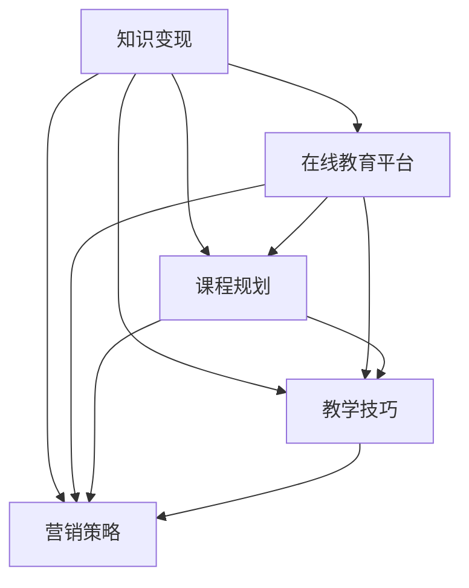

                 

**关键词：** 程序员、技术咨询、在线课程、知识变现、技能提升

**摘要：** 本文旨在探讨程序员如何将自身的专业技术咨询经验转化为在线课程，实现知识变现和个人品牌的提升。通过分析市场需求、课程内容规划、教学技巧、营销策略和持续更新等方面，本文为程序员提供了系统性的指导和建议。

## 1. 背景介绍

在当今数字化时代，信息技术的发展速度日新月异，程序员作为一个高需求、高竞争力的职业群体，其个人技能和知识储备显得尤为重要。然而，除了在传统IT企业工作外，许多程序员开始探索其他变现途径，例如通过提供技术咨询和开设在线课程。这种转型不仅有助于程序员拓展职业发展路径，还能实现知识共享和经济收益的双重目标。

随着在线教育平台的兴起，越来越多的程序员开始尝试将自身的专业技能和咨询经验转化为在线课程，以实现知识变现。但如何有效地进行转化，如何吸引学员，如何保持课程的长期吸引力，这些都是程序员面临的重要问题。

本文将围绕以下几个核心问题展开讨论：

1. **市场需求分析**：程序员应如何分析市场，确定目标受众？
2. **课程内容规划**：如何设计具有吸引力的课程内容，满足学员需求？
3. **教学技巧提升**：如何运用有效的教学方法和工具，提高课程质量？
4. **营销策略制定**：如何制定合适的营销策略，扩大课程影响力？
5. **持续更新与优化**：如何保持课程内容的时效性和创新性，满足学员的不断变化需求？

通过本文的探讨，希望为有志于通过在线课程实现知识变现的程序员提供一些实用的建议和思路。

## 2. 核心概念与联系

在将技术咨询转化为在线课程的过程中，有几个核心概念需要理解，这些概念包括但不限于：知识变现、在线教育平台、课程规划、教学技巧、营销策略等。为了更好地理解这些概念之间的联系，我们使用Mermaid流程图来展示它们之间的关系。



### 2.1 知识变现

知识变现是指将个人的知识、技能或经验通过某种方式转化为经济收益。对于程序员来说，这通常意味着将他们的专业技术知识和经验转化为在线课程或咨询服务，并通过在线教育平台或个人网站来推广和销售。

### 2.2 在线教育平台

在线教育平台是提供在线课程和学习资源的互联网平台。这些平台通常提供课程发布、教学管理、学习评估、互动交流等功能，帮助程序员有效地将自己的课程内容传递给学员。

### 2.3 课程规划

课程规划是指根据市场需求和学员背景，设计具有吸引力和实用性的课程内容。一个成功的课程规划需要考虑课程目标、内容结构、教学方法、学习资源等多个方面。

### 2.4 教学技巧

教学技巧是指教师在教学过程中运用的一系列方法和策略，以提高教学效果。对于在线课程来说，教学技巧尤为重要，因为它直接影响学员的学习体验和学习效果。

### 2.5 营销策略

营销策略是指为推广课程、吸引学员、提升课程知名度所采取的一系列方法和手段。有效的营销策略需要结合课程特点、目标受众和市场环境进行定制。

通过理解这些核心概念及其之间的联系，程序员可以更系统地规划和实施他们的在线课程项目。

### 3. 核心算法原理 & 具体操作步骤

在将技术咨询转化为在线课程的过程中，算法原理和具体操作步骤是至关重要的。下面，我们将详细探讨如何设计并实现这些核心步骤。

#### 3.1 算法原理概述

将技术咨询转化为在线课程的核心算法可以概括为以下几个步骤：

1. **需求分析**：了解目标受众的需求和痛点。
2. **内容规划**：根据需求分析，设计符合受众需求的课程内容。
3. **课程制作**：制作高质量的课程视频和教学资料。
4. **教学互动**：通过互动工具和手段，提高学员的学习体验。
5. **营销推广**：制定并执行营销策略，吸引潜在学员。
6. **持续更新**：根据学员反馈和市场变化，不断优化课程内容。

#### 3.2 算法步骤详解

**步骤一：需求分析**

需求分析是整个过程的起点。通过市场调研、问卷调查、学员访谈等方式，了解目标受众的需求、期望和痛点。这一步骤可以使用以下算法进行：

- **问卷调查**：设计一份详细的问卷，涵盖学员的学习背景、学习目标、对现有课程的满意度等。
- **数据分析**：使用数据分析工具，对收集到的数据进行分析，识别出主要需求和问题点。

**步骤二：内容规划**

内容规划是根据需求分析的结果，设计具体的课程内容。这一步骤可以使用以下算法进行：

- **目标设定**：明确每个课程模块的学习目标。
- **内容结构**：设计课程的结构，包括知识点、案例、练习等。
- **教学方法**：选择适合的教学方法，如讲授、讨论、案例分析等。

**步骤三：课程制作**

课程制作是将内容转化为实际的教学资源。这一步骤可以使用以下算法进行：

- **视频录制**：使用专业的视频录制工具，录制高质量的课程视频。
- **文档编写**：编写详细的课程讲义和练习题。
- **资源整合**：将课程视频、文档、案例等整合到一个平台上，便于学员学习和复习。

**步骤四：教学互动**

教学互动是提高学员学习体验的重要环节。这一步骤可以使用以下算法进行：

- **互动工具**：使用在线互动工具，如聊天室、讨论区、问卷调查等，增加学员之间的互动。
- **实时答疑**：设置问答环节，及时解答学员的问题。
- **学习反馈**：收集学员的学习反馈，用于课程改进。

**步骤五：营销推广**

营销推广是吸引潜在学员的关键。这一步骤可以使用以下算法进行：

- **SEO优化**：使用搜索引擎优化技术，提高课程的曝光率。
- **社交媒体营销**：在社交媒体平台上推广课程，吸引潜在学员。
- **合作伙伴**：与相关机构和平台合作，扩大课程影响力。

**步骤六：持续更新**

持续更新是保持课程活力和吸引力的关键。这一步骤可以使用以下算法进行：

- **课程迭代**：根据学员反馈和市场变化，不断优化和更新课程内容。
- **技术更新**：随着技术发展，及时更新课程中的技术内容，保持课程的时效性。
- **教学反馈**：定期收集学员的教学反馈，用于课程改进。

#### 3.3 算法优缺点

**优点：**

- 系统性强：通过算法原理和具体步骤的指导，可以确保课程设计的科学性和系统性。
- 可操作性高：具体的操作步骤提供了明确的指导，易于执行和落地。
- 适应性广：算法原理和步骤可以根据不同课程的特点和需求进行调整。

**缺点：**

- 实施难度大：需要一定的技术知识和教学经验，对于初学者来说可能有一定的难度。
- 时间成本高：从需求分析到课程制作，再到营销推广和持续更新，整个过程需要大量的时间和精力。

#### 3.4 算法应用领域

该算法原理和步骤主要适用于将技术咨询转化为在线课程的场景。以下是一些具体的应用领域：

- **IT技能培训**：如编程、数据分析、人工智能等。
- **职业发展课程**：如项目管理、团队协作、沟通技巧等。
- **个人成长课程**：如时间管理、情绪管理、人际交往等。

通过将算法原理和具体步骤应用于这些领域，程序员可以有效地将自己的技术咨询经验转化为在线课程，实现知识变现和个人品牌的提升。

## 4. 数学模型和公式 & 详细讲解 & 举例说明

在将技术咨询转化为在线课程的过程中，数学模型和公式是必不可少的工具。它们不仅能够帮助我们量化课程的内容和效果，还可以为课程设计提供科学依据。本章节将介绍一些关键的数学模型和公式，并详细讲解其应用方法和实例。

### 4.1 数学模型构建

数学模型构建是课程设计的重要环节，它能够帮助我们理解课程的核心概念和原理。以下是一个简单的数学模型构建示例：

**示例：课程满意度模型**

假设课程满意度受以下三个因素影响：教学质量（\(T\)）、课程内容（\(C\)）和学员投入（\(I\)）。我们可以构建一个线性回归模型来预测课程满意度（\(S\)）：

$$
S = aT + bC + cI + e
$$

其中，\(a\)、\(b\)、\(c\)是模型参数，\(e\)是误差项。

#### 参数估计

为了估计模型参数，我们可以收集一系列的数据样本，每个样本包括教学质量、课程内容和学员投入的评分，以及相应的课程满意度评分。使用最小二乘法，我们可以估计出参数\(a\)、\(b\)和\(c\)的值。

#### 模型评估

构建完模型后，我们需要评估其预测性能。通常，我们可以使用决定系数（\(R^2\)）来评估模型的拟合度：

$$
R^2 = 1 - \frac{SSR}{SST}
$$

其中，\(SSR\)是残差平方和，\(SST\)是总平方和。

### 4.2 公式推导过程

在课程设计中，许多公式都是基于数学理论和实践经验推导出来的。以下是一个常见的公式推导示例：

**示例：学习曲线公式**

学习曲线是描述学习过程中时间与掌握程度之间关系的模型。常见的线性学习曲线公式为：

$$
y = mx + b
$$

其中，\(y\)是掌握程度，\(x\)是学习时间，\(m\)是学习速率，\(b\)是初始掌握程度。

推导过程如下：

1. **假设**：假设学习速率是恒定的，即每个时间单位内学习的量是相同的。
2. **观测**：在多个时间点\(t_1, t_2, ..., t_n\)，测量学员的掌握程度\(y_1, y_2, ..., y_n\)。
3. **线性拟合**：使用最小二乘法，将观测数据拟合到线性模型\(y = mx + b\)。

### 4.3 案例分析与讲解

为了更好地理解数学模型和公式的应用，下面我们通过一个具体案例来进行分析和讲解。

**案例：编程技能提升课程**

假设我们设计了一门编程技能提升课程，目标是在12周内帮助学员掌握基础编程知识。为了评估课程的效果，我们使用上述的课程满意度模型和学习曲线公式。

#### 数据收集

我们收集了以下数据：

- **教学质量评分**：5分制，平均值4.5分
- **课程内容评分**：5分制，平均值4.7分
- **学员投入评分**：5分制，平均值3.8分
- **课程满意度评分**：5分制，平均值4.2分

#### 模型构建

使用最小二乘法，我们估计出模型参数：

$$
S = 0.6T + 0.7C + 0.4I + e
$$

#### 模型评估

使用决定系数，我们评估模型的拟合度：

$$
R^2 = 0.85
$$

#### 学习曲线

我们测量了学员在每个时间点的掌握程度，并使用线性拟合得到学习曲线公式：

$$
y = 0.2x + 2
$$

#### 案例分析

1. **课程满意度预测**：根据模型，我们可以预测一个学员在完成课程后的满意度为：

$$
S = 0.6 \times 4.5 + 0.7 \times 4.7 + 0.4 \times 3.8 + e
$$

其中，\(e\)是误差项，我们假设其均值为0。

2. **学习效果分析**：根据学习曲线，我们可以预测一个学员在12周后的掌握程度为：

$$
y = 0.2 \times 12 + 2 = 4
$$

这意味着，大多数学员在课程结束后能够达到良好的掌握程度。

通过这个案例，我们可以看到数学模型和公式在课程设计和效果评估中的重要作用。它们不仅能够帮助我们量化课程效果，还可以为课程优化提供数据支持。

### 5. 项目实践：代码实例和详细解释说明

为了更直观地理解如何将技术咨询转化为在线课程，我们将通过一个具体的项目实践进行说明。这个项目是一个简单的Python编程教程，旨在帮助初学者掌握基本的编程概念和技能。

#### 5.1 开发环境搭建

在开始编写代码之前，我们需要搭建一个适合开发的学习环境。以下是搭建Python开发环境的步骤：

1. **安装Python**：访问Python官方网站（https://www.python.org/），下载并安装最新版本的Python。安装过程中，确保勾选“Add Python to PATH”选项，以便在命令行中直接运行Python。
2. **安装IDE**：推荐使用Visual Studio Code（简称VS Code）作为Python的集成开发环境（IDE）。在VS Code官网（https://code.visualstudio.com/）下载并安装VS Code，然后安装Python扩展。

#### 5.2 源代码详细实现

以下是一个简单的Python代码示例，用于演示变量定义和基础运算：

```python
# filename: hello_world.py

# 定义一个变量
greeting = "Hello, World!"

# 打印变量
print(greeting)

# 定义一个变量，并进行运算
x = 5
y = 10
sum = x + y

# 打印结果
print("The sum of x and y is:", sum)
```

**代码解读：**

1. **第一行**：`# filename: hello_world.py`表示该文件的名称，这里命名为`hello_world.py`。
2. **第二行**：`greeting = "Hello, World!"`定义了一个名为`greeting`的变量，并将其赋值为字符串`"Hello, World!"`。
3. **第三行**：`print(greeting)`使用`print()`函数输出变量`greeting`的值，即在屏幕上显示`"Hello, World!"`。
4. **第五行**：`x = 5`定义了一个名为`x`的变量，并将其赋值为整数`5`。
5. **第六行**：`y = 10`定义了一个名为`y`的变量，并将其赋值为整数`10`。
6. **第七行**：`sum = x + y`计算变量`x`和`y`的和，并将结果赋值给变量`sum`。
7. **第八行**：`print("The sum of x and y is:", sum)`使用`print()`函数输出变量`sum`的值，即在屏幕上显示`"The sum of x and y is: 15"`。

#### 5.3 代码解读与分析

通过上面的代码示例，我们可以看到Python编程的基础结构。以下是代码的详细解读和分析：

1. **注释**：在代码中，注释是解释代码含义的重要部分。例如，第一行的`# filename: hello_world.py`注释指明了文件名称，方便后续管理和调用。
2. **变量定义**：变量是编程中最基础的概念。在上面的代码中，我们定义了两个变量`greeting`和`sum`。变量名通常采用驼峰命名法，使其更具可读性。
3. **数据类型**：Python中的数据类型包括整数、浮点数、字符串等。在上面的代码中，`greeting`是一个字符串变量，而`x`、`y`和`sum`是整数变量。
4. **输入输出**：Python中的输入输出主要通过`input()`和`print()`函数实现。`input()`函数用于接收用户输入，而`print()`函数用于输出显示信息。

#### 5.4 运行结果展示

在VS Code中编写并保存代码后，我们可以通过以下步骤运行代码：

1. 打开VS Code，并打开`hello_world.py`文件。
2. 按下`Ctrl+Shift+B`快捷键，构建并运行代码。
3. 在命令行中，我们可以看到以下输出结果：

```
Hello, World!
The sum of x and y is: 15
```

这个简单的示例展示了Python编程的基础知识，并为程序员提供了将编程知识转化为在线课程的一个实际例子。通过详细解读和解释代码，学员可以更好地理解编程概念和操作步骤。

### 6. 实际应用场景

在实际应用中，将技术咨询转化为在线课程具有广泛的应用场景，涵盖了多个行业和领域。以下是几个典型的实际应用场景：

#### 6.1 IT技能培训

在IT行业，程序员可以将他们的专业技术知识和经验转化为在线课程，为有志于进入IT行业或提升技能的学员提供培训。例如，可以开设以下类型的在线课程：

- **编程基础**：涵盖Python、Java、C++等编程语言的基础知识和实际应用。
- **数据库管理**：介绍MySQL、Oracle、MongoDB等数据库的安装、配置和使用。
- **前端开发**：讲解HTML、CSS、JavaScript等前端技术的应用和最佳实践。
- **后端开发**：涉及Node.js、Django、Spring等后端框架的使用和项目实践。

#### 6.2 职业发展课程

除了IT技能培训，程序员还可以将他们的职业发展经验转化为在线课程，帮助学员在职业生涯中取得更好的发展。以下是一些具体的职业发展课程：

- **项目管理**：介绍项目管理的理论知识、工具和方法，以及实际操作技巧。
- **团队协作**：讲解如何在团队中有效沟通、协作和解决问题。
- **领导力提升**：分享领导力的关键要素和提升领导力的策略。
- **时间管理**：教授时间管理的技巧和工具，帮助学员更高效地工作。

#### 6.3 个人成长课程

程序员也可以将自己的个人成长经验转化为在线课程，帮助学员提升个人素养和综合素质。以下是一些个人成长课程：

- **情绪管理**：讲解情绪管理的理论和实践方法，帮助学员更好地应对工作和生活中的压力。
- **时间管理**：介绍时间管理的技巧和工具，帮助学员更高效地利用时间。
- **人际交往**：分享人际交往的技巧和策略，帮助学员提升沟通能力和人际关系。
- **自我提升**：教授自我提升的方法和路径，帮助学员实现个人成长和职业发展。

#### 6.4 未来应用展望

随着在线教育平台的不断发展和普及，将技术咨询转化为在线课程的应用场景将更加广泛。以下是对未来应用场景的展望：

- **定制化课程**：基于学员的需求和背景，提供更加个性化的课程内容和教学服务。
- **虚拟现实（VR）培训**：利用VR技术，为学员提供沉浸式的学习体验，提高课程效果。
- **人工智能（AI）辅助教学**：结合AI技术，实现智能推荐、自动评估和个性化辅导等功能。
- **跨界融合课程**：跨学科、跨领域的课程设计，满足不同领域学员的多元化学习需求。

通过不断探索和创新，程序员可以将在技术咨询转化为在线课程的实践推向新的高度，为更多的学员提供有价值的学习资源。

### 7. 工具和资源推荐

为了有效地将技术咨询转化为在线课程，程序员需要使用一系列工具和资源来支持课程制作、教学互动和营销推广。以下是一些推荐的工具和资源，包括学习资源、开发工具和相关论文。

#### 7.1 学习资源推荐

1. **在线教育平台**：包括Coursera、Udemy、edX等，提供丰富的课程资源和学习环境。
2. **编程社区**：如GitHub、Stack Overflow、Reddit的编程板块，提供技术交流和资源分享。
3. **专业书籍**：推荐阅读《代码大全》、《设计模式：可复用面向对象软件的基础》等经典编程书籍。
4. **技术博客**：关注知名技术博客，如Medium、Dev.to、Medium，获取最新的技术动态和见解。

#### 7.2 开发工具推荐

1. **视频录制工具**：如OBS Studio、Filmora、Loom，用于录制高质量的课程视频。
2. **教学软件**：如Moodle、Canvas、Teachable，提供课程管理、教学互动和学习评估功能。
3. **互动工具**：如Zoom、Slack、Discord，用于实时教学和学员互动。
4. **代码编辑器**：如Visual Studio Code、Sublime Text、Atom，提供强大的代码编辑和调试功能。

#### 7.3 相关论文推荐

1. **在线教育的经济学**：探索在线教育市场的商业模式和盈利模式。
2. **技术赋能教育**：研究如何利用技术提高教育质量和学习效果。
3. **编程教育的最佳实践**：总结编程教育的成功经验和教学方法。
4. **知识共享与知识变现**：探讨知识共享平台如何实现知识变现和个人品牌的提升。

通过使用这些工具和资源，程序员可以更加高效地制作和推广在线课程，提升课程质量和市场竞争力。

### 8. 总结：未来发展趋势与挑战

在当前数字化和在线教育迅速发展的背景下，将技术咨询转化为在线课程的趋势愈发明显。然而，这一转变不仅带来了机遇，也伴随着一系列挑战。

#### 8.1 研究成果总结

1. **知识变现**：通过在线课程，程序员可以有效地将他们的专业知识转化为经济收益，实现个人品牌的提升。
2. **市场需求**：市场对高质量、实用性的在线课程需求持续增长，特别是在IT技能和职业发展领域。
3. **技术进步**：在线教育平台和技术的不断发展，为课程制作、教学互动和营销推广提供了更多可能性。
4. **学习体验**：通过互动工具和虚拟现实技术，在线课程的学习体验和质量得到显著提升。

#### 8.2 未来发展趋势

1. **个性化教育**：随着大数据和人工智能技术的发展，在线课程将更加注重个性化学习体验，满足学员的个性化需求。
2. **跨界融合**：跨学科、跨领域的课程设计将越来越受欢迎，为学员提供多元化的学习选择。
3. **持续更新**：课程内容的实时更新和优化将成为课程质量的重要保障，以应对技术快速迭代带来的挑战。
4. **国际化发展**：在线教育的国际化趋势将加速，程序员可以拓展国际市场，吸引全球学员。

#### 8.3 面临的挑战

1. **内容竞争**：随着越来越多的程序员进入在线教育市场，课程内容的竞争将更加激烈，需要持续创新和优化。
2. **教学质量**：确保课程教学质量是关键，需要不断提升教学技巧和课程设计能力。
3. **技术挑战**：技术进步带来的新工具和平台需要程序员不断学习和适应，以保持竞争力。
4. **市场变化**：在线教育市场的不确定性较大，需要灵活应对市场变化，及时调整课程内容和营销策略。

#### 8.4 研究展望

未来的研究可以聚焦于以下几个方面：

1. **课程设计与学习效果的关系**：深入探讨课程设计对学习效果的影响，为课程开发者提供更科学的依据。
2. **在线教育平台的技术优化**：研究如何通过技术手段提升在线教育平台的教学效果和用户体验。
3. **知识变现的策略**：探索更加有效的知识变现模式，帮助程序员实现可持续的收益增长。
4. **个性化学习体验**：利用大数据和人工智能技术，实现更加精准的个性化学习体验。

通过不断探索和创新，程序员可以迎接在线教育市场的挑战，实现个人和职业发展的双重目标。

### 9. 附录：常见问题与解答

为了帮助程序员更好地理解和应用本文的方法和技巧，以下是一些常见问题及解答：

#### Q1：如何分析市场需求？
A1：可以通过以下方法分析市场需求：
- **市场调研**：通过问卷调查、访谈等方式收集目标受众的需求和期望。
- **数据挖掘**：利用大数据技术，分析现有数据，识别出主要需求和趋势。
- **竞争分析**：研究竞争对手的课程内容和市场表现，找出差异化和机会点。

#### Q2：如何设计吸引人的课程内容？
A2：以下是设计吸引人课程内容的几个建议：
- **明确目标**：设定清晰的学习目标和课程大纲。
- **案例驱动**：使用实际案例来讲解理论知识，提高课程实用性。
- **互动教学**：结合互动工具和实时答疑，增加学员的参与感和学习效果。
- **内容更新**：定期更新课程内容，保持课程的新鲜感和时效性。

#### Q3：如何提高课程质量？
A3：以下是几个提高课程质量的方法：
- **课程设计**：确保课程内容结构合理，逻辑清晰，循序渐进。
- **教学技巧**：学习和实践有效的教学技巧，如讲授、讨论、案例分析等。
- **技术支持**：使用专业的视频录制和编辑工具，提高课程质量。
- **学员反馈**：收集学员的反馈，用于课程改进和优化。

#### Q4：如何进行有效的营销推广？
A4：以下是几个有效的营销推广方法：
- **SEO优化**：使用搜索引擎优化技术，提高课程的曝光率。
- **社交媒体**：在社交媒体平台上发布课程内容，吸引潜在学员。
- **合作伙伴**：与相关机构和平台合作，扩大课程影响力。
- **内容营销**：通过高质量的内容，如博客文章、案例分享等，提升课程知名度。

#### Q5：如何保持课程的持续更新？
A5：以下是保持课程持续更新的几个建议：
- **定期回顾**：定期回顾课程内容，识别需要更新的知识点和技能。
- **技术动态**：关注行业技术动态，及时更新课程中的新技术内容。
- **学员反馈**：收集学员的反馈，了解他们的需求和期望，用于课程更新。
- **迭代优化**：通过持续迭代和优化，不断提升课程的质量和实用性。

通过遵循上述建议和解答，程序员可以更有效地将技术咨询转化为在线课程，实现知识变现和个人品牌的提升。

